# 3.3 时变夏普率

摘要：Tsharp值（时变夏普比）由Robert F. Whitelaw首次提出，与夏普比率相似，表示单位风险的超额收益，但不同的是，**其收益率和方差通过回归方法而得**，因此呈现随时间改变的特性。**Tsharp值通常与经济周期反方向运动**，可以作为择时指标指导市场与投资决策。

## 一、指标构造

Robert Whitelaw（1994）指出，一系列的金融变量对标准普尔指数的收益率均值和收益率方差都有着显著的作用，他选出其中的 Baa-Aaa 息差，票据-国库券息差，一年期国债利率和股息率作为解释变量。**这是因为这四个参数有着较强的预测能力：Keim and Stambaugh（1986）和 Fama and French（1989）， 发现低级和高级的公司债券差是明显和未来收益正相关，而 Schwert（1989） 更是指出这种息差和未来股票市场的波动率同样是正相关的。Fama and  French（1989）和 Keim and Stambaugh（1986）和其他人发现预期收益与股息收益率的等级是正相关的。Campbell（1987）和 Schwert（1989）和其他人发现未来的收益是和名义利率呈负相关，而收益的波动性和名义利率是正相关的。**除了这三个因素，考虑票据和国库券息差是因为在当时这个数据对于未来的预计起到明显的作用，而且和对未来的收入和支出是负相关的。

Whitelaw（1994）将模型设定为：

$$\mathrm{R}_{\mathrm{t}+1}-\mathrm{R}_{\mathrm{f}}=\mathrm{X}_{\mathrm{t}} * \beta+\epsilon_{1, \mathrm{t}+1}（1）$$

$$\sqrt{\pi / 2} *\left|\epsilon_{1, \mathrm{t}+1}\right|=\mathrm{X}_{\mathrm{t}} * \gamma+\epsilon_{2, \mathrm{t}+1}（2）$$

其中$\mathrm{R}_{\mathrm{t}+1}$表示指数在 t+1 期的收益率，$\mathrm{R}_{\mathrm{f}}$表示无风险利率，$\epsilon_{1, \mathrm{t}+1}$表示方程(1)的残差项，$\mathrm{X}_{\mathrm{t}}$表示由“股息收益率，BAA-Aaa 息差，票据-国库券息差，一年期国债利率”组成的解释变量矩阵。$\beta$$和$$\gamma$是模型回归系数。

$$S_{t+1}=\frac{X_{t} * \widehat{\beta}}{X_{t}* \widehat{\gamma}}（3）$$

其中$\widehat{\beta}$和$\widehat{\gamma}$为模型中β和γ的模型参数估计结果，$S_{t+1}$为 t+1 时刻 的 Tsharp 值。

## 二、Tsharp 值与上证综指的关系

在国内市场应用Tsharp值择时是否会产生超额收益呢？由于国内市场的实际情况，如不定期发放股息，商业票据数据期限较短。同时国内学术界也已证明存在对股市有解释作用的变量，比如货币供应，储蓄等。 在引入上述模型的过程中，我们对模型的解释变量进行调整，**删除股 息收益率，票据-国库卷息差，增加M1，储蓄等**。 本文选取的标的指数为上证综合指数（以下简称“上证综指”）， 无风险收益率选取为活期存款利率。选取期限从 1996 年 1 月到 2010 年 8 月的月度数据，共 176 个样本点。

### 1、月度Tsharp值

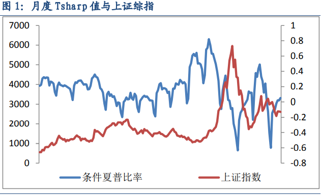

Tsharp 值与上证综指的相关系数为-0.485。将 Tsharp 值为解释变量，分别对上证综指的超额收益和上证综指的滞后项进行回归结果如下表1所示。可见月度 Tsharp 值对上证综指超额收益和上证综指的滞后项都存在有效的预测作用。且月度 Tsharp 值对上证综指的滞后项回归系 数为负，这也说明了两者的**负相关性**。

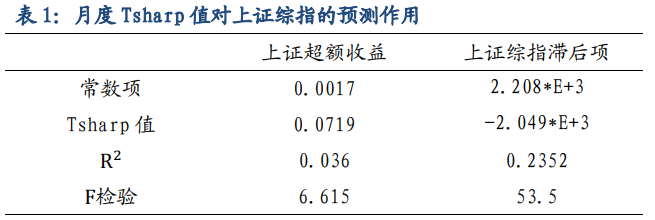

### 2、季度Tsharp值

与月度计算 Tsharp 值类似，把样本数据换为 1996 年 1 月到 2010 年 8 月的季度数据，共 58 个样本点。得到模型的回归参数如表 3 所示。 图 2 为 1996 年 1 月到 2010 年 8 月季度 Tsharp 值与上证综指走势图，由图 2 可见，季度 Tsharp 值与上证综指的走势也相反。

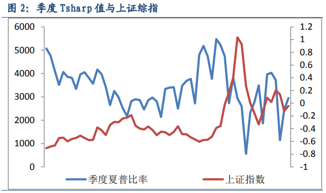

通过计算得到这两个序列的相关系数为-0.4015。将得到的 Tsharp 值为解释变量，分别对上证综指的超额收益和上证综指的滞后项进行回归结果如表 2 所示。可见季度 Tsharp 值对上证综指超额收益和上证综 指的滞后项也都存在着有效的预测作用。且季度 Tsharp 值对上证综指 的滞后项回归系数为负，这也说明了两者的**负相关性**。

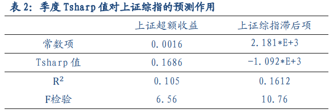

## 三、基于 Tsharp 值的择时策略

本文设计策略决策过程如下： 首先计算预测 Tsharp 值。观察模型我们可以发现若要预测 t+1 期 的 Tsharp 值，我们只需选取一定的预测期 n，回归模型需要的数据为$\mathrm{R}_{\mathrm{t}} \cdot \mathrm{R}_{\mathrm{t}-1} \ldots \ldots \mathrm{R}_{\mathrm{t}-\mathrm{n}+1}$和$X_{t-1} \cdot X_{t-2} \ldots \ldots X_{t-n}$，其中$X_{t-1}$为 t-1 时刻的解释变量矩阵，$R_{t}$为 t 时刻指数的收益率。利用上述数据回归得到$\beta$和$\gamma$。利用公式 3 以及$X_{t}$就可得到 t+1 期预测 Tsharp 值。

然后选取最优阀值。由于当 Tsharp 值越大，表示此刻指数处于低位，未来有上涨可能，反之 Tsharp 值越小，表示指数处于高位，未来有下跌风险。

所以我们的策略选取为——当预测条件夏普比率高于某一阀值 a 时，我们把现金全部买入指数；当预测条件夏普比率低于某一阀值 b(a>b)时，我们把指数全部卖出，换取现金。**分别以累计收益和买卖胜率作为优化目标，获得最优的阀值（a,b）。最后，在确定的最优阀值（a,b）的条件下，考查投资收益并与同期上证综指的收益对比。**

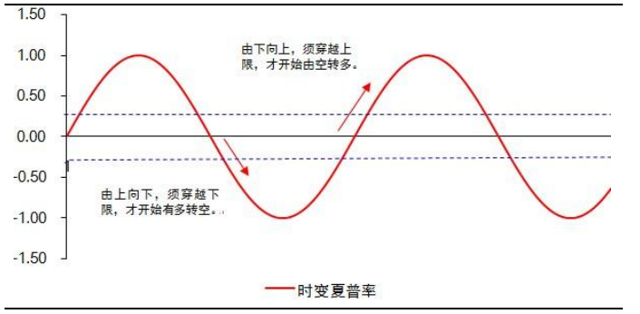

### 1、以月度为频率的 Tsharp 值策略

由于预测期 n 不同，对同一时间点的预测可能由于回归误差等的 原因导致得到的预测夏普比率不同，正如图 3 所示，当预测期 n 越大， 我们的预测越准确。图 3 为在不同的预测周期下得到的 Tsharp 值。

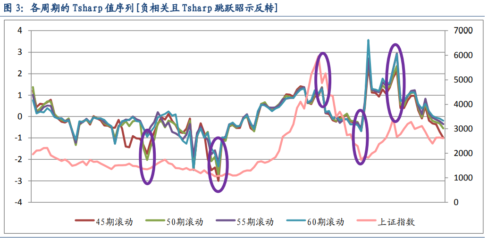

**从上图中我们发现，每当 Tsharp 跳跃时，大盘反转的几率非常大， 几乎每次 Tsharp 跳跃，大盘都会做出回应。由此 Tsharp 值跳跃将作为我们判断大盘的趋势与反转的重大信号！**下面我们以预测期 n=60 为例。我们选取两种最优投资目标，分别以买卖胜率和累计投资收益作为优化目标，选取最优的阀值结果如表 3 所示。

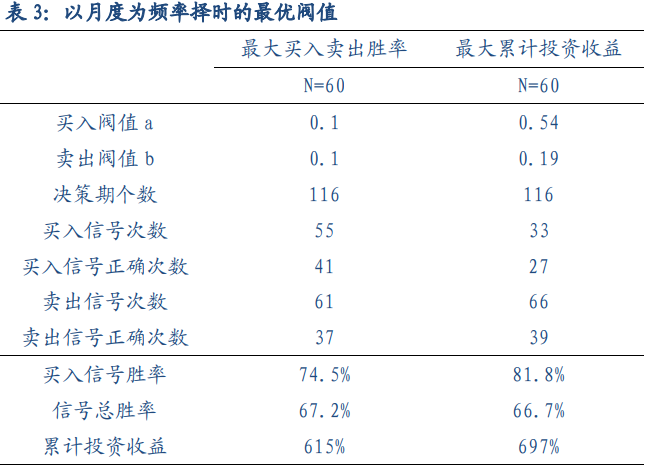

图 4，图 5 表示当预测期 n 为 60 时，两种优化目标下投资收益和 同期上证综指的收益对比。**可见无论是哪种优化目标下得到的最优阀 值，利用预测夏普比率择时的累计收益都远远高于同期上证综指的收益。**

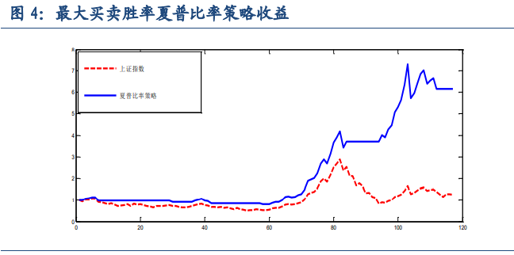
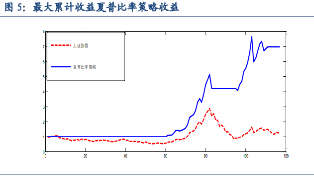

我们以得到的预测 Tsharp 值为解释变量，对上证综指的超额收益 进行回归结果如表所示。可见月度条件夏普比率对上证综指超额收益回 归系数为正。所以当预测夏普比率越大时，我们对市场的看多程度也就 越大；反之亦然。

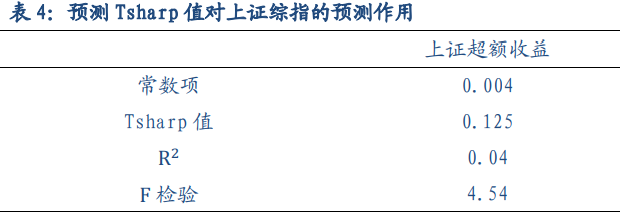

综上，在对月度进行择时时，我们建议以最大化累计收益为优化 目标。即买入卖出阀值为（0.54,0.19）。且预测 Tsharp 值越大，我们 对市场的看多程度也就越大。

### 2、以季度为频率的 Tsharp 值策略

表 5 为预测期为 24 时，两种优化目标下的最优阀值。可见，若选 择买入卖出胜率为优化目标，可以设定最优阀值为（0.43，0.43），样 本期内共发出买入信号 14 次，卖出信号 20 次。其中，买入信号成功 11 次，胜率为 78.6%；卖出信号成功 14 次。累积收益 658%，同期长期 持有指数累积收益 136%。若选取累积收益为优化目标，可以设定最优 阀值为（0.6，0.6），样本期内共发出买入信号 12 次，卖出信号 22 次。 其中，买入信号成功 10 次，胜率为 83.3%；卖出信号成功 15 次。累积 收益 734%，同期长期持有指数累积收益 136%。

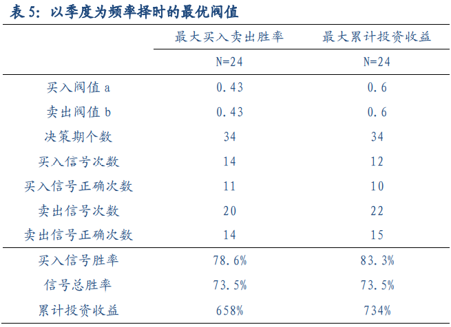

图 6,7 表示当预测期为 24 时，两种优化目标下投资收益和同期上证 综指的收益率对比。可见无论是哪种优化目标下得到的最优阀值，利用 预测夏普比率作择时指标的累计收益都远远高于同期上证综指的收益。

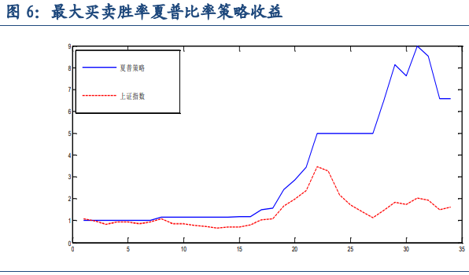
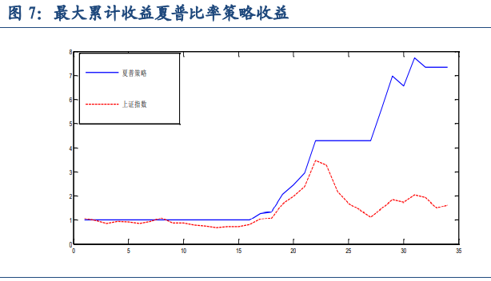

与月度分析方法类似，我们以得到的季度预测 Tsharp 值为解释变 量，分别对上证综指的超额收益进行回归结果如表所示。可见季度时变夏普比率对上证综指超额收益回归系数为正。所以当预测夏普比率越大 时，我们对市场的看多程度也就越大；反之亦然。

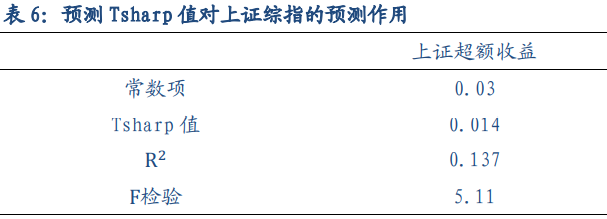

综上，在以季度为择时频率时，我们建议以累计收益为优化目标。 即买入卖出阀值为（0.6,0.6）。**且预测夏普比率越大时，我们对市场 的看多程度也就越大。**

## **参考文献：**

[1] Whitelaw, R., 1994, “Time Variations and Covariations in the Expectation  and Volatility of Stock Market Returns," Journal of Finance, 49, 515-541.

[2] 国海证券. 新量化择时指标之二 Tsharp：时变夏普比率把握长中短趋势，20101028

[新量化择时指标之二 Tsharp：时变夏普比率把握长中短趋势.pdf](https://uploader.shimo.im/f/IIean5cUJe5uLshy.pdf?fileGuid=YHjgrXJ8k8pDyjG6)

[3] 国信证券. 金融工程专题研究——时变夏普率的择时策略，20120726

[20120726-国信证券-金融工程专题报告：时变夏普的择时策略.pdf](https://uploader.shimo.im/f/H67RubeSWZAVK6Rr.pdf?fileGuid=YHjgrXJ8k8pDyjG6)

