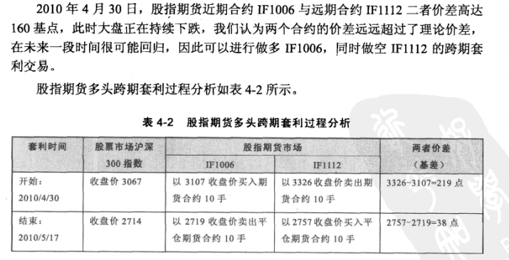
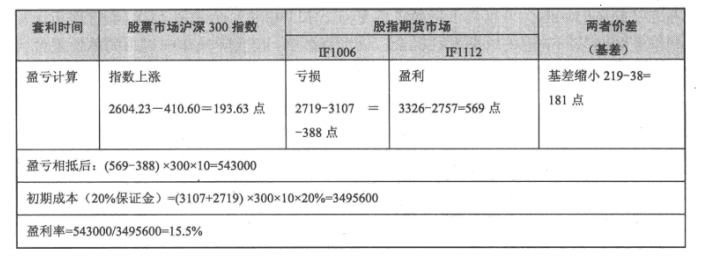
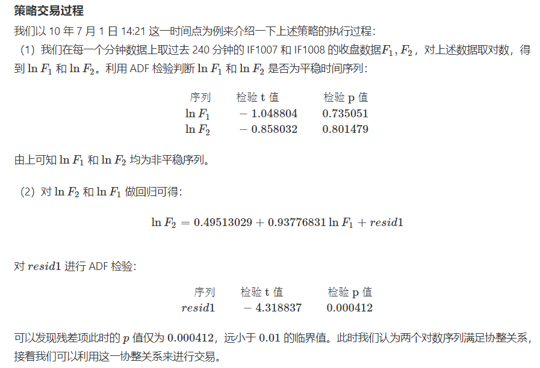
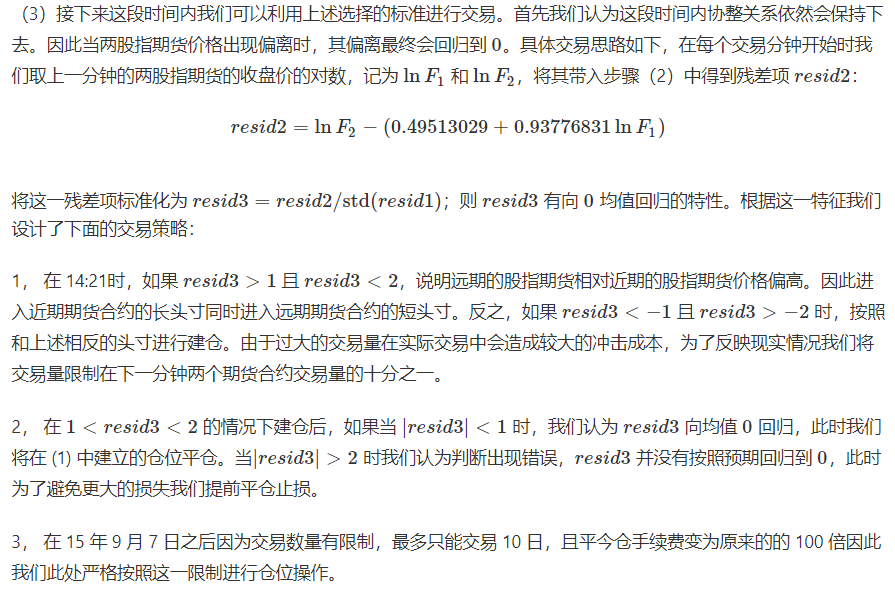
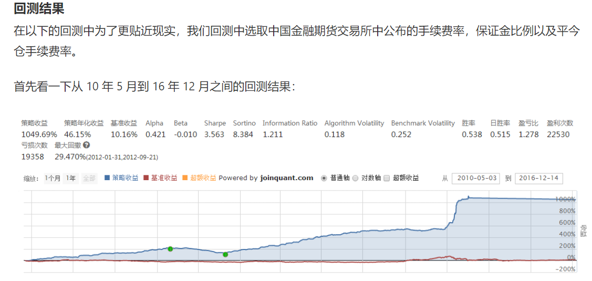
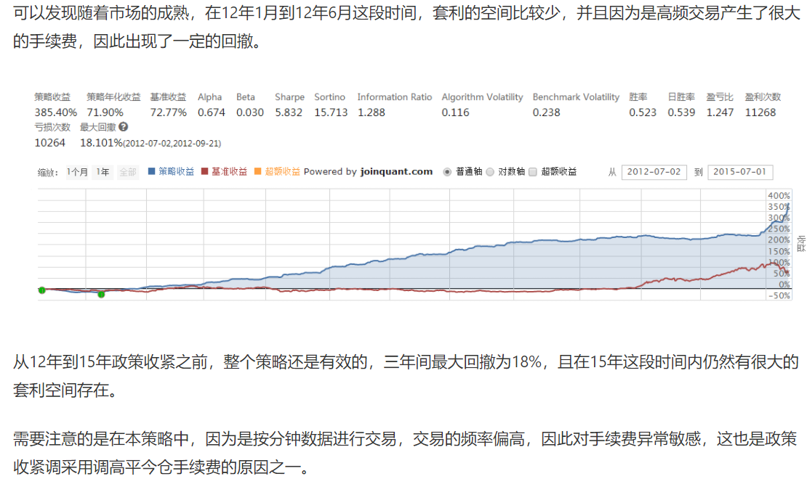

# 4.3  跨期套利

## 4.3.1  基本介绍

股指期货的跨期套利，是指利用两个不同交割月份的股指期货合约之间的价差进行的套利交易。一般来说，相同标的指数的股指期货在市场上会有不同交割月的若干合约同时在交易，不同交割日期合约间的价差应该是稳定的，一旦价差发生了变化，则会产生跨期套利机会。

跨期套利不是无风险套利，它属于价差套利，投资者需要对不同到期月的期货合约的价差做出预测，具有投机性。跨期套利的操作重点在于判断不同到期月合约的价差将来是扩大还是缩小，而不是整个市场的未来走势。

**均衡价差计算公式**
$$
F(t,T_2)=F(t,T_1)e^{f(T_2-T_1)}+\Delta D
$$

$$
T_1为近期合约到期日，T_2为远期合约到期日\\
F(t,T_1):到期日为T_1的近月合约在t期的价格\\
F(t,T_2):到期日为T_2的次近月合约在t期的价格\\
f：T_1到T_2的无风险利率(年利率根据时间期间换算)\\
\Delta D:同一标的指数不同交割月合约的均衡价差
$$

股指期货的同一标的指数的两个不同交割月期货合约之间存在一个均衡价差，跨期套利的成功率和收益率与该均衡价差的确定密切相关，但这一均衡价差并非固定不变的。现实中，它除受到利率影响外，还受到诸多其他市场因素的影响，如股票现货交易的活跃程度、宏观经济政策变化、市场冲击成本及投资者预期和情绪等众多因素。因而即使是同一标的指数的任意两个不同交割月合约的均衡价差也各不相同，甚至同一标的指数的两个交割月合约在不同时期的均衡价差也并不一致。

## 4.3.2  无套利区间

近远月合约组合的无套利价差：
$$
TM(合约价差)=F(t,T_2)-F(t,T_1)e^{f(T_2-T_1)}\\
TM<-\frac{4C_1+C_2} M +\Delta D \ 触发卖出套利：买入近月合约、卖出远月合约\\
TM>\frac{4C_1+C_2} M +\Delta D \ 触发买进套利：买入远月合约合约、卖出近月合约\\
-\frac{4C_1+C_2} M +\Delta D \leq TM \leq \frac{4C_1+C_2} M +\Delta D\ 无套利价差区间，反向平仓\\
4C_1是买卖两份期货合约的费用 \  C_2是两合约买卖双边冲击成本之和
$$

### 案例1

在这个案例中，没有采用上述公式中的复利价差，而是直接采用了简单价差$F(t,T_2)-F(t,T_1)$，相比于复利价差，简单价差更直观。





（初期成本3107+3326？）

### 案例2

股指期货的两个不同期货合约因为对应的同一个股票指数，所以存在着长期协整关系的基础。依据配对交易的思想，基于协整的股指期货套利的核心在于准确发现价差交易出现的时机和概率，该案例应用协整方法来构建不同到期月份合约价格序列的长期均衡关系，估计价差序列的分布，从而制定恰当的价差交易策略。

跨期套利不是无风险套利，它实际上属于价差套利交易，所以其操作重点在于判断不同交割月份合约的价差将来是扩大还是缩小。

传统的股指期货跨期套利依据**股指期货的持有成本定价公式产生的无套利空间**确定跨期套利策略如下：
$$
LN F_{2}-LN F_{1}=(r-q)\left(T_{2}-T_{1}\right)\\
其中：r是无风险利率，q是股息收益率？？？
$$
牛市（多头）跨期套利：远期合约相对近期合约被低估，$F_2$偏小，存在套利空间，在套利的驱使下，$F_2$将回归正常，即$F_2$ 将变大）价差将扩大，我们可以买入远期合约的同时卖出近期合约。

熊市（空头）跨期套利：即判断近期合约相对远期合约被低估，价差将缩小，我们可以买入近期合约的同时卖出远期合约。

如不考虑交易费用， 则 $(r−q)(T_2−T_1)$是两对数序列的价差的平衡点，则当这两对数序列的价差大于 $(r−q)(T_2−T_1)$时，说明价差偏大，价差将缩小，则实行空头策略，反之，则实行多头策略。然而这一模型存在如下缺陷：

①基于持有成本理论中的股息收益率q不易确定，限制了其应用;
②基于持有成本理论的套利往往需要经历较长时间才能完成，因为它的价差会一直处于偏高或偏低的状态，只有在合约临近到期时才有回归的压力。

#### **使用协整模型**

基于协整（非平稳序列的线性组合是平稳序列）的跨期套利模型则可以避免上面的缺陷，并且可以充分利用已有的市场交易数据所提供的最新信息，从而发现更多的套利机会。基本思路如下：

假设现有一段时间内的两期货合约序列分别设为近期合约$F_1$和远期合约$F_2$，本案例**先将这段时间分成两段(前一段时间较长)，然后以第一段数据建立模型，第二段数据以第一段数据建好的模型为依据来进行交易**。

一、在第一段数据中，先对两合约序列取对数为$LNF_1$，$LNF_2$，则这两对数序列的协整关系处理可分为两步：首先，检验$LNF_1$，$LNF_2$是否存在单位根；其次，若这两对数序列都存在单位根，那么就检验它们是否存在协整关系，即对它们建立回归方程（$A$,$B$代表方程回归系数，$resid_1$代表回归残差项）：
$$
LNF_2 =A+B\times LNF_1+resid_1
$$
若$resid_1$不含单位根为平稳序列，则两对数序列存在协整关系。

二、接着将这一协整模型结果代入到第二段数据中，并设在这一时点满足上一段时间的回归关系，即：
$$
resid_2=LNF_2-B\times LNF_1-A
$$
而第一段数据中建立的协整模型的残差为 $resid_1$，其样本标准差为 $std(resid_1)$，则再设：
$$
resid_3=resid_2/std(resid_1)
$$
三、可以认为在第一段时间内建立的模型在第二段时间内依然成立，所以$resid_2$和$resid_1$有相同的分布，且都是均值为0的白噪声。由此可知，$resid_2$时刻存在着向均值0回归的内在要求，而不像基于持有成本理论定价的套利策略只有在合约临近到期时价差才有回归的压力，这样的特性使得可以发现更多的套利机会。当$resid_2$的绝对值超过一个样本方差时（也就是当 |$resid_3$|>1 时），可以认为是一个较好的套利机会，但当$resid_2$的绝对值超过两个样本方差（也就是当 $|resid_3|$>2）这样的小概率事件发生时，则往往意味着这两对数序列的协整关系已经不再成立。综上所述，可将开仓平仓的标准如下设定：

当 1<|$resid_3$|<时开仓;
开仓后当 $resid_3$回落到0值时平仓;
开仓后当  |$resid_3$|超过2时认亏平仓。

这样的开仓平仓标准可以确保两对数序列的价差在可控的范围内，而不像基于持有成本理论的套利策略那样：开仓后价差不在可控范围内，可能会向不利方向发展过大从而导致爆仓。

```python
#获取交易信号        
def get_signal(context):
    #取今天交易日期字符串
    day=context.current_dt.strftime('%Y-%m-%d')
    #获取最近相邻两月份过去240分钟的的股指期货价格数据
    df = attribute_history(get_current_month_future(context,'IF'),240,'1m','close')
    df1= attribute_history(get_next_month_future(context,'IF'),240,'1m','close')
    #取出pd.Series数据，后面回归用
    ts = df['close']  # 生成pd.Series对象
    ts1=df1['close']
    # 查看数据格式，并排除数据错误所带来的误差
    #将上述所得数据取对数
    ts_log,ts1_log = np.log(ts),np.log(ts1)
    x1,y1=ts_log.values,ts1_log.values
    #将pd.Series转化为np.array
    x=np.array(x1)
    X=sm.add_constant(x)
    y=np.array(y1)
    results = sm.OLS(y, X).fit()
    resid=y-(results.params[0]+results.params[1]*x)
    #记录残差项
    resid1=pd.Series(resid)
    resid1.dropna(inplace=True)    
    
    if len(resid1)>0:

        #对残差项进行ADF检验，并记录检验p值
        p_value=testStationarity(resid1)['p-value']
        
        print (context.current_dt,p_value)
        #将ADF检验的p临界值设为0.01，当p小于0.01时拒绝原假设，认为序列平稳
        if(p_value<0.01):
            f1,f2=get_current_month_future(context,'IF'),get_next_month_future(context,'IF')
            #取过去1分钟的两相邻月份股市期货收盘价
            df_01=attribute_history(f1,1,'1m',fields='close')
            df_02=attribute_history(f2,1,'1m',fields='close')
            df_1=np.log(df_01)
            df_2=np.log(df_02)
            #带入之前回归得到的方程计算每一分钟的残差resid_2
            resid_2=np.array(df_2)-results.params[0]-results.params[1]*np.array(df_1)
            resid_3=resid_2/resid1.std()
            return resid_3
        else:
            #如果resid_1不平稳，则返回一个较大的数
            return 100
    else:
        return 100
```










