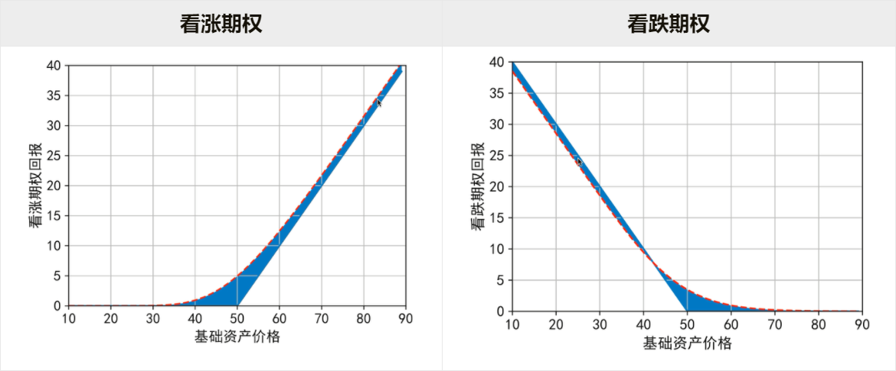

# 1. Black-Scholes期权定价公式
林俊伟 2021.5.22
## 1.1 随机过程与伊藤引理

$S_t$是股票的价格，可以通过随机过程来描述股价的变动：

$$ S_t = S_0 e^{\mu t+ \sigma W_t}$$

根据伊藤引理，可以将其随机微分方程写出：

$$ {dS_t \over S_t} = (\mu + {1 \over 2}\sigma^2)dt + \sigma dW_t $$

对于其衍生品 $Y_t = f(S_t)$

$$ dY_t = {\partial f \over \partial t} + {\partial f \over \partial S_t}dS_t+ {1\over2} {\partial^2f\over\partial S_t^2}(dS_t)^2$$

## 1.2 欧式期权风险中性定价

推导欧式看涨期权风险中性定价，或有回报是:

$$X_T = (S_T - K)^+$$

略去构造鞅过程、复制策略等步骤，这边直接给出金融衍生品的风险中性定价公式：

$$V_t = e^{-r(T-t)}E_Q(X_T|\mathcal{F}_t)$$

然后就可以推导欧式期权的BS公式，其中：

**欧式看涨**

$$
\begin{aligned}
c^E_t &= S_t \Phi(d_1) - Ke^{-r(T-t)} \Phi(d_2) \\
\\
where: d_1 &=  \frac{\ln({S_t \over K})+(r+0.5\sigma^2)(T-t)}{\sigma\sqrt{T-t}},\\
d_2 &=  \frac{\ln({S_t \over K})+(r-0.5\sigma^2)(T-t)}{\sigma\sqrt{T-t}}
\end{aligned}
$$

**欧式看跌**

$$
\begin{aligned}
p^E_t &= Ke^{-r(T-t)} \Phi(-d_2) - S_t \Phi(-d_1)  \\
\\
where: d_1 &=  \frac{\ln({S_t \over K})+(r+0.5\sigma^2)(T-t)}{\sigma\sqrt{T-t}},\\
d_2 &=  \frac{\ln({S_t \over K})+(r-0.5\sigma^2)(T-t)}{\sigma\sqrt{T-t}}
\end{aligned}
$$

观察公式可以发现，只要输入标的资产价格、执行价、距执行时间、利率、波动率，就可以算出当前期权的理论价格。

但是当前的期权价格是已知的，因此将当前的期权价格、资产价格、执行价、距离执行时间、利率，就可以反推出一个$\sigma$，因此将这个波动率称作**隐含波动率**。

如上图，红色虚线代表的就是通过BS公式拟合的期权的价格，蓝色部分是时间价值；折线是内在价值，即或有回报，之间的蓝色差额就是时间价值。

## 1.3 欧式期权看跌-看涨公式 (PCP公式)

通过构造无套利资产组合可以得到***PCP公式***

$$c^E_t + Ke^{-r(T-t)}=p^E_t+S_t$$

# 2. 希腊字母
参考昊哥的笔记：https://www.wuhao.ink/zh-cn/greeks/
## 2.1 Delta($\Delta$)

Delta($\Delta$) 是期权价格变化与标的资产价格变化的比率，即

$$
\Delta = {期权价格变动 \over 标的资产价格变动}; \\
or:
\\
\Delta = {\partial V \over \partial S_t }
$$

### **(1)欧式看涨期权的Delta**

$$\Delta_t = {\partial c_t \over \partial S_t} = \Phi(d_1)$$

### **(2)欧式看跌期权的Delta**

$$\Delta_t = {\partial c_t \over \partial S_t} = -\Phi(-d_1)$$

Delta 含义在于他是为了对冲期权而需要持有的股票数量。如果构造一个不受股票市场影响的资产组合，需要在持有期权同时持有- $\Delta$的股票。如果 $\Delta > 0$，那么我们应该卖出股票，反之则需要买入股票。看涨期权的情况下， $\Delta= \Phi(d_1)$恒大于0，如果买入看涨期权，就应该卖出股票进行对冲。在看跌期权的情况下，$\Delta= -\Phi(-d_1)$恒小于0，如果我们买入看跌期权，就应该买进股票而对冲。
除此之外Delta的特性还有(吴昊, 2021)：
-   Delta取值(-1, 1)

-   看涨期权的 Delta 是正值，范围从0到1，期权实值程度越深，其Delta值越大，深度实值看涨期权的Delta会达到0.8以上，深度虚值看涨期权的 Delta会达到0.2以下。
    -   Delta本质上就是斜率，所以看涨期权多头的Delta为正。

-   深度实值期权几乎等价于持有股票，因此期权交易者经常构建深度实值看涨期权以此替代现货多头头寸(多头替代)，相比于直接持有股票，需要的资金量更少，例如，公募基金经常使用该方法流出资金应对赎回需求。

-   平值期权的Delta接近于0.5

## 2.2 Gamma ($\Gamma$)

Gamma是衡量期权Delta相对于标的资产价格的变化率，也即期权理论价值对标的资产价格的二阶导数。

$$\Gamma = {\partial V \over \partial^2 S^2} = {\partial \Delta \over \partial S}$$

通过上面的图片可以发现，看涨或看跌期权的Gamma都大于0。

## 2.3 Theta ($\Theta$)

Theta ($\Theta$)是期权价格变化与时间变化的比率

**看涨期权：**

$$\Theta_t = {\partial c_t\over \partial t}=-{S_t\phi(d_1)\sigma\over2\sqrt{T-t}}-rKe^{-r(T-t)}\Phi(d_2)$$
**看跌期权：**

$$\Theta_t = {\partial c_t\over \partial t}=-{S_t\phi(d_1)\sigma\over2\sqrt{T-t}}+rKe^{-r(T-t)}\Phi(-d_2)$$

## 2.4 Rho($\rho$)
Rho 是期权价格变化与利率变化的比率
欧式看涨期权：

$$\rho_t = {\partial V\over \partial r} = K(T-t)e^{-r(T-t)} \Phi(d_2)$$

## 2.5 Vega
Vega 是期权价格变化与标的资产波动率变化的比率
欧式看涨期权：

$$Vega = {\partial c_t\over \partial \sigma} = S_t \phi(d_1)\sqrt{T-t}$$

**参考目录**
1. 郑振龙, 《金融工程》
2. 吴昊，https://www.wuhao.ink/zh-cn/greeks/
3. 李庆霞，《金融数学》
