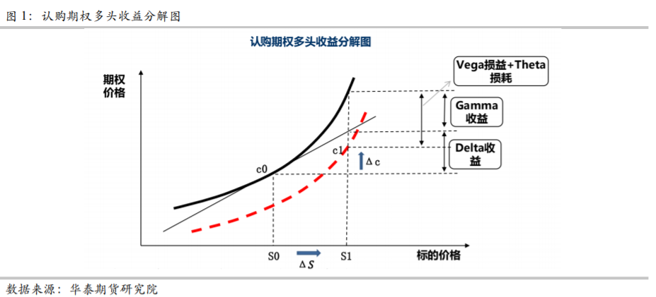

# Delta中性对冲策略
林俊伟 2021.5.22
## 0. Delta 回顾
Delta 值衡量的是当其他参数不变的情况下，标的资产价格变化导致的期权价格变化幅度。从数学角度出发，delta 代表了期权的公允价格对标的资产价格的一阶导数，Delta是S 的函数，同时它也是执行价格和到期时间的函数。由于 Delta 描述的是衍生品价格对标的物价格的敏感度，这样的投资组合是可以被有效对冲的，通过对冲后即形成 Delta 中性的投资组合。

delta 对冲是一个与 delta 中性相关的概念。这种对冲描述的是保持投资组合的 **delta 尽可能等于或接近零**的过程。维持零 delta 在实际操作中的难度较大。这是由于当标的资产的价格变化很大时，再次对冲的风险较高。此外，研究表明频繁的对冲会导致投资组合的低现金流。

## 1. 等量对冲策略 
等量对冲策略是最简单的<u>**套期保值**</u>

指期权市值与现货市值按照 1∶1 的比例进行对冲的方式。该策略在完成建仓后，一般只需要在期权即将到期时进行展期操作即可，通常在展期时仍选择同一类型（行权价）的期权。整个套期保值期间的套头比始终保持 1∶1 的关系。

常见的等量对冲策略是**备兑看涨期权策略**（Covered call）和**保护性看跌期权策略**（Protective Put），相关的

## 2. 静态对冲策略
\
静态策略与等量对冲策略在基本操作上几乎相同，在持有期权期间不进行调整头寸的操作。唯一不同的是等量策略的对冲比例是1：1，该策略的对冲比例为**1∶delta**，且在展期的时候，应根据变化后的**delta** 来计算对冲比例。一般来说投资者可以通过调整期权持有量来满足该比例，同时也可通过调整现货或期货头寸来实现。由此可见相对于等量对冲策略，静态 delta 中性对冲策略更为复杂，不过从理论上也更能规避价格风险。

## **3. 动态对冲策略**
\
动态对冲策略（Dynamic Hedging）则在静态对冲的基础上更进一步，是更为精细化的规避价格风险的方式。我们不仅在展期时考虑 delta 的变化，同时在非展期期间，若现货价格的变化超过一定阈值，或是每隔固定的若干分钟就重新计算一次组合的 delta，一般业界内30分钟就会调整一次Delta。一般最常见的方法是Gamma Scalping 

### **Gamma Scalping**
\
华泰证券研报：通过动态对冲规避掉标的物价格（Delta）对投资组合的影响后，则能将交易策略的重心转移到波动率和时间维度上（Gamma、Theta 和 Vega），通过判断隐含波动率（Implied Vol）与未来的已实现波动率（Realized Vol）之间的相对低估或是高估，则有机会通过买入期权+使用标的物动态对冲来实现做多波动率的策略，可以在较低的承担较低的时间价值（Theta）损耗下获取可观的高抛低吸（Gamma）的收入；或是通过卖出期权+使用标的物动态对冲来实现做空波动率的策略，即在承担一定低卖高买的对冲成本（Gamma）的情况下来获取期权流逝的时间价值（Theta）。

这种建立在动态 Delta 对冲的基础上，通过比较隐含波动率与未来已实现波动率大小的方式，以单位 Theta 的时间损耗交换若干 Gamma的策略，称之为 ***Gamma Scalping***

---
\
### **数学推导**

将期权的收益进行泰勒展开，我们可以得到以下期权收益归因方程，其中$\sigma_{iv}$是隐含波动率:

$$\Delta PnL = \Delta S \times Delta + 1/2 \times \Delta S^2 \times Gamma + \Delta t \times Theta + \Delta \sigma_{iv} \times Vega$$

这就是常说的期权收益归因，即期权的Delta收益、Gamma收益、Vega收益、Theta收益：
$$OptionPnL = Delta PnL + Gamma PnL + Vega PnL + Theta PnL + ...$$

而我们的动态对冲，就是想要将delta的影响因素抵消，因此需要通过调整组合，使得Delta = 0，这时：

$$\Delta PnL = 1/2 \times \Delta S^2 \times Gamma + \Delta t \times Theta + \Delta \sigma_{iv} \times Vega$$

由于Theta 与Gamma之间有稳定的负相关关系：
$$Theta \approx -1/2 \times \sigma_{iv} \times S^2 \times Gamma$$

所以可以将上面的式子改写如下，其中$S$表示标的资产的价格，$\Delta S/S$表示未来的真实波动率：

$$\Delta PnL = 1/2 \times S^2 \times Gamma \times(({ \Delta S \over S})^2 - \sigma_{iv} \times \Delta t)+ \Delta \sigma_{iv} \times Vega$$

所以当$(\Delta S /S)^2 >\sigma_{iv}^2$时，即未来的真实波动率大于隐含波动率时，做多Gamma就可以盈利，反之做空

---
\
### **50ETF动态对冲方案设计**
本篇参考华泰证券研报，给出了一个动态对冲的具体方案。

本篇通过买入看跌期权并买入该看跌期权的Delta*-10000份50ETF的方式(50ETF合约乘数为10000，即1张合约=10000份ETF)，构建在Delta中性下做空波动率的头寸。

1. 若是要***做多波动率***：以周为单位，每周一开盘时买入当时的平值看跌期权，并根据该合约的Delta，买入Delta*-10000份50ETF。比如50ETF周一的开盘价为2.551，于是买入1手50ETF沽10月2.55。若其Delta为-0.49，就买入4900股的50ETF。

2. 若是要***做空波动率***：以周为单位，每周一开盘时卖出当时的平值看跌期权，并根据该看合约的Delta，买入Delta*10000份50ETF。比如50ETF周一的开盘价为2.551，于是买入1手50ETF购10月2.55。若其Delta为0.51，就买入5100股的50ETF。

3. 调仓方式采用5分钟一次的动态对冲，即建仓后没过去5分钟，重新计算目前持仓的Delta，若Delta出现变化，就根据最新计算出的Delta，调整持有的50ETF头寸。譬如在做多波动率的情况下，持有看跌期权多头与 50ETF 多头。在周一早上 9:35
分，由于 50ETF 下跌，带动看跌期权的 Delta 由-0.49 变动为-0.50，此时缺口为-0.50*-10000-4900=100 股，即买入 100 股 50ETF，此时持仓为 5000 股 50ETF。而在随后的 9:40分，50ETF 大幅上行，看跌期权的 Delta 变为-0.45，Delta 缺口为-0.45*-10000-5000=-500股，即卖出 500 股 ETF。对冲一直持续至本周最后一个交易日收盘。

4. 盈亏表现将会是：
    - 在真实波动率**等于**隐含波动率，且隐含波动率**不发生变动**的情况下，Gamma 盈亏将于 Theta 盈亏相抵消，而 Vega 盈亏将等于 0，整体组合盈亏也将正好为 0。
    
    - 若整周的真实波动率**大于**周一开盘时的隐含波动率，且隐含波动率**上行**，做多波动率的 Gamma 收益将大于 Theta 损失，且将获得额外的 Vega 收益，组合将获得显著正收益。
    
    - 若整周的真实波动率**小于**周一开盘时的隐含波动率，且隐含波动率**下行**，做空波动率的 Theta 收益将大于 Gamma 损失，且将获得额外的 Vega 收益，组合同样能获得正收益。

---
\
### **对冲方法**

要消除delta的影响，最好的方法就是实时计算delta，随时调仓，但是因为交易成本的存在，这样显然不科学。因此一般有以下几种对冲方法：

- **定时对冲**：约定每天的某一时刻（往往收盘前）进行对冲，这种对冲是日频率的对冲。当然也可以以小时为频率，N分钟为频率。这种对冲方法，有一个缺点。有时候股票1天波动1%，有时候波动9%，等到价格波动9%的时候再去对冲，就会造成很大的Gamma损失。

- **阈值对冲**：当价格的变化幅度变化到一定程度的时候，触发一次对冲。这个触发时根据delta的偏离值确定的。比如说，现在delta为0.5，股票仓位为50%。股价上涨，delta增加。仓位和delta值相差超过阈值5%，则触发对冲。这种对冲方法依然有一定问题，就是在高gamma区间，delta的变动会非常敏感，很容易就触发5%的阈值，那么在高gamma和低gamma区间都采用相同的5%显然不合理。

- **Whally-Wilmott渐进解对冲**：在高gamma区间，我们的阀值宽松一些，在低gamma区间，阀值收紧一些。这样做出在对冲锁定风险和交易费用之间做出一个平衡。这就是whally-wilmott的思想。Whally-Wilmott的具体公式见程序。

**参考目录**
1. 华泰证券研报, https://www.htfc.com/wz_upload/png_upload/20181106/1541495683388977512.pdf

2. 场外期权对冲策略回测框架-（以Whally-Wilmott为例）, https://www.joinquant.com/view/community/detail/81ea30f9f7030c4af1600e2f16881764?type=1
