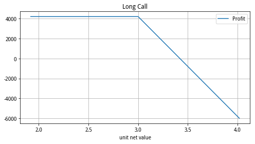
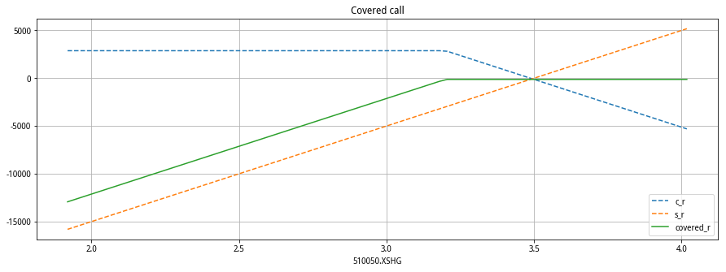
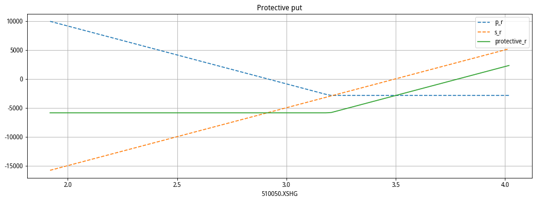
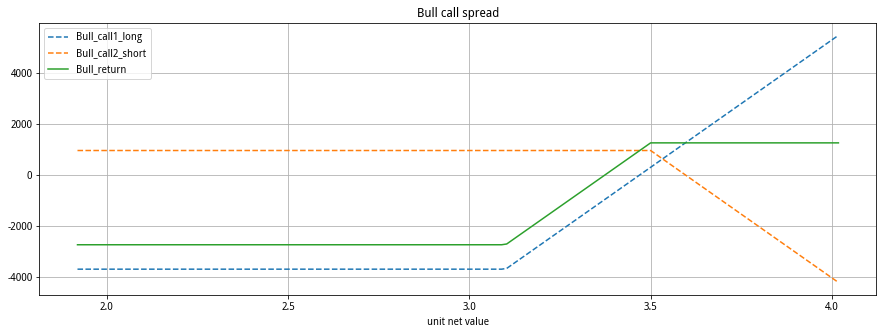
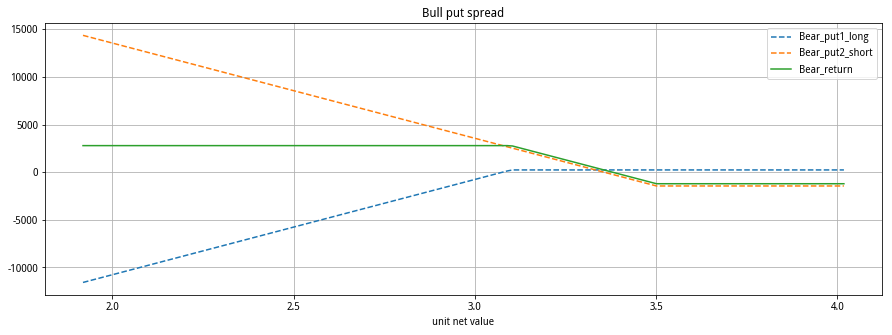
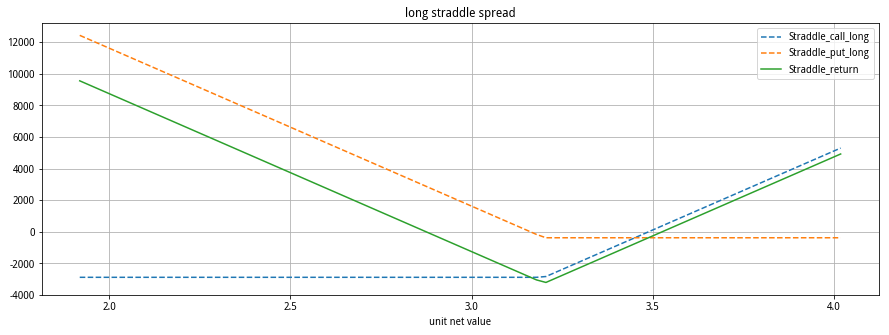
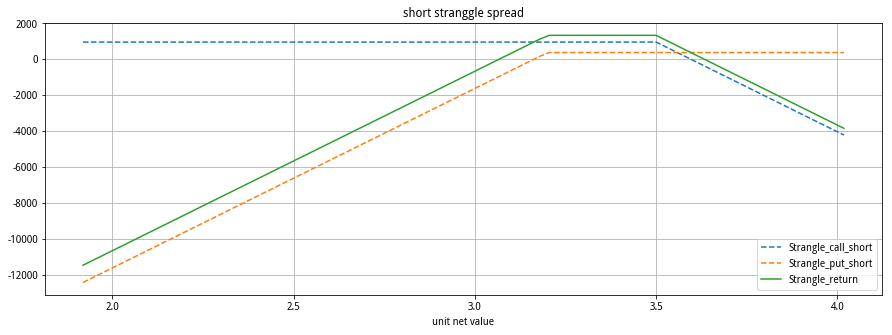
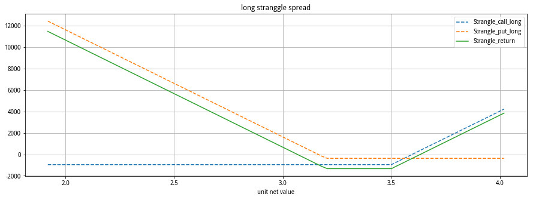

```python
import pandas as pd
import numpy as np
import datetime as dt
import matplotlib.pyplot as plt
from jqdata import *
from pyecharts.charts import *
from pylab import mpl
mpl.rcParams['font.sans-serif']=['SimHei']
mpl.rcParams['axes.unicode_minus']=False
# from pyecharts import options as opts
pd.set_option('display.max_columns', 500) # 打印最大列数
pd.set_option('display.max_rows',1000) # 打印最大列数
```

# 1 期权数据读取及处理


```python
# 所有期权合约
df1 = get_all_securities('options',date=None)
df1
```


<div>
<style scoped>
    .dataframe tbody tr th:only-of-type {
        vertical-align: middle;
    }

    .dataframe tbody tr th {
        vertical-align: top;
    }

    .dataframe thead th {
        text-align: right;
    }
</style>
<table border="1" class="dataframe">
  <thead>
    <tr style="text-align: right;">
      <th></th>
      <th>display_name</th>
      <th>name</th>
      <th>start_date</th>
      <th>end_date</th>
      <th>type</th>
    </tr>
  </thead>
  <tbody>
    <tr>
      <th>10000001.XSHG</th>
      <td>10000001.XSHG</td>
      <td>10000001.XSHG</td>
      <td>2015-02-09</td>
      <td>2015-03-25</td>
      <td>options</td>
    </tr>
    <tr>
      <th>10000002.XSHG</th>
      <td>10000002.XSHG</td>
      <td>10000002.XSHG</td>
      <td>2015-02-09</td>
      <td>2015-03-25</td>
      <td>options</td>
    </tr>
    <tr>
      <th>10000003.XSHG</th>
      <td>10000003.XSHG</td>
      <td>10000003.XSHG</td>
      <td>2015-02-09</td>
      <td>2015-03-25</td>
      <td>options</td>
    </tr>
    <tr>
      <th>10000004.XSHG</th>
      <td>10000004.XSHG</td>
      <td>10000004.XSHG</td>
      <td>2015-02-09</td>
      <td>2015-03-25</td>
      <td>options</td>
    </tr>
    <tr>
      <th>10000005.XSHG</th>
      <td>10000005.XSHG</td>
      <td>10000005.XSHG</td>
      <td>2015-02-09</td>
      <td>2015-03-25</td>
      <td>options</td>
    </tr>
    <tr>
      <th>10000006.XSHG</th>
      <td>10000006.XSHG</td>
      <td>10000006.XSHG</td>
      <td>2015-02-09</td>
      <td>2015-03-25</td>
      <td>options</td>
    </tr>
    <tr>
      <th>10000007.XSHG</th>
      <td>10000007.XSHG</td>
      <td>10000007.XSHG</td>
      <td>2015-02-09</td>
      <td>2015-03-25</td>
      <td>options</td>
    </tr>
    <tr>
      <th>10000008.XSHG</th>
      <td>10000008.XSHG</td>
      <td>10000008.XSHG</td>
      <td>2015-02-09</td>
      <td>2015-03-25</td>
      <td>options</td>
    </tr>
    <tr>
      <th>10000009.XSHG</th>
      <td>10000009.XSHG</td>
      <td>10000009.XSHG</td>
      <td>2015-02-09</td>
      <td>2015-03-25</td>
      <td>options</td>
    </tr>
    <tr>
      <th>10000010.XSHG</th>
      <td>10000010.XSHG</td>
      <td>10000010.XSHG</td>
      <td>2015-02-09</td>
      <td>2015-03-25</td>
      <td>options</td>
    </tr>
    <tr>
      <th>10000011.XSHG</th>
      <td>10000011.XSHG</td>
      <td>10000011.XSHG</td>
      <td>2015-02-09</td>
      <td>2015-04-22</td>
      <td>options</td>
    </tr>
    <tr>
      <th>10000012.XSHG</th>
      <td>10000012.XSHG</td>
      <td>10000012.XSHG</td>
      <td>2015-02-09</td>
      <td>2015-04-22</td>
      <td>options</td>
    </tr>
    <tr>
      <th>10000013.XSHG</th>
      <td>10000013.XSHG</td>
      <td>10000013.XSHG</td>
      <td>2015-02-09</td>
      <td>2015-04-22</td>
      <td>options</td>
    </tr>
    <tr>
      <th>10000014.XSHG</th>
      <td>10000014.XSHG</td>
      <td>10000014.XSHG</td>
      <td>2015-02-09</td>
      <td>2015-04-22</td>
      <td>options</td>
    </tr>
    <tr>
      <th>10000015.XSHG</th>
      <td>10000015.XSHG</td>
      <td>10000015.XSHG</td>
      <td>2015-02-09</td>
      <td>2015-04-22</td>
      <td>options</td>
    </tr>
    <tr>
      <th>10000016.XSHG</th>
      <td>10000016.XSHG</td>
      <td>10000016.XSHG</td>
      <td>2015-02-09</td>
      <td>2015-04-22</td>
      <td>options</td>
    </tr>
    <tr>
      <th>10000017.XSHG</th>
      <td>10000017.XSHG</td>
      <td>10000017.XSHG</td>
      <td>2015-02-09</td>
      <td>2015-04-22</td>
      <td>options</td>
    </tr>
    <tr>
      <th>10000018.XSHG</th>
      <td>10000018.XSHG</td>
      <td>10000018.XSHG</td>
      <td>2015-02-09</td>
      <td>2015-04-22</td>
      <td>options</td>
    </tr>
    <tr>
      <th>10000019.XSHG</th>
      <td>10000019.XSHG</td>
      <td>10000019.XSHG</td>
      <td>2015-02-09</td>
      <td>2015-04-22</td>
      <td>options</td>
    </tr>
    <tr>
      <th>10000020.XSHG</th>
      <td>10000020.XSHG</td>
      <td>10000020.XSHG</td>
      <td>2015-02-09</td>
      <td>2015-04-22</td>
      <td>options</td>
    </tr>
    <tr>
      <th>10000021.XSHG</th>
      <td>10000021.XSHG</td>
      <td>10000021.XSHG</td>
      <td>2015-02-09</td>
      <td>2015-06-24</td>
      <td>options</td>
    </tr>
    <tr>
      <th>10000022.XSHG</th>
      <td>10000022.XSHG</td>
      <td>10000022.XSHG</td>
      <td>2015-02-09</td>
      <td>2015-06-24</td>
      <td>options</td>
    </tr>
    <tr>
      <th>10000023.XSHG</th>
      <td>10000023.XSHG</td>
      <td>10000023.XSHG</td>
      <td>2015-02-09</td>
      <td>2015-06-24</td>
      <td>options</td>
    </tr>
    <tr>
      <th>10000024.XSHG</th>
      <td>10000024.XSHG</td>
      <td>10000024.XSHG</td>
      <td>2015-02-09</td>
      <td>2015-06-24</td>
      <td>options</td>
    </tr>
    <tr>
      <th>10000025.XSHG</th>
      <td>10000025.XSHG</td>
      <td>10000025.XSHG</td>
      <td>2015-02-09</td>
      <td>2015-06-24</td>
      <td>options</td>
    </tr>
    <tr>
      <th>10000026.XSHG</th>
      <td>10000026.XSHG</td>
      <td>10000026.XSHG</td>
      <td>2015-02-09</td>
      <td>2015-06-24</td>
      <td>options</td>
    </tr>
    <tr>
      <th>10000027.XSHG</th>
      <td>10000027.XSHG</td>
      <td>10000027.XSHG</td>
      <td>2015-02-09</td>
      <td>2015-06-24</td>
      <td>options</td>
    </tr>
    <tr>
      <th>10000028.XSHG</th>
      <td>10000028.XSHG</td>
      <td>10000028.XSHG</td>
      <td>2015-02-09</td>
      <td>2015-06-24</td>
      <td>options</td>
    </tr>
    <tr>
      <th>10000029.XSHG</th>
      <td>10000029.XSHG</td>
      <td>10000029.XSHG</td>
      <td>2015-02-09</td>
      <td>2015-06-24</td>
      <td>options</td>
    </tr>
    <tr>
      <th>10000030.XSHG</th>
      <td>10000030.XSHG</td>
      <td>10000030.XSHG</td>
      <td>2015-02-09</td>
      <td>2015-06-24</td>
      <td>options</td>
    </tr>
    <tr>
      <th>10000031.XSHG</th>
      <td>10000031.XSHG</td>
      <td>10000031.XSHG</td>
      <td>2015-02-09</td>
      <td>2015-09-23</td>
      <td>options</td>
    </tr>
    <tr>
      <th>10000032.XSHG</th>
      <td>10000032.XSHG</td>
      <td>10000032.XSHG</td>
      <td>2015-02-09</td>
      <td>2015-09-23</td>
      <td>options</td>
    </tr>
    <tr>
      <th>10000033.XSHG</th>
      <td>10000033.XSHG</td>
      <td>10000033.XSHG</td>
      <td>2015-02-09</td>
      <td>2015-09-23</td>
      <td>options</td>
    </tr>
    <tr>
      <th>10000034.XSHG</th>
      <td>10000034.XSHG</td>
      <td>10000034.XSHG</td>
      <td>2015-02-09</td>
      <td>2015-09-23</td>
      <td>options</td>
    </tr>
    <tr>
      <th>10000035.XSHG</th>
      <td>10000035.XSHG</td>
      <td>10000035.XSHG</td>
      <td>2015-02-09</td>
      <td>2015-09-23</td>
      <td>options</td>
    </tr>
    <tr>
      <th>10000036.XSHG</th>
      <td>10000036.XSHG</td>
      <td>10000036.XSHG</td>
      <td>2015-02-09</td>
      <td>2015-09-23</td>
      <td>options</td>
    </tr>
    <tr>
      <th>10000037.XSHG</th>
      <td>10000037.XSHG</td>
      <td>10000037.XSHG</td>
      <td>2015-02-09</td>
      <td>2015-09-23</td>
      <td>options</td>
    </tr>
    <tr>
      <th>10000038.XSHG</th>
      <td>10000038.XSHG</td>
      <td>10000038.XSHG</td>
      <td>2015-02-09</td>
      <td>2015-09-23</td>
      <td>options</td>
    </tr>
    <tr>
      <th>10000039.XSHG</th>
      <td>10000039.XSHG</td>
      <td>10000039.XSHG</td>
      <td>2015-02-09</td>
      <td>2015-09-23</td>
      <td>options</td>
    </tr>
    <tr>
      <th>10000040.XSHG</th>
      <td>10000040.XSHG</td>
      <td>10000040.XSHG</td>
      <td>2015-02-09</td>
      <td>2015-09-23</td>
      <td>options</td>
    </tr>
    <tr>
      <th>10000041.XSHG</th>
      <td>10000041.XSHG</td>
      <td>10000041.XSHG</td>
      <td>2015-02-10</td>
      <td>2015-03-25</td>
      <td>options</td>
    </tr>
    <tr>
      <th>10000042.XSHG</th>
      <td>10000042.XSHG</td>
      <td>10000042.XSHG</td>
      <td>2015-02-10</td>
      <td>2015-03-25</td>
      <td>options</td>
    </tr>
    <tr>
      <th>10000043.XSHG</th>
      <td>10000043.XSHG</td>
      <td>10000043.XSHG</td>
      <td>2015-02-10</td>
      <td>2015-04-22</td>
      <td>options</td>
    </tr>
    <tr>
      <th>10000044.XSHG</th>
      <td>10000044.XSHG</td>
      <td>10000044.XSHG</td>
      <td>2015-02-10</td>
      <td>2015-04-22</td>
      <td>options</td>
    </tr>
    <tr>
      <th>10000045.XSHG</th>
      <td>10000045.XSHG</td>
      <td>10000045.XSHG</td>
      <td>2015-02-10</td>
      <td>2015-06-24</td>
      <td>options</td>
    </tr>
    <tr>
      <th>10000046.XSHG</th>
      <td>10000046.XSHG</td>
      <td>10000046.XSHG</td>
      <td>2015-02-10</td>
      <td>2015-06-24</td>
      <td>options</td>
    </tr>
    <tr>
      <th>10000047.XSHG</th>
      <td>10000047.XSHG</td>
      <td>10000047.XSHG</td>
      <td>2015-02-10</td>
      <td>2015-09-23</td>
      <td>options</td>
    </tr>
    <tr>
      <th>10000048.XSHG</th>
      <td>10000048.XSHG</td>
      <td>10000048.XSHG</td>
      <td>2015-02-10</td>
      <td>2015-09-23</td>
      <td>options</td>
    </tr>
    <tr>
      <th>10000049.XSHG</th>
      <td>10000049.XSHG</td>
      <td>10000049.XSHG</td>
      <td>2015-02-12</td>
      <td>2015-03-25</td>
      <td>options</td>
    </tr>
    <tr>
      <th>10000050.XSHG</th>
      <td>10000050.XSHG</td>
      <td>10000050.XSHG</td>
      <td>2015-02-12</td>
      <td>2015-03-25</td>
      <td>options</td>
    </tr>
    <tr>
      <th>10000051.XSHG</th>
      <td>10000051.XSHG</td>
      <td>10000051.XSHG</td>
      <td>2015-02-12</td>
      <td>2015-04-22</td>
      <td>options</td>
    </tr>
    <tr>
      <th>10000052.XSHG</th>
      <td>10000052.XSHG</td>
      <td>10000052.XSHG</td>
      <td>2015-02-12</td>
      <td>2015-04-22</td>
      <td>options</td>
    </tr>
    <tr>
      <th>10000053.XSHG</th>
      <td>10000053.XSHG</td>
      <td>10000053.XSHG</td>
      <td>2015-02-12</td>
      <td>2015-06-24</td>
      <td>options</td>
    </tr>
    <tr>
      <th>10000054.XSHG</th>
      <td>10000054.XSHG</td>
      <td>10000054.XSHG</td>
      <td>2015-02-12</td>
      <td>2015-06-24</td>
      <td>options</td>
    </tr>
    <tr>
      <th>10000055.XSHG</th>
      <td>10000055.XSHG</td>
      <td>10000055.XSHG</td>
      <td>2015-02-12</td>
      <td>2015-09-23</td>
      <td>options</td>
    </tr>
    <tr>
      <th>10000056.XSHG</th>
      <td>10000056.XSHG</td>
      <td>10000056.XSHG</td>
      <td>2015-02-12</td>
      <td>2015-09-23</td>
      <td>options</td>
    </tr>
    <tr>
      <th>10000057.XSHG</th>
      <td>10000057.XSHG</td>
      <td>10000057.XSHG</td>
      <td>2015-02-27</td>
      <td>2015-03-25</td>
      <td>options</td>
    </tr>
    <tr>
      <th>10000058.XSHG</th>
      <td>10000058.XSHG</td>
      <td>10000058.XSHG</td>
      <td>2015-02-27</td>
      <td>2015-03-25</td>
      <td>options</td>
    </tr>
    <tr>
      <th>10000059.XSHG</th>
      <td>10000059.XSHG</td>
      <td>10000059.XSHG</td>
      <td>2015-02-27</td>
      <td>2015-04-22</td>
      <td>options</td>
    </tr>
    <tr>
      <th>10000060.XSHG</th>
      <td>10000060.XSHG</td>
      <td>10000060.XSHG</td>
      <td>2015-02-27</td>
      <td>2015-04-22</td>
      <td>options</td>
    </tr>
    <tr>
      <th>10000061.XSHG</th>
      <td>10000061.XSHG</td>
      <td>10000061.XSHG</td>
      <td>2015-02-27</td>
      <td>2015-06-24</td>
      <td>options</td>
    </tr>
    <tr>
      <th>10000062.XSHG</th>
      <td>10000062.XSHG</td>
      <td>10000062.XSHG</td>
      <td>2015-02-27</td>
      <td>2015-06-24</td>
      <td>options</td>
    </tr>
    <tr>
      <th>10000063.XSHG</th>
      <td>10000063.XSHG</td>
      <td>10000063.XSHG</td>
      <td>2015-02-27</td>
      <td>2015-09-23</td>
      <td>options</td>
    </tr>
    <tr>
      <th>10000064.XSHG</th>
      <td>10000064.XSHG</td>
      <td>10000064.XSHG</td>
      <td>2015-02-27</td>
      <td>2015-09-23</td>
      <td>options</td>
    </tr>
    <tr>
      <th>10000065.XSHG</th>
      <td>10000065.XSHG</td>
      <td>10000065.XSHG</td>
      <td>2015-03-17</td>
      <td>2015-03-25</td>
      <td>options</td>
    </tr>
    <tr>
      <th>10000066.XSHG</th>
      <td>10000066.XSHG</td>
      <td>10000066.XSHG</td>
      <td>2015-03-17</td>
      <td>2015-03-25</td>
      <td>options</td>
    </tr>
    <tr>
      <th>10000067.XSHG</th>
      <td>10000067.XSHG</td>
      <td>10000067.XSHG</td>
      <td>2015-03-17</td>
      <td>2015-04-22</td>
      <td>options</td>
    </tr>
    <tr>
      <th>10000068.XSHG</th>
      <td>10000068.XSHG</td>
      <td>10000068.XSHG</td>
      <td>2015-03-17</td>
      <td>2015-04-22</td>
      <td>options</td>
    </tr>
    <tr>
      <th>10000069.XSHG</th>
      <td>10000069.XSHG</td>
      <td>10000069.XSHG</td>
      <td>2015-03-17</td>
      <td>2015-06-24</td>
      <td>options</td>
    </tr>
    <tr>
      <th>10000070.XSHG</th>
      <td>10000070.XSHG</td>
      <td>10000070.XSHG</td>
      <td>2015-03-17</td>
      <td>2015-06-24</td>
      <td>options</td>
    </tr>
    <tr>
      <th>10000071.XSHG</th>
      <td>10000071.XSHG</td>
      <td>10000071.XSHG</td>
      <td>2015-03-17</td>
      <td>2015-09-23</td>
      <td>options</td>
    </tr>
    <tr>
      <th>10000072.XSHG</th>
      <td>10000072.XSHG</td>
      <td>10000072.XSHG</td>
      <td>2015-03-17</td>
      <td>2015-09-23</td>
      <td>options</td>
    </tr>
    <tr>
      <th>10000073.XSHG</th>
      <td>10000073.XSHG</td>
      <td>10000073.XSHG</td>
      <td>2015-03-18</td>
      <td>2015-03-25</td>
      <td>options</td>
    </tr>
    <tr>
      <th>10000074.XSHG</th>
      <td>10000074.XSHG</td>
      <td>10000074.XSHG</td>
      <td>2015-03-18</td>
      <td>2015-03-25</td>
      <td>options</td>
    </tr>
    <tr>
      <th>10000075.XSHG</th>
      <td>10000075.XSHG</td>
      <td>10000075.XSHG</td>
      <td>2015-03-18</td>
      <td>2015-04-22</td>
      <td>options</td>
    </tr>
    <tr>
      <th>10000076.XSHG</th>
      <td>10000076.XSHG</td>
      <td>10000076.XSHG</td>
      <td>2015-03-18</td>
      <td>2015-04-22</td>
      <td>options</td>
    </tr>
    <tr>
      <th>10000077.XSHG</th>
      <td>10000077.XSHG</td>
      <td>10000077.XSHG</td>
      <td>2015-03-18</td>
      <td>2015-06-24</td>
      <td>options</td>
    </tr>
    <tr>
      <th>10000078.XSHG</th>
      <td>10000078.XSHG</td>
      <td>10000078.XSHG</td>
      <td>2015-03-18</td>
      <td>2015-06-24</td>
      <td>options</td>
    </tr>
    <tr>
      <th>10000079.XSHG</th>
      <td>10000079.XSHG</td>
      <td>10000079.XSHG</td>
      <td>2015-03-18</td>
      <td>2015-09-23</td>
      <td>options</td>
    </tr>
    <tr>
      <th>10000080.XSHG</th>
      <td>10000080.XSHG</td>
      <td>10000080.XSHG</td>
      <td>2015-03-18</td>
      <td>2015-09-23</td>
      <td>options</td>
    </tr>
    <tr>
      <th>10000081.XSHG</th>
      <td>10000081.XSHG</td>
      <td>10000081.XSHG</td>
      <td>2015-03-19</td>
      <td>2015-03-25</td>
      <td>options</td>
    </tr>
    <tr>
      <th>10000082.XSHG</th>
      <td>10000082.XSHG</td>
      <td>10000082.XSHG</td>
      <td>2015-03-19</td>
      <td>2015-03-25</td>
      <td>options</td>
    </tr>
    <tr>
      <th>10000083.XSHG</th>
      <td>10000083.XSHG</td>
      <td>10000083.XSHG</td>
      <td>2015-03-19</td>
      <td>2015-04-22</td>
      <td>options</td>
    </tr>
    <tr>
      <th>10000084.XSHG</th>
      <td>10000084.XSHG</td>
      <td>10000084.XSHG</td>
      <td>2015-03-19</td>
      <td>2015-04-22</td>
      <td>options</td>
    </tr>
    <tr>
      <th>10000085.XSHG</th>
      <td>10000085.XSHG</td>
      <td>10000085.XSHG</td>
      <td>2015-03-19</td>
      <td>2015-06-24</td>
      <td>options</td>
    </tr>
    <tr>
      <th>10000086.XSHG</th>
      <td>10000086.XSHG</td>
      <td>10000086.XSHG</td>
      <td>2015-03-19</td>
      <td>2015-06-24</td>
      <td>options</td>
    </tr>
    <tr>
      <th>10000087.XSHG</th>
      <td>10000087.XSHG</td>
      <td>10000087.XSHG</td>
      <td>2015-03-19</td>
      <td>2015-09-23</td>
      <td>options</td>
    </tr>
    <tr>
      <th>10000088.XSHG</th>
      <td>10000088.XSHG</td>
      <td>10000088.XSHG</td>
      <td>2015-03-19</td>
      <td>2015-09-23</td>
      <td>options</td>
    </tr>
    <tr>
      <th>10000089.XSHG</th>
      <td>10000089.XSHG</td>
      <td>10000089.XSHG</td>
      <td>2015-03-23</td>
      <td>2015-03-25</td>
      <td>options</td>
    </tr>
    <tr>
      <th>10000090.XSHG</th>
      <td>10000090.XSHG</td>
      <td>10000090.XSHG</td>
      <td>2015-03-23</td>
      <td>2015-03-25</td>
      <td>options</td>
    </tr>
    <tr>
      <th>10000091.XSHG</th>
      <td>10000091.XSHG</td>
      <td>10000091.XSHG</td>
      <td>2015-03-23</td>
      <td>2015-04-22</td>
      <td>options</td>
    </tr>
    <tr>
      <th>10000092.XSHG</th>
      <td>10000092.XSHG</td>
      <td>10000092.XSHG</td>
      <td>2015-03-23</td>
      <td>2015-04-22</td>
      <td>options</td>
    </tr>
    <tr>
      <th>10000093.XSHG</th>
      <td>10000093.XSHG</td>
      <td>10000093.XSHG</td>
      <td>2015-03-23</td>
      <td>2015-06-24</td>
      <td>options</td>
    </tr>
    <tr>
      <th>10000094.XSHG</th>
      <td>10000094.XSHG</td>
      <td>10000094.XSHG</td>
      <td>2015-03-23</td>
      <td>2015-06-24</td>
      <td>options</td>
    </tr>
    <tr>
      <th>10000095.XSHG</th>
      <td>10000095.XSHG</td>
      <td>10000095.XSHG</td>
      <td>2015-03-23</td>
      <td>2015-09-23</td>
      <td>options</td>
    </tr>
    <tr>
      <th>10000096.XSHG</th>
      <td>10000096.XSHG</td>
      <td>10000096.XSHG</td>
      <td>2015-03-23</td>
      <td>2015-09-23</td>
      <td>options</td>
    </tr>
    <tr>
      <th>10000097.XSHG</th>
      <td>10000097.XSHG</td>
      <td>10000097.XSHG</td>
      <td>2015-03-24</td>
      <td>2015-03-25</td>
      <td>options</td>
    </tr>
    <tr>
      <th>10000098.XSHG</th>
      <td>10000098.XSHG</td>
      <td>10000098.XSHG</td>
      <td>2015-03-24</td>
      <td>2015-03-25</td>
      <td>options</td>
    </tr>
    <tr>
      <th>10000099.XSHG</th>
      <td>10000099.XSHG</td>
      <td>10000099.XSHG</td>
      <td>2015-03-24</td>
      <td>2015-04-22</td>
      <td>options</td>
    </tr>
    <tr>
      <th>10000100.XSHG</th>
      <td>10000100.XSHG</td>
      <td>10000100.XSHG</td>
      <td>2015-03-24</td>
      <td>2015-04-22</td>
      <td>options</td>
    </tr>
    <tr>
      <th>10000101.XSHG</th>
      <td>10000101.XSHG</td>
      <td>10000101.XSHG</td>
      <td>2015-03-24</td>
      <td>2015-06-24</td>
      <td>options</td>
    </tr>
    <tr>
      <th>10000102.XSHG</th>
      <td>10000102.XSHG</td>
      <td>10000102.XSHG</td>
      <td>2015-03-24</td>
      <td>2015-06-24</td>
      <td>options</td>
    </tr>
    <tr>
      <th>10000103.XSHG</th>
      <td>10000103.XSHG</td>
      <td>10000103.XSHG</td>
      <td>2015-03-24</td>
      <td>2015-09-23</td>
      <td>options</td>
    </tr>
    <tr>
      <th>10000104.XSHG</th>
      <td>10000104.XSHG</td>
      <td>10000104.XSHG</td>
      <td>2015-03-24</td>
      <td>2015-09-23</td>
      <td>options</td>
    </tr>
    <tr>
      <th>10000105.XSHG</th>
      <td>10000105.XSHG</td>
      <td>10000105.XSHG</td>
      <td>2015-03-26</td>
      <td>2015-05-27</td>
      <td>options</td>
    </tr>
    <tr>
      <th>10000106.XSHG</th>
      <td>10000106.XSHG</td>
      <td>10000106.XSHG</td>
      <td>2015-03-26</td>
      <td>2015-05-27</td>
      <td>options</td>
    </tr>
    <tr>
      <th>10000107.XSHG</th>
      <td>10000107.XSHG</td>
      <td>10000107.XSHG</td>
      <td>2015-03-26</td>
      <td>2015-05-27</td>
      <td>options</td>
    </tr>
    <tr>
      <th>10000108.XSHG</th>
      <td>10000108.XSHG</td>
      <td>10000108.XSHG</td>
      <td>2015-03-26</td>
      <td>2015-05-27</td>
      <td>options</td>
    </tr>
    <tr>
      <th>10000109.XSHG</th>
      <td>10000109.XSHG</td>
      <td>10000109.XSHG</td>
      <td>2015-03-26</td>
      <td>2015-05-27</td>
      <td>options</td>
    </tr>
    <tr>
      <th>10000110.XSHG</th>
      <td>10000110.XSHG</td>
      <td>10000110.XSHG</td>
      <td>2015-03-26</td>
      <td>2015-05-27</td>
      <td>options</td>
    </tr>
    <tr>
      <th>10000111.XSHG</th>
      <td>10000111.XSHG</td>
      <td>10000111.XSHG</td>
      <td>2015-03-26</td>
      <td>2015-05-27</td>
      <td>options</td>
    </tr>
    <tr>
      <th>10000112.XSHG</th>
      <td>10000112.XSHG</td>
      <td>10000112.XSHG</td>
      <td>2015-03-26</td>
      <td>2015-05-27</td>
      <td>options</td>
    </tr>
    <tr>
      <th>10000113.XSHG</th>
      <td>10000113.XSHG</td>
      <td>10000113.XSHG</td>
      <td>2015-03-26</td>
      <td>2015-05-27</td>
      <td>options</td>
    </tr>
    <tr>
      <th>10000114.XSHG</th>
      <td>10000114.XSHG</td>
      <td>10000114.XSHG</td>
      <td>2015-03-26</td>
      <td>2015-05-27</td>
      <td>options</td>
    </tr>
    <tr>
      <th>10000115.XSHG</th>
      <td>10000115.XSHG</td>
      <td>10000115.XSHG</td>
      <td>2015-03-27</td>
      <td>2015-05-27</td>
      <td>options</td>
    </tr>
    <tr>
      <th>10000116.XSHG</th>
      <td>10000116.XSHG</td>
      <td>10000116.XSHG</td>
      <td>2015-03-27</td>
      <td>2015-05-27</td>
      <td>options</td>
    </tr>
    <tr>
      <th>10000117.XSHG</th>
      <td>10000117.XSHG</td>
      <td>10000117.XSHG</td>
      <td>2015-03-31</td>
      <td>2015-04-22</td>
      <td>options</td>
    </tr>
    <tr>
      <th>10000118.XSHG</th>
      <td>10000118.XSHG</td>
      <td>10000118.XSHG</td>
      <td>2015-03-31</td>
      <td>2015-04-22</td>
      <td>options</td>
    </tr>
    <tr>
      <th>10000119.XSHG</th>
      <td>10000119.XSHG</td>
      <td>10000119.XSHG</td>
      <td>2015-03-31</td>
      <td>2015-05-27</td>
      <td>options</td>
    </tr>
    <tr>
      <th>10000120.XSHG</th>
      <td>10000120.XSHG</td>
      <td>10000120.XSHG</td>
      <td>2015-03-31</td>
      <td>2015-05-27</td>
      <td>options</td>
    </tr>
    <tr>
      <th>10000121.XSHG</th>
      <td>10000121.XSHG</td>
      <td>10000121.XSHG</td>
      <td>2015-03-31</td>
      <td>2015-05-27</td>
      <td>options</td>
    </tr>
    <tr>
      <th>10000122.XSHG</th>
      <td>10000122.XSHG</td>
      <td>10000122.XSHG</td>
      <td>2015-03-31</td>
      <td>2015-05-27</td>
      <td>options</td>
    </tr>
    <tr>
      <th>10000123.XSHG</th>
      <td>10000123.XSHG</td>
      <td>10000123.XSHG</td>
      <td>2015-03-31</td>
      <td>2015-06-24</td>
      <td>options</td>
    </tr>
    <tr>
      <th>10000124.XSHG</th>
      <td>10000124.XSHG</td>
      <td>10000124.XSHG</td>
      <td>2015-03-31</td>
      <td>2015-06-24</td>
      <td>options</td>
    </tr>
    <tr>
      <th>10000125.XSHG</th>
      <td>10000125.XSHG</td>
      <td>10000125.XSHG</td>
      <td>2015-03-31</td>
      <td>2015-09-23</td>
      <td>options</td>
    </tr>
    <tr>
      <th>10000126.XSHG</th>
      <td>10000126.XSHG</td>
      <td>10000126.XSHG</td>
      <td>2015-03-31</td>
      <td>2015-09-23</td>
      <td>options</td>
    </tr>
    <tr>
      <th>10000127.XSHG</th>
      <td>10000127.XSHG</td>
      <td>10000127.XSHG</td>
      <td>2015-04-08</td>
      <td>2015-04-22</td>
      <td>options</td>
    </tr>
    <tr>
      <th>10000128.XSHG</th>
      <td>10000128.XSHG</td>
      <td>10000128.XSHG</td>
      <td>2015-04-08</td>
      <td>2015-04-22</td>
      <td>options</td>
    </tr>
    <tr>
      <th>10000129.XSHG</th>
      <td>10000129.XSHG</td>
      <td>10000129.XSHG</td>
      <td>2015-04-08</td>
      <td>2015-04-22</td>
      <td>options</td>
    </tr>
    <tr>
      <th>10000130.XSHG</th>
      <td>10000130.XSHG</td>
      <td>10000130.XSHG</td>
      <td>2015-04-08</td>
      <td>2015-04-22</td>
      <td>options</td>
    </tr>
    <tr>
      <th>10000131.XSHG</th>
      <td>10000131.XSHG</td>
      <td>10000131.XSHG</td>
      <td>2015-04-08</td>
      <td>2015-05-27</td>
      <td>options</td>
    </tr>
    <tr>
      <th>10000132.XSHG</th>
      <td>10000132.XSHG</td>
      <td>10000132.XSHG</td>
      <td>2015-04-08</td>
      <td>2015-05-27</td>
      <td>options</td>
    </tr>
    <tr>
      <th>10000133.XSHG</th>
      <td>10000133.XSHG</td>
      <td>10000133.XSHG</td>
      <td>2015-04-08</td>
      <td>2015-05-27</td>
      <td>options</td>
    </tr>
    <tr>
      <th>10000134.XSHG</th>
      <td>10000134.XSHG</td>
      <td>10000134.XSHG</td>
      <td>2015-04-08</td>
      <td>2015-05-27</td>
      <td>options</td>
    </tr>
    <tr>
      <th>10000135.XSHG</th>
      <td>10000135.XSHG</td>
      <td>10000135.XSHG</td>
      <td>2015-04-08</td>
      <td>2015-06-24</td>
      <td>options</td>
    </tr>
    <tr>
      <th>10000136.XSHG</th>
      <td>10000136.XSHG</td>
      <td>10000136.XSHG</td>
      <td>2015-04-08</td>
      <td>2015-06-24</td>
      <td>options</td>
    </tr>
    <tr>
      <th>10000137.XSHG</th>
      <td>10000137.XSHG</td>
      <td>10000137.XSHG</td>
      <td>2015-04-08</td>
      <td>2015-06-24</td>
      <td>options</td>
    </tr>
    <tr>
      <th>10000138.XSHG</th>
      <td>10000138.XSHG</td>
      <td>10000138.XSHG</td>
      <td>2015-04-08</td>
      <td>2015-06-24</td>
      <td>options</td>
    </tr>
    <tr>
      <th>10000139.XSHG</th>
      <td>10000139.XSHG</td>
      <td>10000139.XSHG</td>
      <td>2015-04-08</td>
      <td>2015-09-23</td>
      <td>options</td>
    </tr>
    <tr>
      <th>10000140.XSHG</th>
      <td>10000140.XSHG</td>
      <td>10000140.XSHG</td>
      <td>2015-04-08</td>
      <td>2015-09-23</td>
      <td>options</td>
    </tr>
    <tr>
      <th>10000141.XSHG</th>
      <td>10000141.XSHG</td>
      <td>10000141.XSHG</td>
      <td>2015-04-08</td>
      <td>2015-09-23</td>
      <td>options</td>
    </tr>
    <tr>
      <th>10000142.XSHG</th>
      <td>10000142.XSHG</td>
      <td>10000142.XSHG</td>
      <td>2015-04-08</td>
      <td>2015-09-23</td>
      <td>options</td>
    </tr>
    <tr>
      <th>10000143.XSHG</th>
      <td>10000143.XSHG</td>
      <td>10000143.XSHG</td>
      <td>2015-04-09</td>
      <td>2015-04-22</td>
      <td>options</td>
    </tr>
    <tr>
      <th>10000144.XSHG</th>
      <td>10000144.XSHG</td>
      <td>10000144.XSHG</td>
      <td>2015-04-09</td>
      <td>2015-04-22</td>
      <td>options</td>
    </tr>
    <tr>
      <th>10000145.XSHG</th>
      <td>10000145.XSHG</td>
      <td>10000145.XSHG</td>
      <td>2015-04-09</td>
      <td>2015-05-27</td>
      <td>options</td>
    </tr>
    <tr>
      <th>10000146.XSHG</th>
      <td>10000146.XSHG</td>
      <td>10000146.XSHG</td>
      <td>2015-04-09</td>
      <td>2015-05-27</td>
      <td>options</td>
    </tr>
    <tr>
      <th>10000147.XSHG</th>
      <td>10000147.XSHG</td>
      <td>10000147.XSHG</td>
      <td>2015-04-09</td>
      <td>2015-06-24</td>
      <td>options</td>
    </tr>
    <tr>
      <th>10000148.XSHG</th>
      <td>10000148.XSHG</td>
      <td>10000148.XSHG</td>
      <td>2015-04-09</td>
      <td>2015-06-24</td>
      <td>options</td>
    </tr>
    <tr>
      <th>10000149.XSHG</th>
      <td>10000149.XSHG</td>
      <td>10000149.XSHG</td>
      <td>2015-04-09</td>
      <td>2015-09-23</td>
      <td>options</td>
    </tr>
    <tr>
      <th>10000150.XSHG</th>
      <td>10000150.XSHG</td>
      <td>10000150.XSHG</td>
      <td>2015-04-09</td>
      <td>2015-09-23</td>
      <td>options</td>
    </tr>
    <tr>
      <th>10000151.XSHG</th>
      <td>10000151.XSHG</td>
      <td>10000151.XSHG</td>
      <td>2015-04-13</td>
      <td>2015-04-22</td>
      <td>options</td>
    </tr>
    <tr>
      <th>10000152.XSHG</th>
      <td>10000152.XSHG</td>
      <td>10000152.XSHG</td>
      <td>2015-04-13</td>
      <td>2015-04-22</td>
      <td>options</td>
    </tr>
    <tr>
      <th>10000153.XSHG</th>
      <td>10000153.XSHG</td>
      <td>10000153.XSHG</td>
      <td>2015-04-13</td>
      <td>2015-05-27</td>
      <td>options</td>
    </tr>
    <tr>
      <th>10000154.XSHG</th>
      <td>10000154.XSHG</td>
      <td>10000154.XSHG</td>
      <td>2015-04-13</td>
      <td>2015-05-27</td>
      <td>options</td>
    </tr>
    <tr>
      <th>10000155.XSHG</th>
      <td>10000155.XSHG</td>
      <td>10000155.XSHG</td>
      <td>2015-04-13</td>
      <td>2015-06-24</td>
      <td>options</td>
    </tr>
    <tr>
      <th>10000156.XSHG</th>
      <td>10000156.XSHG</td>
      <td>10000156.XSHG</td>
      <td>2015-04-13</td>
      <td>2015-06-24</td>
      <td>options</td>
    </tr>
    <tr>
      <th>10000157.XSHG</th>
      <td>10000157.XSHG</td>
      <td>10000157.XSHG</td>
      <td>2015-04-13</td>
      <td>2015-09-23</td>
      <td>options</td>
    </tr>
    <tr>
      <th>10000158.XSHG</th>
      <td>10000158.XSHG</td>
      <td>10000158.XSHG</td>
      <td>2015-04-13</td>
      <td>2015-09-23</td>
      <td>options</td>
    </tr>
    <tr>
      <th>10000159.XSHG</th>
      <td>10000159.XSHG</td>
      <td>10000159.XSHG</td>
      <td>2015-04-14</td>
      <td>2015-04-22</td>
      <td>options</td>
    </tr>
    <tr>
      <th>10000160.XSHG</th>
      <td>10000160.XSHG</td>
      <td>10000160.XSHG</td>
      <td>2015-04-14</td>
      <td>2015-04-22</td>
      <td>options</td>
    </tr>
    <tr>
      <th>10000161.XSHG</th>
      <td>10000161.XSHG</td>
      <td>10000161.XSHG</td>
      <td>2015-04-14</td>
      <td>2015-05-27</td>
      <td>options</td>
    </tr>
    <tr>
      <th>10000162.XSHG</th>
      <td>10000162.XSHG</td>
      <td>10000162.XSHG</td>
      <td>2015-04-14</td>
      <td>2015-05-27</td>
      <td>options</td>
    </tr>
    <tr>
      <th>10000163.XSHG</th>
      <td>10000163.XSHG</td>
      <td>10000163.XSHG</td>
      <td>2015-04-14</td>
      <td>2015-06-24</td>
      <td>options</td>
    </tr>
    <tr>
      <th>10000164.XSHG</th>
      <td>10000164.XSHG</td>
      <td>10000164.XSHG</td>
      <td>2015-04-14</td>
      <td>2015-06-24</td>
      <td>options</td>
    </tr>
    <tr>
      <th>10000165.XSHG</th>
      <td>10000165.XSHG</td>
      <td>10000165.XSHG</td>
      <td>2015-04-14</td>
      <td>2015-09-23</td>
      <td>options</td>
    </tr>
    <tr>
      <th>10000166.XSHG</th>
      <td>10000166.XSHG</td>
      <td>10000166.XSHG</td>
      <td>2015-04-14</td>
      <td>2015-09-23</td>
      <td>options</td>
    </tr>
    <tr>
      <th>10000167.XSHG</th>
      <td>10000167.XSHG</td>
      <td>10000167.XSHG</td>
      <td>2015-04-17</td>
      <td>2015-04-22</td>
      <td>options</td>
    </tr>
    <tr>
      <th>10000168.XSHG</th>
      <td>10000168.XSHG</td>
      <td>10000168.XSHG</td>
      <td>2015-04-17</td>
      <td>2015-04-22</td>
      <td>options</td>
    </tr>
    <tr>
      <th>10000169.XSHG</th>
      <td>10000169.XSHG</td>
      <td>10000169.XSHG</td>
      <td>2015-04-17</td>
      <td>2015-05-27</td>
      <td>options</td>
    </tr>
    <tr>
      <th>10000170.XSHG</th>
      <td>10000170.XSHG</td>
      <td>10000170.XSHG</td>
      <td>2015-04-17</td>
      <td>2015-05-27</td>
      <td>options</td>
    </tr>
    <tr>
      <th>10000171.XSHG</th>
      <td>10000171.XSHG</td>
      <td>10000171.XSHG</td>
      <td>2015-04-17</td>
      <td>2015-06-24</td>
      <td>options</td>
    </tr>
    <tr>
      <th>10000172.XSHG</th>
      <td>10000172.XSHG</td>
      <td>10000172.XSHG</td>
      <td>2015-04-17</td>
      <td>2015-06-24</td>
      <td>options</td>
    </tr>
    <tr>
      <th>10000173.XSHG</th>
      <td>10000173.XSHG</td>
      <td>10000173.XSHG</td>
      <td>2015-04-17</td>
      <td>2015-09-23</td>
      <td>options</td>
    </tr>
    <tr>
      <th>10000174.XSHG</th>
      <td>10000174.XSHG</td>
      <td>10000174.XSHG</td>
      <td>2015-04-17</td>
      <td>2015-09-23</td>
      <td>options</td>
    </tr>
    <tr>
      <th>10000175.XSHG</th>
      <td>10000175.XSHG</td>
      <td>10000175.XSHG</td>
      <td>2015-04-20</td>
      <td>2015-04-22</td>
      <td>options</td>
    </tr>
    <tr>
      <th>10000176.XSHG</th>
      <td>10000176.XSHG</td>
      <td>10000176.XSHG</td>
      <td>2015-04-20</td>
      <td>2015-04-22</td>
      <td>options</td>
    </tr>
    <tr>
      <th>10000177.XSHG</th>
      <td>10000177.XSHG</td>
      <td>10000177.XSHG</td>
      <td>2015-04-20</td>
      <td>2015-05-27</td>
      <td>options</td>
    </tr>
    <tr>
      <th>10000178.XSHG</th>
      <td>10000178.XSHG</td>
      <td>10000178.XSHG</td>
      <td>2015-04-20</td>
      <td>2015-05-27</td>
      <td>options</td>
    </tr>
    <tr>
      <th>10000179.XSHG</th>
      <td>10000179.XSHG</td>
      <td>10000179.XSHG</td>
      <td>2015-04-20</td>
      <td>2015-06-24</td>
      <td>options</td>
    </tr>
    <tr>
      <th>10000180.XSHG</th>
      <td>10000180.XSHG</td>
      <td>10000180.XSHG</td>
      <td>2015-04-20</td>
      <td>2015-06-24</td>
      <td>options</td>
    </tr>
    <tr>
      <th>10000181.XSHG</th>
      <td>10000181.XSHG</td>
      <td>10000181.XSHG</td>
      <td>2015-04-20</td>
      <td>2015-09-23</td>
      <td>options</td>
    </tr>
    <tr>
      <th>10000182.XSHG</th>
      <td>10000182.XSHG</td>
      <td>10000182.XSHG</td>
      <td>2015-04-20</td>
      <td>2015-09-23</td>
      <td>options</td>
    </tr>
    <tr>
      <th>10000183.XSHG</th>
      <td>10000183.XSHG</td>
      <td>10000183.XSHG</td>
      <td>2015-04-23</td>
      <td>2015-12-23</td>
      <td>options</td>
    </tr>
    <tr>
      <th>10000184.XSHG</th>
      <td>10000184.XSHG</td>
      <td>10000184.XSHG</td>
      <td>2015-04-23</td>
      <td>2015-12-23</td>
      <td>options</td>
    </tr>
    <tr>
      <th>10000185.XSHG</th>
      <td>10000185.XSHG</td>
      <td>10000185.XSHG</td>
      <td>2015-04-23</td>
      <td>2015-12-23</td>
      <td>options</td>
    </tr>
    <tr>
      <th>10000186.XSHG</th>
      <td>10000186.XSHG</td>
      <td>10000186.XSHG</td>
      <td>2015-04-23</td>
      <td>2015-12-23</td>
      <td>options</td>
    </tr>
    <tr>
      <th>10000187.XSHG</th>
      <td>10000187.XSHG</td>
      <td>10000187.XSHG</td>
      <td>2015-04-23</td>
      <td>2015-12-23</td>
      <td>options</td>
    </tr>
    <tr>
      <th>10000188.XSHG</th>
      <td>10000188.XSHG</td>
      <td>10000188.XSHG</td>
      <td>2015-04-23</td>
      <td>2015-12-23</td>
      <td>options</td>
    </tr>
    <tr>
      <th>10000189.XSHG</th>
      <td>10000189.XSHG</td>
      <td>10000189.XSHG</td>
      <td>2015-04-23</td>
      <td>2015-12-23</td>
      <td>options</td>
    </tr>
    <tr>
      <th>10000190.XSHG</th>
      <td>10000190.XSHG</td>
      <td>10000190.XSHG</td>
      <td>2015-04-23</td>
      <td>2015-12-23</td>
      <td>options</td>
    </tr>
    <tr>
      <th>10000191.XSHG</th>
      <td>10000191.XSHG</td>
      <td>10000191.XSHG</td>
      <td>2015-04-23</td>
      <td>2015-12-23</td>
      <td>options</td>
    </tr>
    <tr>
      <th>10000192.XSHG</th>
      <td>10000192.XSHG</td>
      <td>10000192.XSHG</td>
      <td>2015-04-23</td>
      <td>2015-12-23</td>
      <td>options</td>
    </tr>
    <tr>
      <th>10000193.XSHG</th>
      <td>10000193.XSHG</td>
      <td>10000193.XSHG</td>
      <td>2015-04-28</td>
      <td>2015-05-27</td>
      <td>options</td>
    </tr>
    <tr>
      <th>10000194.XSHG</th>
      <td>10000194.XSHG</td>
      <td>10000194.XSHG</td>
      <td>2015-04-28</td>
      <td>2015-05-27</td>
      <td>options</td>
    </tr>
    <tr>
      <th>10000195.XSHG</th>
      <td>10000195.XSHG</td>
      <td>10000195.XSHG</td>
      <td>2015-04-28</td>
      <td>2015-06-24</td>
      <td>options</td>
    </tr>
    <tr>
      <th>10000196.XSHG</th>
      <td>10000196.XSHG</td>
      <td>10000196.XSHG</td>
      <td>2015-04-28</td>
      <td>2015-06-24</td>
      <td>options</td>
    </tr>
    <tr>
      <th>10000197.XSHG</th>
      <td>10000197.XSHG</td>
      <td>10000197.XSHG</td>
      <td>2015-04-28</td>
      <td>2015-09-23</td>
      <td>options</td>
    </tr>
    <tr>
      <th>10000198.XSHG</th>
      <td>10000198.XSHG</td>
      <td>10000198.XSHG</td>
      <td>2015-04-28</td>
      <td>2015-09-23</td>
      <td>options</td>
    </tr>
    <tr>
      <th>10000199.XSHG</th>
      <td>10000199.XSHG</td>
      <td>10000199.XSHG</td>
      <td>2015-04-28</td>
      <td>2015-12-23</td>
      <td>options</td>
    </tr>
    <tr>
      <th>10000200.XSHG</th>
      <td>10000200.XSHG</td>
      <td>10000200.XSHG</td>
      <td>2015-04-28</td>
      <td>2015-12-23</td>
      <td>options</td>
    </tr>
    <tr>
      <th>10000201.XSHG</th>
      <td>10000201.XSHG</td>
      <td>10000201.XSHG</td>
      <td>2015-05-06</td>
      <td>2015-12-23</td>
      <td>options</td>
    </tr>
    <tr>
      <th>10000202.XSHG</th>
      <td>10000202.XSHG</td>
      <td>10000202.XSHG</td>
      <td>2015-05-06</td>
      <td>2015-12-23</td>
      <td>options</td>
    </tr>
    <tr>
      <th>10000203.XSHG</th>
      <td>10000203.XSHG</td>
      <td>10000203.XSHG</td>
      <td>2015-05-08</td>
      <td>2015-12-23</td>
      <td>options</td>
    </tr>
    <tr>
      <th>10000204.XSHG</th>
      <td>10000204.XSHG</td>
      <td>10000204.XSHG</td>
      <td>2015-05-08</td>
      <td>2015-12-23</td>
      <td>options</td>
    </tr>
    <tr>
      <th>10000205.XSHG</th>
      <td>10000205.XSHG</td>
      <td>10000205.XSHG</td>
      <td>2015-05-19</td>
      <td>2015-12-23</td>
      <td>options</td>
    </tr>
    <tr>
      <th>10000206.XSHG</th>
      <td>10000206.XSHG</td>
      <td>10000206.XSHG</td>
      <td>2015-05-19</td>
      <td>2015-12-23</td>
      <td>options</td>
    </tr>
    <tr>
      <th>10000207.XSHG</th>
      <td>10000207.XSHG</td>
      <td>10000207.XSHG</td>
      <td>2015-05-28</td>
      <td>2015-07-22</td>
      <td>options</td>
    </tr>
    <tr>
      <th>10000208.XSHG</th>
      <td>10000208.XSHG</td>
      <td>10000208.XSHG</td>
      <td>2015-05-28</td>
      <td>2015-07-22</td>
      <td>options</td>
    </tr>
    <tr>
      <th>10000209.XSHG</th>
      <td>10000209.XSHG</td>
      <td>10000209.XSHG</td>
      <td>2015-05-28</td>
      <td>2015-07-22</td>
      <td>options</td>
    </tr>
    <tr>
      <th>10000210.XSHG</th>
      <td>10000210.XSHG</td>
      <td>10000210.XSHG</td>
      <td>2015-05-28</td>
      <td>2015-07-22</td>
      <td>options</td>
    </tr>
    <tr>
      <th>10000211.XSHG</th>
      <td>10000211.XSHG</td>
      <td>10000211.XSHG</td>
      <td>2015-05-28</td>
      <td>2015-07-22</td>
      <td>options</td>
    </tr>
    <tr>
      <th>10000212.XSHG</th>
      <td>10000212.XSHG</td>
      <td>10000212.XSHG</td>
      <td>2015-05-28</td>
      <td>2015-07-22</td>
      <td>options</td>
    </tr>
    <tr>
      <th>10000213.XSHG</th>
      <td>10000213.XSHG</td>
      <td>10000213.XSHG</td>
      <td>2015-05-28</td>
      <td>2015-07-22</td>
      <td>options</td>
    </tr>
    <tr>
      <th>10000214.XSHG</th>
      <td>10000214.XSHG</td>
      <td>10000214.XSHG</td>
      <td>2015-05-28</td>
      <td>2015-07-22</td>
      <td>options</td>
    </tr>
    <tr>
      <th>10000215.XSHG</th>
      <td>10000215.XSHG</td>
      <td>10000215.XSHG</td>
      <td>2015-05-28</td>
      <td>2015-07-22</td>
      <td>options</td>
    </tr>
    <tr>
      <th>10000216.XSHG</th>
      <td>10000216.XSHG</td>
      <td>10000216.XSHG</td>
      <td>2015-05-28</td>
      <td>2015-07-22</td>
      <td>options</td>
    </tr>
    <tr>
      <th>10000217.XSHG</th>
      <td>10000217.XSHG</td>
      <td>10000217.XSHG</td>
      <td>2015-05-29</td>
      <td>2015-07-22</td>
      <td>options</td>
    </tr>
    <tr>
      <th>10000218.XSHG</th>
      <td>10000218.XSHG</td>
      <td>10000218.XSHG</td>
      <td>2015-05-29</td>
      <td>2015-07-22</td>
      <td>options</td>
    </tr>
    <tr>
      <th>10000219.XSHG</th>
      <td>10000219.XSHG</td>
      <td>10000219.XSHG</td>
      <td>2015-05-29</td>
      <td>2015-07-22</td>
      <td>options</td>
    </tr>
    <tr>
      <th>10000220.XSHG</th>
      <td>10000220.XSHG</td>
      <td>10000220.XSHG</td>
      <td>2015-05-29</td>
      <td>2015-07-22</td>
      <td>options</td>
    </tr>
    <tr>
      <th>10000221.XSHG</th>
      <td>10000221.XSHG</td>
      <td>10000221.XSHG</td>
      <td>2015-06-09</td>
      <td>2015-06-24</td>
      <td>options</td>
    </tr>
    <tr>
      <th>10000222.XSHG</th>
      <td>10000222.XSHG</td>
      <td>10000222.XSHG</td>
      <td>2015-06-09</td>
      <td>2015-06-24</td>
      <td>options</td>
    </tr>
    <tr>
      <th>10000223.XSHG</th>
      <td>10000223.XSHG</td>
      <td>10000223.XSHG</td>
      <td>2015-06-09</td>
      <td>2015-07-22</td>
      <td>options</td>
    </tr>
    <tr>
      <th>10000224.XSHG</th>
      <td>10000224.XSHG</td>
      <td>10000224.XSHG</td>
      <td>2015-06-09</td>
      <td>2015-07-22</td>
      <td>options</td>
    </tr>
    <tr>
      <th>10000225.XSHG</th>
      <td>10000225.XSHG</td>
      <td>10000225.XSHG</td>
      <td>2015-06-09</td>
      <td>2015-09-23</td>
      <td>options</td>
    </tr>
    <tr>
      <th>10000226.XSHG</th>
      <td>10000226.XSHG</td>
      <td>10000226.XSHG</td>
      <td>2015-06-09</td>
      <td>2015-09-23</td>
      <td>options</td>
    </tr>
    <tr>
      <th>10000227.XSHG</th>
      <td>10000227.XSHG</td>
      <td>10000227.XSHG</td>
      <td>2015-06-09</td>
      <td>2015-12-23</td>
      <td>options</td>
    </tr>
    <tr>
      <th>10000228.XSHG</th>
      <td>10000228.XSHG</td>
      <td>10000228.XSHG</td>
      <td>2015-06-09</td>
      <td>2015-12-23</td>
      <td>options</td>
    </tr>
    <tr>
      <th>10000229.XSHG</th>
      <td>10000229.XSHG</td>
      <td>10000229.XSHG</td>
      <td>2015-06-19</td>
      <td>2015-07-22</td>
      <td>options</td>
    </tr>
    <tr>
      <th>10000230.XSHG</th>
      <td>10000230.XSHG</td>
      <td>10000230.XSHG</td>
      <td>2015-06-19</td>
      <td>2015-07-22</td>
      <td>options</td>
    </tr>
    <tr>
      <th>10000231.XSHG</th>
      <td>10000231.XSHG</td>
      <td>10000231.XSHG</td>
      <td>2015-06-23</td>
      <td>2015-07-22</td>
      <td>options</td>
    </tr>
    <tr>
      <th>10000232.XSHG</th>
      <td>10000232.XSHG</td>
      <td>10000232.XSHG</td>
      <td>2015-06-23</td>
      <td>2015-07-22</td>
      <td>options</td>
    </tr>
    <tr>
      <th>10000233.XSHG</th>
      <td>10000233.XSHG</td>
      <td>10000233.XSHG</td>
      <td>2015-06-23</td>
      <td>2015-07-22</td>
      <td>options</td>
    </tr>
    <tr>
      <th>10000234.XSHG</th>
      <td>10000234.XSHG</td>
      <td>10000234.XSHG</td>
      <td>2015-06-23</td>
      <td>2015-07-22</td>
      <td>options</td>
    </tr>
    <tr>
      <th>10000235.XSHG</th>
      <td>10000235.XSHG</td>
      <td>10000235.XSHG</td>
      <td>2015-06-23</td>
      <td>2015-07-22</td>
      <td>options</td>
    </tr>
    <tr>
      <th>10000236.XSHG</th>
      <td>10000236.XSHG</td>
      <td>10000236.XSHG</td>
      <td>2015-06-23</td>
      <td>2015-07-22</td>
      <td>options</td>
    </tr>
    <tr>
      <th>10000237.XSHG</th>
      <td>10000237.XSHG</td>
      <td>10000237.XSHG</td>
      <td>2015-06-23</td>
      <td>2015-12-23</td>
      <td>options</td>
    </tr>
    <tr>
      <th>10000238.XSHG</th>
      <td>10000238.XSHG</td>
      <td>10000238.XSHG</td>
      <td>2015-06-23</td>
      <td>2015-12-23</td>
      <td>options</td>
    </tr>
    <tr>
      <th>10000239.XSHG</th>
      <td>10000239.XSHG</td>
      <td>10000239.XSHG</td>
      <td>2015-06-23</td>
      <td>2015-12-23</td>
      <td>options</td>
    </tr>
    <tr>
      <th>10000240.XSHG</th>
      <td>10000240.XSHG</td>
      <td>10000240.XSHG</td>
      <td>2015-06-23</td>
      <td>2015-12-23</td>
      <td>options</td>
    </tr>
    <tr>
      <th>10000241.XSHG</th>
      <td>10000241.XSHG</td>
      <td>10000241.XSHG</td>
      <td>2015-06-25</td>
      <td>2015-08-26</td>
      <td>options</td>
    </tr>
    <tr>
      <th>10000242.XSHG</th>
      <td>10000242.XSHG</td>
      <td>10000242.XSHG</td>
      <td>2015-06-25</td>
      <td>2015-08-26</td>
      <td>options</td>
    </tr>
    <tr>
      <th>10000243.XSHG</th>
      <td>10000243.XSHG</td>
      <td>10000243.XSHG</td>
      <td>2015-06-25</td>
      <td>2015-08-26</td>
      <td>options</td>
    </tr>
    <tr>
      <th>10000244.XSHG</th>
      <td>10000244.XSHG</td>
      <td>10000244.XSHG</td>
      <td>2015-06-25</td>
      <td>2015-08-26</td>
      <td>options</td>
    </tr>
    <tr>
      <th>10000245.XSHG</th>
      <td>10000245.XSHG</td>
      <td>10000245.XSHG</td>
      <td>2015-06-25</td>
      <td>2015-08-26</td>
      <td>options</td>
    </tr>
    <tr>
      <th>10000246.XSHG</th>
      <td>10000246.XSHG</td>
      <td>10000246.XSHG</td>
      <td>2015-06-25</td>
      <td>2015-08-26</td>
      <td>options</td>
    </tr>
    <tr>
      <th>10000247.XSHG</th>
      <td>10000247.XSHG</td>
      <td>10000247.XSHG</td>
      <td>2015-06-25</td>
      <td>2015-08-26</td>
      <td>options</td>
    </tr>
    <tr>
      <th>10000248.XSHG</th>
      <td>10000248.XSHG</td>
      <td>10000248.XSHG</td>
      <td>2015-06-25</td>
      <td>2015-08-26</td>
      <td>options</td>
    </tr>
    <tr>
      <th>10000249.XSHG</th>
      <td>10000249.XSHG</td>
      <td>10000249.XSHG</td>
      <td>2015-06-25</td>
      <td>2015-08-26</td>
      <td>options</td>
    </tr>
    <tr>
      <th>10000250.XSHG</th>
      <td>10000250.XSHG</td>
      <td>10000250.XSHG</td>
      <td>2015-06-25</td>
      <td>2015-08-26</td>
      <td>options</td>
    </tr>
    <tr>
      <th>10000251.XSHG</th>
      <td>10000251.XSHG</td>
      <td>10000251.XSHG</td>
      <td>2015-06-26</td>
      <td>2015-08-26</td>
      <td>options</td>
    </tr>
    <tr>
      <th>10000252.XSHG</th>
      <td>10000252.XSHG</td>
      <td>10000252.XSHG</td>
      <td>2015-06-26</td>
      <td>2015-08-26</td>
      <td>options</td>
    </tr>
    <tr>
      <th>10000253.XSHG</th>
      <td>10000253.XSHG</td>
      <td>10000253.XSHG</td>
      <td>2015-06-26</td>
      <td>2015-08-26</td>
      <td>options</td>
    </tr>
    <tr>
      <th>10000254.XSHG</th>
      <td>10000254.XSHG</td>
      <td>10000254.XSHG</td>
      <td>2015-06-26</td>
      <td>2015-08-26</td>
      <td>options</td>
    </tr>
    <tr>
      <th>10000255.XSHG</th>
      <td>10000255.XSHG</td>
      <td>10000255.XSHG</td>
      <td>2015-06-29</td>
      <td>2015-07-22</td>
      <td>options</td>
    </tr>
    <tr>
      <th>10000256.XSHG</th>
      <td>10000256.XSHG</td>
      <td>10000256.XSHG</td>
      <td>2015-06-29</td>
      <td>2015-07-22</td>
      <td>options</td>
    </tr>
    <tr>
      <th>10000257.XSHG</th>
      <td>10000257.XSHG</td>
      <td>10000257.XSHG</td>
      <td>2015-06-29</td>
      <td>2015-07-22</td>
      <td>options</td>
    </tr>
    <tr>
      <th>10000258.XSHG</th>
      <td>10000258.XSHG</td>
      <td>10000258.XSHG</td>
      <td>2015-06-29</td>
      <td>2015-07-22</td>
      <td>options</td>
    </tr>
    <tr>
      <th>10000259.XSHG</th>
      <td>10000259.XSHG</td>
      <td>10000259.XSHG</td>
      <td>2015-06-29</td>
      <td>2015-07-22</td>
      <td>options</td>
    </tr>
    <tr>
      <th>10000260.XSHG</th>
      <td>10000260.XSHG</td>
      <td>10000260.XSHG</td>
      <td>2015-06-29</td>
      <td>2015-07-22</td>
      <td>options</td>
    </tr>
    <tr>
      <th>10000261.XSHG</th>
      <td>10000261.XSHG</td>
      <td>10000261.XSHG</td>
      <td>2015-06-29</td>
      <td>2015-08-26</td>
      <td>options</td>
    </tr>
    <tr>
      <th>10000262.XSHG</th>
      <td>10000262.XSHG</td>
      <td>10000262.XSHG</td>
      <td>2015-06-29</td>
      <td>2015-08-26</td>
      <td>options</td>
    </tr>
    <tr>
      <th>10000263.XSHG</th>
      <td>10000263.XSHG</td>
      <td>10000263.XSHG</td>
      <td>2015-06-29</td>
      <td>2015-08-26</td>
      <td>options</td>
    </tr>
    <tr>
      <th>10000264.XSHG</th>
      <td>10000264.XSHG</td>
      <td>10000264.XSHG</td>
      <td>2015-06-29</td>
      <td>2015-08-26</td>
      <td>options</td>
    </tr>
    <tr>
      <th>10000265.XSHG</th>
      <td>10000265.XSHG</td>
      <td>10000265.XSHG</td>
      <td>2015-06-29</td>
      <td>2015-08-26</td>
      <td>options</td>
    </tr>
    <tr>
      <th>10000266.XSHG</th>
      <td>10000266.XSHG</td>
      <td>10000266.XSHG</td>
      <td>2015-06-29</td>
      <td>2015-08-26</td>
      <td>options</td>
    </tr>
    <tr>
      <th>10000267.XSHG</th>
      <td>10000267.XSHG</td>
      <td>10000267.XSHG</td>
      <td>2015-06-29</td>
      <td>2015-08-26</td>
      <td>options</td>
    </tr>
    <tr>
      <th>10000268.XSHG</th>
      <td>10000268.XSHG</td>
      <td>10000268.XSHG</td>
      <td>2015-06-29</td>
      <td>2015-08-26</td>
      <td>options</td>
    </tr>
    <tr>
      <th>10000269.XSHG</th>
      <td>10000269.XSHG</td>
      <td>10000269.XSHG</td>
      <td>2015-06-29</td>
      <td>2015-12-23</td>
      <td>options</td>
    </tr>
    <tr>
      <th>10000270.XSHG</th>
      <td>10000270.XSHG</td>
      <td>10000270.XSHG</td>
      <td>2015-06-29</td>
      <td>2015-12-23</td>
      <td>options</td>
    </tr>
    <tr>
      <th>10000271.XSHG</th>
      <td>10000271.XSHG</td>
      <td>10000271.XSHG</td>
      <td>2015-06-29</td>
      <td>2015-12-23</td>
      <td>options</td>
    </tr>
    <tr>
      <th>10000272.XSHG</th>
      <td>10000272.XSHG</td>
      <td>10000272.XSHG</td>
      <td>2015-06-29</td>
      <td>2015-12-23</td>
      <td>options</td>
    </tr>
    <tr>
      <th>10000273.XSHG</th>
      <td>10000273.XSHG</td>
      <td>10000273.XSHG</td>
      <td>2015-06-29</td>
      <td>2015-12-23</td>
      <td>options</td>
    </tr>
    <tr>
      <th>10000274.XSHG</th>
      <td>10000274.XSHG</td>
      <td>10000274.XSHG</td>
      <td>2015-06-29</td>
      <td>2015-12-23</td>
      <td>options</td>
    </tr>
    <tr>
      <th>10000275.XSHG</th>
      <td>10000275.XSHG</td>
      <td>10000275.XSHG</td>
      <td>2015-06-30</td>
      <td>2015-07-22</td>
      <td>options</td>
    </tr>
    <tr>
      <th>10000276.XSHG</th>
      <td>10000276.XSHG</td>
      <td>10000276.XSHG</td>
      <td>2015-06-30</td>
      <td>2015-07-22</td>
      <td>options</td>
    </tr>
    <tr>
      <th>10000277.XSHG</th>
      <td>10000277.XSHG</td>
      <td>10000277.XSHG</td>
      <td>2015-06-30</td>
      <td>2015-08-26</td>
      <td>options</td>
    </tr>
    <tr>
      <th>10000278.XSHG</th>
      <td>10000278.XSHG</td>
      <td>10000278.XSHG</td>
      <td>2015-06-30</td>
      <td>2015-08-26</td>
      <td>options</td>
    </tr>
    <tr>
      <th>10000279.XSHG</th>
      <td>10000279.XSHG</td>
      <td>10000279.XSHG</td>
      <td>2015-06-30</td>
      <td>2015-12-23</td>
      <td>options</td>
    </tr>
    <tr>
      <th>10000280.XSHG</th>
      <td>10000280.XSHG</td>
      <td>10000280.XSHG</td>
      <td>2015-06-30</td>
      <td>2015-12-23</td>
      <td>options</td>
    </tr>
    <tr>
      <th>10000281.XSHG</th>
      <td>10000281.XSHG</td>
      <td>10000281.XSHG</td>
      <td>2015-07-06</td>
      <td>2015-07-22</td>
      <td>options</td>
    </tr>
    <tr>
      <th>10000282.XSHG</th>
      <td>10000282.XSHG</td>
      <td>10000282.XSHG</td>
      <td>2015-07-06</td>
      <td>2015-07-22</td>
      <td>options</td>
    </tr>
    <tr>
      <th>10000283.XSHG</th>
      <td>10000283.XSHG</td>
      <td>10000283.XSHG</td>
      <td>2015-07-06</td>
      <td>2015-08-26</td>
      <td>options</td>
    </tr>
    <tr>
      <th>10000284.XSHG</th>
      <td>10000284.XSHG</td>
      <td>10000284.XSHG</td>
      <td>2015-07-06</td>
      <td>2015-08-26</td>
      <td>options</td>
    </tr>
    <tr>
      <th>10000285.XSHG</th>
      <td>10000285.XSHG</td>
      <td>10000285.XSHG</td>
      <td>2015-07-06</td>
      <td>2015-12-23</td>
      <td>options</td>
    </tr>
    <tr>
      <th>10000286.XSHG</th>
      <td>10000286.XSHG</td>
      <td>10000286.XSHG</td>
      <td>2015-07-06</td>
      <td>2015-12-23</td>
      <td>options</td>
    </tr>
    <tr>
      <th>10000287.XSHG</th>
      <td>10000287.XSHG</td>
      <td>10000287.XSHG</td>
      <td>2015-07-23</td>
      <td>2016-03-23</td>
      <td>options</td>
    </tr>
    <tr>
      <th>10000288.XSHG</th>
      <td>10000288.XSHG</td>
      <td>10000288.XSHG</td>
      <td>2015-07-23</td>
      <td>2016-03-23</td>
      <td>options</td>
    </tr>
    <tr>
      <th>10000289.XSHG</th>
      <td>10000289.XSHG</td>
      <td>10000289.XSHG</td>
      <td>2015-07-23</td>
      <td>2016-03-23</td>
      <td>options</td>
    </tr>
    <tr>
      <th>10000290.XSHG</th>
      <td>10000290.XSHG</td>
      <td>10000290.XSHG</td>
      <td>2015-07-23</td>
      <td>2016-03-23</td>
      <td>options</td>
    </tr>
    <tr>
      <th>10000291.XSHG</th>
      <td>10000291.XSHG</td>
      <td>10000291.XSHG</td>
      <td>2015-07-23</td>
      <td>2016-03-23</td>
      <td>options</td>
    </tr>
    <tr>
      <th>10000292.XSHG</th>
      <td>10000292.XSHG</td>
      <td>10000292.XSHG</td>
      <td>2015-07-23</td>
      <td>2016-03-23</td>
      <td>options</td>
    </tr>
    <tr>
      <th>10000293.XSHG</th>
      <td>10000293.XSHG</td>
      <td>10000293.XSHG</td>
      <td>2015-07-23</td>
      <td>2016-03-23</td>
      <td>options</td>
    </tr>
    <tr>
      <th>10000294.XSHG</th>
      <td>10000294.XSHG</td>
      <td>10000294.XSHG</td>
      <td>2015-07-23</td>
      <td>2016-03-23</td>
      <td>options</td>
    </tr>
    <tr>
      <th>10000295.XSHG</th>
      <td>10000295.XSHG</td>
      <td>10000295.XSHG</td>
      <td>2015-07-23</td>
      <td>2016-03-23</td>
      <td>options</td>
    </tr>
    <tr>
      <th>10000296.XSHG</th>
      <td>10000296.XSHG</td>
      <td>10000296.XSHG</td>
      <td>2015-07-23</td>
      <td>2016-03-23</td>
      <td>options</td>
    </tr>
    <tr>
      <th>10000297.XSHG</th>
      <td>10000297.XSHG</td>
      <td>10000297.XSHG</td>
      <td>2015-07-24</td>
      <td>2016-03-23</td>
      <td>options</td>
    </tr>
    <tr>
      <th>10000298.XSHG</th>
      <td>10000298.XSHG</td>
      <td>10000298.XSHG</td>
      <td>2015-07-24</td>
      <td>2016-03-23</td>
      <td>options</td>
    </tr>
    <tr>
      <th>10000299.XSHG</th>
      <td>10000299.XSHG</td>
      <td>10000299.XSHG</td>
      <td>2015-07-28</td>
      <td>2015-08-26</td>
      <td>options</td>
    </tr>
    <tr>
      <th>10000300.XSHG</th>
      <td>10000300.XSHG</td>
      <td>10000300.XSHG</td>
      <td>2015-07-28</td>
      <td>2015-08-26</td>
      <td>options</td>
    </tr>
    <tr>
      <th>10000301.XSHG</th>
      <td>10000301.XSHG</td>
      <td>10000301.XSHG</td>
      <td>2015-07-28</td>
      <td>2015-08-26</td>
      <td>options</td>
    </tr>
    <tr>
      <th>10000302.XSHG</th>
      <td>10000302.XSHG</td>
      <td>10000302.XSHG</td>
      <td>2015-07-28</td>
      <td>2015-08-26</td>
      <td>options</td>
    </tr>
    <tr>
      <th>10000303.XSHG</th>
      <td>10000303.XSHG</td>
      <td>10000303.XSHG</td>
      <td>2015-07-28</td>
      <td>2015-12-23</td>
      <td>options</td>
    </tr>
    <tr>
      <th>10000304.XSHG</th>
      <td>10000304.XSHG</td>
      <td>10000304.XSHG</td>
      <td>2015-07-28</td>
      <td>2015-12-23</td>
      <td>options</td>
    </tr>
    <tr>
      <th>10000305.XSHG</th>
      <td>10000305.XSHG</td>
      <td>10000305.XSHG</td>
      <td>2015-07-28</td>
      <td>2015-12-23</td>
      <td>options</td>
    </tr>
    <tr>
      <th>10000306.XSHG</th>
      <td>10000306.XSHG</td>
      <td>10000306.XSHG</td>
      <td>2015-07-28</td>
      <td>2015-12-23</td>
      <td>options</td>
    </tr>
    <tr>
      <th>10000307.XSHG</th>
      <td>10000307.XSHG</td>
      <td>10000307.XSHG</td>
      <td>2015-07-28</td>
      <td>2016-03-23</td>
      <td>options</td>
    </tr>
    <tr>
      <th>10000308.XSHG</th>
      <td>10000308.XSHG</td>
      <td>10000308.XSHG</td>
      <td>2015-07-28</td>
      <td>2016-03-23</td>
      <td>options</td>
    </tr>
    <tr>
      <th>10000309.XSHG</th>
      <td>10000309.XSHG</td>
      <td>10000309.XSHG</td>
      <td>2015-07-28</td>
      <td>2016-03-23</td>
      <td>options</td>
    </tr>
    <tr>
      <th>10000310.XSHG</th>
      <td>10000310.XSHG</td>
      <td>10000310.XSHG</td>
      <td>2015-07-28</td>
      <td>2016-03-23</td>
      <td>options</td>
    </tr>
    <tr>
      <th>10000311.XSHG</th>
      <td>10000311.XSHG</td>
      <td>10000311.XSHG</td>
      <td>2015-07-28</td>
      <td>2016-03-23</td>
      <td>options</td>
    </tr>
    <tr>
      <th>10000312.XSHG</th>
      <td>10000312.XSHG</td>
      <td>10000312.XSHG</td>
      <td>2015-07-28</td>
      <td>2016-03-23</td>
      <td>options</td>
    </tr>
    <tr>
      <th>10000313.XSHG</th>
      <td>10000313.XSHG</td>
      <td>10000313.XSHG</td>
      <td>2015-07-28</td>
      <td>2016-03-23</td>
      <td>options</td>
    </tr>
    <tr>
      <th>10000314.XSHG</th>
      <td>10000314.XSHG</td>
      <td>10000314.XSHG</td>
      <td>2015-07-28</td>
      <td>2016-03-23</td>
      <td>options</td>
    </tr>
    <tr>
      <th>10000315.XSHG</th>
      <td>10000315.XSHG</td>
      <td>10000315.XSHG</td>
      <td>2015-07-28</td>
      <td>2016-03-23</td>
      <td>options</td>
    </tr>
    <tr>
      <th>10000316.XSHG</th>
      <td>10000316.XSHG</td>
      <td>10000316.XSHG</td>
      <td>2015-07-28</td>
      <td>2016-03-23</td>
      <td>options</td>
    </tr>
    <tr>
      <th>10000317.XSHG</th>
      <td>10000317.XSHG</td>
      <td>10000317.XSHG</td>
      <td>2015-07-31</td>
      <td>2015-08-26</td>
      <td>options</td>
    </tr>
    <tr>
      <th>10000318.XSHG</th>
      <td>10000318.XSHG</td>
      <td>10000318.XSHG</td>
      <td>2015-07-31</td>
      <td>2015-08-26</td>
      <td>options</td>
    </tr>
    <tr>
      <th>10000319.XSHG</th>
      <td>10000319.XSHG</td>
      <td>10000319.XSHG</td>
      <td>2015-07-31</td>
      <td>2015-12-23</td>
      <td>options</td>
    </tr>
    <tr>
      <th>10000320.XSHG</th>
      <td>10000320.XSHG</td>
      <td>10000320.XSHG</td>
      <td>2015-07-31</td>
      <td>2015-12-23</td>
      <td>options</td>
    </tr>
    <tr>
      <th>10000321.XSHG</th>
      <td>10000321.XSHG</td>
      <td>10000321.XSHG</td>
      <td>2015-07-31</td>
      <td>2016-03-23</td>
      <td>options</td>
    </tr>
    <tr>
      <th>10000322.XSHG</th>
      <td>10000322.XSHG</td>
      <td>10000322.XSHG</td>
      <td>2015-07-31</td>
      <td>2016-03-23</td>
      <td>options</td>
    </tr>
    <tr>
      <th>10000323.XSHG</th>
      <td>10000323.XSHG</td>
      <td>10000323.XSHG</td>
      <td>2015-08-19</td>
      <td>2015-08-26</td>
      <td>options</td>
    </tr>
    <tr>
      <th>10000324.XSHG</th>
      <td>10000324.XSHG</td>
      <td>10000324.XSHG</td>
      <td>2015-08-19</td>
      <td>2015-08-26</td>
      <td>options</td>
    </tr>
    <tr>
      <th>10000325.XSHG</th>
      <td>10000325.XSHG</td>
      <td>10000325.XSHG</td>
      <td>2015-08-19</td>
      <td>2015-12-23</td>
      <td>options</td>
    </tr>
    <tr>
      <th>10000326.XSHG</th>
      <td>10000326.XSHG</td>
      <td>10000326.XSHG</td>
      <td>2015-08-19</td>
      <td>2015-12-23</td>
      <td>options</td>
    </tr>
    <tr>
      <th>10000327.XSHG</th>
      <td>10000327.XSHG</td>
      <td>10000327.XSHG</td>
      <td>2015-08-19</td>
      <td>2016-03-23</td>
      <td>options</td>
    </tr>
    <tr>
      <th>10000328.XSHG</th>
      <td>10000328.XSHG</td>
      <td>10000328.XSHG</td>
      <td>2015-08-19</td>
      <td>2016-03-23</td>
      <td>options</td>
    </tr>
    <tr>
      <th>10000329.XSHG</th>
      <td>10000329.XSHG</td>
      <td>10000329.XSHG</td>
      <td>2015-08-21</td>
      <td>2015-08-26</td>
      <td>options</td>
    </tr>
    <tr>
      <th>10000330.XSHG</th>
      <td>10000330.XSHG</td>
      <td>10000330.XSHG</td>
      <td>2015-08-21</td>
      <td>2015-08-26</td>
      <td>options</td>
    </tr>
    <tr>
      <th>10000331.XSHG</th>
      <td>10000331.XSHG</td>
      <td>10000331.XSHG</td>
      <td>2015-08-21</td>
      <td>2015-12-23</td>
      <td>options</td>
    </tr>
    <tr>
      <th>10000332.XSHG</th>
      <td>10000332.XSHG</td>
      <td>10000332.XSHG</td>
      <td>2015-08-21</td>
      <td>2015-12-23</td>
      <td>options</td>
    </tr>
    <tr>
      <th>10000333.XSHG</th>
      <td>10000333.XSHG</td>
      <td>10000333.XSHG</td>
      <td>2015-08-21</td>
      <td>2016-03-23</td>
      <td>options</td>
    </tr>
    <tr>
      <th>10000334.XSHG</th>
      <td>10000334.XSHG</td>
      <td>10000334.XSHG</td>
      <td>2015-08-21</td>
      <td>2016-03-23</td>
      <td>options</td>
    </tr>
    <tr>
      <th>10000335.XSHG</th>
      <td>10000335.XSHG</td>
      <td>10000335.XSHG</td>
      <td>2015-08-24</td>
      <td>2015-08-26</td>
      <td>options</td>
    </tr>
    <tr>
      <th>10000336.XSHG</th>
      <td>10000336.XSHG</td>
      <td>10000336.XSHG</td>
      <td>2015-08-24</td>
      <td>2015-08-26</td>
      <td>options</td>
    </tr>
    <tr>
      <th>10000337.XSHG</th>
      <td>10000337.XSHG</td>
      <td>10000337.XSHG</td>
      <td>2015-08-24</td>
      <td>2015-08-26</td>
      <td>options</td>
    </tr>
    <tr>
      <th>10000338.XSHG</th>
      <td>10000338.XSHG</td>
      <td>10000338.XSHG</td>
      <td>2015-08-24</td>
      <td>2015-08-26</td>
      <td>options</td>
    </tr>
    <tr>
      <th>10000339.XSHG</th>
      <td>10000339.XSHG</td>
      <td>10000339.XSHG</td>
      <td>2015-08-24</td>
      <td>2015-09-23</td>
      <td>options</td>
    </tr>
    <tr>
      <th>10000340.XSHG</th>
      <td>10000340.XSHG</td>
      <td>10000340.XSHG</td>
      <td>2015-08-24</td>
      <td>2015-09-23</td>
      <td>options</td>
    </tr>
    <tr>
      <th>10000341.XSHG</th>
      <td>10000341.XSHG</td>
      <td>10000341.XSHG</td>
      <td>2015-08-24</td>
      <td>2015-12-23</td>
      <td>options</td>
    </tr>
    <tr>
      <th>10000342.XSHG</th>
      <td>10000342.XSHG</td>
      <td>10000342.XSHG</td>
      <td>2015-08-24</td>
      <td>2015-12-23</td>
      <td>options</td>
    </tr>
    <tr>
      <th>10000343.XSHG</th>
      <td>10000343.XSHG</td>
      <td>10000343.XSHG</td>
      <td>2015-08-24</td>
      <td>2015-12-23</td>
      <td>options</td>
    </tr>
    <tr>
      <th>10000344.XSHG</th>
      <td>10000344.XSHG</td>
      <td>10000344.XSHG</td>
      <td>2015-08-24</td>
      <td>2015-12-23</td>
      <td>options</td>
    </tr>
    <tr>
      <th>10000345.XSHG</th>
      <td>10000345.XSHG</td>
      <td>10000345.XSHG</td>
      <td>2015-08-24</td>
      <td>2016-03-23</td>
      <td>options</td>
    </tr>
    <tr>
      <th>10000346.XSHG</th>
      <td>10000346.XSHG</td>
      <td>10000346.XSHG</td>
      <td>2015-08-24</td>
      <td>2016-03-23</td>
      <td>options</td>
    </tr>
    <tr>
      <th>10000347.XSHG</th>
      <td>10000347.XSHG</td>
      <td>10000347.XSHG</td>
      <td>2015-08-24</td>
      <td>2016-03-23</td>
      <td>options</td>
    </tr>
    <tr>
      <th>10000348.XSHG</th>
      <td>10000348.XSHG</td>
      <td>10000348.XSHG</td>
      <td>2015-08-24</td>
      <td>2016-03-23</td>
      <td>options</td>
    </tr>
    <tr>
      <th>10000349.XSHG</th>
      <td>10000349.XSHG</td>
      <td>10000349.XSHG</td>
      <td>2015-08-25</td>
      <td>2015-08-26</td>
      <td>options</td>
    </tr>
    <tr>
      <th>10000350.XSHG</th>
      <td>10000350.XSHG</td>
      <td>10000350.XSHG</td>
      <td>2015-08-25</td>
      <td>2015-08-26</td>
      <td>options</td>
    </tr>
    <tr>
      <th>10000351.XSHG</th>
      <td>10000351.XSHG</td>
      <td>10000351.XSHG</td>
      <td>2015-08-25</td>
      <td>2015-08-26</td>
      <td>options</td>
    </tr>
    <tr>
      <th>10000352.XSHG</th>
      <td>10000352.XSHG</td>
      <td>10000352.XSHG</td>
      <td>2015-08-25</td>
      <td>2015-08-26</td>
      <td>options</td>
    </tr>
    <tr>
      <th>10000353.XSHG</th>
      <td>10000353.XSHG</td>
      <td>10000353.XSHG</td>
      <td>2015-08-25</td>
      <td>2015-08-26</td>
      <td>options</td>
    </tr>
    <tr>
      <th>10000354.XSHG</th>
      <td>10000354.XSHG</td>
      <td>10000354.XSHG</td>
      <td>2015-08-25</td>
      <td>2015-08-26</td>
      <td>options</td>
    </tr>
    <tr>
      <th>10000355.XSHG</th>
      <td>10000355.XSHG</td>
      <td>10000355.XSHG</td>
      <td>2015-08-25</td>
      <td>2015-08-26</td>
      <td>options</td>
    </tr>
    <tr>
      <th>10000356.XSHG</th>
      <td>10000356.XSHG</td>
      <td>10000356.XSHG</td>
      <td>2015-08-25</td>
      <td>2015-08-26</td>
      <td>options</td>
    </tr>
    <tr>
      <th>10000357.XSHG</th>
      <td>10000357.XSHG</td>
      <td>10000357.XSHG</td>
      <td>2015-08-25</td>
      <td>2015-09-23</td>
      <td>options</td>
    </tr>
    <tr>
      <th>10000358.XSHG</th>
      <td>10000358.XSHG</td>
      <td>10000358.XSHG</td>
      <td>2015-08-25</td>
      <td>2015-09-23</td>
      <td>options</td>
    </tr>
    <tr>
      <th>10000359.XSHG</th>
      <td>10000359.XSHG</td>
      <td>10000359.XSHG</td>
      <td>2015-08-25</td>
      <td>2015-09-23</td>
      <td>options</td>
    </tr>
    <tr>
      <th>10000360.XSHG</th>
      <td>10000360.XSHG</td>
      <td>10000360.XSHG</td>
      <td>2015-08-25</td>
      <td>2015-09-23</td>
      <td>options</td>
    </tr>
    <tr>
      <th>10000361.XSHG</th>
      <td>10000361.XSHG</td>
      <td>10000361.XSHG</td>
      <td>2015-08-25</td>
      <td>2015-09-23</td>
      <td>options</td>
    </tr>
    <tr>
      <th>10000362.XSHG</th>
      <td>10000362.XSHG</td>
      <td>10000362.XSHG</td>
      <td>2015-08-25</td>
      <td>2015-09-23</td>
      <td>options</td>
    </tr>
    <tr>
      <th>10000363.XSHG</th>
      <td>10000363.XSHG</td>
      <td>10000363.XSHG</td>
      <td>2015-08-25</td>
      <td>2015-09-23</td>
      <td>options</td>
    </tr>
    <tr>
      <th>10000364.XSHG</th>
      <td>10000364.XSHG</td>
      <td>10000364.XSHG</td>
      <td>2015-08-25</td>
      <td>2015-09-23</td>
      <td>options</td>
    </tr>
    <tr>
      <th>10000365.XSHG</th>
      <td>10000365.XSHG</td>
      <td>10000365.XSHG</td>
      <td>2015-08-25</td>
      <td>2015-12-23</td>
      <td>options</td>
    </tr>
    <tr>
      <th>10000366.XSHG</th>
      <td>10000366.XSHG</td>
      <td>10000366.XSHG</td>
      <td>2015-08-25</td>
      <td>2015-12-23</td>
      <td>options</td>
    </tr>
    <tr>
      <th>10000367.XSHG</th>
      <td>10000367.XSHG</td>
      <td>10000367.XSHG</td>
      <td>2015-08-25</td>
      <td>2015-12-23</td>
      <td>options</td>
    </tr>
    <tr>
      <th>10000368.XSHG</th>
      <td>10000368.XSHG</td>
      <td>10000368.XSHG</td>
      <td>2015-08-25</td>
      <td>2015-12-23</td>
      <td>options</td>
    </tr>
    <tr>
      <th>10000369.XSHG</th>
      <td>10000369.XSHG</td>
      <td>10000369.XSHG</td>
      <td>2015-08-25</td>
      <td>2015-12-23</td>
      <td>options</td>
    </tr>
    <tr>
      <th>10000370.XSHG</th>
      <td>10000370.XSHG</td>
      <td>10000370.XSHG</td>
      <td>2015-08-25</td>
      <td>2015-12-23</td>
      <td>options</td>
    </tr>
    <tr>
      <th>10000371.XSHG</th>
      <td>10000371.XSHG</td>
      <td>10000371.XSHG</td>
      <td>2015-08-25</td>
      <td>2015-12-23</td>
      <td>options</td>
    </tr>
    <tr>
      <th>10000372.XSHG</th>
      <td>10000372.XSHG</td>
      <td>10000372.XSHG</td>
      <td>2015-08-25</td>
      <td>2015-12-23</td>
      <td>options</td>
    </tr>
    <tr>
      <th>10000373.XSHG</th>
      <td>10000373.XSHG</td>
      <td>10000373.XSHG</td>
      <td>2015-08-25</td>
      <td>2016-03-23</td>
      <td>options</td>
    </tr>
    <tr>
      <th>10000374.XSHG</th>
      <td>10000374.XSHG</td>
      <td>10000374.XSHG</td>
      <td>2015-08-25</td>
      <td>2016-03-23</td>
      <td>options</td>
    </tr>
    <tr>
      <th>10000375.XSHG</th>
      <td>10000375.XSHG</td>
      <td>10000375.XSHG</td>
      <td>2015-08-25</td>
      <td>2016-03-23</td>
      <td>options</td>
    </tr>
    <tr>
      <th>10000376.XSHG</th>
      <td>10000376.XSHG</td>
      <td>10000376.XSHG</td>
      <td>2015-08-25</td>
      <td>2016-03-23</td>
      <td>options</td>
    </tr>
    <tr>
      <th>10000377.XSHG</th>
      <td>10000377.XSHG</td>
      <td>10000377.XSHG</td>
      <td>2015-08-25</td>
      <td>2016-03-23</td>
      <td>options</td>
    </tr>
    <tr>
      <th>10000378.XSHG</th>
      <td>10000378.XSHG</td>
      <td>10000378.XSHG</td>
      <td>2015-08-25</td>
      <td>2016-03-23</td>
      <td>options</td>
    </tr>
    <tr>
      <th>10000379.XSHG</th>
      <td>10000379.XSHG</td>
      <td>10000379.XSHG</td>
      <td>2015-08-25</td>
      <td>2016-03-23</td>
      <td>options</td>
    </tr>
    <tr>
      <th>10000380.XSHG</th>
      <td>10000380.XSHG</td>
      <td>10000380.XSHG</td>
      <td>2015-08-25</td>
      <td>2016-03-23</td>
      <td>options</td>
    </tr>
    <tr>
      <th>10000381.XSHG</th>
      <td>10000381.XSHG</td>
      <td>10000381.XSHG</td>
      <td>2015-08-26</td>
      <td>2015-08-26</td>
      <td>options</td>
    </tr>
    <tr>
      <th>10000382.XSHG</th>
      <td>10000382.XSHG</td>
      <td>10000382.XSHG</td>
      <td>2015-08-26</td>
      <td>2015-08-26</td>
      <td>options</td>
    </tr>
    <tr>
      <th>10000383.XSHG</th>
      <td>10000383.XSHG</td>
      <td>10000383.XSHG</td>
      <td>2015-08-26</td>
      <td>2015-08-26</td>
      <td>options</td>
    </tr>
    <tr>
      <th>10000384.XSHG</th>
      <td>10000384.XSHG</td>
      <td>10000384.XSHG</td>
      <td>2015-08-26</td>
      <td>2015-08-26</td>
      <td>options</td>
    </tr>
    <tr>
      <th>10000385.XSHG</th>
      <td>10000385.XSHG</td>
      <td>10000385.XSHG</td>
      <td>2015-08-26</td>
      <td>2015-08-26</td>
      <td>options</td>
    </tr>
    <tr>
      <th>10000386.XSHG</th>
      <td>10000386.XSHG</td>
      <td>10000386.XSHG</td>
      <td>2015-08-26</td>
      <td>2015-08-26</td>
      <td>options</td>
    </tr>
    <tr>
      <th>10000387.XSHG</th>
      <td>10000387.XSHG</td>
      <td>10000387.XSHG</td>
      <td>2015-08-26</td>
      <td>2015-09-23</td>
      <td>options</td>
    </tr>
    <tr>
      <th>10000388.XSHG</th>
      <td>10000388.XSHG</td>
      <td>10000388.XSHG</td>
      <td>2015-08-26</td>
      <td>2015-09-23</td>
      <td>options</td>
    </tr>
    <tr>
      <th>10000389.XSHG</th>
      <td>10000389.XSHG</td>
      <td>10000389.XSHG</td>
      <td>2015-08-26</td>
      <td>2015-09-23</td>
      <td>options</td>
    </tr>
    <tr>
      <th>10000390.XSHG</th>
      <td>10000390.XSHG</td>
      <td>10000390.XSHG</td>
      <td>2015-08-26</td>
      <td>2015-09-23</td>
      <td>options</td>
    </tr>
    <tr>
      <th>10000391.XSHG</th>
      <td>10000391.XSHG</td>
      <td>10000391.XSHG</td>
      <td>2015-08-26</td>
      <td>2015-09-23</td>
      <td>options</td>
    </tr>
    <tr>
      <th>10000392.XSHG</th>
      <td>10000392.XSHG</td>
      <td>10000392.XSHG</td>
      <td>2015-08-26</td>
      <td>2015-09-23</td>
      <td>options</td>
    </tr>
    <tr>
      <th>10000393.XSHG</th>
      <td>10000393.XSHG</td>
      <td>10000393.XSHG</td>
      <td>2015-08-26</td>
      <td>2015-12-23</td>
      <td>options</td>
    </tr>
    <tr>
      <th>10000394.XSHG</th>
      <td>10000394.XSHG</td>
      <td>10000394.XSHG</td>
      <td>2015-08-26</td>
      <td>2015-12-23</td>
      <td>options</td>
    </tr>
    <tr>
      <th>10000395.XSHG</th>
      <td>10000395.XSHG</td>
      <td>10000395.XSHG</td>
      <td>2015-08-26</td>
      <td>2015-12-23</td>
      <td>options</td>
    </tr>
    <tr>
      <th>10000396.XSHG</th>
      <td>10000396.XSHG</td>
      <td>10000396.XSHG</td>
      <td>2015-08-26</td>
      <td>2015-12-23</td>
      <td>options</td>
    </tr>
    <tr>
      <th>10000397.XSHG</th>
      <td>10000397.XSHG</td>
      <td>10000397.XSHG</td>
      <td>2015-08-26</td>
      <td>2015-12-23</td>
      <td>options</td>
    </tr>
    <tr>
      <th>10000398.XSHG</th>
      <td>10000398.XSHG</td>
      <td>10000398.XSHG</td>
      <td>2015-08-26</td>
      <td>2015-12-23</td>
      <td>options</td>
    </tr>
    <tr>
      <th>10000399.XSHG</th>
      <td>10000399.XSHG</td>
      <td>10000399.XSHG</td>
      <td>2015-08-26</td>
      <td>2016-03-23</td>
      <td>options</td>
    </tr>
    <tr>
      <th>10000400.XSHG</th>
      <td>10000400.XSHG</td>
      <td>10000400.XSHG</td>
      <td>2015-08-26</td>
      <td>2016-03-23</td>
      <td>options</td>
    </tr>
    <tr>
      <th>10000401.XSHG</th>
      <td>10000401.XSHG</td>
      <td>10000401.XSHG</td>
      <td>2015-08-26</td>
      <td>2016-03-23</td>
      <td>options</td>
    </tr>
    <tr>
      <th>10000402.XSHG</th>
      <td>10000402.XSHG</td>
      <td>10000402.XSHG</td>
      <td>2015-08-26</td>
      <td>2016-03-23</td>
      <td>options</td>
    </tr>
    <tr>
      <th>10000403.XSHG</th>
      <td>10000403.XSHG</td>
      <td>10000403.XSHG</td>
      <td>2015-08-26</td>
      <td>2016-03-23</td>
      <td>options</td>
    </tr>
    <tr>
      <th>10000404.XSHG</th>
      <td>10000404.XSHG</td>
      <td>10000404.XSHG</td>
      <td>2015-08-26</td>
      <td>2016-03-23</td>
      <td>options</td>
    </tr>
    <tr>
      <th>10000405.XSHG</th>
      <td>10000405.XSHG</td>
      <td>10000405.XSHG</td>
      <td>2015-08-27</td>
      <td>2015-10-28</td>
      <td>options</td>
    </tr>
    <tr>
      <th>10000406.XSHG</th>
      <td>10000406.XSHG</td>
      <td>10000406.XSHG</td>
      <td>2015-08-27</td>
      <td>2015-10-28</td>
      <td>options</td>
    </tr>
    <tr>
      <th>10000407.XSHG</th>
      <td>10000407.XSHG</td>
      <td>10000407.XSHG</td>
      <td>2015-08-27</td>
      <td>2015-10-28</td>
      <td>options</td>
    </tr>
    <tr>
      <th>10000408.XSHG</th>
      <td>10000408.XSHG</td>
      <td>10000408.XSHG</td>
      <td>2015-08-27</td>
      <td>2015-10-28</td>
      <td>options</td>
    </tr>
    <tr>
      <th>10000409.XSHG</th>
      <td>10000409.XSHG</td>
      <td>10000409.XSHG</td>
      <td>2015-08-27</td>
      <td>2015-10-28</td>
      <td>options</td>
    </tr>
    <tr>
      <th>10000410.XSHG</th>
      <td>10000410.XSHG</td>
      <td>10000410.XSHG</td>
      <td>2015-08-27</td>
      <td>2015-10-28</td>
      <td>options</td>
    </tr>
    <tr>
      <th>10000411.XSHG</th>
      <td>10000411.XSHG</td>
      <td>10000411.XSHG</td>
      <td>2015-08-27</td>
      <td>2015-10-28</td>
      <td>options</td>
    </tr>
    <tr>
      <th>10000412.XSHG</th>
      <td>10000412.XSHG</td>
      <td>10000412.XSHG</td>
      <td>2015-08-27</td>
      <td>2015-10-28</td>
      <td>options</td>
    </tr>
    <tr>
      <th>10000413.XSHG</th>
      <td>10000413.XSHG</td>
      <td>10000413.XSHG</td>
      <td>2015-08-27</td>
      <td>2015-10-28</td>
      <td>options</td>
    </tr>
    <tr>
      <th>10000414.XSHG</th>
      <td>10000414.XSHG</td>
      <td>10000414.XSHG</td>
      <td>2015-08-27</td>
      <td>2015-10-28</td>
      <td>options</td>
    </tr>
    <tr>
      <th>10000415.XSHG</th>
      <td>10000415.XSHG</td>
      <td>10000415.XSHG</td>
      <td>2015-08-28</td>
      <td>2015-10-28</td>
      <td>options</td>
    </tr>
    <tr>
      <th>10000416.XSHG</th>
      <td>10000416.XSHG</td>
      <td>10000416.XSHG</td>
      <td>2015-08-28</td>
      <td>2015-10-28</td>
      <td>options</td>
    </tr>
    <tr>
      <th>10000417.XSHG</th>
      <td>10000417.XSHG</td>
      <td>10000417.XSHG</td>
      <td>2015-08-28</td>
      <td>2015-10-28</td>
      <td>options</td>
    </tr>
    <tr>
      <th>10000418.XSHG</th>
      <td>10000418.XSHG</td>
      <td>10000418.XSHG</td>
      <td>2015-08-28</td>
      <td>2015-10-28</td>
      <td>options</td>
    </tr>
    <tr>
      <th>10000419.XSHG</th>
      <td>10000419.XSHG</td>
      <td>10000419.XSHG</td>
      <td>2015-08-28</td>
      <td>2015-10-28</td>
      <td>options</td>
    </tr>
    <tr>
      <th>10000420.XSHG</th>
      <td>10000420.XSHG</td>
      <td>10000420.XSHG</td>
      <td>2015-08-28</td>
      <td>2015-10-28</td>
      <td>options</td>
    </tr>
    <tr>
      <th>10000421.XSHG</th>
      <td>10000421.XSHG</td>
      <td>10000421.XSHG</td>
      <td>2015-08-31</td>
      <td>2015-10-28</td>
      <td>options</td>
    </tr>
    <tr>
      <th>10000422.XSHG</th>
      <td>10000422.XSHG</td>
      <td>10000422.XSHG</td>
      <td>2015-08-31</td>
      <td>2015-10-28</td>
      <td>options</td>
    </tr>
    <tr>
      <th>10000423.XSHG</th>
      <td>10000423.XSHG</td>
      <td>10000423.XSHG</td>
      <td>2015-09-01</td>
      <td>2015-10-28</td>
      <td>options</td>
    </tr>
    <tr>
      <th>10000424.XSHG</th>
      <td>10000424.XSHG</td>
      <td>10000424.XSHG</td>
      <td>2015-09-01</td>
      <td>2015-10-28</td>
      <td>options</td>
    </tr>
    <tr>
      <th>10000425.XSHG</th>
      <td>10000425.XSHG</td>
      <td>10000425.XSHG</td>
      <td>2015-09-02</td>
      <td>2015-10-28</td>
      <td>options</td>
    </tr>
    <tr>
      <th>10000426.XSHG</th>
      <td>10000426.XSHG</td>
      <td>10000426.XSHG</td>
      <td>2015-09-02</td>
      <td>2015-10-28</td>
      <td>options</td>
    </tr>
    <tr>
      <th>10000427.XSHG</th>
      <td>10000427.XSHG</td>
      <td>10000427.XSHG</td>
      <td>2015-09-24</td>
      <td>2015-11-25</td>
      <td>options</td>
    </tr>
    <tr>
      <th>10000428.XSHG</th>
      <td>10000428.XSHG</td>
      <td>10000428.XSHG</td>
      <td>2015-09-24</td>
      <td>2015-11-25</td>
      <td>options</td>
    </tr>
    <tr>
      <th>10000429.XSHG</th>
      <td>10000429.XSHG</td>
      <td>10000429.XSHG</td>
      <td>2015-09-24</td>
      <td>2015-11-25</td>
      <td>options</td>
    </tr>
    <tr>
      <th>10000430.XSHG</th>
      <td>10000430.XSHG</td>
      <td>10000430.XSHG</td>
      <td>2015-09-24</td>
      <td>2015-11-25</td>
      <td>options</td>
    </tr>
    <tr>
      <th>10000431.XSHG</th>
      <td>10000431.XSHG</td>
      <td>10000431.XSHG</td>
      <td>2015-09-24</td>
      <td>2015-11-25</td>
      <td>options</td>
    </tr>
    <tr>
      <th>10000432.XSHG</th>
      <td>10000432.XSHG</td>
      <td>10000432.XSHG</td>
      <td>2015-09-24</td>
      <td>2015-11-25</td>
      <td>options</td>
    </tr>
    <tr>
      <th>10000433.XSHG</th>
      <td>10000433.XSHG</td>
      <td>10000433.XSHG</td>
      <td>2015-09-24</td>
      <td>2015-11-25</td>
      <td>options</td>
    </tr>
    <tr>
      <th>10000434.XSHG</th>
      <td>10000434.XSHG</td>
      <td>10000434.XSHG</td>
      <td>2015-09-24</td>
      <td>2015-11-25</td>
      <td>options</td>
    </tr>
    <tr>
      <th>10000435.XSHG</th>
      <td>10000435.XSHG</td>
      <td>10000435.XSHG</td>
      <td>2015-09-24</td>
      <td>2015-11-25</td>
      <td>options</td>
    </tr>
    <tr>
      <th>10000436.XSHG</th>
      <td>10000436.XSHG</td>
      <td>10000436.XSHG</td>
      <td>2015-09-24</td>
      <td>2015-11-25</td>
      <td>options</td>
    </tr>
    <tr>
      <th>10000437.XSHG</th>
      <td>10000437.XSHG</td>
      <td>10000437.XSHG</td>
      <td>2015-09-28</td>
      <td>2015-11-25</td>
      <td>options</td>
    </tr>
    <tr>
      <th>10000438.XSHG</th>
      <td>10000438.XSHG</td>
      <td>10000438.XSHG</td>
      <td>2015-09-28</td>
      <td>2015-11-25</td>
      <td>options</td>
    </tr>
    <tr>
      <th>10000439.XSHG</th>
      <td>10000439.XSHG</td>
      <td>10000439.XSHG</td>
      <td>2015-10-13</td>
      <td>2015-10-28</td>
      <td>options</td>
    </tr>
    <tr>
      <th>10000440.XSHG</th>
      <td>10000440.XSHG</td>
      <td>10000440.XSHG</td>
      <td>2015-10-13</td>
      <td>2015-10-28</td>
      <td>options</td>
    </tr>
    <tr>
      <th>10000441.XSHG</th>
      <td>10000441.XSHG</td>
      <td>10000441.XSHG</td>
      <td>2015-10-13</td>
      <td>2015-11-25</td>
      <td>options</td>
    </tr>
    <tr>
      <th>10000442.XSHG</th>
      <td>10000442.XSHG</td>
      <td>10000442.XSHG</td>
      <td>2015-10-13</td>
      <td>2015-11-25</td>
      <td>options</td>
    </tr>
    <tr>
      <th>10000443.XSHG</th>
      <td>10000443.XSHG</td>
      <td>10000443.XSHG</td>
      <td>2015-10-13</td>
      <td>2015-11-25</td>
      <td>options</td>
    </tr>
    <tr>
      <th>10000444.XSHG</th>
      <td>10000444.XSHG</td>
      <td>10000444.XSHG</td>
      <td>2015-10-13</td>
      <td>2015-11-25</td>
      <td>options</td>
    </tr>
    <tr>
      <th>10000445.XSHG</th>
      <td>10000445.XSHG</td>
      <td>10000445.XSHG</td>
      <td>2015-10-21</td>
      <td>2015-10-28</td>
      <td>options</td>
    </tr>
    <tr>
      <th>10000446.XSHG</th>
      <td>10000446.XSHG</td>
      <td>10000446.XSHG</td>
      <td>2015-10-21</td>
      <td>2015-10-28</td>
      <td>options</td>
    </tr>
    <tr>
      <th>10000447.XSHG</th>
      <td>10000447.XSHG</td>
      <td>10000447.XSHG</td>
      <td>2015-10-21</td>
      <td>2015-11-25</td>
      <td>options</td>
    </tr>
    <tr>
      <th>10000448.XSHG</th>
      <td>10000448.XSHG</td>
      <td>10000448.XSHG</td>
      <td>2015-10-21</td>
      <td>2015-11-25</td>
      <td>options</td>
    </tr>
    <tr>
      <th>10000449.XSHG</th>
      <td>10000449.XSHG</td>
      <td>10000449.XSHG</td>
      <td>2015-10-29</td>
      <td>2016-06-22</td>
      <td>options</td>
    </tr>
    <tr>
      <th>10000450.XSHG</th>
      <td>10000450.XSHG</td>
      <td>10000450.XSHG</td>
      <td>2015-10-29</td>
      <td>2016-06-22</td>
      <td>options</td>
    </tr>
    <tr>
      <th>10000451.XSHG</th>
      <td>10000451.XSHG</td>
      <td>10000451.XSHG</td>
      <td>2015-10-29</td>
      <td>2016-06-22</td>
      <td>options</td>
    </tr>
    <tr>
      <th>10000452.XSHG</th>
      <td>10000452.XSHG</td>
      <td>10000452.XSHG</td>
      <td>2015-10-29</td>
      <td>2016-06-22</td>
      <td>options</td>
    </tr>
    <tr>
      <th>10000453.XSHG</th>
      <td>10000453.XSHG</td>
      <td>10000453.XSHG</td>
      <td>2015-10-29</td>
      <td>2016-06-22</td>
      <td>options</td>
    </tr>
    <tr>
      <th>10000454.XSHG</th>
      <td>10000454.XSHG</td>
      <td>10000454.XSHG</td>
      <td>2015-10-29</td>
      <td>2016-06-22</td>
      <td>options</td>
    </tr>
    <tr>
      <th>10000455.XSHG</th>
      <td>10000455.XSHG</td>
      <td>10000455.XSHG</td>
      <td>2015-10-29</td>
      <td>2016-06-22</td>
      <td>options</td>
    </tr>
    <tr>
      <th>10000456.XSHG</th>
      <td>10000456.XSHG</td>
      <td>10000456.XSHG</td>
      <td>2015-10-29</td>
      <td>2016-06-22</td>
      <td>options</td>
    </tr>
    <tr>
      <th>10000457.XSHG</th>
      <td>10000457.XSHG</td>
      <td>10000457.XSHG</td>
      <td>2015-10-29</td>
      <td>2016-06-22</td>
      <td>options</td>
    </tr>
    <tr>
      <th>10000458.XSHG</th>
      <td>10000458.XSHG</td>
      <td>10000458.XSHG</td>
      <td>2015-10-29</td>
      <td>2016-06-22</td>
      <td>options</td>
    </tr>
    <tr>
      <th>10000459.XSHG</th>
      <td>10000459.XSHG</td>
      <td>10000459.XSHG</td>
      <td>2015-11-04</td>
      <td>2016-06-22</td>
      <td>options</td>
    </tr>
    <tr>
      <th>10000460.XSHG</th>
      <td>10000460.XSHG</td>
      <td>10000460.XSHG</td>
      <td>2015-11-04</td>
      <td>2016-06-22</td>
      <td>options</td>
    </tr>
    <tr>
      <th>10000461.XSHG</th>
      <td>10000461.XSHG</td>
      <td>10000461.XSHG</td>
      <td>2015-11-05</td>
      <td>2015-11-25</td>
      <td>options</td>
    </tr>
    <tr>
      <th>10000462.XSHG</th>
      <td>10000462.XSHG</td>
      <td>10000462.XSHG</td>
      <td>2015-11-05</td>
      <td>2015-11-25</td>
      <td>options</td>
    </tr>
    <tr>
      <th>10000463.XSHG</th>
      <td>10000463.XSHG</td>
      <td>10000463.XSHG</td>
      <td>2015-11-05</td>
      <td>2016-06-22</td>
      <td>options</td>
    </tr>
    <tr>
      <th>10000464.XSHG</th>
      <td>10000464.XSHG</td>
      <td>10000464.XSHG</td>
      <td>2015-11-05</td>
      <td>2016-06-22</td>
      <td>options</td>
    </tr>
    <tr>
      <th>10000465.XSHG</th>
      <td>10000465.XSHG</td>
      <td>10000465.XSHG</td>
      <td>2015-11-05</td>
      <td>2016-06-22</td>
      <td>options</td>
    </tr>
    <tr>
      <th>10000466.XSHG</th>
      <td>10000466.XSHG</td>
      <td>10000466.XSHG</td>
      <td>2015-11-05</td>
      <td>2016-06-22</td>
      <td>options</td>
    </tr>
    <tr>
      <th>10000467.XSHG</th>
      <td>10000467.XSHG</td>
      <td>10000467.XSHG</td>
      <td>2015-11-06</td>
      <td>2015-11-25</td>
      <td>options</td>
    </tr>
    <tr>
      <th>10000468.XSHG</th>
      <td>10000468.XSHG</td>
      <td>10000468.XSHG</td>
      <td>2015-11-06</td>
      <td>2015-11-25</td>
      <td>options</td>
    </tr>
    <tr>
      <th>10000469.XSHG</th>
      <td>10000469.XSHG</td>
      <td>10000469.XSHG</td>
      <td>2015-11-06</td>
      <td>2016-06-22</td>
      <td>options</td>
    </tr>
    <tr>
      <th>10000470.XSHG</th>
      <td>10000470.XSHG</td>
      <td>10000470.XSHG</td>
      <td>2015-11-06</td>
      <td>2016-06-22</td>
      <td>options</td>
    </tr>
    <tr>
      <th>10000471.XSHG</th>
      <td>10000471.XSHG</td>
      <td>10000471.XSHG</td>
      <td>2015-11-09</td>
      <td>2015-11-25</td>
      <td>options</td>
    </tr>
    <tr>
      <th>10000472.XSHG</th>
      <td>10000472.XSHG</td>
      <td>10000472.XSHG</td>
      <td>2015-11-09</td>
      <td>2015-11-25</td>
      <td>options</td>
    </tr>
    <tr>
      <th>10000473.XSHG</th>
      <td>10000473.XSHG</td>
      <td>10000473.XSHG</td>
      <td>2015-11-09</td>
      <td>2016-06-22</td>
      <td>options</td>
    </tr>
    <tr>
      <th>10000474.XSHG</th>
      <td>10000474.XSHG</td>
      <td>10000474.XSHG</td>
      <td>2015-11-09</td>
      <td>2016-06-22</td>
      <td>options</td>
    </tr>
    <tr>
      <th>10000475.XSHG</th>
      <td>10000475.XSHG</td>
      <td>10000475.XSHG</td>
      <td>2015-11-10</td>
      <td>2015-11-25</td>
      <td>options</td>
    </tr>
    <tr>
      <th>10000476.XSHG</th>
      <td>10000476.XSHG</td>
      <td>10000476.XSHG</td>
      <td>2015-11-10</td>
      <td>2015-11-25</td>
      <td>options</td>
    </tr>
    <tr>
      <th>10000477.XSHG</th>
      <td>10000477.XSHG</td>
      <td>10000477.XSHG</td>
      <td>2015-11-10</td>
      <td>2016-06-22</td>
      <td>options</td>
    </tr>
    <tr>
      <th>10000478.XSHG</th>
      <td>10000478.XSHG</td>
      <td>10000478.XSHG</td>
      <td>2015-11-10</td>
      <td>2016-06-22</td>
      <td>options</td>
    </tr>
    <tr>
      <th>10000479.XSHG</th>
      <td>10000479.XSHG</td>
      <td>10000479.XSHG</td>
      <td>2015-11-26</td>
      <td>2016-01-27</td>
      <td>options</td>
    </tr>
    <tr>
      <th>10000480.XSHG</th>
      <td>10000480.XSHG</td>
      <td>10000480.XSHG</td>
      <td>2015-11-26</td>
      <td>2016-01-27</td>
      <td>options</td>
    </tr>
    <tr>
      <th>10000481.XSHG</th>
      <td>10000481.XSHG</td>
      <td>10000481.XSHG</td>
      <td>2015-11-26</td>
      <td>2016-01-27</td>
      <td>options</td>
    </tr>
    <tr>
      <th>10000482.XSHG</th>
      <td>10000482.XSHG</td>
      <td>10000482.XSHG</td>
      <td>2015-11-26</td>
      <td>2016-01-27</td>
      <td>options</td>
    </tr>
    <tr>
      <th>10000483.XSHG</th>
      <td>10000483.XSHG</td>
      <td>10000483.XSHG</td>
      <td>2015-11-26</td>
      <td>2016-01-27</td>
      <td>options</td>
    </tr>
    <tr>
      <th>10000484.XSHG</th>
      <td>10000484.XSHG</td>
      <td>10000484.XSHG</td>
      <td>2015-11-26</td>
      <td>2016-01-27</td>
      <td>options</td>
    </tr>
    <tr>
      <th>10000485.XSHG</th>
      <td>10000485.XSHG</td>
      <td>10000485.XSHG</td>
      <td>2015-11-26</td>
      <td>2016-01-27</td>
      <td>options</td>
    </tr>
    <tr>
      <th>10000486.XSHG</th>
      <td>10000486.XSHG</td>
      <td>10000486.XSHG</td>
      <td>2015-11-26</td>
      <td>2016-01-27</td>
      <td>options</td>
    </tr>
    <tr>
      <th>10000487.XSHG</th>
      <td>10000487.XSHG</td>
      <td>10000487.XSHG</td>
      <td>2015-11-26</td>
      <td>2016-01-27</td>
      <td>options</td>
    </tr>
    <tr>
      <th>10000488.XSHG</th>
      <td>10000488.XSHG</td>
      <td>10000488.XSHG</td>
      <td>2015-11-26</td>
      <td>2016-01-27</td>
      <td>options</td>
    </tr>
    <tr>
      <th>10000489.XSHG</th>
      <td>10000489.XSHG</td>
      <td>10000489.XSHG</td>
      <td>2015-11-30</td>
      <td>2016-01-27</td>
      <td>options</td>
    </tr>
    <tr>
      <th>10000490.XSHG</th>
      <td>10000490.XSHG</td>
      <td>10000490.XSHG</td>
      <td>2015-11-30</td>
      <td>2016-01-27</td>
      <td>options</td>
    </tr>
    <tr>
      <th>10000491.XSHG</th>
      <td>10000491.XSHG</td>
      <td>10000491.XSHG</td>
      <td>2015-11-30</td>
      <td>2016-01-27</td>
      <td>options</td>
    </tr>
    <tr>
      <th>10000492.XSHG</th>
      <td>10000492.XSHG</td>
      <td>10000492.XSHG</td>
      <td>2015-11-30</td>
      <td>2016-01-27</td>
      <td>options</td>
    </tr>
    <tr>
      <th>10000493.XSHG</th>
      <td>10000493.XSHG</td>
      <td>10000493.XSHG</td>
      <td>2015-11-30</td>
      <td>2016-01-27</td>
      <td>options</td>
    </tr>
    <tr>
      <th>10000494.XSHG</th>
      <td>10000494.XSHG</td>
      <td>10000494.XSHG</td>
      <td>2015-11-30</td>
      <td>2016-01-27</td>
      <td>options</td>
    </tr>
    <tr>
      <th>10000495.XSHG</th>
      <td>10000495.XSHG</td>
      <td>10000495.XSHG</td>
      <td>2015-12-22</td>
      <td>2016-01-27</td>
      <td>options</td>
    </tr>
    <tr>
      <th>10000496.XSHG</th>
      <td>10000496.XSHG</td>
      <td>10000496.XSHG</td>
      <td>2015-12-22</td>
      <td>2016-01-27</td>
      <td>options</td>
    </tr>
    <tr>
      <th>10000497.XSHG</th>
      <td>10000497.XSHG</td>
      <td>10000497.XSHG</td>
      <td>2015-12-24</td>
      <td>2016-02-24</td>
      <td>options</td>
    </tr>
    <tr>
      <th>10000498.XSHG</th>
      <td>10000498.XSHG</td>
      <td>10000498.XSHG</td>
      <td>2015-12-24</td>
      <td>2016-02-24</td>
      <td>options</td>
    </tr>
    <tr>
      <th>10000499.XSHG</th>
      <td>10000499.XSHG</td>
      <td>10000499.XSHG</td>
      <td>2015-12-24</td>
      <td>2016-02-24</td>
      <td>options</td>
    </tr>
    <tr>
      <th>10000500.XSHG</th>
      <td>10000500.XSHG</td>
      <td>10000500.XSHG</td>
      <td>2015-12-24</td>
      <td>2016-02-24</td>
      <td>options</td>
    </tr>
    <tr>
      <th>...</th>
      <td>...</td>
      <td>...</td>
      <td>...</td>
      <td>...</td>
      <td>...</td>
    </tr>
    <tr>
      <th>ZN2012C23000.XSGE</th>
      <td>ZN2012C23000.XSGE</td>
      <td>ZN2012C23000.XSGE</td>
      <td>2020-11-23</td>
      <td>2020-11-24</td>
      <td>options</td>
    </tr>
    <tr>
      <th>ZN2012P16200.XSGE</th>
      <td>ZN2012P16200.XSGE</td>
      <td>ZN2012P16200.XSGE</td>
      <td>2020-09-30</td>
      <td>2020-11-24</td>
      <td>options</td>
    </tr>
    <tr>
      <th>ZN2012P16400.XSGE</th>
      <td>ZN2012P16400.XSGE</td>
      <td>ZN2012P16400.XSGE</td>
      <td>2020-09-28</td>
      <td>2020-11-24</td>
      <td>options</td>
    </tr>
    <tr>
      <th>ZN2012P16600.XSGE</th>
      <td>ZN2012P16600.XSGE</td>
      <td>ZN2012P16600.XSGE</td>
      <td>2020-08-11</td>
      <td>2020-11-24</td>
      <td>options</td>
    </tr>
    <tr>
      <th>ZN2012P16800.XSGE</th>
      <td>ZN2012P16800.XSGE</td>
      <td>ZN2012P16800.XSGE</td>
      <td>2020-08-11</td>
      <td>2020-11-24</td>
      <td>options</td>
    </tr>
    <tr>
      <th>ZN2012P17000.XSGE</th>
      <td>ZN2012P17000.XSGE</td>
      <td>ZN2012P17000.XSGE</td>
      <td>2020-08-11</td>
      <td>2020-11-24</td>
      <td>options</td>
    </tr>
    <tr>
      <th>ZN2012P17200.XSGE</th>
      <td>ZN2012P17200.XSGE</td>
      <td>ZN2012P17200.XSGE</td>
      <td>2020-08-11</td>
      <td>2020-11-24</td>
      <td>options</td>
    </tr>
    <tr>
      <th>ZN2012P17400.XSGE</th>
      <td>ZN2012P17400.XSGE</td>
      <td>ZN2012P17400.XSGE</td>
      <td>2020-08-11</td>
      <td>2020-11-24</td>
      <td>options</td>
    </tr>
    <tr>
      <th>ZN2012P17600.XSGE</th>
      <td>ZN2012P17600.XSGE</td>
      <td>ZN2012P17600.XSGE</td>
      <td>2020-08-11</td>
      <td>2020-11-24</td>
      <td>options</td>
    </tr>
    <tr>
      <th>ZN2012P17800.XSGE</th>
      <td>ZN2012P17800.XSGE</td>
      <td>ZN2012P17800.XSGE</td>
      <td>2020-08-11</td>
      <td>2020-11-24</td>
      <td>options</td>
    </tr>
    <tr>
      <th>ZN2012P18000.XSGE</th>
      <td>ZN2012P18000.XSGE</td>
      <td>ZN2012P18000.XSGE</td>
      <td>2020-08-11</td>
      <td>2020-11-24</td>
      <td>options</td>
    </tr>
    <tr>
      <th>ZN2012P18200.XSGE</th>
      <td>ZN2012P18200.XSGE</td>
      <td>ZN2012P18200.XSGE</td>
      <td>2020-08-11</td>
      <td>2020-11-24</td>
      <td>options</td>
    </tr>
    <tr>
      <th>ZN2012P18400.XSGE</th>
      <td>ZN2012P18400.XSGE</td>
      <td>ZN2012P18400.XSGE</td>
      <td>2020-08-11</td>
      <td>2020-11-24</td>
      <td>options</td>
    </tr>
    <tr>
      <th>ZN2012P18600.XSGE</th>
      <td>ZN2012P18600.XSGE</td>
      <td>ZN2012P18600.XSGE</td>
      <td>2020-08-11</td>
      <td>2020-11-24</td>
      <td>options</td>
    </tr>
    <tr>
      <th>ZN2012P18800.XSGE</th>
      <td>ZN2012P18800.XSGE</td>
      <td>ZN2012P18800.XSGE</td>
      <td>2020-08-11</td>
      <td>2020-11-24</td>
      <td>options</td>
    </tr>
    <tr>
      <th>ZN2012P19000.XSGE</th>
      <td>ZN2012P19000.XSGE</td>
      <td>ZN2012P19000.XSGE</td>
      <td>2020-08-11</td>
      <td>2020-11-24</td>
      <td>options</td>
    </tr>
    <tr>
      <th>ZN2012P19200.XSGE</th>
      <td>ZN2012P19200.XSGE</td>
      <td>ZN2012P19200.XSGE</td>
      <td>2020-08-11</td>
      <td>2020-11-24</td>
      <td>options</td>
    </tr>
    <tr>
      <th>ZN2012P19400.XSGE</th>
      <td>ZN2012P19400.XSGE</td>
      <td>ZN2012P19400.XSGE</td>
      <td>2020-08-11</td>
      <td>2020-11-24</td>
      <td>options</td>
    </tr>
    <tr>
      <th>ZN2012P19600.XSGE</th>
      <td>ZN2012P19600.XSGE</td>
      <td>ZN2012P19600.XSGE</td>
      <td>2020-08-11</td>
      <td>2020-11-24</td>
      <td>options</td>
    </tr>
    <tr>
      <th>ZN2012P19800.XSGE</th>
      <td>ZN2012P19800.XSGE</td>
      <td>ZN2012P19800.XSGE</td>
      <td>2020-08-11</td>
      <td>2020-11-24</td>
      <td>options</td>
    </tr>
    <tr>
      <th>ZN2012P20000.XSGE</th>
      <td>ZN2012P20000.XSGE</td>
      <td>ZN2012P20000.XSGE</td>
      <td>2020-08-11</td>
      <td>2020-11-24</td>
      <td>options</td>
    </tr>
    <tr>
      <th>ZN2012P20200.XSGE</th>
      <td>ZN2012P20200.XSGE</td>
      <td>ZN2012P20200.XSGE</td>
      <td>2020-08-11</td>
      <td>2020-11-24</td>
      <td>options</td>
    </tr>
    <tr>
      <th>ZN2012P20400.XSGE</th>
      <td>ZN2012P20400.XSGE</td>
      <td>ZN2012P20400.XSGE</td>
      <td>2020-08-11</td>
      <td>2020-11-24</td>
      <td>options</td>
    </tr>
    <tr>
      <th>ZN2012P20600.XSGE</th>
      <td>ZN2012P20600.XSGE</td>
      <td>ZN2012P20600.XSGE</td>
      <td>2020-08-11</td>
      <td>2020-11-24</td>
      <td>options</td>
    </tr>
    <tr>
      <th>ZN2012P20800.XSGE</th>
      <td>ZN2012P20800.XSGE</td>
      <td>ZN2012P20800.XSGE</td>
      <td>2020-08-11</td>
      <td>2020-11-24</td>
      <td>options</td>
    </tr>
    <tr>
      <th>ZN2012P21000.XSGE</th>
      <td>ZN2012P21000.XSGE</td>
      <td>ZN2012P21000.XSGE</td>
      <td>2020-08-11</td>
      <td>2020-11-24</td>
      <td>options</td>
    </tr>
    <tr>
      <th>ZN2012P21200.XSGE</th>
      <td>ZN2012P21200.XSGE</td>
      <td>ZN2012P21200.XSGE</td>
      <td>2020-08-11</td>
      <td>2020-11-24</td>
      <td>options</td>
    </tr>
    <tr>
      <th>ZN2012P21400.XSGE</th>
      <td>ZN2012P21400.XSGE</td>
      <td>ZN2012P21400.XSGE</td>
      <td>2020-08-11</td>
      <td>2020-11-24</td>
      <td>options</td>
    </tr>
    <tr>
      <th>ZN2012P21600.XSGE</th>
      <td>ZN2012P21600.XSGE</td>
      <td>ZN2012P21600.XSGE</td>
      <td>2020-08-18</td>
      <td>2020-11-24</td>
      <td>options</td>
    </tr>
    <tr>
      <th>ZN2012P21800.XSGE</th>
      <td>ZN2012P21800.XSGE</td>
      <td>ZN2012P21800.XSGE</td>
      <td>2020-08-19</td>
      <td>2020-11-24</td>
      <td>options</td>
    </tr>
    <tr>
      <th>ZN2012P22000.XSGE</th>
      <td>ZN2012P22000.XSGE</td>
      <td>ZN2012P22000.XSGE</td>
      <td>2020-08-20</td>
      <td>2020-11-24</td>
      <td>options</td>
    </tr>
    <tr>
      <th>ZN2012P22200.XSGE</th>
      <td>ZN2012P22200.XSGE</td>
      <td>ZN2012P22200.XSGE</td>
      <td>2020-08-21</td>
      <td>2020-11-24</td>
      <td>options</td>
    </tr>
    <tr>
      <th>ZN2012P22400.XSGE</th>
      <td>ZN2012P22400.XSGE</td>
      <td>ZN2012P22400.XSGE</td>
      <td>2020-08-21</td>
      <td>2020-11-24</td>
      <td>options</td>
    </tr>
    <tr>
      <th>ZN2012P22600.XSGE</th>
      <td>ZN2012P22600.XSGE</td>
      <td>ZN2012P22600.XSGE</td>
      <td>2020-09-03</td>
      <td>2020-11-24</td>
      <td>options</td>
    </tr>
    <tr>
      <th>ZN2012P22800.XSGE</th>
      <td>ZN2012P22800.XSGE</td>
      <td>ZN2012P22800.XSGE</td>
      <td>2020-11-23</td>
      <td>2020-11-24</td>
      <td>options</td>
    </tr>
    <tr>
      <th>ZN2012P23000.XSGE</th>
      <td>ZN2012P23000.XSGE</td>
      <td>ZN2012P23000.XSGE</td>
      <td>2020-11-23</td>
      <td>2020-11-24</td>
      <td>options</td>
    </tr>
    <tr>
      <th>ZN2101C16200.XSGE</th>
      <td>ZN2101C16200.XSGE</td>
      <td>ZN2101C16200.XSGE</td>
      <td>2020-09-30</td>
      <td>2020-12-25</td>
      <td>options</td>
    </tr>
    <tr>
      <th>ZN2101C16400.XSGE</th>
      <td>ZN2101C16400.XSGE</td>
      <td>ZN2101C16400.XSGE</td>
      <td>2020-09-25</td>
      <td>2020-12-25</td>
      <td>options</td>
    </tr>
    <tr>
      <th>ZN2101C16600.XSGE</th>
      <td>ZN2101C16600.XSGE</td>
      <td>ZN2101C16600.XSGE</td>
      <td>2020-09-25</td>
      <td>2020-12-25</td>
      <td>options</td>
    </tr>
    <tr>
      <th>ZN2101C16800.XSGE</th>
      <td>ZN2101C16800.XSGE</td>
      <td>ZN2101C16800.XSGE</td>
      <td>2020-09-23</td>
      <td>2020-12-25</td>
      <td>options</td>
    </tr>
    <tr>
      <th>ZN2101C17000.XSGE</th>
      <td>ZN2101C17000.XSGE</td>
      <td>ZN2101C17000.XSGE</td>
      <td>2020-09-18</td>
      <td>2020-12-25</td>
      <td>options</td>
    </tr>
    <tr>
      <th>ZN2101C17200.XSGE</th>
      <td>ZN2101C17200.XSGE</td>
      <td>ZN2101C17200.XSGE</td>
      <td>2020-09-18</td>
      <td>2020-12-25</td>
      <td>options</td>
    </tr>
    <tr>
      <th>ZN2101C17400.XSGE</th>
      <td>ZN2101C17400.XSGE</td>
      <td>ZN2101C17400.XSGE</td>
      <td>2020-09-18</td>
      <td>2020-12-25</td>
      <td>options</td>
    </tr>
    <tr>
      <th>ZN2101C17600.XSGE</th>
      <td>ZN2101C17600.XSGE</td>
      <td>ZN2101C17600.XSGE</td>
      <td>2020-09-18</td>
      <td>2020-12-25</td>
      <td>options</td>
    </tr>
    <tr>
      <th>ZN2101C17800.XSGE</th>
      <td>ZN2101C17800.XSGE</td>
      <td>ZN2101C17800.XSGE</td>
      <td>2020-09-18</td>
      <td>2020-12-25</td>
      <td>options</td>
    </tr>
    <tr>
      <th>ZN2101C18000.XSGE</th>
      <td>ZN2101C18000.XSGE</td>
      <td>ZN2101C18000.XSGE</td>
      <td>2020-09-18</td>
      <td>2020-12-25</td>
      <td>options</td>
    </tr>
    <tr>
      <th>ZN2101C18200.XSGE</th>
      <td>ZN2101C18200.XSGE</td>
      <td>ZN2101C18200.XSGE</td>
      <td>2020-09-18</td>
      <td>2020-12-25</td>
      <td>options</td>
    </tr>
    <tr>
      <th>ZN2101C18400.XSGE</th>
      <td>ZN2101C18400.XSGE</td>
      <td>ZN2101C18400.XSGE</td>
      <td>2020-09-18</td>
      <td>2020-12-25</td>
      <td>options</td>
    </tr>
    <tr>
      <th>ZN2101C18600.XSGE</th>
      <td>ZN2101C18600.XSGE</td>
      <td>ZN2101C18600.XSGE</td>
      <td>2020-09-18</td>
      <td>2020-12-25</td>
      <td>options</td>
    </tr>
    <tr>
      <th>ZN2101C18800.XSGE</th>
      <td>ZN2101C18800.XSGE</td>
      <td>ZN2101C18800.XSGE</td>
      <td>2020-09-18</td>
      <td>2020-12-25</td>
      <td>options</td>
    </tr>
    <tr>
      <th>ZN2101C19000.XSGE</th>
      <td>ZN2101C19000.XSGE</td>
      <td>ZN2101C19000.XSGE</td>
      <td>2020-09-18</td>
      <td>2020-12-25</td>
      <td>options</td>
    </tr>
    <tr>
      <th>ZN2101C19200.XSGE</th>
      <td>ZN2101C19200.XSGE</td>
      <td>ZN2101C19200.XSGE</td>
      <td>2020-09-18</td>
      <td>2020-12-25</td>
      <td>options</td>
    </tr>
    <tr>
      <th>ZN2101C19400.XSGE</th>
      <td>ZN2101C19400.XSGE</td>
      <td>ZN2101C19400.XSGE</td>
      <td>2020-09-18</td>
      <td>2020-12-25</td>
      <td>options</td>
    </tr>
    <tr>
      <th>ZN2101C19600.XSGE</th>
      <td>ZN2101C19600.XSGE</td>
      <td>ZN2101C19600.XSGE</td>
      <td>2020-09-18</td>
      <td>2020-12-25</td>
      <td>options</td>
    </tr>
    <tr>
      <th>ZN2101C19800.XSGE</th>
      <td>ZN2101C19800.XSGE</td>
      <td>ZN2101C19800.XSGE</td>
      <td>2020-09-18</td>
      <td>2020-12-25</td>
      <td>options</td>
    </tr>
    <tr>
      <th>ZN2101C20000.XSGE</th>
      <td>ZN2101C20000.XSGE</td>
      <td>ZN2101C20000.XSGE</td>
      <td>2020-09-18</td>
      <td>2020-12-25</td>
      <td>options</td>
    </tr>
    <tr>
      <th>ZN2101C20200.XSGE</th>
      <td>ZN2101C20200.XSGE</td>
      <td>ZN2101C20200.XSGE</td>
      <td>2020-09-18</td>
      <td>2020-12-25</td>
      <td>options</td>
    </tr>
    <tr>
      <th>ZN2101C20400.XSGE</th>
      <td>ZN2101C20400.XSGE</td>
      <td>ZN2101C20400.XSGE</td>
      <td>2020-09-18</td>
      <td>2020-12-25</td>
      <td>options</td>
    </tr>
    <tr>
      <th>ZN2101C20600.XSGE</th>
      <td>ZN2101C20600.XSGE</td>
      <td>ZN2101C20600.XSGE</td>
      <td>2020-09-18</td>
      <td>2020-12-25</td>
      <td>options</td>
    </tr>
    <tr>
      <th>ZN2101C20800.XSGE</th>
      <td>ZN2101C20800.XSGE</td>
      <td>ZN2101C20800.XSGE</td>
      <td>2020-09-18</td>
      <td>2020-12-25</td>
      <td>options</td>
    </tr>
    <tr>
      <th>ZN2101C21000.XSGE</th>
      <td>ZN2101C21000.XSGE</td>
      <td>ZN2101C21000.XSGE</td>
      <td>2020-09-18</td>
      <td>2020-12-25</td>
      <td>options</td>
    </tr>
    <tr>
      <th>ZN2101C21200.XSGE</th>
      <td>ZN2101C21200.XSGE</td>
      <td>ZN2101C21200.XSGE</td>
      <td>2020-09-18</td>
      <td>2020-12-25</td>
      <td>options</td>
    </tr>
    <tr>
      <th>ZN2101C21400.XSGE</th>
      <td>ZN2101C21400.XSGE</td>
      <td>ZN2101C21400.XSGE</td>
      <td>2020-09-18</td>
      <td>2020-12-25</td>
      <td>options</td>
    </tr>
    <tr>
      <th>ZN2101C21600.XSGE</th>
      <td>ZN2101C21600.XSGE</td>
      <td>ZN2101C21600.XSGE</td>
      <td>2020-09-18</td>
      <td>2020-12-25</td>
      <td>options</td>
    </tr>
    <tr>
      <th>ZN2101C21800.XSGE</th>
      <td>ZN2101C21800.XSGE</td>
      <td>ZN2101C21800.XSGE</td>
      <td>2020-09-18</td>
      <td>2020-12-25</td>
      <td>options</td>
    </tr>
    <tr>
      <th>ZN2101C22000.XSGE</th>
      <td>ZN2101C22000.XSGE</td>
      <td>ZN2101C22000.XSGE</td>
      <td>2020-09-21</td>
      <td>2020-12-25</td>
      <td>options</td>
    </tr>
    <tr>
      <th>ZN2101C22200.XSGE</th>
      <td>ZN2101C22200.XSGE</td>
      <td>ZN2101C22200.XSGE</td>
      <td>2020-11-11</td>
      <td>2020-12-25</td>
      <td>options</td>
    </tr>
    <tr>
      <th>ZN2101C22400.XSGE</th>
      <td>ZN2101C22400.XSGE</td>
      <td>ZN2101C22400.XSGE</td>
      <td>2020-11-19</td>
      <td>2020-12-25</td>
      <td>options</td>
    </tr>
    <tr>
      <th>ZN2101C22600.XSGE</th>
      <td>ZN2101C22600.XSGE</td>
      <td>ZN2101C22600.XSGE</td>
      <td>2020-11-19</td>
      <td>2020-12-25</td>
      <td>options</td>
    </tr>
    <tr>
      <th>ZN2101C22800.XSGE</th>
      <td>ZN2101C22800.XSGE</td>
      <td>ZN2101C22800.XSGE</td>
      <td>2020-11-23</td>
      <td>2020-12-25</td>
      <td>options</td>
    </tr>
    <tr>
      <th>ZN2101C23000.XSGE</th>
      <td>ZN2101C23000.XSGE</td>
      <td>ZN2101C23000.XSGE</td>
      <td>2020-11-23</td>
      <td>2020-12-25</td>
      <td>options</td>
    </tr>
    <tr>
      <th>ZN2101C23200.XSGE</th>
      <td>ZN2101C23200.XSGE</td>
      <td>ZN2101C23200.XSGE</td>
      <td>2020-11-24</td>
      <td>2020-12-25</td>
      <td>options</td>
    </tr>
    <tr>
      <th>ZN2101C23400.XSGE</th>
      <td>ZN2101C23400.XSGE</td>
      <td>ZN2101C23400.XSGE</td>
      <td>2020-12-01</td>
      <td>2020-12-25</td>
      <td>options</td>
    </tr>
    <tr>
      <th>ZN2101C23600.XSGE</th>
      <td>ZN2101C23600.XSGE</td>
      <td>ZN2101C23600.XSGE</td>
      <td>2020-12-14</td>
      <td>2020-12-25</td>
      <td>options</td>
    </tr>
    <tr>
      <th>ZN2101C23800.XSGE</th>
      <td>ZN2101C23800.XSGE</td>
      <td>ZN2101C23800.XSGE</td>
      <td>2020-12-14</td>
      <td>2020-12-25</td>
      <td>options</td>
    </tr>
    <tr>
      <th>ZN2101C24000.XSGE</th>
      <td>ZN2101C24000.XSGE</td>
      <td>ZN2101C24000.XSGE</td>
      <td>2020-12-21</td>
      <td>2020-12-25</td>
      <td>options</td>
    </tr>
    <tr>
      <th>ZN2101P16200.XSGE</th>
      <td>ZN2101P16200.XSGE</td>
      <td>ZN2101P16200.XSGE</td>
      <td>2020-09-30</td>
      <td>2020-12-25</td>
      <td>options</td>
    </tr>
    <tr>
      <th>ZN2101P16400.XSGE</th>
      <td>ZN2101P16400.XSGE</td>
      <td>ZN2101P16400.XSGE</td>
      <td>2020-09-25</td>
      <td>2020-12-25</td>
      <td>options</td>
    </tr>
    <tr>
      <th>ZN2101P16600.XSGE</th>
      <td>ZN2101P16600.XSGE</td>
      <td>ZN2101P16600.XSGE</td>
      <td>2020-09-25</td>
      <td>2020-12-25</td>
      <td>options</td>
    </tr>
    <tr>
      <th>ZN2101P16800.XSGE</th>
      <td>ZN2101P16800.XSGE</td>
      <td>ZN2101P16800.XSGE</td>
      <td>2020-09-23</td>
      <td>2020-12-25</td>
      <td>options</td>
    </tr>
    <tr>
      <th>ZN2101P17000.XSGE</th>
      <td>ZN2101P17000.XSGE</td>
      <td>ZN2101P17000.XSGE</td>
      <td>2020-09-18</td>
      <td>2020-12-25</td>
      <td>options</td>
    </tr>
    <tr>
      <th>ZN2101P17200.XSGE</th>
      <td>ZN2101P17200.XSGE</td>
      <td>ZN2101P17200.XSGE</td>
      <td>2020-09-18</td>
      <td>2020-12-25</td>
      <td>options</td>
    </tr>
    <tr>
      <th>ZN2101P17400.XSGE</th>
      <td>ZN2101P17400.XSGE</td>
      <td>ZN2101P17400.XSGE</td>
      <td>2020-09-18</td>
      <td>2020-12-25</td>
      <td>options</td>
    </tr>
    <tr>
      <th>ZN2101P17600.XSGE</th>
      <td>ZN2101P17600.XSGE</td>
      <td>ZN2101P17600.XSGE</td>
      <td>2020-09-18</td>
      <td>2020-12-25</td>
      <td>options</td>
    </tr>
    <tr>
      <th>ZN2101P17800.XSGE</th>
      <td>ZN2101P17800.XSGE</td>
      <td>ZN2101P17800.XSGE</td>
      <td>2020-09-18</td>
      <td>2020-12-25</td>
      <td>options</td>
    </tr>
    <tr>
      <th>ZN2101P18000.XSGE</th>
      <td>ZN2101P18000.XSGE</td>
      <td>ZN2101P18000.XSGE</td>
      <td>2020-09-18</td>
      <td>2020-12-25</td>
      <td>options</td>
    </tr>
    <tr>
      <th>ZN2101P18200.XSGE</th>
      <td>ZN2101P18200.XSGE</td>
      <td>ZN2101P18200.XSGE</td>
      <td>2020-09-18</td>
      <td>2020-12-25</td>
      <td>options</td>
    </tr>
    <tr>
      <th>ZN2101P18400.XSGE</th>
      <td>ZN2101P18400.XSGE</td>
      <td>ZN2101P18400.XSGE</td>
      <td>2020-09-18</td>
      <td>2020-12-25</td>
      <td>options</td>
    </tr>
    <tr>
      <th>ZN2101P18600.XSGE</th>
      <td>ZN2101P18600.XSGE</td>
      <td>ZN2101P18600.XSGE</td>
      <td>2020-09-18</td>
      <td>2020-12-25</td>
      <td>options</td>
    </tr>
    <tr>
      <th>ZN2101P18800.XSGE</th>
      <td>ZN2101P18800.XSGE</td>
      <td>ZN2101P18800.XSGE</td>
      <td>2020-09-18</td>
      <td>2020-12-25</td>
      <td>options</td>
    </tr>
    <tr>
      <th>ZN2101P19000.XSGE</th>
      <td>ZN2101P19000.XSGE</td>
      <td>ZN2101P19000.XSGE</td>
      <td>2020-09-18</td>
      <td>2020-12-25</td>
      <td>options</td>
    </tr>
    <tr>
      <th>ZN2101P19200.XSGE</th>
      <td>ZN2101P19200.XSGE</td>
      <td>ZN2101P19200.XSGE</td>
      <td>2020-09-18</td>
      <td>2020-12-25</td>
      <td>options</td>
    </tr>
    <tr>
      <th>ZN2101P19400.XSGE</th>
      <td>ZN2101P19400.XSGE</td>
      <td>ZN2101P19400.XSGE</td>
      <td>2020-09-18</td>
      <td>2020-12-25</td>
      <td>options</td>
    </tr>
    <tr>
      <th>ZN2101P19600.XSGE</th>
      <td>ZN2101P19600.XSGE</td>
      <td>ZN2101P19600.XSGE</td>
      <td>2020-09-18</td>
      <td>2020-12-25</td>
      <td>options</td>
    </tr>
    <tr>
      <th>ZN2101P19800.XSGE</th>
      <td>ZN2101P19800.XSGE</td>
      <td>ZN2101P19800.XSGE</td>
      <td>2020-09-18</td>
      <td>2020-12-25</td>
      <td>options</td>
    </tr>
    <tr>
      <th>ZN2101P20000.XSGE</th>
      <td>ZN2101P20000.XSGE</td>
      <td>ZN2101P20000.XSGE</td>
      <td>2020-09-18</td>
      <td>2020-12-25</td>
      <td>options</td>
    </tr>
    <tr>
      <th>ZN2101P20200.XSGE</th>
      <td>ZN2101P20200.XSGE</td>
      <td>ZN2101P20200.XSGE</td>
      <td>2020-09-18</td>
      <td>2020-12-25</td>
      <td>options</td>
    </tr>
    <tr>
      <th>ZN2101P20400.XSGE</th>
      <td>ZN2101P20400.XSGE</td>
      <td>ZN2101P20400.XSGE</td>
      <td>2020-09-18</td>
      <td>2020-12-25</td>
      <td>options</td>
    </tr>
    <tr>
      <th>ZN2101P20600.XSGE</th>
      <td>ZN2101P20600.XSGE</td>
      <td>ZN2101P20600.XSGE</td>
      <td>2020-09-18</td>
      <td>2020-12-25</td>
      <td>options</td>
    </tr>
    <tr>
      <th>ZN2101P20800.XSGE</th>
      <td>ZN2101P20800.XSGE</td>
      <td>ZN2101P20800.XSGE</td>
      <td>2020-09-18</td>
      <td>2020-12-25</td>
      <td>options</td>
    </tr>
    <tr>
      <th>ZN2101P21000.XSGE</th>
      <td>ZN2101P21000.XSGE</td>
      <td>ZN2101P21000.XSGE</td>
      <td>2020-09-18</td>
      <td>2020-12-25</td>
      <td>options</td>
    </tr>
    <tr>
      <th>ZN2101P21200.XSGE</th>
      <td>ZN2101P21200.XSGE</td>
      <td>ZN2101P21200.XSGE</td>
      <td>2020-09-18</td>
      <td>2020-12-25</td>
      <td>options</td>
    </tr>
    <tr>
      <th>ZN2101P21400.XSGE</th>
      <td>ZN2101P21400.XSGE</td>
      <td>ZN2101P21400.XSGE</td>
      <td>2020-09-18</td>
      <td>2020-12-25</td>
      <td>options</td>
    </tr>
    <tr>
      <th>ZN2101P21600.XSGE</th>
      <td>ZN2101P21600.XSGE</td>
      <td>ZN2101P21600.XSGE</td>
      <td>2020-09-18</td>
      <td>2020-12-25</td>
      <td>options</td>
    </tr>
    <tr>
      <th>ZN2101P21800.XSGE</th>
      <td>ZN2101P21800.XSGE</td>
      <td>ZN2101P21800.XSGE</td>
      <td>2020-09-18</td>
      <td>2020-12-25</td>
      <td>options</td>
    </tr>
    <tr>
      <th>ZN2101P22000.XSGE</th>
      <td>ZN2101P22000.XSGE</td>
      <td>ZN2101P22000.XSGE</td>
      <td>2020-09-21</td>
      <td>2020-12-25</td>
      <td>options</td>
    </tr>
    <tr>
      <th>ZN2101P22200.XSGE</th>
      <td>ZN2101P22200.XSGE</td>
      <td>ZN2101P22200.XSGE</td>
      <td>2020-11-11</td>
      <td>2020-12-25</td>
      <td>options</td>
    </tr>
    <tr>
      <th>ZN2101P22400.XSGE</th>
      <td>ZN2101P22400.XSGE</td>
      <td>ZN2101P22400.XSGE</td>
      <td>2020-11-19</td>
      <td>2020-12-25</td>
      <td>options</td>
    </tr>
    <tr>
      <th>ZN2101P22600.XSGE</th>
      <td>ZN2101P22600.XSGE</td>
      <td>ZN2101P22600.XSGE</td>
      <td>2020-11-19</td>
      <td>2020-12-25</td>
      <td>options</td>
    </tr>
    <tr>
      <th>ZN2101P22800.XSGE</th>
      <td>ZN2101P22800.XSGE</td>
      <td>ZN2101P22800.XSGE</td>
      <td>2020-11-23</td>
      <td>2020-12-25</td>
      <td>options</td>
    </tr>
    <tr>
      <th>ZN2101P23000.XSGE</th>
      <td>ZN2101P23000.XSGE</td>
      <td>ZN2101P23000.XSGE</td>
      <td>2020-11-23</td>
      <td>2020-12-25</td>
      <td>options</td>
    </tr>
    <tr>
      <th>ZN2101P23200.XSGE</th>
      <td>ZN2101P23200.XSGE</td>
      <td>ZN2101P23200.XSGE</td>
      <td>2020-11-24</td>
      <td>2020-12-25</td>
      <td>options</td>
    </tr>
    <tr>
      <th>ZN2101P23400.XSGE</th>
      <td>ZN2101P23400.XSGE</td>
      <td>ZN2101P23400.XSGE</td>
      <td>2020-12-01</td>
      <td>2020-12-25</td>
      <td>options</td>
    </tr>
    <tr>
      <th>ZN2101P23600.XSGE</th>
      <td>ZN2101P23600.XSGE</td>
      <td>ZN2101P23600.XSGE</td>
      <td>2020-12-14</td>
      <td>2020-12-25</td>
      <td>options</td>
    </tr>
    <tr>
      <th>ZN2101P23800.XSGE</th>
      <td>ZN2101P23800.XSGE</td>
      <td>ZN2101P23800.XSGE</td>
      <td>2020-12-14</td>
      <td>2020-12-25</td>
      <td>options</td>
    </tr>
    <tr>
      <th>ZN2101P24000.XSGE</th>
      <td>ZN2101P24000.XSGE</td>
      <td>ZN2101P24000.XSGE</td>
      <td>2020-12-21</td>
      <td>2020-12-25</td>
      <td>options</td>
    </tr>
    <tr>
      <th>ZN2102C17600.XSGE</th>
      <td>ZN2102C17600.XSGE</td>
      <td>ZN2102C17600.XSGE</td>
      <td>2020-11-02</td>
      <td>2021-01-25</td>
      <td>options</td>
    </tr>
    <tr>
      <th>ZN2102C17800.XSGE</th>
      <td>ZN2102C17800.XSGE</td>
      <td>ZN2102C17800.XSGE</td>
      <td>2020-11-02</td>
      <td>2021-01-25</td>
      <td>options</td>
    </tr>
    <tr>
      <th>ZN2102C18000.XSGE</th>
      <td>ZN2102C18000.XSGE</td>
      <td>ZN2102C18000.XSGE</td>
      <td>2020-11-02</td>
      <td>2021-01-25</td>
      <td>options</td>
    </tr>
    <tr>
      <th>ZN2102C18200.XSGE</th>
      <td>ZN2102C18200.XSGE</td>
      <td>ZN2102C18200.XSGE</td>
      <td>2020-11-02</td>
      <td>2021-01-25</td>
      <td>options</td>
    </tr>
    <tr>
      <th>ZN2102C18400.XSGE</th>
      <td>ZN2102C18400.XSGE</td>
      <td>ZN2102C18400.XSGE</td>
      <td>2020-11-02</td>
      <td>2021-01-25</td>
      <td>options</td>
    </tr>
    <tr>
      <th>ZN2102C18600.XSGE</th>
      <td>ZN2102C18600.XSGE</td>
      <td>ZN2102C18600.XSGE</td>
      <td>2020-11-02</td>
      <td>2021-01-25</td>
      <td>options</td>
    </tr>
    <tr>
      <th>ZN2102C18800.XSGE</th>
      <td>ZN2102C18800.XSGE</td>
      <td>ZN2102C18800.XSGE</td>
      <td>2020-11-02</td>
      <td>2021-01-25</td>
      <td>options</td>
    </tr>
    <tr>
      <th>ZN2102C19000.XSGE</th>
      <td>ZN2102C19000.XSGE</td>
      <td>ZN2102C19000.XSGE</td>
      <td>2020-11-02</td>
      <td>2021-01-25</td>
      <td>options</td>
    </tr>
    <tr>
      <th>ZN2102C19200.XSGE</th>
      <td>ZN2102C19200.XSGE</td>
      <td>ZN2102C19200.XSGE</td>
      <td>2020-11-02</td>
      <td>2021-01-25</td>
      <td>options</td>
    </tr>
    <tr>
      <th>ZN2102C19400.XSGE</th>
      <td>ZN2102C19400.XSGE</td>
      <td>ZN2102C19400.XSGE</td>
      <td>2020-11-02</td>
      <td>2021-01-25</td>
      <td>options</td>
    </tr>
    <tr>
      <th>ZN2102C19600.XSGE</th>
      <td>ZN2102C19600.XSGE</td>
      <td>ZN2102C19600.XSGE</td>
      <td>2020-11-02</td>
      <td>2021-01-25</td>
      <td>options</td>
    </tr>
    <tr>
      <th>ZN2102C19800.XSGE</th>
      <td>ZN2102C19800.XSGE</td>
      <td>ZN2102C19800.XSGE</td>
      <td>2020-11-02</td>
      <td>2021-01-25</td>
      <td>options</td>
    </tr>
    <tr>
      <th>ZN2102C20000.XSGE</th>
      <td>ZN2102C20000.XSGE</td>
      <td>ZN2102C20000.XSGE</td>
      <td>2020-11-02</td>
      <td>2021-01-25</td>
      <td>options</td>
    </tr>
    <tr>
      <th>ZN2102C20200.XSGE</th>
      <td>ZN2102C20200.XSGE</td>
      <td>ZN2102C20200.XSGE</td>
      <td>2020-11-02</td>
      <td>2021-01-25</td>
      <td>options</td>
    </tr>
    <tr>
      <th>ZN2102C20400.XSGE</th>
      <td>ZN2102C20400.XSGE</td>
      <td>ZN2102C20400.XSGE</td>
      <td>2020-11-02</td>
      <td>2021-01-25</td>
      <td>options</td>
    </tr>
    <tr>
      <th>ZN2102C20600.XSGE</th>
      <td>ZN2102C20600.XSGE</td>
      <td>ZN2102C20600.XSGE</td>
      <td>2020-11-02</td>
      <td>2021-01-25</td>
      <td>options</td>
    </tr>
    <tr>
      <th>ZN2102C20800.XSGE</th>
      <td>ZN2102C20800.XSGE</td>
      <td>ZN2102C20800.XSGE</td>
      <td>2020-11-02</td>
      <td>2021-01-25</td>
      <td>options</td>
    </tr>
    <tr>
      <th>ZN2102C21000.XSGE</th>
      <td>ZN2102C21000.XSGE</td>
      <td>ZN2102C21000.XSGE</td>
      <td>2020-11-02</td>
      <td>2021-01-25</td>
      <td>options</td>
    </tr>
    <tr>
      <th>ZN2102C21200.XSGE</th>
      <td>ZN2102C21200.XSGE</td>
      <td>ZN2102C21200.XSGE</td>
      <td>2020-11-02</td>
      <td>2021-01-25</td>
      <td>options</td>
    </tr>
    <tr>
      <th>ZN2102C21400.XSGE</th>
      <td>ZN2102C21400.XSGE</td>
      <td>ZN2102C21400.XSGE</td>
      <td>2020-11-02</td>
      <td>2021-01-25</td>
      <td>options</td>
    </tr>
    <tr>
      <th>ZN2102C21600.XSGE</th>
      <td>ZN2102C21600.XSGE</td>
      <td>ZN2102C21600.XSGE</td>
      <td>2020-11-04</td>
      <td>2021-01-25</td>
      <td>options</td>
    </tr>
    <tr>
      <th>ZN2102C21800.XSGE</th>
      <td>ZN2102C21800.XSGE</td>
      <td>ZN2102C21800.XSGE</td>
      <td>2020-11-10</td>
      <td>2021-01-25</td>
      <td>options</td>
    </tr>
    <tr>
      <th>ZN2102C22000.XSGE</th>
      <td>ZN2102C22000.XSGE</td>
      <td>ZN2102C22000.XSGE</td>
      <td>2020-11-10</td>
      <td>2021-01-25</td>
      <td>options</td>
    </tr>
    <tr>
      <th>ZN2102C22200.XSGE</th>
      <td>ZN2102C22200.XSGE</td>
      <td>ZN2102C22200.XSGE</td>
      <td>2020-11-18</td>
      <td>2021-01-25</td>
      <td>options</td>
    </tr>
    <tr>
      <th>ZN2102C22400.XSGE</th>
      <td>ZN2102C22400.XSGE</td>
      <td>ZN2102C22400.XSGE</td>
      <td>2020-11-19</td>
      <td>2021-01-25</td>
      <td>options</td>
    </tr>
    <tr>
      <th>ZN2102C22600.XSGE</th>
      <td>ZN2102C22600.XSGE</td>
      <td>ZN2102C22600.XSGE</td>
      <td>2020-11-20</td>
      <td>2021-01-25</td>
      <td>options</td>
    </tr>
    <tr>
      <th>ZN2102C22800.XSGE</th>
      <td>ZN2102C22800.XSGE</td>
      <td>ZN2102C22800.XSGE</td>
      <td>2020-11-23</td>
      <td>2021-01-25</td>
      <td>options</td>
    </tr>
    <tr>
      <th>ZN2102C23000.XSGE</th>
      <td>ZN2102C23000.XSGE</td>
      <td>ZN2102C23000.XSGE</td>
      <td>2020-11-24</td>
      <td>2021-01-25</td>
      <td>options</td>
    </tr>
    <tr>
      <th>ZN2102C23200.XSGE</th>
      <td>ZN2102C23200.XSGE</td>
      <td>ZN2102C23200.XSGE</td>
      <td>2020-12-01</td>
      <td>2021-01-25</td>
      <td>options</td>
    </tr>
    <tr>
      <th>ZN2102C23400.XSGE</th>
      <td>ZN2102C23400.XSGE</td>
      <td>ZN2102C23400.XSGE</td>
      <td>2020-12-01</td>
      <td>2021-01-25</td>
      <td>options</td>
    </tr>
    <tr>
      <th>ZN2102C23600.XSGE</th>
      <td>ZN2102C23600.XSGE</td>
      <td>ZN2102C23600.XSGE</td>
      <td>2020-12-14</td>
      <td>2021-01-25</td>
      <td>options</td>
    </tr>
    <tr>
      <th>ZN2102C23800.XSGE</th>
      <td>ZN2102C23800.XSGE</td>
      <td>ZN2102C23800.XSGE</td>
      <td>2020-12-14</td>
      <td>2021-01-25</td>
      <td>options</td>
    </tr>
    <tr>
      <th>ZN2102C24000.XSGE</th>
      <td>ZN2102C24000.XSGE</td>
      <td>ZN2102C24000.XSGE</td>
      <td>2020-12-21</td>
      <td>2021-01-25</td>
      <td>options</td>
    </tr>
    <tr>
      <th>ZN2102P17600.XSGE</th>
      <td>ZN2102P17600.XSGE</td>
      <td>ZN2102P17600.XSGE</td>
      <td>2020-11-02</td>
      <td>2021-01-25</td>
      <td>options</td>
    </tr>
    <tr>
      <th>ZN2102P17800.XSGE</th>
      <td>ZN2102P17800.XSGE</td>
      <td>ZN2102P17800.XSGE</td>
      <td>2020-11-02</td>
      <td>2021-01-25</td>
      <td>options</td>
    </tr>
    <tr>
      <th>ZN2102P18000.XSGE</th>
      <td>ZN2102P18000.XSGE</td>
      <td>ZN2102P18000.XSGE</td>
      <td>2020-11-02</td>
      <td>2021-01-25</td>
      <td>options</td>
    </tr>
    <tr>
      <th>ZN2102P18200.XSGE</th>
      <td>ZN2102P18200.XSGE</td>
      <td>ZN2102P18200.XSGE</td>
      <td>2020-11-02</td>
      <td>2021-01-25</td>
      <td>options</td>
    </tr>
    <tr>
      <th>ZN2102P18400.XSGE</th>
      <td>ZN2102P18400.XSGE</td>
      <td>ZN2102P18400.XSGE</td>
      <td>2020-11-02</td>
      <td>2021-01-25</td>
      <td>options</td>
    </tr>
    <tr>
      <th>ZN2102P18600.XSGE</th>
      <td>ZN2102P18600.XSGE</td>
      <td>ZN2102P18600.XSGE</td>
      <td>2020-11-02</td>
      <td>2021-01-25</td>
      <td>options</td>
    </tr>
    <tr>
      <th>ZN2102P18800.XSGE</th>
      <td>ZN2102P18800.XSGE</td>
      <td>ZN2102P18800.XSGE</td>
      <td>2020-11-02</td>
      <td>2021-01-25</td>
      <td>options</td>
    </tr>
    <tr>
      <th>ZN2102P19000.XSGE</th>
      <td>ZN2102P19000.XSGE</td>
      <td>ZN2102P19000.XSGE</td>
      <td>2020-11-02</td>
      <td>2021-01-25</td>
      <td>options</td>
    </tr>
    <tr>
      <th>ZN2102P19200.XSGE</th>
      <td>ZN2102P19200.XSGE</td>
      <td>ZN2102P19200.XSGE</td>
      <td>2020-11-02</td>
      <td>2021-01-25</td>
      <td>options</td>
    </tr>
    <tr>
      <th>ZN2102P19400.XSGE</th>
      <td>ZN2102P19400.XSGE</td>
      <td>ZN2102P19400.XSGE</td>
      <td>2020-11-02</td>
      <td>2021-01-25</td>
      <td>options</td>
    </tr>
    <tr>
      <th>ZN2102P19600.XSGE</th>
      <td>ZN2102P19600.XSGE</td>
      <td>ZN2102P19600.XSGE</td>
      <td>2020-11-02</td>
      <td>2021-01-25</td>
      <td>options</td>
    </tr>
    <tr>
      <th>ZN2102P19800.XSGE</th>
      <td>ZN2102P19800.XSGE</td>
      <td>ZN2102P19800.XSGE</td>
      <td>2020-11-02</td>
      <td>2021-01-25</td>
      <td>options</td>
    </tr>
    <tr>
      <th>ZN2102P20000.XSGE</th>
      <td>ZN2102P20000.XSGE</td>
      <td>ZN2102P20000.XSGE</td>
      <td>2020-11-02</td>
      <td>2021-01-25</td>
      <td>options</td>
    </tr>
    <tr>
      <th>ZN2102P20200.XSGE</th>
      <td>ZN2102P20200.XSGE</td>
      <td>ZN2102P20200.XSGE</td>
      <td>2020-11-02</td>
      <td>2021-01-25</td>
      <td>options</td>
    </tr>
    <tr>
      <th>ZN2102P20400.XSGE</th>
      <td>ZN2102P20400.XSGE</td>
      <td>ZN2102P20400.XSGE</td>
      <td>2020-11-02</td>
      <td>2021-01-25</td>
      <td>options</td>
    </tr>
    <tr>
      <th>ZN2102P20600.XSGE</th>
      <td>ZN2102P20600.XSGE</td>
      <td>ZN2102P20600.XSGE</td>
      <td>2020-11-02</td>
      <td>2021-01-25</td>
      <td>options</td>
    </tr>
    <tr>
      <th>ZN2102P20800.XSGE</th>
      <td>ZN2102P20800.XSGE</td>
      <td>ZN2102P20800.XSGE</td>
      <td>2020-11-02</td>
      <td>2021-01-25</td>
      <td>options</td>
    </tr>
    <tr>
      <th>ZN2102P21000.XSGE</th>
      <td>ZN2102P21000.XSGE</td>
      <td>ZN2102P21000.XSGE</td>
      <td>2020-11-02</td>
      <td>2021-01-25</td>
      <td>options</td>
    </tr>
    <tr>
      <th>ZN2102P21200.XSGE</th>
      <td>ZN2102P21200.XSGE</td>
      <td>ZN2102P21200.XSGE</td>
      <td>2020-11-02</td>
      <td>2021-01-25</td>
      <td>options</td>
    </tr>
    <tr>
      <th>ZN2102P21400.XSGE</th>
      <td>ZN2102P21400.XSGE</td>
      <td>ZN2102P21400.XSGE</td>
      <td>2020-11-02</td>
      <td>2021-01-25</td>
      <td>options</td>
    </tr>
    <tr>
      <th>ZN2102P21600.XSGE</th>
      <td>ZN2102P21600.XSGE</td>
      <td>ZN2102P21600.XSGE</td>
      <td>2020-11-04</td>
      <td>2021-01-25</td>
      <td>options</td>
    </tr>
    <tr>
      <th>ZN2102P21800.XSGE</th>
      <td>ZN2102P21800.XSGE</td>
      <td>ZN2102P21800.XSGE</td>
      <td>2020-11-10</td>
      <td>2021-01-25</td>
      <td>options</td>
    </tr>
    <tr>
      <th>ZN2102P22000.XSGE</th>
      <td>ZN2102P22000.XSGE</td>
      <td>ZN2102P22000.XSGE</td>
      <td>2020-11-10</td>
      <td>2021-01-25</td>
      <td>options</td>
    </tr>
    <tr>
      <th>ZN2102P22200.XSGE</th>
      <td>ZN2102P22200.XSGE</td>
      <td>ZN2102P22200.XSGE</td>
      <td>2020-11-18</td>
      <td>2021-01-25</td>
      <td>options</td>
    </tr>
    <tr>
      <th>ZN2102P22400.XSGE</th>
      <td>ZN2102P22400.XSGE</td>
      <td>ZN2102P22400.XSGE</td>
      <td>2020-11-19</td>
      <td>2021-01-25</td>
      <td>options</td>
    </tr>
    <tr>
      <th>ZN2102P22600.XSGE</th>
      <td>ZN2102P22600.XSGE</td>
      <td>ZN2102P22600.XSGE</td>
      <td>2020-11-20</td>
      <td>2021-01-25</td>
      <td>options</td>
    </tr>
    <tr>
      <th>ZN2102P22800.XSGE</th>
      <td>ZN2102P22800.XSGE</td>
      <td>ZN2102P22800.XSGE</td>
      <td>2020-11-23</td>
      <td>2021-01-25</td>
      <td>options</td>
    </tr>
    <tr>
      <th>ZN2102P23000.XSGE</th>
      <td>ZN2102P23000.XSGE</td>
      <td>ZN2102P23000.XSGE</td>
      <td>2020-11-24</td>
      <td>2021-01-25</td>
      <td>options</td>
    </tr>
    <tr>
      <th>ZN2102P23200.XSGE</th>
      <td>ZN2102P23200.XSGE</td>
      <td>ZN2102P23200.XSGE</td>
      <td>2020-12-01</td>
      <td>2021-01-25</td>
      <td>options</td>
    </tr>
    <tr>
      <th>ZN2102P23400.XSGE</th>
      <td>ZN2102P23400.XSGE</td>
      <td>ZN2102P23400.XSGE</td>
      <td>2020-12-01</td>
      <td>2021-01-25</td>
      <td>options</td>
    </tr>
    <tr>
      <th>ZN2102P23600.XSGE</th>
      <td>ZN2102P23600.XSGE</td>
      <td>ZN2102P23600.XSGE</td>
      <td>2020-12-14</td>
      <td>2021-01-25</td>
      <td>options</td>
    </tr>
    <tr>
      <th>ZN2102P23800.XSGE</th>
      <td>ZN2102P23800.XSGE</td>
      <td>ZN2102P23800.XSGE</td>
      <td>2020-12-14</td>
      <td>2021-01-25</td>
      <td>options</td>
    </tr>
    <tr>
      <th>ZN2102P24000.XSGE</th>
      <td>ZN2102P24000.XSGE</td>
      <td>ZN2102P24000.XSGE</td>
      <td>2020-12-21</td>
      <td>2021-01-25</td>
      <td>options</td>
    </tr>
    <tr>
      <th>ZN2103C17600.XSGE</th>
      <td>ZN2103C17600.XSGE</td>
      <td>ZN2103C17600.XSGE</td>
      <td>2021-01-29</td>
      <td>2021-02-22</td>
      <td>options</td>
    </tr>
    <tr>
      <th>ZN2103C17800.XSGE</th>
      <td>ZN2103C17800.XSGE</td>
      <td>ZN2103C17800.XSGE</td>
      <td>2021-01-29</td>
      <td>2021-02-22</td>
      <td>options</td>
    </tr>
    <tr>
      <th>ZN2103C18000.XSGE</th>
      <td>ZN2103C18000.XSGE</td>
      <td>ZN2103C18000.XSGE</td>
      <td>2020-11-13</td>
      <td>2021-02-22</td>
      <td>options</td>
    </tr>
    <tr>
      <th>ZN2103C18200.XSGE</th>
      <td>ZN2103C18200.XSGE</td>
      <td>ZN2103C18200.XSGE</td>
      <td>2020-11-10</td>
      <td>2021-02-22</td>
      <td>options</td>
    </tr>
    <tr>
      <th>ZN2103C18400.XSGE</th>
      <td>ZN2103C18400.XSGE</td>
      <td>ZN2103C18400.XSGE</td>
      <td>2020-11-10</td>
      <td>2021-02-22</td>
      <td>options</td>
    </tr>
    <tr>
      <th>ZN2103C18600.XSGE</th>
      <td>ZN2103C18600.XSGE</td>
      <td>ZN2103C18600.XSGE</td>
      <td>2020-11-10</td>
      <td>2021-02-22</td>
      <td>options</td>
    </tr>
    <tr>
      <th>ZN2103C18800.XSGE</th>
      <td>ZN2103C18800.XSGE</td>
      <td>ZN2103C18800.XSGE</td>
      <td>2020-11-10</td>
      <td>2021-02-22</td>
      <td>options</td>
    </tr>
    <tr>
      <th>ZN2103C19000.XSGE</th>
      <td>ZN2103C19000.XSGE</td>
      <td>ZN2103C19000.XSGE</td>
      <td>2020-11-10</td>
      <td>2021-02-22</td>
      <td>options</td>
    </tr>
    <tr>
      <th>ZN2103C19200.XSGE</th>
      <td>ZN2103C19200.XSGE</td>
      <td>ZN2103C19200.XSGE</td>
      <td>2020-11-10</td>
      <td>2021-02-22</td>
      <td>options</td>
    </tr>
    <tr>
      <th>ZN2103C19400.XSGE</th>
      <td>ZN2103C19400.XSGE</td>
      <td>ZN2103C19400.XSGE</td>
      <td>2020-11-10</td>
      <td>2021-02-22</td>
      <td>options</td>
    </tr>
    <tr>
      <th>ZN2103C19600.XSGE</th>
      <td>ZN2103C19600.XSGE</td>
      <td>ZN2103C19600.XSGE</td>
      <td>2020-11-10</td>
      <td>2021-02-22</td>
      <td>options</td>
    </tr>
    <tr>
      <th>ZN2103C19800.XSGE</th>
      <td>ZN2103C19800.XSGE</td>
      <td>ZN2103C19800.XSGE</td>
      <td>2020-11-10</td>
      <td>2021-02-22</td>
      <td>options</td>
    </tr>
    <tr>
      <th>ZN2103C20000.XSGE</th>
      <td>ZN2103C20000.XSGE</td>
      <td>ZN2103C20000.XSGE</td>
      <td>2020-11-10</td>
      <td>2021-02-22</td>
      <td>options</td>
    </tr>
    <tr>
      <th>ZN2103C20200.XSGE</th>
      <td>ZN2103C20200.XSGE</td>
      <td>ZN2103C20200.XSGE</td>
      <td>2020-11-10</td>
      <td>2021-02-22</td>
      <td>options</td>
    </tr>
    <tr>
      <th>ZN2103C20400.XSGE</th>
      <td>ZN2103C20400.XSGE</td>
      <td>ZN2103C20400.XSGE</td>
      <td>2020-11-10</td>
      <td>2021-02-22</td>
      <td>options</td>
    </tr>
    <tr>
      <th>ZN2103C20600.XSGE</th>
      <td>ZN2103C20600.XSGE</td>
      <td>ZN2103C20600.XSGE</td>
      <td>2020-11-10</td>
      <td>2021-02-22</td>
      <td>options</td>
    </tr>
    <tr>
      <th>ZN2103C20800.XSGE</th>
      <td>ZN2103C20800.XSGE</td>
      <td>ZN2103C20800.XSGE</td>
      <td>2020-11-10</td>
      <td>2021-02-22</td>
      <td>options</td>
    </tr>
    <tr>
      <th>ZN2103C21000.XSGE</th>
      <td>ZN2103C21000.XSGE</td>
      <td>ZN2103C21000.XSGE</td>
      <td>2020-11-10</td>
      <td>2021-02-22</td>
      <td>options</td>
    </tr>
    <tr>
      <th>ZN2103C21200.XSGE</th>
      <td>ZN2103C21200.XSGE</td>
      <td>ZN2103C21200.XSGE</td>
      <td>2020-11-10</td>
      <td>2021-02-22</td>
      <td>options</td>
    </tr>
    <tr>
      <th>ZN2103C21400.XSGE</th>
      <td>ZN2103C21400.XSGE</td>
      <td>ZN2103C21400.XSGE</td>
      <td>2020-11-10</td>
      <td>2021-02-22</td>
      <td>options</td>
    </tr>
    <tr>
      <th>ZN2103C21600.XSGE</th>
      <td>ZN2103C21600.XSGE</td>
      <td>ZN2103C21600.XSGE</td>
      <td>2020-11-10</td>
      <td>2021-02-22</td>
      <td>options</td>
    </tr>
    <tr>
      <th>ZN2103C21800.XSGE</th>
      <td>ZN2103C21800.XSGE</td>
      <td>ZN2103C21800.XSGE</td>
      <td>2020-11-10</td>
      <td>2021-02-22</td>
      <td>options</td>
    </tr>
    <tr>
      <th>ZN2103C22000.XSGE</th>
      <td>ZN2103C22000.XSGE</td>
      <td>ZN2103C22000.XSGE</td>
      <td>2020-11-10</td>
      <td>2021-02-22</td>
      <td>options</td>
    </tr>
    <tr>
      <th>ZN2103C22200.XSGE</th>
      <td>ZN2103C22200.XSGE</td>
      <td>ZN2103C22200.XSGE</td>
      <td>2020-11-18</td>
      <td>2021-02-22</td>
      <td>options</td>
    </tr>
    <tr>
      <th>ZN2103C22400.XSGE</th>
      <td>ZN2103C22400.XSGE</td>
      <td>ZN2103C22400.XSGE</td>
      <td>2020-11-19</td>
      <td>2021-02-22</td>
      <td>options</td>
    </tr>
    <tr>
      <th>ZN2103C22600.XSGE</th>
      <td>ZN2103C22600.XSGE</td>
      <td>ZN2103C22600.XSGE</td>
      <td>2020-11-23</td>
      <td>2021-02-22</td>
      <td>options</td>
    </tr>
    <tr>
      <th>ZN2103C22800.XSGE</th>
      <td>ZN2103C22800.XSGE</td>
      <td>ZN2103C22800.XSGE</td>
      <td>2020-11-23</td>
      <td>2021-02-22</td>
      <td>options</td>
    </tr>
    <tr>
      <th>ZN2103C23000.XSGE</th>
      <td>ZN2103C23000.XSGE</td>
      <td>ZN2103C23000.XSGE</td>
      <td>2020-11-24</td>
      <td>2021-02-22</td>
      <td>options</td>
    </tr>
    <tr>
      <th>ZN2103C23200.XSGE</th>
      <td>ZN2103C23200.XSGE</td>
      <td>ZN2103C23200.XSGE</td>
      <td>2020-12-01</td>
      <td>2021-02-22</td>
      <td>options</td>
    </tr>
    <tr>
      <th>ZN2103C23400.XSGE</th>
      <td>ZN2103C23400.XSGE</td>
      <td>ZN2103C23400.XSGE</td>
      <td>2020-12-01</td>
      <td>2021-02-22</td>
      <td>options</td>
    </tr>
    <tr>
      <th>ZN2103C23600.XSGE</th>
      <td>ZN2103C23600.XSGE</td>
      <td>ZN2103C23600.XSGE</td>
      <td>2020-12-14</td>
      <td>2021-02-22</td>
      <td>options</td>
    </tr>
    <tr>
      <th>ZN2103C23800.XSGE</th>
      <td>ZN2103C23800.XSGE</td>
      <td>ZN2103C23800.XSGE</td>
      <td>2020-12-21</td>
      <td>2021-02-22</td>
      <td>options</td>
    </tr>
    <tr>
      <th>ZN2103C24000.XSGE</th>
      <td>ZN2103C24000.XSGE</td>
      <td>ZN2103C24000.XSGE</td>
      <td>2020-12-22</td>
      <td>2021-02-22</td>
      <td>options</td>
    </tr>
    <tr>
      <th>ZN2103P17600.XSGE</th>
      <td>ZN2103P17600.XSGE</td>
      <td>ZN2103P17600.XSGE</td>
      <td>2021-01-29</td>
      <td>2021-02-22</td>
      <td>options</td>
    </tr>
    <tr>
      <th>ZN2103P17800.XSGE</th>
      <td>ZN2103P17800.XSGE</td>
      <td>ZN2103P17800.XSGE</td>
      <td>2021-01-29</td>
      <td>2021-02-22</td>
      <td>options</td>
    </tr>
    <tr>
      <th>ZN2103P18000.XSGE</th>
      <td>ZN2103P18000.XSGE</td>
      <td>ZN2103P18000.XSGE</td>
      <td>2020-11-13</td>
      <td>2021-02-22</td>
      <td>options</td>
    </tr>
    <tr>
      <th>ZN2103P18200.XSGE</th>
      <td>ZN2103P18200.XSGE</td>
      <td>ZN2103P18200.XSGE</td>
      <td>2020-11-10</td>
      <td>2021-02-22</td>
      <td>options</td>
    </tr>
    <tr>
      <th>ZN2103P18400.XSGE</th>
      <td>ZN2103P18400.XSGE</td>
      <td>ZN2103P18400.XSGE</td>
      <td>2020-11-10</td>
      <td>2021-02-22</td>
      <td>options</td>
    </tr>
    <tr>
      <th>ZN2103P18600.XSGE</th>
      <td>ZN2103P18600.XSGE</td>
      <td>ZN2103P18600.XSGE</td>
      <td>2020-11-10</td>
      <td>2021-02-22</td>
      <td>options</td>
    </tr>
    <tr>
      <th>ZN2103P18800.XSGE</th>
      <td>ZN2103P18800.XSGE</td>
      <td>ZN2103P18800.XSGE</td>
      <td>2020-11-10</td>
      <td>2021-02-22</td>
      <td>options</td>
    </tr>
    <tr>
      <th>ZN2103P19000.XSGE</th>
      <td>ZN2103P19000.XSGE</td>
      <td>ZN2103P19000.XSGE</td>
      <td>2020-11-10</td>
      <td>2021-02-22</td>
      <td>options</td>
    </tr>
    <tr>
      <th>ZN2103P19200.XSGE</th>
      <td>ZN2103P19200.XSGE</td>
      <td>ZN2103P19200.XSGE</td>
      <td>2020-11-10</td>
      <td>2021-02-22</td>
      <td>options</td>
    </tr>
    <tr>
      <th>ZN2103P19400.XSGE</th>
      <td>ZN2103P19400.XSGE</td>
      <td>ZN2103P19400.XSGE</td>
      <td>2020-11-10</td>
      <td>2021-02-22</td>
      <td>options</td>
    </tr>
    <tr>
      <th>ZN2103P19600.XSGE</th>
      <td>ZN2103P19600.XSGE</td>
      <td>ZN2103P19600.XSGE</td>
      <td>2020-11-10</td>
      <td>2021-02-22</td>
      <td>options</td>
    </tr>
    <tr>
      <th>ZN2103P19800.XSGE</th>
      <td>ZN2103P19800.XSGE</td>
      <td>ZN2103P19800.XSGE</td>
      <td>2020-11-10</td>
      <td>2021-02-22</td>
      <td>options</td>
    </tr>
    <tr>
      <th>ZN2103P20000.XSGE</th>
      <td>ZN2103P20000.XSGE</td>
      <td>ZN2103P20000.XSGE</td>
      <td>2020-11-10</td>
      <td>2021-02-22</td>
      <td>options</td>
    </tr>
    <tr>
      <th>ZN2103P20200.XSGE</th>
      <td>ZN2103P20200.XSGE</td>
      <td>ZN2103P20200.XSGE</td>
      <td>2020-11-10</td>
      <td>2021-02-22</td>
      <td>options</td>
    </tr>
    <tr>
      <th>ZN2103P20400.XSGE</th>
      <td>ZN2103P20400.XSGE</td>
      <td>ZN2103P20400.XSGE</td>
      <td>2020-11-10</td>
      <td>2021-02-22</td>
      <td>options</td>
    </tr>
    <tr>
      <th>ZN2103P20600.XSGE</th>
      <td>ZN2103P20600.XSGE</td>
      <td>ZN2103P20600.XSGE</td>
      <td>2020-11-10</td>
      <td>2021-02-22</td>
      <td>options</td>
    </tr>
    <tr>
      <th>ZN2103P20800.XSGE</th>
      <td>ZN2103P20800.XSGE</td>
      <td>ZN2103P20800.XSGE</td>
      <td>2020-11-10</td>
      <td>2021-02-22</td>
      <td>options</td>
    </tr>
    <tr>
      <th>ZN2103P21000.XSGE</th>
      <td>ZN2103P21000.XSGE</td>
      <td>ZN2103P21000.XSGE</td>
      <td>2020-11-10</td>
      <td>2021-02-22</td>
      <td>options</td>
    </tr>
    <tr>
      <th>ZN2103P21200.XSGE</th>
      <td>ZN2103P21200.XSGE</td>
      <td>ZN2103P21200.XSGE</td>
      <td>2020-11-10</td>
      <td>2021-02-22</td>
      <td>options</td>
    </tr>
    <tr>
      <th>ZN2103P21400.XSGE</th>
      <td>ZN2103P21400.XSGE</td>
      <td>ZN2103P21400.XSGE</td>
      <td>2020-11-10</td>
      <td>2021-02-22</td>
      <td>options</td>
    </tr>
    <tr>
      <th>ZN2103P21600.XSGE</th>
      <td>ZN2103P21600.XSGE</td>
      <td>ZN2103P21600.XSGE</td>
      <td>2020-11-10</td>
      <td>2021-02-22</td>
      <td>options</td>
    </tr>
    <tr>
      <th>ZN2103P21800.XSGE</th>
      <td>ZN2103P21800.XSGE</td>
      <td>ZN2103P21800.XSGE</td>
      <td>2020-11-10</td>
      <td>2021-02-22</td>
      <td>options</td>
    </tr>
    <tr>
      <th>ZN2103P22000.XSGE</th>
      <td>ZN2103P22000.XSGE</td>
      <td>ZN2103P22000.XSGE</td>
      <td>2020-11-10</td>
      <td>2021-02-22</td>
      <td>options</td>
    </tr>
    <tr>
      <th>ZN2103P22200.XSGE</th>
      <td>ZN2103P22200.XSGE</td>
      <td>ZN2103P22200.XSGE</td>
      <td>2020-11-18</td>
      <td>2021-02-22</td>
      <td>options</td>
    </tr>
    <tr>
      <th>ZN2103P22400.XSGE</th>
      <td>ZN2103P22400.XSGE</td>
      <td>ZN2103P22400.XSGE</td>
      <td>2020-11-19</td>
      <td>2021-02-22</td>
      <td>options</td>
    </tr>
    <tr>
      <th>ZN2103P22600.XSGE</th>
      <td>ZN2103P22600.XSGE</td>
      <td>ZN2103P22600.XSGE</td>
      <td>2020-11-23</td>
      <td>2021-02-22</td>
      <td>options</td>
    </tr>
    <tr>
      <th>ZN2103P22800.XSGE</th>
      <td>ZN2103P22800.XSGE</td>
      <td>ZN2103P22800.XSGE</td>
      <td>2020-11-23</td>
      <td>2021-02-22</td>
      <td>options</td>
    </tr>
    <tr>
      <th>ZN2103P23000.XSGE</th>
      <td>ZN2103P23000.XSGE</td>
      <td>ZN2103P23000.XSGE</td>
      <td>2020-11-24</td>
      <td>2021-02-22</td>
      <td>options</td>
    </tr>
    <tr>
      <th>ZN2103P23200.XSGE</th>
      <td>ZN2103P23200.XSGE</td>
      <td>ZN2103P23200.XSGE</td>
      <td>2020-12-01</td>
      <td>2021-02-22</td>
      <td>options</td>
    </tr>
    <tr>
      <th>ZN2103P23400.XSGE</th>
      <td>ZN2103P23400.XSGE</td>
      <td>ZN2103P23400.XSGE</td>
      <td>2020-12-01</td>
      <td>2021-02-22</td>
      <td>options</td>
    </tr>
    <tr>
      <th>ZN2103P23600.XSGE</th>
      <td>ZN2103P23600.XSGE</td>
      <td>ZN2103P23600.XSGE</td>
      <td>2020-12-14</td>
      <td>2021-02-22</td>
      <td>options</td>
    </tr>
    <tr>
      <th>ZN2103P23800.XSGE</th>
      <td>ZN2103P23800.XSGE</td>
      <td>ZN2103P23800.XSGE</td>
      <td>2020-12-21</td>
      <td>2021-02-22</td>
      <td>options</td>
    </tr>
    <tr>
      <th>ZN2103P24000.XSGE</th>
      <td>ZN2103P24000.XSGE</td>
      <td>ZN2103P24000.XSGE</td>
      <td>2020-12-22</td>
      <td>2021-02-22</td>
      <td>options</td>
    </tr>
    <tr>
      <th>ZN2104C17600.XSGE</th>
      <td>ZN2104C17600.XSGE</td>
      <td>ZN2104C17600.XSGE</td>
      <td>2021-01-29</td>
      <td>2021-03-25</td>
      <td>options</td>
    </tr>
    <tr>
      <th>ZN2104C17800.XSGE</th>
      <td>ZN2104C17800.XSGE</td>
      <td>ZN2104C17800.XSGE</td>
      <td>2021-01-29</td>
      <td>2021-03-25</td>
      <td>options</td>
    </tr>
    <tr>
      <th>ZN2104C18000.XSGE</th>
      <td>ZN2104C18000.XSGE</td>
      <td>ZN2104C18000.XSGE</td>
      <td>2021-01-28</td>
      <td>2021-03-25</td>
      <td>options</td>
    </tr>
    <tr>
      <th>ZN2104C18200.XSGE</th>
      <td>ZN2104C18200.XSGE</td>
      <td>ZN2104C18200.XSGE</td>
      <td>2021-01-28</td>
      <td>2021-03-25</td>
      <td>options</td>
    </tr>
    <tr>
      <th>ZN2104C18400.XSGE</th>
      <td>ZN2104C18400.XSGE</td>
      <td>ZN2104C18400.XSGE</td>
      <td>2021-01-19</td>
      <td>2021-03-25</td>
      <td>options</td>
    </tr>
    <tr>
      <th>ZN2104C18600.XSGE</th>
      <td>ZN2104C18600.XSGE</td>
      <td>ZN2104C18600.XSGE</td>
      <td>2021-01-15</td>
      <td>2021-03-25</td>
      <td>options</td>
    </tr>
    <tr>
      <th>ZN2104C18800.XSGE</th>
      <td>ZN2104C18800.XSGE</td>
      <td>ZN2104C18800.XSGE</td>
      <td>2020-11-23</td>
      <td>2021-03-25</td>
      <td>options</td>
    </tr>
    <tr>
      <th>ZN2104C19000.XSGE</th>
      <td>ZN2104C19000.XSGE</td>
      <td>ZN2104C19000.XSGE</td>
      <td>2020-11-23</td>
      <td>2021-03-25</td>
      <td>options</td>
    </tr>
    <tr>
      <th>ZN2104C19200.XSGE</th>
      <td>ZN2104C19200.XSGE</td>
      <td>ZN2104C19200.XSGE</td>
      <td>2020-11-23</td>
      <td>2021-03-25</td>
      <td>options</td>
    </tr>
    <tr>
      <th>ZN2104C19400.XSGE</th>
      <td>ZN2104C19400.XSGE</td>
      <td>ZN2104C19400.XSGE</td>
      <td>2020-11-23</td>
      <td>2021-03-25</td>
      <td>options</td>
    </tr>
    <tr>
      <th>ZN2104C19600.XSGE</th>
      <td>ZN2104C19600.XSGE</td>
      <td>ZN2104C19600.XSGE</td>
      <td>2020-11-23</td>
      <td>2021-03-25</td>
      <td>options</td>
    </tr>
    <tr>
      <th>ZN2104C19800.XSGE</th>
      <td>ZN2104C19800.XSGE</td>
      <td>ZN2104C19800.XSGE</td>
      <td>2020-11-23</td>
      <td>2021-03-25</td>
      <td>options</td>
    </tr>
    <tr>
      <th>ZN2104C20000.XSGE</th>
      <td>ZN2104C20000.XSGE</td>
      <td>ZN2104C20000.XSGE</td>
      <td>2020-11-23</td>
      <td>2021-03-25</td>
      <td>options</td>
    </tr>
    <tr>
      <th>ZN2104C20200.XSGE</th>
      <td>ZN2104C20200.XSGE</td>
      <td>ZN2104C20200.XSGE</td>
      <td>2020-11-23</td>
      <td>2021-03-25</td>
      <td>options</td>
    </tr>
    <tr>
      <th>ZN2104C20400.XSGE</th>
      <td>ZN2104C20400.XSGE</td>
      <td>ZN2104C20400.XSGE</td>
      <td>2020-11-23</td>
      <td>2021-03-25</td>
      <td>options</td>
    </tr>
    <tr>
      <th>ZN2104C20600.XSGE</th>
      <td>ZN2104C20600.XSGE</td>
      <td>ZN2104C20600.XSGE</td>
      <td>2020-11-23</td>
      <td>2021-03-25</td>
      <td>options</td>
    </tr>
    <tr>
      <th>ZN2104C20800.XSGE</th>
      <td>ZN2104C20800.XSGE</td>
      <td>ZN2104C20800.XSGE</td>
      <td>2020-11-23</td>
      <td>2021-03-25</td>
      <td>options</td>
    </tr>
    <tr>
      <th>ZN2104C21000.XSGE</th>
      <td>ZN2104C21000.XSGE</td>
      <td>ZN2104C21000.XSGE</td>
      <td>2020-11-23</td>
      <td>2021-03-25</td>
      <td>options</td>
    </tr>
    <tr>
      <th>ZN2104C21200.XSGE</th>
      <td>ZN2104C21200.XSGE</td>
      <td>ZN2104C21200.XSGE</td>
      <td>2020-11-23</td>
      <td>2021-03-25</td>
      <td>options</td>
    </tr>
    <tr>
      <th>ZN2104C21400.XSGE</th>
      <td>ZN2104C21400.XSGE</td>
      <td>ZN2104C21400.XSGE</td>
      <td>2020-11-23</td>
      <td>2021-03-25</td>
      <td>options</td>
    </tr>
    <tr>
      <th>ZN2104C21600.XSGE</th>
      <td>ZN2104C21600.XSGE</td>
      <td>ZN2104C21600.XSGE</td>
      <td>2020-11-23</td>
      <td>2021-03-25</td>
      <td>options</td>
    </tr>
    <tr>
      <th>ZN2104C21800.XSGE</th>
      <td>ZN2104C21800.XSGE</td>
      <td>ZN2104C21800.XSGE</td>
      <td>2020-11-23</td>
      <td>2021-03-25</td>
      <td>options</td>
    </tr>
    <tr>
      <th>ZN2104C22000.XSGE</th>
      <td>ZN2104C22000.XSGE</td>
      <td>ZN2104C22000.XSGE</td>
      <td>2020-11-23</td>
      <td>2021-03-25</td>
      <td>options</td>
    </tr>
    <tr>
      <th>ZN2104C22200.XSGE</th>
      <td>ZN2104C22200.XSGE</td>
      <td>ZN2104C22200.XSGE</td>
      <td>2020-11-23</td>
      <td>2021-03-25</td>
      <td>options</td>
    </tr>
    <tr>
      <th>ZN2104C22400.XSGE</th>
      <td>ZN2104C22400.XSGE</td>
      <td>ZN2104C22400.XSGE</td>
      <td>2020-11-23</td>
      <td>2021-03-25</td>
      <td>options</td>
    </tr>
    <tr>
      <th>ZN2104C22600.XSGE</th>
      <td>ZN2104C22600.XSGE</td>
      <td>ZN2104C22600.XSGE</td>
      <td>2020-11-23</td>
      <td>2021-03-25</td>
      <td>options</td>
    </tr>
    <tr>
      <th>ZN2104C22800.XSGE</th>
      <td>ZN2104C22800.XSGE</td>
      <td>ZN2104C22800.XSGE</td>
      <td>2020-11-23</td>
      <td>2021-03-25</td>
      <td>options</td>
    </tr>
    <tr>
      <th>ZN2104C23000.XSGE</th>
      <td>ZN2104C23000.XSGE</td>
      <td>ZN2104C23000.XSGE</td>
      <td>2020-11-24</td>
      <td>2021-03-25</td>
      <td>options</td>
    </tr>
    <tr>
      <th>ZN2104C23200.XSGE</th>
      <td>ZN2104C23200.XSGE</td>
      <td>ZN2104C23200.XSGE</td>
      <td>2020-12-01</td>
      <td>2021-03-25</td>
      <td>options</td>
    </tr>
    <tr>
      <th>ZN2104C23400.XSGE</th>
      <td>ZN2104C23400.XSGE</td>
      <td>ZN2104C23400.XSGE</td>
      <td>2020-12-02</td>
      <td>2021-03-25</td>
      <td>options</td>
    </tr>
    <tr>
      <th>ZN2104C23600.XSGE</th>
      <td>ZN2104C23600.XSGE</td>
      <td>ZN2104C23600.XSGE</td>
      <td>2020-12-14</td>
      <td>2021-03-25</td>
      <td>options</td>
    </tr>
    <tr>
      <th>ZN2104C23800.XSGE</th>
      <td>ZN2104C23800.XSGE</td>
      <td>ZN2104C23800.XSGE</td>
      <td>2020-12-21</td>
      <td>2021-03-25</td>
      <td>options</td>
    </tr>
    <tr>
      <th>ZN2104C24000.XSGE</th>
      <td>ZN2104C24000.XSGE</td>
      <td>ZN2104C24000.XSGE</td>
      <td>2020-12-22</td>
      <td>2021-03-25</td>
      <td>options</td>
    </tr>
    <tr>
      <th>ZN2104C24200.XSGE</th>
      <td>ZN2104C24200.XSGE</td>
      <td>ZN2104C24200.XSGE</td>
      <td>2021-03-24</td>
      <td>2021-03-25</td>
      <td>options</td>
    </tr>
    <tr>
      <th>ZN2104P17600.XSGE</th>
      <td>ZN2104P17600.XSGE</td>
      <td>ZN2104P17600.XSGE</td>
      <td>2021-01-29</td>
      <td>2021-03-25</td>
      <td>options</td>
    </tr>
    <tr>
      <th>ZN2104P17800.XSGE</th>
      <td>ZN2104P17800.XSGE</td>
      <td>ZN2104P17800.XSGE</td>
      <td>2021-01-29</td>
      <td>2021-03-25</td>
      <td>options</td>
    </tr>
    <tr>
      <th>ZN2104P18000.XSGE</th>
      <td>ZN2104P18000.XSGE</td>
      <td>ZN2104P18000.XSGE</td>
      <td>2021-01-28</td>
      <td>2021-03-25</td>
      <td>options</td>
    </tr>
    <tr>
      <th>ZN2104P18200.XSGE</th>
      <td>ZN2104P18200.XSGE</td>
      <td>ZN2104P18200.XSGE</td>
      <td>2021-01-28</td>
      <td>2021-03-25</td>
      <td>options</td>
    </tr>
    <tr>
      <th>ZN2104P18400.XSGE</th>
      <td>ZN2104P18400.XSGE</td>
      <td>ZN2104P18400.XSGE</td>
      <td>2021-01-19</td>
      <td>2021-03-25</td>
      <td>options</td>
    </tr>
    <tr>
      <th>ZN2104P18600.XSGE</th>
      <td>ZN2104P18600.XSGE</td>
      <td>ZN2104P18600.XSGE</td>
      <td>2021-01-15</td>
      <td>2021-03-25</td>
      <td>options</td>
    </tr>
    <tr>
      <th>ZN2104P18800.XSGE</th>
      <td>ZN2104P18800.XSGE</td>
      <td>ZN2104P18800.XSGE</td>
      <td>2020-11-23</td>
      <td>2021-03-25</td>
      <td>options</td>
    </tr>
    <tr>
      <th>ZN2104P19000.XSGE</th>
      <td>ZN2104P19000.XSGE</td>
      <td>ZN2104P19000.XSGE</td>
      <td>2020-11-23</td>
      <td>2021-03-25</td>
      <td>options</td>
    </tr>
    <tr>
      <th>ZN2104P19200.XSGE</th>
      <td>ZN2104P19200.XSGE</td>
      <td>ZN2104P19200.XSGE</td>
      <td>2020-11-23</td>
      <td>2021-03-25</td>
      <td>options</td>
    </tr>
    <tr>
      <th>ZN2104P19400.XSGE</th>
      <td>ZN2104P19400.XSGE</td>
      <td>ZN2104P19400.XSGE</td>
      <td>2020-11-23</td>
      <td>2021-03-25</td>
      <td>options</td>
    </tr>
    <tr>
      <th>ZN2104P19600.XSGE</th>
      <td>ZN2104P19600.XSGE</td>
      <td>ZN2104P19600.XSGE</td>
      <td>2020-11-23</td>
      <td>2021-03-25</td>
      <td>options</td>
    </tr>
    <tr>
      <th>ZN2104P19800.XSGE</th>
      <td>ZN2104P19800.XSGE</td>
      <td>ZN2104P19800.XSGE</td>
      <td>2020-11-23</td>
      <td>2021-03-25</td>
      <td>options</td>
    </tr>
    <tr>
      <th>ZN2104P20000.XSGE</th>
      <td>ZN2104P20000.XSGE</td>
      <td>ZN2104P20000.XSGE</td>
      <td>2020-11-23</td>
      <td>2021-03-25</td>
      <td>options</td>
    </tr>
    <tr>
      <th>ZN2104P20200.XSGE</th>
      <td>ZN2104P20200.XSGE</td>
      <td>ZN2104P20200.XSGE</td>
      <td>2020-11-23</td>
      <td>2021-03-25</td>
      <td>options</td>
    </tr>
    <tr>
      <th>ZN2104P20400.XSGE</th>
      <td>ZN2104P20400.XSGE</td>
      <td>ZN2104P20400.XSGE</td>
      <td>2020-11-23</td>
      <td>2021-03-25</td>
      <td>options</td>
    </tr>
    <tr>
      <th>ZN2104P20600.XSGE</th>
      <td>ZN2104P20600.XSGE</td>
      <td>ZN2104P20600.XSGE</td>
      <td>2020-11-23</td>
      <td>2021-03-25</td>
      <td>options</td>
    </tr>
    <tr>
      <th>ZN2104P20800.XSGE</th>
      <td>ZN2104P20800.XSGE</td>
      <td>ZN2104P20800.XSGE</td>
      <td>2020-11-23</td>
      <td>2021-03-25</td>
      <td>options</td>
    </tr>
    <tr>
      <th>ZN2104P21000.XSGE</th>
      <td>ZN2104P21000.XSGE</td>
      <td>ZN2104P21000.XSGE</td>
      <td>2020-11-23</td>
      <td>2021-03-25</td>
      <td>options</td>
    </tr>
    <tr>
      <th>ZN2104P21200.XSGE</th>
      <td>ZN2104P21200.XSGE</td>
      <td>ZN2104P21200.XSGE</td>
      <td>2020-11-23</td>
      <td>2021-03-25</td>
      <td>options</td>
    </tr>
    <tr>
      <th>ZN2104P21400.XSGE</th>
      <td>ZN2104P21400.XSGE</td>
      <td>ZN2104P21400.XSGE</td>
      <td>2020-11-23</td>
      <td>2021-03-25</td>
      <td>options</td>
    </tr>
    <tr>
      <th>ZN2104P21600.XSGE</th>
      <td>ZN2104P21600.XSGE</td>
      <td>ZN2104P21600.XSGE</td>
      <td>2020-11-23</td>
      <td>2021-03-25</td>
      <td>options</td>
    </tr>
    <tr>
      <th>ZN2104P21800.XSGE</th>
      <td>ZN2104P21800.XSGE</td>
      <td>ZN2104P21800.XSGE</td>
      <td>2020-11-23</td>
      <td>2021-03-25</td>
      <td>options</td>
    </tr>
    <tr>
      <th>ZN2104P22000.XSGE</th>
      <td>ZN2104P22000.XSGE</td>
      <td>ZN2104P22000.XSGE</td>
      <td>2020-11-23</td>
      <td>2021-03-25</td>
      <td>options</td>
    </tr>
    <tr>
      <th>ZN2104P22200.XSGE</th>
      <td>ZN2104P22200.XSGE</td>
      <td>ZN2104P22200.XSGE</td>
      <td>2020-11-23</td>
      <td>2021-03-25</td>
      <td>options</td>
    </tr>
    <tr>
      <th>ZN2104P22400.XSGE</th>
      <td>ZN2104P22400.XSGE</td>
      <td>ZN2104P22400.XSGE</td>
      <td>2020-11-23</td>
      <td>2021-03-25</td>
      <td>options</td>
    </tr>
    <tr>
      <th>ZN2104P22600.XSGE</th>
      <td>ZN2104P22600.XSGE</td>
      <td>ZN2104P22600.XSGE</td>
      <td>2020-11-23</td>
      <td>2021-03-25</td>
      <td>options</td>
    </tr>
    <tr>
      <th>ZN2104P22800.XSGE</th>
      <td>ZN2104P22800.XSGE</td>
      <td>ZN2104P22800.XSGE</td>
      <td>2020-11-23</td>
      <td>2021-03-25</td>
      <td>options</td>
    </tr>
    <tr>
      <th>ZN2104P23000.XSGE</th>
      <td>ZN2104P23000.XSGE</td>
      <td>ZN2104P23000.XSGE</td>
      <td>2020-11-24</td>
      <td>2021-03-25</td>
      <td>options</td>
    </tr>
    <tr>
      <th>ZN2104P23200.XSGE</th>
      <td>ZN2104P23200.XSGE</td>
      <td>ZN2104P23200.XSGE</td>
      <td>2020-12-01</td>
      <td>2021-03-25</td>
      <td>options</td>
    </tr>
    <tr>
      <th>ZN2104P23400.XSGE</th>
      <td>ZN2104P23400.XSGE</td>
      <td>ZN2104P23400.XSGE</td>
      <td>2020-12-02</td>
      <td>2021-03-25</td>
      <td>options</td>
    </tr>
    <tr>
      <th>ZN2104P23600.XSGE</th>
      <td>ZN2104P23600.XSGE</td>
      <td>ZN2104P23600.XSGE</td>
      <td>2020-12-14</td>
      <td>2021-03-25</td>
      <td>options</td>
    </tr>
    <tr>
      <th>ZN2104P23800.XSGE</th>
      <td>ZN2104P23800.XSGE</td>
      <td>ZN2104P23800.XSGE</td>
      <td>2020-12-21</td>
      <td>2021-03-25</td>
      <td>options</td>
    </tr>
    <tr>
      <th>ZN2104P24000.XSGE</th>
      <td>ZN2104P24000.XSGE</td>
      <td>ZN2104P24000.XSGE</td>
      <td>2020-12-22</td>
      <td>2021-03-25</td>
      <td>options</td>
    </tr>
    <tr>
      <th>ZN2104P24200.XSGE</th>
      <td>ZN2104P24200.XSGE</td>
      <td>ZN2104P24200.XSGE</td>
      <td>2021-03-24</td>
      <td>2021-03-25</td>
      <td>options</td>
    </tr>
    <tr>
      <th>ZN2105C17400.XSGE</th>
      <td>ZN2105C17400.XSGE</td>
      <td>ZN2105C17400.XSGE</td>
      <td>2021-02-10</td>
      <td>2021-04-26</td>
      <td>options</td>
    </tr>
    <tr>
      <th>ZN2105C17600.XSGE</th>
      <td>ZN2105C17600.XSGE</td>
      <td>ZN2105C17600.XSGE</td>
      <td>2021-01-29</td>
      <td>2021-04-26</td>
      <td>options</td>
    </tr>
    <tr>
      <th>ZN2105C17800.XSGE</th>
      <td>ZN2105C17800.XSGE</td>
      <td>ZN2105C17800.XSGE</td>
      <td>2021-01-29</td>
      <td>2021-04-26</td>
      <td>options</td>
    </tr>
    <tr>
      <th>ZN2105C18000.XSGE</th>
      <td>ZN2105C18000.XSGE</td>
      <td>ZN2105C18000.XSGE</td>
      <td>2021-01-28</td>
      <td>2021-04-26</td>
      <td>options</td>
    </tr>
    <tr>
      <th>ZN2105C18200.XSGE</th>
      <td>ZN2105C18200.XSGE</td>
      <td>ZN2105C18200.XSGE</td>
      <td>2021-01-27</td>
      <td>2021-04-26</td>
      <td>options</td>
    </tr>
    <tr>
      <th>ZN2105C18400.XSGE</th>
      <td>ZN2105C18400.XSGE</td>
      <td>ZN2105C18400.XSGE</td>
      <td>2021-01-19</td>
      <td>2021-04-26</td>
      <td>options</td>
    </tr>
    <tr>
      <th>ZN2105C18600.XSGE</th>
      <td>ZN2105C18600.XSGE</td>
      <td>ZN2105C18600.XSGE</td>
      <td>2021-01-15</td>
      <td>2021-04-26</td>
      <td>options</td>
    </tr>
    <tr>
      <th>ZN2105C18800.XSGE</th>
      <td>ZN2105C18800.XSGE</td>
      <td>ZN2105C18800.XSGE</td>
      <td>2020-12-31</td>
      <td>2021-04-26</td>
      <td>options</td>
    </tr>
    <tr>
      <th>ZN2105C19000.XSGE</th>
      <td>ZN2105C19000.XSGE</td>
      <td>ZN2105C19000.XSGE</td>
      <td>2020-12-31</td>
      <td>2021-04-26</td>
      <td>options</td>
    </tr>
    <tr>
      <th>ZN2105C19200.XSGE</th>
      <td>ZN2105C19200.XSGE</td>
      <td>ZN2105C19200.XSGE</td>
      <td>2020-12-30</td>
      <td>2021-04-26</td>
      <td>options</td>
    </tr>
    <tr>
      <th>ZN2105C19400.XSGE</th>
      <td>ZN2105C19400.XSGE</td>
      <td>ZN2105C19400.XSGE</td>
      <td>2020-12-30</td>
      <td>2021-04-26</td>
      <td>options</td>
    </tr>
    <tr>
      <th>ZN2105C19600.XSGE</th>
      <td>ZN2105C19600.XSGE</td>
      <td>ZN2105C19600.XSGE</td>
      <td>2020-12-30</td>
      <td>2021-04-26</td>
      <td>options</td>
    </tr>
    <tr>
      <th>ZN2105C19800.XSGE</th>
      <td>ZN2105C19800.XSGE</td>
      <td>ZN2105C19800.XSGE</td>
      <td>2020-12-30</td>
      <td>2021-04-26</td>
      <td>options</td>
    </tr>
    <tr>
      <th>ZN2105C20000.XSGE</th>
      <td>ZN2105C20000.XSGE</td>
      <td>ZN2105C20000.XSGE</td>
      <td>2020-12-30</td>
      <td>2021-04-26</td>
      <td>options</td>
    </tr>
    <tr>
      <th>ZN2105C20200.XSGE</th>
      <td>ZN2105C20200.XSGE</td>
      <td>ZN2105C20200.XSGE</td>
      <td>2020-12-30</td>
      <td>2021-04-26</td>
      <td>options</td>
    </tr>
    <tr>
      <th>ZN2105C20400.XSGE</th>
      <td>ZN2105C20400.XSGE</td>
      <td>ZN2105C20400.XSGE</td>
      <td>2020-12-30</td>
      <td>2021-04-26</td>
      <td>options</td>
    </tr>
    <tr>
      <th>ZN2105C20600.XSGE</th>
      <td>ZN2105C20600.XSGE</td>
      <td>ZN2105C20600.XSGE</td>
      <td>2020-12-30</td>
      <td>2021-04-26</td>
      <td>options</td>
    </tr>
    <tr>
      <th>ZN2105C20800.XSGE</th>
      <td>ZN2105C20800.XSGE</td>
      <td>ZN2105C20800.XSGE</td>
      <td>2020-12-30</td>
      <td>2021-04-26</td>
      <td>options</td>
    </tr>
    <tr>
      <th>ZN2105C21000.XSGE</th>
      <td>ZN2105C21000.XSGE</td>
      <td>ZN2105C21000.XSGE</td>
      <td>2020-12-30</td>
      <td>2021-04-26</td>
      <td>options</td>
    </tr>
    <tr>
      <th>ZN2105C21200.XSGE</th>
      <td>ZN2105C21200.XSGE</td>
      <td>ZN2105C21200.XSGE</td>
      <td>2020-12-30</td>
      <td>2021-04-26</td>
      <td>options</td>
    </tr>
    <tr>
      <th>ZN2105C21400.XSGE</th>
      <td>ZN2105C21400.XSGE</td>
      <td>ZN2105C21400.XSGE</td>
      <td>2020-12-30</td>
      <td>2021-04-26</td>
      <td>options</td>
    </tr>
    <tr>
      <th>ZN2105C21600.XSGE</th>
      <td>ZN2105C21600.XSGE</td>
      <td>ZN2105C21600.XSGE</td>
      <td>2020-12-30</td>
      <td>2021-04-26</td>
      <td>options</td>
    </tr>
    <tr>
      <th>ZN2105C21800.XSGE</th>
      <td>ZN2105C21800.XSGE</td>
      <td>ZN2105C21800.XSGE</td>
      <td>2020-12-30</td>
      <td>2021-04-26</td>
      <td>options</td>
    </tr>
    <tr>
      <th>ZN2105C22000.XSGE</th>
      <td>ZN2105C22000.XSGE</td>
      <td>ZN2105C22000.XSGE</td>
      <td>2020-12-30</td>
      <td>2021-04-26</td>
      <td>options</td>
    </tr>
    <tr>
      <th>ZN2105C22200.XSGE</th>
      <td>ZN2105C22200.XSGE</td>
      <td>ZN2105C22200.XSGE</td>
      <td>2020-12-30</td>
      <td>2021-04-26</td>
      <td>options</td>
    </tr>
    <tr>
      <th>ZN2105C22400.XSGE</th>
      <td>ZN2105C22400.XSGE</td>
      <td>ZN2105C22400.XSGE</td>
      <td>2020-12-30</td>
      <td>2021-04-26</td>
      <td>options</td>
    </tr>
    <tr>
      <th>ZN2105C22600.XSGE</th>
      <td>ZN2105C22600.XSGE</td>
      <td>ZN2105C22600.XSGE</td>
      <td>2020-12-30</td>
      <td>2021-04-26</td>
      <td>options</td>
    </tr>
    <tr>
      <th>ZN2105C22800.XSGE</th>
      <td>ZN2105C22800.XSGE</td>
      <td>ZN2105C22800.XSGE</td>
      <td>2020-12-30</td>
      <td>2021-04-26</td>
      <td>options</td>
    </tr>
    <tr>
      <th>ZN2105C23000.XSGE</th>
      <td>ZN2105C23000.XSGE</td>
      <td>ZN2105C23000.XSGE</td>
      <td>2020-12-30</td>
      <td>2021-04-26</td>
      <td>options</td>
    </tr>
    <tr>
      <th>ZN2105C23200.XSGE</th>
      <td>ZN2105C23200.XSGE</td>
      <td>ZN2105C23200.XSGE</td>
      <td>2020-12-30</td>
      <td>2021-04-26</td>
      <td>options</td>
    </tr>
    <tr>
      <th>ZN2105C23400.XSGE</th>
      <td>ZN2105C23400.XSGE</td>
      <td>ZN2105C23400.XSGE</td>
      <td>2021-01-08</td>
      <td>2021-04-26</td>
      <td>options</td>
    </tr>
    <tr>
      <th>ZN2105C23600.XSGE</th>
      <td>ZN2105C23600.XSGE</td>
      <td>ZN2105C23600.XSGE</td>
      <td>2021-01-11</td>
      <td>2021-04-26</td>
      <td>options</td>
    </tr>
    <tr>
      <th>ZN2105C23800.XSGE</th>
      <td>ZN2105C23800.XSGE</td>
      <td>ZN2105C23800.XSGE</td>
      <td>2021-02-23</td>
      <td>2021-04-26</td>
      <td>options</td>
    </tr>
    <tr>
      <th>ZN2105C24000.XSGE</th>
      <td>ZN2105C24000.XSGE</td>
      <td>ZN2105C24000.XSGE</td>
      <td>2021-03-23</td>
      <td>2021-04-26</td>
      <td>options</td>
    </tr>
    <tr>
      <th>ZN2105C24200.XSGE</th>
      <td>ZN2105C24200.XSGE</td>
      <td>ZN2105C24200.XSGE</td>
      <td>2021-03-24</td>
      <td>2021-04-26</td>
      <td>options</td>
    </tr>
    <tr>
      <th>ZN2105C24400.XSGE</th>
      <td>ZN2105C24400.XSGE</td>
      <td>ZN2105C24400.XSGE</td>
      <td>2021-04-12</td>
      <td>2021-04-26</td>
      <td>options</td>
    </tr>
    <tr>
      <th>ZN2105P17400.XSGE</th>
      <td>ZN2105P17400.XSGE</td>
      <td>ZN2105P17400.XSGE</td>
      <td>2021-02-10</td>
      <td>2021-04-26</td>
      <td>options</td>
    </tr>
    <tr>
      <th>ZN2105P17600.XSGE</th>
      <td>ZN2105P17600.XSGE</td>
      <td>ZN2105P17600.XSGE</td>
      <td>2021-01-29</td>
      <td>2021-04-26</td>
      <td>options</td>
    </tr>
    <tr>
      <th>ZN2105P17800.XSGE</th>
      <td>ZN2105P17800.XSGE</td>
      <td>ZN2105P17800.XSGE</td>
      <td>2021-01-29</td>
      <td>2021-04-26</td>
      <td>options</td>
    </tr>
    <tr>
      <th>ZN2105P18000.XSGE</th>
      <td>ZN2105P18000.XSGE</td>
      <td>ZN2105P18000.XSGE</td>
      <td>2021-01-28</td>
      <td>2021-04-26</td>
      <td>options</td>
    </tr>
    <tr>
      <th>ZN2105P18200.XSGE</th>
      <td>ZN2105P18200.XSGE</td>
      <td>ZN2105P18200.XSGE</td>
      <td>2021-01-27</td>
      <td>2021-04-26</td>
      <td>options</td>
    </tr>
    <tr>
      <th>ZN2105P18400.XSGE</th>
      <td>ZN2105P18400.XSGE</td>
      <td>ZN2105P18400.XSGE</td>
      <td>2021-01-19</td>
      <td>2021-04-26</td>
      <td>options</td>
    </tr>
    <tr>
      <th>ZN2105P18600.XSGE</th>
      <td>ZN2105P18600.XSGE</td>
      <td>ZN2105P18600.XSGE</td>
      <td>2021-01-15</td>
      <td>2021-04-26</td>
      <td>options</td>
    </tr>
    <tr>
      <th>ZN2105P18800.XSGE</th>
      <td>ZN2105P18800.XSGE</td>
      <td>ZN2105P18800.XSGE</td>
      <td>2020-12-31</td>
      <td>2021-04-26</td>
      <td>options</td>
    </tr>
    <tr>
      <th>ZN2105P19000.XSGE</th>
      <td>ZN2105P19000.XSGE</td>
      <td>ZN2105P19000.XSGE</td>
      <td>2020-12-31</td>
      <td>2021-04-26</td>
      <td>options</td>
    </tr>
    <tr>
      <th>ZN2105P19200.XSGE</th>
      <td>ZN2105P19200.XSGE</td>
      <td>ZN2105P19200.XSGE</td>
      <td>2020-12-30</td>
      <td>2021-04-26</td>
      <td>options</td>
    </tr>
    <tr>
      <th>ZN2105P19400.XSGE</th>
      <td>ZN2105P19400.XSGE</td>
      <td>ZN2105P19400.XSGE</td>
      <td>2020-12-30</td>
      <td>2021-04-26</td>
      <td>options</td>
    </tr>
    <tr>
      <th>ZN2105P19600.XSGE</th>
      <td>ZN2105P19600.XSGE</td>
      <td>ZN2105P19600.XSGE</td>
      <td>2020-12-30</td>
      <td>2021-04-26</td>
      <td>options</td>
    </tr>
    <tr>
      <th>ZN2105P19800.XSGE</th>
      <td>ZN2105P19800.XSGE</td>
      <td>ZN2105P19800.XSGE</td>
      <td>2020-12-30</td>
      <td>2021-04-26</td>
      <td>options</td>
    </tr>
    <tr>
      <th>ZN2105P20000.XSGE</th>
      <td>ZN2105P20000.XSGE</td>
      <td>ZN2105P20000.XSGE</td>
      <td>2020-12-30</td>
      <td>2021-04-26</td>
      <td>options</td>
    </tr>
    <tr>
      <th>ZN2105P20200.XSGE</th>
      <td>ZN2105P20200.XSGE</td>
      <td>ZN2105P20200.XSGE</td>
      <td>2020-12-30</td>
      <td>2021-04-26</td>
      <td>options</td>
    </tr>
    <tr>
      <th>ZN2105P20400.XSGE</th>
      <td>ZN2105P20400.XSGE</td>
      <td>ZN2105P20400.XSGE</td>
      <td>2020-12-30</td>
      <td>2021-04-26</td>
      <td>options</td>
    </tr>
    <tr>
      <th>ZN2105P20600.XSGE</th>
      <td>ZN2105P20600.XSGE</td>
      <td>ZN2105P20600.XSGE</td>
      <td>2020-12-30</td>
      <td>2021-04-26</td>
      <td>options</td>
    </tr>
    <tr>
      <th>ZN2105P20800.XSGE</th>
      <td>ZN2105P20800.XSGE</td>
      <td>ZN2105P20800.XSGE</td>
      <td>2020-12-30</td>
      <td>2021-04-26</td>
      <td>options</td>
    </tr>
    <tr>
      <th>ZN2105P21000.XSGE</th>
      <td>ZN2105P21000.XSGE</td>
      <td>ZN2105P21000.XSGE</td>
      <td>2020-12-30</td>
      <td>2021-04-26</td>
      <td>options</td>
    </tr>
    <tr>
      <th>ZN2105P21200.XSGE</th>
      <td>ZN2105P21200.XSGE</td>
      <td>ZN2105P21200.XSGE</td>
      <td>2020-12-30</td>
      <td>2021-04-26</td>
      <td>options</td>
    </tr>
    <tr>
      <th>ZN2105P21400.XSGE</th>
      <td>ZN2105P21400.XSGE</td>
      <td>ZN2105P21400.XSGE</td>
      <td>2020-12-30</td>
      <td>2021-04-26</td>
      <td>options</td>
    </tr>
    <tr>
      <th>ZN2105P21600.XSGE</th>
      <td>ZN2105P21600.XSGE</td>
      <td>ZN2105P21600.XSGE</td>
      <td>2020-12-30</td>
      <td>2021-04-26</td>
      <td>options</td>
    </tr>
    <tr>
      <th>ZN2105P21800.XSGE</th>
      <td>ZN2105P21800.XSGE</td>
      <td>ZN2105P21800.XSGE</td>
      <td>2020-12-30</td>
      <td>2021-04-26</td>
      <td>options</td>
    </tr>
    <tr>
      <th>ZN2105P22000.XSGE</th>
      <td>ZN2105P22000.XSGE</td>
      <td>ZN2105P22000.XSGE</td>
      <td>2020-12-30</td>
      <td>2021-04-26</td>
      <td>options</td>
    </tr>
    <tr>
      <th>ZN2105P22200.XSGE</th>
      <td>ZN2105P22200.XSGE</td>
      <td>ZN2105P22200.XSGE</td>
      <td>2020-12-30</td>
      <td>2021-04-26</td>
      <td>options</td>
    </tr>
    <tr>
      <th>ZN2105P22400.XSGE</th>
      <td>ZN2105P22400.XSGE</td>
      <td>ZN2105P22400.XSGE</td>
      <td>2020-12-30</td>
      <td>2021-04-26</td>
      <td>options</td>
    </tr>
    <tr>
      <th>ZN2105P22600.XSGE</th>
      <td>ZN2105P22600.XSGE</td>
      <td>ZN2105P22600.XSGE</td>
      <td>2020-12-30</td>
      <td>2021-04-26</td>
      <td>options</td>
    </tr>
    <tr>
      <th>ZN2105P22800.XSGE</th>
      <td>ZN2105P22800.XSGE</td>
      <td>ZN2105P22800.XSGE</td>
      <td>2020-12-30</td>
      <td>2021-04-26</td>
      <td>options</td>
    </tr>
    <tr>
      <th>ZN2105P23000.XSGE</th>
      <td>ZN2105P23000.XSGE</td>
      <td>ZN2105P23000.XSGE</td>
      <td>2020-12-30</td>
      <td>2021-04-26</td>
      <td>options</td>
    </tr>
    <tr>
      <th>ZN2105P23200.XSGE</th>
      <td>ZN2105P23200.XSGE</td>
      <td>ZN2105P23200.XSGE</td>
      <td>2020-12-30</td>
      <td>2021-04-26</td>
      <td>options</td>
    </tr>
    <tr>
      <th>ZN2105P23400.XSGE</th>
      <td>ZN2105P23400.XSGE</td>
      <td>ZN2105P23400.XSGE</td>
      <td>2021-01-08</td>
      <td>2021-04-26</td>
      <td>options</td>
    </tr>
    <tr>
      <th>ZN2105P23600.XSGE</th>
      <td>ZN2105P23600.XSGE</td>
      <td>ZN2105P23600.XSGE</td>
      <td>2021-01-11</td>
      <td>2021-04-26</td>
      <td>options</td>
    </tr>
    <tr>
      <th>ZN2105P23800.XSGE</th>
      <td>ZN2105P23800.XSGE</td>
      <td>ZN2105P23800.XSGE</td>
      <td>2021-02-23</td>
      <td>2021-04-26</td>
      <td>options</td>
    </tr>
    <tr>
      <th>ZN2105P24000.XSGE</th>
      <td>ZN2105P24000.XSGE</td>
      <td>ZN2105P24000.XSGE</td>
      <td>2021-03-23</td>
      <td>2021-04-26</td>
      <td>options</td>
    </tr>
    <tr>
      <th>ZN2105P24200.XSGE</th>
      <td>ZN2105P24200.XSGE</td>
      <td>ZN2105P24200.XSGE</td>
      <td>2021-03-24</td>
      <td>2021-04-26</td>
      <td>options</td>
    </tr>
    <tr>
      <th>ZN2105P24400.XSGE</th>
      <td>ZN2105P24400.XSGE</td>
      <td>ZN2105P24400.XSGE</td>
      <td>2021-04-12</td>
      <td>2021-04-26</td>
      <td>options</td>
    </tr>
    <tr>
      <th>ZN2106C19000.XSGE</th>
      <td>ZN2106C19000.XSGE</td>
      <td>ZN2106C19000.XSGE</td>
      <td>2021-03-08</td>
      <td>2021-05-25</td>
      <td>options</td>
    </tr>
    <tr>
      <th>ZN2106C19200.XSGE</th>
      <td>ZN2106C19200.XSGE</td>
      <td>ZN2106C19200.XSGE</td>
      <td>2021-03-02</td>
      <td>2021-05-25</td>
      <td>options</td>
    </tr>
    <tr>
      <th>ZN2106C19400.XSGE</th>
      <td>ZN2106C19400.XSGE</td>
      <td>ZN2106C19400.XSGE</td>
      <td>2021-02-25</td>
      <td>2021-05-25</td>
      <td>options</td>
    </tr>
    <tr>
      <th>ZN2106C19600.XSGE</th>
      <td>ZN2106C19600.XSGE</td>
      <td>ZN2106C19600.XSGE</td>
      <td>2021-02-24</td>
      <td>2021-05-25</td>
      <td>options</td>
    </tr>
    <tr>
      <th>ZN2106C19800.XSGE</th>
      <td>ZN2106C19800.XSGE</td>
      <td>ZN2106C19800.XSGE</td>
      <td>2021-02-24</td>
      <td>2021-05-25</td>
      <td>options</td>
    </tr>
    <tr>
      <th>ZN2106C20000.XSGE</th>
      <td>ZN2106C20000.XSGE</td>
      <td>ZN2106C20000.XSGE</td>
      <td>2021-02-24</td>
      <td>2021-05-25</td>
      <td>options</td>
    </tr>
    <tr>
      <th>ZN2106C20200.XSGE</th>
      <td>ZN2106C20200.XSGE</td>
      <td>ZN2106C20200.XSGE</td>
      <td>2021-02-24</td>
      <td>2021-05-25</td>
      <td>options</td>
    </tr>
    <tr>
      <th>ZN2106C20400.XSGE</th>
      <td>ZN2106C20400.XSGE</td>
      <td>ZN2106C20400.XSGE</td>
      <td>2021-02-24</td>
      <td>2021-05-25</td>
      <td>options</td>
    </tr>
    <tr>
      <th>ZN2106C20600.XSGE</th>
      <td>ZN2106C20600.XSGE</td>
      <td>ZN2106C20600.XSGE</td>
      <td>2021-02-24</td>
      <td>2021-05-25</td>
      <td>options</td>
    </tr>
    <tr>
      <th>ZN2106C20800.XSGE</th>
      <td>ZN2106C20800.XSGE</td>
      <td>ZN2106C20800.XSGE</td>
      <td>2021-02-24</td>
      <td>2021-05-25</td>
      <td>options</td>
    </tr>
    <tr>
      <th>ZN2106C21000.XSGE</th>
      <td>ZN2106C21000.XSGE</td>
      <td>ZN2106C21000.XSGE</td>
      <td>2021-02-24</td>
      <td>2021-05-25</td>
      <td>options</td>
    </tr>
    <tr>
      <th>ZN2106C21200.XSGE</th>
      <td>ZN2106C21200.XSGE</td>
      <td>ZN2106C21200.XSGE</td>
      <td>2021-02-24</td>
      <td>2021-05-25</td>
      <td>options</td>
    </tr>
    <tr>
      <th>ZN2106C21400.XSGE</th>
      <td>ZN2106C21400.XSGE</td>
      <td>ZN2106C21400.XSGE</td>
      <td>2021-02-24</td>
      <td>2021-05-25</td>
      <td>options</td>
    </tr>
    <tr>
      <th>ZN2106C21600.XSGE</th>
      <td>ZN2106C21600.XSGE</td>
      <td>ZN2106C21600.XSGE</td>
      <td>2021-02-24</td>
      <td>2021-05-25</td>
      <td>options</td>
    </tr>
    <tr>
      <th>ZN2106C21800.XSGE</th>
      <td>ZN2106C21800.XSGE</td>
      <td>ZN2106C21800.XSGE</td>
      <td>2021-02-24</td>
      <td>2021-05-25</td>
      <td>options</td>
    </tr>
    <tr>
      <th>ZN2106C22000.XSGE</th>
      <td>ZN2106C22000.XSGE</td>
      <td>ZN2106C22000.XSGE</td>
      <td>2021-02-24</td>
      <td>2021-05-25</td>
      <td>options</td>
    </tr>
    <tr>
      <th>ZN2106C22200.XSGE</th>
      <td>ZN2106C22200.XSGE</td>
      <td>ZN2106C22200.XSGE</td>
      <td>2021-02-24</td>
      <td>2021-05-25</td>
      <td>options</td>
    </tr>
    <tr>
      <th>ZN2106C22400.XSGE</th>
      <td>ZN2106C22400.XSGE</td>
      <td>ZN2106C22400.XSGE</td>
      <td>2021-02-24</td>
      <td>2021-05-25</td>
      <td>options</td>
    </tr>
    <tr>
      <th>ZN2106C22600.XSGE</th>
      <td>ZN2106C22600.XSGE</td>
      <td>ZN2106C22600.XSGE</td>
      <td>2021-02-24</td>
      <td>2021-05-25</td>
      <td>options</td>
    </tr>
    <tr>
      <th>ZN2106C22800.XSGE</th>
      <td>ZN2106C22800.XSGE</td>
      <td>ZN2106C22800.XSGE</td>
      <td>2021-02-24</td>
      <td>2021-05-25</td>
      <td>options</td>
    </tr>
    <tr>
      <th>ZN2106C23000.XSGE</th>
      <td>ZN2106C23000.XSGE</td>
      <td>ZN2106C23000.XSGE</td>
      <td>2021-02-24</td>
      <td>2021-05-25</td>
      <td>options</td>
    </tr>
    <tr>
      <th>ZN2106C23200.XSGE</th>
      <td>ZN2106C23200.XSGE</td>
      <td>ZN2106C23200.XSGE</td>
      <td>2021-02-24</td>
      <td>2021-05-25</td>
      <td>options</td>
    </tr>
    <tr>
      <th>ZN2106C23400.XSGE</th>
      <td>ZN2106C23400.XSGE</td>
      <td>ZN2106C23400.XSGE</td>
      <td>2021-02-24</td>
      <td>2021-05-25</td>
      <td>options</td>
    </tr>
    <tr>
      <th>ZN2106C23600.XSGE</th>
      <td>ZN2106C23600.XSGE</td>
      <td>ZN2106C23600.XSGE</td>
      <td>2021-02-24</td>
      <td>2021-05-25</td>
      <td>options</td>
    </tr>
    <tr>
      <th>ZN2106C23800.XSGE</th>
      <td>ZN2106C23800.XSGE</td>
      <td>ZN2106C23800.XSGE</td>
      <td>2021-02-24</td>
      <td>2021-05-25</td>
      <td>options</td>
    </tr>
    <tr>
      <th>ZN2106C24000.XSGE</th>
      <td>ZN2106C24000.XSGE</td>
      <td>ZN2106C24000.XSGE</td>
      <td>2021-03-23</td>
      <td>2021-05-25</td>
      <td>options</td>
    </tr>
    <tr>
      <th>ZN2106C24200.XSGE</th>
      <td>ZN2106C24200.XSGE</td>
      <td>ZN2106C24200.XSGE</td>
      <td>2021-04-07</td>
      <td>2021-05-25</td>
      <td>options</td>
    </tr>
    <tr>
      <th>ZN2106C24400.XSGE</th>
      <td>ZN2106C24400.XSGE</td>
      <td>ZN2106C24400.XSGE</td>
      <td>2021-04-12</td>
      <td>2021-05-25</td>
      <td>options</td>
    </tr>
    <tr>
      <th>ZN2106P19000.XSGE</th>
      <td>ZN2106P19000.XSGE</td>
      <td>ZN2106P19000.XSGE</td>
      <td>2021-03-08</td>
      <td>2021-05-25</td>
      <td>options</td>
    </tr>
    <tr>
      <th>ZN2106P19200.XSGE</th>
      <td>ZN2106P19200.XSGE</td>
      <td>ZN2106P19200.XSGE</td>
      <td>2021-03-02</td>
      <td>2021-05-25</td>
      <td>options</td>
    </tr>
    <tr>
      <th>ZN2106P19400.XSGE</th>
      <td>ZN2106P19400.XSGE</td>
      <td>ZN2106P19400.XSGE</td>
      <td>2021-02-25</td>
      <td>2021-05-25</td>
      <td>options</td>
    </tr>
    <tr>
      <th>ZN2106P19600.XSGE</th>
      <td>ZN2106P19600.XSGE</td>
      <td>ZN2106P19600.XSGE</td>
      <td>2021-02-24</td>
      <td>2021-05-25</td>
      <td>options</td>
    </tr>
    <tr>
      <th>ZN2106P19800.XSGE</th>
      <td>ZN2106P19800.XSGE</td>
      <td>ZN2106P19800.XSGE</td>
      <td>2021-02-24</td>
      <td>2021-05-25</td>
      <td>options</td>
    </tr>
    <tr>
      <th>ZN2106P20000.XSGE</th>
      <td>ZN2106P20000.XSGE</td>
      <td>ZN2106P20000.XSGE</td>
      <td>2021-02-24</td>
      <td>2021-05-25</td>
      <td>options</td>
    </tr>
    <tr>
      <th>ZN2106P20200.XSGE</th>
      <td>ZN2106P20200.XSGE</td>
      <td>ZN2106P20200.XSGE</td>
      <td>2021-02-24</td>
      <td>2021-05-25</td>
      <td>options</td>
    </tr>
    <tr>
      <th>ZN2106P20400.XSGE</th>
      <td>ZN2106P20400.XSGE</td>
      <td>ZN2106P20400.XSGE</td>
      <td>2021-02-24</td>
      <td>2021-05-25</td>
      <td>options</td>
    </tr>
    <tr>
      <th>ZN2106P20600.XSGE</th>
      <td>ZN2106P20600.XSGE</td>
      <td>ZN2106P20600.XSGE</td>
      <td>2021-02-24</td>
      <td>2021-05-25</td>
      <td>options</td>
    </tr>
    <tr>
      <th>ZN2106P20800.XSGE</th>
      <td>ZN2106P20800.XSGE</td>
      <td>ZN2106P20800.XSGE</td>
      <td>2021-02-24</td>
      <td>2021-05-25</td>
      <td>options</td>
    </tr>
    <tr>
      <th>ZN2106P21000.XSGE</th>
      <td>ZN2106P21000.XSGE</td>
      <td>ZN2106P21000.XSGE</td>
      <td>2021-02-24</td>
      <td>2021-05-25</td>
      <td>options</td>
    </tr>
    <tr>
      <th>ZN2106P21200.XSGE</th>
      <td>ZN2106P21200.XSGE</td>
      <td>ZN2106P21200.XSGE</td>
      <td>2021-02-24</td>
      <td>2021-05-25</td>
      <td>options</td>
    </tr>
    <tr>
      <th>ZN2106P21400.XSGE</th>
      <td>ZN2106P21400.XSGE</td>
      <td>ZN2106P21400.XSGE</td>
      <td>2021-02-24</td>
      <td>2021-05-25</td>
      <td>options</td>
    </tr>
    <tr>
      <th>ZN2106P21600.XSGE</th>
      <td>ZN2106P21600.XSGE</td>
      <td>ZN2106P21600.XSGE</td>
      <td>2021-02-24</td>
      <td>2021-05-25</td>
      <td>options</td>
    </tr>
    <tr>
      <th>ZN2106P21800.XSGE</th>
      <td>ZN2106P21800.XSGE</td>
      <td>ZN2106P21800.XSGE</td>
      <td>2021-02-24</td>
      <td>2021-05-25</td>
      <td>options</td>
    </tr>
    <tr>
      <th>ZN2106P22000.XSGE</th>
      <td>ZN2106P22000.XSGE</td>
      <td>ZN2106P22000.XSGE</td>
      <td>2021-02-24</td>
      <td>2021-05-25</td>
      <td>options</td>
    </tr>
    <tr>
      <th>ZN2106P22200.XSGE</th>
      <td>ZN2106P22200.XSGE</td>
      <td>ZN2106P22200.XSGE</td>
      <td>2021-02-24</td>
      <td>2021-05-25</td>
      <td>options</td>
    </tr>
    <tr>
      <th>ZN2106P22400.XSGE</th>
      <td>ZN2106P22400.XSGE</td>
      <td>ZN2106P22400.XSGE</td>
      <td>2021-02-24</td>
      <td>2021-05-25</td>
      <td>options</td>
    </tr>
    <tr>
      <th>ZN2106P22600.XSGE</th>
      <td>ZN2106P22600.XSGE</td>
      <td>ZN2106P22600.XSGE</td>
      <td>2021-02-24</td>
      <td>2021-05-25</td>
      <td>options</td>
    </tr>
    <tr>
      <th>ZN2106P22800.XSGE</th>
      <td>ZN2106P22800.XSGE</td>
      <td>ZN2106P22800.XSGE</td>
      <td>2021-02-24</td>
      <td>2021-05-25</td>
      <td>options</td>
    </tr>
    <tr>
      <th>ZN2106P23000.XSGE</th>
      <td>ZN2106P23000.XSGE</td>
      <td>ZN2106P23000.XSGE</td>
      <td>2021-02-24</td>
      <td>2021-05-25</td>
      <td>options</td>
    </tr>
    <tr>
      <th>ZN2106P23200.XSGE</th>
      <td>ZN2106P23200.XSGE</td>
      <td>ZN2106P23200.XSGE</td>
      <td>2021-02-24</td>
      <td>2021-05-25</td>
      <td>options</td>
    </tr>
    <tr>
      <th>ZN2106P23400.XSGE</th>
      <td>ZN2106P23400.XSGE</td>
      <td>ZN2106P23400.XSGE</td>
      <td>2021-02-24</td>
      <td>2021-05-25</td>
      <td>options</td>
    </tr>
    <tr>
      <th>ZN2106P23600.XSGE</th>
      <td>ZN2106P23600.XSGE</td>
      <td>ZN2106P23600.XSGE</td>
      <td>2021-02-24</td>
      <td>2021-05-25</td>
      <td>options</td>
    </tr>
    <tr>
      <th>ZN2106P23800.XSGE</th>
      <td>ZN2106P23800.XSGE</td>
      <td>ZN2106P23800.XSGE</td>
      <td>2021-02-24</td>
      <td>2021-05-25</td>
      <td>options</td>
    </tr>
    <tr>
      <th>ZN2106P24000.XSGE</th>
      <td>ZN2106P24000.XSGE</td>
      <td>ZN2106P24000.XSGE</td>
      <td>2021-03-23</td>
      <td>2021-05-25</td>
      <td>options</td>
    </tr>
    <tr>
      <th>ZN2106P24200.XSGE</th>
      <td>ZN2106P24200.XSGE</td>
      <td>ZN2106P24200.XSGE</td>
      <td>2021-04-07</td>
      <td>2021-05-25</td>
      <td>options</td>
    </tr>
    <tr>
      <th>ZN2106P24400.XSGE</th>
      <td>ZN2106P24400.XSGE</td>
      <td>ZN2106P24400.XSGE</td>
      <td>2021-04-12</td>
      <td>2021-05-25</td>
      <td>options</td>
    </tr>
    <tr>
      <th>ZN2107C19000.XSGE</th>
      <td>ZN2107C19000.XSGE</td>
      <td>ZN2107C19000.XSGE</td>
      <td>2021-04-06</td>
      <td>2021-06-24</td>
      <td>options</td>
    </tr>
    <tr>
      <th>ZN2107C19200.XSGE</th>
      <td>ZN2107C19200.XSGE</td>
      <td>ZN2107C19200.XSGE</td>
      <td>2021-04-02</td>
      <td>2021-06-24</td>
      <td>options</td>
    </tr>
    <tr>
      <th>ZN2107C19400.XSGE</th>
      <td>ZN2107C19400.XSGE</td>
      <td>ZN2107C19400.XSGE</td>
      <td>2021-03-26</td>
      <td>2021-06-24</td>
      <td>options</td>
    </tr>
    <tr>
      <th>ZN2107C19600.XSGE</th>
      <td>ZN2107C19600.XSGE</td>
      <td>ZN2107C19600.XSGE</td>
      <td>2021-03-26</td>
      <td>2021-06-24</td>
      <td>options</td>
    </tr>
    <tr>
      <th>ZN2107C19800.XSGE</th>
      <td>ZN2107C19800.XSGE</td>
      <td>ZN2107C19800.XSGE</td>
      <td>2021-03-26</td>
      <td>2021-06-24</td>
      <td>options</td>
    </tr>
    <tr>
      <th>ZN2107C20000.XSGE</th>
      <td>ZN2107C20000.XSGE</td>
      <td>ZN2107C20000.XSGE</td>
      <td>2021-03-26</td>
      <td>2021-06-24</td>
      <td>options</td>
    </tr>
    <tr>
      <th>ZN2107C20200.XSGE</th>
      <td>ZN2107C20200.XSGE</td>
      <td>ZN2107C20200.XSGE</td>
      <td>2021-03-26</td>
      <td>2021-06-24</td>
      <td>options</td>
    </tr>
    <tr>
      <th>ZN2107C20400.XSGE</th>
      <td>ZN2107C20400.XSGE</td>
      <td>ZN2107C20400.XSGE</td>
      <td>2021-03-26</td>
      <td>2021-06-24</td>
      <td>options</td>
    </tr>
    <tr>
      <th>ZN2107C20600.XSGE</th>
      <td>ZN2107C20600.XSGE</td>
      <td>ZN2107C20600.XSGE</td>
      <td>2021-03-26</td>
      <td>2021-06-24</td>
      <td>options</td>
    </tr>
    <tr>
      <th>ZN2107C20800.XSGE</th>
      <td>ZN2107C20800.XSGE</td>
      <td>ZN2107C20800.XSGE</td>
      <td>2021-03-26</td>
      <td>2021-06-24</td>
      <td>options</td>
    </tr>
    <tr>
      <th>ZN2107C21000.XSGE</th>
      <td>ZN2107C21000.XSGE</td>
      <td>ZN2107C21000.XSGE</td>
      <td>2021-03-26</td>
      <td>2021-06-24</td>
      <td>options</td>
    </tr>
    <tr>
      <th>ZN2107C21200.XSGE</th>
      <td>ZN2107C21200.XSGE</td>
      <td>ZN2107C21200.XSGE</td>
      <td>2021-03-26</td>
      <td>2021-06-24</td>
      <td>options</td>
    </tr>
    <tr>
      <th>ZN2107C21400.XSGE</th>
      <td>ZN2107C21400.XSGE</td>
      <td>ZN2107C21400.XSGE</td>
      <td>2021-03-26</td>
      <td>2021-06-24</td>
      <td>options</td>
    </tr>
    <tr>
      <th>ZN2107C21600.XSGE</th>
      <td>ZN2107C21600.XSGE</td>
      <td>ZN2107C21600.XSGE</td>
      <td>2021-03-26</td>
      <td>2021-06-24</td>
      <td>options</td>
    </tr>
    <tr>
      <th>ZN2107C21800.XSGE</th>
      <td>ZN2107C21800.XSGE</td>
      <td>ZN2107C21800.XSGE</td>
      <td>2021-03-26</td>
      <td>2021-06-24</td>
      <td>options</td>
    </tr>
    <tr>
      <th>ZN2107C22000.XSGE</th>
      <td>ZN2107C22000.XSGE</td>
      <td>ZN2107C22000.XSGE</td>
      <td>2021-03-26</td>
      <td>2021-06-24</td>
      <td>options</td>
    </tr>
    <tr>
      <th>ZN2107C22200.XSGE</th>
      <td>ZN2107C22200.XSGE</td>
      <td>ZN2107C22200.XSGE</td>
      <td>2021-03-26</td>
      <td>2021-06-24</td>
      <td>options</td>
    </tr>
    <tr>
      <th>ZN2107C22400.XSGE</th>
      <td>ZN2107C22400.XSGE</td>
      <td>ZN2107C22400.XSGE</td>
      <td>2021-03-26</td>
      <td>2021-06-24</td>
      <td>options</td>
    </tr>
    <tr>
      <th>ZN2107C22600.XSGE</th>
      <td>ZN2107C22600.XSGE</td>
      <td>ZN2107C22600.XSGE</td>
      <td>2021-03-26</td>
      <td>2021-06-24</td>
      <td>options</td>
    </tr>
    <tr>
      <th>ZN2107C22800.XSGE</th>
      <td>ZN2107C22800.XSGE</td>
      <td>ZN2107C22800.XSGE</td>
      <td>2021-03-26</td>
      <td>2021-06-24</td>
      <td>options</td>
    </tr>
    <tr>
      <th>ZN2107C23000.XSGE</th>
      <td>ZN2107C23000.XSGE</td>
      <td>ZN2107C23000.XSGE</td>
      <td>2021-03-26</td>
      <td>2021-06-24</td>
      <td>options</td>
    </tr>
    <tr>
      <th>ZN2107C23200.XSGE</th>
      <td>ZN2107C23200.XSGE</td>
      <td>ZN2107C23200.XSGE</td>
      <td>2021-03-26</td>
      <td>2021-06-24</td>
      <td>options</td>
    </tr>
    <tr>
      <th>ZN2107C23400.XSGE</th>
      <td>ZN2107C23400.XSGE</td>
      <td>ZN2107C23400.XSGE</td>
      <td>2021-03-26</td>
      <td>2021-06-24</td>
      <td>options</td>
    </tr>
    <tr>
      <th>ZN2107C23600.XSGE</th>
      <td>ZN2107C23600.XSGE</td>
      <td>ZN2107C23600.XSGE</td>
      <td>2021-03-30</td>
      <td>2021-06-24</td>
      <td>options</td>
    </tr>
    <tr>
      <th>ZN2107C23800.XSGE</th>
      <td>ZN2107C23800.XSGE</td>
      <td>ZN2107C23800.XSGE</td>
      <td>2021-03-31</td>
      <td>2021-06-24</td>
      <td>options</td>
    </tr>
    <tr>
      <th>ZN2107C24000.XSGE</th>
      <td>ZN2107C24000.XSGE</td>
      <td>ZN2107C24000.XSGE</td>
      <td>2021-04-07</td>
      <td>2021-06-24</td>
      <td>options</td>
    </tr>
    <tr>
      <th>ZN2107C24200.XSGE</th>
      <td>ZN2107C24200.XSGE</td>
      <td>ZN2107C24200.XSGE</td>
      <td>2021-04-08</td>
      <td>2021-06-24</td>
      <td>options</td>
    </tr>
    <tr>
      <th>ZN2107C24400.XSGE</th>
      <td>ZN2107C24400.XSGE</td>
      <td>ZN2107C24400.XSGE</td>
      <td>2021-04-12</td>
      <td>2021-06-24</td>
      <td>options</td>
    </tr>
    <tr>
      <th>ZN2107P19000.XSGE</th>
      <td>ZN2107P19000.XSGE</td>
      <td>ZN2107P19000.XSGE</td>
      <td>2021-04-06</td>
      <td>2021-06-24</td>
      <td>options</td>
    </tr>
    <tr>
      <th>ZN2107P19200.XSGE</th>
      <td>ZN2107P19200.XSGE</td>
      <td>ZN2107P19200.XSGE</td>
      <td>2021-04-02</td>
      <td>2021-06-24</td>
      <td>options</td>
    </tr>
    <tr>
      <th>ZN2107P19400.XSGE</th>
      <td>ZN2107P19400.XSGE</td>
      <td>ZN2107P19400.XSGE</td>
      <td>2021-03-26</td>
      <td>2021-06-24</td>
      <td>options</td>
    </tr>
    <tr>
      <th>ZN2107P19600.XSGE</th>
      <td>ZN2107P19600.XSGE</td>
      <td>ZN2107P19600.XSGE</td>
      <td>2021-03-26</td>
      <td>2021-06-24</td>
      <td>options</td>
    </tr>
    <tr>
      <th>ZN2107P19800.XSGE</th>
      <td>ZN2107P19800.XSGE</td>
      <td>ZN2107P19800.XSGE</td>
      <td>2021-03-26</td>
      <td>2021-06-24</td>
      <td>options</td>
    </tr>
    <tr>
      <th>ZN2107P20000.XSGE</th>
      <td>ZN2107P20000.XSGE</td>
      <td>ZN2107P20000.XSGE</td>
      <td>2021-03-26</td>
      <td>2021-06-24</td>
      <td>options</td>
    </tr>
    <tr>
      <th>ZN2107P20200.XSGE</th>
      <td>ZN2107P20200.XSGE</td>
      <td>ZN2107P20200.XSGE</td>
      <td>2021-03-26</td>
      <td>2021-06-24</td>
      <td>options</td>
    </tr>
    <tr>
      <th>ZN2107P20400.XSGE</th>
      <td>ZN2107P20400.XSGE</td>
      <td>ZN2107P20400.XSGE</td>
      <td>2021-03-26</td>
      <td>2021-06-24</td>
      <td>options</td>
    </tr>
    <tr>
      <th>ZN2107P20600.XSGE</th>
      <td>ZN2107P20600.XSGE</td>
      <td>ZN2107P20600.XSGE</td>
      <td>2021-03-26</td>
      <td>2021-06-24</td>
      <td>options</td>
    </tr>
    <tr>
      <th>ZN2107P20800.XSGE</th>
      <td>ZN2107P20800.XSGE</td>
      <td>ZN2107P20800.XSGE</td>
      <td>2021-03-26</td>
      <td>2021-06-24</td>
      <td>options</td>
    </tr>
    <tr>
      <th>ZN2107P21000.XSGE</th>
      <td>ZN2107P21000.XSGE</td>
      <td>ZN2107P21000.XSGE</td>
      <td>2021-03-26</td>
      <td>2021-06-24</td>
      <td>options</td>
    </tr>
    <tr>
      <th>ZN2107P21200.XSGE</th>
      <td>ZN2107P21200.XSGE</td>
      <td>ZN2107P21200.XSGE</td>
      <td>2021-03-26</td>
      <td>2021-06-24</td>
      <td>options</td>
    </tr>
    <tr>
      <th>ZN2107P21400.XSGE</th>
      <td>ZN2107P21400.XSGE</td>
      <td>ZN2107P21400.XSGE</td>
      <td>2021-03-26</td>
      <td>2021-06-24</td>
      <td>options</td>
    </tr>
    <tr>
      <th>ZN2107P21600.XSGE</th>
      <td>ZN2107P21600.XSGE</td>
      <td>ZN2107P21600.XSGE</td>
      <td>2021-03-26</td>
      <td>2021-06-24</td>
      <td>options</td>
    </tr>
    <tr>
      <th>ZN2107P21800.XSGE</th>
      <td>ZN2107P21800.XSGE</td>
      <td>ZN2107P21800.XSGE</td>
      <td>2021-03-26</td>
      <td>2021-06-24</td>
      <td>options</td>
    </tr>
    <tr>
      <th>ZN2107P22000.XSGE</th>
      <td>ZN2107P22000.XSGE</td>
      <td>ZN2107P22000.XSGE</td>
      <td>2021-03-26</td>
      <td>2021-06-24</td>
      <td>options</td>
    </tr>
    <tr>
      <th>ZN2107P22200.XSGE</th>
      <td>ZN2107P22200.XSGE</td>
      <td>ZN2107P22200.XSGE</td>
      <td>2021-03-26</td>
      <td>2021-06-24</td>
      <td>options</td>
    </tr>
    <tr>
      <th>ZN2107P22400.XSGE</th>
      <td>ZN2107P22400.XSGE</td>
      <td>ZN2107P22400.XSGE</td>
      <td>2021-03-26</td>
      <td>2021-06-24</td>
      <td>options</td>
    </tr>
    <tr>
      <th>ZN2107P22600.XSGE</th>
      <td>ZN2107P22600.XSGE</td>
      <td>ZN2107P22600.XSGE</td>
      <td>2021-03-26</td>
      <td>2021-06-24</td>
      <td>options</td>
    </tr>
    <tr>
      <th>ZN2107P22800.XSGE</th>
      <td>ZN2107P22800.XSGE</td>
      <td>ZN2107P22800.XSGE</td>
      <td>2021-03-26</td>
      <td>2021-06-24</td>
      <td>options</td>
    </tr>
    <tr>
      <th>ZN2107P23000.XSGE</th>
      <td>ZN2107P23000.XSGE</td>
      <td>ZN2107P23000.XSGE</td>
      <td>2021-03-26</td>
      <td>2021-06-24</td>
      <td>options</td>
    </tr>
    <tr>
      <th>ZN2107P23200.XSGE</th>
      <td>ZN2107P23200.XSGE</td>
      <td>ZN2107P23200.XSGE</td>
      <td>2021-03-26</td>
      <td>2021-06-24</td>
      <td>options</td>
    </tr>
    <tr>
      <th>ZN2107P23400.XSGE</th>
      <td>ZN2107P23400.XSGE</td>
      <td>ZN2107P23400.XSGE</td>
      <td>2021-03-26</td>
      <td>2021-06-24</td>
      <td>options</td>
    </tr>
    <tr>
      <th>ZN2107P23600.XSGE</th>
      <td>ZN2107P23600.XSGE</td>
      <td>ZN2107P23600.XSGE</td>
      <td>2021-03-30</td>
      <td>2021-06-24</td>
      <td>options</td>
    </tr>
    <tr>
      <th>ZN2107P23800.XSGE</th>
      <td>ZN2107P23800.XSGE</td>
      <td>ZN2107P23800.XSGE</td>
      <td>2021-03-31</td>
      <td>2021-06-24</td>
      <td>options</td>
    </tr>
    <tr>
      <th>ZN2107P24000.XSGE</th>
      <td>ZN2107P24000.XSGE</td>
      <td>ZN2107P24000.XSGE</td>
      <td>2021-04-07</td>
      <td>2021-06-24</td>
      <td>options</td>
    </tr>
    <tr>
      <th>ZN2107P24200.XSGE</th>
      <td>ZN2107P24200.XSGE</td>
      <td>ZN2107P24200.XSGE</td>
      <td>2021-04-08</td>
      <td>2021-06-24</td>
      <td>options</td>
    </tr>
    <tr>
      <th>ZN2107P24400.XSGE</th>
      <td>ZN2107P24400.XSGE</td>
      <td>ZN2107P24400.XSGE</td>
      <td>2021-04-12</td>
      <td>2021-06-24</td>
      <td>options</td>
    </tr>
  </tbody>
</table>
<p>29894 rows × 5 columns</p>
</div>


```python
# 50ETF 期权合约到期日信息
q=query(opt.OPT_EXERCISE_INFO).filter(opt.OPT_EXERCISE_INFO.underlying_symbol=='510050.XSHG').order_by(opt.OPT_EXERCISE_INFO.exercise_date.desc())
df=opt.run_query(q)
print(df)
```

          id underlying_symbol underlying_name exercise_date contract_type  \
    0    192       510050.XSHG           50ETF    2021-03-24            PO   
    1    191       510050.XSHG           50ETF    2021-03-24            CO   
    2    186       510050.XSHG           50ETF    2021-02-24            PO   
    3    185       510050.XSHG           50ETF    2021-02-24            CO   
    4    180       510050.XSHG           50ETF    2021-01-27            PO   
    5    179       510050.XSHG           50ETF    2021-01-27            CO   
    6    174       510050.XSHG           50ETF    2020-12-23            PO   
    7    173       510050.XSHG           50ETF    2020-12-23            CO   
    8    168       510050.XSHG           50ETF    2020-11-25            PO   
    9    167       510050.XSHG           50ETF    2020-11-25            CO   
    10   162       510050.XSHG           50ETF    2020-10-28            PO   
    11   161       510050.XSHG           50ETF    2020-10-28            CO   
    12   156       510050.XSHG           50ETF    2020-09-23            PO   
    13   155       510050.XSHG           50ETF    2020-09-23            CO   
    14   150       510050.XSHG           50ETF    2020-08-26            PO   
    15   149       510050.XSHG           50ETF    2020-08-26            CO   
    16   144       510050.XSHG           50ETF    2020-07-22            PO   
    17   143       510050.XSHG           50ETF    2020-07-22            CO   
    18   138       510050.XSHG           50ETF    2020-06-24            PO   
    19   137       510050.XSHG           50ETF    2020-06-24            CO   
    20   132       510050.XSHG           50ETF    2020-05-27            PO   
    21   131       510050.XSHG           50ETF    2020-05-27            CO   
    22   117       510050.XSHG           50ETF    2020-04-22            PO   
    23   120       510050.XSHG           50ETF    2020-04-22            CO   
    24   126       510050.XSHG           50ETF    2020-03-25            PO   
    25   125       510050.XSHG           50ETF    2020-03-25            CO   
    26   119       510050.XSHG           50ETF    2020-02-26            PO   
    27   118       510050.XSHG           50ETF    2020-02-26            CO   
    28   114       510050.XSHG           50ETF    2020-01-22            PO   
    29   113       510050.XSHG           50ETF    2020-01-22            CO   
    30   112       510050.XSHG           50ETF    2019-12-25            PO   
    31   111       510050.XSHG           50ETF    2019-12-25            CO   
    32   110       510050.XSHG           50ETF    2019-11-27            PO   
    33   109       510050.XSHG           50ETF    2019-11-27            CO   
    34   108       510050.XSHG           50ETF    2019-10-23            PO   
    35   107       510050.XSHG           50ETF    2019-10-23            CO   
    36   106       510050.XSHG           50ETF    2019-09-25            PO   
    37   105       510050.XSHG           50ETF    2019-09-25            CO   
    38   104       510050.XSHG           50ETF    2019-08-28            PO   
    39   103       510050.XSHG           50ETF    2019-08-28            CO   
    40   102       510050.XSHG           50ETF    2019-07-24            PO   
    41   101       510050.XSHG           50ETF    2019-07-24            CO   
    42   100       510050.XSHG           50ETF    2019-06-26            PO   
    43    99       510050.XSHG           50ETF    2019-06-26            CO   
    44    98       510050.XSHG           50ETF    2019-05-22            PO   
    45    97       510050.XSHG           50ETF    2019-05-22            CO   
    46    96       510050.XSHG           50ETF    2019-04-24            PO   
    47    95       510050.XSHG           50ETF    2019-04-24            CO   
    48    94       510050.XSHG           50ETF    2019-03-27            PO   
    49    93       510050.XSHG           50ETF    2019-03-27            CO   
    50    92       510050.XSHG           50ETF    2019-02-27            PO   
    51    91       510050.XSHG           50ETF    2019-02-27            CO   
    52    90       510050.XSHG           50ETF    2019-01-23            PO   
    53    89       510050.XSHG           50ETF    2019-01-23            CO   
    54    88       510050.XSHG           50ETF    2018-12-26            PO   
    55    87       510050.XSHG           50ETF    2018-12-26            CO   
    56    86       510050.XSHG           50ETF    2018-11-28            PO   
    57    85       510050.XSHG           50ETF    2018-11-28            CO   
    58    84       510050.XSHG           50ETF    2018-10-24            PO   
    59    83       510050.XSHG           50ETF    2018-10-24            CO   
    60    82       510050.XSHG           50ETF    2018-09-26            PO   
    61    81       510050.XSHG           50ETF    2018-09-26            CO   
    62    80       510050.XSHG           50ETF    2018-08-22            PO   
    63    79       510050.XSHG           50ETF    2018-08-22            CO   
    64    78       510050.XSHG           50ETF    2018-07-25            PO   
    65    77       510050.XSHG           50ETF    2018-07-25            CO   
    66    76       510050.XSHG           50ETF    2018-06-27            PO   
    67    75       510050.XSHG           50ETF    2018-06-27            CO   
    68    74       510050.XSHG           50ETF    2018-05-23            PO   
    69    73       510050.XSHG           50ETF    2018-05-23            CO   
    70    72       510050.XSHG           50ETF    2018-04-25            PO   
    71    71       510050.XSHG           50ETF    2018-04-25            CO   
    72    70       510050.XSHG           50ETF    2018-03-28            PO   
    73    69       510050.XSHG           50ETF    2018-03-28            CO   
    74    68       510050.XSHG           50ETF    2018-02-28            PO   
    75    67       510050.XSHG           50ETF    2018-02-28            CO   
    76    66       510050.XSHG           50ETF    2018-01-24            PO   
    77    65       510050.XSHG           50ETF    2018-01-24            CO   
    78    64       510050.XSHG           50ETF    2017-12-27            PO   
    79    63       510050.XSHG           50ETF    2017-12-27            CO   
    80    62       510050.XSHG           50ETF    2017-11-22            PO   
    81    61       510050.XSHG           50ETF    2017-11-22            CO   
    82    60       510050.XSHG           50ETF    2017-10-25            PO   
    83    59       510050.XSHG           50ETF    2017-10-25            CO   
    84    58       510050.XSHG           50ETF    2017-09-27            PO   
    85    57       510050.XSHG           50ETF    2017-09-27            CO   
    86    56       510050.XSHG           50ETF    2017-08-23            PO   
    87    55       510050.XSHG           50ETF    2017-08-23            CO   
    88    54       510050.XSHG           50ETF    2017-07-26            PO   
    89    53       510050.XSHG           50ETF    2017-07-26            CO   
    90    52       510050.XSHG           50ETF    2017-06-28            PO   
    91    51       510050.XSHG           50ETF    2017-06-28            CO   
    92    50       510050.XSHG           50ETF    2017-05-24            PO   
    93    49       510050.XSHG           50ETF    2017-05-24            CO   
    94    48       510050.XSHG           50ETF    2017-04-26            PO   
    95    47       510050.XSHG           50ETF    2017-04-26            CO   
    96    46       510050.XSHG           50ETF    2017-03-22            PO   
    97    45       510050.XSHG           50ETF    2017-03-22            CO   
    98    44       510050.XSHG           50ETF    2017-02-22            PO   
    99    43       510050.XSHG           50ETF    2017-02-22            CO   
    100   42       510050.XSHG           50ETF    2017-01-25            PO   
    101   41       510050.XSHG           50ETF    2017-01-25            CO   
    102   38       510050.XSHG           50ETF    2016-10-26            PO   
    103   37       510050.XSHG           50ETF    2016-10-26            CO   
    104   40       510050.XSHG           50ETF    2016-10-23            PO   
    105   39       510050.XSHG           50ETF    2016-10-23            CO   
    106   36       510050.XSHG           50ETF    2016-09-28            PO   
    107   35       510050.XSHG           50ETF    2016-09-28            CO   
    108   34       510050.XSHG           50ETF    2016-08-24            PO   
    109   33       510050.XSHG           50ETF    2016-08-24            CO   
    110   32       510050.XSHG           50ETF    2016-07-27            PO   
    111   31       510050.XSHG           50ETF    2016-07-27            CO   
    112   30       510050.XSHG           50ETF    2016-06-22            PO   
    113   29       510050.XSHG           50ETF    2016-06-22            CO   
    114   28       510050.XSHG           50ETF    2016-05-25            PO   
    115   27       510050.XSHG           50ETF    2016-05-25            CO   
    116   26       510050.XSHG           50ETF    2016-04-27            PO   
    117   25       510050.XSHG           50ETF    2016-04-27            CO   
    118   24       510050.XSHG           50ETF    2016-03-23            PO   
    119   23       510050.XSHG           50ETF    2016-03-23            CO   
    120   22       510050.XSHG           50ETF    2016-02-24            PO   
    121   21       510050.XSHG           50ETF    2016-02-24            CO   
    122   20       510050.XSHG           50ETF    2016-01-27            PO   
    123   19       510050.XSHG           50ETF    2016-01-27            CO   
    124   18       510050.XSHG           50ETF    2015-12-23            PO   
    125   17       510050.XSHG           50ETF    2015-12-23            CO   
    126   16       510050.XSHG           50ETF    2015-11-25            PO   
    127   15       510050.XSHG           50ETF    2015-11-25            CO   
    128   14       510050.XSHG           50ETF    2015-10-28            PO   
    129   13       510050.XSHG           50ETF    2015-10-28            CO   
    130   12       510050.XSHG           50ETF    2015-09-23            PO   
    131   11       510050.XSHG           50ETF    2015-09-23            CO   
    132   10       510050.XSHG           50ETF    2015-08-26            PO   
    133    9       510050.XSHG           50ETF    2015-08-26            CO   
    134    8       510050.XSHG           50ETF    2015-07-22            PO   
    135    7       510050.XSHG           50ETF    2015-07-22            CO   
    136    6       510050.XSHG           50ETF    2015-06-24            PO   
    137    5       510050.XSHG           50ETF    2015-06-24            CO   
    138    4       510050.XSHG           50ETF    2015-05-27            PO   
    139    3       510050.XSHG           50ETF    2015-05-27            CO   
    140    2       510050.XSHG           50ETF    2015-03-25            PO   
    141    1       510050.XSHG           50ETF    2015-03-25            CO   
    
         exercise_number  
    0              29090  
    1              14482  
    2              22199  
    3              12252  
    4              13044  
    5              30562  
    6              25148  
    7              29671  
    8              13422  
    9              16601  
    10             13487  
    11             15452  
    12             18040  
    13             26037  
    14             15263  
    15             14165  
    16             19830  
    17             27773  
    18             13295  
    19             31102  
    20             14133  
    21             15962  
    22             10535  
    23             19179  
    24             34745  
    25             22817  
    26             16503  
    27             17208  
    28             13094  
    29             16538  
    30             26894  
    31             33799  
    32             12737  
    33              8376  
    34             21790  
    35             20325  
    36             13461  
    37             20087  
    38             15820  
    39             11185  
    40              8611  
    41             23778  
    42             11087  
    43             38164  
    44             33550  
    45              7033  
    46              9332  
    47             27301  
    48             15894  
    49             22765  
    50              7104  
    51             34312  
    52             16746  
    53             28817  
    54             35852  
    55             13667  
    56             14419  
    57             17330  
    58             21933  
    59             12520  
    60              9550  
    61             20286  
    62             10228  
    63             10208  
    64              5754  
    65             19632  
    66             30935  
    67              4572  
    68             15401  
    69              9029  
    70             11995  
    71             10687  
    72             20935  
    73              6482  
    74             18703  
    75              9140  
    76              5410  
    77             26173  
    78             30649  
    79             18167  
    80              5423  
    81             26670  
    82              8293  
    83             21768  
    84             19965  
    85             17439  
    86             12881  
    87             14393  
    88              6531  
    89             11574  
    90              7702  
    91             31000  
    92             10031  
    93             20685  
    94             17998  
    95             10003  
    96             21532  
    97             19662  
    98              6222  
    99             16312  
    100             6589  
    101             9778  
    102             4367  
    103            10560  
    104             3918  
    105            12753  
    106            11467  
    107             9639  
    108             6600  
    109            15835  
    110             6159  
    111            13642  
    112            12820  
    113            10668  
    114             6264  
    115             5178  
    116             7077  
    117             8547  
    118             6587  
    119            10640  
    120             3790  
    121             3335  
    122            13647  
    123             2047  
    124            10485  
    125            13475  
    126             4585  
    127             8761  
    128             1991  
    129             7596  
    130            12776  
    131             8652  
    132            21921  
    133              430  
    134            15019  
    135             6551  
    136            10857  
    137            10626  
    138             1897  
    139             7333  
    140             1158  
    141             8602  


```python
# 50ETF期权合约信息
Option_50 = opt.run_query(query(opt.OPT_CONTRACT_INFO).filter(opt.OPT_CONTRACT_INFO.underlying_symbol=='510050.XSHG'))
Option_50 
```


<div>
<style scoped>
    .dataframe tbody tr th:only-of-type {
        vertical-align: middle;
    }

    .dataframe tbody tr th {
        vertical-align: top;
    }

    .dataframe thead th {
        text-align: right;
    }
</style>
<table border="1" class="dataframe">
  <thead>
    <tr style="text-align: right;">
      <th></th>
      <th>id</th>
      <th>code</th>
      <th>trading_code</th>
      <th>name</th>
      <th>contract_type</th>
      <th>exchange_code</th>
      <th>currency_id</th>
      <th>underlying_symbol</th>
      <th>underlying_name</th>
      <th>underlying_exchange</th>
      <th>underlying_type</th>
      <th>exercise_price</th>
      <th>contract_unit</th>
      <th>contract_status</th>
      <th>list_date</th>
      <th>list_reason</th>
      <th>list_price</th>
      <th>high_limit</th>
      <th>low_limit</th>
      <th>expire_date</th>
      <th>last_trade_date</th>
      <th>exercise_date</th>
      <th>delivery_date</th>
      <th>is_adjust</th>
      <th>delist_date</th>
      <th>delist_reason</th>
    </tr>
  </thead>
  <tbody>
    <tr>
      <th>0</th>
      <td>1</td>
      <td>10000001.XSHG</td>
      <td>510050C1503M02200</td>
      <td>50ETF购3月2200</td>
      <td>CO</td>
      <td>XSHG</td>
      <td>CNY</td>
      <td>510050.XSHG</td>
      <td>50ETF</td>
      <td>XSHG</td>
      <td>ETF</td>
      <td>2.200</td>
      <td>10000</td>
      <td>DELIST</td>
      <td>2015-02-09</td>
      <td>合约新挂</td>
      <td>0.1812</td>
      <td>0.4103</td>
      <td>0.0001</td>
      <td>2015-03-25</td>
      <td>2015-03-25</td>
      <td>2015-03-25</td>
      <td>2015-03-26</td>
      <td>0</td>
      <td>2015-03-26</td>
      <td>合约到期</td>
    </tr>
    <tr>
      <th>1</th>
      <td>2</td>
      <td>10000002.XSHG</td>
      <td>510050C1503M02250</td>
      <td>50ETF购3月2250</td>
      <td>CO</td>
      <td>XSHG</td>
      <td>CNY</td>
      <td>510050.XSHG</td>
      <td>50ETF</td>
      <td>XSHG</td>
      <td>ETF</td>
      <td>2.250</td>
      <td>10000</td>
      <td>DELIST</td>
      <td>2015-02-09</td>
      <td>合约新挂</td>
      <td>0.1528</td>
      <td>0.3819</td>
      <td>0.0001</td>
      <td>2015-03-25</td>
      <td>2015-03-25</td>
      <td>2015-03-25</td>
      <td>2015-03-26</td>
      <td>0</td>
      <td>2015-03-26</td>
      <td>合约到期</td>
    </tr>
    <tr>
      <th>2</th>
      <td>3</td>
      <td>10000003.XSHG</td>
      <td>510050C1503M02300</td>
      <td>50ETF购3月2300</td>
      <td>CO</td>
      <td>XSHG</td>
      <td>CNY</td>
      <td>510050.XSHG</td>
      <td>50ETF</td>
      <td>XSHG</td>
      <td>ETF</td>
      <td>2.300</td>
      <td>10000</td>
      <td>DELIST</td>
      <td>2015-02-09</td>
      <td>合约新挂</td>
      <td>0.1276</td>
      <td>0.3558</td>
      <td>0.0001</td>
      <td>2015-03-25</td>
      <td>2015-03-25</td>
      <td>2015-03-25</td>
      <td>2015-03-26</td>
      <td>0</td>
      <td>2015-03-26</td>
      <td>合约到期</td>
    </tr>
    <tr>
      <th>3</th>
      <td>4</td>
      <td>10000004.XSHG</td>
      <td>510050C1503M02350</td>
      <td>50ETF购3月2350</td>
      <td>CO</td>
      <td>XSHG</td>
      <td>CNY</td>
      <td>510050.XSHG</td>
      <td>50ETF</td>
      <td>XSHG</td>
      <td>ETF</td>
      <td>2.350</td>
      <td>10000</td>
      <td>DELIST</td>
      <td>2015-02-09</td>
      <td>合约新挂</td>
      <td>0.1054</td>
      <td>0.3286</td>
      <td>0.0001</td>
      <td>2015-03-25</td>
      <td>2015-03-25</td>
      <td>2015-03-25</td>
      <td>2015-03-26</td>
      <td>0</td>
      <td>2015-03-26</td>
      <td>合约到期</td>
    </tr>
    <tr>
      <th>4</th>
      <td>5</td>
      <td>10000005.XSHG</td>
      <td>510050C1503M02400</td>
      <td>50ETF购3月2400</td>
      <td>CO</td>
      <td>XSHG</td>
      <td>CNY</td>
      <td>510050.XSHG</td>
      <td>50ETF</td>
      <td>XSHG</td>
      <td>ETF</td>
      <td>2.400</td>
      <td>10000</td>
      <td>DELIST</td>
      <td>2015-02-09</td>
      <td>合约新挂</td>
      <td>0.0862</td>
      <td>0.3044</td>
      <td>0.0001</td>
      <td>2015-03-25</td>
      <td>2015-03-25</td>
      <td>2015-03-25</td>
      <td>2015-03-26</td>
      <td>0</td>
      <td>2015-03-26</td>
      <td>合约到期</td>
    </tr>
    <tr>
      <th>5</th>
      <td>6</td>
      <td>10000006.XSHG</td>
      <td>510050P1503M02200</td>
      <td>50ETF沽3月2200</td>
      <td>PO</td>
      <td>XSHG</td>
      <td>CNY</td>
      <td>510050.XSHG</td>
      <td>50ETF</td>
      <td>XSHG</td>
      <td>ETF</td>
      <td>2.200</td>
      <td>10000</td>
      <td>DELIST</td>
      <td>2015-02-09</td>
      <td>合约新挂</td>
      <td>0.0788</td>
      <td>0.2897</td>
      <td>0.0001</td>
      <td>2015-03-25</td>
      <td>2015-03-25</td>
      <td>2015-03-25</td>
      <td>2015-03-26</td>
      <td>0</td>
      <td>2015-03-26</td>
      <td>合约到期</td>
    </tr>
    <tr>
      <th>6</th>
      <td>7</td>
      <td>10000007.XSHG</td>
      <td>510050P1503M02250</td>
      <td>50ETF沽3月2250</td>
      <td>PO</td>
      <td>XSHG</td>
      <td>CNY</td>
      <td>510050.XSHG</td>
      <td>50ETF</td>
      <td>XSHG</td>
      <td>ETF</td>
      <td>2.250</td>
      <td>10000</td>
      <td>DELIST</td>
      <td>2015-02-09</td>
      <td>合约新挂</td>
      <td>0.1001</td>
      <td>0.3210</td>
      <td>0.0001</td>
      <td>2015-03-25</td>
      <td>2015-03-25</td>
      <td>2015-03-25</td>
      <td>2015-03-26</td>
      <td>0</td>
      <td>2015-03-26</td>
      <td>合约到期</td>
    </tr>
    <tr>
      <th>7</th>
      <td>8</td>
      <td>10000008.XSHG</td>
      <td>510050P1503M02300</td>
      <td>50ETF沽3月2300</td>
      <td>PO</td>
      <td>XSHG</td>
      <td>CNY</td>
      <td>510050.XSHG</td>
      <td>50ETF</td>
      <td>XSHG</td>
      <td>ETF</td>
      <td>2.300</td>
      <td>10000</td>
      <td>DELIST</td>
      <td>2015-02-09</td>
      <td>合约新挂</td>
      <td>0.1246</td>
      <td>0.3537</td>
      <td>0.0001</td>
      <td>2015-03-25</td>
      <td>2015-03-25</td>
      <td>2015-03-25</td>
      <td>2015-03-26</td>
      <td>0</td>
      <td>2015-03-26</td>
      <td>合约到期</td>
    </tr>
    <tr>
      <th>8</th>
      <td>9</td>
      <td>10000009.XSHG</td>
      <td>510050P1503M02350</td>
      <td>50ETF沽3月2350</td>
      <td>PO</td>
      <td>XSHG</td>
      <td>CNY</td>
      <td>510050.XSHG</td>
      <td>50ETF</td>
      <td>XSHG</td>
      <td>ETF</td>
      <td>2.350</td>
      <td>10000</td>
      <td>DELIST</td>
      <td>2015-02-09</td>
      <td>合约新挂</td>
      <td>0.1522</td>
      <td>0.3813</td>
      <td>0.0001</td>
      <td>2015-03-25</td>
      <td>2015-03-25</td>
      <td>2015-03-25</td>
      <td>2015-03-26</td>
      <td>0</td>
      <td>2015-03-26</td>
      <td>合约到期</td>
    </tr>
    <tr>
      <th>9</th>
      <td>10</td>
      <td>10000010.XSHG</td>
      <td>510050P1503M02400</td>
      <td>50ETF沽3月2400</td>
      <td>PO</td>
      <td>XSHG</td>
      <td>CNY</td>
      <td>510050.XSHG</td>
      <td>50ETF</td>
      <td>XSHG</td>
      <td>ETF</td>
      <td>2.400</td>
      <td>10000</td>
      <td>DELIST</td>
      <td>2015-02-09</td>
      <td>合约新挂</td>
      <td>0.1828</td>
      <td>0.4119</td>
      <td>0.0001</td>
      <td>2015-03-25</td>
      <td>2015-03-25</td>
      <td>2015-03-25</td>
      <td>2015-03-26</td>
      <td>0</td>
      <td>2015-03-26</td>
      <td>合约到期</td>
    </tr>
    <tr>
      <th>10</th>
      <td>11</td>
      <td>10000011.XSHG</td>
      <td>510050C1504M02200</td>
      <td>50ETF购4月2200</td>
      <td>CO</td>
      <td>XSHG</td>
      <td>CNY</td>
      <td>510050.XSHG</td>
      <td>50ETF</td>
      <td>XSHG</td>
      <td>ETF</td>
      <td>2.200</td>
      <td>10000</td>
      <td>DELIST</td>
      <td>2015-02-09</td>
      <td>合约新挂</td>
      <td>0.2176</td>
      <td>0.4467</td>
      <td>0.0001</td>
      <td>2015-04-22</td>
      <td>2015-04-22</td>
      <td>2015-04-22</td>
      <td>2015-04-23</td>
      <td>0</td>
      <td>2015-04-23</td>
      <td>合约到期</td>
    </tr>
    <tr>
      <th>11</th>
      <td>12</td>
      <td>10000012.XSHG</td>
      <td>510050C1504M02250</td>
      <td>50ETF购4月2250</td>
      <td>CO</td>
      <td>XSHG</td>
      <td>CNY</td>
      <td>510050.XSHG</td>
      <td>50ETF</td>
      <td>XSHG</td>
      <td>ETF</td>
      <td>2.250</td>
      <td>10000</td>
      <td>DELIST</td>
      <td>2015-02-09</td>
      <td>合约新挂</td>
      <td>0.1903</td>
      <td>0.4194</td>
      <td>0.0001</td>
      <td>2015-04-22</td>
      <td>2015-04-22</td>
      <td>2015-04-22</td>
      <td>2015-04-23</td>
      <td>0</td>
      <td>2015-04-23</td>
      <td>合约到期</td>
    </tr>
    <tr>
      <th>12</th>
      <td>13</td>
      <td>10000013.XSHG</td>
      <td>510050C1504M02300</td>
      <td>50ETF购4月2300</td>
      <td>CO</td>
      <td>XSHG</td>
      <td>CNY</td>
      <td>510050.XSHG</td>
      <td>50ETF</td>
      <td>XSHG</td>
      <td>ETF</td>
      <td>2.300</td>
      <td>10000</td>
      <td>DELIST</td>
      <td>2015-02-09</td>
      <td>合约新挂</td>
      <td>0.1655</td>
      <td>0.3937</td>
      <td>0.0001</td>
      <td>2015-04-22</td>
      <td>2015-04-22</td>
      <td>2015-04-22</td>
      <td>2015-04-23</td>
      <td>0</td>
      <td>2015-04-23</td>
      <td>合约到期</td>
    </tr>
    <tr>
      <th>13</th>
      <td>14</td>
      <td>10000014.XSHG</td>
      <td>510050C1504M02350</td>
      <td>50ETF购4月2350</td>
      <td>CO</td>
      <td>XSHG</td>
      <td>CNY</td>
      <td>510050.XSHG</td>
      <td>50ETF</td>
      <td>XSHG</td>
      <td>ETF</td>
      <td>2.350</td>
      <td>10000</td>
      <td>DELIST</td>
      <td>2015-02-09</td>
      <td>合约新挂</td>
      <td>0.1431</td>
      <td>0.3663</td>
      <td>0.0001</td>
      <td>2015-04-22</td>
      <td>2015-04-22</td>
      <td>2015-04-22</td>
      <td>2015-04-23</td>
      <td>0</td>
      <td>2015-04-23</td>
      <td>合约到期</td>
    </tr>
    <tr>
      <th>14</th>
      <td>15</td>
      <td>10000015.XSHG</td>
      <td>510050C1504M02400</td>
      <td>50ETF购4月2400</td>
      <td>CO</td>
      <td>XSHG</td>
      <td>CNY</td>
      <td>510050.XSHG</td>
      <td>50ETF</td>
      <td>XSHG</td>
      <td>ETF</td>
      <td>2.400</td>
      <td>10000</td>
      <td>DELIST</td>
      <td>2015-02-09</td>
      <td>合约新挂</td>
      <td>0.1231</td>
      <td>0.3413</td>
      <td>0.0001</td>
      <td>2015-04-22</td>
      <td>2015-04-22</td>
      <td>2015-04-22</td>
      <td>2015-04-23</td>
      <td>0</td>
      <td>2015-04-23</td>
      <td>合约到期</td>
    </tr>
    <tr>
      <th>15</th>
      <td>16</td>
      <td>10000016.XSHG</td>
      <td>510050P1504M02200</td>
      <td>50ETF沽4月2200</td>
      <td>PO</td>
      <td>XSHG</td>
      <td>CNY</td>
      <td>510050.XSHG</td>
      <td>50ETF</td>
      <td>XSHG</td>
      <td>ETF</td>
      <td>2.200</td>
      <td>10000</td>
      <td>DELIST</td>
      <td>2015-02-09</td>
      <td>合约新挂</td>
      <td>0.1080</td>
      <td>0.3189</td>
      <td>0.0001</td>
      <td>2015-04-22</td>
      <td>2015-04-22</td>
      <td>2015-04-22</td>
      <td>2015-04-23</td>
      <td>0</td>
      <td>2015-04-23</td>
      <td>合约到期</td>
    </tr>
    <tr>
      <th>16</th>
      <td>17</td>
      <td>10000017.XSHG</td>
      <td>510050P1504M02250</td>
      <td>50ETF沽4月2250</td>
      <td>PO</td>
      <td>XSHG</td>
      <td>CNY</td>
      <td>510050.XSHG</td>
      <td>50ETF</td>
      <td>XSHG</td>
      <td>ETF</td>
      <td>2.250</td>
      <td>10000</td>
      <td>DELIST</td>
      <td>2015-02-09</td>
      <td>合约新挂</td>
      <td>0.1303</td>
      <td>0.3512</td>
      <td>0.0001</td>
      <td>2015-04-22</td>
      <td>2015-04-22</td>
      <td>2015-04-22</td>
      <td>2015-04-23</td>
      <td>0</td>
      <td>2015-04-23</td>
      <td>合约到期</td>
    </tr>
    <tr>
      <th>17</th>
      <td>18</td>
      <td>10000018.XSHG</td>
      <td>510050P1504M02300</td>
      <td>50ETF沽4月2300</td>
      <td>PO</td>
      <td>XSHG</td>
      <td>CNY</td>
      <td>510050.XSHG</td>
      <td>50ETF</td>
      <td>XSHG</td>
      <td>ETF</td>
      <td>2.300</td>
      <td>10000</td>
      <td>DELIST</td>
      <td>2015-02-09</td>
      <td>合约新挂</td>
      <td>0.1551</td>
      <td>0.3842</td>
      <td>0.0001</td>
      <td>2015-04-22</td>
      <td>2015-04-22</td>
      <td>2015-04-22</td>
      <td>2015-04-23</td>
      <td>0</td>
      <td>2015-04-23</td>
      <td>合约到期</td>
    </tr>
    <tr>
      <th>18</th>
      <td>19</td>
      <td>10000019.XSHG</td>
      <td>510050P1504M02350</td>
      <td>50ETF沽4月2350</td>
      <td>PO</td>
      <td>XSHG</td>
      <td>CNY</td>
      <td>510050.XSHG</td>
      <td>50ETF</td>
      <td>XSHG</td>
      <td>ETF</td>
      <td>2.350</td>
      <td>10000</td>
      <td>DELIST</td>
      <td>2015-02-09</td>
      <td>合约新挂</td>
      <td>0.1823</td>
      <td>0.4114</td>
      <td>0.0001</td>
      <td>2015-04-22</td>
      <td>2015-04-22</td>
      <td>2015-04-22</td>
      <td>2015-04-23</td>
      <td>0</td>
      <td>2015-04-23</td>
      <td>合约到期</td>
    </tr>
    <tr>
      <th>19</th>
      <td>20</td>
      <td>10000020.XSHG</td>
      <td>510050P1504M02400</td>
      <td>50ETF沽4月2400</td>
      <td>PO</td>
      <td>XSHG</td>
      <td>CNY</td>
      <td>510050.XSHG</td>
      <td>50ETF</td>
      <td>XSHG</td>
      <td>ETF</td>
      <td>2.400</td>
      <td>10000</td>
      <td>DELIST</td>
      <td>2015-02-09</td>
      <td>合约新挂</td>
      <td>0.2119</td>
      <td>0.4410</td>
      <td>0.0001</td>
      <td>2015-04-22</td>
      <td>2015-04-22</td>
      <td>2015-04-22</td>
      <td>2015-04-23</td>
      <td>0</td>
      <td>2015-04-23</td>
      <td>合约到期</td>
    </tr>
    <tr>
      <th>20</th>
      <td>21</td>
      <td>10000021.XSHG</td>
      <td>510050C1506M02200</td>
      <td>50ETF购6月2200</td>
      <td>CO</td>
      <td>XSHG</td>
      <td>CNY</td>
      <td>510050.XSHG</td>
      <td>50ETF</td>
      <td>XSHG</td>
      <td>ETF</td>
      <td>2.200</td>
      <td>10000</td>
      <td>DELIST</td>
      <td>2015-02-09</td>
      <td>合约新挂</td>
      <td>0.2815</td>
      <td>0.5106</td>
      <td>0.0524</td>
      <td>2015-06-24</td>
      <td>2015-06-24</td>
      <td>2015-06-24</td>
      <td>2015-06-25</td>
      <td>0</td>
      <td>2015-06-25</td>
      <td>合约到期</td>
    </tr>
    <tr>
      <th>21</th>
      <td>22</td>
      <td>10000022.XSHG</td>
      <td>510050C1506M02250</td>
      <td>50ETF购6月2250</td>
      <td>CO</td>
      <td>XSHG</td>
      <td>CNY</td>
      <td>510050.XSHG</td>
      <td>50ETF</td>
      <td>XSHG</td>
      <td>ETF</td>
      <td>2.250</td>
      <td>10000</td>
      <td>DELIST</td>
      <td>2015-02-09</td>
      <td>合约新挂</td>
      <td>0.2555</td>
      <td>0.4846</td>
      <td>0.0264</td>
      <td>2015-06-24</td>
      <td>2015-06-24</td>
      <td>2015-06-24</td>
      <td>2015-06-25</td>
      <td>0</td>
      <td>2015-06-25</td>
      <td>合约到期</td>
    </tr>
    <tr>
      <th>22</th>
      <td>23</td>
      <td>10000023.XSHG</td>
      <td>510050C1506M02300</td>
      <td>50ETF购6月2300</td>
      <td>CO</td>
      <td>XSHG</td>
      <td>CNY</td>
      <td>510050.XSHG</td>
      <td>50ETF</td>
      <td>XSHG</td>
      <td>ETF</td>
      <td>2.300</td>
      <td>10000</td>
      <td>DELIST</td>
      <td>2015-02-09</td>
      <td>合约新挂</td>
      <td>0.2314</td>
      <td>0.4596</td>
      <td>0.0023</td>
      <td>2015-06-24</td>
      <td>2015-06-24</td>
      <td>2015-06-24</td>
      <td>2015-06-25</td>
      <td>0</td>
      <td>2015-06-25</td>
      <td>合约到期</td>
    </tr>
    <tr>
      <th>23</th>
      <td>24</td>
      <td>10000024.XSHG</td>
      <td>510050C1506M02350</td>
      <td>50ETF购6月2350</td>
      <td>CO</td>
      <td>XSHG</td>
      <td>CNY</td>
      <td>510050.XSHG</td>
      <td>50ETF</td>
      <td>XSHG</td>
      <td>ETF</td>
      <td>2.350</td>
      <td>10000</td>
      <td>DELIST</td>
      <td>2015-02-09</td>
      <td>合约新挂</td>
      <td>0.2091</td>
      <td>0.4323</td>
      <td>0.0001</td>
      <td>2015-06-24</td>
      <td>2015-06-24</td>
      <td>2015-06-24</td>
      <td>2015-06-25</td>
      <td>0</td>
      <td>2015-06-25</td>
      <td>合约到期</td>
    </tr>
    <tr>
      <th>24</th>
      <td>25</td>
      <td>10000025.XSHG</td>
      <td>510050C1506M02400</td>
      <td>50ETF购6月2400</td>
      <td>CO</td>
      <td>XSHG</td>
      <td>CNY</td>
      <td>510050.XSHG</td>
      <td>50ETF</td>
      <td>XSHG</td>
      <td>ETF</td>
      <td>2.400</td>
      <td>10000</td>
      <td>DELIST</td>
      <td>2015-02-09</td>
      <td>合约新挂</td>
      <td>0.1885</td>
      <td>0.4067</td>
      <td>0.0001</td>
      <td>2015-06-24</td>
      <td>2015-06-24</td>
      <td>2015-06-24</td>
      <td>2015-06-25</td>
      <td>0</td>
      <td>2015-06-25</td>
      <td>合约到期</td>
    </tr>
    <tr>
      <th>25</th>
      <td>26</td>
      <td>10000026.XSHG</td>
      <td>510050P1506M02200</td>
      <td>50ETF沽6月2200</td>
      <td>PO</td>
      <td>XSHG</td>
      <td>CNY</td>
      <td>510050.XSHG</td>
      <td>50ETF</td>
      <td>XSHG</td>
      <td>ETF</td>
      <td>2.200</td>
      <td>10000</td>
      <td>DELIST</td>
      <td>2015-02-09</td>
      <td>合约新挂</td>
      <td>0.1560</td>
      <td>0.3669</td>
      <td>0.0001</td>
      <td>2015-06-24</td>
      <td>2015-06-24</td>
      <td>2015-06-24</td>
      <td>2015-06-25</td>
      <td>0</td>
      <td>2015-06-25</td>
      <td>合约到期</td>
    </tr>
    <tr>
      <th>26</th>
      <td>27</td>
      <td>10000027.XSHG</td>
      <td>510050P1506M02250</td>
      <td>50ETF沽6月2250</td>
      <td>PO</td>
      <td>XSHG</td>
      <td>CNY</td>
      <td>510050.XSHG</td>
      <td>50ETF</td>
      <td>XSHG</td>
      <td>ETF</td>
      <td>2.250</td>
      <td>10000</td>
      <td>DELIST</td>
      <td>2015-02-09</td>
      <td>合约新挂</td>
      <td>0.1793</td>
      <td>0.4002</td>
      <td>0.0001</td>
      <td>2015-06-24</td>
      <td>2015-06-24</td>
      <td>2015-06-24</td>
      <td>2015-06-25</td>
      <td>0</td>
      <td>2015-06-25</td>
      <td>合约到期</td>
    </tr>
    <tr>
      <th>27</th>
      <td>28</td>
      <td>10000028.XSHG</td>
      <td>510050P1506M02300</td>
      <td>50ETF沽6月2300</td>
      <td>PO</td>
      <td>XSHG</td>
      <td>CNY</td>
      <td>510050.XSHG</td>
      <td>50ETF</td>
      <td>XSHG</td>
      <td>ETF</td>
      <td>2.300</td>
      <td>10000</td>
      <td>DELIST</td>
      <td>2015-02-09</td>
      <td>合约新挂</td>
      <td>0.2044</td>
      <td>0.4335</td>
      <td>0.0001</td>
      <td>2015-06-24</td>
      <td>2015-06-24</td>
      <td>2015-06-24</td>
      <td>2015-06-25</td>
      <td>0</td>
      <td>2015-06-25</td>
      <td>合约到期</td>
    </tr>
    <tr>
      <th>28</th>
      <td>29</td>
      <td>10000029.XSHG</td>
      <td>510050P1506M02350</td>
      <td>50ETF沽6月2350</td>
      <td>PO</td>
      <td>XSHG</td>
      <td>CNY</td>
      <td>510050.XSHG</td>
      <td>50ETF</td>
      <td>XSHG</td>
      <td>ETF</td>
      <td>2.350</td>
      <td>10000</td>
      <td>DELIST</td>
      <td>2015-02-09</td>
      <td>合约新挂</td>
      <td>0.2313</td>
      <td>0.4604</td>
      <td>0.0022</td>
      <td>2015-06-24</td>
      <td>2015-06-24</td>
      <td>2015-06-24</td>
      <td>2015-06-25</td>
      <td>0</td>
      <td>2015-06-25</td>
      <td>合约到期</td>
    </tr>
    <tr>
      <th>29</th>
      <td>30</td>
      <td>10000030.XSHG</td>
      <td>510050P1506M02400</td>
      <td>50ETF沽6月2400</td>
      <td>PO</td>
      <td>XSHG</td>
      <td>CNY</td>
      <td>510050.XSHG</td>
      <td>50ETF</td>
      <td>XSHG</td>
      <td>ETF</td>
      <td>2.400</td>
      <td>10000</td>
      <td>DELIST</td>
      <td>2015-02-09</td>
      <td>合约新挂</td>
      <td>0.2599</td>
      <td>0.4890</td>
      <td>0.0308</td>
      <td>2015-06-24</td>
      <td>2015-06-24</td>
      <td>2015-06-24</td>
      <td>2015-06-25</td>
      <td>0</td>
      <td>2015-06-25</td>
      <td>合约到期</td>
    </tr>
    <tr>
      <th>30</th>
      <td>31</td>
      <td>10000031.XSHG</td>
      <td>510050C1509M02200</td>
      <td>50ETF购9月2200</td>
      <td>CO</td>
      <td>XSHG</td>
      <td>CNY</td>
      <td>510050.XSHG</td>
      <td>50ETF</td>
      <td>XSHG</td>
      <td>ETF</td>
      <td>2.200</td>
      <td>10000</td>
      <td>DELIST</td>
      <td>2015-02-09</td>
      <td>合约新挂</td>
      <td>0.3536</td>
      <td>0.5827</td>
      <td>0.1245</td>
      <td>2015-09-23</td>
      <td>2015-09-23</td>
      <td>2015-09-23</td>
      <td>2015-09-24</td>
      <td>0</td>
      <td>2015-09-24</td>
      <td>合约到期</td>
    </tr>
    <tr>
      <th>31</th>
      <td>32</td>
      <td>10000032.XSHG</td>
      <td>510050C1509M02250</td>
      <td>50ETF购9月2250</td>
      <td>CO</td>
      <td>XSHG</td>
      <td>CNY</td>
      <td>510050.XSHG</td>
      <td>50ETF</td>
      <td>XSHG</td>
      <td>ETF</td>
      <td>2.250</td>
      <td>10000</td>
      <td>DELIST</td>
      <td>2015-02-09</td>
      <td>合约新挂</td>
      <td>0.3288</td>
      <td>0.5579</td>
      <td>0.0997</td>
      <td>2015-09-23</td>
      <td>2015-09-23</td>
      <td>2015-09-23</td>
      <td>2015-09-24</td>
      <td>0</td>
      <td>2015-09-24</td>
      <td>合约到期</td>
    </tr>
    <tr>
      <th>32</th>
      <td>33</td>
      <td>10000033.XSHG</td>
      <td>510050C1509M02300</td>
      <td>50ETF购9月2300</td>
      <td>CO</td>
      <td>XSHG</td>
      <td>CNY</td>
      <td>510050.XSHG</td>
      <td>50ETF</td>
      <td>XSHG</td>
      <td>ETF</td>
      <td>2.300</td>
      <td>10000</td>
      <td>DELIST</td>
      <td>2015-02-09</td>
      <td>合约新挂</td>
      <td>0.3054</td>
      <td>0.5336</td>
      <td>0.0763</td>
      <td>2015-09-23</td>
      <td>2015-09-23</td>
      <td>2015-09-23</td>
      <td>2015-09-24</td>
      <td>0</td>
      <td>2015-09-24</td>
      <td>合约到期</td>
    </tr>
    <tr>
      <th>33</th>
      <td>34</td>
      <td>10000034.XSHG</td>
      <td>510050C1509M02350</td>
      <td>50ETF购9月2350</td>
      <td>CO</td>
      <td>XSHG</td>
      <td>CNY</td>
      <td>510050.XSHG</td>
      <td>50ETF</td>
      <td>XSHG</td>
      <td>ETF</td>
      <td>2.350</td>
      <td>10000</td>
      <td>DELIST</td>
      <td>2015-02-09</td>
      <td>合约新挂</td>
      <td>0.2833</td>
      <td>0.5065</td>
      <td>0.0542</td>
      <td>2015-09-23</td>
      <td>2015-09-23</td>
      <td>2015-09-23</td>
      <td>2015-09-24</td>
      <td>0</td>
      <td>2015-09-24</td>
      <td>合约到期</td>
    </tr>
    <tr>
      <th>34</th>
      <td>35</td>
      <td>10000035.XSHG</td>
      <td>510050C1509M02400</td>
      <td>50ETF购9月2400</td>
      <td>CO</td>
      <td>XSHG</td>
      <td>CNY</td>
      <td>510050.XSHG</td>
      <td>50ETF</td>
      <td>XSHG</td>
      <td>ETF</td>
      <td>2.400</td>
      <td>10000</td>
      <td>DELIST</td>
      <td>2015-02-09</td>
      <td>合约新挂</td>
      <td>0.2626</td>
      <td>0.4808</td>
      <td>0.0335</td>
      <td>2015-09-23</td>
      <td>2015-09-23</td>
      <td>2015-09-23</td>
      <td>2015-09-24</td>
      <td>0</td>
      <td>2015-09-24</td>
      <td>合约到期</td>
    </tr>
    <tr>
      <th>35</th>
      <td>36</td>
      <td>10000036.XSHG</td>
      <td>510050P1509M02200</td>
      <td>50ETF沽9月2200</td>
      <td>PO</td>
      <td>XSHG</td>
      <td>CNY</td>
      <td>510050.XSHG</td>
      <td>50ETF</td>
      <td>XSHG</td>
      <td>ETF</td>
      <td>2.200</td>
      <td>10000</td>
      <td>DELIST</td>
      <td>2015-02-09</td>
      <td>合约新挂</td>
      <td>0.2055</td>
      <td>0.4164</td>
      <td>0.0001</td>
      <td>2015-09-23</td>
      <td>2015-09-23</td>
      <td>2015-09-23</td>
      <td>2015-09-24</td>
      <td>0</td>
      <td>2015-09-24</td>
      <td>合约到期</td>
    </tr>
    <tr>
      <th>36</th>
      <td>37</td>
      <td>10000037.XSHG</td>
      <td>510050P1509M02250</td>
      <td>50ETF沽9月2250</td>
      <td>PO</td>
      <td>XSHG</td>
      <td>CNY</td>
      <td>510050.XSHG</td>
      <td>50ETF</td>
      <td>XSHG</td>
      <td>ETF</td>
      <td>2.250</td>
      <td>10000</td>
      <td>DELIST</td>
      <td>2015-02-09</td>
      <td>合约新挂</td>
      <td>0.2294</td>
      <td>0.4503</td>
      <td>0.0003</td>
      <td>2015-09-23</td>
      <td>2015-09-23</td>
      <td>2015-09-23</td>
      <td>2015-09-24</td>
      <td>0</td>
      <td>2015-09-24</td>
      <td>合约到期</td>
    </tr>
    <tr>
      <th>37</th>
      <td>38</td>
      <td>10000038.XSHG</td>
      <td>510050P1509M02300</td>
      <td>50ETF沽9月2300</td>
      <td>PO</td>
      <td>XSHG</td>
      <td>CNY</td>
      <td>510050.XSHG</td>
      <td>50ETF</td>
      <td>XSHG</td>
      <td>ETF</td>
      <td>2.300</td>
      <td>10000</td>
      <td>DELIST</td>
      <td>2015-02-09</td>
      <td>合约新挂</td>
      <td>0.2546</td>
      <td>0.4837</td>
      <td>0.0255</td>
      <td>2015-09-23</td>
      <td>2015-09-23</td>
      <td>2015-09-23</td>
      <td>2015-09-24</td>
      <td>0</td>
      <td>2015-09-24</td>
      <td>合约到期</td>
    </tr>
    <tr>
      <th>38</th>
      <td>39</td>
      <td>10000039.XSHG</td>
      <td>510050P1509M02350</td>
      <td>50ETF沽9月2350</td>
      <td>PO</td>
      <td>XSHG</td>
      <td>CNY</td>
      <td>510050.XSHG</td>
      <td>50ETF</td>
      <td>XSHG</td>
      <td>ETF</td>
      <td>2.350</td>
      <td>10000</td>
      <td>DELIST</td>
      <td>2015-02-09</td>
      <td>合约新挂</td>
      <td>0.2813</td>
      <td>0.5104</td>
      <td>0.0522</td>
      <td>2015-09-23</td>
      <td>2015-09-23</td>
      <td>2015-09-23</td>
      <td>2015-09-24</td>
      <td>0</td>
      <td>2015-09-24</td>
      <td>合约到期</td>
    </tr>
    <tr>
      <th>39</th>
      <td>40</td>
      <td>10000040.XSHG</td>
      <td>510050P1509M02400</td>
      <td>50ETF沽9月2400</td>
      <td>PO</td>
      <td>XSHG</td>
      <td>CNY</td>
      <td>510050.XSHG</td>
      <td>50ETF</td>
      <td>XSHG</td>
      <td>ETF</td>
      <td>2.400</td>
      <td>10000</td>
      <td>DELIST</td>
      <td>2015-02-09</td>
      <td>合约新挂</td>
      <td>0.3092</td>
      <td>0.5383</td>
      <td>0.0801</td>
      <td>2015-09-23</td>
      <td>2015-09-23</td>
      <td>2015-09-23</td>
      <td>2015-09-24</td>
      <td>0</td>
      <td>2015-09-24</td>
      <td>合约到期</td>
    </tr>
    <tr>
      <th>40</th>
      <td>41</td>
      <td>10000041.XSHG</td>
      <td>510050C1503M02450</td>
      <td>50ETF购3月2450</td>
      <td>CO</td>
      <td>XSHG</td>
      <td>CNY</td>
      <td>510050.XSHG</td>
      <td>50ETF</td>
      <td>XSHG</td>
      <td>ETF</td>
      <td>2.450</td>
      <td>10000</td>
      <td>DELIST</td>
      <td>2015-02-10</td>
      <td>价格波动</td>
      <td>0.0571</td>
      <td>0.2783</td>
      <td>0.0001</td>
      <td>2015-03-25</td>
      <td>2015-03-25</td>
      <td>2015-03-25</td>
      <td>2015-03-26</td>
      <td>0</td>
      <td>2015-03-26</td>
      <td>合约到期</td>
    </tr>
    <tr>
      <th>41</th>
      <td>42</td>
      <td>10000042.XSHG</td>
      <td>510050P1503M02450</td>
      <td>50ETF沽3月2450</td>
      <td>PO</td>
      <td>XSHG</td>
      <td>CNY</td>
      <td>510050.XSHG</td>
      <td>50ETF</td>
      <td>XSHG</td>
      <td>ETF</td>
      <td>2.450</td>
      <td>10000</td>
      <td>DELIST</td>
      <td>2015-02-10</td>
      <td>价格波动</td>
      <td>0.1861</td>
      <td>0.4192</td>
      <td>0.0001</td>
      <td>2015-03-25</td>
      <td>2015-03-25</td>
      <td>2015-03-25</td>
      <td>2015-03-26</td>
      <td>0</td>
      <td>2015-03-26</td>
      <td>合约到期</td>
    </tr>
    <tr>
      <th>42</th>
      <td>43</td>
      <td>10000043.XSHG</td>
      <td>510050C1504M02450</td>
      <td>50ETF购4月2450</td>
      <td>CO</td>
      <td>XSHG</td>
      <td>CNY</td>
      <td>510050.XSHG</td>
      <td>50ETF</td>
      <td>XSHG</td>
      <td>ETF</td>
      <td>2.450</td>
      <td>10000</td>
      <td>DELIST</td>
      <td>2015-02-10</td>
      <td>价格波动</td>
      <td>0.0829</td>
      <td>0.3041</td>
      <td>0.0001</td>
      <td>2015-04-22</td>
      <td>2015-04-22</td>
      <td>2015-04-22</td>
      <td>2015-04-23</td>
      <td>0</td>
      <td>2015-04-23</td>
      <td>合约到期</td>
    </tr>
    <tr>
      <th>43</th>
      <td>44</td>
      <td>10000044.XSHG</td>
      <td>510050P1504M02450</td>
      <td>50ETF沽4月2450</td>
      <td>PO</td>
      <td>XSHG</td>
      <td>CNY</td>
      <td>510050.XSHG</td>
      <td>50ETF</td>
      <td>XSHG</td>
      <td>ETF</td>
      <td>2.450</td>
      <td>10000</td>
      <td>DELIST</td>
      <td>2015-02-10</td>
      <td>价格波动</td>
      <td>0.2213</td>
      <td>0.4544</td>
      <td>0.0001</td>
      <td>2015-04-22</td>
      <td>2015-04-22</td>
      <td>2015-04-22</td>
      <td>2015-04-23</td>
      <td>0</td>
      <td>2015-04-23</td>
      <td>合约到期</td>
    </tr>
    <tr>
      <th>44</th>
      <td>45</td>
      <td>10000045.XSHG</td>
      <td>510050C1506M02450</td>
      <td>50ETF购6月2450</td>
      <td>CO</td>
      <td>XSHG</td>
      <td>CNY</td>
      <td>510050.XSHG</td>
      <td>50ETF</td>
      <td>XSHG</td>
      <td>ETF</td>
      <td>2.450</td>
      <td>10000</td>
      <td>DELIST</td>
      <td>2015-02-10</td>
      <td>价格波动</td>
      <td>0.1462</td>
      <td>0.3674</td>
      <td>0.0001</td>
      <td>2015-06-24</td>
      <td>2015-06-24</td>
      <td>2015-06-24</td>
      <td>2015-06-25</td>
      <td>0</td>
      <td>2015-06-25</td>
      <td>合约到期</td>
    </tr>
    <tr>
      <th>45</th>
      <td>46</td>
      <td>10000046.XSHG</td>
      <td>510050P1506M02450</td>
      <td>50ETF沽6月2450</td>
      <td>PO</td>
      <td>XSHG</td>
      <td>CNY</td>
      <td>510050.XSHG</td>
      <td>50ETF</td>
      <td>XSHG</td>
      <td>ETF</td>
      <td>2.450</td>
      <td>10000</td>
      <td>DELIST</td>
      <td>2015-02-10</td>
      <td>价格波动</td>
      <td>0.2632</td>
      <td>0.4963</td>
      <td>0.0301</td>
      <td>2015-06-24</td>
      <td>2015-06-24</td>
      <td>2015-06-24</td>
      <td>2015-06-25</td>
      <td>0</td>
      <td>2015-06-25</td>
      <td>合约到期</td>
    </tr>
    <tr>
      <th>46</th>
      <td>47</td>
      <td>10000047.XSHG</td>
      <td>510050C1509M02450</td>
      <td>50ETF购9月2450</td>
      <td>CO</td>
      <td>XSHG</td>
      <td>CNY</td>
      <td>510050.XSHG</td>
      <td>50ETF</td>
      <td>XSHG</td>
      <td>ETF</td>
      <td>2.450</td>
      <td>10000</td>
      <td>DELIST</td>
      <td>2015-02-10</td>
      <td>价格波动</td>
      <td>0.1925</td>
      <td>0.4137</td>
      <td>0.0001</td>
      <td>2015-09-23</td>
      <td>2015-09-23</td>
      <td>2015-09-23</td>
      <td>2015-09-24</td>
      <td>0</td>
      <td>2015-09-24</td>
      <td>合约到期</td>
    </tr>
    <tr>
      <th>47</th>
      <td>48</td>
      <td>10000048.XSHG</td>
      <td>510050P1509M02450</td>
      <td>50ETF沽9月2450</td>
      <td>PO</td>
      <td>XSHG</td>
      <td>CNY</td>
      <td>510050.XSHG</td>
      <td>50ETF</td>
      <td>XSHG</td>
      <td>ETF</td>
      <td>2.450</td>
      <td>10000</td>
      <td>DELIST</td>
      <td>2015-02-10</td>
      <td>价格波动</td>
      <td>0.3229</td>
      <td>0.5560</td>
      <td>0.0898</td>
      <td>2015-09-23</td>
      <td>2015-09-23</td>
      <td>2015-09-23</td>
      <td>2015-09-24</td>
      <td>0</td>
      <td>2015-09-24</td>
      <td>合约到期</td>
    </tr>
    <tr>
      <th>48</th>
      <td>49</td>
      <td>10000049.XSHG</td>
      <td>510050C1503M02500</td>
      <td>50ETF购3月2500</td>
      <td>CO</td>
      <td>XSHG</td>
      <td>CNY</td>
      <td>510050.XSHG</td>
      <td>50ETF</td>
      <td>XSHG</td>
      <td>ETF</td>
      <td>2.500</td>
      <td>10000</td>
      <td>DELIST</td>
      <td>2015-02-12</td>
      <td>价格波动</td>
      <td>0.0430</td>
      <td>0.2690</td>
      <td>0.0001</td>
      <td>2015-03-25</td>
      <td>2015-03-25</td>
      <td>2015-03-25</td>
      <td>2015-03-26</td>
      <td>0</td>
      <td>2015-03-26</td>
      <td>合约到期</td>
    </tr>
    <tr>
      <th>49</th>
      <td>50</td>
      <td>10000050.XSHG</td>
      <td>510050P1503M02500</td>
      <td>50ETF沽3月2500</td>
      <td>PO</td>
      <td>XSHG</td>
      <td>CNY</td>
      <td>510050.XSHG</td>
      <td>50ETF</td>
      <td>XSHG</td>
      <td>ETF</td>
      <td>2.500</td>
      <td>10000</td>
      <td>DELIST</td>
      <td>2015-02-12</td>
      <td>价格波动</td>
      <td>0.1625</td>
      <td>0.4005</td>
      <td>0.0001</td>
      <td>2015-03-25</td>
      <td>2015-03-25</td>
      <td>2015-03-25</td>
      <td>2015-03-26</td>
      <td>0</td>
      <td>2015-03-26</td>
      <td>合约到期</td>
    </tr>
    <tr>
      <th>50</th>
      <td>51</td>
      <td>10000051.XSHG</td>
      <td>510050C1504M02500</td>
      <td>50ETF购4月2500</td>
      <td>CO</td>
      <td>XSHG</td>
      <td>CNY</td>
      <td>510050.XSHG</td>
      <td>50ETF</td>
      <td>XSHG</td>
      <td>ETF</td>
      <td>2.500</td>
      <td>10000</td>
      <td>DELIST</td>
      <td>2015-02-12</td>
      <td>价格波动</td>
      <td>0.0672</td>
      <td>0.2932</td>
      <td>0.0001</td>
      <td>2015-04-22</td>
      <td>2015-04-22</td>
      <td>2015-04-22</td>
      <td>2015-04-23</td>
      <td>0</td>
      <td>2015-04-23</td>
      <td>合约到期</td>
    </tr>
    <tr>
      <th>51</th>
      <td>52</td>
      <td>10000052.XSHG</td>
      <td>510050P1504M02500</td>
      <td>50ETF沽4月2500</td>
      <td>PO</td>
      <td>XSHG</td>
      <td>CNY</td>
      <td>510050.XSHG</td>
      <td>50ETF</td>
      <td>XSHG</td>
      <td>ETF</td>
      <td>2.500</td>
      <td>10000</td>
      <td>DELIST</td>
      <td>2015-02-12</td>
      <td>价格波动</td>
      <td>0.1842</td>
      <td>0.4222</td>
      <td>0.0001</td>
      <td>2015-04-22</td>
      <td>2015-04-22</td>
      <td>2015-04-22</td>
      <td>2015-04-23</td>
      <td>0</td>
      <td>2015-04-23</td>
      <td>合约到期</td>
    </tr>
    <tr>
      <th>52</th>
      <td>53</td>
      <td>10000053.XSHG</td>
      <td>510050C1506M02500</td>
      <td>50ETF购6月2500</td>
      <td>CO</td>
      <td>XSHG</td>
      <td>CNY</td>
      <td>510050.XSHG</td>
      <td>50ETF</td>
      <td>XSHG</td>
      <td>ETF</td>
      <td>2.500</td>
      <td>10000</td>
      <td>DELIST</td>
      <td>2015-02-12</td>
      <td>价格波动</td>
      <td>0.1169</td>
      <td>0.3429</td>
      <td>0.0001</td>
      <td>2015-06-24</td>
      <td>2015-06-24</td>
      <td>2015-06-24</td>
      <td>2015-06-25</td>
      <td>0</td>
      <td>2015-06-25</td>
      <td>合约到期</td>
    </tr>
    <tr>
      <th>53</th>
      <td>54</td>
      <td>10000054.XSHG</td>
      <td>510050P1506M02500</td>
      <td>50ETF沽6月2500</td>
      <td>PO</td>
      <td>XSHG</td>
      <td>CNY</td>
      <td>510050.XSHG</td>
      <td>50ETF</td>
      <td>XSHG</td>
      <td>ETF</td>
      <td>2.500</td>
      <td>10000</td>
      <td>DELIST</td>
      <td>2015-02-12</td>
      <td>价格波动</td>
      <td>0.2288</td>
      <td>0.4668</td>
      <td>0.0001</td>
      <td>2015-06-24</td>
      <td>2015-06-24</td>
      <td>2015-06-24</td>
      <td>2015-06-25</td>
      <td>0</td>
      <td>2015-06-25</td>
      <td>合约到期</td>
    </tr>
    <tr>
      <th>54</th>
      <td>55</td>
      <td>10000055.XSHG</td>
      <td>510050C1509M02500</td>
      <td>50ETF购9月2500</td>
      <td>CO</td>
      <td>XSHG</td>
      <td>CNY</td>
      <td>510050.XSHG</td>
      <td>50ETF</td>
      <td>XSHG</td>
      <td>ETF</td>
      <td>2.500</td>
      <td>10000</td>
      <td>DELIST</td>
      <td>2015-02-12</td>
      <td>价格波动</td>
      <td>0.1712</td>
      <td>0.3972</td>
      <td>0.0001</td>
      <td>2015-09-23</td>
      <td>2015-09-23</td>
      <td>2015-09-23</td>
      <td>2015-09-24</td>
      <td>0</td>
      <td>2015-09-24</td>
      <td>合约到期</td>
    </tr>
    <tr>
      <th>55</th>
      <td>56</td>
      <td>10000056.XSHG</td>
      <td>510050P1509M02500</td>
      <td>50ETF沽9月2500</td>
      <td>PO</td>
      <td>XSHG</td>
      <td>CNY</td>
      <td>510050.XSHG</td>
      <td>50ETF</td>
      <td>XSHG</td>
      <td>ETF</td>
      <td>2.500</td>
      <td>10000</td>
      <td>DELIST</td>
      <td>2015-02-12</td>
      <td>价格波动</td>
      <td>0.2673</td>
      <td>0.5053</td>
      <td>0.0293</td>
      <td>2015-09-23</td>
      <td>2015-09-23</td>
      <td>2015-09-23</td>
      <td>2015-09-24</td>
      <td>0</td>
      <td>2015-09-24</td>
      <td>合约到期</td>
    </tr>
    <tr>
      <th>56</th>
      <td>57</td>
      <td>10000057.XSHG</td>
      <td>510050C1503M02550</td>
      <td>50ETF购3月2550</td>
      <td>CO</td>
      <td>XSHG</td>
      <td>CNY</td>
      <td>510050.XSHG</td>
      <td>50ETF</td>
      <td>XSHG</td>
      <td>ETF</td>
      <td>2.550</td>
      <td>10000</td>
      <td>DELIST</td>
      <td>2015-02-27</td>
      <td>价格波动</td>
      <td>0.0279</td>
      <td>0.2629</td>
      <td>0.0001</td>
      <td>2015-03-25</td>
      <td>2015-03-25</td>
      <td>2015-03-25</td>
      <td>2015-03-26</td>
      <td>0</td>
      <td>2015-03-26</td>
      <td>合约到期</td>
    </tr>
    <tr>
      <th>57</th>
      <td>58</td>
      <td>10000058.XSHG</td>
      <td>510050P1503M02550</td>
      <td>50ETF沽3月2550</td>
      <td>PO</td>
      <td>XSHG</td>
      <td>CNY</td>
      <td>510050.XSHG</td>
      <td>50ETF</td>
      <td>XSHG</td>
      <td>ETF</td>
      <td>2.550</td>
      <td>10000</td>
      <td>DELIST</td>
      <td>2015-02-27</td>
      <td>价格波动</td>
      <td>0.1295</td>
      <td>0.3745</td>
      <td>0.0001</td>
      <td>2015-03-25</td>
      <td>2015-03-25</td>
      <td>2015-03-25</td>
      <td>2015-03-26</td>
      <td>0</td>
      <td>2015-03-26</td>
      <td>合约到期</td>
    </tr>
    <tr>
      <th>58</th>
      <td>59</td>
      <td>10000059.XSHG</td>
      <td>510050C1504M02550</td>
      <td>50ETF购4月2550</td>
      <td>CO</td>
      <td>XSHG</td>
      <td>CNY</td>
      <td>510050.XSHG</td>
      <td>50ETF</td>
      <td>XSHG</td>
      <td>ETF</td>
      <td>2.550</td>
      <td>10000</td>
      <td>DELIST</td>
      <td>2015-02-27</td>
      <td>价格波动</td>
      <td>0.0554</td>
      <td>0.2904</td>
      <td>0.0001</td>
      <td>2015-04-22</td>
      <td>2015-04-22</td>
      <td>2015-04-22</td>
      <td>2015-04-23</td>
      <td>0</td>
      <td>2015-04-23</td>
      <td>合约到期</td>
    </tr>
    <tr>
      <th>59</th>
      <td>60</td>
      <td>10000060.XSHG</td>
      <td>510050P1504M02550</td>
      <td>50ETF沽4月2550</td>
      <td>PO</td>
      <td>XSHG</td>
      <td>CNY</td>
      <td>510050.XSHG</td>
      <td>50ETF</td>
      <td>XSHG</td>
      <td>ETF</td>
      <td>2.550</td>
      <td>10000</td>
      <td>DELIST</td>
      <td>2015-02-27</td>
      <td>价格波动</td>
      <td>0.1565</td>
      <td>0.4015</td>
      <td>0.0001</td>
      <td>2015-04-22</td>
      <td>2015-04-22</td>
      <td>2015-04-22</td>
      <td>2015-04-23</td>
      <td>0</td>
      <td>2015-04-23</td>
      <td>合约到期</td>
    </tr>
    <tr>
      <th>60</th>
      <td>61</td>
      <td>10000061.XSHG</td>
      <td>510050C1506M02550</td>
      <td>50ETF购6月2550</td>
      <td>CO</td>
      <td>XSHG</td>
      <td>CNY</td>
      <td>510050.XSHG</td>
      <td>50ETF</td>
      <td>XSHG</td>
      <td>ETF</td>
      <td>2.550</td>
      <td>10000</td>
      <td>DELIST</td>
      <td>2015-02-27</td>
      <td>价格波动</td>
      <td>0.0979</td>
      <td>0.3329</td>
      <td>0.0001</td>
      <td>2015-06-24</td>
      <td>2015-06-24</td>
      <td>2015-06-24</td>
      <td>2015-06-25</td>
      <td>0</td>
      <td>2015-06-25</td>
      <td>合约到期</td>
    </tr>
    <tr>
      <th>61</th>
      <td>62</td>
      <td>10000062.XSHG</td>
      <td>510050P1506M02550</td>
      <td>50ETF沽6月2550</td>
      <td>PO</td>
      <td>XSHG</td>
      <td>CNY</td>
      <td>510050.XSHG</td>
      <td>50ETF</td>
      <td>XSHG</td>
      <td>ETF</td>
      <td>2.550</td>
      <td>10000</td>
      <td>DELIST</td>
      <td>2015-02-27</td>
      <td>价格波动</td>
      <td>0.1908</td>
      <td>0.4358</td>
      <td>0.0001</td>
      <td>2015-06-24</td>
      <td>2015-06-24</td>
      <td>2015-06-24</td>
      <td>2015-06-25</td>
      <td>0</td>
      <td>2015-06-25</td>
      <td>合约到期</td>
    </tr>
    <tr>
      <th>62</th>
      <td>63</td>
      <td>10000063.XSHG</td>
      <td>510050C1509M02550</td>
      <td>50ETF购9月2550</td>
      <td>CO</td>
      <td>XSHG</td>
      <td>CNY</td>
      <td>510050.XSHG</td>
      <td>50ETF</td>
      <td>XSHG</td>
      <td>ETF</td>
      <td>2.550</td>
      <td>10000</td>
      <td>DELIST</td>
      <td>2015-02-27</td>
      <td>价格波动</td>
      <td>0.1515</td>
      <td>0.3865</td>
      <td>0.0001</td>
      <td>2015-09-23</td>
      <td>2015-09-23</td>
      <td>2015-09-23</td>
      <td>2015-09-24</td>
      <td>0</td>
      <td>2015-09-24</td>
      <td>合约到期</td>
    </tr>
    <tr>
      <th>63</th>
      <td>64</td>
      <td>10000064.XSHG</td>
      <td>510050P1509M02550</td>
      <td>50ETF沽9月2550</td>
      <td>PO</td>
      <td>XSHG</td>
      <td>CNY</td>
      <td>510050.XSHG</td>
      <td>50ETF</td>
      <td>XSHG</td>
      <td>ETF</td>
      <td>2.550</td>
      <td>10000</td>
      <td>DELIST</td>
      <td>2015-02-27</td>
      <td>价格波动</td>
      <td>0.2221</td>
      <td>0.4671</td>
      <td>0.0001</td>
      <td>2015-09-23</td>
      <td>2015-09-23</td>
      <td>2015-09-23</td>
      <td>2015-09-24</td>
      <td>0</td>
      <td>2015-09-24</td>
      <td>合约到期</td>
    </tr>
    <tr>
      <th>64</th>
      <td>65</td>
      <td>10000065.XSHG</td>
      <td>510050C1503M02600</td>
      <td>50ETF购3月2600</td>
      <td>CO</td>
      <td>XSHG</td>
      <td>CNY</td>
      <td>510050.XSHG</td>
      <td>50ETF</td>
      <td>XSHG</td>
      <td>ETF</td>
      <td>2.600</td>
      <td>10000</td>
      <td>DELIST</td>
      <td>2015-03-17</td>
      <td>价格波动</td>
      <td>0.0059</td>
      <td>0.2479</td>
      <td>0.0001</td>
      <td>2015-03-25</td>
      <td>2015-03-25</td>
      <td>2015-03-25</td>
      <td>2015-03-26</td>
      <td>0</td>
      <td>2015-03-26</td>
      <td>合约到期</td>
    </tr>
    <tr>
      <th>65</th>
      <td>66</td>
      <td>10000066.XSHG</td>
      <td>510050P1503M02600</td>
      <td>50ETF沽3月2600</td>
      <td>PO</td>
      <td>XSHG</td>
      <td>CNY</td>
      <td>510050.XSHG</td>
      <td>50ETF</td>
      <td>XSHG</td>
      <td>ETF</td>
      <td>2.600</td>
      <td>10000</td>
      <td>DELIST</td>
      <td>2015-03-17</td>
      <td>价格波动</td>
      <td>0.0986</td>
      <td>0.3496</td>
      <td>0.0001</td>
      <td>2015-03-25</td>
      <td>2015-03-25</td>
      <td>2015-03-25</td>
      <td>2015-03-26</td>
      <td>0</td>
      <td>2015-03-26</td>
      <td>合约到期</td>
    </tr>
    <tr>
      <th>66</th>
      <td>67</td>
      <td>10000067.XSHG</td>
      <td>510050C1504M02600</td>
      <td>50ETF购4月2600</td>
      <td>CO</td>
      <td>XSHG</td>
      <td>CNY</td>
      <td>510050.XSHG</td>
      <td>50ETF</td>
      <td>XSHG</td>
      <td>ETF</td>
      <td>2.600</td>
      <td>10000</td>
      <td>DELIST</td>
      <td>2015-03-17</td>
      <td>价格波动</td>
      <td>0.0411</td>
      <td>0.2831</td>
      <td>0.0001</td>
      <td>2015-04-22</td>
      <td>2015-04-22</td>
      <td>2015-04-22</td>
      <td>2015-04-23</td>
      <td>0</td>
      <td>2015-04-23</td>
      <td>合约到期</td>
    </tr>
    <tr>
      <th>67</th>
      <td>68</td>
      <td>10000068.XSHG</td>
      <td>510050P1504M02600</td>
      <td>50ETF沽4月2600</td>
      <td>PO</td>
      <td>XSHG</td>
      <td>CNY</td>
      <td>510050.XSHG</td>
      <td>50ETF</td>
      <td>XSHG</td>
      <td>ETF</td>
      <td>2.600</td>
      <td>10000</td>
      <td>DELIST</td>
      <td>2015-03-17</td>
      <td>价格波动</td>
      <td>0.1346</td>
      <td>0.3856</td>
      <td>0.0001</td>
      <td>2015-04-22</td>
      <td>2015-04-22</td>
      <td>2015-04-22</td>
      <td>2015-04-23</td>
      <td>0</td>
      <td>2015-04-23</td>
      <td>合约到期</td>
    </tr>
    <tr>
      <th>68</th>
      <td>69</td>
      <td>10000069.XSHG</td>
      <td>510050C1506M02600</td>
      <td>50ETF购6月2600</td>
      <td>CO</td>
      <td>XSHG</td>
      <td>CNY</td>
      <td>510050.XSHG</td>
      <td>50ETF</td>
      <td>XSHG</td>
      <td>ETF</td>
      <td>2.600</td>
      <td>10000</td>
      <td>DELIST</td>
      <td>2015-03-17</td>
      <td>价格波动</td>
      <td>0.0897</td>
      <td>0.3317</td>
      <td>0.0001</td>
      <td>2015-06-24</td>
      <td>2015-06-24</td>
      <td>2015-06-24</td>
      <td>2015-06-25</td>
      <td>0</td>
      <td>2015-06-25</td>
      <td>合约到期</td>
    </tr>
    <tr>
      <th>69</th>
      <td>70</td>
      <td>10000070.XSHG</td>
      <td>510050P1506M02600</td>
      <td>50ETF沽6月2600</td>
      <td>PO</td>
      <td>XSHG</td>
      <td>CNY</td>
      <td>510050.XSHG</td>
      <td>50ETF</td>
      <td>XSHG</td>
      <td>ETF</td>
      <td>2.600</td>
      <td>10000</td>
      <td>DELIST</td>
      <td>2015-03-17</td>
      <td>价格波动</td>
      <td>0.1833</td>
      <td>0.4343</td>
      <td>0.0001</td>
      <td>2015-06-24</td>
      <td>2015-06-24</td>
      <td>2015-06-24</td>
      <td>2015-06-25</td>
      <td>0</td>
      <td>2015-06-25</td>
      <td>合约到期</td>
    </tr>
    <tr>
      <th>70</th>
      <td>71</td>
      <td>10000071.XSHG</td>
      <td>510050C1509M02600</td>
      <td>50ETF购9月2600</td>
      <td>CO</td>
      <td>XSHG</td>
      <td>CNY</td>
      <td>510050.XSHG</td>
      <td>50ETF</td>
      <td>XSHG</td>
      <td>ETF</td>
      <td>2.600</td>
      <td>10000</td>
      <td>DELIST</td>
      <td>2015-03-17</td>
      <td>价格波动</td>
      <td>0.1464</td>
      <td>0.3884</td>
      <td>0.0001</td>
      <td>2015-09-23</td>
      <td>2015-09-23</td>
      <td>2015-09-23</td>
      <td>2015-09-24</td>
      <td>0</td>
      <td>2015-09-24</td>
      <td>合约到期</td>
    </tr>
    <tr>
      <th>71</th>
      <td>72</td>
      <td>10000072.XSHG</td>
      <td>510050P1509M02600</td>
      <td>50ETF沽9月2600</td>
      <td>PO</td>
      <td>XSHG</td>
      <td>CNY</td>
      <td>510050.XSHG</td>
      <td>50ETF</td>
      <td>XSHG</td>
      <td>ETF</td>
      <td>2.600</td>
      <td>10000</td>
      <td>DELIST</td>
      <td>2015-03-17</td>
      <td>价格波动</td>
      <td>0.2242</td>
      <td>0.4752</td>
      <td>0.0001</td>
      <td>2015-09-23</td>
      <td>2015-09-23</td>
      <td>2015-09-23</td>
      <td>2015-09-24</td>
      <td>0</td>
      <td>2015-09-24</td>
      <td>合约到期</td>
    </tr>
    <tr>
      <th>72</th>
      <td>73</td>
      <td>10000073.XSHG</td>
      <td>510050C1503M02650</td>
      <td>50ETF购3月2650</td>
      <td>CO</td>
      <td>XSHG</td>
      <td>CNY</td>
      <td>510050.XSHG</td>
      <td>50ETF</td>
      <td>XSHG</td>
      <td>ETF</td>
      <td>2.650</td>
      <td>10000</td>
      <td>DELIST</td>
      <td>2015-03-18</td>
      <td>价格波动</td>
      <td>0.0035</td>
      <td>0.2471</td>
      <td>0.0001</td>
      <td>2015-03-25</td>
      <td>2015-03-25</td>
      <td>2015-03-25</td>
      <td>2015-03-26</td>
      <td>0</td>
      <td>2015-03-26</td>
      <td>合约到期</td>
    </tr>
    <tr>
      <th>73</th>
      <td>74</td>
      <td>10000074.XSHG</td>
      <td>510050P1503M02650</td>
      <td>50ETF沽3月2650</td>
      <td>PO</td>
      <td>XSHG</td>
      <td>CNY</td>
      <td>510050.XSHG</td>
      <td>50ETF</td>
      <td>XSHG</td>
      <td>ETF</td>
      <td>2.650</td>
      <td>10000</td>
      <td>DELIST</td>
      <td>2015-03-18</td>
      <td>价格波动</td>
      <td>0.1129</td>
      <td>0.3672</td>
      <td>0.0001</td>
      <td>2015-03-25</td>
      <td>2015-03-25</td>
      <td>2015-03-25</td>
      <td>2015-03-26</td>
      <td>0</td>
      <td>2015-03-26</td>
      <td>合约到期</td>
    </tr>
    <tr>
      <th>74</th>
      <td>75</td>
      <td>10000075.XSHG</td>
      <td>510050C1504M02650</td>
      <td>50ETF购4月2650</td>
      <td>CO</td>
      <td>XSHG</td>
      <td>CNY</td>
      <td>510050.XSHG</td>
      <td>50ETF</td>
      <td>XSHG</td>
      <td>ETF</td>
      <td>2.650</td>
      <td>10000</td>
      <td>DELIST</td>
      <td>2015-03-18</td>
      <td>价格波动</td>
      <td>0.0336</td>
      <td>0.2772</td>
      <td>0.0001</td>
      <td>2015-04-22</td>
      <td>2015-04-22</td>
      <td>2015-04-22</td>
      <td>2015-04-23</td>
      <td>0</td>
      <td>2015-04-23</td>
      <td>合约到期</td>
    </tr>
    <tr>
      <th>75</th>
      <td>76</td>
      <td>10000076.XSHG</td>
      <td>510050P1504M02650</td>
      <td>50ETF沽4月2650</td>
      <td>PO</td>
      <td>XSHG</td>
      <td>CNY</td>
      <td>510050.XSHG</td>
      <td>50ETF</td>
      <td>XSHG</td>
      <td>ETF</td>
      <td>2.650</td>
      <td>10000</td>
      <td>DELIST</td>
      <td>2015-03-18</td>
      <td>价格波动</td>
      <td>0.1469</td>
      <td>0.4012</td>
      <td>0.0001</td>
      <td>2015-04-22</td>
      <td>2015-04-22</td>
      <td>2015-04-22</td>
      <td>2015-04-23</td>
      <td>0</td>
      <td>2015-04-23</td>
      <td>合约到期</td>
    </tr>
    <tr>
      <th>76</th>
      <td>77</td>
      <td>10000077.XSHG</td>
      <td>510050C1506M02650</td>
      <td>50ETF购6月2650</td>
      <td>CO</td>
      <td>XSHG</td>
      <td>CNY</td>
      <td>510050.XSHG</td>
      <td>50ETF</td>
      <td>XSHG</td>
      <td>ETF</td>
      <td>2.650</td>
      <td>10000</td>
      <td>DELIST</td>
      <td>2015-03-18</td>
      <td>价格波动</td>
      <td>0.0866</td>
      <td>0.3302</td>
      <td>0.0001</td>
      <td>2015-06-24</td>
      <td>2015-06-24</td>
      <td>2015-06-24</td>
      <td>2015-06-25</td>
      <td>0</td>
      <td>2015-06-25</td>
      <td>合约到期</td>
    </tr>
    <tr>
      <th>77</th>
      <td>78</td>
      <td>10000078.XSHG</td>
      <td>510050P1506M02650</td>
      <td>50ETF沽6月2650</td>
      <td>PO</td>
      <td>XSHG</td>
      <td>CNY</td>
      <td>510050.XSHG</td>
      <td>50ETF</td>
      <td>XSHG</td>
      <td>ETF</td>
      <td>2.650</td>
      <td>10000</td>
      <td>DELIST</td>
      <td>2015-03-18</td>
      <td>价格波动</td>
      <td>0.1932</td>
      <td>0.4475</td>
      <td>0.0001</td>
      <td>2015-06-24</td>
      <td>2015-06-24</td>
      <td>2015-06-24</td>
      <td>2015-06-25</td>
      <td>0</td>
      <td>2015-06-25</td>
      <td>合约到期</td>
    </tr>
    <tr>
      <th>78</th>
      <td>79</td>
      <td>10000079.XSHG</td>
      <td>510050C1509M02650</td>
      <td>50ETF购9月2650</td>
      <td>CO</td>
      <td>XSHG</td>
      <td>CNY</td>
      <td>510050.XSHG</td>
      <td>50ETF</td>
      <td>XSHG</td>
      <td>ETF</td>
      <td>2.650</td>
      <td>10000</td>
      <td>DELIST</td>
      <td>2015-03-18</td>
      <td>价格波动</td>
      <td>0.1312</td>
      <td>0.3748</td>
      <td>0.0001</td>
      <td>2015-09-23</td>
      <td>2015-09-23</td>
      <td>2015-09-23</td>
      <td>2015-09-24</td>
      <td>0</td>
      <td>2015-09-24</td>
      <td>合约到期</td>
    </tr>
    <tr>
      <th>79</th>
      <td>80</td>
      <td>10000080.XSHG</td>
      <td>510050P1509M02650</td>
      <td>50ETF沽9月2650</td>
      <td>PO</td>
      <td>XSHG</td>
      <td>CNY</td>
      <td>510050.XSHG</td>
      <td>50ETF</td>
      <td>XSHG</td>
      <td>ETF</td>
      <td>2.650</td>
      <td>10000</td>
      <td>DELIST</td>
      <td>2015-03-18</td>
      <td>价格波动</td>
      <td>0.2400</td>
      <td>0.4943</td>
      <td>0.0001</td>
      <td>2015-09-23</td>
      <td>2015-09-23</td>
      <td>2015-09-23</td>
      <td>2015-09-24</td>
      <td>0</td>
      <td>2015-09-24</td>
      <td>合约到期</td>
    </tr>
    <tr>
      <th>80</th>
      <td>81</td>
      <td>10000084.XSHG</td>
      <td>510050P1504M02700</td>
      <td>50ETF沽4月2700</td>
      <td>PO</td>
      <td>XSHG</td>
      <td>CNY</td>
      <td>510050.XSHG</td>
      <td>50ETF</td>
      <td>XSHG</td>
      <td>ETF</td>
      <td>2.700</td>
      <td>10000</td>
      <td>DELIST</td>
      <td>2015-03-19</td>
      <td>价格波动</td>
      <td>0.1379</td>
      <td>0.3990</td>
      <td>0.0001</td>
      <td>2015-04-22</td>
      <td>2015-04-22</td>
      <td>2015-04-22</td>
      <td>2015-04-23</td>
      <td>0</td>
      <td>2015-04-23</td>
      <td>合约到期</td>
    </tr>
    <tr>
      <th>81</th>
      <td>82</td>
      <td>10000085.XSHG</td>
      <td>510050C1506M02700</td>
      <td>50ETF购6月2700</td>
      <td>CO</td>
      <td>XSHG</td>
      <td>CNY</td>
      <td>510050.XSHG</td>
      <td>50ETF</td>
      <td>XSHG</td>
      <td>ETF</td>
      <td>2.700</td>
      <td>10000</td>
      <td>DELIST</td>
      <td>2015-03-19</td>
      <td>价格波动</td>
      <td>0.0868</td>
      <td>0.3390</td>
      <td>0.0001</td>
      <td>2015-06-24</td>
      <td>2015-06-24</td>
      <td>2015-06-24</td>
      <td>2015-06-25</td>
      <td>0</td>
      <td>2015-06-25</td>
      <td>合约到期</td>
    </tr>
    <tr>
      <th>82</th>
      <td>83</td>
      <td>10000086.XSHG</td>
      <td>510050P1506M02700</td>
      <td>50ETF沽6月2700</td>
      <td>PO</td>
      <td>XSHG</td>
      <td>CNY</td>
      <td>510050.XSHG</td>
      <td>50ETF</td>
      <td>XSHG</td>
      <td>ETF</td>
      <td>2.700</td>
      <td>10000</td>
      <td>DELIST</td>
      <td>2015-03-19</td>
      <td>价格波动</td>
      <td>0.1956</td>
      <td>0.4567</td>
      <td>0.0001</td>
      <td>2015-06-24</td>
      <td>2015-06-24</td>
      <td>2015-06-24</td>
      <td>2015-06-25</td>
      <td>0</td>
      <td>2015-06-25</td>
      <td>合约到期</td>
    </tr>
    <tr>
      <th>83</th>
      <td>84</td>
      <td>10000087.XSHG</td>
      <td>510050C1509M02700</td>
      <td>50ETF购9月2700</td>
      <td>CO</td>
      <td>XSHG</td>
      <td>CNY</td>
      <td>510050.XSHG</td>
      <td>50ETF</td>
      <td>XSHG</td>
      <td>ETF</td>
      <td>2.700</td>
      <td>10000</td>
      <td>DELIST</td>
      <td>2015-03-19</td>
      <td>价格波动</td>
      <td>0.1347</td>
      <td>0.3869</td>
      <td>0.0001</td>
      <td>2015-09-23</td>
      <td>2015-09-23</td>
      <td>2015-09-23</td>
      <td>2015-09-24</td>
      <td>0</td>
      <td>2015-09-24</td>
      <td>合约到期</td>
    </tr>
    <tr>
      <th>84</th>
      <td>85</td>
      <td>10000088.XSHG</td>
      <td>510050P1509M02700</td>
      <td>50ETF沽9月2700</td>
      <td>PO</td>
      <td>XSHG</td>
      <td>CNY</td>
      <td>510050.XSHG</td>
      <td>50ETF</td>
      <td>XSHG</td>
      <td>ETF</td>
      <td>2.700</td>
      <td>10000</td>
      <td>DELIST</td>
      <td>2015-03-19</td>
      <td>价格波动</td>
      <td>0.2390</td>
      <td>0.5001</td>
      <td>0.0001</td>
      <td>2015-09-23</td>
      <td>2015-09-23</td>
      <td>2015-09-23</td>
      <td>2015-09-24</td>
      <td>0</td>
      <td>2015-09-24</td>
      <td>合约到期</td>
    </tr>
    <tr>
      <th>85</th>
      <td>86</td>
      <td>10000081.XSHG</td>
      <td>510050C1503M02700</td>
      <td>50ETF购3月2700</td>
      <td>CO</td>
      <td>XSHG</td>
      <td>CNY</td>
      <td>510050.XSHG</td>
      <td>50ETF</td>
      <td>XSHG</td>
      <td>ETF</td>
      <td>2.700</td>
      <td>10000</td>
      <td>DELIST</td>
      <td>2015-03-19</td>
      <td>价格波动</td>
      <td>0.0049</td>
      <td>0.2571</td>
      <td>0.0001</td>
      <td>2015-03-25</td>
      <td>2015-03-25</td>
      <td>2015-03-25</td>
      <td>2015-03-26</td>
      <td>0</td>
      <td>2015-03-26</td>
      <td>合约到期</td>
    </tr>
    <tr>
      <th>86</th>
      <td>87</td>
      <td>10000082.XSHG</td>
      <td>510050P1503M02700</td>
      <td>50ETF沽3月2700</td>
      <td>PO</td>
      <td>XSHG</td>
      <td>CNY</td>
      <td>510050.XSHG</td>
      <td>50ETF</td>
      <td>XSHG</td>
      <td>ETF</td>
      <td>2.700</td>
      <td>10000</td>
      <td>DELIST</td>
      <td>2015-03-19</td>
      <td>价格波动</td>
      <td>0.0947</td>
      <td>0.3558</td>
      <td>0.0001</td>
      <td>2015-03-25</td>
      <td>2015-03-25</td>
      <td>2015-03-25</td>
      <td>2015-03-26</td>
      <td>0</td>
      <td>2015-03-26</td>
      <td>合约到期</td>
    </tr>
    <tr>
      <th>87</th>
      <td>88</td>
      <td>10000083.XSHG</td>
      <td>510050C1504M02700</td>
      <td>50ETF购4月2700</td>
      <td>CO</td>
      <td>XSHG</td>
      <td>CNY</td>
      <td>510050.XSHG</td>
      <td>50ETF</td>
      <td>XSHG</td>
      <td>ETF</td>
      <td>2.700</td>
      <td>10000</td>
      <td>DELIST</td>
      <td>2015-03-19</td>
      <td>价格波动</td>
      <td>0.0391</td>
      <td>0.2913</td>
      <td>0.0001</td>
      <td>2015-04-22</td>
      <td>2015-04-22</td>
      <td>2015-04-22</td>
      <td>2015-04-23</td>
      <td>0</td>
      <td>2015-04-23</td>
      <td>合约到期</td>
    </tr>
    <tr>
      <th>88</th>
      <td>89</td>
      <td>10000090.XSHG</td>
      <td>510050P1503M02750</td>
      <td>50ETF沽3月2750</td>
      <td>PO</td>
      <td>XSHG</td>
      <td>CNY</td>
      <td>510050.XSHG</td>
      <td>50ETF</td>
      <td>XSHG</td>
      <td>ETF</td>
      <td>2.750</td>
      <td>10000</td>
      <td>DELIST</td>
      <td>2015-03-23</td>
      <td>价格波动</td>
      <td>0.1152</td>
      <td>0.3787</td>
      <td>0.0001</td>
      <td>2015-03-25</td>
      <td>2015-03-25</td>
      <td>2015-03-25</td>
      <td>2015-03-26</td>
      <td>0</td>
      <td>2015-03-26</td>
      <td>合约到期</td>
    </tr>
    <tr>
      <th>89</th>
      <td>90</td>
      <td>10000091.XSHG</td>
      <td>510050C1504M02750</td>
      <td>50ETF购4月2750</td>
      <td>CO</td>
      <td>XSHG</td>
      <td>CNY</td>
      <td>510050.XSHG</td>
      <td>50ETF</td>
      <td>XSHG</td>
      <td>ETF</td>
      <td>2.750</td>
      <td>10000</td>
      <td>DELIST</td>
      <td>2015-03-23</td>
      <td>价格波动</td>
      <td>0.0368</td>
      <td>0.2888</td>
      <td>0.0001</td>
      <td>2015-04-22</td>
      <td>2015-04-22</td>
      <td>2015-04-22</td>
      <td>2015-04-23</td>
      <td>0</td>
      <td>2015-04-23</td>
      <td>合约到期</td>
    </tr>
    <tr>
      <th>90</th>
      <td>91</td>
      <td>10000092.XSHG</td>
      <td>510050P1504M02750</td>
      <td>50ETF沽4月2750</td>
      <td>PO</td>
      <td>XSHG</td>
      <td>CNY</td>
      <td>510050.XSHG</td>
      <td>50ETF</td>
      <td>XSHG</td>
      <td>ETF</td>
      <td>2.750</td>
      <td>10000</td>
      <td>DELIST</td>
      <td>2015-03-23</td>
      <td>价格波动</td>
      <td>0.1489</td>
      <td>0.4124</td>
      <td>0.0001</td>
      <td>2015-04-22</td>
      <td>2015-04-22</td>
      <td>2015-04-22</td>
      <td>2015-04-23</td>
      <td>0</td>
      <td>2015-04-23</td>
      <td>合约到期</td>
    </tr>
    <tr>
      <th>91</th>
      <td>92</td>
      <td>10000093.XSHG</td>
      <td>510050C1506M02750</td>
      <td>50ETF购6月2750</td>
      <td>CO</td>
      <td>XSHG</td>
      <td>CNY</td>
      <td>510050.XSHG</td>
      <td>50ETF</td>
      <td>XSHG</td>
      <td>ETF</td>
      <td>2.750</td>
      <td>10000</td>
      <td>DELIST</td>
      <td>2015-03-23</td>
      <td>价格波动</td>
      <td>0.0901</td>
      <td>0.3421</td>
      <td>0.0001</td>
      <td>2015-06-24</td>
      <td>2015-06-24</td>
      <td>2015-06-24</td>
      <td>2015-06-25</td>
      <td>0</td>
      <td>2015-06-25</td>
      <td>合约到期</td>
    </tr>
    <tr>
      <th>92</th>
      <td>93</td>
      <td>10000094.XSHG</td>
      <td>510050P1506M02750</td>
      <td>50ETF沽6月2750</td>
      <td>PO</td>
      <td>XSHG</td>
      <td>CNY</td>
      <td>510050.XSHG</td>
      <td>50ETF</td>
      <td>XSHG</td>
      <td>ETF</td>
      <td>2.750</td>
      <td>10000</td>
      <td>DELIST</td>
      <td>2015-03-23</td>
      <td>价格波动</td>
      <td>0.2039</td>
      <td>0.4674</td>
      <td>0.0001</td>
      <td>2015-06-24</td>
      <td>2015-06-24</td>
      <td>2015-06-24</td>
      <td>2015-06-25</td>
      <td>0</td>
      <td>2015-06-25</td>
      <td>合约到期</td>
    </tr>
    <tr>
      <th>93</th>
      <td>94</td>
      <td>10000095.XSHG</td>
      <td>510050C1509M02750</td>
      <td>50ETF购9月2750</td>
      <td>CO</td>
      <td>XSHG</td>
      <td>CNY</td>
      <td>510050.XSHG</td>
      <td>50ETF</td>
      <td>XSHG</td>
      <td>ETF</td>
      <td>2.750</td>
      <td>10000</td>
      <td>DELIST</td>
      <td>2015-03-23</td>
      <td>价格波动</td>
      <td>0.1352</td>
      <td>0.3872</td>
      <td>0.0001</td>
      <td>2015-09-23</td>
      <td>2015-09-23</td>
      <td>2015-09-23</td>
      <td>2015-09-24</td>
      <td>0</td>
      <td>2015-09-24</td>
      <td>合约到期</td>
    </tr>
    <tr>
      <th>94</th>
      <td>95</td>
      <td>10000096.XSHG</td>
      <td>510050P1509M02750</td>
      <td>50ETF沽9月2750</td>
      <td>PO</td>
      <td>XSHG</td>
      <td>CNY</td>
      <td>510050.XSHG</td>
      <td>50ETF</td>
      <td>XSHG</td>
      <td>ETF</td>
      <td>2.750</td>
      <td>10000</td>
      <td>DELIST</td>
      <td>2015-03-23</td>
      <td>价格波动</td>
      <td>0.2482</td>
      <td>0.5117</td>
      <td>0.0001</td>
      <td>2015-09-23</td>
      <td>2015-09-23</td>
      <td>2015-09-23</td>
      <td>2015-09-24</td>
      <td>0</td>
      <td>2015-09-24</td>
      <td>合约到期</td>
    </tr>
    <tr>
      <th>95</th>
      <td>96</td>
      <td>10000089.XSHG</td>
      <td>510050C1503M02750</td>
      <td>50ETF购3月2750</td>
      <td>CO</td>
      <td>XSHG</td>
      <td>CNY</td>
      <td>510050.XSHG</td>
      <td>50ETF</td>
      <td>XSHG</td>
      <td>ETF</td>
      <td>2.750</td>
      <td>10000</td>
      <td>DELIST</td>
      <td>2015-03-23</td>
      <td>价格波动</td>
      <td>0.0006</td>
      <td>0.2526</td>
      <td>0.0001</td>
      <td>2015-03-25</td>
      <td>2015-03-25</td>
      <td>2015-03-25</td>
      <td>2015-03-26</td>
      <td>0</td>
      <td>2015-03-26</td>
      <td>合约到期</td>
    </tr>
    <tr>
      <th>96</th>
      <td>97</td>
      <td>10000097.XSHG</td>
      <td>510050C1503M02800</td>
      <td>50ETF购3月2800</td>
      <td>CO</td>
      <td>XSHG</td>
      <td>CNY</td>
      <td>510050.XSHG</td>
      <td>50ETF</td>
      <td>XSHG</td>
      <td>ETF</td>
      <td>2.800</td>
      <td>10000</td>
      <td>DELIST</td>
      <td>2015-03-24</td>
      <td>价格波动</td>
      <td>0.0003</td>
      <td>0.2555</td>
      <td>0.0001</td>
      <td>2015-03-25</td>
      <td>2015-03-25</td>
      <td>2015-03-25</td>
      <td>2015-03-26</td>
      <td>0</td>
      <td>2015-03-26</td>
      <td>合约到期</td>
    </tr>
    <tr>
      <th>97</th>
      <td>98</td>
      <td>10000098.XSHG</td>
      <td>510050P1503M02800</td>
      <td>50ETF沽3月2800</td>
      <td>PO</td>
      <td>XSHG</td>
      <td>CNY</td>
      <td>510050.XSHG</td>
      <td>50ETF</td>
      <td>XSHG</td>
      <td>ETF</td>
      <td>2.800</td>
      <td>10000</td>
      <td>DELIST</td>
      <td>2015-03-24</td>
      <td>价格波动</td>
      <td>0.1251</td>
      <td>0.3927</td>
      <td>0.0001</td>
      <td>2015-03-25</td>
      <td>2015-03-25</td>
      <td>2015-03-25</td>
      <td>2015-03-26</td>
      <td>0</td>
      <td>2015-03-26</td>
      <td>合约到期</td>
    </tr>
    <tr>
      <th>98</th>
      <td>99</td>
      <td>10000099.XSHG</td>
      <td>510050C1504M02800</td>
      <td>50ETF购4月2800</td>
      <td>CO</td>
      <td>XSHG</td>
      <td>CNY</td>
      <td>510050.XSHG</td>
      <td>50ETF</td>
      <td>XSHG</td>
      <td>ETF</td>
      <td>2.800</td>
      <td>10000</td>
      <td>DELIST</td>
      <td>2015-03-24</td>
      <td>价格波动</td>
      <td>0.0400</td>
      <td>0.2952</td>
      <td>0.0001</td>
      <td>2015-04-22</td>
      <td>2015-04-22</td>
      <td>2015-04-22</td>
      <td>2015-04-23</td>
      <td>0</td>
      <td>2015-04-23</td>
      <td>合约到期</td>
    </tr>
    <tr>
      <th>99</th>
      <td>100</td>
      <td>10000100.XSHG</td>
      <td>510050P1504M02800</td>
      <td>50ETF沽4月2800</td>
      <td>PO</td>
      <td>XSHG</td>
      <td>CNY</td>
      <td>510050.XSHG</td>
      <td>50ETF</td>
      <td>XSHG</td>
      <td>ETF</td>
      <td>2.800</td>
      <td>10000</td>
      <td>DELIST</td>
      <td>2015-03-24</td>
      <td>价格波动</td>
      <td>0.1633</td>
      <td>0.4309</td>
      <td>0.0001</td>
      <td>2015-04-22</td>
      <td>2015-04-22</td>
      <td>2015-04-22</td>
      <td>2015-04-23</td>
      <td>0</td>
      <td>2015-04-23</td>
      <td>合约到期</td>
    </tr>
    <tr>
      <th>100</th>
      <td>101</td>
      <td>10000101.XSHG</td>
      <td>510050C1506M02800</td>
      <td>50ETF购6月2800</td>
      <td>CO</td>
      <td>XSHG</td>
      <td>CNY</td>
      <td>510050.XSHG</td>
      <td>50ETF</td>
      <td>XSHG</td>
      <td>ETF</td>
      <td>2.800</td>
      <td>10000</td>
      <td>DELIST</td>
      <td>2015-03-24</td>
      <td>价格波动</td>
      <td>0.0870</td>
      <td>0.3422</td>
      <td>0.0001</td>
      <td>2015-06-24</td>
      <td>2015-06-24</td>
      <td>2015-06-24</td>
      <td>2015-06-25</td>
      <td>0</td>
      <td>2015-06-25</td>
      <td>合约到期</td>
    </tr>
    <tr>
      <th>101</th>
      <td>102</td>
      <td>10000102.XSHG</td>
      <td>510050P1506M02800</td>
      <td>50ETF沽6月2800</td>
      <td>PO</td>
      <td>XSHG</td>
      <td>CNY</td>
      <td>510050.XSHG</td>
      <td>50ETF</td>
      <td>XSHG</td>
      <td>ETF</td>
      <td>2.800</td>
      <td>10000</td>
      <td>DELIST</td>
      <td>2015-03-24</td>
      <td>价格波动</td>
      <td>0.2129</td>
      <td>0.4805</td>
      <td>0.0001</td>
      <td>2015-06-24</td>
      <td>2015-06-24</td>
      <td>2015-06-24</td>
      <td>2015-06-25</td>
      <td>0</td>
      <td>2015-06-25</td>
      <td>合约到期</td>
    </tr>
    <tr>
      <th>102</th>
      <td>103</td>
      <td>10000103.XSHG</td>
      <td>510050C1509M02800</td>
      <td>50ETF购9月2800</td>
      <td>CO</td>
      <td>XSHG</td>
      <td>CNY</td>
      <td>510050.XSHG</td>
      <td>50ETF</td>
      <td>XSHG</td>
      <td>ETF</td>
      <td>2.800</td>
      <td>10000</td>
      <td>DELIST</td>
      <td>2015-03-24</td>
      <td>价格波动</td>
      <td>0.1340</td>
      <td>0.3892</td>
      <td>0.0001</td>
      <td>2015-09-23</td>
      <td>2015-09-23</td>
      <td>2015-09-23</td>
      <td>2015-09-24</td>
      <td>0</td>
      <td>2015-09-24</td>
      <td>合约到期</td>
    </tr>
    <tr>
      <th>103</th>
      <td>104</td>
      <td>10000104.XSHG</td>
      <td>510050P1509M02800</td>
      <td>50ETF沽9月2800</td>
      <td>PO</td>
      <td>XSHG</td>
      <td>CNY</td>
      <td>510050.XSHG</td>
      <td>50ETF</td>
      <td>XSHG</td>
      <td>ETF</td>
      <td>2.800</td>
      <td>10000</td>
      <td>DELIST</td>
      <td>2015-03-24</td>
      <td>价格波动</td>
      <td>0.2555</td>
      <td>0.5231</td>
      <td>0.0001</td>
      <td>2015-09-23</td>
      <td>2015-09-23</td>
      <td>2015-09-23</td>
      <td>2015-09-24</td>
      <td>0</td>
      <td>2015-09-24</td>
      <td>合约到期</td>
    </tr>
    <tr>
      <th>104</th>
      <td>105</td>
      <td>10000105.XSHG</td>
      <td>510050C1505M02500</td>
      <td>50ETF购5月2500</td>
      <td>CO</td>
      <td>XSHG</td>
      <td>CNY</td>
      <td>510050.XSHG</td>
      <td>50ETF</td>
      <td>XSHG</td>
      <td>ETF</td>
      <td>2.500</td>
      <td>10000</td>
      <td>DELIST</td>
      <td>2015-03-26</td>
      <td>合约到期</td>
      <td>0.1744</td>
      <td>0.4348</td>
      <td>0.0001</td>
      <td>2015-05-27</td>
      <td>2015-05-27</td>
      <td>2015-05-27</td>
      <td>2015-05-28</td>
      <td>0</td>
      <td>2015-05-28</td>
      <td>合约到期</td>
    </tr>
    <tr>
      <th>105</th>
      <td>106</td>
      <td>10000106.XSHG</td>
      <td>510050C1505M02550</td>
      <td>50ETF购5月2550</td>
      <td>CO</td>
      <td>XSHG</td>
      <td>CNY</td>
      <td>510050.XSHG</td>
      <td>50ETF</td>
      <td>XSHG</td>
      <td>ETF</td>
      <td>2.550</td>
      <td>10000</td>
      <td>DELIST</td>
      <td>2015-03-26</td>
      <td>合约到期</td>
      <td>0.1477</td>
      <td>0.4081</td>
      <td>0.0001</td>
      <td>2015-05-27</td>
      <td>2015-05-27</td>
      <td>2015-05-27</td>
      <td>2015-05-28</td>
      <td>0</td>
      <td>2015-05-28</td>
      <td>合约到期</td>
    </tr>
    <tr>
      <th>106</th>
      <td>107</td>
      <td>10000107.XSHG</td>
      <td>510050C1505M02600</td>
      <td>50ETF购5月2600</td>
      <td>CO</td>
      <td>XSHG</td>
      <td>CNY</td>
      <td>510050.XSHG</td>
      <td>50ETF</td>
      <td>XSHG</td>
      <td>ETF</td>
      <td>2.600</td>
      <td>10000</td>
      <td>DELIST</td>
      <td>2015-03-26</td>
      <td>合约到期</td>
      <td>0.1219</td>
      <td>0.3823</td>
      <td>0.0001</td>
      <td>2015-05-27</td>
      <td>2015-05-27</td>
      <td>2015-05-27</td>
      <td>2015-05-28</td>
      <td>0</td>
      <td>2015-05-28</td>
      <td>合约到期</td>
    </tr>
    <tr>
      <th>107</th>
      <td>108</td>
      <td>10000108.XSHG</td>
      <td>510050C1505M02650</td>
      <td>50ETF购5月2650</td>
      <td>CO</td>
      <td>XSHG</td>
      <td>CNY</td>
      <td>510050.XSHG</td>
      <td>50ETF</td>
      <td>XSHG</td>
      <td>ETF</td>
      <td>2.650</td>
      <td>10000</td>
      <td>DELIST</td>
      <td>2015-03-26</td>
      <td>合约到期</td>
      <td>0.1006</td>
      <td>0.3564</td>
      <td>0.0001</td>
      <td>2015-05-27</td>
      <td>2015-05-27</td>
      <td>2015-05-27</td>
      <td>2015-05-28</td>
      <td>0</td>
      <td>2015-05-28</td>
      <td>合约到期</td>
    </tr>
    <tr>
      <th>108</th>
      <td>109</td>
      <td>10000109.XSHG</td>
      <td>510050C1505M02700</td>
      <td>50ETF购5月2700</td>
      <td>CO</td>
      <td>XSHG</td>
      <td>CNY</td>
      <td>510050.XSHG</td>
      <td>50ETF</td>
      <td>XSHG</td>
      <td>ETF</td>
      <td>2.700</td>
      <td>10000</td>
      <td>DELIST</td>
      <td>2015-03-26</td>
      <td>合约到期</td>
      <td>0.0792</td>
      <td>0.3300</td>
      <td>0.0001</td>
      <td>2015-05-27</td>
      <td>2015-05-27</td>
      <td>2015-05-27</td>
      <td>2015-05-28</td>
      <td>0</td>
      <td>2015-05-28</td>
      <td>合约到期</td>
    </tr>
    <tr>
      <th>109</th>
      <td>110</td>
      <td>10000110.XSHG</td>
      <td>510050P1505M02500</td>
      <td>50ETF沽5月2500</td>
      <td>PO</td>
      <td>XSHG</td>
      <td>CNY</td>
      <td>510050.XSHG</td>
      <td>50ETF</td>
      <td>XSHG</td>
      <td>ETF</td>
      <td>2.500</td>
      <td>10000</td>
      <td>DELIST</td>
      <td>2015-03-26</td>
      <td>合约到期</td>
      <td>0.0699</td>
      <td>0.3095</td>
      <td>0.0001</td>
      <td>2015-05-27</td>
      <td>2015-05-27</td>
      <td>2015-05-27</td>
      <td>2015-05-28</td>
      <td>0</td>
      <td>2015-05-28</td>
      <td>合约到期</td>
    </tr>
    <tr>
      <th>110</th>
      <td>111</td>
      <td>10000111.XSHG</td>
      <td>510050P1505M02550</td>
      <td>50ETF沽5月2550</td>
      <td>PO</td>
      <td>XSHG</td>
      <td>CNY</td>
      <td>510050.XSHG</td>
      <td>50ETF</td>
      <td>XSHG</td>
      <td>ETF</td>
      <td>2.550</td>
      <td>10000</td>
      <td>DELIST</td>
      <td>2015-03-26</td>
      <td>合约到期</td>
      <td>0.0906</td>
      <td>0.3402</td>
      <td>0.0001</td>
      <td>2015-05-27</td>
      <td>2015-05-27</td>
      <td>2015-05-27</td>
      <td>2015-05-28</td>
      <td>0</td>
      <td>2015-05-28</td>
      <td>合约到期</td>
    </tr>
    <tr>
      <th>111</th>
      <td>112</td>
      <td>10000112.XSHG</td>
      <td>510050P1505M02600</td>
      <td>50ETF沽5月2600</td>
      <td>PO</td>
      <td>XSHG</td>
      <td>CNY</td>
      <td>510050.XSHG</td>
      <td>50ETF</td>
      <td>XSHG</td>
      <td>ETF</td>
      <td>2.600</td>
      <td>10000</td>
      <td>DELIST</td>
      <td>2015-03-26</td>
      <td>合约到期</td>
      <td>0.1144</td>
      <td>0.3740</td>
      <td>0.0001</td>
      <td>2015-05-27</td>
      <td>2015-05-27</td>
      <td>2015-05-27</td>
      <td>2015-05-28</td>
      <td>0</td>
      <td>2015-05-28</td>
      <td>合约到期</td>
    </tr>
    <tr>
      <th>112</th>
      <td>113</td>
      <td>10000113.XSHG</td>
      <td>510050P1505M02650</td>
      <td>50ETF沽5月2650</td>
      <td>PO</td>
      <td>XSHG</td>
      <td>CNY</td>
      <td>510050.XSHG</td>
      <td>50ETF</td>
      <td>XSHG</td>
      <td>ETF</td>
      <td>2.650</td>
      <td>10000</td>
      <td>DELIST</td>
      <td>2015-03-26</td>
      <td>合约到期</td>
      <td>0.1408</td>
      <td>0.4012</td>
      <td>0.0001</td>
      <td>2015-05-27</td>
      <td>2015-05-27</td>
      <td>2015-05-27</td>
      <td>2015-05-28</td>
      <td>0</td>
      <td>2015-05-28</td>
      <td>合约到期</td>
    </tr>
    <tr>
      <th>113</th>
      <td>114</td>
      <td>10000114.XSHG</td>
      <td>510050P1505M02700</td>
      <td>50ETF沽5月2700</td>
      <td>PO</td>
      <td>XSHG</td>
      <td>CNY</td>
      <td>510050.XSHG</td>
      <td>50ETF</td>
      <td>XSHG</td>
      <td>ETF</td>
      <td>2.700</td>
      <td>10000</td>
      <td>DELIST</td>
      <td>2015-03-26</td>
      <td>合约到期</td>
      <td>0.1726</td>
      <td>0.4330</td>
      <td>0.0001</td>
      <td>2015-05-27</td>
      <td>2015-05-27</td>
      <td>2015-05-27</td>
      <td>2015-05-28</td>
      <td>0</td>
      <td>2015-05-28</td>
      <td>合约到期</td>
    </tr>
    <tr>
      <th>114</th>
      <td>115</td>
      <td>10000115.XSHG</td>
      <td>510050C1505M02750</td>
      <td>50ETF购5月2750</td>
      <td>CO</td>
      <td>XSHG</td>
      <td>CNY</td>
      <td>510050.XSHG</td>
      <td>50ETF</td>
      <td>XSHG</td>
      <td>ETF</td>
      <td>2.750</td>
      <td>10000</td>
      <td>DELIST</td>
      <td>2015-03-27</td>
      <td>价格波动</td>
      <td>0.0722</td>
      <td>0.3258</td>
      <td>0.0001</td>
      <td>2015-05-27</td>
      <td>2015-05-27</td>
      <td>2015-05-27</td>
      <td>2015-05-28</td>
      <td>0</td>
      <td>2015-05-28</td>
      <td>合约到期</td>
    </tr>
    <tr>
      <th>115</th>
      <td>116</td>
      <td>10000116.XSHG</td>
      <td>510050P1505M02750</td>
      <td>50ETF沽5月2750</td>
      <td>PO</td>
      <td>XSHG</td>
      <td>CNY</td>
      <td>510050.XSHG</td>
      <td>50ETF</td>
      <td>XSHG</td>
      <td>ETF</td>
      <td>2.750</td>
      <td>10000</td>
      <td>DELIST</td>
      <td>2015-03-27</td>
      <td>价格波动</td>
      <td>0.1821</td>
      <td>0.4464</td>
      <td>0.0001</td>
      <td>2015-05-27</td>
      <td>2015-05-27</td>
      <td>2015-05-27</td>
      <td>2015-05-28</td>
      <td>0</td>
      <td>2015-05-28</td>
      <td>合约到期</td>
    </tr>
    <tr>
      <th>116</th>
      <td>117</td>
      <td>10000117.XSHG</td>
      <td>510050C1504M02850</td>
      <td>50ETF购4月2850</td>
      <td>CO</td>
      <td>XSHG</td>
      <td>CNY</td>
      <td>510050.XSHG</td>
      <td>50ETF</td>
      <td>XSHG</td>
      <td>ETF</td>
      <td>2.850</td>
      <td>10000</td>
      <td>DELIST</td>
      <td>2015-03-31</td>
      <td>价格波动</td>
      <td>0.0399</td>
      <td>0.3029</td>
      <td>0.0001</td>
      <td>2015-04-22</td>
      <td>2015-04-22</td>
      <td>2015-04-22</td>
      <td>2015-04-23</td>
      <td>0</td>
      <td>2015-04-23</td>
      <td>合约到期</td>
    </tr>
    <tr>
      <th>117</th>
      <td>118</td>
      <td>10000118.XSHG</td>
      <td>510050P1504M02850</td>
      <td>50ETF沽4月2850</td>
      <td>PO</td>
      <td>XSHG</td>
      <td>CNY</td>
      <td>510050.XSHG</td>
      <td>50ETF</td>
      <td>XSHG</td>
      <td>ETF</td>
      <td>2.850</td>
      <td>10000</td>
      <td>DELIST</td>
      <td>2015-03-31</td>
      <td>价格波动</td>
      <td>0.1505</td>
      <td>0.4245</td>
      <td>0.0001</td>
      <td>2015-04-22</td>
      <td>2015-04-22</td>
      <td>2015-04-22</td>
      <td>2015-04-23</td>
      <td>0</td>
      <td>2015-04-23</td>
      <td>合约到期</td>
    </tr>
    <tr>
      <th>118</th>
      <td>119</td>
      <td>10000119.XSHG</td>
      <td>510050C1505M02800</td>
      <td>50ETF购5月2800</td>
      <td>CO</td>
      <td>XSHG</td>
      <td>CNY</td>
      <td>510050.XSHG</td>
      <td>50ETF</td>
      <td>XSHG</td>
      <td>ETF</td>
      <td>2.800</td>
      <td>10000</td>
      <td>DELIST</td>
      <td>2015-03-31</td>
      <td>价格波动</td>
      <td>0.1011</td>
      <td>0.3691</td>
      <td>0.0001</td>
      <td>2015-05-27</td>
      <td>2015-05-27</td>
      <td>2015-05-27</td>
      <td>2015-05-28</td>
      <td>0</td>
      <td>2015-05-28</td>
      <td>合约到期</td>
    </tr>
    <tr>
      <th>119</th>
      <td>120</td>
      <td>10000120.XSHG</td>
      <td>510050C1505M02850</td>
      <td>50ETF购5月2850</td>
      <td>CO</td>
      <td>XSHG</td>
      <td>CNY</td>
      <td>510050.XSHG</td>
      <td>50ETF</td>
      <td>XSHG</td>
      <td>ETF</td>
      <td>2.850</td>
      <td>10000</td>
      <td>DELIST</td>
      <td>2015-03-31</td>
      <td>价格波动</td>
      <td>0.0816</td>
      <td>0.3446</td>
      <td>0.0001</td>
      <td>2015-05-27</td>
      <td>2015-05-27</td>
      <td>2015-05-27</td>
      <td>2015-05-28</td>
      <td>0</td>
      <td>2015-05-28</td>
      <td>合约到期</td>
    </tr>
    <tr>
      <th>120</th>
      <td>121</td>
      <td>10000121.XSHG</td>
      <td>510050P1505M02800</td>
      <td>50ETF沽5月2800</td>
      <td>PO</td>
      <td>XSHG</td>
      <td>CNY</td>
      <td>510050.XSHG</td>
      <td>50ETF</td>
      <td>XSHG</td>
      <td>ETF</td>
      <td>2.800</td>
      <td>10000</td>
      <td>DELIST</td>
      <td>2015-03-31</td>
      <td>价格波动</td>
      <td>0.1565</td>
      <td>0.4305</td>
      <td>0.0001</td>
      <td>2015-05-27</td>
      <td>2015-05-27</td>
      <td>2015-05-27</td>
      <td>2015-05-28</td>
      <td>0</td>
      <td>2015-05-28</td>
      <td>合约到期</td>
    </tr>
    <tr>
      <th>121</th>
      <td>122</td>
      <td>10000122.XSHG</td>
      <td>510050P1505M02850</td>
      <td>50ETF沽5月2850</td>
      <td>PO</td>
      <td>XSHG</td>
      <td>CNY</td>
      <td>510050.XSHG</td>
      <td>50ETF</td>
      <td>XSHG</td>
      <td>ETF</td>
      <td>2.850</td>
      <td>10000</td>
      <td>DELIST</td>
      <td>2015-03-31</td>
      <td>价格波动</td>
      <td>0.1864</td>
      <td>0.4604</td>
      <td>0.0001</td>
      <td>2015-05-27</td>
      <td>2015-05-27</td>
      <td>2015-05-27</td>
      <td>2015-05-28</td>
      <td>0</td>
      <td>2015-05-28</td>
      <td>合约到期</td>
    </tr>
    <tr>
      <th>122</th>
      <td>123</td>
      <td>10000123.XSHG</td>
      <td>510050C1506M02850</td>
      <td>50ETF购6月2850</td>
      <td>CO</td>
      <td>XSHG</td>
      <td>CNY</td>
      <td>510050.XSHG</td>
      <td>50ETF</td>
      <td>XSHG</td>
      <td>ETF</td>
      <td>2.850</td>
      <td>10000</td>
      <td>DELIST</td>
      <td>2015-03-31</td>
      <td>价格波动</td>
      <td>0.1023</td>
      <td>0.3653</td>
      <td>0.0001</td>
      <td>2015-06-24</td>
      <td>2015-06-24</td>
      <td>2015-06-24</td>
      <td>2015-06-25</td>
      <td>0</td>
      <td>2015-06-25</td>
      <td>合约到期</td>
    </tr>
    <tr>
      <th>123</th>
      <td>124</td>
      <td>10000124.XSHG</td>
      <td>510050P1506M02850</td>
      <td>50ETF沽6月2850</td>
      <td>PO</td>
      <td>XSHG</td>
      <td>CNY</td>
      <td>510050.XSHG</td>
      <td>50ETF</td>
      <td>XSHG</td>
      <td>ETF</td>
      <td>2.850</td>
      <td>10000</td>
      <td>DELIST</td>
      <td>2015-03-31</td>
      <td>价格波动</td>
      <td>0.2024</td>
      <td>0.4764</td>
      <td>0.0001</td>
      <td>2015-06-24</td>
      <td>2015-06-24</td>
      <td>2015-06-24</td>
      <td>2015-06-25</td>
      <td>0</td>
      <td>2015-06-25</td>
      <td>合约到期</td>
    </tr>
    <tr>
      <th>124</th>
      <td>125</td>
      <td>10000125.XSHG</td>
      <td>510050C1509M02850</td>
      <td>50ETF购9月2850</td>
      <td>CO</td>
      <td>XSHG</td>
      <td>CNY</td>
      <td>510050.XSHG</td>
      <td>50ETF</td>
      <td>XSHG</td>
      <td>ETF</td>
      <td>2.850</td>
      <td>10000</td>
      <td>DELIST</td>
      <td>2015-03-31</td>
      <td>价格波动</td>
      <td>0.1557</td>
      <td>0.4187</td>
      <td>0.0001</td>
      <td>2015-09-23</td>
      <td>2015-09-23</td>
      <td>2015-09-23</td>
      <td>2015-09-24</td>
      <td>0</td>
      <td>2015-09-24</td>
      <td>合约到期</td>
    </tr>
    <tr>
      <th>125</th>
      <td>126</td>
      <td>10000126.XSHG</td>
      <td>510050P1509M02850</td>
      <td>50ETF沽9月2850</td>
      <td>PO</td>
      <td>XSHG</td>
      <td>CNY</td>
      <td>510050.XSHG</td>
      <td>50ETF</td>
      <td>XSHG</td>
      <td>ETF</td>
      <td>2.850</td>
      <td>10000</td>
      <td>DELIST</td>
      <td>2015-03-31</td>
      <td>价格波动</td>
      <td>0.2414</td>
      <td>0.5154</td>
      <td>0.0001</td>
      <td>2015-09-23</td>
      <td>2015-09-23</td>
      <td>2015-09-23</td>
      <td>2015-09-24</td>
      <td>0</td>
      <td>2015-09-24</td>
      <td>合约到期</td>
    </tr>
    <tr>
      <th>126</th>
      <td>127</td>
      <td>10000127.XSHG</td>
      <td>510050C1504M02900</td>
      <td>50ETF购4月2900</td>
      <td>CO</td>
      <td>XSHG</td>
      <td>CNY</td>
      <td>510050.XSHG</td>
      <td>50ETF</td>
      <td>XSHG</td>
      <td>ETF</td>
      <td>2.900</td>
      <td>10000</td>
      <td>DELIST</td>
      <td>2015-04-08</td>
      <td>价格波动</td>
      <td>0.0542</td>
      <td>0.3326</td>
      <td>0.0001</td>
      <td>2015-04-22</td>
      <td>2015-04-22</td>
      <td>2015-04-22</td>
      <td>2015-04-23</td>
      <td>0</td>
      <td>2015-04-23</td>
      <td>合约到期</td>
    </tr>
    <tr>
      <th>127</th>
      <td>128</td>
      <td>10000128.XSHG</td>
      <td>510050C1504M02950</td>
      <td>50ETF购4月2950</td>
      <td>CO</td>
      <td>XSHG</td>
      <td>CNY</td>
      <td>510050.XSHG</td>
      <td>50ETF</td>
      <td>XSHG</td>
      <td>ETF</td>
      <td>2.950</td>
      <td>10000</td>
      <td>DELIST</td>
      <td>2015-04-08</td>
      <td>价格波动</td>
      <td>0.0376</td>
      <td>0.3110</td>
      <td>0.0001</td>
      <td>2015-04-22</td>
      <td>2015-04-22</td>
      <td>2015-04-22</td>
      <td>2015-04-23</td>
      <td>0</td>
      <td>2015-04-23</td>
      <td>合约到期</td>
    </tr>
    <tr>
      <th>128</th>
      <td>129</td>
      <td>10000129.XSHG</td>
      <td>510050P1504M02900</td>
      <td>50ETF沽4月2900</td>
      <td>PO</td>
      <td>XSHG</td>
      <td>CNY</td>
      <td>510050.XSHG</td>
      <td>50ETF</td>
      <td>XSHG</td>
      <td>ETF</td>
      <td>2.900</td>
      <td>10000</td>
      <td>DELIST</td>
      <td>2015-04-08</td>
      <td>价格波动</td>
      <td>0.1219</td>
      <td>0.4061</td>
      <td>0.0001</td>
      <td>2015-04-22</td>
      <td>2015-04-22</td>
      <td>2015-04-22</td>
      <td>2015-04-23</td>
      <td>0</td>
      <td>2015-04-23</td>
      <td>合约到期</td>
    </tr>
    <tr>
      <th>129</th>
      <td>130</td>
      <td>10000130.XSHG</td>
      <td>510050P1504M02950</td>
      <td>50ETF沽4月2950</td>
      <td>PO</td>
      <td>XSHG</td>
      <td>CNY</td>
      <td>510050.XSHG</td>
      <td>50ETF</td>
      <td>XSHG</td>
      <td>ETF</td>
      <td>2.950</td>
      <td>10000</td>
      <td>DELIST</td>
      <td>2015-04-08</td>
      <td>价格波动</td>
      <td>0.1542</td>
      <td>0.4384</td>
      <td>0.0001</td>
      <td>2015-04-22</td>
      <td>2015-04-22</td>
      <td>2015-04-22</td>
      <td>2015-04-23</td>
      <td>0</td>
      <td>2015-04-23</td>
      <td>合约到期</td>
    </tr>
    <tr>
      <th>130</th>
      <td>131</td>
      <td>10000131.XSHG</td>
      <td>510050C1505M02900</td>
      <td>50ETF购5月2900</td>
      <td>CO</td>
      <td>XSHG</td>
      <td>CNY</td>
      <td>510050.XSHG</td>
      <td>50ETF</td>
      <td>XSHG</td>
      <td>ETF</td>
      <td>2.900</td>
      <td>10000</td>
      <td>DELIST</td>
      <td>2015-04-08</td>
      <td>价格波动</td>
      <td>0.1173</td>
      <td>0.3957</td>
      <td>0.0001</td>
      <td>2015-05-27</td>
      <td>2015-05-27</td>
      <td>2015-05-27</td>
      <td>2015-05-28</td>
      <td>0</td>
      <td>2015-05-28</td>
      <td>合约到期</td>
    </tr>
    <tr>
      <th>131</th>
      <td>132</td>
      <td>10000132.XSHG</td>
      <td>510050C1505M02950</td>
      <td>50ETF购5月2950</td>
      <td>CO</td>
      <td>XSHG</td>
      <td>CNY</td>
      <td>510050.XSHG</td>
      <td>50ETF</td>
      <td>XSHG</td>
      <td>ETF</td>
      <td>2.950</td>
      <td>10000</td>
      <td>DELIST</td>
      <td>2015-04-08</td>
      <td>价格波动</td>
      <td>0.0974</td>
      <td>0.3708</td>
      <td>0.0001</td>
      <td>2015-05-27</td>
      <td>2015-05-27</td>
      <td>2015-05-27</td>
      <td>2015-05-28</td>
      <td>0</td>
      <td>2015-05-28</td>
      <td>合约到期</td>
    </tr>
    <tr>
      <th>132</th>
      <td>133</td>
      <td>10000133.XSHG</td>
      <td>510050P1505M02900</td>
      <td>50ETF沽5月2900</td>
      <td>PO</td>
      <td>XSHG</td>
      <td>CNY</td>
      <td>510050.XSHG</td>
      <td>50ETF</td>
      <td>XSHG</td>
      <td>ETF</td>
      <td>2.900</td>
      <td>10000</td>
      <td>DELIST</td>
      <td>2015-04-08</td>
      <td>价格波动</td>
      <td>0.1731</td>
      <td>0.4573</td>
      <td>0.0001</td>
      <td>2015-05-27</td>
      <td>2015-05-27</td>
      <td>2015-05-27</td>
      <td>2015-05-28</td>
      <td>0</td>
      <td>2015-05-28</td>
      <td>合约到期</td>
    </tr>
    <tr>
      <th>133</th>
      <td>134</td>
      <td>10000134.XSHG</td>
      <td>510050P1505M02950</td>
      <td>50ETF沽5月2950</td>
      <td>PO</td>
      <td>XSHG</td>
      <td>CNY</td>
      <td>510050.XSHG</td>
      <td>50ETF</td>
      <td>XSHG</td>
      <td>ETF</td>
      <td>2.950</td>
      <td>10000</td>
      <td>DELIST</td>
      <td>2015-04-08</td>
      <td>价格波动</td>
      <td>0.2027</td>
      <td>0.4869</td>
      <td>0.0001</td>
      <td>2015-05-27</td>
      <td>2015-05-27</td>
      <td>2015-05-27</td>
      <td>2015-05-28</td>
      <td>0</td>
      <td>2015-05-28</td>
      <td>合约到期</td>
    </tr>
    <tr>
      <th>134</th>
      <td>135</td>
      <td>10000135.XSHG</td>
      <td>510050C1506M02900</td>
      <td>50ETF购6月2900</td>
      <td>CO</td>
      <td>XSHG</td>
      <td>CNY</td>
      <td>510050.XSHG</td>
      <td>50ETF</td>
      <td>XSHG</td>
      <td>ETF</td>
      <td>2.900</td>
      <td>10000</td>
      <td>DELIST</td>
      <td>2015-04-08</td>
      <td>价格波动</td>
      <td>0.1486</td>
      <td>0.4270</td>
      <td>0.0001</td>
      <td>2015-06-24</td>
      <td>2015-06-24</td>
      <td>2015-06-24</td>
      <td>2015-06-25</td>
      <td>0</td>
      <td>2015-06-25</td>
      <td>合约到期</td>
    </tr>
    <tr>
      <th>135</th>
      <td>136</td>
      <td>10000136.XSHG</td>
      <td>510050C1506M02950</td>
      <td>50ETF购6月2950</td>
      <td>CO</td>
      <td>XSHG</td>
      <td>CNY</td>
      <td>510050.XSHG</td>
      <td>50ETF</td>
      <td>XSHG</td>
      <td>ETF</td>
      <td>2.950</td>
      <td>10000</td>
      <td>DELIST</td>
      <td>2015-04-08</td>
      <td>价格波动</td>
      <td>0.1280</td>
      <td>0.4014</td>
      <td>0.0001</td>
      <td>2015-06-24</td>
      <td>2015-06-24</td>
      <td>2015-06-24</td>
      <td>2015-06-25</td>
      <td>0</td>
      <td>2015-06-25</td>
      <td>合约到期</td>
    </tr>
    <tr>
      <th>136</th>
      <td>137</td>
      <td>10000137.XSHG</td>
      <td>510050P1506M02900</td>
      <td>50ETF沽6月2900</td>
      <td>PO</td>
      <td>XSHG</td>
      <td>CNY</td>
      <td>510050.XSHG</td>
      <td>50ETF</td>
      <td>XSHG</td>
      <td>ETF</td>
      <td>2.900</td>
      <td>10000</td>
      <td>DELIST</td>
      <td>2015-04-08</td>
      <td>价格波动</td>
      <td>0.2072</td>
      <td>0.4914</td>
      <td>0.0001</td>
      <td>2015-06-24</td>
      <td>2015-06-24</td>
      <td>2015-06-24</td>
      <td>2015-06-25</td>
      <td>0</td>
      <td>2015-06-25</td>
      <td>合约到期</td>
    </tr>
    <tr>
      <th>137</th>
      <td>138</td>
      <td>10000138.XSHG</td>
      <td>510050P1506M02950</td>
      <td>50ETF沽6月2950</td>
      <td>PO</td>
      <td>XSHG</td>
      <td>CNY</td>
      <td>510050.XSHG</td>
      <td>50ETF</td>
      <td>XSHG</td>
      <td>ETF</td>
      <td>2.950</td>
      <td>10000</td>
      <td>DELIST</td>
      <td>2015-04-08</td>
      <td>价格波动</td>
      <td>0.2360</td>
      <td>0.5202</td>
      <td>0.0001</td>
      <td>2015-06-24</td>
      <td>2015-06-24</td>
      <td>2015-06-24</td>
      <td>2015-06-25</td>
      <td>0</td>
      <td>2015-06-25</td>
      <td>合约到期</td>
    </tr>
    <tr>
      <th>138</th>
      <td>139</td>
      <td>10000139.XSHG</td>
      <td>510050C1509M02900</td>
      <td>50ETF购9月2900</td>
      <td>CO</td>
      <td>XSHG</td>
      <td>CNY</td>
      <td>510050.XSHG</td>
      <td>50ETF</td>
      <td>XSHG</td>
      <td>ETF</td>
      <td>2.900</td>
      <td>10000</td>
      <td>DELIST</td>
      <td>2015-04-08</td>
      <td>价格波动</td>
      <td>0.2429</td>
      <td>0.5213</td>
      <td>0.0001</td>
      <td>2015-09-23</td>
      <td>2015-09-23</td>
      <td>2015-09-23</td>
      <td>2015-09-24</td>
      <td>0</td>
      <td>2015-09-24</td>
      <td>合约到期</td>
    </tr>
    <tr>
      <th>139</th>
      <td>140</td>
      <td>10000140.XSHG</td>
      <td>510050C1509M02950</td>
      <td>50ETF购9月2950</td>
      <td>CO</td>
      <td>XSHG</td>
      <td>CNY</td>
      <td>510050.XSHG</td>
      <td>50ETF</td>
      <td>XSHG</td>
      <td>ETF</td>
      <td>2.950</td>
      <td>10000</td>
      <td>DELIST</td>
      <td>2015-04-08</td>
      <td>价格波动</td>
      <td>0.2214</td>
      <td>0.4948</td>
      <td>0.0001</td>
      <td>2015-09-23</td>
      <td>2015-09-23</td>
      <td>2015-09-23</td>
      <td>2015-09-24</td>
      <td>0</td>
      <td>2015-09-24</td>
      <td>合约到期</td>
    </tr>
    <tr>
      <th>140</th>
      <td>141</td>
      <td>10000141.XSHG</td>
      <td>510050P1509M02900</td>
      <td>50ETF沽9月2900</td>
      <td>PO</td>
      <td>XSHG</td>
      <td>CNY</td>
      <td>510050.XSHG</td>
      <td>50ETF</td>
      <td>XSHG</td>
      <td>ETF</td>
      <td>2.900</td>
      <td>10000</td>
      <td>DELIST</td>
      <td>2015-04-08</td>
      <td>价格波动</td>
      <td>0.2535</td>
      <td>0.5377</td>
      <td>0.0001</td>
      <td>2015-09-23</td>
      <td>2015-09-23</td>
      <td>2015-09-23</td>
      <td>2015-09-24</td>
      <td>0</td>
      <td>2015-09-24</td>
      <td>合约到期</td>
    </tr>
    <tr>
      <th>141</th>
      <td>142</td>
      <td>10000142.XSHG</td>
      <td>510050P1509M02950</td>
      <td>50ETF沽9月2950</td>
      <td>PO</td>
      <td>XSHG</td>
      <td>CNY</td>
      <td>510050.XSHG</td>
      <td>50ETF</td>
      <td>XSHG</td>
      <td>ETF</td>
      <td>2.950</td>
      <td>10000</td>
      <td>DELIST</td>
      <td>2015-04-08</td>
      <td>价格波动</td>
      <td>0.2811</td>
      <td>0.5653</td>
      <td>0.0001</td>
      <td>2015-09-23</td>
      <td>2015-09-23</td>
      <td>2015-09-23</td>
      <td>2015-09-24</td>
      <td>0</td>
      <td>2015-09-24</td>
      <td>合约到期</td>
    </tr>
    <tr>
      <th>142</th>
      <td>143</td>
      <td>10000143.XSHG</td>
      <td>510050C1504M03000</td>
      <td>50ETF购4月3000</td>
      <td>CO</td>
      <td>XSHG</td>
      <td>CNY</td>
      <td>510050.XSHG</td>
      <td>50ETF</td>
      <td>XSHG</td>
      <td>ETF</td>
      <td>3.000</td>
      <td>10000</td>
      <td>DELIST</td>
      <td>2015-04-09</td>
      <td>价格波动</td>
      <td>0.0464</td>
      <td>0.3260</td>
      <td>0.0001</td>
      <td>2015-04-22</td>
      <td>2015-04-22</td>
      <td>2015-04-22</td>
      <td>2015-04-23</td>
      <td>0</td>
      <td>2015-04-23</td>
      <td>合约到期</td>
    </tr>
    <tr>
      <th>143</th>
      <td>144</td>
      <td>10000144.XSHG</td>
      <td>510050P1504M03000</td>
      <td>50ETF沽4月3000</td>
      <td>PO</td>
      <td>XSHG</td>
      <td>CNY</td>
      <td>510050.XSHG</td>
      <td>50ETF</td>
      <td>XSHG</td>
      <td>ETF</td>
      <td>3.000</td>
      <td>10000</td>
      <td>DELIST</td>
      <td>2015-04-09</td>
      <td>价格波动</td>
      <td>0.1469</td>
      <td>0.4367</td>
      <td>0.0001</td>
      <td>2015-04-22</td>
      <td>2015-04-22</td>
      <td>2015-04-22</td>
      <td>2015-04-23</td>
      <td>0</td>
      <td>2015-04-23</td>
      <td>合约到期</td>
    </tr>
    <tr>
      <th>144</th>
      <td>145</td>
      <td>10000145.XSHG</td>
      <td>510050C1505M03000</td>
      <td>50ETF购5月3000</td>
      <td>CO</td>
      <td>XSHG</td>
      <td>CNY</td>
      <td>510050.XSHG</td>
      <td>50ETF</td>
      <td>XSHG</td>
      <td>ETF</td>
      <td>3.000</td>
      <td>10000</td>
      <td>DELIST</td>
      <td>2015-04-09</td>
      <td>价格波动</td>
      <td>0.1112</td>
      <td>0.3908</td>
      <td>0.0001</td>
      <td>2015-05-27</td>
      <td>2015-05-27</td>
      <td>2015-05-27</td>
      <td>2015-05-28</td>
      <td>0</td>
      <td>2015-05-28</td>
      <td>合约到期</td>
    </tr>
    <tr>
      <th>145</th>
      <td>146</td>
      <td>10000146.XSHG</td>
      <td>510050P1505M03000</td>
      <td>50ETF沽5月3000</td>
      <td>PO</td>
      <td>XSHG</td>
      <td>CNY</td>
      <td>510050.XSHG</td>
      <td>50ETF</td>
      <td>XSHG</td>
      <td>ETF</td>
      <td>3.000</td>
      <td>10000</td>
      <td>DELIST</td>
      <td>2015-04-09</td>
      <td>价格波动</td>
      <td>0.2084</td>
      <td>0.4982</td>
      <td>0.0001</td>
      <td>2015-05-27</td>
      <td>2015-05-27</td>
      <td>2015-05-27</td>
      <td>2015-05-28</td>
      <td>0</td>
      <td>2015-05-28</td>
      <td>合约到期</td>
    </tr>
    <tr>
      <th>146</th>
      <td>147</td>
      <td>10000147.XSHG</td>
      <td>510050C1506M03000</td>
      <td>50ETF购6月3000</td>
      <td>CO</td>
      <td>XSHG</td>
      <td>CNY</td>
      <td>510050.XSHG</td>
      <td>50ETF</td>
      <td>XSHG</td>
      <td>ETF</td>
      <td>3.000</td>
      <td>10000</td>
      <td>DELIST</td>
      <td>2015-04-09</td>
      <td>价格波动</td>
      <td>0.1454</td>
      <td>0.4250</td>
      <td>0.0001</td>
      <td>2015-06-24</td>
      <td>2015-06-24</td>
      <td>2015-06-24</td>
      <td>2015-06-25</td>
      <td>0</td>
      <td>2015-06-25</td>
      <td>合约到期</td>
    </tr>
    <tr>
      <th>147</th>
      <td>148</td>
      <td>10000148.XSHG</td>
      <td>510050P1506M03000</td>
      <td>50ETF沽6月3000</td>
      <td>PO</td>
      <td>XSHG</td>
      <td>CNY</td>
      <td>510050.XSHG</td>
      <td>50ETF</td>
      <td>XSHG</td>
      <td>ETF</td>
      <td>3.000</td>
      <td>10000</td>
      <td>DELIST</td>
      <td>2015-04-09</td>
      <td>价格波动</td>
      <td>0.2328</td>
      <td>0.5226</td>
      <td>0.0001</td>
      <td>2015-06-24</td>
      <td>2015-06-24</td>
      <td>2015-06-24</td>
      <td>2015-06-25</td>
      <td>0</td>
      <td>2015-06-25</td>
      <td>合约到期</td>
    </tr>
    <tr>
      <th>148</th>
      <td>149</td>
      <td>10000149.XSHG</td>
      <td>510050C1509M03000</td>
      <td>50ETF购9月3000</td>
      <td>CO</td>
      <td>XSHG</td>
      <td>CNY</td>
      <td>510050.XSHG</td>
      <td>50ETF</td>
      <td>XSHG</td>
      <td>ETF</td>
      <td>3.000</td>
      <td>10000</td>
      <td>DELIST</td>
      <td>2015-04-09</td>
      <td>价格波动</td>
      <td>0.2559</td>
      <td>0.5355</td>
      <td>0.0001</td>
      <td>2015-09-23</td>
      <td>2015-09-23</td>
      <td>2015-09-23</td>
      <td>2015-09-24</td>
      <td>0</td>
      <td>2015-09-24</td>
      <td>合约到期</td>
    </tr>
    <tr>
      <th>149</th>
      <td>150</td>
      <td>10000150.XSHG</td>
      <td>510050P1509M03000</td>
      <td>50ETF沽9月3000</td>
      <td>PO</td>
      <td>XSHG</td>
      <td>CNY</td>
      <td>510050.XSHG</td>
      <td>50ETF</td>
      <td>XSHG</td>
      <td>ETF</td>
      <td>3.000</td>
      <td>10000</td>
      <td>DELIST</td>
      <td>2015-04-09</td>
      <td>价格波动</td>
      <td>0.2981</td>
      <td>0.5879</td>
      <td>0.0083</td>
      <td>2015-09-23</td>
      <td>2015-09-23</td>
      <td>2015-09-23</td>
      <td>2015-09-24</td>
      <td>0</td>
      <td>2015-09-24</td>
      <td>合约到期</td>
    </tr>
    <tr>
      <th>150</th>
      <td>151</td>
      <td>10000151.XSHG</td>
      <td>510050C1504M03100</td>
      <td>50ETF购4月3100</td>
      <td>CO</td>
      <td>XSHG</td>
      <td>CNY</td>
      <td>510050.XSHG</td>
      <td>50ETF</td>
      <td>XSHG</td>
      <td>ETF</td>
      <td>3.100</td>
      <td>10000</td>
      <td>DELIST</td>
      <td>2015-04-13</td>
      <td>价格波动</td>
      <td>0.0246</td>
      <td>0.3018</td>
      <td>0.0001</td>
      <td>2015-04-22</td>
      <td>2015-04-22</td>
      <td>2015-04-22</td>
      <td>2015-04-23</td>
      <td>0</td>
      <td>2015-04-23</td>
      <td>合约到期</td>
    </tr>
    <tr>
      <th>151</th>
      <td>152</td>
      <td>10000152.XSHG</td>
      <td>510050P1504M03100</td>
      <td>50ETF沽4月3100</td>
      <td>PO</td>
      <td>XSHG</td>
      <td>CNY</td>
      <td>510050.XSHG</td>
      <td>50ETF</td>
      <td>XSHG</td>
      <td>ETF</td>
      <td>3.100</td>
      <td>10000</td>
      <td>DELIST</td>
      <td>2015-04-13</td>
      <td>价格波动</td>
      <td>0.1835</td>
      <td>0.4771</td>
      <td>0.0001</td>
      <td>2015-04-22</td>
      <td>2015-04-22</td>
      <td>2015-04-22</td>
      <td>2015-04-23</td>
      <td>0</td>
      <td>2015-04-23</td>
      <td>合约到期</td>
    </tr>
    <tr>
      <th>152</th>
      <td>153</td>
      <td>10000153.XSHG</td>
      <td>510050C1505M03100</td>
      <td>50ETF购5月3100</td>
      <td>CO</td>
      <td>XSHG</td>
      <td>CNY</td>
      <td>510050.XSHG</td>
      <td>50ETF</td>
      <td>XSHG</td>
      <td>ETF</td>
      <td>3.100</td>
      <td>10000</td>
      <td>DELIST</td>
      <td>2015-04-13</td>
      <td>价格波动</td>
      <td>0.1000</td>
      <td>0.3772</td>
      <td>0.0001</td>
      <td>2015-05-27</td>
      <td>2015-05-27</td>
      <td>2015-05-27</td>
      <td>2015-05-28</td>
      <td>0</td>
      <td>2015-05-28</td>
      <td>合约到期</td>
    </tr>
    <tr>
      <th>153</th>
      <td>154</td>
      <td>10000154.XSHG</td>
      <td>510050P1505M03100</td>
      <td>50ETF沽5月3100</td>
      <td>PO</td>
      <td>XSHG</td>
      <td>CNY</td>
      <td>510050.XSHG</td>
      <td>50ETF</td>
      <td>XSHG</td>
      <td>ETF</td>
      <td>3.100</td>
      <td>10000</td>
      <td>DELIST</td>
      <td>2015-04-13</td>
      <td>价格波动</td>
      <td>0.2531</td>
      <td>0.5467</td>
      <td>0.0001</td>
      <td>2015-05-27</td>
      <td>2015-05-27</td>
      <td>2015-05-27</td>
      <td>2015-05-28</td>
      <td>0</td>
      <td>2015-05-28</td>
      <td>合约到期</td>
    </tr>
    <tr>
      <th>154</th>
      <td>155</td>
      <td>10000155.XSHG</td>
      <td>510050C1506M03100</td>
      <td>50ETF购6月3100</td>
      <td>CO</td>
      <td>XSHG</td>
      <td>CNY</td>
      <td>510050.XSHG</td>
      <td>50ETF</td>
      <td>XSHG</td>
      <td>ETF</td>
      <td>3.100</td>
      <td>10000</td>
      <td>DELIST</td>
      <td>2015-04-13</td>
      <td>价格波动</td>
      <td>0.1432</td>
      <td>0.4204</td>
      <td>0.0001</td>
      <td>2015-06-24</td>
      <td>2015-06-24</td>
      <td>2015-06-24</td>
      <td>2015-06-25</td>
      <td>0</td>
      <td>2015-06-25</td>
      <td>合约到期</td>
    </tr>
    <tr>
      <th>155</th>
      <td>156</td>
      <td>10000156.XSHG</td>
      <td>510050P1506M03100</td>
      <td>50ETF沽6月3100</td>
      <td>PO</td>
      <td>XSHG</td>
      <td>CNY</td>
      <td>510050.XSHG</td>
      <td>50ETF</td>
      <td>XSHG</td>
      <td>ETF</td>
      <td>3.100</td>
      <td>10000</td>
      <td>DELIST</td>
      <td>2015-04-13</td>
      <td>价格波动</td>
      <td>0.2694</td>
      <td>0.5630</td>
      <td>0.0001</td>
      <td>2015-06-24</td>
      <td>2015-06-24</td>
      <td>2015-06-24</td>
      <td>2015-06-25</td>
      <td>0</td>
      <td>2015-06-25</td>
      <td>合约到期</td>
    </tr>
    <tr>
      <th>156</th>
      <td>157</td>
      <td>10000157.XSHG</td>
      <td>510050C1509M03100</td>
      <td>50ETF购9月3100</td>
      <td>CO</td>
      <td>XSHG</td>
      <td>CNY</td>
      <td>510050.XSHG</td>
      <td>50ETF</td>
      <td>XSHG</td>
      <td>ETF</td>
      <td>3.100</td>
      <td>10000</td>
      <td>DELIST</td>
      <td>2015-04-13</td>
      <td>价格波动</td>
      <td>0.2392</td>
      <td>0.5164</td>
      <td>0.0001</td>
      <td>2015-09-23</td>
      <td>2015-09-23</td>
      <td>2015-09-23</td>
      <td>2015-09-24</td>
      <td>0</td>
      <td>2015-09-24</td>
      <td>合约到期</td>
    </tr>
    <tr>
      <th>157</th>
      <td>158</td>
      <td>10000158.XSHG</td>
      <td>510050P1509M03100</td>
      <td>50ETF沽9月3100</td>
      <td>PO</td>
      <td>XSHG</td>
      <td>CNY</td>
      <td>510050.XSHG</td>
      <td>50ETF</td>
      <td>XSHG</td>
      <td>ETF</td>
      <td>3.100</td>
      <td>10000</td>
      <td>DELIST</td>
      <td>2015-04-13</td>
      <td>价格波动</td>
      <td>0.3330</td>
      <td>0.6266</td>
      <td>0.0394</td>
      <td>2015-09-23</td>
      <td>2015-09-23</td>
      <td>2015-09-23</td>
      <td>2015-09-24</td>
      <td>0</td>
      <td>2015-09-24</td>
      <td>合约到期</td>
    </tr>
    <tr>
      <th>158</th>
      <td>159</td>
      <td>10000159.XSHG</td>
      <td>510050C1504M03200</td>
      <td>50ETF购4月3200</td>
      <td>CO</td>
      <td>XSHG</td>
      <td>CNY</td>
      <td>510050.XSHG</td>
      <td>50ETF</td>
      <td>XSHG</td>
      <td>ETF</td>
      <td>3.200</td>
      <td>10000</td>
      <td>DELIST</td>
      <td>2015-04-14</td>
      <td>价格波动</td>
      <td>0.0168</td>
      <td>0.2950</td>
      <td>0.0001</td>
      <td>2015-04-22</td>
      <td>2015-04-22</td>
      <td>2015-04-22</td>
      <td>2015-04-23</td>
      <td>0</td>
      <td>2015-04-23</td>
      <td>合约到期</td>
    </tr>
    <tr>
      <th>159</th>
      <td>160</td>
      <td>10000160.XSHG</td>
      <td>510050P1504M03200</td>
      <td>50ETF沽4月3200</td>
      <td>PO</td>
      <td>XSHG</td>
      <td>CNY</td>
      <td>510050.XSHG</td>
      <td>50ETF</td>
      <td>XSHG</td>
      <td>ETF</td>
      <td>3.200</td>
      <td>10000</td>
      <td>DELIST</td>
      <td>2015-04-14</td>
      <td>价格波动</td>
      <td>0.2235</td>
      <td>0.5226</td>
      <td>0.0001</td>
      <td>2015-04-22</td>
      <td>2015-04-22</td>
      <td>2015-04-22</td>
      <td>2015-04-23</td>
      <td>0</td>
      <td>2015-04-23</td>
      <td>合约到期</td>
    </tr>
    <tr>
      <th>160</th>
      <td>161</td>
      <td>10000161.XSHG</td>
      <td>510050C1505M03200</td>
      <td>50ETF购5月3200</td>
      <td>CO</td>
      <td>XSHG</td>
      <td>CNY</td>
      <td>510050.XSHG</td>
      <td>50ETF</td>
      <td>XSHG</td>
      <td>ETF</td>
      <td>3.200</td>
      <td>10000</td>
      <td>DELIST</td>
      <td>2015-04-14</td>
      <td>价格波动</td>
      <td>0.0899</td>
      <td>0.3681</td>
      <td>0.0001</td>
      <td>2015-05-27</td>
      <td>2015-05-27</td>
      <td>2015-05-27</td>
      <td>2015-05-28</td>
      <td>0</td>
      <td>2015-05-28</td>
      <td>合约到期</td>
    </tr>
    <tr>
      <th>161</th>
      <td>162</td>
      <td>10000162.XSHG</td>
      <td>510050P1505M03200</td>
      <td>50ETF沽5月3200</td>
      <td>PO</td>
      <td>XSHG</td>
      <td>CNY</td>
      <td>510050.XSHG</td>
      <td>50ETF</td>
      <td>XSHG</td>
      <td>ETF</td>
      <td>3.200</td>
      <td>10000</td>
      <td>DELIST</td>
      <td>2015-04-14</td>
      <td>价格波动</td>
      <td>0.2907</td>
      <td>0.5898</td>
      <td>0.0001</td>
      <td>2015-05-27</td>
      <td>2015-05-27</td>
      <td>2015-05-27</td>
      <td>2015-05-28</td>
      <td>0</td>
      <td>2015-05-28</td>
      <td>合约到期</td>
    </tr>
    <tr>
      <th>162</th>
      <td>163</td>
      <td>10000163.XSHG</td>
      <td>510050C1506M03200</td>
      <td>50ETF购6月3200</td>
      <td>CO</td>
      <td>XSHG</td>
      <td>CNY</td>
      <td>510050.XSHG</td>
      <td>50ETF</td>
      <td>XSHG</td>
      <td>ETF</td>
      <td>3.200</td>
      <td>10000</td>
      <td>DELIST</td>
      <td>2015-04-14</td>
      <td>价格波动</td>
      <td>0.1316</td>
      <td>0.4098</td>
      <td>0.0001</td>
      <td>2015-06-24</td>
      <td>2015-06-24</td>
      <td>2015-06-24</td>
      <td>2015-06-25</td>
      <td>0</td>
      <td>2015-06-25</td>
      <td>合约到期</td>
    </tr>
    <tr>
      <th>163</th>
      <td>164</td>
      <td>10000164.XSHG</td>
      <td>510050P1506M03200</td>
      <td>50ETF沽6月3200</td>
      <td>PO</td>
      <td>XSHG</td>
      <td>CNY</td>
      <td>510050.XSHG</td>
      <td>50ETF</td>
      <td>XSHG</td>
      <td>ETF</td>
      <td>3.200</td>
      <td>10000</td>
      <td>DELIST</td>
      <td>2015-04-14</td>
      <td>价格波动</td>
      <td>0.3201</td>
      <td>0.6192</td>
      <td>0.0210</td>
      <td>2015-06-24</td>
      <td>2015-06-24</td>
      <td>2015-06-24</td>
      <td>2015-06-25</td>
      <td>0</td>
      <td>2015-06-25</td>
      <td>合约到期</td>
    </tr>
    <tr>
      <th>164</th>
      <td>165</td>
      <td>10000165.XSHG</td>
      <td>510050C1509M03200</td>
      <td>50ETF购9月3200</td>
      <td>CO</td>
      <td>XSHG</td>
      <td>CNY</td>
      <td>510050.XSHG</td>
      <td>50ETF</td>
      <td>XSHG</td>
      <td>ETF</td>
      <td>3.200</td>
      <td>10000</td>
      <td>DELIST</td>
      <td>2015-04-14</td>
      <td>价格波动</td>
      <td>0.2252</td>
      <td>0.5034</td>
      <td>0.0001</td>
      <td>2015-09-23</td>
      <td>2015-09-23</td>
      <td>2015-09-23</td>
      <td>2015-09-24</td>
      <td>0</td>
      <td>2015-09-24</td>
      <td>合约到期</td>
    </tr>
    <tr>
      <th>165</th>
      <td>166</td>
      <td>10000166.XSHG</td>
      <td>510050P1509M03200</td>
      <td>50ETF沽9月3200</td>
      <td>PO</td>
      <td>XSHG</td>
      <td>CNY</td>
      <td>510050.XSHG</td>
      <td>50ETF</td>
      <td>XSHG</td>
      <td>ETF</td>
      <td>3.200</td>
      <td>10000</td>
      <td>DELIST</td>
      <td>2015-04-14</td>
      <td>价格波动</td>
      <td>0.3768</td>
      <td>0.6759</td>
      <td>0.0777</td>
      <td>2015-09-23</td>
      <td>2015-09-23</td>
      <td>2015-09-23</td>
      <td>2015-09-24</td>
      <td>0</td>
      <td>2015-09-24</td>
      <td>合约到期</td>
    </tr>
    <tr>
      <th>166</th>
      <td>167</td>
      <td>10000167.XSHG</td>
      <td>510050C1504M03300</td>
      <td>50ETF购4月3300</td>
      <td>CO</td>
      <td>XSHG</td>
      <td>CNY</td>
      <td>510050.XSHG</td>
      <td>50ETF</td>
      <td>XSHG</td>
      <td>ETF</td>
      <td>3.300</td>
      <td>10000</td>
      <td>DELIST</td>
      <td>2015-04-17</td>
      <td>价格波动</td>
      <td>0.0086</td>
      <td>0.3076</td>
      <td>0.0001</td>
      <td>2015-04-22</td>
      <td>2015-04-22</td>
      <td>2015-04-22</td>
      <td>2015-04-23</td>
      <td>0</td>
      <td>2015-04-23</td>
      <td>合约到期</td>
    </tr>
    <tr>
      <th>167</th>
      <td>168</td>
      <td>10000168.XSHG</td>
      <td>510050P1504M03300</td>
      <td>50ETF沽4月3300</td>
      <td>PO</td>
      <td>XSHG</td>
      <td>CNY</td>
      <td>510050.XSHG</td>
      <td>50ETF</td>
      <td>XSHG</td>
      <td>ETF</td>
      <td>3.300</td>
      <td>10000</td>
      <td>DELIST</td>
      <td>2015-04-17</td>
      <td>价格波动</td>
      <td>0.1678</td>
      <td>0.4823</td>
      <td>0.0001</td>
      <td>2015-04-22</td>
      <td>2015-04-22</td>
      <td>2015-04-22</td>
      <td>2015-04-23</td>
      <td>0</td>
      <td>2015-04-23</td>
      <td>合约到期</td>
    </tr>
    <tr>
      <th>168</th>
      <td>169</td>
      <td>10000169.XSHG</td>
      <td>510050C1505M03300</td>
      <td>50ETF购5月3300</td>
      <td>CO</td>
      <td>XSHG</td>
      <td>CNY</td>
      <td>510050.XSHG</td>
      <td>50ETF</td>
      <td>XSHG</td>
      <td>ETF</td>
      <td>3.300</td>
      <td>10000</td>
      <td>DELIST</td>
      <td>2015-04-17</td>
      <td>价格波动</td>
      <td>0.1234</td>
      <td>0.4224</td>
      <td>0.0001</td>
      <td>2015-05-27</td>
      <td>2015-05-27</td>
      <td>2015-05-27</td>
      <td>2015-05-28</td>
      <td>0</td>
      <td>2015-05-28</td>
      <td>合约到期</td>
    </tr>
    <tr>
      <th>169</th>
      <td>170</td>
      <td>10000170.XSHG</td>
      <td>510050P1505M03300</td>
      <td>50ETF沽5月3300</td>
      <td>PO</td>
      <td>XSHG</td>
      <td>CNY</td>
      <td>510050.XSHG</td>
      <td>50ETF</td>
      <td>XSHG</td>
      <td>ETF</td>
      <td>3.300</td>
      <td>10000</td>
      <td>DELIST</td>
      <td>2015-04-17</td>
      <td>价格波动</td>
      <td>0.2605</td>
      <td>0.5750</td>
      <td>0.0001</td>
      <td>2015-05-27</td>
      <td>2015-05-27</td>
      <td>2015-05-27</td>
      <td>2015-05-28</td>
      <td>0</td>
      <td>2015-05-28</td>
      <td>合约到期</td>
    </tr>
    <tr>
      <th>170</th>
      <td>171</td>
      <td>10000171.XSHG</td>
      <td>510050C1506M03300</td>
      <td>50ETF购6月3300</td>
      <td>CO</td>
      <td>XSHG</td>
      <td>CNY</td>
      <td>510050.XSHG</td>
      <td>50ETF</td>
      <td>XSHG</td>
      <td>ETF</td>
      <td>3.300</td>
      <td>10000</td>
      <td>DELIST</td>
      <td>2015-04-17</td>
      <td>价格波动</td>
      <td>0.1693</td>
      <td>0.4683</td>
      <td>0.0001</td>
      <td>2015-06-24</td>
      <td>2015-06-24</td>
      <td>2015-06-24</td>
      <td>2015-06-25</td>
      <td>0</td>
      <td>2015-06-25</td>
      <td>合约到期</td>
    </tr>
    <tr>
      <th>171</th>
      <td>172</td>
      <td>10000172.XSHG</td>
      <td>510050P1506M03300</td>
      <td>50ETF沽6月3300</td>
      <td>PO</td>
      <td>XSHG</td>
      <td>CNY</td>
      <td>510050.XSHG</td>
      <td>50ETF</td>
      <td>XSHG</td>
      <td>ETF</td>
      <td>3.300</td>
      <td>10000</td>
      <td>DELIST</td>
      <td>2015-04-17</td>
      <td>价格波动</td>
      <td>0.2896</td>
      <td>0.6041</td>
      <td>0.0001</td>
      <td>2015-06-24</td>
      <td>2015-06-24</td>
      <td>2015-06-24</td>
      <td>2015-06-25</td>
      <td>0</td>
      <td>2015-06-25</td>
      <td>合约到期</td>
    </tr>
    <tr>
      <th>172</th>
      <td>173</td>
      <td>10000173.XSHG</td>
      <td>510050C1509M03300</td>
      <td>50ETF购9月3300</td>
      <td>CO</td>
      <td>XSHG</td>
      <td>CNY</td>
      <td>510050.XSHG</td>
      <td>50ETF</td>
      <td>XSHG</td>
      <td>ETF</td>
      <td>3.300</td>
      <td>10000</td>
      <td>DELIST</td>
      <td>2015-04-17</td>
      <td>价格波动</td>
      <td>0.2638</td>
      <td>0.5628</td>
      <td>0.0001</td>
      <td>2015-09-23</td>
      <td>2015-09-23</td>
      <td>2015-09-23</td>
      <td>2015-09-24</td>
      <td>0</td>
      <td>2015-09-24</td>
      <td>合约到期</td>
    </tr>
    <tr>
      <th>173</th>
      <td>174</td>
      <td>10000174.XSHG</td>
      <td>510050P1509M03300</td>
      <td>50ETF沽9月3300</td>
      <td>PO</td>
      <td>XSHG</td>
      <td>CNY</td>
      <td>510050.XSHG</td>
      <td>50ETF</td>
      <td>XSHG</td>
      <td>ETF</td>
      <td>3.300</td>
      <td>10000</td>
      <td>DELIST</td>
      <td>2015-04-17</td>
      <td>价格波动</td>
      <td>0.3607</td>
      <td>0.6752</td>
      <td>0.0462</td>
      <td>2015-09-23</td>
      <td>2015-09-23</td>
      <td>2015-09-23</td>
      <td>2015-09-24</td>
      <td>0</td>
      <td>2015-09-24</td>
      <td>合约到期</td>
    </tr>
    <tr>
      <th>174</th>
      <td>175</td>
      <td>10000175.XSHG</td>
      <td>510050C1504M03400</td>
      <td>50ETF购4月3400</td>
      <td>CO</td>
      <td>XSHG</td>
      <td>CNY</td>
      <td>510050.XSHG</td>
      <td>50ETF</td>
      <td>XSHG</td>
      <td>ETF</td>
      <td>3.400</td>
      <td>10000</td>
      <td>DELIST</td>
      <td>2015-04-20</td>
      <td>价格波动</td>
      <td>0.0020</td>
      <td>0.2990</td>
      <td>0.0001</td>
      <td>2015-04-22</td>
      <td>2015-04-22</td>
      <td>2015-04-22</td>
      <td>2015-04-23</td>
      <td>0</td>
      <td>2015-04-23</td>
      <td>合约到期</td>
    </tr>
    <tr>
      <th>175</th>
      <td>176</td>
      <td>10000176.XSHG</td>
      <td>510050P1504M03400</td>
      <td>50ETF沽4月3400</td>
      <td>PO</td>
      <td>XSHG</td>
      <td>CNY</td>
      <td>510050.XSHG</td>
      <td>50ETF</td>
      <td>XSHG</td>
      <td>ETF</td>
      <td>3.400</td>
      <td>10000</td>
      <td>DELIST</td>
      <td>2015-04-20</td>
      <td>价格波动</td>
      <td>0.2155</td>
      <td>0.5340</td>
      <td>0.0001</td>
      <td>2015-04-22</td>
      <td>2015-04-22</td>
      <td>2015-04-22</td>
      <td>2015-04-23</td>
      <td>0</td>
      <td>2015-04-23</td>
      <td>合约到期</td>
    </tr>
    <tr>
      <th>176</th>
      <td>177</td>
      <td>10000177.XSHG</td>
      <td>510050C1505M03400</td>
      <td>50ETF购5月3400</td>
      <td>CO</td>
      <td>XSHG</td>
      <td>CNY</td>
      <td>510050.XSHG</td>
      <td>50ETF</td>
      <td>XSHG</td>
      <td>ETF</td>
      <td>3.400</td>
      <td>10000</td>
      <td>DELIST</td>
      <td>2015-04-20</td>
      <td>价格波动</td>
      <td>0.1131</td>
      <td>0.4101</td>
      <td>0.0001</td>
      <td>2015-05-27</td>
      <td>2015-05-27</td>
      <td>2015-05-27</td>
      <td>2015-05-28</td>
      <td>0</td>
      <td>2015-05-28</td>
      <td>合约到期</td>
    </tr>
    <tr>
      <th>177</th>
      <td>178</td>
      <td>10000178.XSHG</td>
      <td>510050P1505M03400</td>
      <td>50ETF沽5月3400</td>
      <td>PO</td>
      <td>XSHG</td>
      <td>CNY</td>
      <td>510050.XSHG</td>
      <td>50ETF</td>
      <td>XSHG</td>
      <td>ETF</td>
      <td>3.400</td>
      <td>10000</td>
      <td>DELIST</td>
      <td>2015-04-20</td>
      <td>价格波动</td>
      <td>0.2998</td>
      <td>0.6183</td>
      <td>0.0001</td>
      <td>2015-05-27</td>
      <td>2015-05-27</td>
      <td>2015-05-27</td>
      <td>2015-05-28</td>
      <td>0</td>
      <td>2015-05-28</td>
      <td>合约到期</td>
    </tr>
    <tr>
      <th>178</th>
      <td>179</td>
      <td>10000179.XSHG</td>
      <td>510050C1506M03400</td>
      <td>50ETF购6月3400</td>
      <td>CO</td>
      <td>XSHG</td>
      <td>CNY</td>
      <td>510050.XSHG</td>
      <td>50ETF</td>
      <td>XSHG</td>
      <td>ETF</td>
      <td>3.400</td>
      <td>10000</td>
      <td>DELIST</td>
      <td>2015-04-20</td>
      <td>价格波动</td>
      <td>0.1592</td>
      <td>0.4562</td>
      <td>0.0001</td>
      <td>2015-06-24</td>
      <td>2015-06-24</td>
      <td>2015-06-24</td>
      <td>2015-06-25</td>
      <td>0</td>
      <td>2015-06-25</td>
      <td>合约到期</td>
    </tr>
    <tr>
      <th>179</th>
      <td>180</td>
      <td>10000180.XSHG</td>
      <td>510050P1506M03400</td>
      <td>50ETF沽6月3400</td>
      <td>PO</td>
      <td>XSHG</td>
      <td>CNY</td>
      <td>510050.XSHG</td>
      <td>50ETF</td>
      <td>XSHG</td>
      <td>ETF</td>
      <td>3.400</td>
      <td>10000</td>
      <td>DELIST</td>
      <td>2015-04-20</td>
      <td>价格波动</td>
      <td>0.3363</td>
      <td>0.6548</td>
      <td>0.0178</td>
      <td>2015-06-24</td>
      <td>2015-06-24</td>
      <td>2015-06-24</td>
      <td>2015-06-25</td>
      <td>0</td>
      <td>2015-06-25</td>
      <td>合约到期</td>
    </tr>
    <tr>
      <th>180</th>
      <td>181</td>
      <td>10000181.XSHG</td>
      <td>510050C1509M03400</td>
      <td>50ETF购9月3400</td>
      <td>CO</td>
      <td>XSHG</td>
      <td>CNY</td>
      <td>510050.XSHG</td>
      <td>50ETF</td>
      <td>XSHG</td>
      <td>ETF</td>
      <td>3.400</td>
      <td>10000</td>
      <td>DELIST</td>
      <td>2015-04-20</td>
      <td>价格波动</td>
      <td>0.2789</td>
      <td>0.5759</td>
      <td>0.0001</td>
      <td>2015-09-23</td>
      <td>2015-09-23</td>
      <td>2015-09-23</td>
      <td>2015-09-24</td>
      <td>0</td>
      <td>2015-09-24</td>
      <td>合约到期</td>
    </tr>
    <tr>
      <th>181</th>
      <td>182</td>
      <td>10000182.XSHG</td>
      <td>510050P1509M03400</td>
      <td>50ETF沽9月3400</td>
      <td>PO</td>
      <td>XSHG</td>
      <td>CNY</td>
      <td>510050.XSHG</td>
      <td>50ETF</td>
      <td>XSHG</td>
      <td>ETF</td>
      <td>3.400</td>
      <td>10000</td>
      <td>DELIST</td>
      <td>2015-04-20</td>
      <td>价格波动</td>
      <td>0.4049</td>
      <td>0.7234</td>
      <td>0.0864</td>
      <td>2015-09-23</td>
      <td>2015-09-23</td>
      <td>2015-09-23</td>
      <td>2015-09-24</td>
      <td>0</td>
      <td>2015-09-24</td>
      <td>合约到期</td>
    </tr>
    <tr>
      <th>182</th>
      <td>183</td>
      <td>10000183.XSHG</td>
      <td>510050C1512M03000</td>
      <td>50ETF购12月3000</td>
      <td>CO</td>
      <td>XSHG</td>
      <td>CNY</td>
      <td>510050.XSHG</td>
      <td>50ETF</td>
      <td>XSHG</td>
      <td>ETF</td>
      <td>3.000</td>
      <td>10000</td>
      <td>DELIST</td>
      <td>2015-04-23</td>
      <td>价格波动</td>
      <td>0.5629</td>
      <td>0.8870</td>
      <td>0.2388</td>
      <td>2015-12-23</td>
      <td>2015-12-23</td>
      <td>2015-12-23</td>
      <td>2015-12-24</td>
      <td>0</td>
      <td>2015-12-24</td>
      <td>合约到期</td>
    </tr>
    <tr>
      <th>183</th>
      <td>184</td>
      <td>10000184.XSHG</td>
      <td>510050C1512M03100</td>
      <td>50ETF购12月3100</td>
      <td>CO</td>
      <td>XSHG</td>
      <td>CNY</td>
      <td>510050.XSHG</td>
      <td>50ETF</td>
      <td>XSHG</td>
      <td>ETF</td>
      <td>3.100</td>
      <td>10000</td>
      <td>DELIST</td>
      <td>2015-04-23</td>
      <td>价格波动</td>
      <td>0.5260</td>
      <td>0.8501</td>
      <td>0.2019</td>
      <td>2015-12-23</td>
      <td>2015-12-23</td>
      <td>2015-12-23</td>
      <td>2015-12-24</td>
      <td>0</td>
      <td>2015-12-24</td>
      <td>合约到期</td>
    </tr>
    <tr>
      <th>184</th>
      <td>185</td>
      <td>10000185.XSHG</td>
      <td>510050C1512M03200</td>
      <td>50ETF购12月3200</td>
      <td>CO</td>
      <td>XSHG</td>
      <td>CNY</td>
      <td>510050.XSHG</td>
      <td>50ETF</td>
      <td>XSHG</td>
      <td>ETF</td>
      <td>3.200</td>
      <td>10000</td>
      <td>DELIST</td>
      <td>2015-04-23</td>
      <td>价格波动</td>
      <td>0.4847</td>
      <td>0.8088</td>
      <td>0.1606</td>
      <td>2015-12-23</td>
      <td>2015-12-23</td>
      <td>2015-12-23</td>
      <td>2015-12-24</td>
      <td>0</td>
      <td>2015-12-24</td>
      <td>合约到期</td>
    </tr>
    <tr>
      <th>185</th>
      <td>186</td>
      <td>10000186.XSHG</td>
      <td>510050C1512M03300</td>
      <td>50ETF购12月3300</td>
      <td>CO</td>
      <td>XSHG</td>
      <td>CNY</td>
      <td>510050.XSHG</td>
      <td>50ETF</td>
      <td>XSHG</td>
      <td>ETF</td>
      <td>3.300</td>
      <td>10000</td>
      <td>DELIST</td>
      <td>2015-04-23</td>
      <td>价格波动</td>
      <td>0.4478</td>
      <td>0.7660</td>
      <td>0.1237</td>
      <td>2015-12-23</td>
      <td>2015-12-23</td>
      <td>2015-12-23</td>
      <td>2015-12-24</td>
      <td>0</td>
      <td>2015-12-24</td>
      <td>合约到期</td>
    </tr>
    <tr>
      <th>186</th>
      <td>187</td>
      <td>10000187.XSHG</td>
      <td>510050C1512M03400</td>
      <td>50ETF购12月3400</td>
      <td>CO</td>
      <td>XSHG</td>
      <td>CNY</td>
      <td>510050.XSHG</td>
      <td>50ETF</td>
      <td>XSHG</td>
      <td>ETF</td>
      <td>3.400</td>
      <td>10000</td>
      <td>DELIST</td>
      <td>2015-04-23</td>
      <td>价格波动</td>
      <td>0.4109</td>
      <td>0.7191</td>
      <td>0.0868</td>
      <td>2015-12-23</td>
      <td>2015-12-23</td>
      <td>2015-12-23</td>
      <td>2015-12-24</td>
      <td>0</td>
      <td>2015-12-24</td>
      <td>合约到期</td>
    </tr>
    <tr>
      <th>187</th>
      <td>188</td>
      <td>10000188.XSHG</td>
      <td>510050P1512M03000</td>
      <td>50ETF沽12月3000</td>
      <td>PO</td>
      <td>XSHG</td>
      <td>CNY</td>
      <td>510050.XSHG</td>
      <td>50ETF</td>
      <td>XSHG</td>
      <td>ETF</td>
      <td>3.000</td>
      <td>10000</td>
      <td>DELIST</td>
      <td>2015-04-23</td>
      <td>价格波动</td>
      <td>0.2486</td>
      <td>0.5245</td>
      <td>0.0001</td>
      <td>2015-12-23</td>
      <td>2015-12-23</td>
      <td>2015-12-23</td>
      <td>2015-12-24</td>
      <td>0</td>
      <td>2015-12-24</td>
      <td>合约到期</td>
    </tr>
    <tr>
      <th>188</th>
      <td>189</td>
      <td>10000189.XSHG</td>
      <td>510050P1512M03100</td>
      <td>50ETF沽12月3100</td>
      <td>PO</td>
      <td>XSHG</td>
      <td>CNY</td>
      <td>510050.XSHG</td>
      <td>50ETF</td>
      <td>XSHG</td>
      <td>ETF</td>
      <td>3.100</td>
      <td>10000</td>
      <td>DELIST</td>
      <td>2015-04-23</td>
      <td>价格波动</td>
      <td>0.2980</td>
      <td>0.5939</td>
      <td>0.0001</td>
      <td>2015-12-23</td>
      <td>2015-12-23</td>
      <td>2015-12-23</td>
      <td>2015-12-24</td>
      <td>0</td>
      <td>2015-12-24</td>
      <td>合约到期</td>
    </tr>
    <tr>
      <th>189</th>
      <td>190</td>
      <td>10000190.XSHG</td>
      <td>510050P1512M03200</td>
      <td>50ETF沽12月3200</td>
      <td>PO</td>
      <td>XSHG</td>
      <td>CNY</td>
      <td>510050.XSHG</td>
      <td>50ETF</td>
      <td>XSHG</td>
      <td>ETF</td>
      <td>3.200</td>
      <td>10000</td>
      <td>DELIST</td>
      <td>2015-04-23</td>
      <td>价格波动</td>
      <td>0.3519</td>
      <td>0.6678</td>
      <td>0.0278</td>
      <td>2015-12-23</td>
      <td>2015-12-23</td>
      <td>2015-12-23</td>
      <td>2015-12-24</td>
      <td>0</td>
      <td>2015-12-24</td>
      <td>合约到期</td>
    </tr>
    <tr>
      <th>190</th>
      <td>191</td>
      <td>10000191.XSHG</td>
      <td>510050P1512M03300</td>
      <td>50ETF沽12月3300</td>
      <td>PO</td>
      <td>XSHG</td>
      <td>CNY</td>
      <td>510050.XSHG</td>
      <td>50ETF</td>
      <td>XSHG</td>
      <td>ETF</td>
      <td>3.300</td>
      <td>10000</td>
      <td>DELIST</td>
      <td>2015-04-23</td>
      <td>价格波动</td>
      <td>0.4079</td>
      <td>0.7320</td>
      <td>0.0838</td>
      <td>2015-12-23</td>
      <td>2015-12-23</td>
      <td>2015-12-23</td>
      <td>2015-12-24</td>
      <td>0</td>
      <td>2015-12-24</td>
      <td>合约到期</td>
    </tr>
    <tr>
      <th>191</th>
      <td>192</td>
      <td>10000192.XSHG</td>
      <td>510050P1512M03400</td>
      <td>50ETF沽12月3400</td>
      <td>PO</td>
      <td>XSHG</td>
      <td>CNY</td>
      <td>510050.XSHG</td>
      <td>50ETF</td>
      <td>XSHG</td>
      <td>ETF</td>
      <td>3.400</td>
      <td>10000</td>
      <td>DELIST</td>
      <td>2015-04-23</td>
      <td>价格波动</td>
      <td>0.4706</td>
      <td>0.7947</td>
      <td>0.1465</td>
      <td>2015-12-23</td>
      <td>2015-12-23</td>
      <td>2015-12-23</td>
      <td>2015-12-24</td>
      <td>0</td>
      <td>2015-12-24</td>
      <td>合约到期</td>
    </tr>
    <tr>
      <th>192</th>
      <td>193</td>
      <td>10000193.XSHG</td>
      <td>510050C1505M03500</td>
      <td>50ETF购5月3500</td>
      <td>CO</td>
      <td>XSHG</td>
      <td>CNY</td>
      <td>510050.XSHG</td>
      <td>50ETF</td>
      <td>XSHG</td>
      <td>ETF</td>
      <td>3.500</td>
      <td>10000</td>
      <td>DELIST</td>
      <td>2015-04-28</td>
      <td>价格波动</td>
      <td>0.0872</td>
      <td>0.3882</td>
      <td>0.0001</td>
      <td>2015-05-27</td>
      <td>2015-05-27</td>
      <td>2015-05-27</td>
      <td>2015-05-28</td>
      <td>0</td>
      <td>2015-05-28</td>
      <td>合约到期</td>
    </tr>
    <tr>
      <th>193</th>
      <td>194</td>
      <td>10000194.XSHG</td>
      <td>510050P1505M03500</td>
      <td>50ETF沽5月3500</td>
      <td>PO</td>
      <td>XSHG</td>
      <td>CNY</td>
      <td>510050.XSHG</td>
      <td>50ETF</td>
      <td>XSHG</td>
      <td>ETF</td>
      <td>3.500</td>
      <td>10000</td>
      <td>DELIST</td>
      <td>2015-04-28</td>
      <td>价格波动</td>
      <td>0.3276</td>
      <td>0.6531</td>
      <td>0.0021</td>
      <td>2015-05-27</td>
      <td>2015-05-27</td>
      <td>2015-05-27</td>
      <td>2015-05-28</td>
      <td>0</td>
      <td>2015-05-28</td>
      <td>合约到期</td>
    </tr>
    <tr>
      <th>194</th>
      <td>195</td>
      <td>10000195.XSHG</td>
      <td>510050C1506M03500</td>
      <td>50ETF购6月3500</td>
      <td>CO</td>
      <td>XSHG</td>
      <td>CNY</td>
      <td>510050.XSHG</td>
      <td>50ETF</td>
      <td>XSHG</td>
      <td>ETF</td>
      <td>3.500</td>
      <td>10000</td>
      <td>DELIST</td>
      <td>2015-04-28</td>
      <td>价格波动</td>
      <td>0.1405</td>
      <td>0.4415</td>
      <td>0.0001</td>
      <td>2015-06-24</td>
      <td>2015-06-24</td>
      <td>2015-06-24</td>
      <td>2015-06-25</td>
      <td>0</td>
      <td>2015-06-25</td>
      <td>合约到期</td>
    </tr>
    <tr>
      <th>195</th>
      <td>196</td>
      <td>10000196.XSHG</td>
      <td>510050P1506M03500</td>
      <td>50ETF沽6月3500</td>
      <td>PO</td>
      <td>XSHG</td>
      <td>CNY</td>
      <td>510050.XSHG</td>
      <td>50ETF</td>
      <td>XSHG</td>
      <td>ETF</td>
      <td>3.500</td>
      <td>10000</td>
      <td>DELIST</td>
      <td>2015-04-28</td>
      <td>价格波动</td>
      <td>0.3726</td>
      <td>0.6981</td>
      <td>0.0471</td>
      <td>2015-06-24</td>
      <td>2015-06-24</td>
      <td>2015-06-24</td>
      <td>2015-06-25</td>
      <td>0</td>
      <td>2015-06-25</td>
      <td>合约到期</td>
    </tr>
    <tr>
      <th>196</th>
      <td>197</td>
      <td>10000197.XSHG</td>
      <td>510050C1509M03500</td>
      <td>50ETF购9月3500</td>
      <td>CO</td>
      <td>XSHG</td>
      <td>CNY</td>
      <td>510050.XSHG</td>
      <td>50ETF</td>
      <td>XSHG</td>
      <td>ETF</td>
      <td>3.500</td>
      <td>10000</td>
      <td>DELIST</td>
      <td>2015-04-28</td>
      <td>价格波动</td>
      <td>0.2685</td>
      <td>0.5695</td>
      <td>0.0001</td>
      <td>2015-09-23</td>
      <td>2015-09-23</td>
      <td>2015-09-23</td>
      <td>2015-09-24</td>
      <td>0</td>
      <td>2015-09-24</td>
      <td>合约到期</td>
    </tr>
    <tr>
      <th>197</th>
      <td>198</td>
      <td>10000198.XSHG</td>
      <td>510050P1509M03500</td>
      <td>50ETF沽9月3500</td>
      <td>PO</td>
      <td>XSHG</td>
      <td>CNY</td>
      <td>510050.XSHG</td>
      <td>50ETF</td>
      <td>XSHG</td>
      <td>ETF</td>
      <td>3.500</td>
      <td>10000</td>
      <td>DELIST</td>
      <td>2015-04-28</td>
      <td>价格波动</td>
      <td>0.4472</td>
      <td>0.7727</td>
      <td>0.1217</td>
      <td>2015-09-23</td>
      <td>2015-09-23</td>
      <td>2015-09-23</td>
      <td>2015-09-24</td>
      <td>0</td>
      <td>2015-09-24</td>
      <td>合约到期</td>
    </tr>
    <tr>
      <th>198</th>
      <td>199</td>
      <td>10000199.XSHG</td>
      <td>510050C1512M03500</td>
      <td>50ETF购12月3500</td>
      <td>CO</td>
      <td>XSHG</td>
      <td>CNY</td>
      <td>510050.XSHG</td>
      <td>50ETF</td>
      <td>XSHG</td>
      <td>ETF</td>
      <td>3.500</td>
      <td>10000</td>
      <td>DELIST</td>
      <td>2015-04-28</td>
      <td>价格波动</td>
      <td>0.3635</td>
      <td>0.6645</td>
      <td>0.0380</td>
      <td>2015-12-23</td>
      <td>2015-12-23</td>
      <td>2015-12-23</td>
      <td>2015-12-24</td>
      <td>0</td>
      <td>2015-12-24</td>
      <td>合约到期</td>
    </tr>
    <tr>
      <th>199</th>
      <td>200</td>
      <td>10000200.XSHG</td>
      <td>510050P1512M03500</td>
      <td>50ETF沽12月3500</td>
      <td>PO</td>
      <td>XSHG</td>
      <td>CNY</td>
      <td>510050.XSHG</td>
      <td>50ETF</td>
      <td>XSHG</td>
      <td>ETF</td>
      <td>3.500</td>
      <td>10000</td>
      <td>DELIST</td>
      <td>2015-04-28</td>
      <td>价格波动</td>
      <td>0.4907</td>
      <td>0.8162</td>
      <td>0.1652</td>
      <td>2015-12-23</td>
      <td>2015-12-23</td>
      <td>2015-12-23</td>
      <td>2015-12-24</td>
      <td>0</td>
      <td>2015-12-24</td>
      <td>合约到期</td>
    </tr>
    <tr>
      <th>200</th>
      <td>201</td>
      <td>10000201.XSHG</td>
      <td>510050C1512M02950</td>
      <td>50ETF购12月2950</td>
      <td>CO</td>
      <td>XSHG</td>
      <td>CNY</td>
      <td>510050.XSHG</td>
      <td>50ETF</td>
      <td>XSHG</td>
      <td>ETF</td>
      <td>2.950</td>
      <td>10000</td>
      <td>DELIST</td>
      <td>2015-05-06</td>
      <td>价格波动</td>
      <td>0.4989</td>
      <td>0.8085</td>
      <td>0.1893</td>
      <td>2015-12-23</td>
      <td>2015-12-23</td>
      <td>2015-12-23</td>
      <td>2015-12-24</td>
      <td>0</td>
      <td>2015-12-24</td>
      <td>合约到期</td>
    </tr>
    <tr>
      <th>201</th>
      <td>202</td>
      <td>10000202.XSHG</td>
      <td>510050P1512M02950</td>
      <td>50ETF沽12月2950</td>
      <td>PO</td>
      <td>XSHG</td>
      <td>CNY</td>
      <td>510050.XSHG</td>
      <td>50ETF</td>
      <td>XSHG</td>
      <td>ETF</td>
      <td>2.950</td>
      <td>10000</td>
      <td>DELIST</td>
      <td>2015-05-06</td>
      <td>价格波动</td>
      <td>0.2513</td>
      <td>0.5317</td>
      <td>0.0001</td>
      <td>2015-12-23</td>
      <td>2015-12-23</td>
      <td>2015-12-23</td>
      <td>2015-12-24</td>
      <td>0</td>
      <td>2015-12-24</td>
      <td>合约到期</td>
    </tr>
    <tr>
      <th>202</th>
      <td>203</td>
      <td>10000203.XSHG</td>
      <td>510050C1512M02900</td>
      <td>50ETF购12月2900</td>
      <td>CO</td>
      <td>XSHG</td>
      <td>CNY</td>
      <td>510050.XSHG</td>
      <td>50ETF</td>
      <td>XSHG</td>
      <td>ETF</td>
      <td>2.900</td>
      <td>10000</td>
      <td>DELIST</td>
      <td>2015-05-08</td>
      <td>价格波动</td>
      <td>0.4952</td>
      <td>0.7997</td>
      <td>0.1907</td>
      <td>2015-12-23</td>
      <td>2015-12-23</td>
      <td>2015-12-23</td>
      <td>2015-12-24</td>
      <td>0</td>
      <td>2015-12-24</td>
      <td>合约到期</td>
    </tr>
    <tr>
      <th>203</th>
      <td>204</td>
      <td>10000204.XSHG</td>
      <td>510050P1512M02900</td>
      <td>50ETF沽12月2900</td>
      <td>PO</td>
      <td>XSHG</td>
      <td>CNY</td>
      <td>510050.XSHG</td>
      <td>50ETF</td>
      <td>XSHG</td>
      <td>ETF</td>
      <td>2.900</td>
      <td>10000</td>
      <td>DELIST</td>
      <td>2015-05-08</td>
      <td>价格波动</td>
      <td>0.2339</td>
      <td>0.5094</td>
      <td>0.0001</td>
      <td>2015-12-23</td>
      <td>2015-12-23</td>
      <td>2015-12-23</td>
      <td>2015-12-24</td>
      <td>0</td>
      <td>2015-12-24</td>
      <td>合约到期</td>
    </tr>
    <tr>
      <th>204</th>
      <td>205</td>
      <td>10000205.XSHG</td>
      <td>510050C1512M02850</td>
      <td>50ETF购12月2850</td>
      <td>CO</td>
      <td>XSHG</td>
      <td>CNY</td>
      <td>510050.XSHG</td>
      <td>50ETF</td>
      <td>XSHG</td>
      <td>ETF</td>
      <td>2.850</td>
      <td>10000</td>
      <td>DELIST</td>
      <td>2015-05-19</td>
      <td>价格波动</td>
      <td>0.4317</td>
      <td>0.7263</td>
      <td>0.1371</td>
      <td>2015-12-23</td>
      <td>2015-12-23</td>
      <td>2015-12-23</td>
      <td>2015-12-24</td>
      <td>0</td>
      <td>2015-12-24</td>
      <td>合约到期</td>
    </tr>
    <tr>
      <th>205</th>
      <td>206</td>
      <td>10000206.XSHG</td>
      <td>510050P1512M02850</td>
      <td>50ETF沽12月2850</td>
      <td>PO</td>
      <td>XSHG</td>
      <td>CNY</td>
      <td>510050.XSHG</td>
      <td>50ETF</td>
      <td>XSHG</td>
      <td>ETF</td>
      <td>2.850</td>
      <td>10000</td>
      <td>DELIST</td>
      <td>2015-05-19</td>
      <td>价格波动</td>
      <td>0.2369</td>
      <td>0.5123</td>
      <td>0.0001</td>
      <td>2015-12-23</td>
      <td>2015-12-23</td>
      <td>2015-12-23</td>
      <td>2015-12-24</td>
      <td>0</td>
      <td>2015-12-24</td>
      <td>合约到期</td>
    </tr>
    <tr>
      <th>206</th>
      <td>207</td>
      <td>10000207.XSHG</td>
      <td>510050C1507M03100</td>
      <td>50ETF购7月3100</td>
      <td>CO</td>
      <td>XSHG</td>
      <td>CNY</td>
      <td>510050.XSHG</td>
      <td>50ETF</td>
      <td>XSHG</td>
      <td>ETF</td>
      <td>3.100</td>
      <td>10000</td>
      <td>DELIST</td>
      <td>2015-05-28</td>
      <td>合约到期</td>
      <td>0.3489</td>
      <td>0.6774</td>
      <td>0.0204</td>
      <td>2015-07-22</td>
      <td>2015-07-22</td>
      <td>2015-07-22</td>
      <td>2015-07-23</td>
      <td>0</td>
      <td>2015-07-23</td>
      <td>合约到期</td>
    </tr>
    <tr>
      <th>207</th>
      <td>208</td>
      <td>10000208.XSHG</td>
      <td>510050C1507M03200</td>
      <td>50ETF购7月3200</td>
      <td>CO</td>
      <td>XSHG</td>
      <td>CNY</td>
      <td>510050.XSHG</td>
      <td>50ETF</td>
      <td>XSHG</td>
      <td>ETF</td>
      <td>3.200</td>
      <td>10000</td>
      <td>DELIST</td>
      <td>2015-05-28</td>
      <td>合约到期</td>
      <td>0.2891</td>
      <td>0.6176</td>
      <td>0.0001</td>
      <td>2015-07-22</td>
      <td>2015-07-22</td>
      <td>2015-07-22</td>
      <td>2015-07-23</td>
      <td>0</td>
      <td>2015-07-23</td>
      <td>合约到期</td>
    </tr>
    <tr>
      <th>208</th>
      <td>209</td>
      <td>10000209.XSHG</td>
      <td>510050C1507M03300</td>
      <td>50ETF购7月3300</td>
      <td>CO</td>
      <td>XSHG</td>
      <td>CNY</td>
      <td>510050.XSHG</td>
      <td>50ETF</td>
      <td>XSHG</td>
      <td>ETF</td>
      <td>3.300</td>
      <td>10000</td>
      <td>DELIST</td>
      <td>2015-05-28</td>
      <td>合约到期</td>
      <td>0.2413</td>
      <td>0.5683</td>
      <td>0.0001</td>
      <td>2015-07-22</td>
      <td>2015-07-22</td>
      <td>2015-07-22</td>
      <td>2015-07-23</td>
      <td>0</td>
      <td>2015-07-23</td>
      <td>合约到期</td>
    </tr>
    <tr>
      <th>209</th>
      <td>210</td>
      <td>10000210.XSHG</td>
      <td>510050C1507M03400</td>
      <td>50ETF购7月3400</td>
      <td>CO</td>
      <td>XSHG</td>
      <td>CNY</td>
      <td>510050.XSHG</td>
      <td>50ETF</td>
      <td>XSHG</td>
      <td>ETF</td>
      <td>3.400</td>
      <td>10000</td>
      <td>DELIST</td>
      <td>2015-05-28</td>
      <td>合约到期</td>
      <td>0.2092</td>
      <td>0.5262</td>
      <td>0.0001</td>
      <td>2015-07-22</td>
      <td>2015-07-22</td>
      <td>2015-07-22</td>
      <td>2015-07-23</td>
      <td>0</td>
      <td>2015-07-23</td>
      <td>合约到期</td>
    </tr>
    <tr>
      <th>210</th>
      <td>211</td>
      <td>10000211.XSHG</td>
      <td>510050C1507M03500</td>
      <td>50ETF购7月3500</td>
      <td>CO</td>
      <td>XSHG</td>
      <td>CNY</td>
      <td>510050.XSHG</td>
      <td>50ETF</td>
      <td>XSHG</td>
      <td>ETF</td>
      <td>3.500</td>
      <td>10000</td>
      <td>DELIST</td>
      <td>2015-05-28</td>
      <td>合约到期</td>
      <td>0.1806</td>
      <td>0.4876</td>
      <td>0.0001</td>
      <td>2015-07-22</td>
      <td>2015-07-22</td>
      <td>2015-07-22</td>
      <td>2015-07-23</td>
      <td>0</td>
      <td>2015-07-23</td>
      <td>合约到期</td>
    </tr>
    <tr>
      <th>211</th>
      <td>212</td>
      <td>10000212.XSHG</td>
      <td>510050P1507M03100</td>
      <td>50ETF沽7月3100</td>
      <td>PO</td>
      <td>XSHG</td>
      <td>CNY</td>
      <td>510050.XSHG</td>
      <td>50ETF</td>
      <td>XSHG</td>
      <td>ETF</td>
      <td>3.100</td>
      <td>10000</td>
      <td>DELIST</td>
      <td>2015-05-28</td>
      <td>合约到期</td>
      <td>0.1229</td>
      <td>0.4144</td>
      <td>0.0001</td>
      <td>2015-07-22</td>
      <td>2015-07-22</td>
      <td>2015-07-22</td>
      <td>2015-07-23</td>
      <td>0</td>
      <td>2015-07-23</td>
      <td>合约到期</td>
    </tr>
    <tr>
      <th>212</th>
      <td>213</td>
      <td>10000213.XSHG</td>
      <td>510050P1507M03200</td>
      <td>50ETF沽7月3200</td>
      <td>PO</td>
      <td>XSHG</td>
      <td>CNY</td>
      <td>510050.XSHG</td>
      <td>50ETF</td>
      <td>XSHG</td>
      <td>ETF</td>
      <td>3.200</td>
      <td>10000</td>
      <td>DELIST</td>
      <td>2015-05-28</td>
      <td>合约到期</td>
      <td>0.1629</td>
      <td>0.4744</td>
      <td>0.0001</td>
      <td>2015-07-22</td>
      <td>2015-07-22</td>
      <td>2015-07-22</td>
      <td>2015-07-23</td>
      <td>0</td>
      <td>2015-07-23</td>
      <td>合约到期</td>
    </tr>
    <tr>
      <th>213</th>
      <td>214</td>
      <td>10000214.XSHG</td>
      <td>510050P1507M03300</td>
      <td>50ETF沽7月3300</td>
      <td>PO</td>
      <td>XSHG</td>
      <td>CNY</td>
      <td>510050.XSHG</td>
      <td>50ETF</td>
      <td>XSHG</td>
      <td>ETF</td>
      <td>3.300</td>
      <td>10000</td>
      <td>DELIST</td>
      <td>2015-05-28</td>
      <td>合约到期</td>
      <td>0.2023</td>
      <td>0.5308</td>
      <td>0.0001</td>
      <td>2015-07-22</td>
      <td>2015-07-22</td>
      <td>2015-07-22</td>
      <td>2015-07-23</td>
      <td>0</td>
      <td>2015-07-23</td>
      <td>合约到期</td>
    </tr>
    <tr>
      <th>214</th>
      <td>215</td>
      <td>10000215.XSHG</td>
      <td>510050P1507M03400</td>
      <td>50ETF沽7月3400</td>
      <td>PO</td>
      <td>XSHG</td>
      <td>CNY</td>
      <td>510050.XSHG</td>
      <td>50ETF</td>
      <td>XSHG</td>
      <td>ETF</td>
      <td>3.400</td>
      <td>10000</td>
      <td>DELIST</td>
      <td>2015-05-28</td>
      <td>合约到期</td>
      <td>0.2705</td>
      <td>0.5990</td>
      <td>0.0001</td>
      <td>2015-07-22</td>
      <td>2015-07-22</td>
      <td>2015-07-22</td>
      <td>2015-07-23</td>
      <td>0</td>
      <td>2015-07-23</td>
      <td>合约到期</td>
    </tr>
    <tr>
      <th>215</th>
      <td>216</td>
      <td>10000216.XSHG</td>
      <td>510050P1507M03500</td>
      <td>50ETF沽7月3500</td>
      <td>PO</td>
      <td>XSHG</td>
      <td>CNY</td>
      <td>510050.XSHG</td>
      <td>50ETF</td>
      <td>XSHG</td>
      <td>ETF</td>
      <td>3.500</td>
      <td>10000</td>
      <td>DELIST</td>
      <td>2015-05-28</td>
      <td>合约到期</td>
      <td>0.3384</td>
      <td>0.6669</td>
      <td>0.0099</td>
      <td>2015-07-22</td>
      <td>2015-07-22</td>
      <td>2015-07-22</td>
      <td>2015-07-23</td>
      <td>0</td>
      <td>2015-07-23</td>
      <td>合约到期</td>
    </tr>
    <tr>
      <th>216</th>
      <td>217</td>
      <td>10000217.XSHG</td>
      <td>510050C1507M02950</td>
      <td>50ETF购7月2950</td>
      <td>CO</td>
      <td>XSHG</td>
      <td>CNY</td>
      <td>510050.XSHG</td>
      <td>50ETF</td>
      <td>XSHG</td>
      <td>ETF</td>
      <td>2.950</td>
      <td>10000</td>
      <td>DELIST</td>
      <td>2015-05-29</td>
      <td>价格波动</td>
      <td>0.2956</td>
      <td>0.6035</td>
      <td>0.0001</td>
      <td>2015-07-22</td>
      <td>2015-07-22</td>
      <td>2015-07-22</td>
      <td>2015-07-23</td>
      <td>0</td>
      <td>2015-07-23</td>
      <td>合约到期</td>
    </tr>
    <tr>
      <th>217</th>
      <td>218</td>
      <td>10000218.XSHG</td>
      <td>510050C1507M03000</td>
      <td>50ETF购7月3000</td>
      <td>CO</td>
      <td>XSHG</td>
      <td>CNY</td>
      <td>510050.XSHG</td>
      <td>50ETF</td>
      <td>XSHG</td>
      <td>ETF</td>
      <td>3.000</td>
      <td>10000</td>
      <td>DELIST</td>
      <td>2015-05-29</td>
      <td>价格波动</td>
      <td>0.2682</td>
      <td>0.5761</td>
      <td>0.0001</td>
      <td>2015-07-22</td>
      <td>2015-07-22</td>
      <td>2015-07-22</td>
      <td>2015-07-23</td>
      <td>0</td>
      <td>2015-07-23</td>
      <td>合约到期</td>
    </tr>
    <tr>
      <th>218</th>
      <td>219</td>
      <td>10000219.XSHG</td>
      <td>510050P1507M02950</td>
      <td>50ETF沽7月2950</td>
      <td>PO</td>
      <td>XSHG</td>
      <td>CNY</td>
      <td>510050.XSHG</td>
      <td>50ETF</td>
      <td>XSHG</td>
      <td>ETF</td>
      <td>2.950</td>
      <td>10000</td>
      <td>DELIST</td>
      <td>2015-05-29</td>
      <td>价格波动</td>
      <td>0.1306</td>
      <td>0.4127</td>
      <td>0.0001</td>
      <td>2015-07-22</td>
      <td>2015-07-22</td>
      <td>2015-07-22</td>
      <td>2015-07-23</td>
      <td>0</td>
      <td>2015-07-23</td>
      <td>合约到期</td>
    </tr>
    <tr>
      <th>219</th>
      <td>220</td>
      <td>10000220.XSHG</td>
      <td>510050P1507M03000</td>
      <td>50ETF沽7月3000</td>
      <td>PO</td>
      <td>XSHG</td>
      <td>CNY</td>
      <td>510050.XSHG</td>
      <td>50ETF</td>
      <td>XSHG</td>
      <td>ETF</td>
      <td>3.000</td>
      <td>10000</td>
      <td>DELIST</td>
      <td>2015-05-29</td>
      <td>价格波动</td>
      <td>0.1522</td>
      <td>0.4443</td>
      <td>0.0001</td>
      <td>2015-07-22</td>
      <td>2015-07-22</td>
      <td>2015-07-22</td>
      <td>2015-07-23</td>
      <td>0</td>
      <td>2015-07-23</td>
      <td>合约到期</td>
    </tr>
    <tr>
      <th>220</th>
      <td>221</td>
      <td>10000221.XSHG</td>
      <td>510050C1506M03600</td>
      <td>50ETF购6月3600</td>
      <td>CO</td>
      <td>XSHG</td>
      <td>CNY</td>
      <td>510050.XSHG</td>
      <td>50ETF</td>
      <td>XSHG</td>
      <td>ETF</td>
      <td>3.600</td>
      <td>10000</td>
      <td>DELIST</td>
      <td>2015-06-09</td>
      <td>价格波动</td>
      <td>0.0799</td>
      <td>0.4053</td>
      <td>0.0001</td>
      <td>2015-06-24</td>
      <td>2015-06-24</td>
      <td>2015-06-24</td>
      <td>2015-06-25</td>
      <td>0</td>
      <td>2015-06-25</td>
      <td>合约到期</td>
    </tr>
    <tr>
      <th>221</th>
      <td>222</td>
      <td>10000222.XSHG</td>
      <td>510050P1506M03600</td>
      <td>50ETF沽6月3600</td>
      <td>PO</td>
      <td>XSHG</td>
      <td>CNY</td>
      <td>510050.XSHG</td>
      <td>50ETF</td>
      <td>XSHG</td>
      <td>ETF</td>
      <td>3.600</td>
      <td>10000</td>
      <td>DELIST</td>
      <td>2015-06-09</td>
      <td>价格波动</td>
      <td>0.2444</td>
      <td>0.5871</td>
      <td>0.0001</td>
      <td>2015-06-24</td>
      <td>2015-06-24</td>
      <td>2015-06-24</td>
      <td>2015-06-25</td>
      <td>0</td>
      <td>2015-06-25</td>
      <td>合约到期</td>
    </tr>
    <tr>
      <th>222</th>
      <td>223</td>
      <td>10000223.XSHG</td>
      <td>510050C1507M03600</td>
      <td>50ETF购7月3600</td>
      <td>CO</td>
      <td>XSHG</td>
      <td>CNY</td>
      <td>510050.XSHG</td>
      <td>50ETF</td>
      <td>XSHG</td>
      <td>ETF</td>
      <td>3.600</td>
      <td>10000</td>
      <td>DELIST</td>
      <td>2015-06-09</td>
      <td>价格波动</td>
      <td>0.1755</td>
      <td>0.5009</td>
      <td>0.0001</td>
      <td>2015-07-22</td>
      <td>2015-07-22</td>
      <td>2015-07-22</td>
      <td>2015-07-23</td>
      <td>0</td>
      <td>2015-07-23</td>
      <td>合约到期</td>
    </tr>
    <tr>
      <th>223</th>
      <td>224</td>
      <td>10000224.XSHG</td>
      <td>510050P1507M03600</td>
      <td>50ETF沽7月3600</td>
      <td>PO</td>
      <td>XSHG</td>
      <td>CNY</td>
      <td>510050.XSHG</td>
      <td>50ETF</td>
      <td>XSHG</td>
      <td>ETF</td>
      <td>3.600</td>
      <td>10000</td>
      <td>DELIST</td>
      <td>2015-06-09</td>
      <td>价格波动</td>
      <td>0.3233</td>
      <td>0.6660</td>
      <td>0.0001</td>
      <td>2015-07-22</td>
      <td>2015-07-22</td>
      <td>2015-07-22</td>
      <td>2015-07-23</td>
      <td>0</td>
      <td>2015-07-23</td>
      <td>合约到期</td>
    </tr>
    <tr>
      <th>224</th>
      <td>225</td>
      <td>10000225.XSHG</td>
      <td>510050C1509M03600</td>
      <td>50ETF购9月3600</td>
      <td>CO</td>
      <td>XSHG</td>
      <td>CNY</td>
      <td>510050.XSHG</td>
      <td>50ETF</td>
      <td>XSHG</td>
      <td>ETF</td>
      <td>3.600</td>
      <td>10000</td>
      <td>DELIST</td>
      <td>2015-06-09</td>
      <td>价格波动</td>
      <td>0.2845</td>
      <td>0.6099</td>
      <td>0.0001</td>
      <td>2015-09-23</td>
      <td>2015-09-23</td>
      <td>2015-09-23</td>
      <td>2015-09-24</td>
      <td>0</td>
      <td>2015-09-24</td>
      <td>合约到期</td>
    </tr>
    <tr>
      <th>225</th>
      <td>226</td>
      <td>10000226.XSHG</td>
      <td>510050P1509M03600</td>
      <td>50ETF沽9月3600</td>
      <td>PO</td>
      <td>XSHG</td>
      <td>CNY</td>
      <td>510050.XSHG</td>
      <td>50ETF</td>
      <td>XSHG</td>
      <td>ETF</td>
      <td>3.600</td>
      <td>10000</td>
      <td>DELIST</td>
      <td>2015-06-09</td>
      <td>价格波动</td>
      <td>0.3874</td>
      <td>0.7301</td>
      <td>0.0447</td>
      <td>2015-09-23</td>
      <td>2015-09-23</td>
      <td>2015-09-23</td>
      <td>2015-09-24</td>
      <td>0</td>
      <td>2015-09-24</td>
      <td>合约到期</td>
    </tr>
    <tr>
      <th>226</th>
      <td>227</td>
      <td>10000227.XSHG</td>
      <td>510050C1512M03600</td>
      <td>50ETF购12月3600</td>
      <td>CO</td>
      <td>XSHG</td>
      <td>CNY</td>
      <td>510050.XSHG</td>
      <td>50ETF</td>
      <td>XSHG</td>
      <td>ETF</td>
      <td>3.600</td>
      <td>10000</td>
      <td>DELIST</td>
      <td>2015-06-09</td>
      <td>价格波动</td>
      <td>0.3905</td>
      <td>0.7159</td>
      <td>0.0478</td>
      <td>2015-12-23</td>
      <td>2015-12-23</td>
      <td>2015-12-23</td>
      <td>2015-12-24</td>
      <td>0</td>
      <td>2015-12-24</td>
      <td>合约到期</td>
    </tr>
    <tr>
      <th>227</th>
      <td>228</td>
      <td>10000228.XSHG</td>
      <td>510050P1512M03600</td>
      <td>50ETF沽12月3600</td>
      <td>PO</td>
      <td>XSHG</td>
      <td>CNY</td>
      <td>510050.XSHG</td>
      <td>50ETF</td>
      <td>XSHG</td>
      <td>ETF</td>
      <td>3.600</td>
      <td>10000</td>
      <td>DELIST</td>
      <td>2015-06-09</td>
      <td>价格波动</td>
      <td>0.4494</td>
      <td>0.7921</td>
      <td>0.1067</td>
      <td>2015-12-23</td>
      <td>2015-12-23</td>
      <td>2015-12-23</td>
      <td>2015-12-24</td>
      <td>0</td>
      <td>2015-12-24</td>
      <td>合约到期</td>
    </tr>
    <tr>
      <th>228</th>
      <td>229</td>
      <td>10000229.XSHG</td>
      <td>510050C1507M02900</td>
      <td>50ETF购7月2900</td>
      <td>CO</td>
      <td>XSHG</td>
      <td>CNY</td>
      <td>510050.XSHG</td>
      <td>50ETF</td>
      <td>XSHG</td>
      <td>ETF</td>
      <td>2.900</td>
      <td>10000</td>
      <td>DELIST</td>
      <td>2015-06-19</td>
      <td>价格波动</td>
      <td>0.2911</td>
      <td>0.5953</td>
      <td>0.0001</td>
      <td>2015-07-22</td>
      <td>2015-07-22</td>
      <td>2015-07-22</td>
      <td>2015-07-23</td>
      <td>0</td>
      <td>2015-07-23</td>
      <td>合约到期</td>
    </tr>
    <tr>
      <th>229</th>
      <td>230</td>
      <td>10000230.XSHG</td>
      <td>510050P1507M02900</td>
      <td>50ETF沽7月2900</td>
      <td>PO</td>
      <td>XSHG</td>
      <td>CNY</td>
      <td>510050.XSHG</td>
      <td>50ETF</td>
      <td>XSHG</td>
      <td>ETF</td>
      <td>2.900</td>
      <td>10000</td>
      <td>DELIST</td>
      <td>2015-06-19</td>
      <td>价格波动</td>
      <td>0.1069</td>
      <td>0.3827</td>
      <td>0.0001</td>
      <td>2015-07-22</td>
      <td>2015-07-22</td>
      <td>2015-07-22</td>
      <td>2015-07-23</td>
      <td>0</td>
      <td>2015-07-23</td>
      <td>合约到期</td>
    </tr>
    <tr>
      <th>230</th>
      <td>231</td>
      <td>10000231.XSHG</td>
      <td>510050C1507M02750</td>
      <td>50ETF购7月2750</td>
      <td>CO</td>
      <td>XSHG</td>
      <td>CNY</td>
      <td>510050.XSHG</td>
      <td>50ETF</td>
      <td>XSHG</td>
      <td>ETF</td>
      <td>2.750</td>
      <td>10000</td>
      <td>DELIST</td>
      <td>2015-06-23</td>
      <td>价格波动</td>
      <td>0.2869</td>
      <td>0.5743</td>
      <td>0.0001</td>
      <td>2015-07-22</td>
      <td>2015-07-22</td>
      <td>2015-07-22</td>
      <td>2015-07-23</td>
      <td>0</td>
      <td>2015-07-23</td>
      <td>合约到期</td>
    </tr>
    <tr>
      <th>231</th>
      <td>232</td>
      <td>10000232.XSHG</td>
      <td>510050C1507M02800</td>
      <td>50ETF购7月2800</td>
      <td>CO</td>
      <td>XSHG</td>
      <td>CNY</td>
      <td>510050.XSHG</td>
      <td>50ETF</td>
      <td>XSHG</td>
      <td>ETF</td>
      <td>2.800</td>
      <td>10000</td>
      <td>DELIST</td>
      <td>2015-06-23</td>
      <td>价格波动</td>
      <td>0.2598</td>
      <td>0.5472</td>
      <td>0.0001</td>
      <td>2015-07-22</td>
      <td>2015-07-22</td>
      <td>2015-07-22</td>
      <td>2015-07-23</td>
      <td>0</td>
      <td>2015-07-23</td>
      <td>合约到期</td>
    </tr>
    <tr>
      <th>232</th>
      <td>233</td>
      <td>10000233.XSHG</td>
      <td>510050C1507M02850</td>
      <td>50ETF购7月2850</td>
      <td>CO</td>
      <td>XSHG</td>
      <td>CNY</td>
      <td>510050.XSHG</td>
      <td>50ETF</td>
      <td>XSHG</td>
      <td>ETF</td>
      <td>2.850</td>
      <td>10000</td>
      <td>DELIST</td>
      <td>2015-06-23</td>
      <td>价格波动</td>
      <td>0.2347</td>
      <td>0.5221</td>
      <td>0.0001</td>
      <td>2015-07-22</td>
      <td>2015-07-22</td>
      <td>2015-07-22</td>
      <td>2015-07-23</td>
      <td>0</td>
      <td>2015-07-23</td>
      <td>合约到期</td>
    </tr>
    <tr>
      <th>233</th>
      <td>234</td>
      <td>10000234.XSHG</td>
      <td>510050P1507M02750</td>
      <td>50ETF沽7月2750</td>
      <td>PO</td>
      <td>XSHG</td>
      <td>CNY</td>
      <td>510050.XSHG</td>
      <td>50ETF</td>
      <td>XSHG</td>
      <td>ETF</td>
      <td>2.750</td>
      <td>10000</td>
      <td>DELIST</td>
      <td>2015-06-23</td>
      <td>价格波动</td>
      <td>0.1059</td>
      <td>0.3685</td>
      <td>0.0001</td>
      <td>2015-07-22</td>
      <td>2015-07-22</td>
      <td>2015-07-22</td>
      <td>2015-07-23</td>
      <td>0</td>
      <td>2015-07-23</td>
      <td>合约到期</td>
    </tr>
    <tr>
      <th>234</th>
      <td>235</td>
      <td>10000235.XSHG</td>
      <td>510050P1507M02800</td>
      <td>50ETF沽7月2800</td>
      <td>PO</td>
      <td>XSHG</td>
      <td>CNY</td>
      <td>510050.XSHG</td>
      <td>50ETF</td>
      <td>XSHG</td>
      <td>ETF</td>
      <td>2.800</td>
      <td>10000</td>
      <td>DELIST</td>
      <td>2015-06-23</td>
      <td>价格波动</td>
      <td>0.1271</td>
      <td>0.3997</td>
      <td>0.0001</td>
      <td>2015-07-22</td>
      <td>2015-07-22</td>
      <td>2015-07-22</td>
      <td>2015-07-23</td>
      <td>0</td>
      <td>2015-07-23</td>
      <td>合约到期</td>
    </tr>
    <tr>
      <th>235</th>
      <td>236</td>
      <td>10000236.XSHG</td>
      <td>510050P1507M02850</td>
      <td>50ETF沽7月2850</td>
      <td>PO</td>
      <td>XSHG</td>
      <td>CNY</td>
      <td>510050.XSHG</td>
      <td>50ETF</td>
      <td>XSHG</td>
      <td>ETF</td>
      <td>2.850</td>
      <td>10000</td>
      <td>DELIST</td>
      <td>2015-06-23</td>
      <td>价格波动</td>
      <td>0.1507</td>
      <td>0.4333</td>
      <td>0.0001</td>
      <td>2015-07-22</td>
      <td>2015-07-22</td>
      <td>2015-07-22</td>
      <td>2015-07-23</td>
      <td>0</td>
      <td>2015-07-23</td>
      <td>合约到期</td>
    </tr>
    <tr>
      <th>236</th>
      <td>237</td>
      <td>10000237.XSHG</td>
      <td>510050C1512M02750</td>
      <td>50ETF购12月2750</td>
      <td>CO</td>
      <td>XSHG</td>
      <td>CNY</td>
      <td>510050.XSHG</td>
      <td>50ETF</td>
      <td>XSHG</td>
      <td>ETF</td>
      <td>2.750</td>
      <td>10000</td>
      <td>DELIST</td>
      <td>2015-06-23</td>
      <td>价格波动</td>
      <td>0.4678</td>
      <td>0.7552</td>
      <td>0.1804</td>
      <td>2015-12-23</td>
      <td>2015-12-23</td>
      <td>2015-12-23</td>
      <td>2015-12-24</td>
      <td>0</td>
      <td>2015-12-24</td>
      <td>合约到期</td>
    </tr>
    <tr>
      <th>237</th>
      <td>238</td>
      <td>10000238.XSHG</td>
      <td>510050C1512M02800</td>
      <td>50ETF购12月2800</td>
      <td>CO</td>
      <td>XSHG</td>
      <td>CNY</td>
      <td>510050.XSHG</td>
      <td>50ETF</td>
      <td>XSHG</td>
      <td>ETF</td>
      <td>2.800</td>
      <td>10000</td>
      <td>DELIST</td>
      <td>2015-06-23</td>
      <td>价格波动</td>
      <td>0.4434</td>
      <td>0.7308</td>
      <td>0.1560</td>
      <td>2015-12-23</td>
      <td>2015-12-23</td>
      <td>2015-12-23</td>
      <td>2015-12-24</td>
      <td>0</td>
      <td>2015-12-24</td>
      <td>合约到期</td>
    </tr>
    <tr>
      <th>238</th>
      <td>239</td>
      <td>10000239.XSHG</td>
      <td>510050P1512M02750</td>
      <td>50ETF沽12月2750</td>
      <td>PO</td>
      <td>XSHG</td>
      <td>CNY</td>
      <td>510050.XSHG</td>
      <td>50ETF</td>
      <td>XSHG</td>
      <td>ETF</td>
      <td>2.750</td>
      <td>10000</td>
      <td>DELIST</td>
      <td>2015-06-23</td>
      <td>价格波动</td>
      <td>0.2113</td>
      <td>0.4739</td>
      <td>0.0001</td>
      <td>2015-12-23</td>
      <td>2015-12-23</td>
      <td>2015-12-23</td>
      <td>2015-12-24</td>
      <td>0</td>
      <td>2015-12-24</td>
      <td>合约到期</td>
    </tr>
    <tr>
      <th>239</th>
      <td>240</td>
      <td>10000240.XSHG</td>
      <td>510050P1512M02800</td>
      <td>50ETF沽12月2800</td>
      <td>PO</td>
      <td>XSHG</td>
      <td>CNY</td>
      <td>510050.XSHG</td>
      <td>50ETF</td>
      <td>XSHG</td>
      <td>ETF</td>
      <td>2.800</td>
      <td>10000</td>
      <td>DELIST</td>
      <td>2015-06-23</td>
      <td>价格波动</td>
      <td>0.2344</td>
      <td>0.5070</td>
      <td>0.0001</td>
      <td>2015-12-23</td>
      <td>2015-12-23</td>
      <td>2015-12-23</td>
      <td>2015-12-24</td>
      <td>0</td>
      <td>2015-12-24</td>
      <td>合约到期</td>
    </tr>
    <tr>
      <th>240</th>
      <td>241</td>
      <td>10000241.XSHG</td>
      <td>510050C1508M02900</td>
      <td>50ETF购8月2900</td>
      <td>CO</td>
      <td>XSHG</td>
      <td>CNY</td>
      <td>510050.XSHG</td>
      <td>50ETF</td>
      <td>XSHG</td>
      <td>ETF</td>
      <td>2.900</td>
      <td>10000</td>
      <td>DELIST</td>
      <td>2015-06-25</td>
      <td>合约到期</td>
      <td>0.3452</td>
      <td>0.6470</td>
      <td>0.0434</td>
      <td>2015-08-26</td>
      <td>2015-08-26</td>
      <td>2015-08-26</td>
      <td>2015-08-27</td>
      <td>0</td>
      <td>2015-08-27</td>
      <td>合约到期</td>
    </tr>
    <tr>
      <th>241</th>
      <td>242</td>
      <td>10000242.XSHG</td>
      <td>510050C1508M02950</td>
      <td>50ETF购8月2950</td>
      <td>CO</td>
      <td>XSHG</td>
      <td>CNY</td>
      <td>510050.XSHG</td>
      <td>50ETF</td>
      <td>XSHG</td>
      <td>ETF</td>
      <td>2.950</td>
      <td>10000</td>
      <td>DELIST</td>
      <td>2015-06-25</td>
      <td>合约到期</td>
      <td>0.3262</td>
      <td>0.6280</td>
      <td>0.0244</td>
      <td>2015-08-26</td>
      <td>2015-08-26</td>
      <td>2015-08-26</td>
      <td>2015-08-27</td>
      <td>0</td>
      <td>2015-08-27</td>
      <td>合约到期</td>
    </tr>
    <tr>
      <th>242</th>
      <td>243</td>
      <td>10000243.XSHG</td>
      <td>510050C1508M03000</td>
      <td>50ETF购8月3000</td>
      <td>CO</td>
      <td>XSHG</td>
      <td>CNY</td>
      <td>510050.XSHG</td>
      <td>50ETF</td>
      <td>XSHG</td>
      <td>ETF</td>
      <td>3.000</td>
      <td>10000</td>
      <td>DELIST</td>
      <td>2015-06-25</td>
      <td>合约到期</td>
      <td>0.2980</td>
      <td>0.5998</td>
      <td>0.0001</td>
      <td>2015-08-26</td>
      <td>2015-08-26</td>
      <td>2015-08-26</td>
      <td>2015-08-27</td>
      <td>0</td>
      <td>2015-08-27</td>
      <td>合约到期</td>
    </tr>
    <tr>
      <th>243</th>
      <td>244</td>
      <td>10000244.XSHG</td>
      <td>510050C1508M03100</td>
      <td>50ETF购8月3100</td>
      <td>CO</td>
      <td>XSHG</td>
      <td>CNY</td>
      <td>510050.XSHG</td>
      <td>50ETF</td>
      <td>XSHG</td>
      <td>ETF</td>
      <td>3.100</td>
      <td>10000</td>
      <td>DELIST</td>
      <td>2015-06-25</td>
      <td>合约到期</td>
      <td>0.2524</td>
      <td>0.5460</td>
      <td>0.0001</td>
      <td>2015-08-26</td>
      <td>2015-08-26</td>
      <td>2015-08-26</td>
      <td>2015-08-27</td>
      <td>0</td>
      <td>2015-08-27</td>
      <td>合约到期</td>
    </tr>
    <tr>
      <th>244</th>
      <td>245</td>
      <td>10000245.XSHG</td>
      <td>510050C1508M03200</td>
      <td>50ETF购8月3200</td>
      <td>CO</td>
      <td>XSHG</td>
      <td>CNY</td>
      <td>510050.XSHG</td>
      <td>50ETF</td>
      <td>XSHG</td>
      <td>ETF</td>
      <td>3.200</td>
      <td>10000</td>
      <td>DELIST</td>
      <td>2015-06-25</td>
      <td>合约到期</td>
      <td>0.2189</td>
      <td>0.5025</td>
      <td>0.0001</td>
      <td>2015-08-26</td>
      <td>2015-08-26</td>
      <td>2015-08-26</td>
      <td>2015-08-27</td>
      <td>0</td>
      <td>2015-08-27</td>
      <td>合约到期</td>
    </tr>
    <tr>
      <th>245</th>
      <td>246</td>
      <td>10000246.XSHG</td>
      <td>510050P1508M02900</td>
      <td>50ETF沽8月2900</td>
      <td>PO</td>
      <td>XSHG</td>
      <td>CNY</td>
      <td>510050.XSHG</td>
      <td>50ETF</td>
      <td>XSHG</td>
      <td>ETF</td>
      <td>2.900</td>
      <td>10000</td>
      <td>DELIST</td>
      <td>2015-06-25</td>
      <td>合约到期</td>
      <td>0.1602</td>
      <td>0.4384</td>
      <td>0.0001</td>
      <td>2015-08-26</td>
      <td>2015-08-26</td>
      <td>2015-08-26</td>
      <td>2015-08-27</td>
      <td>0</td>
      <td>2015-08-27</td>
      <td>合约到期</td>
    </tr>
    <tr>
      <th>246</th>
      <td>247</td>
      <td>10000247.XSHG</td>
      <td>510050P1508M02950</td>
      <td>50ETF沽8月2950</td>
      <td>PO</td>
      <td>XSHG</td>
      <td>CNY</td>
      <td>510050.XSHG</td>
      <td>50ETF</td>
      <td>XSHG</td>
      <td>ETF</td>
      <td>2.950</td>
      <td>10000</td>
      <td>DELIST</td>
      <td>2015-06-25</td>
      <td>合约到期</td>
      <td>0.1788</td>
      <td>0.4670</td>
      <td>0.0001</td>
      <td>2015-08-26</td>
      <td>2015-08-26</td>
      <td>2015-08-26</td>
      <td>2015-08-27</td>
      <td>0</td>
      <td>2015-08-27</td>
      <td>合约到期</td>
    </tr>
    <tr>
      <th>247</th>
      <td>248</td>
      <td>10000248.XSHG</td>
      <td>510050P1508M03000</td>
      <td>50ETF沽8月3000</td>
      <td>PO</td>
      <td>XSHG</td>
      <td>CNY</td>
      <td>510050.XSHG</td>
      <td>50ETF</td>
      <td>XSHG</td>
      <td>ETF</td>
      <td>3.000</td>
      <td>10000</td>
      <td>DELIST</td>
      <td>2015-06-25</td>
      <td>合约到期</td>
      <td>0.2133</td>
      <td>0.5115</td>
      <td>0.0001</td>
      <td>2015-08-26</td>
      <td>2015-08-26</td>
      <td>2015-08-26</td>
      <td>2015-08-27</td>
      <td>0</td>
      <td>2015-08-27</td>
      <td>合约到期</td>
    </tr>
    <tr>
      <th>248</th>
      <td>249</td>
      <td>10000249.XSHG</td>
      <td>510050P1508M03100</td>
      <td>50ETF沽8月3100</td>
      <td>PO</td>
      <td>XSHG</td>
      <td>CNY</td>
      <td>510050.XSHG</td>
      <td>50ETF</td>
      <td>XSHG</td>
      <td>ETF</td>
      <td>3.100</td>
      <td>10000</td>
      <td>DELIST</td>
      <td>2015-06-25</td>
      <td>合约到期</td>
      <td>0.2652</td>
      <td>0.5670</td>
      <td>0.0001</td>
      <td>2015-08-26</td>
      <td>2015-08-26</td>
      <td>2015-08-26</td>
      <td>2015-08-27</td>
      <td>0</td>
      <td>2015-08-27</td>
      <td>合约到期</td>
    </tr>
    <tr>
      <th>249</th>
      <td>250</td>
      <td>10000250.XSHG</td>
      <td>510050P1508M03200</td>
      <td>50ETF沽8月3200</td>
      <td>PO</td>
      <td>XSHG</td>
      <td>CNY</td>
      <td>510050.XSHG</td>
      <td>50ETF</td>
      <td>XSHG</td>
      <td>ETF</td>
      <td>3.200</td>
      <td>10000</td>
      <td>DELIST</td>
      <td>2015-06-25</td>
      <td>合约到期</td>
      <td>0.3250</td>
      <td>0.6268</td>
      <td>0.0232</td>
      <td>2015-08-26</td>
      <td>2015-08-26</td>
      <td>2015-08-26</td>
      <td>2015-08-27</td>
      <td>0</td>
      <td>2015-08-27</td>
      <td>合约到期</td>
    </tr>
    <tr>
      <th>250</th>
      <td>251</td>
      <td>10000251.XSHG</td>
      <td>510050C1508M02800</td>
      <td>50ETF购8月2800</td>
      <td>CO</td>
      <td>XSHG</td>
      <td>CNY</td>
      <td>510050.XSHG</td>
      <td>50ETF</td>
      <td>XSHG</td>
      <td>ETF</td>
      <td>2.800</td>
      <td>10000</td>
      <td>DELIST</td>
      <td>2015-06-26</td>
      <td>价格波动</td>
      <td>0.3195</td>
      <td>0.6114</td>
      <td>0.0276</td>
      <td>2015-08-26</td>
      <td>2015-08-26</td>
      <td>2015-08-26</td>
      <td>2015-08-27</td>
      <td>0</td>
      <td>2015-08-27</td>
      <td>合约到期</td>
    </tr>
    <tr>
      <th>251</th>
      <td>252</td>
      <td>10000252.XSHG</td>
      <td>510050C1508M02850</td>
      <td>50ETF购8月2850</td>
      <td>CO</td>
      <td>XSHG</td>
      <td>CNY</td>
      <td>510050.XSHG</td>
      <td>50ETF</td>
      <td>XSHG</td>
      <td>ETF</td>
      <td>2.850</td>
      <td>10000</td>
      <td>DELIST</td>
      <td>2015-06-26</td>
      <td>价格波动</td>
      <td>0.2932</td>
      <td>0.5851</td>
      <td>0.0013</td>
      <td>2015-08-26</td>
      <td>2015-08-26</td>
      <td>2015-08-26</td>
      <td>2015-08-27</td>
      <td>0</td>
      <td>2015-08-27</td>
      <td>合约到期</td>
    </tr>
    <tr>
      <th>252</th>
      <td>253</td>
      <td>10000253.XSHG</td>
      <td>510050P1508M02800</td>
      <td>50ETF沽8月2800</td>
      <td>PO</td>
      <td>XSHG</td>
      <td>CNY</td>
      <td>510050.XSHG</td>
      <td>50ETF</td>
      <td>XSHG</td>
      <td>ETF</td>
      <td>2.800</td>
      <td>10000</td>
      <td>DELIST</td>
      <td>2015-06-26</td>
      <td>价格波动</td>
      <td>0.1462</td>
      <td>0.4143</td>
      <td>0.0001</td>
      <td>2015-08-26</td>
      <td>2015-08-26</td>
      <td>2015-08-26</td>
      <td>2015-08-27</td>
      <td>0</td>
      <td>2015-08-27</td>
      <td>合约到期</td>
    </tr>
    <tr>
      <th>253</th>
      <td>254</td>
      <td>10000254.XSHG</td>
      <td>510050P1508M02850</td>
      <td>50ETF沽8月2850</td>
      <td>PO</td>
      <td>XSHG</td>
      <td>CNY</td>
      <td>510050.XSHG</td>
      <td>50ETF</td>
      <td>XSHG</td>
      <td>ETF</td>
      <td>2.850</td>
      <td>10000</td>
      <td>DELIST</td>
      <td>2015-06-26</td>
      <td>价格波动</td>
      <td>0.1686</td>
      <td>0.4467</td>
      <td>0.0001</td>
      <td>2015-08-26</td>
      <td>2015-08-26</td>
      <td>2015-08-26</td>
      <td>2015-08-27</td>
      <td>0</td>
      <td>2015-08-27</td>
      <td>合约到期</td>
    </tr>
    <tr>
      <th>254</th>
      <td>255</td>
      <td>10000255.XSHG</td>
      <td>510050C1507M02600</td>
      <td>50ETF购7月2600</td>
      <td>CO</td>
      <td>XSHG</td>
      <td>CNY</td>
      <td>510050.XSHG</td>
      <td>50ETF</td>
      <td>XSHG</td>
      <td>ETF</td>
      <td>2.600</td>
      <td>10000</td>
      <td>DELIST</td>
      <td>2015-06-29</td>
      <td>价格波动</td>
      <td>0.2418</td>
      <td>0.5104</td>
      <td>0.0001</td>
      <td>2015-07-22</td>
      <td>2015-07-22</td>
      <td>2015-07-22</td>
      <td>2015-07-23</td>
      <td>0</td>
      <td>2015-07-23</td>
      <td>合约到期</td>
    </tr>
    <tr>
      <th>255</th>
      <td>256</td>
      <td>10000256.XSHG</td>
      <td>510050C1507M02650</td>
      <td>50ETF购7月2650</td>
      <td>CO</td>
      <td>XSHG</td>
      <td>CNY</td>
      <td>510050.XSHG</td>
      <td>50ETF</td>
      <td>XSHG</td>
      <td>ETF</td>
      <td>2.650</td>
      <td>10000</td>
      <td>DELIST</td>
      <td>2015-06-29</td>
      <td>价格波动</td>
      <td>0.2158</td>
      <td>0.4844</td>
      <td>0.0001</td>
      <td>2015-07-22</td>
      <td>2015-07-22</td>
      <td>2015-07-22</td>
      <td>2015-07-23</td>
      <td>0</td>
      <td>2015-07-23</td>
      <td>合约到期</td>
    </tr>
    <tr>
      <th>256</th>
      <td>257</td>
      <td>10000257.XSHG</td>
      <td>510050C1507M02700</td>
      <td>50ETF购7月2700</td>
      <td>CO</td>
      <td>XSHG</td>
      <td>CNY</td>
      <td>510050.XSHG</td>
      <td>50ETF</td>
      <td>XSHG</td>
      <td>ETF</td>
      <td>2.700</td>
      <td>10000</td>
      <td>DELIST</td>
      <td>2015-06-29</td>
      <td>价格波动</td>
      <td>0.1920</td>
      <td>0.4592</td>
      <td>0.0001</td>
      <td>2015-07-22</td>
      <td>2015-07-22</td>
      <td>2015-07-22</td>
      <td>2015-07-23</td>
      <td>0</td>
      <td>2015-07-23</td>
      <td>合约到期</td>
    </tr>
    <tr>
      <th>257</th>
      <td>258</td>
      <td>10000258.XSHG</td>
      <td>510050P1507M02600</td>
      <td>50ETF沽7月2600</td>
      <td>PO</td>
      <td>XSHG</td>
      <td>CNY</td>
      <td>510050.XSHG</td>
      <td>50ETF</td>
      <td>XSHG</td>
      <td>ETF</td>
      <td>2.600</td>
      <td>10000</td>
      <td>DELIST</td>
      <td>2015-06-29</td>
      <td>价格波动</td>
      <td>0.1128</td>
      <td>0.3642</td>
      <td>0.0001</td>
      <td>2015-07-22</td>
      <td>2015-07-22</td>
      <td>2015-07-22</td>
      <td>2015-07-23</td>
      <td>0</td>
      <td>2015-07-23</td>
      <td>合约到期</td>
    </tr>
    <tr>
      <th>258</th>
      <td>259</td>
      <td>10000259.XSHG</td>
      <td>510050P1507M02650</td>
      <td>50ETF沽7月2650</td>
      <td>PO</td>
      <td>XSHG</td>
      <td>CNY</td>
      <td>510050.XSHG</td>
      <td>50ETF</td>
      <td>XSHG</td>
      <td>ETF</td>
      <td>2.650</td>
      <td>10000</td>
      <td>DELIST</td>
      <td>2015-06-29</td>
      <td>价格波动</td>
      <td>0.1357</td>
      <td>0.3971</td>
      <td>0.0001</td>
      <td>2015-07-22</td>
      <td>2015-07-22</td>
      <td>2015-07-22</td>
      <td>2015-07-23</td>
      <td>0</td>
      <td>2015-07-23</td>
      <td>合约到期</td>
    </tr>
    <tr>
      <th>259</th>
      <td>260</td>
      <td>10000260.XSHG</td>
      <td>510050P1507M02700</td>
      <td>50ETF沽7月2700</td>
      <td>PO</td>
      <td>XSHG</td>
      <td>CNY</td>
      <td>510050.XSHG</td>
      <td>50ETF</td>
      <td>XSHG</td>
      <td>ETF</td>
      <td>2.700</td>
      <td>10000</td>
      <td>DELIST</td>
      <td>2015-06-29</td>
      <td>价格波动</td>
      <td>0.1612</td>
      <td>0.4298</td>
      <td>0.0001</td>
      <td>2015-07-22</td>
      <td>2015-07-22</td>
      <td>2015-07-22</td>
      <td>2015-07-23</td>
      <td>0</td>
      <td>2015-07-23</td>
      <td>合约到期</td>
    </tr>
    <tr>
      <th>260</th>
      <td>261</td>
      <td>10000261.XSHG</td>
      <td>510050C1508M02600</td>
      <td>50ETF购8月2600</td>
      <td>CO</td>
      <td>XSHG</td>
      <td>CNY</td>
      <td>510050.XSHG</td>
      <td>50ETF</td>
      <td>XSHG</td>
      <td>ETF</td>
      <td>2.600</td>
      <td>10000</td>
      <td>DELIST</td>
      <td>2015-06-29</td>
      <td>价格波动</td>
      <td>0.3121</td>
      <td>0.5807</td>
      <td>0.0435</td>
      <td>2015-08-26</td>
      <td>2015-08-26</td>
      <td>2015-08-26</td>
      <td>2015-08-27</td>
      <td>0</td>
      <td>2015-08-27</td>
      <td>合约到期</td>
    </tr>
    <tr>
      <th>261</th>
      <td>262</td>
      <td>10000262.XSHG</td>
      <td>510050C1508M02650</td>
      <td>50ETF购8月2650</td>
      <td>CO</td>
      <td>XSHG</td>
      <td>CNY</td>
      <td>510050.XSHG</td>
      <td>50ETF</td>
      <td>XSHG</td>
      <td>ETF</td>
      <td>2.650</td>
      <td>10000</td>
      <td>DELIST</td>
      <td>2015-06-29</td>
      <td>价格波动</td>
      <td>0.2873</td>
      <td>0.5559</td>
      <td>0.0187</td>
      <td>2015-08-26</td>
      <td>2015-08-26</td>
      <td>2015-08-26</td>
      <td>2015-08-27</td>
      <td>0</td>
      <td>2015-08-27</td>
      <td>合约到期</td>
    </tr>
    <tr>
      <th>262</th>
      <td>263</td>
      <td>10000263.XSHG</td>
      <td>510050C1508M02700</td>
      <td>50ETF购8月2700</td>
      <td>CO</td>
      <td>XSHG</td>
      <td>CNY</td>
      <td>510050.XSHG</td>
      <td>50ETF</td>
      <td>XSHG</td>
      <td>ETF</td>
      <td>2.700</td>
      <td>10000</td>
      <td>DELIST</td>
      <td>2015-06-29</td>
      <td>价格波动</td>
      <td>0.2641</td>
      <td>0.5313</td>
      <td>0.0001</td>
      <td>2015-08-26</td>
      <td>2015-08-26</td>
      <td>2015-08-26</td>
      <td>2015-08-27</td>
      <td>0</td>
      <td>2015-08-27</td>
      <td>合约到期</td>
    </tr>
    <tr>
      <th>263</th>
      <td>264</td>
      <td>10000264.XSHG</td>
      <td>510050C1508M02750</td>
      <td>50ETF购8月2750</td>
      <td>CO</td>
      <td>XSHG</td>
      <td>CNY</td>
      <td>510050.XSHG</td>
      <td>50ETF</td>
      <td>XSHG</td>
      <td>ETF</td>
      <td>2.750</td>
      <td>10000</td>
      <td>DELIST</td>
      <td>2015-06-29</td>
      <td>价格波动</td>
      <td>0.2423</td>
      <td>0.5045</td>
      <td>0.0001</td>
      <td>2015-08-26</td>
      <td>2015-08-26</td>
      <td>2015-08-26</td>
      <td>2015-08-27</td>
      <td>0</td>
      <td>2015-08-27</td>
      <td>合约到期</td>
    </tr>
    <tr>
      <th>264</th>
      <td>265</td>
      <td>10000265.XSHG</td>
      <td>510050P1508M02600</td>
      <td>50ETF沽8月2600</td>
      <td>PO</td>
      <td>XSHG</td>
      <td>CNY</td>
      <td>510050.XSHG</td>
      <td>50ETF</td>
      <td>XSHG</td>
      <td>ETF</td>
      <td>2.600</td>
      <td>10000</td>
      <td>DELIST</td>
      <td>2015-06-29</td>
      <td>价格波动</td>
      <td>0.1551</td>
      <td>0.4065</td>
      <td>0.0001</td>
      <td>2015-08-26</td>
      <td>2015-08-26</td>
      <td>2015-08-26</td>
      <td>2015-08-27</td>
      <td>0</td>
      <td>2015-08-27</td>
      <td>合约到期</td>
    </tr>
    <tr>
      <th>265</th>
      <td>266</td>
      <td>10000266.XSHG</td>
      <td>510050P1508M02650</td>
      <td>50ETF沽8月2650</td>
      <td>PO</td>
      <td>XSHG</td>
      <td>CNY</td>
      <td>510050.XSHG</td>
      <td>50ETF</td>
      <td>XSHG</td>
      <td>ETF</td>
      <td>2.650</td>
      <td>10000</td>
      <td>DELIST</td>
      <td>2015-06-29</td>
      <td>价格波动</td>
      <td>0.1788</td>
      <td>0.4402</td>
      <td>0.0001</td>
      <td>2015-08-26</td>
      <td>2015-08-26</td>
      <td>2015-08-26</td>
      <td>2015-08-27</td>
      <td>0</td>
      <td>2015-08-27</td>
      <td>合约到期</td>
    </tr>
    <tr>
      <th>266</th>
      <td>267</td>
      <td>10000267.XSHG</td>
      <td>510050P1508M02700</td>
      <td>50ETF沽8月2700</td>
      <td>PO</td>
      <td>XSHG</td>
      <td>CNY</td>
      <td>510050.XSHG</td>
      <td>50ETF</td>
      <td>XSHG</td>
      <td>ETF</td>
      <td>2.700</td>
      <td>10000</td>
      <td>DELIST</td>
      <td>2015-06-29</td>
      <td>价格波动</td>
      <td>0.2045</td>
      <td>0.4731</td>
      <td>0.0001</td>
      <td>2015-08-26</td>
      <td>2015-08-26</td>
      <td>2015-08-26</td>
      <td>2015-08-27</td>
      <td>0</td>
      <td>2015-08-27</td>
      <td>合约到期</td>
    </tr>
    <tr>
      <th>267</th>
      <td>268</td>
      <td>10000268.XSHG</td>
      <td>510050P1508M02750</td>
      <td>50ETF沽8月2750</td>
      <td>PO</td>
      <td>XSHG</td>
      <td>CNY</td>
      <td>510050.XSHG</td>
      <td>50ETF</td>
      <td>XSHG</td>
      <td>ETF</td>
      <td>2.750</td>
      <td>10000</td>
      <td>DELIST</td>
      <td>2015-06-29</td>
      <td>价格波动</td>
      <td>0.2321</td>
      <td>0.5007</td>
      <td>0.0001</td>
      <td>2015-08-26</td>
      <td>2015-08-26</td>
      <td>2015-08-26</td>
      <td>2015-08-27</td>
      <td>0</td>
      <td>2015-08-27</td>
      <td>合约到期</td>
    </tr>
    <tr>
      <th>268</th>
      <td>269</td>
      <td>10000269.XSHG</td>
      <td>510050C1512M02600</td>
      <td>50ETF购12月2600</td>
      <td>CO</td>
      <td>XSHG</td>
      <td>CNY</td>
      <td>510050.XSHG</td>
      <td>50ETF</td>
      <td>XSHG</td>
      <td>ETF</td>
      <td>2.600</td>
      <td>10000</td>
      <td>DELIST</td>
      <td>2015-06-29</td>
      <td>价格波动</td>
      <td>0.4303</td>
      <td>0.6989</td>
      <td>0.1617</td>
      <td>2015-12-23</td>
      <td>2015-12-23</td>
      <td>2015-12-23</td>
      <td>2015-12-24</td>
      <td>0</td>
      <td>2015-12-24</td>
      <td>合约到期</td>
    </tr>
    <tr>
      <th>269</th>
      <td>270</td>
      <td>10000270.XSHG</td>
      <td>510050C1512M02650</td>
      <td>50ETF购12月2650</td>
      <td>CO</td>
      <td>XSHG</td>
      <td>CNY</td>
      <td>510050.XSHG</td>
      <td>50ETF</td>
      <td>XSHG</td>
      <td>ETF</td>
      <td>2.650</td>
      <td>10000</td>
      <td>DELIST</td>
      <td>2015-06-29</td>
      <td>价格波动</td>
      <td>0.4068</td>
      <td>0.6754</td>
      <td>0.1382</td>
      <td>2015-12-23</td>
      <td>2015-12-23</td>
      <td>2015-12-23</td>
      <td>2015-12-24</td>
      <td>0</td>
      <td>2015-12-24</td>
      <td>合约到期</td>
    </tr>
    <tr>
      <th>270</th>
      <td>271</td>
      <td>10000271.XSHG</td>
      <td>510050C1512M02700</td>
      <td>50ETF购12月2700</td>
      <td>CO</td>
      <td>XSHG</td>
      <td>CNY</td>
      <td>510050.XSHG</td>
      <td>50ETF</td>
      <td>XSHG</td>
      <td>ETF</td>
      <td>2.700</td>
      <td>10000</td>
      <td>DELIST</td>
      <td>2015-06-29</td>
      <td>价格波动</td>
      <td>0.3843</td>
      <td>0.6515</td>
      <td>0.1157</td>
      <td>2015-12-23</td>
      <td>2015-12-23</td>
      <td>2015-12-23</td>
      <td>2015-12-24</td>
      <td>0</td>
      <td>2015-12-24</td>
      <td>合约到期</td>
    </tr>
    <tr>
      <th>271</th>
      <td>272</td>
      <td>10000272.XSHG</td>
      <td>510050P1512M02600</td>
      <td>50ETF沽12月2600</td>
      <td>PO</td>
      <td>XSHG</td>
      <td>CNY</td>
      <td>510050.XSHG</td>
      <td>50ETF</td>
      <td>XSHG</td>
      <td>ETF</td>
      <td>2.600</td>
      <td>10000</td>
      <td>DELIST</td>
      <td>2015-06-29</td>
      <td>价格波动</td>
      <td>0.2461</td>
      <td>0.4975</td>
      <td>0.0001</td>
      <td>2015-12-23</td>
      <td>2015-12-23</td>
      <td>2015-12-23</td>
      <td>2015-12-24</td>
      <td>0</td>
      <td>2015-12-24</td>
      <td>合约到期</td>
    </tr>
    <tr>
      <th>272</th>
      <td>273</td>
      <td>10000273.XSHG</td>
      <td>510050P1512M02650</td>
      <td>50ETF沽12月2650</td>
      <td>PO</td>
      <td>XSHG</td>
      <td>CNY</td>
      <td>510050.XSHG</td>
      <td>50ETF</td>
      <td>XSHG</td>
      <td>ETF</td>
      <td>2.650</td>
      <td>10000</td>
      <td>DELIST</td>
      <td>2015-06-29</td>
      <td>价格波动</td>
      <td>0.2708</td>
      <td>0.5322</td>
      <td>0.0022</td>
      <td>2015-12-23</td>
      <td>2015-12-23</td>
      <td>2015-12-23</td>
      <td>2015-12-24</td>
      <td>0</td>
      <td>2015-12-24</td>
      <td>合约到期</td>
    </tr>
    <tr>
      <th>273</th>
      <td>274</td>
      <td>10000274.XSHG</td>
      <td>510050P1512M02700</td>
      <td>50ETF沽12月2700</td>
      <td>PO</td>
      <td>XSHG</td>
      <td>CNY</td>
      <td>510050.XSHG</td>
      <td>50ETF</td>
      <td>XSHG</td>
      <td>ETF</td>
      <td>2.700</td>
      <td>10000</td>
      <td>DELIST</td>
      <td>2015-06-29</td>
      <td>价格波动</td>
      <td>0.2968</td>
      <td>0.5654</td>
      <td>0.0282</td>
      <td>2015-12-23</td>
      <td>2015-12-23</td>
      <td>2015-12-23</td>
      <td>2015-12-24</td>
      <td>0</td>
      <td>2015-12-24</td>
      <td>合约到期</td>
    </tr>
    <tr>
      <th>274</th>
      <td>275</td>
      <td>10000275.XSHG</td>
      <td>510050C1507M02550</td>
      <td>50ETF购7月2550</td>
      <td>CO</td>
      <td>XSHG</td>
      <td>CNY</td>
      <td>510050.XSHG</td>
      <td>50ETF</td>
      <td>XSHG</td>
      <td>ETF</td>
      <td>2.550</td>
      <td>10000</td>
      <td>DELIST</td>
      <td>2015-06-30</td>
      <td>价格波动</td>
      <td>0.2738</td>
      <td>0.5398</td>
      <td>0.0078</td>
      <td>2015-07-22</td>
      <td>2015-07-22</td>
      <td>2015-07-22</td>
      <td>2015-07-23</td>
      <td>0</td>
      <td>2015-07-23</td>
      <td>合约到期</td>
    </tr>
    <tr>
      <th>275</th>
      <td>276</td>
      <td>10000276.XSHG</td>
      <td>510050P1507M02550</td>
      <td>50ETF沽7月2550</td>
      <td>PO</td>
      <td>XSHG</td>
      <td>CNY</td>
      <td>510050.XSHG</td>
      <td>50ETF</td>
      <td>XSHG</td>
      <td>ETF</td>
      <td>2.550</td>
      <td>10000</td>
      <td>DELIST</td>
      <td>2015-06-30</td>
      <td>价格波动</td>
      <td>0.1430</td>
      <td>0.3870</td>
      <td>0.0001</td>
      <td>2015-07-22</td>
      <td>2015-07-22</td>
      <td>2015-07-22</td>
      <td>2015-07-23</td>
      <td>0</td>
      <td>2015-07-23</td>
      <td>合约到期</td>
    </tr>
    <tr>
      <th>276</th>
      <td>277</td>
      <td>10000277.XSHG</td>
      <td>510050C1508M02550</td>
      <td>50ETF购8月2550</td>
      <td>CO</td>
      <td>XSHG</td>
      <td>CNY</td>
      <td>510050.XSHG</td>
      <td>50ETF</td>
      <td>XSHG</td>
      <td>ETF</td>
      <td>2.550</td>
      <td>10000</td>
      <td>DELIST</td>
      <td>2015-06-30</td>
      <td>价格波动</td>
      <td>0.3450</td>
      <td>0.6110</td>
      <td>0.0790</td>
      <td>2015-08-26</td>
      <td>2015-08-26</td>
      <td>2015-08-26</td>
      <td>2015-08-27</td>
      <td>0</td>
      <td>2015-08-27</td>
      <td>合约到期</td>
    </tr>
    <tr>
      <th>277</th>
      <td>278</td>
      <td>10000278.XSHG</td>
      <td>510050P1508M02550</td>
      <td>50ETF沽8月2550</td>
      <td>PO</td>
      <td>XSHG</td>
      <td>CNY</td>
      <td>510050.XSHG</td>
      <td>50ETF</td>
      <td>XSHG</td>
      <td>ETF</td>
      <td>2.550</td>
      <td>10000</td>
      <td>DELIST</td>
      <td>2015-06-30</td>
      <td>价格波动</td>
      <td>0.1743</td>
      <td>0.4183</td>
      <td>0.0001</td>
      <td>2015-08-26</td>
      <td>2015-08-26</td>
      <td>2015-08-26</td>
      <td>2015-08-27</td>
      <td>0</td>
      <td>2015-08-27</td>
      <td>合约到期</td>
    </tr>
    <tr>
      <th>278</th>
      <td>279</td>
      <td>10000279.XSHG</td>
      <td>510050C1512M02550</td>
      <td>50ETF购12月2550</td>
      <td>CO</td>
      <td>XSHG</td>
      <td>CNY</td>
      <td>510050.XSHG</td>
      <td>50ETF</td>
      <td>XSHG</td>
      <td>ETF</td>
      <td>2.550</td>
      <td>10000</td>
      <td>DELIST</td>
      <td>2015-06-30</td>
      <td>价格波动</td>
      <td>0.4427</td>
      <td>0.7087</td>
      <td>0.1767</td>
      <td>2015-12-23</td>
      <td>2015-12-23</td>
      <td>2015-12-23</td>
      <td>2015-12-24</td>
      <td>0</td>
      <td>2015-12-24</td>
      <td>合约到期</td>
    </tr>
    <tr>
      <th>279</th>
      <td>280</td>
      <td>10000280.XSHG</td>
      <td>510050P1512M02550</td>
      <td>50ETF沽12月2550</td>
      <td>PO</td>
      <td>XSHG</td>
      <td>CNY</td>
      <td>510050.XSHG</td>
      <td>50ETF</td>
      <td>XSHG</td>
      <td>ETF</td>
      <td>2.550</td>
      <td>10000</td>
      <td>DELIST</td>
      <td>2015-06-30</td>
      <td>价格波动</td>
      <td>0.2326</td>
      <td>0.4766</td>
      <td>0.0001</td>
      <td>2015-12-23</td>
      <td>2015-12-23</td>
      <td>2015-12-23</td>
      <td>2015-12-24</td>
      <td>0</td>
      <td>2015-12-24</td>
      <td>合约到期</td>
    </tr>
    <tr>
      <th>280</th>
      <td>281</td>
      <td>10000281.XSHG</td>
      <td>510050C1507M02500</td>
      <td>50ETF购7月2500</td>
      <td>CO</td>
      <td>XSHG</td>
      <td>CNY</td>
      <td>510050.XSHG</td>
      <td>50ETF</td>
      <td>XSHG</td>
      <td>ETF</td>
      <td>2.500</td>
      <td>10000</td>
      <td>DELIST</td>
      <td>2015-07-06</td>
      <td>价格波动</td>
      <td>0.2166</td>
      <td>0.4745</td>
      <td>0.0001</td>
      <td>2015-07-22</td>
      <td>2015-07-22</td>
      <td>2015-07-22</td>
      <td>2015-07-23</td>
      <td>0</td>
      <td>2015-07-23</td>
      <td>合约到期</td>
    </tr>
    <tr>
      <th>281</th>
      <td>282</td>
      <td>10000282.XSHG</td>
      <td>510050P1507M02500</td>
      <td>50ETF沽7月2500</td>
      <td>PO</td>
      <td>XSHG</td>
      <td>CNY</td>
      <td>510050.XSHG</td>
      <td>50ETF</td>
      <td>XSHG</td>
      <td>ETF</td>
      <td>2.500</td>
      <td>10000</td>
      <td>DELIST</td>
      <td>2015-07-06</td>
      <td>价格波动</td>
      <td>0.0972</td>
      <td>0.3393</td>
      <td>0.0001</td>
      <td>2015-07-22</td>
      <td>2015-07-22</td>
      <td>2015-07-22</td>
      <td>2015-07-23</td>
      <td>0</td>
      <td>2015-07-23</td>
      <td>合约到期</td>
    </tr>
    <tr>
      <th>282</th>
      <td>283</td>
      <td>10000283.XSHG</td>
      <td>510050C1508M02500</td>
      <td>50ETF购8月2500</td>
      <td>CO</td>
      <td>XSHG</td>
      <td>CNY</td>
      <td>510050.XSHG</td>
      <td>50ETF</td>
      <td>XSHG</td>
      <td>ETF</td>
      <td>2.500</td>
      <td>10000</td>
      <td>DELIST</td>
      <td>2015-07-06</td>
      <td>价格波动</td>
      <td>0.3208</td>
      <td>0.5787</td>
      <td>0.0629</td>
      <td>2015-08-26</td>
      <td>2015-08-26</td>
      <td>2015-08-26</td>
      <td>2015-08-27</td>
      <td>0</td>
      <td>2015-08-27</td>
      <td>合约到期</td>
    </tr>
    <tr>
      <th>283</th>
      <td>284</td>
      <td>10000284.XSHG</td>
      <td>510050P1508M02500</td>
      <td>50ETF沽8月2500</td>
      <td>PO</td>
      <td>XSHG</td>
      <td>CNY</td>
      <td>510050.XSHG</td>
      <td>50ETF</td>
      <td>XSHG</td>
      <td>ETF</td>
      <td>2.500</td>
      <td>10000</td>
      <td>DELIST</td>
      <td>2015-07-06</td>
      <td>价格波动</td>
      <td>0.1770</td>
      <td>0.4191</td>
      <td>0.0001</td>
      <td>2015-08-26</td>
      <td>2015-08-26</td>
      <td>2015-08-26</td>
      <td>2015-08-27</td>
      <td>0</td>
      <td>2015-08-27</td>
      <td>合约到期</td>
    </tr>
    <tr>
      <th>284</th>
      <td>285</td>
      <td>10000285.XSHG</td>
      <td>510050C1512M02500</td>
      <td>50ETF购12月2500</td>
      <td>CO</td>
      <td>XSHG</td>
      <td>CNY</td>
      <td>510050.XSHG</td>
      <td>50ETF</td>
      <td>XSHG</td>
      <td>ETF</td>
      <td>2.500</td>
      <td>10000</td>
      <td>DELIST</td>
      <td>2015-07-06</td>
      <td>价格波动</td>
      <td>0.4315</td>
      <td>0.6894</td>
      <td>0.1736</td>
      <td>2015-12-23</td>
      <td>2015-12-23</td>
      <td>2015-12-23</td>
      <td>2015-12-24</td>
      <td>0</td>
      <td>2015-12-24</td>
      <td>合约到期</td>
    </tr>
    <tr>
      <th>285</th>
      <td>286</td>
      <td>10000286.XSHG</td>
      <td>510050P1512M02500</td>
      <td>50ETF沽12月2500</td>
      <td>PO</td>
      <td>XSHG</td>
      <td>CNY</td>
      <td>510050.XSHG</td>
      <td>50ETF</td>
      <td>XSHG</td>
      <td>ETF</td>
      <td>2.500</td>
      <td>10000</td>
      <td>DELIST</td>
      <td>2015-07-06</td>
      <td>价格波动</td>
      <td>0.2371</td>
      <td>0.4792</td>
      <td>0.0001</td>
      <td>2015-12-23</td>
      <td>2015-12-23</td>
      <td>2015-12-23</td>
      <td>2015-12-24</td>
      <td>0</td>
      <td>2015-12-24</td>
      <td>合约到期</td>
    </tr>
    <tr>
      <th>286</th>
      <td>287</td>
      <td>10000287.XSHG</td>
      <td>510050C1603M02650</td>
      <td>50ETF购3月2650</td>
      <td>CO</td>
      <td>XSHG</td>
      <td>CNY</td>
      <td>510050.XSHG</td>
      <td>50ETF</td>
      <td>XSHG</td>
      <td>ETF</td>
      <td>2.650</td>
      <td>10000</td>
      <td>DELIST</td>
      <td>2015-07-23</td>
      <td>合约到期</td>
      <td>0.3296</td>
      <td>0.6033</td>
      <td>0.0559</td>
      <td>2016-03-23</td>
      <td>2016-03-23</td>
      <td>2016-03-23</td>
      <td>2016-03-24</td>
      <td>0</td>
      <td>2016-03-24</td>
      <td>合约到期</td>
    </tr>
    <tr>
      <th>287</th>
      <td>288</td>
      <td>10000288.XSHG</td>
      <td>510050C1603M02700</td>
      <td>50ETF购3月2700</td>
      <td>CO</td>
      <td>XSHG</td>
      <td>CNY</td>
      <td>510050.XSHG</td>
      <td>50ETF</td>
      <td>XSHG</td>
      <td>ETF</td>
      <td>2.700</td>
      <td>10000</td>
      <td>DELIST</td>
      <td>2015-07-23</td>
      <td>合约到期</td>
      <td>0.3124</td>
      <td>0.5861</td>
      <td>0.0387</td>
      <td>2016-03-23</td>
      <td>2016-03-23</td>
      <td>2016-03-23</td>
      <td>2016-03-24</td>
      <td>0</td>
      <td>2016-03-24</td>
      <td>合约到期</td>
    </tr>
    <tr>
      <th>288</th>
      <td>289</td>
      <td>10000289.XSHG</td>
      <td>510050C1603M02750</td>
      <td>50ETF购3月2750</td>
      <td>CO</td>
      <td>XSHG</td>
      <td>CNY</td>
      <td>510050.XSHG</td>
      <td>50ETF</td>
      <td>XSHG</td>
      <td>ETF</td>
      <td>2.750</td>
      <td>10000</td>
      <td>DELIST</td>
      <td>2015-07-23</td>
      <td>合约到期</td>
      <td>0.2800</td>
      <td>0.5524</td>
      <td>0.0063</td>
      <td>2016-03-23</td>
      <td>2016-03-23</td>
      <td>2016-03-23</td>
      <td>2016-03-24</td>
      <td>0</td>
      <td>2016-03-24</td>
      <td>合约到期</td>
    </tr>
    <tr>
      <th>289</th>
      <td>290</td>
      <td>10000290.XSHG</td>
      <td>510050C1603M02800</td>
      <td>50ETF购3月2800</td>
      <td>CO</td>
      <td>XSHG</td>
      <td>CNY</td>
      <td>510050.XSHG</td>
      <td>50ETF</td>
      <td>XSHG</td>
      <td>ETF</td>
      <td>2.800</td>
      <td>10000</td>
      <td>DELIST</td>
      <td>2015-07-23</td>
      <td>合约到期</td>
      <td>0.2778</td>
      <td>0.5452</td>
      <td>0.0041</td>
      <td>2016-03-23</td>
      <td>2016-03-23</td>
      <td>2016-03-23</td>
      <td>2016-03-24</td>
      <td>0</td>
      <td>2016-03-24</td>
      <td>合约到期</td>
    </tr>
    <tr>
      <th>290</th>
      <td>291</td>
      <td>10000291.XSHG</td>
      <td>510050C1603M02850</td>
      <td>50ETF购3月2850</td>
      <td>CO</td>
      <td>XSHG</td>
      <td>CNY</td>
      <td>510050.XSHG</td>
      <td>50ETF</td>
      <td>XSHG</td>
      <td>ETF</td>
      <td>2.850</td>
      <td>10000</td>
      <td>DELIST</td>
      <td>2015-07-23</td>
      <td>合约到期</td>
      <td>0.2645</td>
      <td>0.5269</td>
      <td>0.0001</td>
      <td>2016-03-23</td>
      <td>2016-03-23</td>
      <td>2016-03-23</td>
      <td>2016-03-24</td>
      <td>0</td>
      <td>2016-03-24</td>
      <td>合约到期</td>
    </tr>
    <tr>
      <th>291</th>
      <td>292</td>
      <td>10000292.XSHG</td>
      <td>510050P1603M02650</td>
      <td>50ETF沽3月2650</td>
      <td>PO</td>
      <td>XSHG</td>
      <td>CNY</td>
      <td>510050.XSHG</td>
      <td>50ETF</td>
      <td>XSHG</td>
      <td>ETF</td>
      <td>2.650</td>
      <td>10000</td>
      <td>DELIST</td>
      <td>2015-07-23</td>
      <td>合约到期</td>
      <td>0.3306</td>
      <td>0.5869</td>
      <td>0.0569</td>
      <td>2016-03-23</td>
      <td>2016-03-23</td>
      <td>2016-03-23</td>
      <td>2016-03-24</td>
      <td>0</td>
      <td>2016-03-24</td>
      <td>合约到期</td>
    </tr>
    <tr>
      <th>292</th>
      <td>293</td>
      <td>10000293.XSHG</td>
      <td>510050P1603M02700</td>
      <td>50ETF沽3月2700</td>
      <td>PO</td>
      <td>XSHG</td>
      <td>CNY</td>
      <td>510050.XSHG</td>
      <td>50ETF</td>
      <td>XSHG</td>
      <td>ETF</td>
      <td>2.700</td>
      <td>10000</td>
      <td>DELIST</td>
      <td>2015-07-23</td>
      <td>合约到期</td>
      <td>0.3530</td>
      <td>0.6193</td>
      <td>0.0793</td>
      <td>2016-03-23</td>
      <td>2016-03-23</td>
      <td>2016-03-23</td>
      <td>2016-03-24</td>
      <td>0</td>
      <td>2016-03-24</td>
      <td>合约到期</td>
    </tr>
    <tr>
      <th>293</th>
      <td>294</td>
      <td>10000294.XSHG</td>
      <td>510050P1603M02750</td>
      <td>50ETF沽3月2750</td>
      <td>PO</td>
      <td>XSHG</td>
      <td>CNY</td>
      <td>510050.XSHG</td>
      <td>50ETF</td>
      <td>XSHG</td>
      <td>ETF</td>
      <td>2.750</td>
      <td>10000</td>
      <td>DELIST</td>
      <td>2015-07-23</td>
      <td>合约到期</td>
      <td>0.3860</td>
      <td>0.6597</td>
      <td>0.1123</td>
      <td>2016-03-23</td>
      <td>2016-03-23</td>
      <td>2016-03-23</td>
      <td>2016-03-24</td>
      <td>0</td>
      <td>2016-03-24</td>
      <td>合约到期</td>
    </tr>
    <tr>
      <th>294</th>
      <td>295</td>
      <td>10000295.XSHG</td>
      <td>510050P1603M02800</td>
      <td>50ETF沽3月2800</td>
      <td>PO</td>
      <td>XSHG</td>
      <td>CNY</td>
      <td>510050.XSHG</td>
      <td>50ETF</td>
      <td>XSHG</td>
      <td>ETF</td>
      <td>2.800</td>
      <td>10000</td>
      <td>DELIST</td>
      <td>2015-07-23</td>
      <td>合约到期</td>
      <td>0.4166</td>
      <td>0.6903</td>
      <td>0.1429</td>
      <td>2016-03-23</td>
      <td>2016-03-23</td>
      <td>2016-03-23</td>
      <td>2016-03-24</td>
      <td>0</td>
      <td>2016-03-24</td>
      <td>合约到期</td>
    </tr>
    <tr>
      <th>295</th>
      <td>296</td>
      <td>10000296.XSHG</td>
      <td>510050P1603M02850</td>
      <td>50ETF沽3月2850</td>
      <td>PO</td>
      <td>XSHG</td>
      <td>CNY</td>
      <td>510050.XSHG</td>
      <td>50ETF</td>
      <td>XSHG</td>
      <td>ETF</td>
      <td>2.850</td>
      <td>10000</td>
      <td>DELIST</td>
      <td>2015-07-23</td>
      <td>合约到期</td>
      <td>0.4568</td>
      <td>0.7305</td>
      <td>0.1831</td>
      <td>2016-03-23</td>
      <td>2016-03-23</td>
      <td>2016-03-23</td>
      <td>2016-03-24</td>
      <td>0</td>
      <td>2016-03-24</td>
      <td>合约到期</td>
    </tr>
    <tr>
      <th>296</th>
      <td>297</td>
      <td>10000297.XSHG</td>
      <td>510050C1603M02900</td>
      <td>50ETF购3月2900</td>
      <td>CO</td>
      <td>XSHG</td>
      <td>CNY</td>
      <td>510050.XSHG</td>
      <td>50ETF</td>
      <td>XSHG</td>
      <td>ETF</td>
      <td>2.900</td>
      <td>10000</td>
      <td>DELIST</td>
      <td>2015-07-24</td>
      <td>价格波动</td>
      <td>0.2584</td>
      <td>0.5272</td>
      <td>0.0001</td>
      <td>2016-03-23</td>
      <td>2016-03-23</td>
      <td>2016-03-23</td>
      <td>2016-03-24</td>
      <td>0</td>
      <td>2016-03-24</td>
      <td>合约到期</td>
    </tr>
    <tr>
      <th>297</th>
      <td>298</td>
      <td>10000298.XSHG</td>
      <td>510050P1603M02900</td>
      <td>50ETF沽3月2900</td>
      <td>PO</td>
      <td>XSHG</td>
      <td>CNY</td>
      <td>510050.XSHG</td>
      <td>50ETF</td>
      <td>XSHG</td>
      <td>ETF</td>
      <td>2.900</td>
      <td>10000</td>
      <td>DELIST</td>
      <td>2015-07-24</td>
      <td>价格波动</td>
      <td>0.4127</td>
      <td>0.6921</td>
      <td>0.1333</td>
      <td>2016-03-23</td>
      <td>2016-03-23</td>
      <td>2016-03-23</td>
      <td>2016-03-24</td>
      <td>0</td>
      <td>2016-03-24</td>
      <td>合约到期</td>
    </tr>
    <tr>
      <th>298</th>
      <td>299</td>
      <td>10000299.XSHG</td>
      <td>510050C1508M02400</td>
      <td>50ETF购8月2400</td>
      <td>CO</td>
      <td>XSHG</td>
      <td>CNY</td>
      <td>510050.XSHG</td>
      <td>50ETF</td>
      <td>XSHG</td>
      <td>ETF</td>
      <td>2.400</td>
      <td>10000</td>
      <td>DELIST</td>
      <td>2015-07-28</td>
      <td>价格波动</td>
      <td>0.1423</td>
      <td>0.3917</td>
      <td>0.0001</td>
      <td>2015-08-26</td>
      <td>2015-08-26</td>
      <td>2015-08-26</td>
      <td>2015-08-27</td>
      <td>0</td>
      <td>2015-08-27</td>
      <td>合约到期</td>
    </tr>
    <tr>
      <th>299</th>
      <td>300</td>
      <td>10000300.XSHG</td>
      <td>510050C1508M02450</td>
      <td>50ETF购8月2450</td>
      <td>CO</td>
      <td>XSHG</td>
      <td>CNY</td>
      <td>510050.XSHG</td>
      <td>50ETF</td>
      <td>XSHG</td>
      <td>ETF</td>
      <td>2.450</td>
      <td>10000</td>
      <td>DELIST</td>
      <td>2015-07-28</td>
      <td>价格波动</td>
      <td>0.1110</td>
      <td>0.3604</td>
      <td>0.0001</td>
      <td>2015-08-26</td>
      <td>2015-08-26</td>
      <td>2015-08-26</td>
      <td>2015-08-27</td>
      <td>0</td>
      <td>2015-08-27</td>
      <td>合约到期</td>
    </tr>
    <tr>
      <th>300</th>
      <td>301</td>
      <td>10000301.XSHG</td>
      <td>510050P1508M02400</td>
      <td>50ETF沽8月2400</td>
      <td>PO</td>
      <td>XSHG</td>
      <td>CNY</td>
      <td>510050.XSHG</td>
      <td>50ETF</td>
      <td>XSHG</td>
      <td>ETF</td>
      <td>2.400</td>
      <td>10000</td>
      <td>DELIST</td>
      <td>2015-07-28</td>
      <td>价格波动</td>
      <td>0.0768</td>
      <td>0.3074</td>
      <td>0.0001</td>
      <td>2015-08-26</td>
      <td>2015-08-26</td>
      <td>2015-08-26</td>
      <td>2015-08-27</td>
      <td>0</td>
      <td>2015-08-27</td>
      <td>合约到期</td>
    </tr>
    <tr>
      <th>301</th>
      <td>302</td>
      <td>10000302.XSHG</td>
      <td>510050P1508M02450</td>
      <td>50ETF沽8月2450</td>
      <td>PO</td>
      <td>XSHG</td>
      <td>CNY</td>
      <td>510050.XSHG</td>
      <td>50ETF</td>
      <td>XSHG</td>
      <td>ETF</td>
      <td>2.450</td>
      <td>10000</td>
      <td>DELIST</td>
      <td>2015-07-28</td>
      <td>价格波动</td>
      <td>0.0980</td>
      <td>0.3386</td>
      <td>0.0001</td>
      <td>2015-08-26</td>
      <td>2015-08-26</td>
      <td>2015-08-26</td>
      <td>2015-08-27</td>
      <td>0</td>
      <td>2015-08-27</td>
      <td>合约到期</td>
    </tr>
    <tr>
      <th>302</th>
      <td>303</td>
      <td>10000303.XSHG</td>
      <td>510050C1512M02400</td>
      <td>50ETF购12月2400</td>
      <td>CO</td>
      <td>XSHG</td>
      <td>CNY</td>
      <td>510050.XSHG</td>
      <td>50ETF</td>
      <td>XSHG</td>
      <td>ETF</td>
      <td>2.400</td>
      <td>10000</td>
      <td>DELIST</td>
      <td>2015-07-28</td>
      <td>价格波动</td>
      <td>0.2767</td>
      <td>0.5261</td>
      <td>0.0273</td>
      <td>2015-12-23</td>
      <td>2015-12-23</td>
      <td>2015-12-23</td>
      <td>2015-12-24</td>
      <td>0</td>
      <td>2015-12-24</td>
      <td>合约到期</td>
    </tr>
    <tr>
      <th>303</th>
      <td>304</td>
      <td>10000304.XSHG</td>
      <td>510050C1512M02450</td>
      <td>50ETF购12月2450</td>
      <td>CO</td>
      <td>XSHG</td>
      <td>CNY</td>
      <td>510050.XSHG</td>
      <td>50ETF</td>
      <td>XSHG</td>
      <td>ETF</td>
      <td>2.450</td>
      <td>10000</td>
      <td>DELIST</td>
      <td>2015-07-28</td>
      <td>价格波动</td>
      <td>0.2503</td>
      <td>0.4997</td>
      <td>0.0009</td>
      <td>2015-12-23</td>
      <td>2015-12-23</td>
      <td>2015-12-23</td>
      <td>2015-12-24</td>
      <td>0</td>
      <td>2015-12-24</td>
      <td>合约到期</td>
    </tr>
    <tr>
      <th>304</th>
      <td>305</td>
      <td>10000305.XSHG</td>
      <td>510050P1512M02400</td>
      <td>50ETF沽12月2400</td>
      <td>PO</td>
      <td>XSHG</td>
      <td>CNY</td>
      <td>510050.XSHG</td>
      <td>50ETF</td>
      <td>XSHG</td>
      <td>ETF</td>
      <td>2.400</td>
      <td>10000</td>
      <td>DELIST</td>
      <td>2015-07-28</td>
      <td>价格波动</td>
      <td>0.1939</td>
      <td>0.4245</td>
      <td>0.0001</td>
      <td>2015-12-23</td>
      <td>2015-12-23</td>
      <td>2015-12-23</td>
      <td>2015-12-24</td>
      <td>0</td>
      <td>2015-12-24</td>
      <td>合约到期</td>
    </tr>
    <tr>
      <th>305</th>
      <td>306</td>
      <td>10000306.XSHG</td>
      <td>510050P1512M02450</td>
      <td>50ETF沽12月2450</td>
      <td>PO</td>
      <td>XSHG</td>
      <td>CNY</td>
      <td>510050.XSHG</td>
      <td>50ETF</td>
      <td>XSHG</td>
      <td>ETF</td>
      <td>2.450</td>
      <td>10000</td>
      <td>DELIST</td>
      <td>2015-07-28</td>
      <td>价格波动</td>
      <td>0.2180</td>
      <td>0.4586</td>
      <td>0.0001</td>
      <td>2015-12-23</td>
      <td>2015-12-23</td>
      <td>2015-12-23</td>
      <td>2015-12-24</td>
      <td>0</td>
      <td>2015-12-24</td>
      <td>合约到期</td>
    </tr>
    <tr>
      <th>306</th>
      <td>307</td>
      <td>10000307.XSHG</td>
      <td>510050C1603M02400</td>
      <td>50ETF购3月2400</td>
      <td>CO</td>
      <td>XSHG</td>
      <td>CNY</td>
      <td>510050.XSHG</td>
      <td>50ETF</td>
      <td>XSHG</td>
      <td>ETF</td>
      <td>2.400</td>
      <td>10000</td>
      <td>DELIST</td>
      <td>2015-07-28</td>
      <td>价格波动</td>
      <td>0.3568</td>
      <td>0.6062</td>
      <td>0.1074</td>
      <td>2016-03-23</td>
      <td>2016-03-23</td>
      <td>2016-03-23</td>
      <td>2016-03-24</td>
      <td>0</td>
      <td>2016-03-24</td>
      <td>合约到期</td>
    </tr>
    <tr>
      <th>307</th>
      <td>308</td>
      <td>10000308.XSHG</td>
      <td>510050C1603M02450</td>
      <td>50ETF购3月2450</td>
      <td>CO</td>
      <td>XSHG</td>
      <td>CNY</td>
      <td>510050.XSHG</td>
      <td>50ETF</td>
      <td>XSHG</td>
      <td>ETF</td>
      <td>2.450</td>
      <td>10000</td>
      <td>DELIST</td>
      <td>2015-07-28</td>
      <td>价格波动</td>
      <td>0.3317</td>
      <td>0.5811</td>
      <td>0.0823</td>
      <td>2016-03-23</td>
      <td>2016-03-23</td>
      <td>2016-03-23</td>
      <td>2016-03-24</td>
      <td>0</td>
      <td>2016-03-24</td>
      <td>合约到期</td>
    </tr>
    <tr>
      <th>308</th>
      <td>309</td>
      <td>10000309.XSHG</td>
      <td>510050C1603M02500</td>
      <td>50ETF购3月2500</td>
      <td>CO</td>
      <td>XSHG</td>
      <td>CNY</td>
      <td>510050.XSHG</td>
      <td>50ETF</td>
      <td>XSHG</td>
      <td>ETF</td>
      <td>2.500</td>
      <td>10000</td>
      <td>DELIST</td>
      <td>2015-07-28</td>
      <td>价格波动</td>
      <td>0.3080</td>
      <td>0.5568</td>
      <td>0.0586</td>
      <td>2016-03-23</td>
      <td>2016-03-23</td>
      <td>2016-03-23</td>
      <td>2016-03-24</td>
      <td>0</td>
      <td>2016-03-24</td>
      <td>合约到期</td>
    </tr>
    <tr>
      <th>309</th>
      <td>310</td>
      <td>10000310.XSHG</td>
      <td>510050C1603M02550</td>
      <td>50ETF购3月2550</td>
      <td>CO</td>
      <td>XSHG</td>
      <td>CNY</td>
      <td>510050.XSHG</td>
      <td>50ETF</td>
      <td>XSHG</td>
      <td>ETF</td>
      <td>2.550</td>
      <td>10000</td>
      <td>DELIST</td>
      <td>2015-07-28</td>
      <td>价格波动</td>
      <td>0.2857</td>
      <td>0.5295</td>
      <td>0.0363</td>
      <td>2016-03-23</td>
      <td>2016-03-23</td>
      <td>2016-03-23</td>
      <td>2016-03-24</td>
      <td>0</td>
      <td>2016-03-24</td>
      <td>合约到期</td>
    </tr>
    <tr>
      <th>310</th>
      <td>311</td>
      <td>10000311.XSHG</td>
      <td>510050C1603M02600</td>
      <td>50ETF购3月2600</td>
      <td>CO</td>
      <td>XSHG</td>
      <td>CNY</td>
      <td>510050.XSHG</td>
      <td>50ETF</td>
      <td>XSHG</td>
      <td>ETF</td>
      <td>2.600</td>
      <td>10000</td>
      <td>DELIST</td>
      <td>2015-07-28</td>
      <td>价格波动</td>
      <td>0.2646</td>
      <td>0.5034</td>
      <td>0.0152</td>
      <td>2016-03-23</td>
      <td>2016-03-23</td>
      <td>2016-03-23</td>
      <td>2016-03-24</td>
      <td>0</td>
      <td>2016-03-24</td>
      <td>合约到期</td>
    </tr>
    <tr>
      <th>311</th>
      <td>312</td>
      <td>10000312.XSHG</td>
      <td>510050P1603M02400</td>
      <td>50ETF沽3月2400</td>
      <td>PO</td>
      <td>XSHG</td>
      <td>CNY</td>
      <td>510050.XSHG</td>
      <td>50ETF</td>
      <td>XSHG</td>
      <td>ETF</td>
      <td>2.400</td>
      <td>10000</td>
      <td>DELIST</td>
      <td>2015-07-28</td>
      <td>价格波动</td>
      <td>0.2212</td>
      <td>0.4518</td>
      <td>0.0001</td>
      <td>2016-03-23</td>
      <td>2016-03-23</td>
      <td>2016-03-23</td>
      <td>2016-03-24</td>
      <td>0</td>
      <td>2016-03-24</td>
      <td>合约到期</td>
    </tr>
    <tr>
      <th>312</th>
      <td>313</td>
      <td>10000313.XSHG</td>
      <td>510050P1603M02450</td>
      <td>50ETF沽3月2450</td>
      <td>PO</td>
      <td>XSHG</td>
      <td>CNY</td>
      <td>510050.XSHG</td>
      <td>50ETF</td>
      <td>XSHG</td>
      <td>ETF</td>
      <td>2.450</td>
      <td>10000</td>
      <td>DELIST</td>
      <td>2015-07-28</td>
      <td>价格波动</td>
      <td>0.2452</td>
      <td>0.4858</td>
      <td>0.0001</td>
      <td>2016-03-23</td>
      <td>2016-03-23</td>
      <td>2016-03-23</td>
      <td>2016-03-24</td>
      <td>0</td>
      <td>2016-03-24</td>
      <td>合约到期</td>
    </tr>
    <tr>
      <th>313</th>
      <td>314</td>
      <td>10000314.XSHG</td>
      <td>510050P1603M02500</td>
      <td>50ETF沽3月2500</td>
      <td>PO</td>
      <td>XSHG</td>
      <td>CNY</td>
      <td>510050.XSHG</td>
      <td>50ETF</td>
      <td>XSHG</td>
      <td>ETF</td>
      <td>2.500</td>
      <td>10000</td>
      <td>DELIST</td>
      <td>2015-07-28</td>
      <td>价格波动</td>
      <td>0.2706</td>
      <td>0.5200</td>
      <td>0.0212</td>
      <td>2016-03-23</td>
      <td>2016-03-23</td>
      <td>2016-03-23</td>
      <td>2016-03-24</td>
      <td>0</td>
      <td>2016-03-24</td>
      <td>合约到期</td>
    </tr>
    <tr>
      <th>314</th>
      <td>315</td>
      <td>10000315.XSHG</td>
      <td>510050P1603M02550</td>
      <td>50ETF沽3月2550</td>
      <td>PO</td>
      <td>XSHG</td>
      <td>CNY</td>
      <td>510050.XSHG</td>
      <td>50ETF</td>
      <td>XSHG</td>
      <td>ETF</td>
      <td>2.550</td>
      <td>10000</td>
      <td>DELIST</td>
      <td>2015-07-28</td>
      <td>价格波动</td>
      <td>0.2973</td>
      <td>0.5467</td>
      <td>0.0479</td>
      <td>2016-03-23</td>
      <td>2016-03-23</td>
      <td>2016-03-23</td>
      <td>2016-03-24</td>
      <td>0</td>
      <td>2016-03-24</td>
      <td>合约到期</td>
    </tr>
    <tr>
      <th>315</th>
      <td>316</td>
      <td>10000316.XSHG</td>
      <td>510050P1603M02600</td>
      <td>50ETF沽3月2600</td>
      <td>PO</td>
      <td>XSHG</td>
      <td>CNY</td>
      <td>510050.XSHG</td>
      <td>50ETF</td>
      <td>XSHG</td>
      <td>ETF</td>
      <td>2.600</td>
      <td>10000</td>
      <td>DELIST</td>
      <td>2015-07-28</td>
      <td>价格波动</td>
      <td>0.3252</td>
      <td>0.5746</td>
      <td>0.0758</td>
      <td>2016-03-23</td>
      <td>2016-03-23</td>
      <td>2016-03-23</td>
      <td>2016-03-24</td>
      <td>0</td>
      <td>2016-03-24</td>
      <td>合约到期</td>
    </tr>
    <tr>
      <th>316</th>
      <td>317</td>
      <td>10000317.XSHG</td>
      <td>510050C1508M02350</td>
      <td>50ETF购8月2350</td>
      <td>CO</td>
      <td>XSHG</td>
      <td>CNY</td>
      <td>510050.XSHG</td>
      <td>50ETF</td>
      <td>XSHG</td>
      <td>ETF</td>
      <td>2.350</td>
      <td>10000</td>
      <td>DELIST</td>
      <td>2015-07-31</td>
      <td>价格波动</td>
      <td>0.1402</td>
      <td>0.3871</td>
      <td>0.0001</td>
      <td>2015-08-26</td>
      <td>2015-08-26</td>
      <td>2015-08-26</td>
      <td>2015-08-27</td>
      <td>0</td>
      <td>2015-08-27</td>
      <td>合约到期</td>
    </tr>
    <tr>
      <th>317</th>
      <td>318</td>
      <td>10000318.XSHG</td>
      <td>510050P1508M02350</td>
      <td>50ETF沽8月2350</td>
      <td>PO</td>
      <td>XSHG</td>
      <td>CNY</td>
      <td>510050.XSHG</td>
      <td>50ETF</td>
      <td>XSHG</td>
      <td>ETF</td>
      <td>2.350</td>
      <td>10000</td>
      <td>DELIST</td>
      <td>2015-07-31</td>
      <td>价格波动</td>
      <td>0.0929</td>
      <td>0.3160</td>
      <td>0.0001</td>
      <td>2015-08-26</td>
      <td>2015-08-26</td>
      <td>2015-08-26</td>
      <td>2015-08-27</td>
      <td>0</td>
      <td>2015-08-27</td>
      <td>合约到期</td>
    </tr>
    <tr>
      <th>318</th>
      <td>319</td>
      <td>10000319.XSHG</td>
      <td>510050C1512M02350</td>
      <td>50ETF购12月2350</td>
      <td>CO</td>
      <td>XSHG</td>
      <td>CNY</td>
      <td>510050.XSHG</td>
      <td>50ETF</td>
      <td>XSHG</td>
      <td>ETF</td>
      <td>2.350</td>
      <td>10000</td>
      <td>DELIST</td>
      <td>2015-07-31</td>
      <td>价格波动</td>
      <td>0.2820</td>
      <td>0.5289</td>
      <td>0.0351</td>
      <td>2015-12-23</td>
      <td>2015-12-23</td>
      <td>2015-12-23</td>
      <td>2015-12-24</td>
      <td>0</td>
      <td>2015-12-24</td>
      <td>合约到期</td>
    </tr>
    <tr>
      <th>319</th>
      <td>320</td>
      <td>10000320.XSHG</td>
      <td>510050P1512M02350</td>
      <td>50ETF沽12月2350</td>
      <td>PO</td>
      <td>XSHG</td>
      <td>CNY</td>
      <td>510050.XSHG</td>
      <td>50ETF</td>
      <td>XSHG</td>
      <td>ETF</td>
      <td>2.350</td>
      <td>10000</td>
      <td>DELIST</td>
      <td>2015-07-31</td>
      <td>价格波动</td>
      <td>0.1896</td>
      <td>0.4127</td>
      <td>0.0001</td>
      <td>2015-12-23</td>
      <td>2015-12-23</td>
      <td>2015-12-23</td>
      <td>2015-12-24</td>
      <td>0</td>
      <td>2015-12-24</td>
      <td>合约到期</td>
    </tr>
    <tr>
      <th>320</th>
      <td>321</td>
      <td>10000321.XSHG</td>
      <td>510050C1603M02350</td>
      <td>50ETF购3月2350</td>
      <td>CO</td>
      <td>XSHG</td>
      <td>CNY</td>
      <td>510050.XSHG</td>
      <td>50ETF</td>
      <td>XSHG</td>
      <td>ETF</td>
      <td>2.350</td>
      <td>10000</td>
      <td>DELIST</td>
      <td>2015-07-31</td>
      <td>价格波动</td>
      <td>0.3865</td>
      <td>0.6334</td>
      <td>0.1396</td>
      <td>2016-03-23</td>
      <td>2016-03-23</td>
      <td>2016-03-23</td>
      <td>2016-03-24</td>
      <td>0</td>
      <td>2016-03-24</td>
      <td>合约到期</td>
    </tr>
    <tr>
      <th>321</th>
      <td>322</td>
      <td>10000322.XSHG</td>
      <td>510050P1603M02350</td>
      <td>50ETF沽3月2350</td>
      <td>PO</td>
      <td>XSHG</td>
      <td>CNY</td>
      <td>510050.XSHG</td>
      <td>50ETF</td>
      <td>XSHG</td>
      <td>ETF</td>
      <td>2.350</td>
      <td>10000</td>
      <td>DELIST</td>
      <td>2015-07-31</td>
      <td>价格波动</td>
      <td>0.2486</td>
      <td>0.4717</td>
      <td>0.0017</td>
      <td>2016-03-23</td>
      <td>2016-03-23</td>
      <td>2016-03-23</td>
      <td>2016-03-24</td>
      <td>0</td>
      <td>2016-03-24</td>
      <td>合约到期</td>
    </tr>
    <tr>
      <th>322</th>
      <td>323</td>
      <td>10000323.XSHG</td>
      <td>510050C1508M02300</td>
      <td>50ETF购8月2300</td>
      <td>CO</td>
      <td>XSHG</td>
      <td>CNY</td>
      <td>510050.XSHG</td>
      <td>50ETF</td>
      <td>XSHG</td>
      <td>ETF</td>
      <td>2.300</td>
      <td>10000</td>
      <td>DELIST</td>
      <td>2015-08-19</td>
      <td>价格波动</td>
      <td>0.1194</td>
      <td>0.3604</td>
      <td>0.0001</td>
      <td>2015-08-26</td>
      <td>2015-08-26</td>
      <td>2015-08-26</td>
      <td>2015-08-27</td>
      <td>0</td>
      <td>2015-08-27</td>
      <td>合约到期</td>
    </tr>
    <tr>
      <th>323</th>
      <td>324</td>
      <td>10000324.XSHG</td>
      <td>510050P1508M02300</td>
      <td>50ETF沽8月2300</td>
      <td>PO</td>
      <td>XSHG</td>
      <td>CNY</td>
      <td>510050.XSHG</td>
      <td>50ETF</td>
      <td>XSHG</td>
      <td>ETF</td>
      <td>2.300</td>
      <td>10000</td>
      <td>DELIST</td>
      <td>2015-08-19</td>
      <td>价格波动</td>
      <td>0.0284</td>
      <td>0.2474</td>
      <td>0.0001</td>
      <td>2015-08-26</td>
      <td>2015-08-26</td>
      <td>2015-08-26</td>
      <td>2015-08-27</td>
      <td>0</td>
      <td>2015-08-27</td>
      <td>合约到期</td>
    </tr>
    <tr>
      <th>324</th>
      <td>325</td>
      <td>10000325.XSHG</td>
      <td>510050C1512M02300</td>
      <td>50ETF购12月2300</td>
      <td>CO</td>
      <td>XSHG</td>
      <td>CNY</td>
      <td>510050.XSHG</td>
      <td>50ETF</td>
      <td>XSHG</td>
      <td>ETF</td>
      <td>2.300</td>
      <td>10000</td>
      <td>DELIST</td>
      <td>2015-08-19</td>
      <td>价格波动</td>
      <td>0.1883</td>
      <td>0.4293</td>
      <td>0.0001</td>
      <td>2015-12-23</td>
      <td>2015-12-23</td>
      <td>2015-12-23</td>
      <td>2015-12-24</td>
      <td>0</td>
      <td>2015-12-24</td>
      <td>合约到期</td>
    </tr>
    <tr>
      <th>325</th>
      <td>326</td>
      <td>10000326.XSHG</td>
      <td>510050P1512M02300</td>
      <td>50ETF沽12月2300</td>
      <td>PO</td>
      <td>XSHG</td>
      <td>CNY</td>
      <td>510050.XSHG</td>
      <td>50ETF</td>
      <td>XSHG</td>
      <td>ETF</td>
      <td>2.300</td>
      <td>10000</td>
      <td>DELIST</td>
      <td>2015-08-19</td>
      <td>价格波动</td>
      <td>0.1711</td>
      <td>0.3901</td>
      <td>0.0001</td>
      <td>2015-12-23</td>
      <td>2015-12-23</td>
      <td>2015-12-23</td>
      <td>2015-12-24</td>
      <td>0</td>
      <td>2015-12-24</td>
      <td>合约到期</td>
    </tr>
    <tr>
      <th>326</th>
      <td>327</td>
      <td>10000327.XSHG</td>
      <td>510050C1603M02300</td>
      <td>50ETF购3月2300</td>
      <td>CO</td>
      <td>XSHG</td>
      <td>CNY</td>
      <td>510050.XSHG</td>
      <td>50ETF</td>
      <td>XSHG</td>
      <td>ETF</td>
      <td>2.300</td>
      <td>10000</td>
      <td>DELIST</td>
      <td>2015-08-19</td>
      <td>价格波动</td>
      <td>0.2795</td>
      <td>0.5205</td>
      <td>0.0385</td>
      <td>2016-03-23</td>
      <td>2016-03-23</td>
      <td>2016-03-23</td>
      <td>2016-03-24</td>
      <td>0</td>
      <td>2016-03-24</td>
      <td>合约到期</td>
    </tr>
    <tr>
      <th>327</th>
      <td>328</td>
      <td>10000328.XSHG</td>
      <td>510050P1603M02300</td>
      <td>50ETF沽3月2300</td>
      <td>PO</td>
      <td>XSHG</td>
      <td>CNY</td>
      <td>510050.XSHG</td>
      <td>50ETF</td>
      <td>XSHG</td>
      <td>ETF</td>
      <td>2.300</td>
      <td>10000</td>
      <td>DELIST</td>
      <td>2015-08-19</td>
      <td>价格波动</td>
      <td>0.2210</td>
      <td>0.4400</td>
      <td>0.0001</td>
      <td>2016-03-23</td>
      <td>2016-03-23</td>
      <td>2016-03-23</td>
      <td>2016-03-24</td>
      <td>0</td>
      <td>2016-03-24</td>
      <td>合约到期</td>
    </tr>
    <tr>
      <th>328</th>
      <td>329</td>
      <td>10000329.XSHG</td>
      <td>510050C1508M02250</td>
      <td>50ETF购8月2250</td>
      <td>CO</td>
      <td>XSHG</td>
      <td>CNY</td>
      <td>510050.XSHG</td>
      <td>50ETF</td>
      <td>XSHG</td>
      <td>ETF</td>
      <td>2.250</td>
      <td>10000</td>
      <td>DELIST</td>
      <td>2015-08-21</td>
      <td>价格波动</td>
      <td>0.1156</td>
      <td>0.3517</td>
      <td>0.0001</td>
      <td>2015-08-26</td>
      <td>2015-08-26</td>
      <td>2015-08-26</td>
      <td>2015-08-27</td>
      <td>0</td>
      <td>2015-08-27</td>
      <td>合约到期</td>
    </tr>
    <tr>
      <th>329</th>
      <td>330</td>
      <td>10000330.XSHG</td>
      <td>510050P1508M02250</td>
      <td>50ETF沽8月2250</td>
      <td>PO</td>
      <td>XSHG</td>
      <td>CNY</td>
      <td>510050.XSHG</td>
      <td>50ETF</td>
      <td>XSHG</td>
      <td>ETF</td>
      <td>2.250</td>
      <td>10000</td>
      <td>DELIST</td>
      <td>2015-08-21</td>
      <td>价格波动</td>
      <td>0.0070</td>
      <td>0.2209</td>
      <td>0.0001</td>
      <td>2015-08-26</td>
      <td>2015-08-26</td>
      <td>2015-08-26</td>
      <td>2015-08-27</td>
      <td>0</td>
      <td>2015-08-27</td>
      <td>合约到期</td>
    </tr>
    <tr>
      <th>330</th>
      <td>331</td>
      <td>10000331.XSHG</td>
      <td>510050C1512M02250</td>
      <td>50ETF购12月2250</td>
      <td>CO</td>
      <td>XSHG</td>
      <td>CNY</td>
      <td>510050.XSHG</td>
      <td>50ETF</td>
      <td>XSHG</td>
      <td>ETF</td>
      <td>2.250</td>
      <td>10000</td>
      <td>DELIST</td>
      <td>2015-08-21</td>
      <td>价格波动</td>
      <td>0.2158</td>
      <td>0.4519</td>
      <td>0.0001</td>
      <td>2015-12-23</td>
      <td>2015-12-23</td>
      <td>2015-12-23</td>
      <td>2015-12-24</td>
      <td>0</td>
      <td>2015-12-24</td>
      <td>合约到期</td>
    </tr>
    <tr>
      <th>331</th>
      <td>332</td>
      <td>10000332.XSHG</td>
      <td>510050P1512M02250</td>
      <td>50ETF沽12月2250</td>
      <td>PO</td>
      <td>XSHG</td>
      <td>CNY</td>
      <td>510050.XSHG</td>
      <td>50ETF</td>
      <td>XSHG</td>
      <td>ETF</td>
      <td>2.250</td>
      <td>10000</td>
      <td>DELIST</td>
      <td>2015-08-21</td>
      <td>价格波动</td>
      <td>0.1721</td>
      <td>0.3860</td>
      <td>0.0001</td>
      <td>2015-12-23</td>
      <td>2015-12-23</td>
      <td>2015-12-23</td>
      <td>2015-12-24</td>
      <td>0</td>
      <td>2015-12-24</td>
      <td>合约到期</td>
    </tr>
    <tr>
      <th>332</th>
      <td>333</td>
      <td>10000333.XSHG</td>
      <td>510050C1603M02250</td>
      <td>50ETF购3月2250</td>
      <td>CO</td>
      <td>XSHG</td>
      <td>CNY</td>
      <td>510050.XSHG</td>
      <td>50ETF</td>
      <td>XSHG</td>
      <td>ETF</td>
      <td>2.250</td>
      <td>10000</td>
      <td>DELIST</td>
      <td>2015-08-21</td>
      <td>价格波动</td>
      <td>0.2582</td>
      <td>0.4943</td>
      <td>0.0221</td>
      <td>2016-03-23</td>
      <td>2016-03-23</td>
      <td>2016-03-23</td>
      <td>2016-03-24</td>
      <td>0</td>
      <td>2016-03-24</td>
      <td>合约到期</td>
    </tr>
    <tr>
      <th>333</th>
      <td>334</td>
      <td>10000334.XSHG</td>
      <td>510050P1603M02250</td>
      <td>50ETF沽3月2250</td>
      <td>PO</td>
      <td>XSHG</td>
      <td>CNY</td>
      <td>510050.XSHG</td>
      <td>50ETF</td>
      <td>XSHG</td>
      <td>ETF</td>
      <td>2.250</td>
      <td>10000</td>
      <td>DELIST</td>
      <td>2015-08-21</td>
      <td>价格波动</td>
      <td>0.2056</td>
      <td>0.4195</td>
      <td>0.0001</td>
      <td>2016-03-23</td>
      <td>2016-03-23</td>
      <td>2016-03-23</td>
      <td>2016-03-24</td>
      <td>0</td>
      <td>2016-03-24</td>
      <td>合约到期</td>
    </tr>
    <tr>
      <th>334</th>
      <td>335</td>
      <td>10000335.XSHG</td>
      <td>510050C1508M02150</td>
      <td>50ETF购8月2150</td>
      <td>CO</td>
      <td>XSHG</td>
      <td>CNY</td>
      <td>510050.XSHG</td>
      <td>50ETF</td>
      <td>XSHG</td>
      <td>ETF</td>
      <td>2.150</td>
      <td>10000</td>
      <td>DELIST</td>
      <td>2015-08-24</td>
      <td>价格波动</td>
      <td>0.1267</td>
      <td>0.3541</td>
      <td>0.0001</td>
      <td>2015-08-26</td>
      <td>2015-08-26</td>
      <td>2015-08-26</td>
      <td>2015-08-27</td>
      <td>0</td>
      <td>2015-08-27</td>
      <td>合约到期</td>
    </tr>
    <tr>
      <th>335</th>
      <td>336</td>
      <td>10000336.XSHG</td>
      <td>510050C1508M02200</td>
      <td>50ETF购8月2200</td>
      <td>CO</td>
      <td>XSHG</td>
      <td>CNY</td>
      <td>510050.XSHG</td>
      <td>50ETF</td>
      <td>XSHG</td>
      <td>ETF</td>
      <td>2.200</td>
      <td>10000</td>
      <td>DELIST</td>
      <td>2015-08-24</td>
      <td>价格波动</td>
      <td>0.0820</td>
      <td>0.3094</td>
      <td>0.0001</td>
      <td>2015-08-26</td>
      <td>2015-08-26</td>
      <td>2015-08-26</td>
      <td>2015-08-27</td>
      <td>0</td>
      <td>2015-08-27</td>
      <td>合约到期</td>
    </tr>
    <tr>
      <th>336</th>
      <td>337</td>
      <td>10000337.XSHG</td>
      <td>510050P1508M02150</td>
      <td>50ETF沽8月2150</td>
      <td>PO</td>
      <td>XSHG</td>
      <td>CNY</td>
      <td>510050.XSHG</td>
      <td>50ETF</td>
      <td>XSHG</td>
      <td>ETF</td>
      <td>2.150</td>
      <td>10000</td>
      <td>DELIST</td>
      <td>2015-08-24</td>
      <td>价格波动</td>
      <td>0.0172</td>
      <td>0.2198</td>
      <td>0.0001</td>
      <td>2015-08-26</td>
      <td>2015-08-26</td>
      <td>2015-08-26</td>
      <td>2015-08-27</td>
      <td>0</td>
      <td>2015-08-27</td>
      <td>合约到期</td>
    </tr>
    <tr>
      <th>337</th>
      <td>338</td>
      <td>10000338.XSHG</td>
      <td>510050P1508M02200</td>
      <td>50ETF沽8月2200</td>
      <td>PO</td>
      <td>XSHG</td>
      <td>CNY</td>
      <td>510050.XSHG</td>
      <td>50ETF</td>
      <td>XSHG</td>
      <td>ETF</td>
      <td>2.200</td>
      <td>10000</td>
      <td>DELIST</td>
      <td>2015-08-24</td>
      <td>价格波动</td>
      <td>0.0305</td>
      <td>0.2431</td>
      <td>0.0001</td>
      <td>2015-08-26</td>
      <td>2015-08-26</td>
      <td>2015-08-26</td>
      <td>2015-08-27</td>
      <td>0</td>
      <td>2015-08-27</td>
      <td>合约到期</td>
    </tr>
    <tr>
      <th>338</th>
      <td>339</td>
      <td>10000339.XSHG</td>
      <td>510050C1509M02150</td>
      <td>50ETF购9月2150</td>
      <td>CO</td>
      <td>XSHG</td>
      <td>CNY</td>
      <td>510050.XSHG</td>
      <td>50ETF</td>
      <td>XSHG</td>
      <td>ETF</td>
      <td>2.150</td>
      <td>10000</td>
      <td>DELIST</td>
      <td>2015-08-24</td>
      <td>价格波动</td>
      <td>0.1547</td>
      <td>0.3821</td>
      <td>0.0001</td>
      <td>2015-09-23</td>
      <td>2015-09-23</td>
      <td>2015-09-23</td>
      <td>2015-09-24</td>
      <td>0</td>
      <td>2015-09-24</td>
      <td>合约到期</td>
    </tr>
    <tr>
      <th>339</th>
      <td>340</td>
      <td>10000340.XSHG</td>
      <td>510050P1509M02150</td>
      <td>50ETF沽9月2150</td>
      <td>PO</td>
      <td>XSHG</td>
      <td>CNY</td>
      <td>510050.XSHG</td>
      <td>50ETF</td>
      <td>XSHG</td>
      <td>ETF</td>
      <td>2.150</td>
      <td>10000</td>
      <td>DELIST</td>
      <td>2015-08-24</td>
      <td>价格波动</td>
      <td>0.0684</td>
      <td>0.2710</td>
      <td>0.0001</td>
      <td>2015-09-23</td>
      <td>2015-09-23</td>
      <td>2015-09-23</td>
      <td>2015-09-24</td>
      <td>0</td>
      <td>2015-09-24</td>
      <td>合约到期</td>
    </tr>
    <tr>
      <th>340</th>
      <td>341</td>
      <td>10000341.XSHG</td>
      <td>510050C1512M02150</td>
      <td>50ETF购12月2150</td>
      <td>CO</td>
      <td>XSHG</td>
      <td>CNY</td>
      <td>510050.XSHG</td>
      <td>50ETF</td>
      <td>XSHG</td>
      <td>ETF</td>
      <td>2.150</td>
      <td>10000</td>
      <td>DELIST</td>
      <td>2015-08-24</td>
      <td>价格波动</td>
      <td>0.2166</td>
      <td>0.4440</td>
      <td>0.0001</td>
      <td>2015-12-23</td>
      <td>2015-12-23</td>
      <td>2015-12-23</td>
      <td>2015-12-24</td>
      <td>0</td>
      <td>2015-12-24</td>
      <td>合约到期</td>
    </tr>
    <tr>
      <th>341</th>
      <td>342</td>
      <td>10000342.XSHG</td>
      <td>510050C1512M02200</td>
      <td>50ETF购12月2200</td>
      <td>CO</td>
      <td>XSHG</td>
      <td>CNY</td>
      <td>510050.XSHG</td>
      <td>50ETF</td>
      <td>XSHG</td>
      <td>ETF</td>
      <td>2.200</td>
      <td>10000</td>
      <td>DELIST</td>
      <td>2015-08-24</td>
      <td>价格波动</td>
      <td>0.1859</td>
      <td>0.4133</td>
      <td>0.0001</td>
      <td>2015-12-23</td>
      <td>2015-12-23</td>
      <td>2015-12-23</td>
      <td>2015-12-24</td>
      <td>0</td>
      <td>2015-12-24</td>
      <td>合约到期</td>
    </tr>
    <tr>
      <th>342</th>
      <td>343</td>
      <td>10000343.XSHG</td>
      <td>510050P1512M02150</td>
      <td>50ETF沽12月2150</td>
      <td>PO</td>
      <td>XSHG</td>
      <td>CNY</td>
      <td>510050.XSHG</td>
      <td>50ETF</td>
      <td>XSHG</td>
      <td>ETF</td>
      <td>2.150</td>
      <td>10000</td>
      <td>DELIST</td>
      <td>2015-08-24</td>
      <td>价格波动</td>
      <td>0.1611</td>
      <td>0.3637</td>
      <td>0.0001</td>
      <td>2015-12-23</td>
      <td>2015-12-23</td>
      <td>2015-12-23</td>
      <td>2015-12-24</td>
      <td>0</td>
      <td>2015-12-24</td>
      <td>合约到期</td>
    </tr>
    <tr>
      <th>343</th>
      <td>344</td>
      <td>10000344.XSHG</td>
      <td>510050P1512M02200</td>
      <td>50ETF沽12月2200</td>
      <td>PO</td>
      <td>XSHG</td>
      <td>CNY</td>
      <td>510050.XSHG</td>
      <td>50ETF</td>
      <td>XSHG</td>
      <td>ETF</td>
      <td>2.200</td>
      <td>10000</td>
      <td>DELIST</td>
      <td>2015-08-24</td>
      <td>价格波动</td>
      <td>0.1841</td>
      <td>0.3967</td>
      <td>0.0001</td>
      <td>2015-12-23</td>
      <td>2015-12-23</td>
      <td>2015-12-23</td>
      <td>2015-12-24</td>
      <td>0</td>
      <td>2015-12-24</td>
      <td>合约到期</td>
    </tr>
    <tr>
      <th>344</th>
      <td>345</td>
      <td>10000345.XSHG</td>
      <td>510050C1603M02150</td>
      <td>50ETF购3月2150</td>
      <td>CO</td>
      <td>XSHG</td>
      <td>CNY</td>
      <td>510050.XSHG</td>
      <td>50ETF</td>
      <td>XSHG</td>
      <td>ETF</td>
      <td>2.150</td>
      <td>10000</td>
      <td>DELIST</td>
      <td>2015-08-24</td>
      <td>价格波动</td>
      <td>0.2700</td>
      <td>0.4974</td>
      <td>0.0426</td>
      <td>2016-03-23</td>
      <td>2016-03-23</td>
      <td>2016-03-23</td>
      <td>2016-03-24</td>
      <td>0</td>
      <td>2016-03-24</td>
      <td>合约到期</td>
    </tr>
    <tr>
      <th>345</th>
      <td>346</td>
      <td>10000346.XSHG</td>
      <td>510050C1603M02200</td>
      <td>50ETF购3月2200</td>
      <td>CO</td>
      <td>XSHG</td>
      <td>CNY</td>
      <td>510050.XSHG</td>
      <td>50ETF</td>
      <td>XSHG</td>
      <td>ETF</td>
      <td>2.200</td>
      <td>10000</td>
      <td>DELIST</td>
      <td>2015-08-24</td>
      <td>价格波动</td>
      <td>0.2411</td>
      <td>0.4685</td>
      <td>0.0137</td>
      <td>2016-03-23</td>
      <td>2016-03-23</td>
      <td>2016-03-23</td>
      <td>2016-03-24</td>
      <td>0</td>
      <td>2016-03-24</td>
      <td>合约到期</td>
    </tr>
    <tr>
      <th>346</th>
      <td>347</td>
      <td>10000347.XSHG</td>
      <td>510050P1603M02150</td>
      <td>50ETF沽3月2150</td>
      <td>PO</td>
      <td>XSHG</td>
      <td>CNY</td>
      <td>510050.XSHG</td>
      <td>50ETF</td>
      <td>XSHG</td>
      <td>ETF</td>
      <td>2.150</td>
      <td>10000</td>
      <td>DELIST</td>
      <td>2015-08-24</td>
      <td>价格波动</td>
      <td>0.1952</td>
      <td>0.3978</td>
      <td>0.0001</td>
      <td>2016-03-23</td>
      <td>2016-03-23</td>
      <td>2016-03-23</td>
      <td>2016-03-24</td>
      <td>0</td>
      <td>2016-03-24</td>
      <td>合约到期</td>
    </tr>
    <tr>
      <th>347</th>
      <td>348</td>
      <td>10000348.XSHG</td>
      <td>510050P1603M02200</td>
      <td>50ETF沽3月2200</td>
      <td>PO</td>
      <td>XSHG</td>
      <td>CNY</td>
      <td>510050.XSHG</td>
      <td>50ETF</td>
      <td>XSHG</td>
      <td>ETF</td>
      <td>2.200</td>
      <td>10000</td>
      <td>DELIST</td>
      <td>2015-08-24</td>
      <td>价格波动</td>
      <td>0.2186</td>
      <td>0.4312</td>
      <td>0.0001</td>
      <td>2016-03-23</td>
      <td>2016-03-23</td>
      <td>2016-03-23</td>
      <td>2016-03-24</td>
      <td>0</td>
      <td>2016-03-24</td>
      <td>合约到期</td>
    </tr>
    <tr>
      <th>348</th>
      <td>349</td>
      <td>10000349.XSHG</td>
      <td>510050C1508M01950</td>
      <td>50ETF购8月1950</td>
      <td>CO</td>
      <td>XSHG</td>
      <td>CNY</td>
      <td>510050.XSHG</td>
      <td>50ETF</td>
      <td>XSHG</td>
      <td>ETF</td>
      <td>1.950</td>
      <td>10000</td>
      <td>DELIST</td>
      <td>2015-08-25</td>
      <td>价格波动</td>
      <td>0.1109</td>
      <td>0.3156</td>
      <td>0.0001</td>
      <td>2015-08-26</td>
      <td>2015-08-26</td>
      <td>2015-08-26</td>
      <td>2015-08-27</td>
      <td>0</td>
      <td>2015-08-27</td>
      <td>合约到期</td>
    </tr>
    <tr>
      <th>349</th>
      <td>350</td>
      <td>10000350.XSHG</td>
      <td>510050C1508M02000</td>
      <td>50ETF购8月2000</td>
      <td>CO</td>
      <td>XSHG</td>
      <td>CNY</td>
      <td>510050.XSHG</td>
      <td>50ETF</td>
      <td>XSHG</td>
      <td>ETF</td>
      <td>2.000</td>
      <td>10000</td>
      <td>DELIST</td>
      <td>2015-08-25</td>
      <td>价格波动</td>
      <td>0.0750</td>
      <td>0.2797</td>
      <td>0.0001</td>
      <td>2015-08-26</td>
      <td>2015-08-26</td>
      <td>2015-08-26</td>
      <td>2015-08-27</td>
      <td>0</td>
      <td>2015-08-27</td>
      <td>合约到期</td>
    </tr>
    <tr>
      <th>350</th>
      <td>351</td>
      <td>10000351.XSHG</td>
      <td>510050C1508M02050</td>
      <td>50ETF购8月2050</td>
      <td>CO</td>
      <td>XSHG</td>
      <td>CNY</td>
      <td>510050.XSHG</td>
      <td>50ETF</td>
      <td>XSHG</td>
      <td>ETF</td>
      <td>2.050</td>
      <td>10000</td>
      <td>DELIST</td>
      <td>2015-08-25</td>
      <td>价格波动</td>
      <td>0.0469</td>
      <td>0.2513</td>
      <td>0.0001</td>
      <td>2015-08-26</td>
      <td>2015-08-26</td>
      <td>2015-08-26</td>
      <td>2015-08-27</td>
      <td>0</td>
      <td>2015-08-27</td>
      <td>合约到期</td>
    </tr>
    <tr>
      <th>351</th>
      <td>352</td>
      <td>10000352.XSHG</td>
      <td>510050C1508M02100</td>
      <td>50ETF购8月2100</td>
      <td>CO</td>
      <td>XSHG</td>
      <td>CNY</td>
      <td>510050.XSHG</td>
      <td>50ETF</td>
      <td>XSHG</td>
      <td>ETF</td>
      <td>2.100</td>
      <td>10000</td>
      <td>DELIST</td>
      <td>2015-08-25</td>
      <td>价格波动</td>
      <td>0.0269</td>
      <td>0.2263</td>
      <td>0.0001</td>
      <td>2015-08-26</td>
      <td>2015-08-26</td>
      <td>2015-08-26</td>
      <td>2015-08-27</td>
      <td>0</td>
      <td>2015-08-27</td>
      <td>合约到期</td>
    </tr>
    <tr>
      <th>352</th>
      <td>353</td>
      <td>10000353.XSHG</td>
      <td>510050P1508M01950</td>
      <td>50ETF沽8月1950</td>
      <td>PO</td>
      <td>XSHG</td>
      <td>CNY</td>
      <td>510050.XSHG</td>
      <td>50ETF</td>
      <td>XSHG</td>
      <td>ETF</td>
      <td>1.950</td>
      <td>10000</td>
      <td>DELIST</td>
      <td>2015-08-25</td>
      <td>价格波动</td>
      <td>0.1033</td>
      <td>0.2886</td>
      <td>0.0001</td>
      <td>2015-08-26</td>
      <td>2015-08-26</td>
      <td>2015-08-26</td>
      <td>2015-08-27</td>
      <td>0</td>
      <td>2015-08-27</td>
      <td>合约到期</td>
    </tr>
    <tr>
      <th>353</th>
      <td>354</td>
      <td>10000354.XSHG</td>
      <td>510050P1508M02000</td>
      <td>50ETF沽8月2000</td>
      <td>PO</td>
      <td>XSHG</td>
      <td>CNY</td>
      <td>510050.XSHG</td>
      <td>50ETF</td>
      <td>XSHG</td>
      <td>ETF</td>
      <td>2.000</td>
      <td>10000</td>
      <td>DELIST</td>
      <td>2015-08-25</td>
      <td>价格波动</td>
      <td>0.1263</td>
      <td>0.3216</td>
      <td>0.0001</td>
      <td>2015-08-26</td>
      <td>2015-08-26</td>
      <td>2015-08-26</td>
      <td>2015-08-27</td>
      <td>0</td>
      <td>2015-08-27</td>
      <td>合约到期</td>
    </tr>
    <tr>
      <th>354</th>
      <td>355</td>
      <td>10000355.XSHG</td>
      <td>510050P1508M02050</td>
      <td>50ETF沽8月2050</td>
      <td>PO</td>
      <td>XSHG</td>
      <td>CNY</td>
      <td>510050.XSHG</td>
      <td>50ETF</td>
      <td>XSHG</td>
      <td>ETF</td>
      <td>2.050</td>
      <td>10000</td>
      <td>DELIST</td>
      <td>2015-08-25</td>
      <td>价格波动</td>
      <td>0.1519</td>
      <td>0.3566</td>
      <td>0.0001</td>
      <td>2015-08-26</td>
      <td>2015-08-26</td>
      <td>2015-08-26</td>
      <td>2015-08-27</td>
      <td>0</td>
      <td>2015-08-27</td>
      <td>合约到期</td>
    </tr>
    <tr>
      <th>355</th>
      <td>356</td>
      <td>10000356.XSHG</td>
      <td>510050P1508M02100</td>
      <td>50ETF沽8月2100</td>
      <td>PO</td>
      <td>XSHG</td>
      <td>CNY</td>
      <td>510050.XSHG</td>
      <td>50ETF</td>
      <td>XSHG</td>
      <td>ETF</td>
      <td>2.100</td>
      <td>10000</td>
      <td>DELIST</td>
      <td>2015-08-25</td>
      <td>价格波动</td>
      <td>0.1802</td>
      <td>0.3849</td>
      <td>0.0001</td>
      <td>2015-08-26</td>
      <td>2015-08-26</td>
      <td>2015-08-26</td>
      <td>2015-08-27</td>
      <td>0</td>
      <td>2015-08-27</td>
      <td>合约到期</td>
    </tr>
    <tr>
      <th>356</th>
      <td>357</td>
      <td>10000357.XSHG</td>
      <td>510050C1509M01950</td>
      <td>50ETF购9月1950</td>
      <td>CO</td>
      <td>XSHG</td>
      <td>CNY</td>
      <td>510050.XSHG</td>
      <td>50ETF</td>
      <td>XSHG</td>
      <td>ETF</td>
      <td>1.950</td>
      <td>10000</td>
      <td>DELIST</td>
      <td>2015-08-25</td>
      <td>价格波动</td>
      <td>0.1829</td>
      <td>0.3876</td>
      <td>0.0001</td>
      <td>2015-09-23</td>
      <td>2015-09-23</td>
      <td>2015-09-23</td>
      <td>2015-09-24</td>
      <td>0</td>
      <td>2015-09-24</td>
      <td>合约到期</td>
    </tr>
    <tr>
      <th>357</th>
      <td>358</td>
      <td>10000358.XSHG</td>
      <td>510050C1509M02000</td>
      <td>50ETF购9月2000</td>
      <td>CO</td>
      <td>XSHG</td>
      <td>CNY</td>
      <td>510050.XSHG</td>
      <td>50ETF</td>
      <td>XSHG</td>
      <td>ETF</td>
      <td>2.000</td>
      <td>10000</td>
      <td>DELIST</td>
      <td>2015-08-25</td>
      <td>价格波动</td>
      <td>0.1547</td>
      <td>0.3594</td>
      <td>0.0001</td>
      <td>2015-09-23</td>
      <td>2015-09-23</td>
      <td>2015-09-23</td>
      <td>2015-09-24</td>
      <td>0</td>
      <td>2015-09-24</td>
      <td>合约到期</td>
    </tr>
    <tr>
      <th>358</th>
      <td>359</td>
      <td>10000359.XSHG</td>
      <td>510050C1509M02050</td>
      <td>50ETF购9月2050</td>
      <td>CO</td>
      <td>XSHG</td>
      <td>CNY</td>
      <td>510050.XSHG</td>
      <td>50ETF</td>
      <td>XSHG</td>
      <td>ETF</td>
      <td>2.050</td>
      <td>10000</td>
      <td>DELIST</td>
      <td>2015-08-25</td>
      <td>价格波动</td>
      <td>0.1296</td>
      <td>0.3340</td>
      <td>0.0001</td>
      <td>2015-09-23</td>
      <td>2015-09-23</td>
      <td>2015-09-23</td>
      <td>2015-09-24</td>
      <td>0</td>
      <td>2015-09-24</td>
      <td>合约到期</td>
    </tr>
    <tr>
      <th>359</th>
      <td>360</td>
      <td>10000360.XSHG</td>
      <td>510050C1509M02100</td>
      <td>50ETF购9月2100</td>
      <td>CO</td>
      <td>XSHG</td>
      <td>CNY</td>
      <td>510050.XSHG</td>
      <td>50ETF</td>
      <td>XSHG</td>
      <td>ETF</td>
      <td>2.100</td>
      <td>10000</td>
      <td>DELIST</td>
      <td>2015-08-25</td>
      <td>价格波动</td>
      <td>0.1076</td>
      <td>0.3070</td>
      <td>0.0001</td>
      <td>2015-09-23</td>
      <td>2015-09-23</td>
      <td>2015-09-23</td>
      <td>2015-09-24</td>
      <td>0</td>
      <td>2015-09-24</td>
      <td>合约到期</td>
    </tr>
    <tr>
      <th>360</th>
      <td>361</td>
      <td>10000361.XSHG</td>
      <td>510050P1509M01950</td>
      <td>50ETF沽9月1950</td>
      <td>PO</td>
      <td>XSHG</td>
      <td>CNY</td>
      <td>510050.XSHG</td>
      <td>50ETF</td>
      <td>XSHG</td>
      <td>ETF</td>
      <td>1.950</td>
      <td>10000</td>
      <td>DELIST</td>
      <td>2015-08-25</td>
      <td>价格波动</td>
      <td>0.1558</td>
      <td>0.3411</td>
      <td>0.0001</td>
      <td>2015-09-23</td>
      <td>2015-09-23</td>
      <td>2015-09-23</td>
      <td>2015-09-24</td>
      <td>0</td>
      <td>2015-09-24</td>
      <td>合约到期</td>
    </tr>
    <tr>
      <th>361</th>
      <td>362</td>
      <td>10000362.XSHG</td>
      <td>510050P1509M02000</td>
      <td>50ETF沽9月2000</td>
      <td>PO</td>
      <td>XSHG</td>
      <td>CNY</td>
      <td>510050.XSHG</td>
      <td>50ETF</td>
      <td>XSHG</td>
      <td>ETF</td>
      <td>2.000</td>
      <td>10000</td>
      <td>DELIST</td>
      <td>2015-08-25</td>
      <td>价格波动</td>
      <td>0.1803</td>
      <td>0.3756</td>
      <td>0.0001</td>
      <td>2015-09-23</td>
      <td>2015-09-23</td>
      <td>2015-09-23</td>
      <td>2015-09-24</td>
      <td>0</td>
      <td>2015-09-24</td>
      <td>合约到期</td>
    </tr>
    <tr>
      <th>362</th>
      <td>363</td>
      <td>10000363.XSHG</td>
      <td>510050P1509M02050</td>
      <td>50ETF沽9月2050</td>
      <td>PO</td>
      <td>XSHG</td>
      <td>CNY</td>
      <td>510050.XSHG</td>
      <td>50ETF</td>
      <td>XSHG</td>
      <td>ETF</td>
      <td>2.050</td>
      <td>10000</td>
      <td>DELIST</td>
      <td>2015-08-25</td>
      <td>价格波动</td>
      <td>0.2067</td>
      <td>0.4114</td>
      <td>0.0020</td>
      <td>2015-09-23</td>
      <td>2015-09-23</td>
      <td>2015-09-23</td>
      <td>2015-09-24</td>
      <td>0</td>
      <td>2015-09-24</td>
      <td>合约到期</td>
    </tr>
    <tr>
      <th>363</th>
      <td>364</td>
      <td>10000364.XSHG</td>
      <td>510050P1509M02100</td>
      <td>50ETF沽9月2100</td>
      <td>PO</td>
      <td>XSHG</td>
      <td>CNY</td>
      <td>510050.XSHG</td>
      <td>50ETF</td>
      <td>XSHG</td>
      <td>ETF</td>
      <td>2.100</td>
      <td>10000</td>
      <td>DELIST</td>
      <td>2015-08-25</td>
      <td>价格波动</td>
      <td>0.2350</td>
      <td>0.4397</td>
      <td>0.0303</td>
      <td>2015-09-23</td>
      <td>2015-09-23</td>
      <td>2015-09-23</td>
      <td>2015-09-24</td>
      <td>0</td>
      <td>2015-09-24</td>
      <td>合约到期</td>
    </tr>
    <tr>
      <th>364</th>
      <td>365</td>
      <td>10000365.XSHG</td>
      <td>510050C1512M01950</td>
      <td>50ETF购12月1950</td>
      <td>CO</td>
      <td>XSHG</td>
      <td>CNY</td>
      <td>510050.XSHG</td>
      <td>50ETF</td>
      <td>XSHG</td>
      <td>ETF</td>
      <td>1.950</td>
      <td>10000</td>
      <td>DELIST</td>
      <td>2015-08-25</td>
      <td>价格波动</td>
      <td>0.2202</td>
      <td>0.4249</td>
      <td>0.0155</td>
      <td>2015-12-23</td>
      <td>2015-12-23</td>
      <td>2015-12-23</td>
      <td>2015-12-24</td>
      <td>0</td>
      <td>2015-12-24</td>
      <td>合约到期</td>
    </tr>
    <tr>
      <th>365</th>
      <td>366</td>
      <td>10000366.XSHG</td>
      <td>510050C1512M02000</td>
      <td>50ETF购12月2000</td>
      <td>CO</td>
      <td>XSHG</td>
      <td>CNY</td>
      <td>510050.XSHG</td>
      <td>50ETF</td>
      <td>XSHG</td>
      <td>ETF</td>
      <td>2.000</td>
      <td>10000</td>
      <td>DELIST</td>
      <td>2015-08-25</td>
      <td>价格波动</td>
      <td>0.1926</td>
      <td>0.3973</td>
      <td>0.0001</td>
      <td>2015-12-23</td>
      <td>2015-12-23</td>
      <td>2015-12-23</td>
      <td>2015-12-24</td>
      <td>0</td>
      <td>2015-12-24</td>
      <td>合约到期</td>
    </tr>
    <tr>
      <th>366</th>
      <td>367</td>
      <td>10000367.XSHG</td>
      <td>510050C1512M02050</td>
      <td>50ETF购12月2050</td>
      <td>CO</td>
      <td>XSHG</td>
      <td>CNY</td>
      <td>510050.XSHG</td>
      <td>50ETF</td>
      <td>XSHG</td>
      <td>ETF</td>
      <td>2.050</td>
      <td>10000</td>
      <td>DELIST</td>
      <td>2015-08-25</td>
      <td>价格波动</td>
      <td>0.1675</td>
      <td>0.3719</td>
      <td>0.0001</td>
      <td>2015-12-23</td>
      <td>2015-12-23</td>
      <td>2015-12-23</td>
      <td>2015-12-24</td>
      <td>0</td>
      <td>2015-12-24</td>
      <td>合约到期</td>
    </tr>
    <tr>
      <th>367</th>
      <td>368</td>
      <td>10000368.XSHG</td>
      <td>510050C1512M02100</td>
      <td>50ETF购12月2100</td>
      <td>CO</td>
      <td>XSHG</td>
      <td>CNY</td>
      <td>510050.XSHG</td>
      <td>50ETF</td>
      <td>XSHG</td>
      <td>ETF</td>
      <td>2.100</td>
      <td>10000</td>
      <td>DELIST</td>
      <td>2015-08-25</td>
      <td>价格波动</td>
      <td>0.1449</td>
      <td>0.3443</td>
      <td>0.0001</td>
      <td>2015-12-23</td>
      <td>2015-12-23</td>
      <td>2015-12-23</td>
      <td>2015-12-24</td>
      <td>0</td>
      <td>2015-12-24</td>
      <td>合约到期</td>
    </tr>
    <tr>
      <th>368</th>
      <td>369</td>
      <td>10000369.XSHG</td>
      <td>510050P1512M01950</td>
      <td>50ETF沽12月1950</td>
      <td>PO</td>
      <td>XSHG</td>
      <td>CNY</td>
      <td>510050.XSHG</td>
      <td>50ETF</td>
      <td>XSHG</td>
      <td>ETF</td>
      <td>1.950</td>
      <td>10000</td>
      <td>DELIST</td>
      <td>2015-08-25</td>
      <td>价格波动</td>
      <td>0.2204</td>
      <td>0.4057</td>
      <td>0.0157</td>
      <td>2015-12-23</td>
      <td>2015-12-23</td>
      <td>2015-12-23</td>
      <td>2015-12-24</td>
      <td>0</td>
      <td>2015-12-24</td>
      <td>合约到期</td>
    </tr>
    <tr>
      <th>369</th>
      <td>370</td>
      <td>10000370.XSHG</td>
      <td>510050P1512M02000</td>
      <td>50ETF沽12月2000</td>
      <td>PO</td>
      <td>XSHG</td>
      <td>CNY</td>
      <td>510050.XSHG</td>
      <td>50ETF</td>
      <td>XSHG</td>
      <td>ETF</td>
      <td>2.000</td>
      <td>10000</td>
      <td>DELIST</td>
      <td>2015-08-25</td>
      <td>价格波动</td>
      <td>0.2459</td>
      <td>0.4412</td>
      <td>0.0412</td>
      <td>2015-12-23</td>
      <td>2015-12-23</td>
      <td>2015-12-23</td>
      <td>2015-12-24</td>
      <td>0</td>
      <td>2015-12-24</td>
      <td>合约到期</td>
    </tr>
    <tr>
      <th>370</th>
      <td>371</td>
      <td>10000371.XSHG</td>
      <td>510050P1512M02050</td>
      <td>50ETF沽12月2050</td>
      <td>PO</td>
      <td>XSHG</td>
      <td>CNY</td>
      <td>510050.XSHG</td>
      <td>50ETF</td>
      <td>XSHG</td>
      <td>ETF</td>
      <td>2.050</td>
      <td>10000</td>
      <td>DELIST</td>
      <td>2015-08-25</td>
      <td>价格波动</td>
      <td>0.2728</td>
      <td>0.4775</td>
      <td>0.0681</td>
      <td>2015-12-23</td>
      <td>2015-12-23</td>
      <td>2015-12-23</td>
      <td>2015-12-24</td>
      <td>0</td>
      <td>2015-12-24</td>
      <td>合约到期</td>
    </tr>
    <tr>
      <th>371</th>
      <td>372</td>
      <td>10000372.XSHG</td>
      <td>510050P1512M02100</td>
      <td>50ETF沽12月2100</td>
      <td>PO</td>
      <td>XSHG</td>
      <td>CNY</td>
      <td>510050.XSHG</td>
      <td>50ETF</td>
      <td>XSHG</td>
      <td>ETF</td>
      <td>2.100</td>
      <td>10000</td>
      <td>DELIST</td>
      <td>2015-08-25</td>
      <td>价格波动</td>
      <td>0.3010</td>
      <td>0.5057</td>
      <td>0.0963</td>
      <td>2015-12-23</td>
      <td>2015-12-23</td>
      <td>2015-12-23</td>
      <td>2015-12-24</td>
      <td>0</td>
      <td>2015-12-24</td>
      <td>合约到期</td>
    </tr>
    <tr>
      <th>372</th>
      <td>373</td>
      <td>10000373.XSHG</td>
      <td>510050C1603M01950</td>
      <td>50ETF购3月1950</td>
      <td>CO</td>
      <td>XSHG</td>
      <td>CNY</td>
      <td>510050.XSHG</td>
      <td>50ETF</td>
      <td>XSHG</td>
      <td>ETF</td>
      <td>1.950</td>
      <td>10000</td>
      <td>DELIST</td>
      <td>2015-08-25</td>
      <td>价格波动</td>
      <td>0.2603</td>
      <td>0.4650</td>
      <td>0.0556</td>
      <td>2016-03-23</td>
      <td>2016-03-23</td>
      <td>2016-03-23</td>
      <td>2016-03-24</td>
      <td>0</td>
      <td>2016-03-24</td>
      <td>合约到期</td>
    </tr>
    <tr>
      <th>373</th>
      <td>374</td>
      <td>10000374.XSHG</td>
      <td>510050C1603M02000</td>
      <td>50ETF购3月2000</td>
      <td>CO</td>
      <td>XSHG</td>
      <td>CNY</td>
      <td>510050.XSHG</td>
      <td>50ETF</td>
      <td>XSHG</td>
      <td>ETF</td>
      <td>2.000</td>
      <td>10000</td>
      <td>DELIST</td>
      <td>2015-08-25</td>
      <td>价格波动</td>
      <td>0.2334</td>
      <td>0.4381</td>
      <td>0.0287</td>
      <td>2016-03-23</td>
      <td>2016-03-23</td>
      <td>2016-03-23</td>
      <td>2016-03-24</td>
      <td>0</td>
      <td>2016-03-24</td>
      <td>合约到期</td>
    </tr>
    <tr>
      <th>374</th>
      <td>375</td>
      <td>10000375.XSHG</td>
      <td>510050C1603M02050</td>
      <td>50ETF购3月2050</td>
      <td>CO</td>
      <td>XSHG</td>
      <td>CNY</td>
      <td>510050.XSHG</td>
      <td>50ETF</td>
      <td>XSHG</td>
      <td>ETF</td>
      <td>2.050</td>
      <td>10000</td>
      <td>DELIST</td>
      <td>2015-08-25</td>
      <td>价格波动</td>
      <td>0.2086</td>
      <td>0.4130</td>
      <td>0.0039</td>
      <td>2016-03-23</td>
      <td>2016-03-23</td>
      <td>2016-03-23</td>
      <td>2016-03-24</td>
      <td>0</td>
      <td>2016-03-24</td>
      <td>合约到期</td>
    </tr>
    <tr>
      <th>375</th>
      <td>376</td>
      <td>10000376.XSHG</td>
      <td>510050C1603M02100</td>
      <td>50ETF购3月2100</td>
      <td>CO</td>
      <td>XSHG</td>
      <td>CNY</td>
      <td>510050.XSHG</td>
      <td>50ETF</td>
      <td>XSHG</td>
      <td>ETF</td>
      <td>2.100</td>
      <td>10000</td>
      <td>DELIST</td>
      <td>2015-08-25</td>
      <td>价格波动</td>
      <td>0.1858</td>
      <td>0.3852</td>
      <td>0.0001</td>
      <td>2016-03-23</td>
      <td>2016-03-23</td>
      <td>2016-03-23</td>
      <td>2016-03-24</td>
      <td>0</td>
      <td>2016-03-24</td>
      <td>合约到期</td>
    </tr>
    <tr>
      <th>376</th>
      <td>377</td>
      <td>10000377.XSHG</td>
      <td>510050P1603M01950</td>
      <td>50ETF沽3月1950</td>
      <td>PO</td>
      <td>XSHG</td>
      <td>CNY</td>
      <td>510050.XSHG</td>
      <td>50ETF</td>
      <td>XSHG</td>
      <td>ETF</td>
      <td>1.950</td>
      <td>10000</td>
      <td>DELIST</td>
      <td>2015-08-25</td>
      <td>价格波动</td>
      <td>0.2289</td>
      <td>0.4142</td>
      <td>0.0242</td>
      <td>2016-03-23</td>
      <td>2016-03-23</td>
      <td>2016-03-23</td>
      <td>2016-03-24</td>
      <td>0</td>
      <td>2016-03-24</td>
      <td>合约到期</td>
    </tr>
    <tr>
      <th>377</th>
      <td>378</td>
      <td>10000378.XSHG</td>
      <td>510050P1603M02000</td>
      <td>50ETF沽3月2000</td>
      <td>PO</td>
      <td>XSHG</td>
      <td>CNY</td>
      <td>510050.XSHG</td>
      <td>50ETF</td>
      <td>XSHG</td>
      <td>ETF</td>
      <td>2.000</td>
      <td>10000</td>
      <td>DELIST</td>
      <td>2015-08-25</td>
      <td>价格波动</td>
      <td>0.2541</td>
      <td>0.4494</td>
      <td>0.0494</td>
      <td>2016-03-23</td>
      <td>2016-03-23</td>
      <td>2016-03-23</td>
      <td>2016-03-24</td>
      <td>0</td>
      <td>2016-03-24</td>
      <td>合约到期</td>
    </tr>
    <tr>
      <th>378</th>
      <td>379</td>
      <td>10000379.XSHG</td>
      <td>510050P1603M02050</td>
      <td>50ETF沽3月2050</td>
      <td>PO</td>
      <td>XSHG</td>
      <td>CNY</td>
      <td>510050.XSHG</td>
      <td>50ETF</td>
      <td>XSHG</td>
      <td>ETF</td>
      <td>2.050</td>
      <td>10000</td>
      <td>DELIST</td>
      <td>2015-08-25</td>
      <td>价格波动</td>
      <td>0.2806</td>
      <td>0.4853</td>
      <td>0.0759</td>
      <td>2016-03-23</td>
      <td>2016-03-23</td>
      <td>2016-03-23</td>
      <td>2016-03-24</td>
      <td>0</td>
      <td>2016-03-24</td>
      <td>合约到期</td>
    </tr>
    <tr>
      <th>379</th>
      <td>380</td>
      <td>10000380.XSHG</td>
      <td>510050P1603M02100</td>
      <td>50ETF沽3月2100</td>
      <td>PO</td>
      <td>XSHG</td>
      <td>CNY</td>
      <td>510050.XSHG</td>
      <td>50ETF</td>
      <td>XSHG</td>
      <td>ETF</td>
      <td>2.100</td>
      <td>10000</td>
      <td>DELIST</td>
      <td>2015-08-25</td>
      <td>价格波动</td>
      <td>0.3084</td>
      <td>0.5131</td>
      <td>0.1037</td>
      <td>2016-03-23</td>
      <td>2016-03-23</td>
      <td>2016-03-23</td>
      <td>2016-03-24</td>
      <td>0</td>
      <td>2016-03-24</td>
      <td>合约到期</td>
    </tr>
    <tr>
      <th>380</th>
      <td>381</td>
      <td>10000381.XSHG</td>
      <td>510050C1508M01800</td>
      <td>50ETF购8月1800</td>
      <td>CO</td>
      <td>XSHG</td>
      <td>CNY</td>
      <td>510050.XSHG</td>
      <td>50ETF</td>
      <td>XSHG</td>
      <td>ETF</td>
      <td>1.800</td>
      <td>10000</td>
      <td>DELIST</td>
      <td>2015-08-26</td>
      <td>价格波动</td>
      <td>0.0991</td>
      <td>0.2877</td>
      <td>0.0001</td>
      <td>2015-08-26</td>
      <td>2015-08-26</td>
      <td>2015-08-26</td>
      <td>2015-08-27</td>
      <td>0</td>
      <td>2015-08-27</td>
      <td>合约到期</td>
    </tr>
    <tr>
      <th>381</th>
      <td>382</td>
      <td>10000382.XSHG</td>
      <td>510050C1508M01850</td>
      <td>50ETF购8月1850</td>
      <td>CO</td>
      <td>XSHG</td>
      <td>CNY</td>
      <td>510050.XSHG</td>
      <td>50ETF</td>
      <td>XSHG</td>
      <td>ETF</td>
      <td>1.850</td>
      <td>10000</td>
      <td>DELIST</td>
      <td>2015-08-26</td>
      <td>价格波动</td>
      <td>0.0640</td>
      <td>0.2526</td>
      <td>0.0001</td>
      <td>2015-08-26</td>
      <td>2015-08-26</td>
      <td>2015-08-26</td>
      <td>2015-08-27</td>
      <td>0</td>
      <td>2015-08-27</td>
      <td>合约到期</td>
    </tr>
    <tr>
      <th>382</th>
      <td>383</td>
      <td>10000383.XSHG</td>
      <td>510050C1508M01900</td>
      <td>50ETF购8月1900</td>
      <td>CO</td>
      <td>XSHG</td>
      <td>CNY</td>
      <td>510050.XSHG</td>
      <td>50ETF</td>
      <td>XSHG</td>
      <td>ETF</td>
      <td>1.900</td>
      <td>10000</td>
      <td>DELIST</td>
      <td>2015-08-26</td>
      <td>价格波动</td>
      <td>0.0376</td>
      <td>0.2248</td>
      <td>0.0001</td>
      <td>2015-08-26</td>
      <td>2015-08-26</td>
      <td>2015-08-26</td>
      <td>2015-08-27</td>
      <td>0</td>
      <td>2015-08-27</td>
      <td>合约到期</td>
    </tr>
    <tr>
      <th>383</th>
      <td>384</td>
      <td>10000384.XSHG</td>
      <td>510050P1508M01800</td>
      <td>50ETF沽8月1800</td>
      <td>PO</td>
      <td>XSHG</td>
      <td>CNY</td>
      <td>510050.XSHG</td>
      <td>50ETF</td>
      <td>XSHG</td>
      <td>ETF</td>
      <td>1.800</td>
      <td>10000</td>
      <td>DELIST</td>
      <td>2015-08-26</td>
      <td>价格波动</td>
      <td>0.0269</td>
      <td>0.1983</td>
      <td>0.0001</td>
      <td>2015-08-26</td>
      <td>2015-08-26</td>
      <td>2015-08-26</td>
      <td>2015-08-27</td>
      <td>0</td>
      <td>2015-08-27</td>
      <td>合约到期</td>
    </tr>
    <tr>
      <th>384</th>
      <td>385</td>
      <td>10000385.XSHG</td>
      <td>510050P1508M01850</td>
      <td>50ETF沽8月1850</td>
      <td>PO</td>
      <td>XSHG</td>
      <td>CNY</td>
      <td>510050.XSHG</td>
      <td>50ETF</td>
      <td>XSHG</td>
      <td>ETF</td>
      <td>1.850</td>
      <td>10000</td>
      <td>DELIST</td>
      <td>2015-08-26</td>
      <td>价格波动</td>
      <td>0.0449</td>
      <td>0.2263</td>
      <td>0.0001</td>
      <td>2015-08-26</td>
      <td>2015-08-26</td>
      <td>2015-08-26</td>
      <td>2015-08-27</td>
      <td>0</td>
      <td>2015-08-27</td>
      <td>合约到期</td>
    </tr>
    <tr>
      <th>385</th>
      <td>386</td>
      <td>10000386.XSHG</td>
      <td>510050P1508M01900</td>
      <td>50ETF沽8月1900</td>
      <td>PO</td>
      <td>XSHG</td>
      <td>CNY</td>
      <td>510050.XSHG</td>
      <td>50ETF</td>
      <td>XSHG</td>
      <td>ETF</td>
      <td>1.900</td>
      <td>10000</td>
      <td>DELIST</td>
      <td>2015-08-26</td>
      <td>价格波动</td>
      <td>0.0693</td>
      <td>0.2579</td>
      <td>0.0001</td>
      <td>2015-08-26</td>
      <td>2015-08-26</td>
      <td>2015-08-26</td>
      <td>2015-08-27</td>
      <td>0</td>
      <td>2015-08-27</td>
      <td>合约到期</td>
    </tr>
    <tr>
      <th>386</th>
      <td>387</td>
      <td>10000387.XSHG</td>
      <td>510050C1509M01800</td>
      <td>50ETF购9月1800</td>
      <td>CO</td>
      <td>XSHG</td>
      <td>CNY</td>
      <td>510050.XSHG</td>
      <td>50ETF</td>
      <td>XSHG</td>
      <td>ETF</td>
      <td>1.800</td>
      <td>10000</td>
      <td>DELIST</td>
      <td>2015-08-26</td>
      <td>价格波动</td>
      <td>0.1900</td>
      <td>0.3786</td>
      <td>0.0014</td>
      <td>2015-09-23</td>
      <td>2015-09-23</td>
      <td>2015-09-23</td>
      <td>2015-09-24</td>
      <td>0</td>
      <td>2015-09-24</td>
      <td>合约到期</td>
    </tr>
    <tr>
      <th>387</th>
      <td>388</td>
      <td>10000388.XSHG</td>
      <td>510050C1509M01850</td>
      <td>50ETF购9月1850</td>
      <td>CO</td>
      <td>XSHG</td>
      <td>CNY</td>
      <td>510050.XSHG</td>
      <td>50ETF</td>
      <td>XSHG</td>
      <td>ETF</td>
      <td>1.850</td>
      <td>10000</td>
      <td>DELIST</td>
      <td>2015-08-26</td>
      <td>价格波动</td>
      <td>0.1633</td>
      <td>0.3519</td>
      <td>0.0001</td>
      <td>2015-09-23</td>
      <td>2015-09-23</td>
      <td>2015-09-23</td>
      <td>2015-09-24</td>
      <td>0</td>
      <td>2015-09-24</td>
      <td>合约到期</td>
    </tr>
    <tr>
      <th>388</th>
      <td>389</td>
      <td>10000389.XSHG</td>
      <td>510050C1509M01900</td>
      <td>50ETF购9月1900</td>
      <td>CO</td>
      <td>XSHG</td>
      <td>CNY</td>
      <td>510050.XSHG</td>
      <td>50ETF</td>
      <td>XSHG</td>
      <td>ETF</td>
      <td>1.900</td>
      <td>10000</td>
      <td>DELIST</td>
      <td>2015-08-26</td>
      <td>价格波动</td>
      <td>0.1393</td>
      <td>0.3265</td>
      <td>0.0001</td>
      <td>2015-09-23</td>
      <td>2015-09-23</td>
      <td>2015-09-23</td>
      <td>2015-09-24</td>
      <td>0</td>
      <td>2015-09-24</td>
      <td>合约到期</td>
    </tr>
    <tr>
      <th>389</th>
      <td>390</td>
      <td>10000390.XSHG</td>
      <td>510050P1509M01800</td>
      <td>50ETF沽9月1800</td>
      <td>PO</td>
      <td>XSHG</td>
      <td>CNY</td>
      <td>510050.XSHG</td>
      <td>50ETF</td>
      <td>XSHG</td>
      <td>ETF</td>
      <td>1.800</td>
      <td>10000</td>
      <td>DELIST</td>
      <td>2015-08-26</td>
      <td>价格波动</td>
      <td>0.1713</td>
      <td>0.3427</td>
      <td>0.0001</td>
      <td>2015-09-23</td>
      <td>2015-09-23</td>
      <td>2015-09-23</td>
      <td>2015-09-24</td>
      <td>0</td>
      <td>2015-09-24</td>
      <td>合约到期</td>
    </tr>
    <tr>
      <th>390</th>
      <td>391</td>
      <td>10000391.XSHG</td>
      <td>510050P1509M01850</td>
      <td>50ETF沽9月1850</td>
      <td>PO</td>
      <td>XSHG</td>
      <td>CNY</td>
      <td>510050.XSHG</td>
      <td>50ETF</td>
      <td>XSHG</td>
      <td>ETF</td>
      <td>1.850</td>
      <td>10000</td>
      <td>DELIST</td>
      <td>2015-08-26</td>
      <td>价格波动</td>
      <td>0.1967</td>
      <td>0.3781</td>
      <td>0.0081</td>
      <td>2015-09-23</td>
      <td>2015-09-23</td>
      <td>2015-09-23</td>
      <td>2015-09-24</td>
      <td>0</td>
      <td>2015-09-24</td>
      <td>合约到期</td>
    </tr>
    <tr>
      <th>391</th>
      <td>392</td>
      <td>10000392.XSHG</td>
      <td>510050P1509M01900</td>
      <td>50ETF沽9月1900</td>
      <td>PO</td>
      <td>XSHG</td>
      <td>CNY</td>
      <td>510050.XSHG</td>
      <td>50ETF</td>
      <td>XSHG</td>
      <td>ETF</td>
      <td>1.900</td>
      <td>10000</td>
      <td>DELIST</td>
      <td>2015-08-26</td>
      <td>价格波动</td>
      <td>0.2239</td>
      <td>0.4125</td>
      <td>0.0353</td>
      <td>2015-09-23</td>
      <td>2015-09-23</td>
      <td>2015-09-23</td>
      <td>2015-09-24</td>
      <td>0</td>
      <td>2015-09-24</td>
      <td>合约到期</td>
    </tr>
    <tr>
      <th>392</th>
      <td>393</td>
      <td>10000393.XSHG</td>
      <td>510050C1512M01800</td>
      <td>50ETF购12月1800</td>
      <td>CO</td>
      <td>XSHG</td>
      <td>CNY</td>
      <td>510050.XSHG</td>
      <td>50ETF</td>
      <td>XSHG</td>
      <td>ETF</td>
      <td>1.800</td>
      <td>10000</td>
      <td>DELIST</td>
      <td>2015-08-26</td>
      <td>价格波动</td>
      <td>0.2329</td>
      <td>0.4215</td>
      <td>0.0443</td>
      <td>2015-12-23</td>
      <td>2015-12-23</td>
      <td>2015-12-23</td>
      <td>2015-12-24</td>
      <td>0</td>
      <td>2015-12-24</td>
      <td>合约到期</td>
    </tr>
    <tr>
      <th>393</th>
      <td>394</td>
      <td>10000394.XSHG</td>
      <td>510050C1512M01850</td>
      <td>50ETF购12月1850</td>
      <td>CO</td>
      <td>XSHG</td>
      <td>CNY</td>
      <td>510050.XSHG</td>
      <td>50ETF</td>
      <td>XSHG</td>
      <td>ETF</td>
      <td>1.850</td>
      <td>10000</td>
      <td>DELIST</td>
      <td>2015-08-26</td>
      <td>价格波动</td>
      <td>0.2069</td>
      <td>0.3955</td>
      <td>0.0183</td>
      <td>2015-12-23</td>
      <td>2015-12-23</td>
      <td>2015-12-23</td>
      <td>2015-12-24</td>
      <td>0</td>
      <td>2015-12-24</td>
      <td>合约到期</td>
    </tr>
    <tr>
      <th>394</th>
      <td>395</td>
      <td>10000395.XSHG</td>
      <td>510050C1512M01900</td>
      <td>50ETF购12月1900</td>
      <td>CO</td>
      <td>XSHG</td>
      <td>CNY</td>
      <td>510050.XSHG</td>
      <td>50ETF</td>
      <td>XSHG</td>
      <td>ETF</td>
      <td>1.900</td>
      <td>10000</td>
      <td>DELIST</td>
      <td>2015-08-26</td>
      <td>价格波动</td>
      <td>0.1831</td>
      <td>0.3703</td>
      <td>0.0001</td>
      <td>2015-12-23</td>
      <td>2015-12-23</td>
      <td>2015-12-23</td>
      <td>2015-12-24</td>
      <td>0</td>
      <td>2015-12-24</td>
      <td>合约到期</td>
    </tr>
    <tr>
      <th>395</th>
      <td>396</td>
      <td>10000396.XSHG</td>
      <td>510050P1512M01800</td>
      <td>50ETF沽12月1800</td>
      <td>PO</td>
      <td>XSHG</td>
      <td>CNY</td>
      <td>510050.XSHG</td>
      <td>50ETF</td>
      <td>XSHG</td>
      <td>ETF</td>
      <td>1.800</td>
      <td>10000</td>
      <td>DELIST</td>
      <td>2015-08-26</td>
      <td>价格波动</td>
      <td>0.2654</td>
      <td>0.4368</td>
      <td>0.0768</td>
      <td>2015-12-23</td>
      <td>2015-12-23</td>
      <td>2015-12-23</td>
      <td>2015-12-24</td>
      <td>0</td>
      <td>2015-12-24</td>
      <td>合约到期</td>
    </tr>
    <tr>
      <th>396</th>
      <td>397</td>
      <td>10000397.XSHG</td>
      <td>510050P1512M01850</td>
      <td>50ETF沽12月1850</td>
      <td>PO</td>
      <td>XSHG</td>
      <td>CNY</td>
      <td>510050.XSHG</td>
      <td>50ETF</td>
      <td>XSHG</td>
      <td>ETF</td>
      <td>1.850</td>
      <td>10000</td>
      <td>DELIST</td>
      <td>2015-08-26</td>
      <td>价格波动</td>
      <td>0.2924</td>
      <td>0.4738</td>
      <td>0.1038</td>
      <td>2015-12-23</td>
      <td>2015-12-23</td>
      <td>2015-12-23</td>
      <td>2015-12-24</td>
      <td>0</td>
      <td>2015-12-24</td>
      <td>合约到期</td>
    </tr>
    <tr>
      <th>397</th>
      <td>398</td>
      <td>10000398.XSHG</td>
      <td>510050P1512M01900</td>
      <td>50ETF沽12月1900</td>
      <td>PO</td>
      <td>XSHG</td>
      <td>CNY</td>
      <td>510050.XSHG</td>
      <td>50ETF</td>
      <td>XSHG</td>
      <td>ETF</td>
      <td>1.900</td>
      <td>10000</td>
      <td>DELIST</td>
      <td>2015-08-26</td>
      <td>价格波动</td>
      <td>0.3206</td>
      <td>0.5092</td>
      <td>0.1320</td>
      <td>2015-12-23</td>
      <td>2015-12-23</td>
      <td>2015-12-23</td>
      <td>2015-12-24</td>
      <td>0</td>
      <td>2015-12-24</td>
      <td>合约到期</td>
    </tr>
    <tr>
      <th>398</th>
      <td>399</td>
      <td>10000399.XSHG</td>
      <td>510050C1603M01800</td>
      <td>50ETF购3月1800</td>
      <td>CO</td>
      <td>XSHG</td>
      <td>CNY</td>
      <td>510050.XSHG</td>
      <td>50ETF</td>
      <td>XSHG</td>
      <td>ETF</td>
      <td>1.800</td>
      <td>10000</td>
      <td>DELIST</td>
      <td>2015-08-26</td>
      <td>价格波动</td>
      <td>0.2574</td>
      <td>0.4460</td>
      <td>0.0688</td>
      <td>2016-03-23</td>
      <td>2016-03-23</td>
      <td>2016-03-23</td>
      <td>2016-03-24</td>
      <td>0</td>
      <td>2016-03-24</td>
      <td>合约到期</td>
    </tr>
    <tr>
      <th>399</th>
      <td>400</td>
      <td>10000400.XSHG</td>
      <td>510050C1603M01850</td>
      <td>50ETF购3月1850</td>
      <td>CO</td>
      <td>XSHG</td>
      <td>CNY</td>
      <td>510050.XSHG</td>
      <td>50ETF</td>
      <td>XSHG</td>
      <td>ETF</td>
      <td>1.850</td>
      <td>10000</td>
      <td>DELIST</td>
      <td>2015-08-26</td>
      <td>价格波动</td>
      <td>0.2315</td>
      <td>0.4201</td>
      <td>0.0429</td>
      <td>2016-03-23</td>
      <td>2016-03-23</td>
      <td>2016-03-23</td>
      <td>2016-03-24</td>
      <td>0</td>
      <td>2016-03-24</td>
      <td>合约到期</td>
    </tr>
    <tr>
      <th>400</th>
      <td>401</td>
      <td>10000401.XSHG</td>
      <td>510050C1603M01900</td>
      <td>50ETF购3月1900</td>
      <td>CO</td>
      <td>XSHG</td>
      <td>CNY</td>
      <td>510050.XSHG</td>
      <td>50ETF</td>
      <td>XSHG</td>
      <td>ETF</td>
      <td>1.900</td>
      <td>10000</td>
      <td>DELIST</td>
      <td>2015-08-26</td>
      <td>价格波动</td>
      <td>0.2076</td>
      <td>0.3948</td>
      <td>0.0190</td>
      <td>2016-03-23</td>
      <td>2016-03-23</td>
      <td>2016-03-23</td>
      <td>2016-03-24</td>
      <td>0</td>
      <td>2016-03-24</td>
      <td>合约到期</td>
    </tr>
    <tr>
      <th>401</th>
      <td>402</td>
      <td>10000402.XSHG</td>
      <td>510050P1603M01800</td>
      <td>50ETF沽3月1800</td>
      <td>PO</td>
      <td>XSHG</td>
      <td>CNY</td>
      <td>510050.XSHG</td>
      <td>50ETF</td>
      <td>XSHG</td>
      <td>ETF</td>
      <td>1.800</td>
      <td>10000</td>
      <td>DELIST</td>
      <td>2015-08-26</td>
      <td>价格波动</td>
      <td>0.2668</td>
      <td>0.4382</td>
      <td>0.0782</td>
      <td>2016-03-23</td>
      <td>2016-03-23</td>
      <td>2016-03-23</td>
      <td>2016-03-24</td>
      <td>0</td>
      <td>2016-03-24</td>
      <td>合约到期</td>
    </tr>
    <tr>
      <th>402</th>
      <td>403</td>
      <td>10000403.XSHG</td>
      <td>510050P1603M01850</td>
      <td>50ETF沽3月1850</td>
      <td>PO</td>
      <td>XSHG</td>
      <td>CNY</td>
      <td>510050.XSHG</td>
      <td>50ETF</td>
      <td>XSHG</td>
      <td>ETF</td>
      <td>1.850</td>
      <td>10000</td>
      <td>DELIST</td>
      <td>2015-08-26</td>
      <td>价格波动</td>
      <td>0.2934</td>
      <td>0.4748</td>
      <td>0.1048</td>
      <td>2016-03-23</td>
      <td>2016-03-23</td>
      <td>2016-03-23</td>
      <td>2016-03-24</td>
      <td>0</td>
      <td>2016-03-24</td>
      <td>合约到期</td>
    </tr>
    <tr>
      <th>403</th>
      <td>404</td>
      <td>10000404.XSHG</td>
      <td>510050P1603M01900</td>
      <td>50ETF沽3月1900</td>
      <td>PO</td>
      <td>XSHG</td>
      <td>CNY</td>
      <td>510050.XSHG</td>
      <td>50ETF</td>
      <td>XSHG</td>
      <td>ETF</td>
      <td>1.900</td>
      <td>10000</td>
      <td>DELIST</td>
      <td>2015-08-26</td>
      <td>价格波动</td>
      <td>0.3211</td>
      <td>0.5097</td>
      <td>0.1325</td>
      <td>2016-03-23</td>
      <td>2016-03-23</td>
      <td>2016-03-23</td>
      <td>2016-03-24</td>
      <td>0</td>
      <td>2016-03-24</td>
      <td>合约到期</td>
    </tr>
    <tr>
      <th>404</th>
      <td>405</td>
      <td>10000405.XSHG</td>
      <td>510050C1510M01850</td>
      <td>50ETF购10月1850</td>
      <td>CO</td>
      <td>XSHG</td>
      <td>CNY</td>
      <td>510050.XSHG</td>
      <td>50ETF</td>
      <td>XSHG</td>
      <td>ETF</td>
      <td>1.850</td>
      <td>10000</td>
      <td>DELIST</td>
      <td>2015-08-27</td>
      <td>合约到期</td>
      <td>0.2045</td>
      <td>0.3991</td>
      <td>0.0099</td>
      <td>2015-10-28</td>
      <td>2015-10-28</td>
      <td>2015-10-28</td>
      <td>2015-10-29</td>
      <td>0</td>
      <td>2015-10-29</td>
      <td>合约到期</td>
    </tr>
    <tr>
      <th>405</th>
      <td>406</td>
      <td>10000406.XSHG</td>
      <td>510050C1510M01900</td>
      <td>50ETF购10月1900</td>
      <td>CO</td>
      <td>XSHG</td>
      <td>CNY</td>
      <td>510050.XSHG</td>
      <td>50ETF</td>
      <td>XSHG</td>
      <td>ETF</td>
      <td>1.900</td>
      <td>10000</td>
      <td>DELIST</td>
      <td>2015-08-27</td>
      <td>合约到期</td>
      <td>0.1840</td>
      <td>0.3786</td>
      <td>0.0001</td>
      <td>2015-10-28</td>
      <td>2015-10-28</td>
      <td>2015-10-28</td>
      <td>2015-10-29</td>
      <td>0</td>
      <td>2015-10-29</td>
      <td>合约到期</td>
    </tr>
    <tr>
      <th>406</th>
      <td>407</td>
      <td>10000407.XSHG</td>
      <td>510050C1510M01950</td>
      <td>50ETF购10月1950</td>
      <td>CO</td>
      <td>XSHG</td>
      <td>CNY</td>
      <td>510050.XSHG</td>
      <td>50ETF</td>
      <td>XSHG</td>
      <td>ETF</td>
      <td>1.950</td>
      <td>10000</td>
      <td>DELIST</td>
      <td>2015-08-27</td>
      <td>合约到期</td>
      <td>0.1607</td>
      <td>0.3549</td>
      <td>0.0001</td>
      <td>2015-10-28</td>
      <td>2015-10-28</td>
      <td>2015-10-28</td>
      <td>2015-10-29</td>
      <td>0</td>
      <td>2015-10-29</td>
      <td>合约到期</td>
    </tr>
    <tr>
      <th>407</th>
      <td>408</td>
      <td>10000408.XSHG</td>
      <td>510050C1510M02000</td>
      <td>50ETF购10月2000</td>
      <td>CO</td>
      <td>XSHG</td>
      <td>CNY</td>
      <td>510050.XSHG</td>
      <td>50ETF</td>
      <td>XSHG</td>
      <td>ETF</td>
      <td>2.000</td>
      <td>10000</td>
      <td>DELIST</td>
      <td>2015-08-27</td>
      <td>合约到期</td>
      <td>0.1456</td>
      <td>0.3348</td>
      <td>0.0001</td>
      <td>2015-10-28</td>
      <td>2015-10-28</td>
      <td>2015-10-28</td>
      <td>2015-10-29</td>
      <td>0</td>
      <td>2015-10-29</td>
      <td>合约到期</td>
    </tr>
    <tr>
      <th>408</th>
      <td>409</td>
      <td>10000409.XSHG</td>
      <td>510050C1510M02050</td>
      <td>50ETF购10月2050</td>
      <td>CO</td>
      <td>XSHG</td>
      <td>CNY</td>
      <td>510050.XSHG</td>
      <td>50ETF</td>
      <td>XSHG</td>
      <td>ETF</td>
      <td>2.050</td>
      <td>10000</td>
      <td>DELIST</td>
      <td>2015-08-27</td>
      <td>合约到期</td>
      <td>0.1296</td>
      <td>0.3138</td>
      <td>0.0001</td>
      <td>2015-10-28</td>
      <td>2015-10-28</td>
      <td>2015-10-28</td>
      <td>2015-10-29</td>
      <td>0</td>
      <td>2015-10-29</td>
      <td>合约到期</td>
    </tr>
    <tr>
      <th>409</th>
      <td>410</td>
      <td>10000410.XSHG</td>
      <td>510050P1510M01850</td>
      <td>50ETF沽10月1850</td>
      <td>PO</td>
      <td>XSHG</td>
      <td>CNY</td>
      <td>510050.XSHG</td>
      <td>50ETF</td>
      <td>XSHG</td>
      <td>ETF</td>
      <td>1.850</td>
      <td>10000</td>
      <td>DELIST</td>
      <td>2015-08-27</td>
      <td>合约到期</td>
      <td>0.2305</td>
      <td>0.4059</td>
      <td>0.0359</td>
      <td>2015-10-28</td>
      <td>2015-10-28</td>
      <td>2015-10-28</td>
      <td>2015-10-29</td>
      <td>0</td>
      <td>2015-10-29</td>
      <td>合约到期</td>
    </tr>
    <tr>
      <th>410</th>
      <td>411</td>
      <td>10000411.XSHG</td>
      <td>510050P1510M01900</td>
      <td>50ETF沽10月1900</td>
      <td>PO</td>
      <td>XSHG</td>
      <td>CNY</td>
      <td>510050.XSHG</td>
      <td>50ETF</td>
      <td>XSHG</td>
      <td>ETF</td>
      <td>1.900</td>
      <td>10000</td>
      <td>DELIST</td>
      <td>2015-08-27</td>
      <td>合约到期</td>
      <td>0.2539</td>
      <td>0.4393</td>
      <td>0.0593</td>
      <td>2015-10-28</td>
      <td>2015-10-28</td>
      <td>2015-10-28</td>
      <td>2015-10-29</td>
      <td>0</td>
      <td>2015-10-29</td>
      <td>合约到期</td>
    </tr>
    <tr>
      <th>411</th>
      <td>412</td>
      <td>10000412.XSHG</td>
      <td>510050P1510M01950</td>
      <td>50ETF沽10月1950</td>
      <td>PO</td>
      <td>XSHG</td>
      <td>CNY</td>
      <td>510050.XSHG</td>
      <td>50ETF</td>
      <td>XSHG</td>
      <td>ETF</td>
      <td>1.950</td>
      <td>10000</td>
      <td>DELIST</td>
      <td>2015-08-27</td>
      <td>合约到期</td>
      <td>0.2786</td>
      <td>0.4732</td>
      <td>0.0840</td>
      <td>2015-10-28</td>
      <td>2015-10-28</td>
      <td>2015-10-28</td>
      <td>2015-10-29</td>
      <td>0</td>
      <td>2015-10-29</td>
      <td>合约到期</td>
    </tr>
    <tr>
      <th>412</th>
      <td>413</td>
      <td>10000413.XSHG</td>
      <td>510050P1510M02000</td>
      <td>50ETF沽10月2000</td>
      <td>PO</td>
      <td>XSHG</td>
      <td>CNY</td>
      <td>510050.XSHG</td>
      <td>50ETF</td>
      <td>XSHG</td>
      <td>ETF</td>
      <td>2.000</td>
      <td>10000</td>
      <td>DELIST</td>
      <td>2015-08-27</td>
      <td>合约到期</td>
      <td>0.3148</td>
      <td>0.5094</td>
      <td>0.1202</td>
      <td>2015-10-28</td>
      <td>2015-10-28</td>
      <td>2015-10-28</td>
      <td>2015-10-29</td>
      <td>0</td>
      <td>2015-10-29</td>
      <td>合约到期</td>
    </tr>
    <tr>
      <th>413</th>
      <td>414</td>
      <td>10000414.XSHG</td>
      <td>510050P1510M02050</td>
      <td>50ETF沽10月2050</td>
      <td>PO</td>
      <td>XSHG</td>
      <td>CNY</td>
      <td>510050.XSHG</td>
      <td>50ETF</td>
      <td>XSHG</td>
      <td>ETF</td>
      <td>2.050</td>
      <td>10000</td>
      <td>DELIST</td>
      <td>2015-08-27</td>
      <td>合约到期</td>
      <td>0.3395</td>
      <td>0.5341</td>
      <td>0.1449</td>
      <td>2015-10-28</td>
      <td>2015-10-28</td>
      <td>2015-10-28</td>
      <td>2015-10-29</td>
      <td>0</td>
      <td>2015-10-29</td>
      <td>合约到期</td>
    </tr>
    <tr>
      <th>414</th>
      <td>415</td>
      <td>10000415.XSHG</td>
      <td>510050C1510M02100</td>
      <td>50ETF购10月2100</td>
      <td>CO</td>
      <td>XSHG</td>
      <td>CNY</td>
      <td>510050.XSHG</td>
      <td>50ETF</td>
      <td>XSHG</td>
      <td>ETF</td>
      <td>2.100</td>
      <td>10000</td>
      <td>DELIST</td>
      <td>2015-08-28</td>
      <td>价格波动</td>
      <td>0.1382</td>
      <td>0.3492</td>
      <td>0.0001</td>
      <td>2015-10-28</td>
      <td>2015-10-28</td>
      <td>2015-10-28</td>
      <td>2015-10-29</td>
      <td>0</td>
      <td>2015-10-29</td>
      <td>合约到期</td>
    </tr>
    <tr>
      <th>415</th>
      <td>416</td>
      <td>10000416.XSHG</td>
      <td>510050C1510M02150</td>
      <td>50ETF购10月2150</td>
      <td>CO</td>
      <td>XSHG</td>
      <td>CNY</td>
      <td>510050.XSHG</td>
      <td>50ETF</td>
      <td>XSHG</td>
      <td>ETF</td>
      <td>2.150</td>
      <td>10000</td>
      <td>DELIST</td>
      <td>2015-08-28</td>
      <td>价格波动</td>
      <td>0.1150</td>
      <td>0.3220</td>
      <td>0.0001</td>
      <td>2015-10-28</td>
      <td>2015-10-28</td>
      <td>2015-10-28</td>
      <td>2015-10-29</td>
      <td>0</td>
      <td>2015-10-29</td>
      <td>合约到期</td>
    </tr>
    <tr>
      <th>416</th>
      <td>417</td>
      <td>10000417.XSHG</td>
      <td>510050C1510M02200</td>
      <td>50ETF购10月2200</td>
      <td>CO</td>
      <td>XSHG</td>
      <td>CNY</td>
      <td>510050.XSHG</td>
      <td>50ETF</td>
      <td>XSHG</td>
      <td>ETF</td>
      <td>2.200</td>
      <td>10000</td>
      <td>DELIST</td>
      <td>2015-08-28</td>
      <td>价格波动</td>
      <td>0.0949</td>
      <td>0.2969</td>
      <td>0.0001</td>
      <td>2015-10-28</td>
      <td>2015-10-28</td>
      <td>2015-10-28</td>
      <td>2015-10-29</td>
      <td>0</td>
      <td>2015-10-29</td>
      <td>合约到期</td>
    </tr>
    <tr>
      <th>417</th>
      <td>418</td>
      <td>10000418.XSHG</td>
      <td>510050P1510M02100</td>
      <td>50ETF沽10月2100</td>
      <td>PO</td>
      <td>XSHG</td>
      <td>CNY</td>
      <td>510050.XSHG</td>
      <td>50ETF</td>
      <td>XSHG</td>
      <td>ETF</td>
      <td>2.100</td>
      <td>10000</td>
      <td>DELIST</td>
      <td>2015-08-28</td>
      <td>价格波动</td>
      <td>0.2651</td>
      <td>0.4741</td>
      <td>0.0541</td>
      <td>2015-10-28</td>
      <td>2015-10-28</td>
      <td>2015-10-28</td>
      <td>2015-10-29</td>
      <td>0</td>
      <td>2015-10-29</td>
      <td>合约到期</td>
    </tr>
    <tr>
      <th>418</th>
      <td>419</td>
      <td>10000419.XSHG</td>
      <td>510050P1510M02150</td>
      <td>50ETF沽10月2150</td>
      <td>PO</td>
      <td>XSHG</td>
      <td>CNY</td>
      <td>510050.XSHG</td>
      <td>50ETF</td>
      <td>XSHG</td>
      <td>ETF</td>
      <td>2.150</td>
      <td>10000</td>
      <td>DELIST</td>
      <td>2015-08-28</td>
      <td>价格波动</td>
      <td>0.2934</td>
      <td>0.5044</td>
      <td>0.0824</td>
      <td>2015-10-28</td>
      <td>2015-10-28</td>
      <td>2015-10-28</td>
      <td>2015-10-29</td>
      <td>0</td>
      <td>2015-10-29</td>
      <td>合约到期</td>
    </tr>
    <tr>
      <th>419</th>
      <td>420</td>
      <td>10000420.XSHG</td>
      <td>510050P1510M02200</td>
      <td>50ETF沽10月2200</td>
      <td>PO</td>
      <td>XSHG</td>
      <td>CNY</td>
      <td>510050.XSHG</td>
      <td>50ETF</td>
      <td>XSHG</td>
      <td>ETF</td>
      <td>2.200</td>
      <td>10000</td>
      <td>DELIST</td>
      <td>2015-08-28</td>
      <td>价格波动</td>
      <td>0.3229</td>
      <td>0.5339</td>
      <td>0.1119</td>
      <td>2015-10-28</td>
      <td>2015-10-28</td>
      <td>2015-10-28</td>
      <td>2015-10-29</td>
      <td>0</td>
      <td>2015-10-29</td>
      <td>合约到期</td>
    </tr>
    <tr>
      <th>420</th>
      <td>421</td>
      <td>10000421.XSHG</td>
      <td>510050C1510M02250</td>
      <td>50ETF购10月2250</td>
      <td>CO</td>
      <td>XSHG</td>
      <td>CNY</td>
      <td>510050.XSHG</td>
      <td>50ETF</td>
      <td>XSHG</td>
      <td>ETF</td>
      <td>2.250</td>
      <td>10000</td>
      <td>DELIST</td>
      <td>2015-08-31</td>
      <td>价格波动</td>
      <td>0.0991</td>
      <td>0.3077</td>
      <td>0.0001</td>
      <td>2015-10-28</td>
      <td>2015-10-28</td>
      <td>2015-10-28</td>
      <td>2015-10-29</td>
      <td>0</td>
      <td>2015-10-29</td>
      <td>合约到期</td>
    </tr>
    <tr>
      <th>421</th>
      <td>422</td>
      <td>10000422.XSHG</td>
      <td>510050P1510M02250</td>
      <td>50ETF沽10月2250</td>
      <td>PO</td>
      <td>XSHG</td>
      <td>CNY</td>
      <td>510050.XSHG</td>
      <td>50ETF</td>
      <td>XSHG</td>
      <td>ETF</td>
      <td>2.250</td>
      <td>10000</td>
      <td>DELIST</td>
      <td>2015-08-31</td>
      <td>价格波动</td>
      <td>0.3226</td>
      <td>0.5394</td>
      <td>0.1058</td>
      <td>2015-10-28</td>
      <td>2015-10-28</td>
      <td>2015-10-28</td>
      <td>2015-10-29</td>
      <td>0</td>
      <td>2015-10-29</td>
      <td>合约到期</td>
    </tr>
    <tr>
      <th>422</th>
      <td>423</td>
      <td>10000423.XSHG</td>
      <td>510050C1510M02300</td>
      <td>50ETF购10月2300</td>
      <td>CO</td>
      <td>XSHG</td>
      <td>CNY</td>
      <td>510050.XSHG</td>
      <td>50ETF</td>
      <td>XSHG</td>
      <td>ETF</td>
      <td>2.300</td>
      <td>10000</td>
      <td>DELIST</td>
      <td>2015-09-01</td>
      <td>价格波动</td>
      <td>0.0796</td>
      <td>0.2914</td>
      <td>0.0001</td>
      <td>2015-10-28</td>
      <td>2015-10-28</td>
      <td>2015-10-28</td>
      <td>2015-10-29</td>
      <td>0</td>
      <td>2015-10-29</td>
      <td>合约到期</td>
    </tr>
    <tr>
      <th>423</th>
      <td>424</td>
      <td>10000424.XSHG</td>
      <td>510050P1510M02300</td>
      <td>50ETF沽10月2300</td>
      <td>PO</td>
      <td>XSHG</td>
      <td>CNY</td>
      <td>510050.XSHG</td>
      <td>50ETF</td>
      <td>XSHG</td>
      <td>ETF</td>
      <td>2.300</td>
      <td>10000</td>
      <td>DELIST</td>
      <td>2015-09-01</td>
      <td>价格波动</td>
      <td>0.3532</td>
      <td>0.5741</td>
      <td>0.1323</td>
      <td>2015-10-28</td>
      <td>2015-10-28</td>
      <td>2015-10-28</td>
      <td>2015-10-29</td>
      <td>0</td>
      <td>2015-10-29</td>
      <td>合约到期</td>
    </tr>
    <tr>
      <th>424</th>
      <td>425</td>
      <td>10000425.XSHG</td>
      <td>510050C1510M02350</td>
      <td>50ETF购10月2350</td>
      <td>CO</td>
      <td>XSHG</td>
      <td>CNY</td>
      <td>510050.XSHG</td>
      <td>50ETF</td>
      <td>XSHG</td>
      <td>ETF</td>
      <td>2.350</td>
      <td>10000</td>
      <td>DELIST</td>
      <td>2015-09-02</td>
      <td>价格波动</td>
      <td>0.0556</td>
      <td>0.2662</td>
      <td>0.0001</td>
      <td>2015-10-28</td>
      <td>2015-10-28</td>
      <td>2015-10-28</td>
      <td>2015-10-29</td>
      <td>0</td>
      <td>2015-10-29</td>
      <td>合约到期</td>
    </tr>
    <tr>
      <th>425</th>
      <td>426</td>
      <td>10000426.XSHG</td>
      <td>510050P1510M02350</td>
      <td>50ETF沽10月2350</td>
      <td>PO</td>
      <td>XSHG</td>
      <td>CNY</td>
      <td>510050.XSHG</td>
      <td>50ETF</td>
      <td>XSHG</td>
      <td>ETF</td>
      <td>2.350</td>
      <td>10000</td>
      <td>DELIST</td>
      <td>2015-09-02</td>
      <td>价格波动</td>
      <td>0.4075</td>
      <td>0.6303</td>
      <td>0.1847</td>
      <td>2015-10-28</td>
      <td>2015-10-28</td>
      <td>2015-10-28</td>
      <td>2015-10-29</td>
      <td>0</td>
      <td>2015-10-29</td>
      <td>合约到期</td>
    </tr>
    <tr>
      <th>426</th>
      <td>427</td>
      <td>10000427.XSHG</td>
      <td>510050C1511M02100</td>
      <td>50ETF购11月2100</td>
      <td>CO</td>
      <td>XSHG</td>
      <td>CNY</td>
      <td>510050.XSHG</td>
      <td>50ETF</td>
      <td>XSHG</td>
      <td>ETF</td>
      <td>2.100</td>
      <td>10000</td>
      <td>DELIST</td>
      <td>2015-09-24</td>
      <td>合约到期</td>
      <td>0.1574</td>
      <td>0.3754</td>
      <td>0.0001</td>
      <td>2015-11-25</td>
      <td>2015-11-25</td>
      <td>2015-11-25</td>
      <td>2015-11-26</td>
      <td>0</td>
      <td>2015-11-26</td>
      <td>合约到期</td>
    </tr>
    <tr>
      <th>427</th>
      <td>428</td>
      <td>10000428.XSHG</td>
      <td>510050C1511M02150</td>
      <td>50ETF购11月2150</td>
      <td>CO</td>
      <td>XSHG</td>
      <td>CNY</td>
      <td>510050.XSHG</td>
      <td>50ETF</td>
      <td>XSHG</td>
      <td>ETF</td>
      <td>2.150</td>
      <td>10000</td>
      <td>DELIST</td>
      <td>2015-09-24</td>
      <td>合约到期</td>
      <td>0.1301</td>
      <td>0.3481</td>
      <td>0.0001</td>
      <td>2015-11-25</td>
      <td>2015-11-25</td>
      <td>2015-11-25</td>
      <td>2015-11-26</td>
      <td>0</td>
      <td>2015-11-26</td>
      <td>合约到期</td>
    </tr>
    <tr>
      <th>428</th>
      <td>429</td>
      <td>10000429.XSHG</td>
      <td>510050C1511M02200</td>
      <td>50ETF购11月2200</td>
      <td>CO</td>
      <td>XSHG</td>
      <td>CNY</td>
      <td>510050.XSHG</td>
      <td>50ETF</td>
      <td>XSHG</td>
      <td>ETF</td>
      <td>2.200</td>
      <td>10000</td>
      <td>DELIST</td>
      <td>2015-09-24</td>
      <td>合约到期</td>
      <td>0.1086</td>
      <td>0.3246</td>
      <td>0.0001</td>
      <td>2015-11-25</td>
      <td>2015-11-25</td>
      <td>2015-11-25</td>
      <td>2015-11-26</td>
      <td>0</td>
      <td>2015-11-26</td>
      <td>合约到期</td>
    </tr>
    <tr>
      <th>429</th>
      <td>430</td>
      <td>10000430.XSHG</td>
      <td>510050C1511M02250</td>
      <td>50ETF购11月2250</td>
      <td>CO</td>
      <td>XSHG</td>
      <td>CNY</td>
      <td>510050.XSHG</td>
      <td>50ETF</td>
      <td>XSHG</td>
      <td>ETF</td>
      <td>2.250</td>
      <td>10000</td>
      <td>DELIST</td>
      <td>2015-09-24</td>
      <td>合约到期</td>
      <td>0.0888</td>
      <td>0.2998</td>
      <td>0.0001</td>
      <td>2015-11-25</td>
      <td>2015-11-25</td>
      <td>2015-11-25</td>
      <td>2015-11-26</td>
      <td>0</td>
      <td>2015-11-26</td>
      <td>合约到期</td>
    </tr>
    <tr>
      <th>430</th>
      <td>431</td>
      <td>10000431.XSHG</td>
      <td>510050C1511M02300</td>
      <td>50ETF购11月2300</td>
      <td>CO</td>
      <td>XSHG</td>
      <td>CNY</td>
      <td>510050.XSHG</td>
      <td>50ETF</td>
      <td>XSHG</td>
      <td>ETF</td>
      <td>2.300</td>
      <td>10000</td>
      <td>DELIST</td>
      <td>2015-09-24</td>
      <td>合约到期</td>
      <td>0.0763</td>
      <td>0.2823</td>
      <td>0.0001</td>
      <td>2015-11-25</td>
      <td>2015-11-25</td>
      <td>2015-11-25</td>
      <td>2015-11-26</td>
      <td>0</td>
      <td>2015-11-26</td>
      <td>合约到期</td>
    </tr>
    <tr>
      <th>431</th>
      <td>432</td>
      <td>10000432.XSHG</td>
      <td>510050P1511M02100</td>
      <td>50ETF沽11月2100</td>
      <td>PO</td>
      <td>XSHG</td>
      <td>CNY</td>
      <td>510050.XSHG</td>
      <td>50ETF</td>
      <td>XSHG</td>
      <td>ETF</td>
      <td>2.100</td>
      <td>10000</td>
      <td>DELIST</td>
      <td>2015-09-24</td>
      <td>合约到期</td>
      <td>0.1204</td>
      <td>0.3224</td>
      <td>0.0001</td>
      <td>2015-11-25</td>
      <td>2015-11-25</td>
      <td>2015-11-25</td>
      <td>2015-11-26</td>
      <td>0</td>
      <td>2015-11-26</td>
      <td>合约到期</td>
    </tr>
    <tr>
      <th>432</th>
      <td>433</td>
      <td>10000433.XSHG</td>
      <td>510050P1511M02150</td>
      <td>50ETF沽11月2150</td>
      <td>PO</td>
      <td>XSHG</td>
      <td>CNY</td>
      <td>510050.XSHG</td>
      <td>50ETF</td>
      <td>XSHG</td>
      <td>ETF</td>
      <td>2.150</td>
      <td>10000</td>
      <td>DELIST</td>
      <td>2015-09-24</td>
      <td>合约到期</td>
      <td>0.1489</td>
      <td>0.3609</td>
      <td>0.0001</td>
      <td>2015-11-25</td>
      <td>2015-11-25</td>
      <td>2015-11-25</td>
      <td>2015-11-26</td>
      <td>0</td>
      <td>2015-11-26</td>
      <td>合约到期</td>
    </tr>
    <tr>
      <th>433</th>
      <td>434</td>
      <td>10000434.XSHG</td>
      <td>510050P1511M02200</td>
      <td>50ETF沽11月2200</td>
      <td>PO</td>
      <td>XSHG</td>
      <td>CNY</td>
      <td>510050.XSHG</td>
      <td>50ETF</td>
      <td>XSHG</td>
      <td>ETF</td>
      <td>2.200</td>
      <td>10000</td>
      <td>DELIST</td>
      <td>2015-09-24</td>
      <td>合约到期</td>
      <td>0.1717</td>
      <td>0.3897</td>
      <td>0.0001</td>
      <td>2015-11-25</td>
      <td>2015-11-25</td>
      <td>2015-11-25</td>
      <td>2015-11-26</td>
      <td>0</td>
      <td>2015-11-26</td>
      <td>合约到期</td>
    </tr>
    <tr>
      <th>434</th>
      <td>435</td>
      <td>10000435.XSHG</td>
      <td>510050P1511M02250</td>
      <td>50ETF沽11月2250</td>
      <td>PO</td>
      <td>XSHG</td>
      <td>CNY</td>
      <td>510050.XSHG</td>
      <td>50ETF</td>
      <td>XSHG</td>
      <td>ETF</td>
      <td>2.250</td>
      <td>10000</td>
      <td>DELIST</td>
      <td>2015-09-24</td>
      <td>合约到期</td>
      <td>0.2038</td>
      <td>0.4218</td>
      <td>0.0001</td>
      <td>2015-11-25</td>
      <td>2015-11-25</td>
      <td>2015-11-25</td>
      <td>2015-11-26</td>
      <td>0</td>
      <td>2015-11-26</td>
      <td>合约到期</td>
    </tr>
    <tr>
      <th>435</th>
      <td>436</td>
      <td>10000436.XSHG</td>
      <td>510050P1511M02300</td>
      <td>50ETF沽11月2300</td>
      <td>PO</td>
      <td>XSHG</td>
      <td>CNY</td>
      <td>510050.XSHG</td>
      <td>50ETF</td>
      <td>XSHG</td>
      <td>ETF</td>
      <td>2.300</td>
      <td>10000</td>
      <td>DELIST</td>
      <td>2015-09-24</td>
      <td>合约到期</td>
      <td>0.2391</td>
      <td>0.4571</td>
      <td>0.0211</td>
      <td>2015-11-25</td>
      <td>2015-11-25</td>
      <td>2015-11-25</td>
      <td>2015-11-26</td>
      <td>0</td>
      <td>2015-11-26</td>
      <td>合约到期</td>
    </tr>
    <tr>
      <th>436</th>
      <td>437</td>
      <td>10000437.XSHG</td>
      <td>510050C1511M02050</td>
      <td>50ETF购11月2050</td>
      <td>CO</td>
      <td>XSHG</td>
      <td>CNY</td>
      <td>510050.XSHG</td>
      <td>50ETF</td>
      <td>XSHG</td>
      <td>ETF</td>
      <td>2.050</td>
      <td>10000</td>
      <td>DELIST</td>
      <td>2015-09-28</td>
      <td>价格波动</td>
      <td>0.1705</td>
      <td>0.3876</td>
      <td>0.0001</td>
      <td>2015-11-25</td>
      <td>2015-11-25</td>
      <td>2015-11-25</td>
      <td>2015-11-26</td>
      <td>0</td>
      <td>2015-11-26</td>
      <td>合约到期</td>
    </tr>
    <tr>
      <th>437</th>
      <td>438</td>
      <td>10000438.XSHG</td>
      <td>510050P1511M02050</td>
      <td>50ETF沽11月2050</td>
      <td>PO</td>
      <td>XSHG</td>
      <td>CNY</td>
      <td>510050.XSHG</td>
      <td>50ETF</td>
      <td>XSHG</td>
      <td>ETF</td>
      <td>2.050</td>
      <td>10000</td>
      <td>DELIST</td>
      <td>2015-09-28</td>
      <td>价格波动</td>
      <td>0.0903</td>
      <td>0.2832</td>
      <td>0.0001</td>
      <td>2015-11-25</td>
      <td>2015-11-25</td>
      <td>2015-11-25</td>
      <td>2015-11-26</td>
      <td>0</td>
      <td>2015-11-26</td>
      <td>合约到期</td>
    </tr>
    <tr>
      <th>438</th>
      <td>439</td>
      <td>10000439.XSHG</td>
      <td>510050C1510M02400</td>
      <td>50ETF购10月2400</td>
      <td>CO</td>
      <td>XSHG</td>
      <td>CNY</td>
      <td>510050.XSHG</td>
      <td>50ETF</td>
      <td>XSHG</td>
      <td>ETF</td>
      <td>2.400</td>
      <td>10000</td>
      <td>DELIST</td>
      <td>2015-10-13</td>
      <td>价格波动</td>
      <td>0.0194</td>
      <td>0.2370</td>
      <td>0.0001</td>
      <td>2015-10-28</td>
      <td>2015-10-28</td>
      <td>2015-10-28</td>
      <td>2015-10-29</td>
      <td>0</td>
      <td>2015-10-29</td>
      <td>合约到期</td>
    </tr>
    <tr>
      <th>439</th>
      <td>440</td>
      <td>10000440.XSHG</td>
      <td>510050P1510M02400</td>
      <td>50ETF沽10月2400</td>
      <td>PO</td>
      <td>XSHG</td>
      <td>CNY</td>
      <td>510050.XSHG</td>
      <td>50ETF</td>
      <td>XSHG</td>
      <td>ETF</td>
      <td>2.400</td>
      <td>10000</td>
      <td>DELIST</td>
      <td>2015-10-13</td>
      <td>价格波动</td>
      <td>0.1358</td>
      <td>0.3646</td>
      <td>0.0001</td>
      <td>2015-10-28</td>
      <td>2015-10-28</td>
      <td>2015-10-28</td>
      <td>2015-10-29</td>
      <td>0</td>
      <td>2015-10-29</td>
      <td>合约到期</td>
    </tr>
    <tr>
      <th>440</th>
      <td>441</td>
      <td>10000441.XSHG</td>
      <td>510050C1511M02350</td>
      <td>50ETF购11月2350</td>
      <td>CO</td>
      <td>XSHG</td>
      <td>CNY</td>
      <td>510050.XSHG</td>
      <td>50ETF</td>
      <td>XSHG</td>
      <td>ETF</td>
      <td>2.350</td>
      <td>10000</td>
      <td>DELIST</td>
      <td>2015-10-13</td>
      <td>价格波动</td>
      <td>0.0596</td>
      <td>0.2822</td>
      <td>0.0001</td>
      <td>2015-11-25</td>
      <td>2015-11-25</td>
      <td>2015-11-25</td>
      <td>2015-11-26</td>
      <td>0</td>
      <td>2015-11-26</td>
      <td>合约到期</td>
    </tr>
    <tr>
      <th>441</th>
      <td>442</td>
      <td>10000442.XSHG</td>
      <td>510050C1511M02400</td>
      <td>50ETF购11月2400</td>
      <td>CO</td>
      <td>XSHG</td>
      <td>CNY</td>
      <td>510050.XSHG</td>
      <td>50ETF</td>
      <td>XSHG</td>
      <td>ETF</td>
      <td>2.400</td>
      <td>10000</td>
      <td>DELIST</td>
      <td>2015-10-13</td>
      <td>价格波动</td>
      <td>0.0427</td>
      <td>0.2603</td>
      <td>0.0001</td>
      <td>2015-11-25</td>
      <td>2015-11-25</td>
      <td>2015-11-25</td>
      <td>2015-11-26</td>
      <td>0</td>
      <td>2015-11-26</td>
      <td>合约到期</td>
    </tr>
    <tr>
      <th>442</th>
      <td>443</td>
      <td>10000443.XSHG</td>
      <td>510050P1511M02350</td>
      <td>50ETF沽11月2350</td>
      <td>PO</td>
      <td>XSHG</td>
      <td>CNY</td>
      <td>510050.XSHG</td>
      <td>50ETF</td>
      <td>XSHG</td>
      <td>ETF</td>
      <td>2.350</td>
      <td>10000</td>
      <td>DELIST</td>
      <td>2015-10-13</td>
      <td>价格波动</td>
      <td>0.1341</td>
      <td>0.3629</td>
      <td>0.0001</td>
      <td>2015-11-25</td>
      <td>2015-11-25</td>
      <td>2015-11-25</td>
      <td>2015-11-26</td>
      <td>0</td>
      <td>2015-11-26</td>
      <td>合约到期</td>
    </tr>
    <tr>
      <th>443</th>
      <td>444</td>
      <td>10000444.XSHG</td>
      <td>510050P1511M02400</td>
      <td>50ETF沽11月2400</td>
      <td>PO</td>
      <td>XSHG</td>
      <td>CNY</td>
      <td>510050.XSHG</td>
      <td>50ETF</td>
      <td>XSHG</td>
      <td>ETF</td>
      <td>2.400</td>
      <td>10000</td>
      <td>DELIST</td>
      <td>2015-10-13</td>
      <td>价格波动</td>
      <td>0.1658</td>
      <td>0.3946</td>
      <td>0.0001</td>
      <td>2015-11-25</td>
      <td>2015-11-25</td>
      <td>2015-11-25</td>
      <td>2015-11-26</td>
      <td>0</td>
      <td>2015-11-26</td>
      <td>合约到期</td>
    </tr>
    <tr>
      <th>444</th>
      <td>445</td>
      <td>10000445.XSHG</td>
      <td>510050C1510M02450</td>
      <td>50ETF购10月2450</td>
      <td>CO</td>
      <td>XSHG</td>
      <td>CNY</td>
      <td>510050.XSHG</td>
      <td>50ETF</td>
      <td>XSHG</td>
      <td>ETF</td>
      <td>2.450</td>
      <td>10000</td>
      <td>DELIST</td>
      <td>2015-10-21</td>
      <td>价格波动</td>
      <td>0.0036</td>
      <td>0.2268</td>
      <td>0.0001</td>
      <td>2015-10-28</td>
      <td>2015-10-28</td>
      <td>2015-10-28</td>
      <td>2015-10-29</td>
      <td>0</td>
      <td>2015-10-29</td>
      <td>合约到期</td>
    </tr>
    <tr>
      <th>445</th>
      <td>446</td>
      <td>10000446.XSHG</td>
      <td>510050P1510M02450</td>
      <td>50ETF沽10月2450</td>
      <td>PO</td>
      <td>XSHG</td>
      <td>CNY</td>
      <td>510050.XSHG</td>
      <td>50ETF</td>
      <td>XSHG</td>
      <td>ETF</td>
      <td>2.450</td>
      <td>10000</td>
      <td>DELIST</td>
      <td>2015-10-21</td>
      <td>价格波动</td>
      <td>0.1322</td>
      <td>0.3663</td>
      <td>0.0001</td>
      <td>2015-10-28</td>
      <td>2015-10-28</td>
      <td>2015-10-28</td>
      <td>2015-10-29</td>
      <td>0</td>
      <td>2015-10-29</td>
      <td>合约到期</td>
    </tr>
    <tr>
      <th>446</th>
      <td>447</td>
      <td>10000447.XSHG</td>
      <td>510050C1511M02450</td>
      <td>50ETF购11月2450</td>
      <td>CO</td>
      <td>XSHG</td>
      <td>CNY</td>
      <td>510050.XSHG</td>
      <td>50ETF</td>
      <td>XSHG</td>
      <td>ETF</td>
      <td>2.450</td>
      <td>10000</td>
      <td>DELIST</td>
      <td>2015-10-21</td>
      <td>价格波动</td>
      <td>0.0225</td>
      <td>0.2457</td>
      <td>0.0001</td>
      <td>2015-11-25</td>
      <td>2015-11-25</td>
      <td>2015-11-25</td>
      <td>2015-11-26</td>
      <td>0</td>
      <td>2015-11-26</td>
      <td>合约到期</td>
    </tr>
    <tr>
      <th>447</th>
      <td>448</td>
      <td>10000448.XSHG</td>
      <td>510050P1511M02450</td>
      <td>50ETF沽11月2450</td>
      <td>PO</td>
      <td>XSHG</td>
      <td>CNY</td>
      <td>510050.XSHG</td>
      <td>50ETF</td>
      <td>XSHG</td>
      <td>ETF</td>
      <td>2.450</td>
      <td>10000</td>
      <td>DELIST</td>
      <td>2015-10-21</td>
      <td>价格波动</td>
      <td>0.1876</td>
      <td>0.4217</td>
      <td>0.0001</td>
      <td>2015-11-25</td>
      <td>2015-11-25</td>
      <td>2015-11-25</td>
      <td>2015-11-26</td>
      <td>0</td>
      <td>2015-11-26</td>
      <td>合约到期</td>
    </tr>
    <tr>
      <th>448</th>
      <td>449</td>
      <td>10000449.XSHG</td>
      <td>510050C1606M02200</td>
      <td>50ETF购6月2200</td>
      <td>CO</td>
      <td>XSHG</td>
      <td>CNY</td>
      <td>510050.XSHG</td>
      <td>50ETF</td>
      <td>XSHG</td>
      <td>ETF</td>
      <td>2.200</td>
      <td>10000</td>
      <td>DELIST</td>
      <td>2015-10-29</td>
      <td>合约到期</td>
      <td>0.2332</td>
      <td>0.4640</td>
      <td>0.0024</td>
      <td>2016-06-22</td>
      <td>2016-06-22</td>
      <td>2016-06-22</td>
      <td>2016-06-23</td>
      <td>0</td>
      <td>2016-06-23</td>
      <td>合约到期</td>
    </tr>
    <tr>
      <th>449</th>
      <td>450</td>
      <td>10000450.XSHG</td>
      <td>510050C1606M02250</td>
      <td>50ETF购6月2250</td>
      <td>CO</td>
      <td>XSHG</td>
      <td>CNY</td>
      <td>510050.XSHG</td>
      <td>50ETF</td>
      <td>XSHG</td>
      <td>ETF</td>
      <td>2.250</td>
      <td>10000</td>
      <td>DELIST</td>
      <td>2015-10-29</td>
      <td>合约到期</td>
      <td>0.2108</td>
      <td>0.4416</td>
      <td>0.0001</td>
      <td>2016-06-22</td>
      <td>2016-06-22</td>
      <td>2016-06-22</td>
      <td>2016-06-23</td>
      <td>0</td>
      <td>2016-06-23</td>
      <td>合约到期</td>
    </tr>
    <tr>
      <th>450</th>
      <td>451</td>
      <td>10000451.XSHG</td>
      <td>510050C1606M02300</td>
      <td>50ETF购6月2300</td>
      <td>CO</td>
      <td>XSHG</td>
      <td>CNY</td>
      <td>510050.XSHG</td>
      <td>50ETF</td>
      <td>XSHG</td>
      <td>ETF</td>
      <td>2.300</td>
      <td>10000</td>
      <td>DELIST</td>
      <td>2015-10-29</td>
      <td>合约到期</td>
      <td>0.1923</td>
      <td>0.4231</td>
      <td>0.0001</td>
      <td>2016-06-22</td>
      <td>2016-06-22</td>
      <td>2016-06-22</td>
      <td>2016-06-23</td>
      <td>0</td>
      <td>2016-06-23</td>
      <td>合约到期</td>
    </tr>
    <tr>
      <th>451</th>
      <td>452</td>
      <td>10000452.XSHG</td>
      <td>510050C1606M02350</td>
      <td>50ETF购6月2350</td>
      <td>CO</td>
      <td>XSHG</td>
      <td>CNY</td>
      <td>510050.XSHG</td>
      <td>50ETF</td>
      <td>XSHG</td>
      <td>ETF</td>
      <td>2.350</td>
      <td>10000</td>
      <td>DELIST</td>
      <td>2015-10-29</td>
      <td>合约到期</td>
      <td>0.1695</td>
      <td>0.3961</td>
      <td>0.0001</td>
      <td>2016-06-22</td>
      <td>2016-06-22</td>
      <td>2016-06-22</td>
      <td>2016-06-23</td>
      <td>0</td>
      <td>2016-06-23</td>
      <td>合约到期</td>
    </tr>
    <tr>
      <th>452</th>
      <td>453</td>
      <td>10000453.XSHG</td>
      <td>510050C1606M02400</td>
      <td>50ETF购6月2400</td>
      <td>CO</td>
      <td>XSHG</td>
      <td>CNY</td>
      <td>510050.XSHG</td>
      <td>50ETF</td>
      <td>XSHG</td>
      <td>ETF</td>
      <td>2.400</td>
      <td>10000</td>
      <td>DELIST</td>
      <td>2015-10-29</td>
      <td>合约到期</td>
      <td>0.1479</td>
      <td>0.3695</td>
      <td>0.0001</td>
      <td>2016-06-22</td>
      <td>2016-06-22</td>
      <td>2016-06-22</td>
      <td>2016-06-23</td>
      <td>0</td>
      <td>2016-06-23</td>
      <td>合约到期</td>
    </tr>
    <tr>
      <th>453</th>
      <td>454</td>
      <td>10000454.XSHG</td>
      <td>510050P1606M02200</td>
      <td>50ETF沽6月2200</td>
      <td>PO</td>
      <td>XSHG</td>
      <td>CNY</td>
      <td>510050.XSHG</td>
      <td>50ETF</td>
      <td>XSHG</td>
      <td>ETF</td>
      <td>2.200</td>
      <td>10000</td>
      <td>DELIST</td>
      <td>2015-10-29</td>
      <td>合约到期</td>
      <td>0.1848</td>
      <td>0.3940</td>
      <td>0.0001</td>
      <td>2016-06-22</td>
      <td>2016-06-22</td>
      <td>2016-06-22</td>
      <td>2016-06-23</td>
      <td>0</td>
      <td>2016-06-23</td>
      <td>合约到期</td>
    </tr>
    <tr>
      <th>454</th>
      <td>455</td>
      <td>10000455.XSHG</td>
      <td>510050P1606M02250</td>
      <td>50ETF沽6月2250</td>
      <td>PO</td>
      <td>XSHG</td>
      <td>CNY</td>
      <td>510050.XSHG</td>
      <td>50ETF</td>
      <td>XSHG</td>
      <td>ETF</td>
      <td>2.250</td>
      <td>10000</td>
      <td>DELIST</td>
      <td>2015-10-29</td>
      <td>合约到期</td>
      <td>0.2051</td>
      <td>0.4243</td>
      <td>0.0001</td>
      <td>2016-06-22</td>
      <td>2016-06-22</td>
      <td>2016-06-22</td>
      <td>2016-06-23</td>
      <td>0</td>
      <td>2016-06-23</td>
      <td>合约到期</td>
    </tr>
    <tr>
      <th>455</th>
      <td>456</td>
      <td>10000456.XSHG</td>
      <td>510050P1606M02300</td>
      <td>50ETF沽6月2300</td>
      <td>PO</td>
      <td>XSHG</td>
      <td>CNY</td>
      <td>510050.XSHG</td>
      <td>50ETF</td>
      <td>XSHG</td>
      <td>ETF</td>
      <td>2.300</td>
      <td>10000</td>
      <td>DELIST</td>
      <td>2015-10-29</td>
      <td>合约到期</td>
      <td>0.2378</td>
      <td>0.4670</td>
      <td>0.0070</td>
      <td>2016-06-22</td>
      <td>2016-06-22</td>
      <td>2016-06-22</td>
      <td>2016-06-23</td>
      <td>0</td>
      <td>2016-06-23</td>
      <td>合约到期</td>
    </tr>
    <tr>
      <th>456</th>
      <td>457</td>
      <td>10000457.XSHG</td>
      <td>510050P1606M02350</td>
      <td>50ETF沽6月2350</td>
      <td>PO</td>
      <td>XSHG</td>
      <td>CNY</td>
      <td>510050.XSHG</td>
      <td>50ETF</td>
      <td>XSHG</td>
      <td>ETF</td>
      <td>2.350</td>
      <td>10000</td>
      <td>DELIST</td>
      <td>2015-10-29</td>
      <td>合约到期</td>
      <td>0.2669</td>
      <td>0.4977</td>
      <td>0.0361</td>
      <td>2016-06-22</td>
      <td>2016-06-22</td>
      <td>2016-06-22</td>
      <td>2016-06-23</td>
      <td>0</td>
      <td>2016-06-23</td>
      <td>合约到期</td>
    </tr>
    <tr>
      <th>457</th>
      <td>458</td>
      <td>10000458.XSHG</td>
      <td>510050P1606M02400</td>
      <td>50ETF沽6月2400</td>
      <td>PO</td>
      <td>XSHG</td>
      <td>CNY</td>
      <td>510050.XSHG</td>
      <td>50ETF</td>
      <td>XSHG</td>
      <td>ETF</td>
      <td>2.400</td>
      <td>10000</td>
      <td>DELIST</td>
      <td>2015-10-29</td>
      <td>合约到期</td>
      <td>0.2930</td>
      <td>0.5238</td>
      <td>0.0622</td>
      <td>2016-06-22</td>
      <td>2016-06-22</td>
      <td>2016-06-22</td>
      <td>2016-06-23</td>
      <td>0</td>
      <td>2016-06-23</td>
      <td>合约到期</td>
    </tr>
    <tr>
      <th>458</th>
      <td>459</td>
      <td>10000459.XSHG</td>
      <td>510050C1606M02150</td>
      <td>50ETF购6月2150</td>
      <td>CO</td>
      <td>XSHG</td>
      <td>CNY</td>
      <td>510050.XSHG</td>
      <td>50ETF</td>
      <td>XSHG</td>
      <td>ETF</td>
      <td>2.150</td>
      <td>10000</td>
      <td>DELIST</td>
      <td>2015-11-04</td>
      <td>价格波动</td>
      <td>0.2433</td>
      <td>0.4705</td>
      <td>0.0161</td>
      <td>2016-06-22</td>
      <td>2016-06-22</td>
      <td>2016-06-22</td>
      <td>2016-06-23</td>
      <td>0</td>
      <td>2016-06-23</td>
      <td>合约到期</td>
    </tr>
    <tr>
      <th>459</th>
      <td>460</td>
      <td>10000460.XSHG</td>
      <td>510050P1606M02150</td>
      <td>50ETF沽6月2150</td>
      <td>PO</td>
      <td>XSHG</td>
      <td>CNY</td>
      <td>510050.XSHG</td>
      <td>50ETF</td>
      <td>XSHG</td>
      <td>ETF</td>
      <td>2.150</td>
      <td>10000</td>
      <td>DELIST</td>
      <td>2015-11-04</td>
      <td>价格波动</td>
      <td>0.1560</td>
      <td>0.3588</td>
      <td>0.0001</td>
      <td>2016-06-22</td>
      <td>2016-06-22</td>
      <td>2016-06-22</td>
      <td>2016-06-23</td>
      <td>0</td>
      <td>2016-06-23</td>
      <td>合约到期</td>
    </tr>
    <tr>
      <th>460</th>
      <td>461</td>
      <td>10000461.XSHG</td>
      <td>510050C1511M02500</td>
      <td>50ETF购11月2500</td>
      <td>CO</td>
      <td>XSHG</td>
      <td>CNY</td>
      <td>510050.XSHG</td>
      <td>50ETF</td>
      <td>XSHG</td>
      <td>ETF</td>
      <td>2.500</td>
      <td>10000</td>
      <td>DELIST</td>
      <td>2015-11-05</td>
      <td>价格波动</td>
      <td>0.0126</td>
      <td>0.2398</td>
      <td>0.0001</td>
      <td>2015-11-25</td>
      <td>2015-11-25</td>
      <td>2015-11-25</td>
      <td>2015-11-26</td>
      <td>0</td>
      <td>2015-11-26</td>
      <td>合约到期</td>
    </tr>
    <tr>
      <th>461</th>
      <td>462</td>
      <td>10000462.XSHG</td>
      <td>510050P1511M02500</td>
      <td>50ETF沽11月2500</td>
      <td>PO</td>
      <td>XSHG</td>
      <td>CNY</td>
      <td>510050.XSHG</td>
      <td>50ETF</td>
      <td>XSHG</td>
      <td>ETF</td>
      <td>2.500</td>
      <td>10000</td>
      <td>DELIST</td>
      <td>2015-11-05</td>
      <td>价格波动</td>
      <td>0.1397</td>
      <td>0.3783</td>
      <td>0.0001</td>
      <td>2015-11-25</td>
      <td>2015-11-25</td>
      <td>2015-11-25</td>
      <td>2015-11-26</td>
      <td>0</td>
      <td>2015-11-26</td>
      <td>合约到期</td>
    </tr>
    <tr>
      <th>462</th>
      <td>463</td>
      <td>10000463.XSHG</td>
      <td>510050C1606M02450</td>
      <td>50ETF购6月2450</td>
      <td>CO</td>
      <td>XSHG</td>
      <td>CNY</td>
      <td>510050.XSHG</td>
      <td>50ETF</td>
      <td>XSHG</td>
      <td>ETF</td>
      <td>2.450</td>
      <td>10000</td>
      <td>DELIST</td>
      <td>2015-11-05</td>
      <td>价格波动</td>
      <td>0.1387</td>
      <td>0.3709</td>
      <td>0.0001</td>
      <td>2016-06-22</td>
      <td>2016-06-22</td>
      <td>2016-06-22</td>
      <td>2016-06-23</td>
      <td>0</td>
      <td>2016-06-23</td>
      <td>合约到期</td>
    </tr>
    <tr>
      <th>463</th>
      <td>464</td>
      <td>10000464.XSHG</td>
      <td>510050C1606M02500</td>
      <td>50ETF购6月2500</td>
      <td>CO</td>
      <td>XSHG</td>
      <td>CNY</td>
      <td>510050.XSHG</td>
      <td>50ETF</td>
      <td>XSHG</td>
      <td>ETF</td>
      <td>2.500</td>
      <td>10000</td>
      <td>DELIST</td>
      <td>2015-11-05</td>
      <td>价格波动</td>
      <td>0.1179</td>
      <td>0.3451</td>
      <td>0.0001</td>
      <td>2016-06-22</td>
      <td>2016-06-22</td>
      <td>2016-06-22</td>
      <td>2016-06-23</td>
      <td>0</td>
      <td>2016-06-23</td>
      <td>合约到期</td>
    </tr>
    <tr>
      <th>464</th>
      <td>465</td>
      <td>10000465.XSHG</td>
      <td>510050P1606M02450</td>
      <td>50ETF沽6月2450</td>
      <td>PO</td>
      <td>XSHG</td>
      <td>CNY</td>
      <td>510050.XSHG</td>
      <td>50ETF</td>
      <td>XSHG</td>
      <td>ETF</td>
      <td>2.450</td>
      <td>10000</td>
      <td>DELIST</td>
      <td>2015-11-05</td>
      <td>价格波动</td>
      <td>0.2722</td>
      <td>0.5108</td>
      <td>0.0336</td>
      <td>2016-06-22</td>
      <td>2016-06-22</td>
      <td>2016-06-22</td>
      <td>2016-06-23</td>
      <td>0</td>
      <td>2016-06-23</td>
      <td>合约到期</td>
    </tr>
    <tr>
      <th>465</th>
      <td>466</td>
      <td>10000466.XSHG</td>
      <td>510050P1606M02500</td>
      <td>50ETF沽6月2500</td>
      <td>PO</td>
      <td>XSHG</td>
      <td>CNY</td>
      <td>510050.XSHG</td>
      <td>50ETF</td>
      <td>XSHG</td>
      <td>ETF</td>
      <td>2.500</td>
      <td>10000</td>
      <td>DELIST</td>
      <td>2015-11-05</td>
      <td>价格波动</td>
      <td>0.3007</td>
      <td>0.5393</td>
      <td>0.0621</td>
      <td>2016-06-22</td>
      <td>2016-06-22</td>
      <td>2016-06-22</td>
      <td>2016-06-23</td>
      <td>0</td>
      <td>2016-06-23</td>
      <td>合约到期</td>
    </tr>
    <tr>
      <th>466</th>
      <td>467</td>
      <td>10000467.XSHG</td>
      <td>510050C1511M02550</td>
      <td>50ETF购11月2550</td>
      <td>CO</td>
      <td>XSHG</td>
      <td>CNY</td>
      <td>510050.XSHG</td>
      <td>50ETF</td>
      <td>XSHG</td>
      <td>ETF</td>
      <td>2.550</td>
      <td>10000</td>
      <td>DELIST</td>
      <td>2015-11-06</td>
      <td>价格波动</td>
      <td>0.0207</td>
      <td>0.2547</td>
      <td>0.0001</td>
      <td>2015-11-25</td>
      <td>2015-11-25</td>
      <td>2015-11-25</td>
      <td>2015-11-26</td>
      <td>0</td>
      <td>2015-11-26</td>
      <td>合约到期</td>
    </tr>
    <tr>
      <th>467</th>
      <td>468</td>
      <td>10000468.XSHG</td>
      <td>510050P1511M02550</td>
      <td>50ETF沽11月2550</td>
      <td>PO</td>
      <td>XSHG</td>
      <td>CNY</td>
      <td>510050.XSHG</td>
      <td>50ETF</td>
      <td>XSHG</td>
      <td>ETF</td>
      <td>2.550</td>
      <td>10000</td>
      <td>DELIST</td>
      <td>2015-11-06</td>
      <td>价格波动</td>
      <td>0.1443</td>
      <td>0.3888</td>
      <td>0.0001</td>
      <td>2015-11-25</td>
      <td>2015-11-25</td>
      <td>2015-11-25</td>
      <td>2015-11-26</td>
      <td>0</td>
      <td>2015-11-26</td>
      <td>合约到期</td>
    </tr>
    <tr>
      <th>468</th>
      <td>469</td>
      <td>10000469.XSHG</td>
      <td>510050C1606M02550</td>
      <td>50ETF购6月2550</td>
      <td>CO</td>
      <td>XSHG</td>
      <td>CNY</td>
      <td>510050.XSHG</td>
      <td>50ETF</td>
      <td>XSHG</td>
      <td>ETF</td>
      <td>2.550</td>
      <td>10000</td>
      <td>DELIST</td>
      <td>2015-11-06</td>
      <td>价格波动</td>
      <td>0.1210</td>
      <td>0.3550</td>
      <td>0.0001</td>
      <td>2016-06-22</td>
      <td>2016-06-22</td>
      <td>2016-06-22</td>
      <td>2016-06-23</td>
      <td>0</td>
      <td>2016-06-23</td>
      <td>合约到期</td>
    </tr>
    <tr>
      <th>469</th>
      <td>470</td>
      <td>10000470.XSHG</td>
      <td>510050P1606M02550</td>
      <td>50ETF沽6月2550</td>
      <td>PO</td>
      <td>XSHG</td>
      <td>CNY</td>
      <td>510050.XSHG</td>
      <td>50ETF</td>
      <td>XSHG</td>
      <td>ETF</td>
      <td>2.550</td>
      <td>10000</td>
      <td>DELIST</td>
      <td>2015-11-06</td>
      <td>价格波动</td>
      <td>0.2904</td>
      <td>0.5349</td>
      <td>0.0459</td>
      <td>2016-06-22</td>
      <td>2016-06-22</td>
      <td>2016-06-22</td>
      <td>2016-06-23</td>
      <td>0</td>
      <td>2016-06-23</td>
      <td>合约到期</td>
    </tr>
    <tr>
      <th>470</th>
      <td>471</td>
      <td>10000471.XSHG</td>
      <td>510050C1511M02600</td>
      <td>50ETF购11月2600</td>
      <td>CO</td>
      <td>XSHG</td>
      <td>CNY</td>
      <td>510050.XSHG</td>
      <td>50ETF</td>
      <td>XSHG</td>
      <td>ETF</td>
      <td>2.600</td>
      <td>10000</td>
      <td>DELIST</td>
      <td>2015-11-09</td>
      <td>价格波动</td>
      <td>0.0281</td>
      <td>0.2679</td>
      <td>0.0001</td>
      <td>2015-11-25</td>
      <td>2015-11-25</td>
      <td>2015-11-25</td>
      <td>2015-11-26</td>
      <td>0</td>
      <td>2015-11-26</td>
      <td>合约到期</td>
    </tr>
    <tr>
      <th>471</th>
      <td>472</td>
      <td>10000472.XSHG</td>
      <td>510050P1511M02600</td>
      <td>50ETF沽11月2600</td>
      <td>PO</td>
      <td>XSHG</td>
      <td>CNY</td>
      <td>510050.XSHG</td>
      <td>50ETF</td>
      <td>XSHG</td>
      <td>ETF</td>
      <td>2.600</td>
      <td>10000</td>
      <td>DELIST</td>
      <td>2015-11-09</td>
      <td>价格波动</td>
      <td>0.1380</td>
      <td>0.3879</td>
      <td>0.0001</td>
      <td>2015-11-25</td>
      <td>2015-11-25</td>
      <td>2015-11-25</td>
      <td>2015-11-26</td>
      <td>0</td>
      <td>2015-11-26</td>
      <td>合约到期</td>
    </tr>
    <tr>
      <th>472</th>
      <td>473</td>
      <td>10000473.XSHG</td>
      <td>510050C1606M02600</td>
      <td>50ETF购6月2600</td>
      <td>CO</td>
      <td>XSHG</td>
      <td>CNY</td>
      <td>510050.XSHG</td>
      <td>50ETF</td>
      <td>XSHG</td>
      <td>ETF</td>
      <td>2.600</td>
      <td>10000</td>
      <td>DELIST</td>
      <td>2015-11-09</td>
      <td>价格波动</td>
      <td>0.1304</td>
      <td>0.3702</td>
      <td>0.0001</td>
      <td>2016-06-22</td>
      <td>2016-06-22</td>
      <td>2016-06-22</td>
      <td>2016-06-23</td>
      <td>0</td>
      <td>2016-06-23</td>
      <td>合约到期</td>
    </tr>
    <tr>
      <th>473</th>
      <td>474</td>
      <td>10000474.XSHG</td>
      <td>510050P1606M02600</td>
      <td>50ETF沽6月2600</td>
      <td>PO</td>
      <td>XSHG</td>
      <td>CNY</td>
      <td>510050.XSHG</td>
      <td>50ETF</td>
      <td>XSHG</td>
      <td>ETF</td>
      <td>2.600</td>
      <td>10000</td>
      <td>DELIST</td>
      <td>2015-11-09</td>
      <td>价格波动</td>
      <td>0.2912</td>
      <td>0.5411</td>
      <td>0.0413</td>
      <td>2016-06-22</td>
      <td>2016-06-22</td>
      <td>2016-06-22</td>
      <td>2016-06-23</td>
      <td>0</td>
      <td>2016-06-23</td>
      <td>合约到期</td>
    </tr>
    <tr>
      <th>474</th>
      <td>475</td>
      <td>10000475.XSHG</td>
      <td>510050C1511M02650</td>
      <td>50ETF购11月2650</td>
      <td>CO</td>
      <td>XSHG</td>
      <td>CNY</td>
      <td>510050.XSHG</td>
      <td>50ETF</td>
      <td>XSHG</td>
      <td>ETF</td>
      <td>2.650</td>
      <td>10000</td>
      <td>DELIST</td>
      <td>2015-11-10</td>
      <td>价格波动</td>
      <td>0.0420</td>
      <td>0.2834</td>
      <td>0.0001</td>
      <td>2015-11-25</td>
      <td>2015-11-25</td>
      <td>2015-11-25</td>
      <td>2015-11-26</td>
      <td>0</td>
      <td>2015-11-26</td>
      <td>合约到期</td>
    </tr>
    <tr>
      <th>475</th>
      <td>476</td>
      <td>10000476.XSHG</td>
      <td>510050P1511M02650</td>
      <td>50ETF沽11月2650</td>
      <td>PO</td>
      <td>XSHG</td>
      <td>CNY</td>
      <td>510050.XSHG</td>
      <td>50ETF</td>
      <td>XSHG</td>
      <td>ETF</td>
      <td>2.650</td>
      <td>10000</td>
      <td>DELIST</td>
      <td>2015-11-10</td>
      <td>价格波动</td>
      <td>0.1602</td>
      <td>0.4134</td>
      <td>0.0001</td>
      <td>2015-11-25</td>
      <td>2015-11-25</td>
      <td>2015-11-25</td>
      <td>2015-11-26</td>
      <td>0</td>
      <td>2015-11-26</td>
      <td>合约到期</td>
    </tr>
    <tr>
      <th>476</th>
      <td>477</td>
      <td>10000477.XSHG</td>
      <td>510050C1606M02650</td>
      <td>50ETF购6月2650</td>
      <td>CO</td>
      <td>XSHG</td>
      <td>CNY</td>
      <td>510050.XSHG</td>
      <td>50ETF</td>
      <td>XSHG</td>
      <td>ETF</td>
      <td>2.650</td>
      <td>10000</td>
      <td>DELIST</td>
      <td>2015-11-10</td>
      <td>价格波动</td>
      <td>0.1819</td>
      <td>0.4233</td>
      <td>0.0001</td>
      <td>2016-06-22</td>
      <td>2016-06-22</td>
      <td>2016-06-22</td>
      <td>2016-06-23</td>
      <td>0</td>
      <td>2016-06-23</td>
      <td>合约到期</td>
    </tr>
    <tr>
      <th>477</th>
      <td>478</td>
      <td>10000478.XSHG</td>
      <td>510050P1606M02650</td>
      <td>50ETF沽6月2650</td>
      <td>PO</td>
      <td>XSHG</td>
      <td>CNY</td>
      <td>510050.XSHG</td>
      <td>50ETF</td>
      <td>XSHG</td>
      <td>ETF</td>
      <td>2.650</td>
      <td>10000</td>
      <td>DELIST</td>
      <td>2015-11-10</td>
      <td>价格波动</td>
      <td>0.2985</td>
      <td>0.5517</td>
      <td>0.0453</td>
      <td>2016-06-22</td>
      <td>2016-06-22</td>
      <td>2016-06-22</td>
      <td>2016-06-23</td>
      <td>0</td>
      <td>2016-06-23</td>
      <td>合约到期</td>
    </tr>
    <tr>
      <th>478</th>
      <td>479</td>
      <td>10000479.XSHG</td>
      <td>510050C1601M02350</td>
      <td>50ETF购1月2350</td>
      <td>CO</td>
      <td>XSHG</td>
      <td>CNY</td>
      <td>510050.XSHG</td>
      <td>50ETF</td>
      <td>XSHG</td>
      <td>ETF</td>
      <td>2.350</td>
      <td>10000</td>
      <td>DELIST</td>
      <td>2015-11-26</td>
      <td>合约到期</td>
      <td>0.1483</td>
      <td>0.3937</td>
      <td>0.0001</td>
      <td>2016-01-27</td>
      <td>2016-01-27</td>
      <td>2016-01-27</td>
      <td>2016-01-28</td>
      <td>0</td>
      <td>2016-01-28</td>
      <td>合约到期</td>
    </tr>
    <tr>
      <th>479</th>
      <td>480</td>
      <td>10000480.XSHG</td>
      <td>510050C1601M02400</td>
      <td>50ETF购1月2400</td>
      <td>CO</td>
      <td>XSHG</td>
      <td>CNY</td>
      <td>510050.XSHG</td>
      <td>50ETF</td>
      <td>XSHG</td>
      <td>ETF</td>
      <td>2.400</td>
      <td>10000</td>
      <td>DELIST</td>
      <td>2015-11-26</td>
      <td>合约到期</td>
      <td>0.1249</td>
      <td>0.3703</td>
      <td>0.0001</td>
      <td>2016-01-27</td>
      <td>2016-01-27</td>
      <td>2016-01-27</td>
      <td>2016-01-28</td>
      <td>0</td>
      <td>2016-01-28</td>
      <td>合约到期</td>
    </tr>
    <tr>
      <th>480</th>
      <td>481</td>
      <td>10000481.XSHG</td>
      <td>510050C1601M02450</td>
      <td>50ETF购1月2450</td>
      <td>CO</td>
      <td>XSHG</td>
      <td>CNY</td>
      <td>510050.XSHG</td>
      <td>50ETF</td>
      <td>XSHG</td>
      <td>ETF</td>
      <td>2.450</td>
      <td>10000</td>
      <td>DELIST</td>
      <td>2015-11-26</td>
      <td>合约到期</td>
      <td>0.1018</td>
      <td>0.3472</td>
      <td>0.0001</td>
      <td>2016-01-27</td>
      <td>2016-01-27</td>
      <td>2016-01-27</td>
      <td>2016-01-28</td>
      <td>0</td>
      <td>2016-01-28</td>
      <td>合约到期</td>
    </tr>
    <tr>
      <th>481</th>
      <td>482</td>
      <td>10000482.XSHG</td>
      <td>510050C1601M02500</td>
      <td>50ETF购1月2500</td>
      <td>CO</td>
      <td>XSHG</td>
      <td>CNY</td>
      <td>510050.XSHG</td>
      <td>50ETF</td>
      <td>XSHG</td>
      <td>ETF</td>
      <td>2.500</td>
      <td>10000</td>
      <td>DELIST</td>
      <td>2015-11-26</td>
      <td>合约到期</td>
      <td>0.0834</td>
      <td>0.3242</td>
      <td>0.0001</td>
      <td>2016-01-27</td>
      <td>2016-01-27</td>
      <td>2016-01-27</td>
      <td>2016-01-28</td>
      <td>0</td>
      <td>2016-01-28</td>
      <td>合约到期</td>
    </tr>
    <tr>
      <th>482</th>
      <td>483</td>
      <td>10000483.XSHG</td>
      <td>510050C1601M02550</td>
      <td>50ETF购1月2550</td>
      <td>CO</td>
      <td>XSHG</td>
      <td>CNY</td>
      <td>510050.XSHG</td>
      <td>50ETF</td>
      <td>XSHG</td>
      <td>ETF</td>
      <td>2.550</td>
      <td>10000</td>
      <td>DELIST</td>
      <td>2015-11-26</td>
      <td>合约到期</td>
      <td>0.0679</td>
      <td>0.3037</td>
      <td>0.0001</td>
      <td>2016-01-27</td>
      <td>2016-01-27</td>
      <td>2016-01-27</td>
      <td>2016-01-28</td>
      <td>0</td>
      <td>2016-01-28</td>
      <td>合约到期</td>
    </tr>
    <tr>
      <th>483</th>
      <td>484</td>
      <td>10000484.XSHG</td>
      <td>510050P1601M02350</td>
      <td>50ETF沽1月2350</td>
      <td>PO</td>
      <td>XSHG</td>
      <td>CNY</td>
      <td>510050.XSHG</td>
      <td>50ETF</td>
      <td>XSHG</td>
      <td>ETF</td>
      <td>2.350</td>
      <td>10000</td>
      <td>DELIST</td>
      <td>2015-11-26</td>
      <td>合约到期</td>
      <td>0.0751</td>
      <td>0.2997</td>
      <td>0.0001</td>
      <td>2016-01-27</td>
      <td>2016-01-27</td>
      <td>2016-01-27</td>
      <td>2016-01-28</td>
      <td>0</td>
      <td>2016-01-28</td>
      <td>合约到期</td>
    </tr>
    <tr>
      <th>484</th>
      <td>485</td>
      <td>10000485.XSHG</td>
      <td>510050P1601M02400</td>
      <td>50ETF沽1月2400</td>
      <td>PO</td>
      <td>XSHG</td>
      <td>CNY</td>
      <td>510050.XSHG</td>
      <td>50ETF</td>
      <td>XSHG</td>
      <td>ETF</td>
      <td>2.400</td>
      <td>10000</td>
      <td>DELIST</td>
      <td>2015-11-26</td>
      <td>合约到期</td>
      <td>0.0999</td>
      <td>0.3345</td>
      <td>0.0001</td>
      <td>2016-01-27</td>
      <td>2016-01-27</td>
      <td>2016-01-27</td>
      <td>2016-01-28</td>
      <td>0</td>
      <td>2016-01-28</td>
      <td>合约到期</td>
    </tr>
    <tr>
      <th>485</th>
      <td>486</td>
      <td>10000486.XSHG</td>
      <td>510050P1601M02450</td>
      <td>50ETF沽1月2450</td>
      <td>PO</td>
      <td>XSHG</td>
      <td>CNY</td>
      <td>510050.XSHG</td>
      <td>50ETF</td>
      <td>XSHG</td>
      <td>ETF</td>
      <td>2.450</td>
      <td>10000</td>
      <td>DELIST</td>
      <td>2015-11-26</td>
      <td>合约到期</td>
      <td>0.1260</td>
      <td>0.3706</td>
      <td>0.0001</td>
      <td>2016-01-27</td>
      <td>2016-01-27</td>
      <td>2016-01-27</td>
      <td>2016-01-28</td>
      <td>0</td>
      <td>2016-01-28</td>
      <td>合约到期</td>
    </tr>
    <tr>
      <th>486</th>
      <td>487</td>
      <td>10000487.XSHG</td>
      <td>510050P1601M02500</td>
      <td>50ETF沽1月2500</td>
      <td>PO</td>
      <td>XSHG</td>
      <td>CNY</td>
      <td>510050.XSHG</td>
      <td>50ETF</td>
      <td>XSHG</td>
      <td>ETF</td>
      <td>2.500</td>
      <td>10000</td>
      <td>DELIST</td>
      <td>2015-11-26</td>
      <td>合约到期</td>
      <td>0.1578</td>
      <td>0.4032</td>
      <td>0.0001</td>
      <td>2016-01-27</td>
      <td>2016-01-27</td>
      <td>2016-01-27</td>
      <td>2016-01-28</td>
      <td>0</td>
      <td>2016-01-28</td>
      <td>合约到期</td>
    </tr>
    <tr>
      <th>487</th>
      <td>488</td>
      <td>10000488.XSHG</td>
      <td>510050P1601M02550</td>
      <td>50ETF沽1月2550</td>
      <td>PO</td>
      <td>XSHG</td>
      <td>CNY</td>
      <td>510050.XSHG</td>
      <td>50ETF</td>
      <td>XSHG</td>
      <td>ETF</td>
      <td>2.550</td>
      <td>10000</td>
      <td>DELIST</td>
      <td>2015-11-26</td>
      <td>合约到期</td>
      <td>0.1943</td>
      <td>0.4397</td>
      <td>0.0001</td>
      <td>2016-01-27</td>
      <td>2016-01-27</td>
      <td>2016-01-27</td>
      <td>2016-01-28</td>
      <td>0</td>
      <td>2016-01-28</td>
      <td>合约到期</td>
    </tr>
    <tr>
      <th>488</th>
      <td>489</td>
      <td>10000489.XSHG</td>
      <td>510050C1601M02200</td>
      <td>50ETF购1月2200</td>
      <td>CO</td>
      <td>XSHG</td>
      <td>CNY</td>
      <td>510050.XSHG</td>
      <td>50ETF</td>
      <td>XSHG</td>
      <td>ETF</td>
      <td>2.200</td>
      <td>10000</td>
      <td>DELIST</td>
      <td>2015-11-30</td>
      <td>价格波动</td>
      <td>0.1748</td>
      <td>0.4066</td>
      <td>0.0001</td>
      <td>2016-01-27</td>
      <td>2016-01-27</td>
      <td>2016-01-27</td>
      <td>2016-01-28</td>
      <td>0</td>
      <td>2016-01-28</td>
      <td>合约到期</td>
    </tr>
    <tr>
      <th>489</th>
      <td>490</td>
      <td>10000490.XSHG</td>
      <td>510050C1601M02250</td>
      <td>50ETF购1月2250</td>
      <td>CO</td>
      <td>XSHG</td>
      <td>CNY</td>
      <td>510050.XSHG</td>
      <td>50ETF</td>
      <td>XSHG</td>
      <td>ETF</td>
      <td>2.250</td>
      <td>10000</td>
      <td>DELIST</td>
      <td>2015-11-30</td>
      <td>价格波动</td>
      <td>0.1427</td>
      <td>0.3745</td>
      <td>0.0001</td>
      <td>2016-01-27</td>
      <td>2016-01-27</td>
      <td>2016-01-27</td>
      <td>2016-01-28</td>
      <td>0</td>
      <td>2016-01-28</td>
      <td>合约到期</td>
    </tr>
    <tr>
      <th>490</th>
      <td>491</td>
      <td>10000491.XSHG</td>
      <td>510050C1601M02300</td>
      <td>50ETF购1月2300</td>
      <td>CO</td>
      <td>XSHG</td>
      <td>CNY</td>
      <td>510050.XSHG</td>
      <td>50ETF</td>
      <td>XSHG</td>
      <td>ETF</td>
      <td>2.300</td>
      <td>10000</td>
      <td>DELIST</td>
      <td>2015-11-30</td>
      <td>价格波动</td>
      <td>0.1146</td>
      <td>0.3464</td>
      <td>0.0001</td>
      <td>2016-01-27</td>
      <td>2016-01-27</td>
      <td>2016-01-27</td>
      <td>2016-01-28</td>
      <td>0</td>
      <td>2016-01-28</td>
      <td>合约到期</td>
    </tr>
    <tr>
      <th>491</th>
      <td>492</td>
      <td>10000492.XSHG</td>
      <td>510050P1601M02200</td>
      <td>50ETF沽1月2200</td>
      <td>PO</td>
      <td>XSHG</td>
      <td>CNY</td>
      <td>510050.XSHG</td>
      <td>50ETF</td>
      <td>XSHG</td>
      <td>ETF</td>
      <td>2.200</td>
      <td>10000</td>
      <td>DELIST</td>
      <td>2015-11-30</td>
      <td>价格波动</td>
      <td>0.0600</td>
      <td>0.2682</td>
      <td>0.0001</td>
      <td>2016-01-27</td>
      <td>2016-01-27</td>
      <td>2016-01-27</td>
      <td>2016-01-28</td>
      <td>0</td>
      <td>2016-01-28</td>
      <td>合约到期</td>
    </tr>
    <tr>
      <th>492</th>
      <td>493</td>
      <td>10000493.XSHG</td>
      <td>510050P1601M02250</td>
      <td>50ETF沽1月2250</td>
      <td>PO</td>
      <td>XSHG</td>
      <td>CNY</td>
      <td>510050.XSHG</td>
      <td>50ETF</td>
      <td>XSHG</td>
      <td>ETF</td>
      <td>2.250</td>
      <td>10000</td>
      <td>DELIST</td>
      <td>2015-11-30</td>
      <td>价格波动</td>
      <td>0.0789</td>
      <td>0.2971</td>
      <td>0.0001</td>
      <td>2016-01-27</td>
      <td>2016-01-27</td>
      <td>2016-01-27</td>
      <td>2016-01-28</td>
      <td>0</td>
      <td>2016-01-28</td>
      <td>合约到期</td>
    </tr>
    <tr>
      <th>493</th>
      <td>494</td>
      <td>10000494.XSHG</td>
      <td>510050P1601M02300</td>
      <td>50ETF沽1月2300</td>
      <td>PO</td>
      <td>XSHG</td>
      <td>CNY</td>
      <td>510050.XSHG</td>
      <td>50ETF</td>
      <td>XSHG</td>
      <td>ETF</td>
      <td>2.300</td>
      <td>10000</td>
      <td>DELIST</td>
      <td>2015-11-30</td>
      <td>价格波动</td>
      <td>0.1013</td>
      <td>0.3295</td>
      <td>0.0001</td>
      <td>2016-01-27</td>
      <td>2016-01-27</td>
      <td>2016-01-27</td>
      <td>2016-01-28</td>
      <td>0</td>
      <td>2016-01-28</td>
      <td>合约到期</td>
    </tr>
    <tr>
      <th>494</th>
      <td>495</td>
      <td>10000495.XSHG</td>
      <td>510050C1601M02600</td>
      <td>50ETF购1月2600</td>
      <td>CO</td>
      <td>XSHG</td>
      <td>CNY</td>
      <td>510050.XSHG</td>
      <td>50ETF</td>
      <td>XSHG</td>
      <td>ETF</td>
      <td>2.600</td>
      <td>10000</td>
      <td>DELIST</td>
      <td>2015-12-22</td>
      <td>价格波动</td>
      <td>0.0323</td>
      <td>0.2721</td>
      <td>0.0001</td>
      <td>2016-01-27</td>
      <td>2016-01-27</td>
      <td>2016-01-27</td>
      <td>2016-01-28</td>
      <td>0</td>
      <td>2016-01-28</td>
      <td>合约到期</td>
    </tr>
    <tr>
      <th>495</th>
      <td>496</td>
      <td>10000496.XSHG</td>
      <td>510050P1601M02600</td>
      <td>50ETF沽1月2600</td>
      <td>PO</td>
      <td>XSHG</td>
      <td>CNY</td>
      <td>510050.XSHG</td>
      <td>50ETF</td>
      <td>XSHG</td>
      <td>ETF</td>
      <td>2.600</td>
      <td>10000</td>
      <td>DELIST</td>
      <td>2015-12-22</td>
      <td>价格波动</td>
      <td>0.1642</td>
      <td>0.4141</td>
      <td>0.0001</td>
      <td>2016-01-27</td>
      <td>2016-01-27</td>
      <td>2016-01-27</td>
      <td>2016-01-28</td>
      <td>0</td>
      <td>2016-01-28</td>
      <td>合约到期</td>
    </tr>
    <tr>
      <th>496</th>
      <td>497</td>
      <td>10000497.XSHG</td>
      <td>510050C1602M02400</td>
      <td>50ETF购2月2400</td>
      <td>CO</td>
      <td>XSHG</td>
      <td>CNY</td>
      <td>510050.XSHG</td>
      <td>50ETF</td>
      <td>XSHG</td>
      <td>ETF</td>
      <td>2.400</td>
      <td>10000</td>
      <td>DELIST</td>
      <td>2015-12-24</td>
      <td>合约到期</td>
      <td>0.1477</td>
      <td>0.3976</td>
      <td>0.0001</td>
      <td>2016-02-24</td>
      <td>2016-02-24</td>
      <td>2016-02-24</td>
      <td>2016-02-25</td>
      <td>0</td>
      <td>2016-02-25</td>
      <td>合约到期</td>
    </tr>
    <tr>
      <th>497</th>
      <td>498</td>
      <td>10000498.XSHG</td>
      <td>510050C1602M02450</td>
      <td>50ETF购2月2450</td>
      <td>CO</td>
      <td>XSHG</td>
      <td>CNY</td>
      <td>510050.XSHG</td>
      <td>50ETF</td>
      <td>XSHG</td>
      <td>ETF</td>
      <td>2.450</td>
      <td>10000</td>
      <td>DELIST</td>
      <td>2015-12-24</td>
      <td>合约到期</td>
      <td>0.1209</td>
      <td>0.3708</td>
      <td>0.0001</td>
      <td>2016-02-24</td>
      <td>2016-02-24</td>
      <td>2016-02-24</td>
      <td>2016-02-25</td>
      <td>0</td>
      <td>2016-02-25</td>
      <td>合约到期</td>
    </tr>
    <tr>
      <th>498</th>
      <td>499</td>
      <td>10000499.XSHG</td>
      <td>510050C1602M02500</td>
      <td>50ETF购2月2500</td>
      <td>CO</td>
      <td>XSHG</td>
      <td>CNY</td>
      <td>510050.XSHG</td>
      <td>50ETF</td>
      <td>XSHG</td>
      <td>ETF</td>
      <td>2.500</td>
      <td>10000</td>
      <td>DELIST</td>
      <td>2015-12-24</td>
      <td>合约到期</td>
      <td>0.0994</td>
      <td>0.3492</td>
      <td>0.0001</td>
      <td>2016-02-24</td>
      <td>2016-02-24</td>
      <td>2016-02-24</td>
      <td>2016-02-25</td>
      <td>0</td>
      <td>2016-02-25</td>
      <td>合约到期</td>
    </tr>
    <tr>
      <th>499</th>
      <td>500</td>
      <td>10000500.XSHG</td>
      <td>510050C1602M02550</td>
      <td>50ETF购2月2550</td>
      <td>CO</td>
      <td>XSHG</td>
      <td>CNY</td>
      <td>510050.XSHG</td>
      <td>50ETF</td>
      <td>XSHG</td>
      <td>ETF</td>
      <td>2.550</td>
      <td>10000</td>
      <td>DELIST</td>
      <td>2015-12-24</td>
      <td>合约到期</td>
      <td>0.0811</td>
      <td>0.3259</td>
      <td>0.0001</td>
      <td>2016-02-24</td>
      <td>2016-02-24</td>
      <td>2016-02-24</td>
      <td>2016-02-25</td>
      <td>0</td>
      <td>2016-02-25</td>
      <td>合约到期</td>
    </tr>
    <tr>
      <th>...</th>
      <td>...</td>
      <td>...</td>
      <td>...</td>
      <td>...</td>
      <td>...</td>
      <td>...</td>
      <td>...</td>
      <td>...</td>
      <td>...</td>
      <td>...</td>
      <td>...</td>
      <td>...</td>
      <td>...</td>
      <td>...</td>
      <td>...</td>
      <td>...</td>
      <td>...</td>
      <td>...</td>
      <td>...</td>
      <td>...</td>
      <td>...</td>
      <td>...</td>
      <td>...</td>
      <td>...</td>
      <td>...</td>
      <td>...</td>
    </tr>
    <tr>
      <th>2216</th>
      <td>55217</td>
      <td>10002349.XSHG</td>
      <td>510050P2004M03100</td>
      <td>50ETF沽4月3100</td>
      <td>PO</td>
      <td>XSHG</td>
      <td>CNY</td>
      <td>510050.XSHG</td>
      <td>50ETF</td>
      <td>XSHG</td>
      <td>ETF</td>
      <td>3.100</td>
      <td>10000</td>
      <td>DELIST</td>
      <td>2020-02-27</td>
      <td>合约到期</td>
      <td>0.2300</td>
      <td>0.5194</td>
      <td>0.0001</td>
      <td>2020-04-22</td>
      <td>2020-04-22</td>
      <td>2020-04-22</td>
      <td>2020-04-23</td>
      <td>0</td>
      <td>2020-04-23</td>
      <td>合约到期</td>
    </tr>
    <tr>
      <th>2217</th>
      <td>55218</td>
      <td>10002350.XSHG</td>
      <td>510050P2004M03200</td>
      <td>50ETF沽4月3200</td>
      <td>PO</td>
      <td>XSHG</td>
      <td>CNY</td>
      <td>510050.XSHG</td>
      <td>50ETF</td>
      <td>XSHG</td>
      <td>ETF</td>
      <td>3.200</td>
      <td>10000</td>
      <td>DELIST</td>
      <td>2020-02-27</td>
      <td>合约到期</td>
      <td>0.3146</td>
      <td>0.6040</td>
      <td>0.0252</td>
      <td>2020-04-22</td>
      <td>2020-04-22</td>
      <td>2020-04-22</td>
      <td>2020-04-23</td>
      <td>0</td>
      <td>2020-04-23</td>
      <td>合约到期</td>
    </tr>
    <tr>
      <th>2218</th>
      <td>55807</td>
      <td>10002369.XSHG</td>
      <td>510050C2004M02600</td>
      <td>50ETF购4月2600</td>
      <td>CO</td>
      <td>XSHG</td>
      <td>CNY</td>
      <td>510050.XSHG</td>
      <td>50ETF</td>
      <td>XSHG</td>
      <td>ETF</td>
      <td>2.600</td>
      <td>10000</td>
      <td>DELIST</td>
      <td>2020-03-02</td>
      <td>价格波动</td>
      <td>0.2485</td>
      <td>0.5299</td>
      <td>0.0001</td>
      <td>2020-04-22</td>
      <td>2020-04-22</td>
      <td>2020-04-22</td>
      <td>2020-04-23</td>
      <td>0</td>
      <td>2020-04-23</td>
      <td>合约到期</td>
    </tr>
    <tr>
      <th>2219</th>
      <td>55808</td>
      <td>10002370.XSHG</td>
      <td>510050C2004M02650</td>
      <td>50ETF购4月2650</td>
      <td>CO</td>
      <td>XSHG</td>
      <td>CNY</td>
      <td>510050.XSHG</td>
      <td>50ETF</td>
      <td>XSHG</td>
      <td>ETF</td>
      <td>2.650</td>
      <td>10000</td>
      <td>DELIST</td>
      <td>2020-03-02</td>
      <td>价格波动</td>
      <td>0.2097</td>
      <td>0.4911</td>
      <td>0.0001</td>
      <td>2020-04-22</td>
      <td>2020-04-22</td>
      <td>2020-04-22</td>
      <td>2020-04-23</td>
      <td>0</td>
      <td>2020-04-23</td>
      <td>合约到期</td>
    </tr>
    <tr>
      <th>2220</th>
      <td>55809</td>
      <td>10002371.XSHG</td>
      <td>510050P2004M02600</td>
      <td>50ETF沽4月2600</td>
      <td>PO</td>
      <td>XSHG</td>
      <td>CNY</td>
      <td>510050.XSHG</td>
      <td>50ETF</td>
      <td>XSHG</td>
      <td>ETF</td>
      <td>2.600</td>
      <td>10000</td>
      <td>DELIST</td>
      <td>2020-03-02</td>
      <td>价格波动</td>
      <td>0.0265</td>
      <td>0.2651</td>
      <td>0.0001</td>
      <td>2020-04-22</td>
      <td>2020-04-22</td>
      <td>2020-04-22</td>
      <td>2020-04-23</td>
      <td>0</td>
      <td>2020-04-23</td>
      <td>合约到期</td>
    </tr>
    <tr>
      <th>2221</th>
      <td>55810</td>
      <td>10002372.XSHG</td>
      <td>510050P2004M02650</td>
      <td>50ETF沽4月2650</td>
      <td>PO</td>
      <td>XSHG</td>
      <td>CNY</td>
      <td>510050.XSHG</td>
      <td>50ETF</td>
      <td>XSHG</td>
      <td>ETF</td>
      <td>2.650</td>
      <td>10000</td>
      <td>DELIST</td>
      <td>2020-03-02</td>
      <td>价格波动</td>
      <td>0.0381</td>
      <td>0.2867</td>
      <td>0.0001</td>
      <td>2020-04-22</td>
      <td>2020-04-22</td>
      <td>2020-04-22</td>
      <td>2020-04-23</td>
      <td>0</td>
      <td>2020-04-23</td>
      <td>合约到期</td>
    </tr>
    <tr>
      <th>2222</th>
      <td>56083</td>
      <td>10002377.XSHG</td>
      <td>510050C2004M03300</td>
      <td>50ETF购4月3300</td>
      <td>CO</td>
      <td>XSHG</td>
      <td>CNY</td>
      <td>510050.XSHG</td>
      <td>50ETF</td>
      <td>XSHG</td>
      <td>ETF</td>
      <td>3.300</td>
      <td>10000</td>
      <td>DELIST</td>
      <td>2020-03-05</td>
      <td>价格波动</td>
      <td>0.0061</td>
      <td>0.2639</td>
      <td>0.0001</td>
      <td>2020-04-22</td>
      <td>2020-04-22</td>
      <td>2020-04-22</td>
      <td>2020-04-23</td>
      <td>0</td>
      <td>2020-04-23</td>
      <td>合约到期</td>
    </tr>
    <tr>
      <th>2223</th>
      <td>56084</td>
      <td>10002378.XSHG</td>
      <td>510050P2004M03300</td>
      <td>50ETF沽4月3300</td>
      <td>PO</td>
      <td>XSHG</td>
      <td>CNY</td>
      <td>510050.XSHG</td>
      <td>50ETF</td>
      <td>XSHG</td>
      <td>ETF</td>
      <td>3.300</td>
      <td>10000</td>
      <td>DELIST</td>
      <td>2020-03-05</td>
      <td>价格波动</td>
      <td>0.3610</td>
      <td>0.6549</td>
      <td>0.0671</td>
      <td>2020-04-22</td>
      <td>2020-04-22</td>
      <td>2020-04-22</td>
      <td>2020-04-23</td>
      <td>0</td>
      <td>2020-04-23</td>
      <td>合约到期</td>
    </tr>
    <tr>
      <th>2224</th>
      <td>56329</td>
      <td>10002379.XSHG</td>
      <td>510050C2004M03400</td>
      <td>50ETF购4月3400</td>
      <td>CO</td>
      <td>XSHG</td>
      <td>CNY</td>
      <td>510050.XSHG</td>
      <td>50ETF</td>
      <td>XSHG</td>
      <td>ETF</td>
      <td>3.400</td>
      <td>10000</td>
      <td>DELIST</td>
      <td>2020-03-06</td>
      <td>价格波动</td>
      <td>0.0064</td>
      <td>0.2672</td>
      <td>0.0001</td>
      <td>2020-04-22</td>
      <td>2020-04-22</td>
      <td>2020-04-22</td>
      <td>2020-04-23</td>
      <td>0</td>
      <td>2020-04-23</td>
      <td>合约到期</td>
    </tr>
    <tr>
      <th>2225</th>
      <td>56330</td>
      <td>10002380.XSHG</td>
      <td>510050P2004M03400</td>
      <td>50ETF沽4月3400</td>
      <td>PO</td>
      <td>XSHG</td>
      <td>CNY</td>
      <td>510050.XSHG</td>
      <td>50ETF</td>
      <td>XSHG</td>
      <td>ETF</td>
      <td>3.400</td>
      <td>10000</td>
      <td>DELIST</td>
      <td>2020-03-06</td>
      <td>价格波动</td>
      <td>0.3960</td>
      <td>0.6964</td>
      <td>0.0956</td>
      <td>2020-04-22</td>
      <td>2020-04-22</td>
      <td>2020-04-22</td>
      <td>2020-04-23</td>
      <td>0</td>
      <td>2020-04-23</td>
      <td>合约到期</td>
    </tr>
    <tr>
      <th>2226</th>
      <td>57504</td>
      <td>10002385.XSHG</td>
      <td>510050C2004M02500</td>
      <td>50ETF购4月2500</td>
      <td>CO</td>
      <td>XSHG</td>
      <td>CNY</td>
      <td>510050.XSHG</td>
      <td>50ETF</td>
      <td>XSHG</td>
      <td>ETF</td>
      <td>2.500</td>
      <td>10000</td>
      <td>DELIST</td>
      <td>2020-03-17</td>
      <td>价格波动</td>
      <td>0.2452</td>
      <td>0.5139</td>
      <td>0.0001</td>
      <td>2020-04-22</td>
      <td>2020-04-22</td>
      <td>2020-04-22</td>
      <td>2020-04-23</td>
      <td>0</td>
      <td>2020-04-23</td>
      <td>合约到期</td>
    </tr>
    <tr>
      <th>2227</th>
      <td>57505</td>
      <td>10002386.XSHG</td>
      <td>510050C2004M02550</td>
      <td>50ETF购4月2550</td>
      <td>CO</td>
      <td>XSHG</td>
      <td>CNY</td>
      <td>510050.XSHG</td>
      <td>50ETF</td>
      <td>XSHG</td>
      <td>ETF</td>
      <td>2.550</td>
      <td>10000</td>
      <td>DELIST</td>
      <td>2020-03-17</td>
      <td>价格波动</td>
      <td>0.2111</td>
      <td>0.4798</td>
      <td>0.0001</td>
      <td>2020-04-22</td>
      <td>2020-04-22</td>
      <td>2020-04-22</td>
      <td>2020-04-23</td>
      <td>0</td>
      <td>2020-04-23</td>
      <td>合约到期</td>
    </tr>
    <tr>
      <th>2228</th>
      <td>57506</td>
      <td>10002387.XSHG</td>
      <td>510050P2004M02500</td>
      <td>50ETF沽4月2500</td>
      <td>PO</td>
      <td>XSHG</td>
      <td>CNY</td>
      <td>510050.XSHG</td>
      <td>50ETF</td>
      <td>XSHG</td>
      <td>ETF</td>
      <td>2.500</td>
      <td>10000</td>
      <td>DELIST</td>
      <td>2020-03-17</td>
      <td>价格波动</td>
      <td>0.0680</td>
      <td>0.2993</td>
      <td>0.0001</td>
      <td>2020-04-22</td>
      <td>2020-04-22</td>
      <td>2020-04-22</td>
      <td>2020-04-23</td>
      <td>0</td>
      <td>2020-04-23</td>
      <td>合约到期</td>
    </tr>
    <tr>
      <th>2229</th>
      <td>57507</td>
      <td>10002388.XSHG</td>
      <td>510050P2004M02550</td>
      <td>50ETF沽4月2550</td>
      <td>PO</td>
      <td>XSHG</td>
      <td>CNY</td>
      <td>510050.XSHG</td>
      <td>50ETF</td>
      <td>XSHG</td>
      <td>ETF</td>
      <td>2.550</td>
      <td>10000</td>
      <td>DELIST</td>
      <td>2020-03-17</td>
      <td>价格波动</td>
      <td>0.0853</td>
      <td>0.3266</td>
      <td>0.0001</td>
      <td>2020-04-22</td>
      <td>2020-04-22</td>
      <td>2020-04-22</td>
      <td>2020-04-23</td>
      <td>0</td>
      <td>2020-04-23</td>
      <td>合约到期</td>
    </tr>
    <tr>
      <th>2230</th>
      <td>58932</td>
      <td>10002393.XSHG</td>
      <td>510050C2003M02400</td>
      <td>50ETF购3月2400</td>
      <td>CO</td>
      <td>XSHG</td>
      <td>CNY</td>
      <td>510050.XSHG</td>
      <td>50ETF</td>
      <td>XSHG</td>
      <td>ETF</td>
      <td>2.400</td>
      <td>10000</td>
      <td>DELIST</td>
      <td>2020-03-19</td>
      <td>价格波动</td>
      <td>0.2194</td>
      <td>0.4812</td>
      <td>0.0001</td>
      <td>2020-03-25</td>
      <td>2020-03-25</td>
      <td>2020-03-25</td>
      <td>2020-03-26</td>
      <td>0</td>
      <td>2020-03-26</td>
      <td>合约到期</td>
    </tr>
    <tr>
      <th>2231</th>
      <td>58933</td>
      <td>10002394.XSHG</td>
      <td>510050C2003M02450</td>
      <td>50ETF购3月2450</td>
      <td>CO</td>
      <td>XSHG</td>
      <td>CNY</td>
      <td>510050.XSHG</td>
      <td>50ETF</td>
      <td>XSHG</td>
      <td>ETF</td>
      <td>2.450</td>
      <td>10000</td>
      <td>DELIST</td>
      <td>2020-03-19</td>
      <td>价格波动</td>
      <td>0.1694</td>
      <td>0.4312</td>
      <td>0.0001</td>
      <td>2020-03-25</td>
      <td>2020-03-25</td>
      <td>2020-03-25</td>
      <td>2020-03-26</td>
      <td>0</td>
      <td>2020-03-26</td>
      <td>合约到期</td>
    </tr>
    <tr>
      <th>2232</th>
      <td>58934</td>
      <td>10002395.XSHG</td>
      <td>510050P2003M02400</td>
      <td>50ETF沽3月2400</td>
      <td>PO</td>
      <td>XSHG</td>
      <td>CNY</td>
      <td>510050.XSHG</td>
      <td>50ETF</td>
      <td>XSHG</td>
      <td>ETF</td>
      <td>2.400</td>
      <td>10000</td>
      <td>DELIST</td>
      <td>2020-03-19</td>
      <td>价格波动</td>
      <td>0.0067</td>
      <td>0.2249</td>
      <td>0.0001</td>
      <td>2020-03-25</td>
      <td>2020-03-25</td>
      <td>2020-03-25</td>
      <td>2020-03-26</td>
      <td>0</td>
      <td>2020-03-26</td>
      <td>合约到期</td>
    </tr>
    <tr>
      <th>2233</th>
      <td>58935</td>
      <td>10002396.XSHG</td>
      <td>510050P2003M02450</td>
      <td>50ETF沽3月2450</td>
      <td>PO</td>
      <td>XSHG</td>
      <td>CNY</td>
      <td>510050.XSHG</td>
      <td>50ETF</td>
      <td>XSHG</td>
      <td>ETF</td>
      <td>2.450</td>
      <td>10000</td>
      <td>DELIST</td>
      <td>2020-03-19</td>
      <td>价格波动</td>
      <td>0.0130</td>
      <td>0.2412</td>
      <td>0.0001</td>
      <td>2020-03-25</td>
      <td>2020-03-25</td>
      <td>2020-03-25</td>
      <td>2020-03-26</td>
      <td>0</td>
      <td>2020-03-26</td>
      <td>合约到期</td>
    </tr>
    <tr>
      <th>2234</th>
      <td>58936</td>
      <td>10002397.XSHG</td>
      <td>510050C2004M02400</td>
      <td>50ETF购4月2400</td>
      <td>CO</td>
      <td>XSHG</td>
      <td>CNY</td>
      <td>510050.XSHG</td>
      <td>50ETF</td>
      <td>XSHG</td>
      <td>ETF</td>
      <td>2.400</td>
      <td>10000</td>
      <td>DELIST</td>
      <td>2020-03-19</td>
      <td>价格波动</td>
      <td>0.2431</td>
      <td>0.5049</td>
      <td>0.0001</td>
      <td>2020-04-22</td>
      <td>2020-04-22</td>
      <td>2020-04-22</td>
      <td>2020-04-23</td>
      <td>0</td>
      <td>2020-04-23</td>
      <td>合约到期</td>
    </tr>
    <tr>
      <th>2235</th>
      <td>58937</td>
      <td>10002398.XSHG</td>
      <td>510050C2004M02450</td>
      <td>50ETF购4月2450</td>
      <td>CO</td>
      <td>XSHG</td>
      <td>CNY</td>
      <td>510050.XSHG</td>
      <td>50ETF</td>
      <td>XSHG</td>
      <td>ETF</td>
      <td>2.450</td>
      <td>10000</td>
      <td>DELIST</td>
      <td>2020-03-19</td>
      <td>价格波动</td>
      <td>0.2031</td>
      <td>0.4649</td>
      <td>0.0001</td>
      <td>2020-04-22</td>
      <td>2020-04-22</td>
      <td>2020-04-22</td>
      <td>2020-04-23</td>
      <td>0</td>
      <td>2020-04-23</td>
      <td>合约到期</td>
    </tr>
    <tr>
      <th>2236</th>
      <td>58938</td>
      <td>10002399.XSHG</td>
      <td>510050P2004M02400</td>
      <td>50ETF沽4月2400</td>
      <td>PO</td>
      <td>XSHG</td>
      <td>CNY</td>
      <td>510050.XSHG</td>
      <td>50ETF</td>
      <td>XSHG</td>
      <td>ETF</td>
      <td>2.400</td>
      <td>10000</td>
      <td>DELIST</td>
      <td>2020-03-19</td>
      <td>价格波动</td>
      <td>0.0463</td>
      <td>0.2645</td>
      <td>0.0001</td>
      <td>2020-04-22</td>
      <td>2020-04-22</td>
      <td>2020-04-22</td>
      <td>2020-04-23</td>
      <td>0</td>
      <td>2020-04-23</td>
      <td>合约到期</td>
    </tr>
    <tr>
      <th>2237</th>
      <td>58939</td>
      <td>10002400.XSHG</td>
      <td>510050P2004M02450</td>
      <td>50ETF沽4月2450</td>
      <td>PO</td>
      <td>XSHG</td>
      <td>CNY</td>
      <td>510050.XSHG</td>
      <td>50ETF</td>
      <td>XSHG</td>
      <td>ETF</td>
      <td>2.450</td>
      <td>10000</td>
      <td>DELIST</td>
      <td>2020-03-19</td>
      <td>价格波动</td>
      <td>0.0607</td>
      <td>0.2889</td>
      <td>0.0001</td>
      <td>2020-04-22</td>
      <td>2020-04-22</td>
      <td>2020-04-22</td>
      <td>2020-04-23</td>
      <td>0</td>
      <td>2020-04-23</td>
      <td>合约到期</td>
    </tr>
    <tr>
      <th>2238</th>
      <td>58940</td>
      <td>10002401.XSHG</td>
      <td>510050C2006M02400</td>
      <td>50ETF购6月2400</td>
      <td>CO</td>
      <td>XSHG</td>
      <td>CNY</td>
      <td>510050.XSHG</td>
      <td>50ETF</td>
      <td>XSHG</td>
      <td>ETF</td>
      <td>2.400</td>
      <td>10000</td>
      <td>DELIST</td>
      <td>2020-03-19</td>
      <td>价格波动</td>
      <td>0.2942</td>
      <td>0.5560</td>
      <td>0.0324</td>
      <td>2020-06-24</td>
      <td>2020-06-24</td>
      <td>2020-06-24</td>
      <td>2020-06-29</td>
      <td>0</td>
      <td>2020-06-29</td>
      <td>合约到期</td>
    </tr>
    <tr>
      <th>2239</th>
      <td>58941</td>
      <td>10002402.XSHG</td>
      <td>510050C2006M02450</td>
      <td>50ETF购6月2450</td>
      <td>CO</td>
      <td>XSHG</td>
      <td>CNY</td>
      <td>510050.XSHG</td>
      <td>50ETF</td>
      <td>XSHG</td>
      <td>ETF</td>
      <td>2.450</td>
      <td>10000</td>
      <td>DELIST</td>
      <td>2020-03-19</td>
      <td>价格波动</td>
      <td>0.2598</td>
      <td>0.5216</td>
      <td>0.0001</td>
      <td>2020-06-24</td>
      <td>2020-06-24</td>
      <td>2020-06-24</td>
      <td>2020-06-29</td>
      <td>0</td>
      <td>2020-06-29</td>
      <td>合约到期</td>
    </tr>
    <tr>
      <th>2240</th>
      <td>58942</td>
      <td>10002403.XSHG</td>
      <td>510050P2006M02400</td>
      <td>50ETF沽6月2400</td>
      <td>PO</td>
      <td>XSHG</td>
      <td>CNY</td>
      <td>510050.XSHG</td>
      <td>50ETF</td>
      <td>XSHG</td>
      <td>ETF</td>
      <td>2.400</td>
      <td>10000</td>
      <td>DELIST</td>
      <td>2020-03-19</td>
      <td>价格波动</td>
      <td>0.0817</td>
      <td>0.2999</td>
      <td>0.0001</td>
      <td>2020-06-24</td>
      <td>2020-06-24</td>
      <td>2020-06-24</td>
      <td>2020-06-29</td>
      <td>0</td>
      <td>2020-06-29</td>
      <td>合约到期</td>
    </tr>
    <tr>
      <th>2241</th>
      <td>58943</td>
      <td>10002404.XSHG</td>
      <td>510050P2006M02450</td>
      <td>50ETF沽6月2450</td>
      <td>PO</td>
      <td>XSHG</td>
      <td>CNY</td>
      <td>510050.XSHG</td>
      <td>50ETF</td>
      <td>XSHG</td>
      <td>ETF</td>
      <td>2.450</td>
      <td>10000</td>
      <td>DELIST</td>
      <td>2020-03-19</td>
      <td>价格波动</td>
      <td>0.0990</td>
      <td>0.3272</td>
      <td>0.0001</td>
      <td>2020-06-24</td>
      <td>2020-06-24</td>
      <td>2020-06-24</td>
      <td>2020-06-29</td>
      <td>0</td>
      <td>2020-06-29</td>
      <td>合约到期</td>
    </tr>
    <tr>
      <th>2242</th>
      <td>58944</td>
      <td>10002405.XSHG</td>
      <td>510050C2009M02400</td>
      <td>50ETF购9月2400</td>
      <td>CO</td>
      <td>XSHG</td>
      <td>CNY</td>
      <td>510050.XSHG</td>
      <td>50ETF</td>
      <td>XSHG</td>
      <td>ETF</td>
      <td>2.400</td>
      <td>10000</td>
      <td>DELIST</td>
      <td>2020-03-19</td>
      <td>价格波动</td>
      <td>0.3498</td>
      <td>0.6116</td>
      <td>0.0880</td>
      <td>2020-09-23</td>
      <td>2020-09-23</td>
      <td>2020-09-23</td>
      <td>2020-09-24</td>
      <td>0</td>
      <td>2020-09-24</td>
      <td>合约到期</td>
    </tr>
    <tr>
      <th>2243</th>
      <td>58945</td>
      <td>10002406.XSHG</td>
      <td>510050C2009M02450</td>
      <td>50ETF购9月2450</td>
      <td>CO</td>
      <td>XSHG</td>
      <td>CNY</td>
      <td>510050.XSHG</td>
      <td>50ETF</td>
      <td>XSHG</td>
      <td>ETF</td>
      <td>2.450</td>
      <td>10000</td>
      <td>DELIST</td>
      <td>2020-03-19</td>
      <td>价格波动</td>
      <td>0.3182</td>
      <td>0.5800</td>
      <td>0.0564</td>
      <td>2020-09-23</td>
      <td>2020-09-23</td>
      <td>2020-09-23</td>
      <td>2020-09-24</td>
      <td>0</td>
      <td>2020-09-24</td>
      <td>合约到期</td>
    </tr>
    <tr>
      <th>2244</th>
      <td>58946</td>
      <td>10002407.XSHG</td>
      <td>510050P2009M02400</td>
      <td>50ETF沽9月2400</td>
      <td>PO</td>
      <td>XSHG</td>
      <td>CNY</td>
      <td>510050.XSHG</td>
      <td>50ETF</td>
      <td>XSHG</td>
      <td>ETF</td>
      <td>2.400</td>
      <td>10000</td>
      <td>DELIST</td>
      <td>2020-03-19</td>
      <td>价格波动</td>
      <td>0.1161</td>
      <td>0.3343</td>
      <td>0.0001</td>
      <td>2020-09-23</td>
      <td>2020-09-23</td>
      <td>2020-09-23</td>
      <td>2020-09-24</td>
      <td>0</td>
      <td>2020-09-24</td>
      <td>合约到期</td>
    </tr>
    <tr>
      <th>2245</th>
      <td>58947</td>
      <td>10002408.XSHG</td>
      <td>510050P2009M02450</td>
      <td>50ETF沽9月2450</td>
      <td>PO</td>
      <td>XSHG</td>
      <td>CNY</td>
      <td>510050.XSHG</td>
      <td>50ETF</td>
      <td>XSHG</td>
      <td>ETF</td>
      <td>2.450</td>
      <td>10000</td>
      <td>DELIST</td>
      <td>2020-03-19</td>
      <td>价格波动</td>
      <td>0.1349</td>
      <td>0.3631</td>
      <td>0.0001</td>
      <td>2020-09-23</td>
      <td>2020-09-23</td>
      <td>2020-09-23</td>
      <td>2020-09-24</td>
      <td>0</td>
      <td>2020-09-24</td>
      <td>合约到期</td>
    </tr>
    <tr>
      <th>2246</th>
      <td>59950</td>
      <td>10002417.XSHG</td>
      <td>510050C2003M02350</td>
      <td>50ETF购3月2350</td>
      <td>CO</td>
      <td>XSHG</td>
      <td>CNY</td>
      <td>510050.XSHG</td>
      <td>50ETF</td>
      <td>XSHG</td>
      <td>ETF</td>
      <td>2.350</td>
      <td>10000</td>
      <td>DELIST</td>
      <td>2020-03-20</td>
      <td>价格波动</td>
      <td>0.2190</td>
      <td>0.4754</td>
      <td>0.0001</td>
      <td>2020-03-25</td>
      <td>2020-03-25</td>
      <td>2020-03-25</td>
      <td>2020-03-26</td>
      <td>0</td>
      <td>2020-03-26</td>
      <td>合约到期</td>
    </tr>
    <tr>
      <th>2247</th>
      <td>59951</td>
      <td>10002418.XSHG</td>
      <td>510050P2003M02350</td>
      <td>50ETF沽3月2350</td>
      <td>PO</td>
      <td>XSHG</td>
      <td>CNY</td>
      <td>510050.XSHG</td>
      <td>50ETF</td>
      <td>XSHG</td>
      <td>ETF</td>
      <td>2.350</td>
      <td>10000</td>
      <td>DELIST</td>
      <td>2020-03-20</td>
      <td>价格波动</td>
      <td>0.0036</td>
      <td>0.2172</td>
      <td>0.0001</td>
      <td>2020-03-25</td>
      <td>2020-03-25</td>
      <td>2020-03-25</td>
      <td>2020-03-26</td>
      <td>0</td>
      <td>2020-03-26</td>
      <td>合约到期</td>
    </tr>
    <tr>
      <th>2248</th>
      <td>59952</td>
      <td>10002419.XSHG</td>
      <td>510050C2004M02350</td>
      <td>50ETF购4月2350</td>
      <td>CO</td>
      <td>XSHG</td>
      <td>CNY</td>
      <td>510050.XSHG</td>
      <td>50ETF</td>
      <td>XSHG</td>
      <td>ETF</td>
      <td>2.350</td>
      <td>10000</td>
      <td>DELIST</td>
      <td>2020-03-20</td>
      <td>价格波动</td>
      <td>0.2472</td>
      <td>0.5036</td>
      <td>0.0001</td>
      <td>2020-04-22</td>
      <td>2020-04-22</td>
      <td>2020-04-22</td>
      <td>2020-04-23</td>
      <td>0</td>
      <td>2020-04-23</td>
      <td>合约到期</td>
    </tr>
    <tr>
      <th>2249</th>
      <td>59953</td>
      <td>10002420.XSHG</td>
      <td>510050P2004M02350</td>
      <td>50ETF沽4月2350</td>
      <td>PO</td>
      <td>XSHG</td>
      <td>CNY</td>
      <td>510050.XSHG</td>
      <td>50ETF</td>
      <td>XSHG</td>
      <td>ETF</td>
      <td>2.350</td>
      <td>10000</td>
      <td>DELIST</td>
      <td>2020-03-20</td>
      <td>价格波动</td>
      <td>0.0405</td>
      <td>0.2541</td>
      <td>0.0001</td>
      <td>2020-04-22</td>
      <td>2020-04-22</td>
      <td>2020-04-22</td>
      <td>2020-04-23</td>
      <td>0</td>
      <td>2020-04-23</td>
      <td>合约到期</td>
    </tr>
    <tr>
      <th>2250</th>
      <td>59954</td>
      <td>10002421.XSHG</td>
      <td>510050C2006M02350</td>
      <td>50ETF购6月2350</td>
      <td>CO</td>
      <td>XSHG</td>
      <td>CNY</td>
      <td>510050.XSHG</td>
      <td>50ETF</td>
      <td>XSHG</td>
      <td>ETF</td>
      <td>2.350</td>
      <td>10000</td>
      <td>DELIST</td>
      <td>2020-03-20</td>
      <td>价格波动</td>
      <td>0.2957</td>
      <td>0.5521</td>
      <td>0.0393</td>
      <td>2020-06-24</td>
      <td>2020-06-24</td>
      <td>2020-06-24</td>
      <td>2020-06-29</td>
      <td>0</td>
      <td>2020-06-29</td>
      <td>合约到期</td>
    </tr>
    <tr>
      <th>2251</th>
      <td>59955</td>
      <td>10002422.XSHG</td>
      <td>510050P2006M02350</td>
      <td>50ETF沽6月2350</td>
      <td>PO</td>
      <td>XSHG</td>
      <td>CNY</td>
      <td>510050.XSHG</td>
      <td>50ETF</td>
      <td>XSHG</td>
      <td>ETF</td>
      <td>2.350</td>
      <td>10000</td>
      <td>DELIST</td>
      <td>2020-03-20</td>
      <td>价格波动</td>
      <td>0.0838</td>
      <td>0.2974</td>
      <td>0.0001</td>
      <td>2020-06-24</td>
      <td>2020-06-24</td>
      <td>2020-06-24</td>
      <td>2020-06-29</td>
      <td>0</td>
      <td>2020-06-29</td>
      <td>合约到期</td>
    </tr>
    <tr>
      <th>2252</th>
      <td>59956</td>
      <td>10002423.XSHG</td>
      <td>510050C2009M02350</td>
      <td>50ETF购9月2350</td>
      <td>CO</td>
      <td>XSHG</td>
      <td>CNY</td>
      <td>510050.XSHG</td>
      <td>50ETF</td>
      <td>XSHG</td>
      <td>ETF</td>
      <td>2.350</td>
      <td>10000</td>
      <td>DELIST</td>
      <td>2020-03-20</td>
      <td>价格波动</td>
      <td>0.3573</td>
      <td>0.6137</td>
      <td>0.1009</td>
      <td>2020-09-23</td>
      <td>2020-09-23</td>
      <td>2020-09-23</td>
      <td>2020-09-24</td>
      <td>0</td>
      <td>2020-09-24</td>
      <td>合约到期</td>
    </tr>
    <tr>
      <th>2253</th>
      <td>59957</td>
      <td>10002424.XSHG</td>
      <td>510050P2009M02350</td>
      <td>50ETF沽9月2350</td>
      <td>PO</td>
      <td>XSHG</td>
      <td>CNY</td>
      <td>510050.XSHG</td>
      <td>50ETF</td>
      <td>XSHG</td>
      <td>ETF</td>
      <td>2.350</td>
      <td>10000</td>
      <td>DELIST</td>
      <td>2020-03-20</td>
      <td>价格波动</td>
      <td>0.1187</td>
      <td>0.3323</td>
      <td>0.0001</td>
      <td>2020-09-23</td>
      <td>2020-09-23</td>
      <td>2020-09-23</td>
      <td>2020-09-24</td>
      <td>0</td>
      <td>2020-09-24</td>
      <td>合约到期</td>
    </tr>
    <tr>
      <th>2254</th>
      <td>62760</td>
      <td>10002433.XSHG</td>
      <td>510050C2005M02500</td>
      <td>50ETF购5月2500</td>
      <td>CO</td>
      <td>XSHG</td>
      <td>CNY</td>
      <td>510050.XSHG</td>
      <td>50ETF</td>
      <td>XSHG</td>
      <td>ETF</td>
      <td>2.500</td>
      <td>10000</td>
      <td>DELIST</td>
      <td>2020-03-26</td>
      <td>合约到期</td>
      <td>0.2377</td>
      <td>0.5064</td>
      <td>0.0001</td>
      <td>2020-05-27</td>
      <td>2020-05-27</td>
      <td>2020-05-27</td>
      <td>2020-05-28</td>
      <td>0</td>
      <td>2020-05-28</td>
      <td>合约到期</td>
    </tr>
    <tr>
      <th>2255</th>
      <td>62761</td>
      <td>10002434.XSHG</td>
      <td>510050C2005M02550</td>
      <td>50ETF购5月2550</td>
      <td>CO</td>
      <td>XSHG</td>
      <td>CNY</td>
      <td>510050.XSHG</td>
      <td>50ETF</td>
      <td>XSHG</td>
      <td>ETF</td>
      <td>2.550</td>
      <td>10000</td>
      <td>DELIST</td>
      <td>2020-03-26</td>
      <td>合约到期</td>
      <td>0.2096</td>
      <td>0.4783</td>
      <td>0.0001</td>
      <td>2020-05-27</td>
      <td>2020-05-27</td>
      <td>2020-05-27</td>
      <td>2020-05-28</td>
      <td>0</td>
      <td>2020-05-28</td>
      <td>合约到期</td>
    </tr>
    <tr>
      <th>2256</th>
      <td>62762</td>
      <td>10002435.XSHG</td>
      <td>510050C2005M02600</td>
      <td>50ETF购5月2600</td>
      <td>CO</td>
      <td>XSHG</td>
      <td>CNY</td>
      <td>510050.XSHG</td>
      <td>50ETF</td>
      <td>XSHG</td>
      <td>ETF</td>
      <td>2.600</td>
      <td>10000</td>
      <td>DELIST</td>
      <td>2020-03-26</td>
      <td>合约到期</td>
      <td>0.1784</td>
      <td>0.4471</td>
      <td>0.0001</td>
      <td>2020-05-27</td>
      <td>2020-05-27</td>
      <td>2020-05-27</td>
      <td>2020-05-28</td>
      <td>0</td>
      <td>2020-05-28</td>
      <td>合约到期</td>
    </tr>
    <tr>
      <th>2257</th>
      <td>62763</td>
      <td>10002436.XSHG</td>
      <td>510050C2005M02650</td>
      <td>50ETF购5月2650</td>
      <td>CO</td>
      <td>XSHG</td>
      <td>CNY</td>
      <td>510050.XSHG</td>
      <td>50ETF</td>
      <td>XSHG</td>
      <td>ETF</td>
      <td>2.650</td>
      <td>10000</td>
      <td>DELIST</td>
      <td>2020-03-26</td>
      <td>合约到期</td>
      <td>0.1508</td>
      <td>0.4195</td>
      <td>0.0001</td>
      <td>2020-05-27</td>
      <td>2020-05-27</td>
      <td>2020-05-27</td>
      <td>2020-05-28</td>
      <td>0</td>
      <td>2020-05-28</td>
      <td>合约到期</td>
    </tr>
    <tr>
      <th>2258</th>
      <td>62764</td>
      <td>10002437.XSHG</td>
      <td>510050C2005M02700</td>
      <td>50ETF购5月2700</td>
      <td>CO</td>
      <td>XSHG</td>
      <td>CNY</td>
      <td>510050.XSHG</td>
      <td>50ETF</td>
      <td>XSHG</td>
      <td>ETF</td>
      <td>2.700</td>
      <td>10000</td>
      <td>DELIST</td>
      <td>2020-03-26</td>
      <td>合约到期</td>
      <td>0.1260</td>
      <td>0.3934</td>
      <td>0.0001</td>
      <td>2020-05-27</td>
      <td>2020-05-27</td>
      <td>2020-05-27</td>
      <td>2020-05-28</td>
      <td>0</td>
      <td>2020-05-28</td>
      <td>合约到期</td>
    </tr>
    <tr>
      <th>2259</th>
      <td>62765</td>
      <td>10002438.XSHG</td>
      <td>510050C2005M02750</td>
      <td>50ETF购5月2750</td>
      <td>CO</td>
      <td>XSHG</td>
      <td>CNY</td>
      <td>510050.XSHG</td>
      <td>50ETF</td>
      <td>XSHG</td>
      <td>ETF</td>
      <td>2.750</td>
      <td>10000</td>
      <td>DELIST</td>
      <td>2020-03-26</td>
      <td>合约到期</td>
      <td>0.1049</td>
      <td>0.3673</td>
      <td>0.0001</td>
      <td>2020-05-27</td>
      <td>2020-05-27</td>
      <td>2020-05-27</td>
      <td>2020-05-28</td>
      <td>0</td>
      <td>2020-05-28</td>
      <td>合约到期</td>
    </tr>
    <tr>
      <th>2260</th>
      <td>62766</td>
      <td>10002439.XSHG</td>
      <td>510050C2005M02800</td>
      <td>50ETF购5月2800</td>
      <td>CO</td>
      <td>XSHG</td>
      <td>CNY</td>
      <td>510050.XSHG</td>
      <td>50ETF</td>
      <td>XSHG</td>
      <td>ETF</td>
      <td>2.800</td>
      <td>10000</td>
      <td>DELIST</td>
      <td>2020-03-26</td>
      <td>合约到期</td>
      <td>0.0861</td>
      <td>0.3435</td>
      <td>0.0001</td>
      <td>2020-05-27</td>
      <td>2020-05-27</td>
      <td>2020-05-27</td>
      <td>2020-05-28</td>
      <td>0</td>
      <td>2020-05-28</td>
      <td>合约到期</td>
    </tr>
    <tr>
      <th>2261</th>
      <td>62767</td>
      <td>10002440.XSHG</td>
      <td>510050C2005M02850</td>
      <td>50ETF购5月2850</td>
      <td>CO</td>
      <td>XSHG</td>
      <td>CNY</td>
      <td>510050.XSHG</td>
      <td>50ETF</td>
      <td>XSHG</td>
      <td>ETF</td>
      <td>2.850</td>
      <td>10000</td>
      <td>DELIST</td>
      <td>2020-03-26</td>
      <td>合约到期</td>
      <td>0.0712</td>
      <td>0.3236</td>
      <td>0.0001</td>
      <td>2020-05-27</td>
      <td>2020-05-27</td>
      <td>2020-05-27</td>
      <td>2020-05-28</td>
      <td>0</td>
      <td>2020-05-28</td>
      <td>合约到期</td>
    </tr>
    <tr>
      <th>2262</th>
      <td>62768</td>
      <td>10002441.XSHG</td>
      <td>510050C2005M02900</td>
      <td>50ETF购5月2900</td>
      <td>CO</td>
      <td>XSHG</td>
      <td>CNY</td>
      <td>510050.XSHG</td>
      <td>50ETF</td>
      <td>XSHG</td>
      <td>ETF</td>
      <td>2.900</td>
      <td>10000</td>
      <td>DELIST</td>
      <td>2020-03-26</td>
      <td>合约到期</td>
      <td>0.0589</td>
      <td>0.3063</td>
      <td>0.0001</td>
      <td>2020-05-27</td>
      <td>2020-05-27</td>
      <td>2020-05-27</td>
      <td>2020-05-28</td>
      <td>0</td>
      <td>2020-05-28</td>
      <td>合约到期</td>
    </tr>
    <tr>
      <th>2263</th>
      <td>62769</td>
      <td>10002442.XSHG</td>
      <td>510050P2005M02500</td>
      <td>50ETF沽5月2500</td>
      <td>PO</td>
      <td>XSHG</td>
      <td>CNY</td>
      <td>510050.XSHG</td>
      <td>50ETF</td>
      <td>XSHG</td>
      <td>ETF</td>
      <td>2.500</td>
      <td>10000</td>
      <td>DELIST</td>
      <td>2020-03-26</td>
      <td>合约到期</td>
      <td>0.0727</td>
      <td>0.3040</td>
      <td>0.0001</td>
      <td>2020-05-27</td>
      <td>2020-05-27</td>
      <td>2020-05-27</td>
      <td>2020-05-28</td>
      <td>0</td>
      <td>2020-05-28</td>
      <td>合约到期</td>
    </tr>
    <tr>
      <th>2264</th>
      <td>62770</td>
      <td>10002443.XSHG</td>
      <td>510050P2005M02550</td>
      <td>50ETF沽5月2550</td>
      <td>PO</td>
      <td>XSHG</td>
      <td>CNY</td>
      <td>510050.XSHG</td>
      <td>50ETF</td>
      <td>XSHG</td>
      <td>ETF</td>
      <td>2.550</td>
      <td>10000</td>
      <td>DELIST</td>
      <td>2020-03-26</td>
      <td>合约到期</td>
      <td>0.0879</td>
      <td>0.3292</td>
      <td>0.0001</td>
      <td>2020-05-27</td>
      <td>2020-05-27</td>
      <td>2020-05-27</td>
      <td>2020-05-28</td>
      <td>0</td>
      <td>2020-05-28</td>
      <td>合约到期</td>
    </tr>
    <tr>
      <th>2265</th>
      <td>62771</td>
      <td>10002444.XSHG</td>
      <td>510050P2005M02600</td>
      <td>50ETF沽5月2600</td>
      <td>PO</td>
      <td>XSHG</td>
      <td>CNY</td>
      <td>510050.XSHG</td>
      <td>50ETF</td>
      <td>XSHG</td>
      <td>ETF</td>
      <td>2.600</td>
      <td>10000</td>
      <td>DELIST</td>
      <td>2020-03-26</td>
      <td>合约到期</td>
      <td>0.1057</td>
      <td>0.3570</td>
      <td>0.0001</td>
      <td>2020-05-27</td>
      <td>2020-05-27</td>
      <td>2020-05-27</td>
      <td>2020-05-28</td>
      <td>0</td>
      <td>2020-05-28</td>
      <td>合约到期</td>
    </tr>
    <tr>
      <th>2266</th>
      <td>62772</td>
      <td>10002445.XSHG</td>
      <td>510050P2005M02650</td>
      <td>50ETF沽5月2650</td>
      <td>PO</td>
      <td>XSHG</td>
      <td>CNY</td>
      <td>510050.XSHG</td>
      <td>50ETF</td>
      <td>XSHG</td>
      <td>ETF</td>
      <td>2.650</td>
      <td>10000</td>
      <td>DELIST</td>
      <td>2020-03-26</td>
      <td>合约到期</td>
      <td>0.1277</td>
      <td>0.3890</td>
      <td>0.0001</td>
      <td>2020-05-27</td>
      <td>2020-05-27</td>
      <td>2020-05-27</td>
      <td>2020-05-28</td>
      <td>0</td>
      <td>2020-05-28</td>
      <td>合约到期</td>
    </tr>
    <tr>
      <th>2267</th>
      <td>62773</td>
      <td>10002446.XSHG</td>
      <td>510050P2005M02700</td>
      <td>50ETF沽5月2700</td>
      <td>PO</td>
      <td>XSHG</td>
      <td>CNY</td>
      <td>510050.XSHG</td>
      <td>50ETF</td>
      <td>XSHG</td>
      <td>ETF</td>
      <td>2.700</td>
      <td>10000</td>
      <td>DELIST</td>
      <td>2020-03-26</td>
      <td>合约到期</td>
      <td>0.1524</td>
      <td>0.4211</td>
      <td>0.0001</td>
      <td>2020-05-27</td>
      <td>2020-05-27</td>
      <td>2020-05-27</td>
      <td>2020-05-28</td>
      <td>0</td>
      <td>2020-05-28</td>
      <td>合约到期</td>
    </tr>
    <tr>
      <th>2268</th>
      <td>62774</td>
      <td>10002447.XSHG</td>
      <td>510050P2005M02750</td>
      <td>50ETF沽5月2750</td>
      <td>PO</td>
      <td>XSHG</td>
      <td>CNY</td>
      <td>510050.XSHG</td>
      <td>50ETF</td>
      <td>XSHG</td>
      <td>ETF</td>
      <td>2.750</td>
      <td>10000</td>
      <td>DELIST</td>
      <td>2020-03-26</td>
      <td>合约到期</td>
      <td>0.1816</td>
      <td>0.4503</td>
      <td>0.0001</td>
      <td>2020-05-27</td>
      <td>2020-05-27</td>
      <td>2020-05-27</td>
      <td>2020-05-28</td>
      <td>0</td>
      <td>2020-05-28</td>
      <td>合约到期</td>
    </tr>
    <tr>
      <th>2269</th>
      <td>62775</td>
      <td>10002448.XSHG</td>
      <td>510050P2005M02800</td>
      <td>50ETF沽5月2800</td>
      <td>PO</td>
      <td>XSHG</td>
      <td>CNY</td>
      <td>510050.XSHG</td>
      <td>50ETF</td>
      <td>XSHG</td>
      <td>ETF</td>
      <td>2.800</td>
      <td>10000</td>
      <td>DELIST</td>
      <td>2020-03-26</td>
      <td>合约到期</td>
      <td>0.2125</td>
      <td>0.4812</td>
      <td>0.0001</td>
      <td>2020-05-27</td>
      <td>2020-05-27</td>
      <td>2020-05-27</td>
      <td>2020-05-28</td>
      <td>0</td>
      <td>2020-05-28</td>
      <td>合约到期</td>
    </tr>
    <tr>
      <th>2270</th>
      <td>62776</td>
      <td>10002449.XSHG</td>
      <td>510050P2005M02850</td>
      <td>50ETF沽5月2850</td>
      <td>PO</td>
      <td>XSHG</td>
      <td>CNY</td>
      <td>510050.XSHG</td>
      <td>50ETF</td>
      <td>XSHG</td>
      <td>ETF</td>
      <td>2.850</td>
      <td>10000</td>
      <td>DELIST</td>
      <td>2020-03-26</td>
      <td>合约到期</td>
      <td>0.2468</td>
      <td>0.5155</td>
      <td>0.0001</td>
      <td>2020-05-27</td>
      <td>2020-05-27</td>
      <td>2020-05-27</td>
      <td>2020-05-28</td>
      <td>0</td>
      <td>2020-05-28</td>
      <td>合约到期</td>
    </tr>
    <tr>
      <th>2271</th>
      <td>62777</td>
      <td>10002450.XSHG</td>
      <td>510050P2005M02900</td>
      <td>50ETF沽5月2900</td>
      <td>PO</td>
      <td>XSHG</td>
      <td>CNY</td>
      <td>510050.XSHG</td>
      <td>50ETF</td>
      <td>XSHG</td>
      <td>ETF</td>
      <td>2.900</td>
      <td>10000</td>
      <td>DELIST</td>
      <td>2020-03-26</td>
      <td>合约到期</td>
      <td>0.2846</td>
      <td>0.5533</td>
      <td>0.0159</td>
      <td>2020-05-27</td>
      <td>2020-05-27</td>
      <td>2020-05-27</td>
      <td>2020-05-28</td>
      <td>0</td>
      <td>2020-05-28</td>
      <td>合约到期</td>
    </tr>
    <tr>
      <th>2272</th>
      <td>65232</td>
      <td>10002469.XSHG</td>
      <td>510050C2005M02450</td>
      <td>50ETF购5月2450</td>
      <td>CO</td>
      <td>XSHG</td>
      <td>CNY</td>
      <td>510050.XSHG</td>
      <td>50ETF</td>
      <td>XSHG</td>
      <td>ETF</td>
      <td>2.450</td>
      <td>10000</td>
      <td>DELIST</td>
      <td>2020-04-02</td>
      <td>价格波动</td>
      <td>0.2501</td>
      <td>0.5172</td>
      <td>0.0001</td>
      <td>2020-05-27</td>
      <td>2020-05-27</td>
      <td>2020-05-27</td>
      <td>2020-05-28</td>
      <td>0</td>
      <td>2020-05-28</td>
      <td>合约到期</td>
    </tr>
    <tr>
      <th>2273</th>
      <td>65233</td>
      <td>10002470.XSHG</td>
      <td>510050P2005M02450</td>
      <td>50ETF沽5月2450</td>
      <td>PO</td>
      <td>XSHG</td>
      <td>CNY</td>
      <td>510050.XSHG</td>
      <td>50ETF</td>
      <td>XSHG</td>
      <td>ETF</td>
      <td>2.450</td>
      <td>10000</td>
      <td>DELIST</td>
      <td>2020-04-02</td>
      <td>价格波动</td>
      <td>0.0415</td>
      <td>0.2644</td>
      <td>0.0001</td>
      <td>2020-05-27</td>
      <td>2020-05-27</td>
      <td>2020-05-27</td>
      <td>2020-05-28</td>
      <td>0</td>
      <td>2020-05-28</td>
      <td>合约到期</td>
    </tr>
    <tr>
      <th>2274</th>
      <td>66886</td>
      <td>10002471.XSHG</td>
      <td>510050C2005M02950</td>
      <td>50ETF购5月2950</td>
      <td>CO</td>
      <td>XSHG</td>
      <td>CNY</td>
      <td>510050.XSHG</td>
      <td>50ETF</td>
      <td>XSHG</td>
      <td>ETF</td>
      <td>2.950</td>
      <td>10000</td>
      <td>DELIST</td>
      <td>2020-04-08</td>
      <td>价格波动</td>
      <td>0.0278</td>
      <td>0.2814</td>
      <td>0.0001</td>
      <td>2020-05-27</td>
      <td>2020-05-27</td>
      <td>2020-05-27</td>
      <td>2020-05-28</td>
      <td>0</td>
      <td>2020-05-28</td>
      <td>合约到期</td>
    </tr>
    <tr>
      <th>2275</th>
      <td>66887</td>
      <td>10002472.XSHG</td>
      <td>510050P2005M02950</td>
      <td>50ETF沽5月2950</td>
      <td>PO</td>
      <td>XSHG</td>
      <td>CNY</td>
      <td>510050.XSHG</td>
      <td>50ETF</td>
      <td>XSHG</td>
      <td>ETF</td>
      <td>2.950</td>
      <td>10000</td>
      <td>DELIST</td>
      <td>2020-04-08</td>
      <td>价格波动</td>
      <td>0.2433</td>
      <td>0.5176</td>
      <td>0.0001</td>
      <td>2020-05-27</td>
      <td>2020-05-27</td>
      <td>2020-05-27</td>
      <td>2020-05-28</td>
      <td>0</td>
      <td>2020-05-28</td>
      <td>合约到期</td>
    </tr>
    <tr>
      <th>2276</th>
      <td>68654</td>
      <td>10002475.XSHG</td>
      <td>510050C2005M03000</td>
      <td>50ETF购5月3000</td>
      <td>CO</td>
      <td>XSHG</td>
      <td>CNY</td>
      <td>510050.XSHG</td>
      <td>50ETF</td>
      <td>XSHG</td>
      <td>ETF</td>
      <td>3.000</td>
      <td>10000</td>
      <td>DELIST</td>
      <td>2020-04-20</td>
      <td>价格波动</td>
      <td>0.0083</td>
      <td>0.2669</td>
      <td>0.0001</td>
      <td>2020-05-27</td>
      <td>2020-05-27</td>
      <td>2020-05-27</td>
      <td>2020-05-28</td>
      <td>0</td>
      <td>2020-05-28</td>
      <td>合约到期</td>
    </tr>
    <tr>
      <th>2277</th>
      <td>68655</td>
      <td>10002476.XSHG</td>
      <td>510050P2005M03000</td>
      <td>50ETF沽5月3000</td>
      <td>PO</td>
      <td>XSHG</td>
      <td>CNY</td>
      <td>510050.XSHG</td>
      <td>50ETF</td>
      <td>XSHG</td>
      <td>ETF</td>
      <td>3.000</td>
      <td>10000</td>
      <td>DELIST</td>
      <td>2020-04-20</td>
      <td>价格波动</td>
      <td>0.2351</td>
      <td>0.5144</td>
      <td>0.0001</td>
      <td>2020-05-27</td>
      <td>2020-05-27</td>
      <td>2020-05-27</td>
      <td>2020-05-28</td>
      <td>0</td>
      <td>2020-05-28</td>
      <td>合约到期</td>
    </tr>
    <tr>
      <th>2278</th>
      <td>69278</td>
      <td>10002477.XSHG</td>
      <td>510050C2012A02600</td>
      <td>50ETF购12月2563A</td>
      <td>CO</td>
      <td>XSHG</td>
      <td>CNY</td>
      <td>510050.XSHG</td>
      <td>50ETF</td>
      <td>XSHG</td>
      <td>ETF</td>
      <td>2.563</td>
      <td>10145</td>
      <td>DELIST</td>
      <td>2020-04-23</td>
      <td>合约到期</td>
      <td>0.2474</td>
      <td>0.5264</td>
      <td>0.0001</td>
      <td>2020-12-23</td>
      <td>2020-12-23</td>
      <td>2020-12-23</td>
      <td>2020-12-24</td>
      <td>1</td>
      <td>2020-12-24</td>
      <td>合约到期</td>
    </tr>
    <tr>
      <th>2279</th>
      <td>69279</td>
      <td>10002478.XSHG</td>
      <td>510050C2012A02650</td>
      <td>50ETF购12月2612A</td>
      <td>CO</td>
      <td>XSHG</td>
      <td>CNY</td>
      <td>510050.XSHG</td>
      <td>50ETF</td>
      <td>XSHG</td>
      <td>ETF</td>
      <td>2.612</td>
      <td>10145</td>
      <td>DELIST</td>
      <td>2020-04-23</td>
      <td>合约到期</td>
      <td>0.2263</td>
      <td>0.5053</td>
      <td>0.0001</td>
      <td>2020-12-23</td>
      <td>2020-12-23</td>
      <td>2020-12-23</td>
      <td>2020-12-24</td>
      <td>1</td>
      <td>2020-12-24</td>
      <td>合约到期</td>
    </tr>
    <tr>
      <th>2280</th>
      <td>69280</td>
      <td>10002479.XSHG</td>
      <td>510050C2012A02700</td>
      <td>50ETF购12月2661A</td>
      <td>CO</td>
      <td>XSHG</td>
      <td>CNY</td>
      <td>510050.XSHG</td>
      <td>50ETF</td>
      <td>XSHG</td>
      <td>ETF</td>
      <td>2.661</td>
      <td>10145</td>
      <td>DELIST</td>
      <td>2020-04-23</td>
      <td>合约到期</td>
      <td>0.2055</td>
      <td>0.4845</td>
      <td>0.0001</td>
      <td>2020-12-23</td>
      <td>2020-12-23</td>
      <td>2020-12-23</td>
      <td>2020-12-24</td>
      <td>1</td>
      <td>2020-12-24</td>
      <td>合约到期</td>
    </tr>
    <tr>
      <th>2281</th>
      <td>69281</td>
      <td>10002480.XSHG</td>
      <td>510050C2012A02750</td>
      <td>50ETF购12月2711A</td>
      <td>CO</td>
      <td>XSHG</td>
      <td>CNY</td>
      <td>510050.XSHG</td>
      <td>50ETF</td>
      <td>XSHG</td>
      <td>ETF</td>
      <td>2.711</td>
      <td>10145</td>
      <td>DELIST</td>
      <td>2020-04-23</td>
      <td>合约到期</td>
      <td>0.1817</td>
      <td>0.4607</td>
      <td>0.0001</td>
      <td>2020-12-23</td>
      <td>2020-12-23</td>
      <td>2020-12-23</td>
      <td>2020-12-24</td>
      <td>1</td>
      <td>2020-12-24</td>
      <td>合约到期</td>
    </tr>
    <tr>
      <th>2282</th>
      <td>69282</td>
      <td>10002481.XSHG</td>
      <td>510050C2012A02800</td>
      <td>50ETF购12月2760A</td>
      <td>CO</td>
      <td>XSHG</td>
      <td>CNY</td>
      <td>510050.XSHG</td>
      <td>50ETF</td>
      <td>XSHG</td>
      <td>ETF</td>
      <td>2.760</td>
      <td>10145</td>
      <td>DELIST</td>
      <td>2020-04-23</td>
      <td>合约到期</td>
      <td>0.1616</td>
      <td>0.4396</td>
      <td>0.0001</td>
      <td>2020-12-23</td>
      <td>2020-12-23</td>
      <td>2020-12-23</td>
      <td>2020-12-24</td>
      <td>1</td>
      <td>2020-12-24</td>
      <td>合约到期</td>
    </tr>
    <tr>
      <th>2283</th>
      <td>69283</td>
      <td>10002482.XSHG</td>
      <td>510050C2012A02850</td>
      <td>50ETF购12月2809A</td>
      <td>CO</td>
      <td>XSHG</td>
      <td>CNY</td>
      <td>510050.XSHG</td>
      <td>50ETF</td>
      <td>XSHG</td>
      <td>ETF</td>
      <td>2.809</td>
      <td>10145</td>
      <td>DELIST</td>
      <td>2020-04-23</td>
      <td>合约到期</td>
      <td>0.1427</td>
      <td>0.4157</td>
      <td>0.0001</td>
      <td>2020-12-23</td>
      <td>2020-12-23</td>
      <td>2020-12-23</td>
      <td>2020-12-24</td>
      <td>1</td>
      <td>2020-12-24</td>
      <td>合约到期</td>
    </tr>
    <tr>
      <th>2284</th>
      <td>69284</td>
      <td>10002483.XSHG</td>
      <td>510050C2012A02900</td>
      <td>50ETF购12月2859A</td>
      <td>CO</td>
      <td>XSHG</td>
      <td>CNY</td>
      <td>510050.XSHG</td>
      <td>50ETF</td>
      <td>XSHG</td>
      <td>ETF</td>
      <td>2.859</td>
      <td>10145</td>
      <td>DELIST</td>
      <td>2020-04-23</td>
      <td>合约到期</td>
      <td>0.1258</td>
      <td>0.3938</td>
      <td>0.0001</td>
      <td>2020-12-23</td>
      <td>2020-12-23</td>
      <td>2020-12-23</td>
      <td>2020-12-24</td>
      <td>1</td>
      <td>2020-12-24</td>
      <td>合约到期</td>
    </tr>
    <tr>
      <th>2285</th>
      <td>69285</td>
      <td>10002484.XSHG</td>
      <td>510050C2012A02950</td>
      <td>50ETF购12月2908A</td>
      <td>CO</td>
      <td>XSHG</td>
      <td>CNY</td>
      <td>510050.XSHG</td>
      <td>50ETF</td>
      <td>XSHG</td>
      <td>ETF</td>
      <td>2.908</td>
      <td>10145</td>
      <td>DELIST</td>
      <td>2020-04-23</td>
      <td>合约到期</td>
      <td>0.1115</td>
      <td>0.3745</td>
      <td>0.0001</td>
      <td>2020-12-23</td>
      <td>2020-12-23</td>
      <td>2020-12-23</td>
      <td>2020-12-24</td>
      <td>1</td>
      <td>2020-12-24</td>
      <td>合约到期</td>
    </tr>
    <tr>
      <th>2286</th>
      <td>69286</td>
      <td>10002485.XSHG</td>
      <td>510050C2012A03000</td>
      <td>50ETF购12月2957A</td>
      <td>CO</td>
      <td>XSHG</td>
      <td>CNY</td>
      <td>510050.XSHG</td>
      <td>50ETF</td>
      <td>XSHG</td>
      <td>ETF</td>
      <td>2.957</td>
      <td>10145</td>
      <td>DELIST</td>
      <td>2020-04-23</td>
      <td>合约到期</td>
      <td>0.0989</td>
      <td>0.3569</td>
      <td>0.0001</td>
      <td>2020-12-23</td>
      <td>2020-12-23</td>
      <td>2020-12-23</td>
      <td>2020-12-24</td>
      <td>1</td>
      <td>2020-12-24</td>
      <td>合约到期</td>
    </tr>
    <tr>
      <th>2287</th>
      <td>69287</td>
      <td>10002486.XSHG</td>
      <td>510050P2012A02600</td>
      <td>50ETF沽12月2563A</td>
      <td>PO</td>
      <td>XSHG</td>
      <td>CNY</td>
      <td>510050.XSHG</td>
      <td>50ETF</td>
      <td>XSHG</td>
      <td>ETF</td>
      <td>2.563</td>
      <td>10145</td>
      <td>DELIST</td>
      <td>2020-04-23</td>
      <td>合约到期</td>
      <td>0.1293</td>
      <td>0.3703</td>
      <td>0.0001</td>
      <td>2020-12-23</td>
      <td>2020-12-23</td>
      <td>2020-12-23</td>
      <td>2020-12-24</td>
      <td>1</td>
      <td>2020-12-24</td>
      <td>合约到期</td>
    </tr>
    <tr>
      <th>2288</th>
      <td>69288</td>
      <td>10002487.XSHG</td>
      <td>510050P2012A02650</td>
      <td>50ETF沽12月2612A</td>
      <td>PO</td>
      <td>XSHG</td>
      <td>CNY</td>
      <td>510050.XSHG</td>
      <td>50ETF</td>
      <td>XSHG</td>
      <td>ETF</td>
      <td>2.612</td>
      <td>10145</td>
      <td>DELIST</td>
      <td>2020-04-23</td>
      <td>合约到期</td>
      <td>0.1541</td>
      <td>0.4051</td>
      <td>0.0001</td>
      <td>2020-12-23</td>
      <td>2020-12-23</td>
      <td>2020-12-23</td>
      <td>2020-12-24</td>
      <td>1</td>
      <td>2020-12-24</td>
      <td>合约到期</td>
    </tr>
    <tr>
      <th>2289</th>
      <td>69289</td>
      <td>10002488.XSHG</td>
      <td>510050P2012A02700</td>
      <td>50ETF沽12月2661A</td>
      <td>PO</td>
      <td>XSHG</td>
      <td>CNY</td>
      <td>510050.XSHG</td>
      <td>50ETF</td>
      <td>XSHG</td>
      <td>ETF</td>
      <td>2.661</td>
      <td>10145</td>
      <td>DELIST</td>
      <td>2020-04-23</td>
      <td>合约到期</td>
      <td>0.1777</td>
      <td>0.4387</td>
      <td>0.0001</td>
      <td>2020-12-23</td>
      <td>2020-12-23</td>
      <td>2020-12-23</td>
      <td>2020-12-24</td>
      <td>1</td>
      <td>2020-12-24</td>
      <td>合约到期</td>
    </tr>
    <tr>
      <th>2290</th>
      <td>69290</td>
      <td>10002489.XSHG</td>
      <td>510050P2012A02750</td>
      <td>50ETF沽12月2711A</td>
      <td>PO</td>
      <td>XSHG</td>
      <td>CNY</td>
      <td>510050.XSHG</td>
      <td>50ETF</td>
      <td>XSHG</td>
      <td>ETF</td>
      <td>2.711</td>
      <td>10145</td>
      <td>DELIST</td>
      <td>2020-04-23</td>
      <td>合约到期</td>
      <td>0.2053</td>
      <td>0.4763</td>
      <td>0.0001</td>
      <td>2020-12-23</td>
      <td>2020-12-23</td>
      <td>2020-12-23</td>
      <td>2020-12-24</td>
      <td>1</td>
      <td>2020-12-24</td>
      <td>合约到期</td>
    </tr>
    <tr>
      <th>2291</th>
      <td>69291</td>
      <td>10002490.XSHG</td>
      <td>510050P2012A02800</td>
      <td>50ETF沽12月2760A</td>
      <td>PO</td>
      <td>XSHG</td>
      <td>CNY</td>
      <td>510050.XSHG</td>
      <td>50ETF</td>
      <td>XSHG</td>
      <td>ETF</td>
      <td>2.760</td>
      <td>10145</td>
      <td>DELIST</td>
      <td>2020-04-23</td>
      <td>合约到期</td>
      <td>0.2331</td>
      <td>0.5121</td>
      <td>0.0001</td>
      <td>2020-12-23</td>
      <td>2020-12-23</td>
      <td>2020-12-23</td>
      <td>2020-12-24</td>
      <td>1</td>
      <td>2020-12-24</td>
      <td>合约到期</td>
    </tr>
    <tr>
      <th>2292</th>
      <td>69292</td>
      <td>10002491.XSHG</td>
      <td>510050P2012A02850</td>
      <td>50ETF沽12月2809A</td>
      <td>PO</td>
      <td>XSHG</td>
      <td>CNY</td>
      <td>510050.XSHG</td>
      <td>50ETF</td>
      <td>XSHG</td>
      <td>ETF</td>
      <td>2.809</td>
      <td>10145</td>
      <td>DELIST</td>
      <td>2020-04-23</td>
      <td>合约到期</td>
      <td>0.2652</td>
      <td>0.5442</td>
      <td>0.0001</td>
      <td>2020-12-23</td>
      <td>2020-12-23</td>
      <td>2020-12-23</td>
      <td>2020-12-24</td>
      <td>1</td>
      <td>2020-12-24</td>
      <td>合约到期</td>
    </tr>
    <tr>
      <th>2293</th>
      <td>69293</td>
      <td>10002492.XSHG</td>
      <td>510050P2012A02900</td>
      <td>50ETF沽12月2859A</td>
      <td>PO</td>
      <td>XSHG</td>
      <td>CNY</td>
      <td>510050.XSHG</td>
      <td>50ETF</td>
      <td>XSHG</td>
      <td>ETF</td>
      <td>2.859</td>
      <td>10145</td>
      <td>DELIST</td>
      <td>2020-04-23</td>
      <td>合约到期</td>
      <td>0.2984</td>
      <td>0.5774</td>
      <td>0.0194</td>
      <td>2020-12-23</td>
      <td>2020-12-23</td>
      <td>2020-12-23</td>
      <td>2020-12-24</td>
      <td>1</td>
      <td>2020-12-24</td>
      <td>合约到期</td>
    </tr>
    <tr>
      <th>2294</th>
      <td>69294</td>
      <td>10002493.XSHG</td>
      <td>510050P2012A02950</td>
      <td>50ETF沽12月2908A</td>
      <td>PO</td>
      <td>XSHG</td>
      <td>CNY</td>
      <td>510050.XSHG</td>
      <td>50ETF</td>
      <td>XSHG</td>
      <td>ETF</td>
      <td>2.908</td>
      <td>10145</td>
      <td>DELIST</td>
      <td>2020-04-23</td>
      <td>合约到期</td>
      <td>0.3439</td>
      <td>0.6229</td>
      <td>0.0649</td>
      <td>2020-12-23</td>
      <td>2020-12-23</td>
      <td>2020-12-23</td>
      <td>2020-12-24</td>
      <td>1</td>
      <td>2020-12-24</td>
      <td>合约到期</td>
    </tr>
    <tr>
      <th>2295</th>
      <td>69295</td>
      <td>10002494.XSHG</td>
      <td>510050P2012A03000</td>
      <td>50ETF沽12月2957A</td>
      <td>PO</td>
      <td>XSHG</td>
      <td>CNY</td>
      <td>510050.XSHG</td>
      <td>50ETF</td>
      <td>XSHG</td>
      <td>ETF</td>
      <td>2.957</td>
      <td>10145</td>
      <td>DELIST</td>
      <td>2020-04-23</td>
      <td>合约到期</td>
      <td>0.3720</td>
      <td>0.6510</td>
      <td>0.0930</td>
      <td>2020-12-23</td>
      <td>2020-12-23</td>
      <td>2020-12-23</td>
      <td>2020-12-24</td>
      <td>1</td>
      <td>2020-12-24</td>
      <td>合约到期</td>
    </tr>
    <tr>
      <th>2296</th>
      <td>70542</td>
      <td>10002513.XSHG</td>
      <td>510050C2012A02550</td>
      <td>50ETF购12月2514A</td>
      <td>CO</td>
      <td>XSHG</td>
      <td>CNY</td>
      <td>510050.XSHG</td>
      <td>50ETF</td>
      <td>XSHG</td>
      <td>ETF</td>
      <td>2.514</td>
      <td>10145</td>
      <td>DELIST</td>
      <td>2020-04-27</td>
      <td>价格波动</td>
      <td>0.2813</td>
      <td>0.5578</td>
      <td>0.0048</td>
      <td>2020-12-23</td>
      <td>2020-12-23</td>
      <td>2020-12-23</td>
      <td>2020-12-24</td>
      <td>1</td>
      <td>2020-12-24</td>
      <td>合约到期</td>
    </tr>
    <tr>
      <th>2297</th>
      <td>70543</td>
      <td>10002514.XSHG</td>
      <td>510050P2012A02550</td>
      <td>50ETF沽12月2514A</td>
      <td>PO</td>
      <td>XSHG</td>
      <td>CNY</td>
      <td>510050.XSHG</td>
      <td>50ETF</td>
      <td>XSHG</td>
      <td>ETF</td>
      <td>2.514</td>
      <td>10145</td>
      <td>DELIST</td>
      <td>2020-04-27</td>
      <td>价格波动</td>
      <td>0.1195</td>
      <td>0.3530</td>
      <td>0.0001</td>
      <td>2020-12-23</td>
      <td>2020-12-23</td>
      <td>2020-12-23</td>
      <td>2020-12-24</td>
      <td>1</td>
      <td>2020-12-24</td>
      <td>合约到期</td>
    </tr>
    <tr>
      <th>2298</th>
      <td>71592</td>
      <td>10002515.XSHG</td>
      <td>510050C2005M03100</td>
      <td>50ETF购5月3100</td>
      <td>CO</td>
      <td>XSHG</td>
      <td>CNY</td>
      <td>510050.XSHG</td>
      <td>50ETF</td>
      <td>XSHG</td>
      <td>ETF</td>
      <td>3.100</td>
      <td>10000</td>
      <td>DELIST</td>
      <td>2020-04-30</td>
      <td>价格波动</td>
      <td>0.0011</td>
      <td>0.2569</td>
      <td>0.0001</td>
      <td>2020-05-27</td>
      <td>2020-05-27</td>
      <td>2020-05-27</td>
      <td>2020-05-28</td>
      <td>0</td>
      <td>2020-05-28</td>
      <td>合约到期</td>
    </tr>
    <tr>
      <th>2299</th>
      <td>71593</td>
      <td>10002516.XSHG</td>
      <td>510050P2005M03100</td>
      <td>50ETF沽5月3100</td>
      <td>PO</td>
      <td>XSHG</td>
      <td>CNY</td>
      <td>510050.XSHG</td>
      <td>50ETF</td>
      <td>XSHG</td>
      <td>ETF</td>
      <td>3.100</td>
      <td>10000</td>
      <td>DELIST</td>
      <td>2020-04-30</td>
      <td>价格波动</td>
      <td>0.2809</td>
      <td>0.5638</td>
      <td>0.0001</td>
      <td>2020-05-27</td>
      <td>2020-05-27</td>
      <td>2020-05-27</td>
      <td>2020-05-28</td>
      <td>0</td>
      <td>2020-05-28</td>
      <td>合约到期</td>
    </tr>
    <tr>
      <th>2300</th>
      <td>71594</td>
      <td>10002517.XSHG</td>
      <td>510050C2012A03100</td>
      <td>50ETF购12月3056A</td>
      <td>CO</td>
      <td>XSHG</td>
      <td>CNY</td>
      <td>510050.XSHG</td>
      <td>50ETF</td>
      <td>XSHG</td>
      <td>ETF</td>
      <td>3.056</td>
      <td>10145</td>
      <td>DELIST</td>
      <td>2020-04-30</td>
      <td>价格波动</td>
      <td>0.0607</td>
      <td>0.3165</td>
      <td>0.0001</td>
      <td>2020-12-23</td>
      <td>2020-12-23</td>
      <td>2020-12-23</td>
      <td>2020-12-24</td>
      <td>1</td>
      <td>2020-12-24</td>
      <td>合约到期</td>
    </tr>
    <tr>
      <th>2301</th>
      <td>71595</td>
      <td>10002518.XSHG</td>
      <td>510050P2012A03100</td>
      <td>50ETF沽12月3056A</td>
      <td>PO</td>
      <td>XSHG</td>
      <td>CNY</td>
      <td>510050.XSHG</td>
      <td>50ETF</td>
      <td>XSHG</td>
      <td>ETF</td>
      <td>3.056</td>
      <td>10145</td>
      <td>DELIST</td>
      <td>2020-04-30</td>
      <td>价格波动</td>
      <td>0.3771</td>
      <td>0.6600</td>
      <td>0.0942</td>
      <td>2020-12-23</td>
      <td>2020-12-23</td>
      <td>2020-12-23</td>
      <td>2020-12-24</td>
      <td>1</td>
      <td>2020-12-24</td>
      <td>合约到期</td>
    </tr>
    <tr>
      <th>2302</th>
      <td>76642</td>
      <td>10002527.XSHG</td>
      <td>510050C2007M02600</td>
      <td>50ETF购7月2600</td>
      <td>CO</td>
      <td>XSHG</td>
      <td>CNY</td>
      <td>510050.XSHG</td>
      <td>50ETF</td>
      <td>XSHG</td>
      <td>ETF</td>
      <td>2.600</td>
      <td>10000</td>
      <td>DELIST</td>
      <td>2020-05-28</td>
      <td>合约到期</td>
      <td>0.2038</td>
      <td>0.4830</td>
      <td>0.0001</td>
      <td>2020-07-22</td>
      <td>2020-07-22</td>
      <td>2020-07-22</td>
      <td>2020-07-23</td>
      <td>0</td>
      <td>2020-07-23</td>
      <td>合约到期</td>
    </tr>
    <tr>
      <th>2303</th>
      <td>76643</td>
      <td>10002528.XSHG</td>
      <td>510050C2007M02650</td>
      <td>50ETF购7月2650</td>
      <td>CO</td>
      <td>XSHG</td>
      <td>CNY</td>
      <td>510050.XSHG</td>
      <td>50ETF</td>
      <td>XSHG</td>
      <td>ETF</td>
      <td>2.650</td>
      <td>10000</td>
      <td>DELIST</td>
      <td>2020-05-28</td>
      <td>合约到期</td>
      <td>0.1540</td>
      <td>0.4332</td>
      <td>0.0001</td>
      <td>2020-07-22</td>
      <td>2020-07-22</td>
      <td>2020-07-22</td>
      <td>2020-07-23</td>
      <td>0</td>
      <td>2020-07-23</td>
      <td>合约到期</td>
    </tr>
    <tr>
      <th>2304</th>
      <td>76644</td>
      <td>10002529.XSHG</td>
      <td>510050C2007M02700</td>
      <td>50ETF购7月2700</td>
      <td>CO</td>
      <td>XSHG</td>
      <td>CNY</td>
      <td>510050.XSHG</td>
      <td>50ETF</td>
      <td>XSHG</td>
      <td>ETF</td>
      <td>2.700</td>
      <td>10000</td>
      <td>DELIST</td>
      <td>2020-05-28</td>
      <td>合约到期</td>
      <td>0.1174</td>
      <td>0.3966</td>
      <td>0.0001</td>
      <td>2020-07-22</td>
      <td>2020-07-22</td>
      <td>2020-07-22</td>
      <td>2020-07-23</td>
      <td>0</td>
      <td>2020-07-23</td>
      <td>合约到期</td>
    </tr>
    <tr>
      <th>2305</th>
      <td>76645</td>
      <td>10002530.XSHG</td>
      <td>510050C2007M02750</td>
      <td>50ETF购7月2750</td>
      <td>CO</td>
      <td>XSHG</td>
      <td>CNY</td>
      <td>510050.XSHG</td>
      <td>50ETF</td>
      <td>XSHG</td>
      <td>ETF</td>
      <td>2.750</td>
      <td>10000</td>
      <td>DELIST</td>
      <td>2020-05-28</td>
      <td>合约到期</td>
      <td>0.0869</td>
      <td>0.3661</td>
      <td>0.0001</td>
      <td>2020-07-22</td>
      <td>2020-07-22</td>
      <td>2020-07-22</td>
      <td>2020-07-23</td>
      <td>0</td>
      <td>2020-07-23</td>
      <td>合约到期</td>
    </tr>
    <tr>
      <th>2306</th>
      <td>76646</td>
      <td>10002531.XSHG</td>
      <td>510050C2007M02800</td>
      <td>50ETF购7月2800</td>
      <td>CO</td>
      <td>XSHG</td>
      <td>CNY</td>
      <td>510050.XSHG</td>
      <td>50ETF</td>
      <td>XSHG</td>
      <td>ETF</td>
      <td>2.800</td>
      <td>10000</td>
      <td>DELIST</td>
      <td>2020-05-28</td>
      <td>合约到期</td>
      <td>0.0621</td>
      <td>0.3405</td>
      <td>0.0001</td>
      <td>2020-07-22</td>
      <td>2020-07-22</td>
      <td>2020-07-22</td>
      <td>2020-07-23</td>
      <td>0</td>
      <td>2020-07-23</td>
      <td>合约到期</td>
    </tr>
    <tr>
      <th>2307</th>
      <td>76647</td>
      <td>10002532.XSHG</td>
      <td>510050C2007M02850</td>
      <td>50ETF购7月2850</td>
      <td>CO</td>
      <td>XSHG</td>
      <td>CNY</td>
      <td>510050.XSHG</td>
      <td>50ETF</td>
      <td>XSHG</td>
      <td>ETF</td>
      <td>2.850</td>
      <td>10000</td>
      <td>DELIST</td>
      <td>2020-05-28</td>
      <td>合约到期</td>
      <td>0.0427</td>
      <td>0.3161</td>
      <td>0.0001</td>
      <td>2020-07-22</td>
      <td>2020-07-22</td>
      <td>2020-07-22</td>
      <td>2020-07-23</td>
      <td>0</td>
      <td>2020-07-23</td>
      <td>合约到期</td>
    </tr>
    <tr>
      <th>2308</th>
      <td>76648</td>
      <td>10002533.XSHG</td>
      <td>510050C2007M02900</td>
      <td>50ETF购7月2900</td>
      <td>CO</td>
      <td>XSHG</td>
      <td>CNY</td>
      <td>510050.XSHG</td>
      <td>50ETF</td>
      <td>XSHG</td>
      <td>ETF</td>
      <td>2.900</td>
      <td>10000</td>
      <td>DELIST</td>
      <td>2020-05-28</td>
      <td>合约到期</td>
      <td>0.0290</td>
      <td>0.2974</td>
      <td>0.0001</td>
      <td>2020-07-22</td>
      <td>2020-07-22</td>
      <td>2020-07-22</td>
      <td>2020-07-23</td>
      <td>0</td>
      <td>2020-07-23</td>
      <td>合约到期</td>
    </tr>
    <tr>
      <th>2309</th>
      <td>76649</td>
      <td>10002534.XSHG</td>
      <td>510050C2007M02950</td>
      <td>50ETF购7月2950</td>
      <td>CO</td>
      <td>XSHG</td>
      <td>CNY</td>
      <td>510050.XSHG</td>
      <td>50ETF</td>
      <td>XSHG</td>
      <td>ETF</td>
      <td>2.950</td>
      <td>10000</td>
      <td>DELIST</td>
      <td>2020-05-28</td>
      <td>合约到期</td>
      <td>0.0198</td>
      <td>0.2832</td>
      <td>0.0001</td>
      <td>2020-07-22</td>
      <td>2020-07-22</td>
      <td>2020-07-22</td>
      <td>2020-07-23</td>
      <td>0</td>
      <td>2020-07-23</td>
      <td>合约到期</td>
    </tr>
    <tr>
      <th>2310</th>
      <td>76650</td>
      <td>10002535.XSHG</td>
      <td>510050C2007M03000</td>
      <td>50ETF购7月3000</td>
      <td>CO</td>
      <td>XSHG</td>
      <td>CNY</td>
      <td>510050.XSHG</td>
      <td>50ETF</td>
      <td>XSHG</td>
      <td>ETF</td>
      <td>3.000</td>
      <td>10000</td>
      <td>DELIST</td>
      <td>2020-05-28</td>
      <td>合约到期</td>
      <td>0.0136</td>
      <td>0.2720</td>
      <td>0.0001</td>
      <td>2020-07-22</td>
      <td>2020-07-22</td>
      <td>2020-07-22</td>
      <td>2020-07-23</td>
      <td>0</td>
      <td>2020-07-23</td>
      <td>合约到期</td>
    </tr>
    <tr>
      <th>2311</th>
      <td>76651</td>
      <td>10002536.XSHG</td>
      <td>510050P2007M02600</td>
      <td>50ETF沽7月2600</td>
      <td>PO</td>
      <td>XSHG</td>
      <td>CNY</td>
      <td>510050.XSHG</td>
      <td>50ETF</td>
      <td>XSHG</td>
      <td>ETF</td>
      <td>2.600</td>
      <td>10000</td>
      <td>DELIST</td>
      <td>2020-05-28</td>
      <td>合约到期</td>
      <td>0.0267</td>
      <td>0.2675</td>
      <td>0.0001</td>
      <td>2020-07-22</td>
      <td>2020-07-22</td>
      <td>2020-07-22</td>
      <td>2020-07-23</td>
      <td>0</td>
      <td>2020-07-23</td>
      <td>合约到期</td>
    </tr>
    <tr>
      <th>2312</th>
      <td>76652</td>
      <td>10002537.XSHG</td>
      <td>510050P2007M02650</td>
      <td>50ETF沽7月2650</td>
      <td>PO</td>
      <td>XSHG</td>
      <td>CNY</td>
      <td>510050.XSHG</td>
      <td>50ETF</td>
      <td>XSHG</td>
      <td>ETF</td>
      <td>2.650</td>
      <td>10000</td>
      <td>DELIST</td>
      <td>2020-05-28</td>
      <td>合约到期</td>
      <td>0.0361</td>
      <td>0.2869</td>
      <td>0.0001</td>
      <td>2020-07-22</td>
      <td>2020-07-22</td>
      <td>2020-07-22</td>
      <td>2020-07-23</td>
      <td>0</td>
      <td>2020-07-23</td>
      <td>合约到期</td>
    </tr>
    <tr>
      <th>2313</th>
      <td>76653</td>
      <td>10002538.XSHG</td>
      <td>510050P2007M02700</td>
      <td>50ETF沽7月2700</td>
      <td>PO</td>
      <td>XSHG</td>
      <td>CNY</td>
      <td>510050.XSHG</td>
      <td>50ETF</td>
      <td>XSHG</td>
      <td>ETF</td>
      <td>2.700</td>
      <td>10000</td>
      <td>DELIST</td>
      <td>2020-05-28</td>
      <td>合约到期</td>
      <td>0.0486</td>
      <td>0.3094</td>
      <td>0.0001</td>
      <td>2020-07-22</td>
      <td>2020-07-22</td>
      <td>2020-07-22</td>
      <td>2020-07-23</td>
      <td>0</td>
      <td>2020-07-23</td>
      <td>合约到期</td>
    </tr>
    <tr>
      <th>2314</th>
      <td>76654</td>
      <td>10002539.XSHG</td>
      <td>510050P2007M02750</td>
      <td>50ETF沽7月2750</td>
      <td>PO</td>
      <td>XSHG</td>
      <td>CNY</td>
      <td>510050.XSHG</td>
      <td>50ETF</td>
      <td>XSHG</td>
      <td>ETF</td>
      <td>2.750</td>
      <td>10000</td>
      <td>DELIST</td>
      <td>2020-05-28</td>
      <td>合约到期</td>
      <td>0.0662</td>
      <td>0.3370</td>
      <td>0.0001</td>
      <td>2020-07-22</td>
      <td>2020-07-22</td>
      <td>2020-07-22</td>
      <td>2020-07-23</td>
      <td>0</td>
      <td>2020-07-23</td>
      <td>合约到期</td>
    </tr>
    <tr>
      <th>2315</th>
      <td>76655</td>
      <td>10002540.XSHG</td>
      <td>510050P2007M02800</td>
      <td>50ETF沽7月2800</td>
      <td>PO</td>
      <td>XSHG</td>
      <td>CNY</td>
      <td>510050.XSHG</td>
      <td>50ETF</td>
      <td>XSHG</td>
      <td>ETF</td>
      <td>2.800</td>
      <td>10000</td>
      <td>DELIST</td>
      <td>2020-05-28</td>
      <td>合约到期</td>
      <td>0.0898</td>
      <td>0.3690</td>
      <td>0.0001</td>
      <td>2020-07-22</td>
      <td>2020-07-22</td>
      <td>2020-07-22</td>
      <td>2020-07-23</td>
      <td>0</td>
      <td>2020-07-23</td>
      <td>合约到期</td>
    </tr>
    <tr>
      <th>2316</th>
      <td>76656</td>
      <td>10002541.XSHG</td>
      <td>510050P2007M02850</td>
      <td>50ETF沽7月2850</td>
      <td>PO</td>
      <td>XSHG</td>
      <td>CNY</td>
      <td>510050.XSHG</td>
      <td>50ETF</td>
      <td>XSHG</td>
      <td>ETF</td>
      <td>2.850</td>
      <td>10000</td>
      <td>DELIST</td>
      <td>2020-05-28</td>
      <td>合约到期</td>
      <td>0.1212</td>
      <td>0.4004</td>
      <td>0.0001</td>
      <td>2020-07-22</td>
      <td>2020-07-22</td>
      <td>2020-07-22</td>
      <td>2020-07-23</td>
      <td>0</td>
      <td>2020-07-23</td>
      <td>合约到期</td>
    </tr>
    <tr>
      <th>2317</th>
      <td>76657</td>
      <td>10002542.XSHG</td>
      <td>510050P2007M02900</td>
      <td>50ETF沽7月2900</td>
      <td>PO</td>
      <td>XSHG</td>
      <td>CNY</td>
      <td>510050.XSHG</td>
      <td>50ETF</td>
      <td>XSHG</td>
      <td>ETF</td>
      <td>2.900</td>
      <td>10000</td>
      <td>DELIST</td>
      <td>2020-05-28</td>
      <td>合约到期</td>
      <td>0.1599</td>
      <td>0.4391</td>
      <td>0.0001</td>
      <td>2020-07-22</td>
      <td>2020-07-22</td>
      <td>2020-07-22</td>
      <td>2020-07-23</td>
      <td>0</td>
      <td>2020-07-23</td>
      <td>合约到期</td>
    </tr>
    <tr>
      <th>2318</th>
      <td>76658</td>
      <td>10002543.XSHG</td>
      <td>510050P2007M02950</td>
      <td>50ETF沽7月2950</td>
      <td>PO</td>
      <td>XSHG</td>
      <td>CNY</td>
      <td>510050.XSHG</td>
      <td>50ETF</td>
      <td>XSHG</td>
      <td>ETF</td>
      <td>2.950</td>
      <td>10000</td>
      <td>DELIST</td>
      <td>2020-05-28</td>
      <td>合约到期</td>
      <td>0.2004</td>
      <td>0.4796</td>
      <td>0.0001</td>
      <td>2020-07-22</td>
      <td>2020-07-22</td>
      <td>2020-07-22</td>
      <td>2020-07-23</td>
      <td>0</td>
      <td>2020-07-23</td>
      <td>合约到期</td>
    </tr>
    <tr>
      <th>2319</th>
      <td>76659</td>
      <td>10002544.XSHG</td>
      <td>510050P2007M03000</td>
      <td>50ETF沽7月3000</td>
      <td>PO</td>
      <td>XSHG</td>
      <td>CNY</td>
      <td>510050.XSHG</td>
      <td>50ETF</td>
      <td>XSHG</td>
      <td>ETF</td>
      <td>3.000</td>
      <td>10000</td>
      <td>DELIST</td>
      <td>2020-05-28</td>
      <td>合约到期</td>
      <td>0.2463</td>
      <td>0.5255</td>
      <td>0.0001</td>
      <td>2020-07-22</td>
      <td>2020-07-22</td>
      <td>2020-07-22</td>
      <td>2020-07-23</td>
      <td>0</td>
      <td>2020-07-23</td>
      <td>合约到期</td>
    </tr>
    <tr>
      <th>2320</th>
      <td>77400</td>
      <td>10002565.XSHG</td>
      <td>510050C2007M03100</td>
      <td>50ETF购7月3100</td>
      <td>CO</td>
      <td>XSHG</td>
      <td>CNY</td>
      <td>510050.XSHG</td>
      <td>50ETF</td>
      <td>XSHG</td>
      <td>ETF</td>
      <td>3.100</td>
      <td>10000</td>
      <td>DELIST</td>
      <td>2020-06-02</td>
      <td>价格波动</td>
      <td>0.0055</td>
      <td>0.2683</td>
      <td>0.0001</td>
      <td>2020-07-22</td>
      <td>2020-07-22</td>
      <td>2020-07-22</td>
      <td>2020-07-23</td>
      <td>0</td>
      <td>2020-07-23</td>
      <td>合约到期</td>
    </tr>
    <tr>
      <th>2321</th>
      <td>77401</td>
      <td>10002566.XSHG</td>
      <td>510050P2007M03100</td>
      <td>50ETF沽7月3100</td>
      <td>PO</td>
      <td>XSHG</td>
      <td>CNY</td>
      <td>510050.XSHG</td>
      <td>50ETF</td>
      <td>XSHG</td>
      <td>ETF</td>
      <td>3.100</td>
      <td>10000</td>
      <td>DELIST</td>
      <td>2020-06-02</td>
      <td>价格波动</td>
      <td>0.2555</td>
      <td>0.5419</td>
      <td>0.0001</td>
      <td>2020-07-22</td>
      <td>2020-07-22</td>
      <td>2020-07-22</td>
      <td>2020-07-23</td>
      <td>0</td>
      <td>2020-07-23</td>
      <td>合约到期</td>
    </tr>
    <tr>
      <th>2322</th>
      <td>77490</td>
      <td>10002569.XSHG</td>
      <td>510050C2007M03200</td>
      <td>50ETF购7月3200</td>
      <td>CO</td>
      <td>XSHG</td>
      <td>CNY</td>
      <td>510050.XSHG</td>
      <td>50ETF</td>
      <td>XSHG</td>
      <td>ETF</td>
      <td>3.200</td>
      <td>10000</td>
      <td>DELIST</td>
      <td>2020-06-03</td>
      <td>价格波动</td>
      <td>0.0021</td>
      <td>0.2579</td>
      <td>0.0001</td>
      <td>2020-07-22</td>
      <td>2020-07-22</td>
      <td>2020-07-22</td>
      <td>2020-07-23</td>
      <td>0</td>
      <td>2020-07-23</td>
      <td>合约到期</td>
    </tr>
    <tr>
      <th>2323</th>
      <td>77491</td>
      <td>10002570.XSHG</td>
      <td>510050P2007M03200</td>
      <td>50ETF沽7月3200</td>
      <td>PO</td>
      <td>XSHG</td>
      <td>CNY</td>
      <td>510050.XSHG</td>
      <td>50ETF</td>
      <td>XSHG</td>
      <td>ETF</td>
      <td>3.200</td>
      <td>10000</td>
      <td>DELIST</td>
      <td>2020-06-03</td>
      <td>价格波动</td>
      <td>0.3384</td>
      <td>0.6263</td>
      <td>0.0505</td>
      <td>2020-07-22</td>
      <td>2020-07-22</td>
      <td>2020-07-22</td>
      <td>2020-07-23</td>
      <td>0</td>
      <td>2020-07-23</td>
      <td>合约到期</td>
    </tr>
    <tr>
      <th>2324</th>
      <td>77492</td>
      <td>10002571.XSHG</td>
      <td>510050C2012A03200</td>
      <td>50ETF购12月3154A</td>
      <td>CO</td>
      <td>XSHG</td>
      <td>CNY</td>
      <td>510050.XSHG</td>
      <td>50ETF</td>
      <td>XSHG</td>
      <td>ETF</td>
      <td>3.154</td>
      <td>10145</td>
      <td>DELIST</td>
      <td>2020-06-03</td>
      <td>价格波动</td>
      <td>0.0327</td>
      <td>0.2885</td>
      <td>0.0001</td>
      <td>2020-12-23</td>
      <td>2020-12-23</td>
      <td>2020-12-23</td>
      <td>2020-12-24</td>
      <td>1</td>
      <td>2020-12-24</td>
      <td>合约到期</td>
    </tr>
    <tr>
      <th>2325</th>
      <td>77493</td>
      <td>10002572.XSHG</td>
      <td>510050P2012A03200</td>
      <td>50ETF沽12月3154A</td>
      <td>PO</td>
      <td>XSHG</td>
      <td>CNY</td>
      <td>510050.XSHG</td>
      <td>50ETF</td>
      <td>XSHG</td>
      <td>ETF</td>
      <td>3.154</td>
      <td>10145</td>
      <td>DELIST</td>
      <td>2020-06-03</td>
      <td>价格波动</td>
      <td>0.4007</td>
      <td>0.6886</td>
      <td>0.1128</td>
      <td>2020-12-23</td>
      <td>2020-12-23</td>
      <td>2020-12-23</td>
      <td>2020-12-24</td>
      <td>1</td>
      <td>2020-12-24</td>
      <td>合约到期</td>
    </tr>
    <tr>
      <th>2326</th>
      <td>81688</td>
      <td>10002577.XSHG</td>
      <td>510050C2007M03300</td>
      <td>50ETF购7月3300</td>
      <td>CO</td>
      <td>XSHG</td>
      <td>CNY</td>
      <td>510050.XSHG</td>
      <td>50ETF</td>
      <td>XSHG</td>
      <td>ETF</td>
      <td>3.300</td>
      <td>10000</td>
      <td>DELIST</td>
      <td>2020-06-22</td>
      <td>价格波动</td>
      <td>0.0008</td>
      <td>0.2562</td>
      <td>0.0001</td>
      <td>2020-07-22</td>
      <td>2020-07-22</td>
      <td>2020-07-22</td>
      <td>2020-07-23</td>
      <td>0</td>
      <td>2020-07-23</td>
      <td>合约到期</td>
    </tr>
    <tr>
      <th>2327</th>
      <td>81689</td>
      <td>10002578.XSHG</td>
      <td>510050P2007M03300</td>
      <td>50ETF沽7月3300</td>
      <td>PO</td>
      <td>XSHG</td>
      <td>CNY</td>
      <td>510050.XSHG</td>
      <td>50ETF</td>
      <td>XSHG</td>
      <td>ETF</td>
      <td>3.300</td>
      <td>10000</td>
      <td>DELIST</td>
      <td>2020-06-22</td>
      <td>价格波动</td>
      <td>0.3831</td>
      <td>0.6758</td>
      <td>0.0904</td>
      <td>2020-07-22</td>
      <td>2020-07-22</td>
      <td>2020-07-22</td>
      <td>2020-07-23</td>
      <td>0</td>
      <td>2020-07-23</td>
      <td>合约到期</td>
    </tr>
    <tr>
      <th>2328</th>
      <td>81690</td>
      <td>10002579.XSHG</td>
      <td>510050C2012A03300</td>
      <td>50ETF购12月3253A</td>
      <td>CO</td>
      <td>XSHG</td>
      <td>CNY</td>
      <td>510050.XSHG</td>
      <td>50ETF</td>
      <td>XSHG</td>
      <td>ETF</td>
      <td>3.253</td>
      <td>10145</td>
      <td>DELIST</td>
      <td>2020-06-22</td>
      <td>价格波动</td>
      <td>0.0261</td>
      <td>0.2815</td>
      <td>0.0001</td>
      <td>2020-12-23</td>
      <td>2020-12-23</td>
      <td>2020-12-23</td>
      <td>2020-12-24</td>
      <td>1</td>
      <td>2020-12-24</td>
      <td>合约到期</td>
    </tr>
    <tr>
      <th>2329</th>
      <td>81691</td>
      <td>10002580.XSHG</td>
      <td>510050P2012A03300</td>
      <td>50ETF沽12月3253A</td>
      <td>PO</td>
      <td>XSHG</td>
      <td>CNY</td>
      <td>510050.XSHG</td>
      <td>50ETF</td>
      <td>XSHG</td>
      <td>ETF</td>
      <td>3.253</td>
      <td>10145</td>
      <td>DELIST</td>
      <td>2020-06-22</td>
      <td>价格波动</td>
      <td>0.4275</td>
      <td>0.7202</td>
      <td>0.1348</td>
      <td>2020-12-23</td>
      <td>2020-12-23</td>
      <td>2020-12-23</td>
      <td>2020-12-24</td>
      <td>1</td>
      <td>2020-12-24</td>
      <td>合约到期</td>
    </tr>
    <tr>
      <th>2330</th>
      <td>83338</td>
      <td>10002585.XSHG</td>
      <td>510050C2008M02750</td>
      <td>50ETF购8月2750</td>
      <td>CO</td>
      <td>XSHG</td>
      <td>CNY</td>
      <td>510050.XSHG</td>
      <td>50ETF</td>
      <td>XSHG</td>
      <td>ETF</td>
      <td>2.750</td>
      <td>10000</td>
      <td>DELIST</td>
      <td>2020-06-29</td>
      <td>合约到期</td>
      <td>0.2220</td>
      <td>0.5178</td>
      <td>0.0001</td>
      <td>2020-08-26</td>
      <td>2020-08-26</td>
      <td>2020-08-26</td>
      <td>2020-08-27</td>
      <td>0</td>
      <td>2020-08-27</td>
      <td>合约到期</td>
    </tr>
    <tr>
      <th>2331</th>
      <td>83339</td>
      <td>10002586.XSHG</td>
      <td>510050C2008M02800</td>
      <td>50ETF购8月2800</td>
      <td>CO</td>
      <td>XSHG</td>
      <td>CNY</td>
      <td>510050.XSHG</td>
      <td>50ETF</td>
      <td>XSHG</td>
      <td>ETF</td>
      <td>2.800</td>
      <td>10000</td>
      <td>DELIST</td>
      <td>2020-06-29</td>
      <td>合约到期</td>
      <td>0.1725</td>
      <td>0.4683</td>
      <td>0.0001</td>
      <td>2020-08-26</td>
      <td>2020-08-26</td>
      <td>2020-08-26</td>
      <td>2020-08-27</td>
      <td>0</td>
      <td>2020-08-27</td>
      <td>合约到期</td>
    </tr>
    <tr>
      <th>2332</th>
      <td>83340</td>
      <td>10002587.XSHG</td>
      <td>510050C2008M02850</td>
      <td>50ETF购8月2850</td>
      <td>CO</td>
      <td>XSHG</td>
      <td>CNY</td>
      <td>510050.XSHG</td>
      <td>50ETF</td>
      <td>XSHG</td>
      <td>ETF</td>
      <td>2.850</td>
      <td>10000</td>
      <td>DELIST</td>
      <td>2020-06-29</td>
      <td>合约到期</td>
      <td>0.1394</td>
      <td>0.4352</td>
      <td>0.0001</td>
      <td>2020-08-26</td>
      <td>2020-08-26</td>
      <td>2020-08-26</td>
      <td>2020-08-27</td>
      <td>0</td>
      <td>2020-08-27</td>
      <td>合约到期</td>
    </tr>
    <tr>
      <th>2333</th>
      <td>83341</td>
      <td>10002588.XSHG</td>
      <td>510050C2008M02900</td>
      <td>50ETF购8月2900</td>
      <td>CO</td>
      <td>XSHG</td>
      <td>CNY</td>
      <td>510050.XSHG</td>
      <td>50ETF</td>
      <td>XSHG</td>
      <td>ETF</td>
      <td>2.900</td>
      <td>10000</td>
      <td>DELIST</td>
      <td>2020-06-29</td>
      <td>合约到期</td>
      <td>0.1087</td>
      <td>0.4045</td>
      <td>0.0001</td>
      <td>2020-08-26</td>
      <td>2020-08-26</td>
      <td>2020-08-26</td>
      <td>2020-08-27</td>
      <td>0</td>
      <td>2020-08-27</td>
      <td>合约到期</td>
    </tr>
    <tr>
      <th>2334</th>
      <td>83342</td>
      <td>10002589.XSHG</td>
      <td>510050C2008M02950</td>
      <td>50ETF购8月2950</td>
      <td>CO</td>
      <td>XSHG</td>
      <td>CNY</td>
      <td>510050.XSHG</td>
      <td>50ETF</td>
      <td>XSHG</td>
      <td>ETF</td>
      <td>2.950</td>
      <td>10000</td>
      <td>DELIST</td>
      <td>2020-06-29</td>
      <td>合约到期</td>
      <td>0.0825</td>
      <td>0.3783</td>
      <td>0.0001</td>
      <td>2020-08-26</td>
      <td>2020-08-26</td>
      <td>2020-08-26</td>
      <td>2020-08-27</td>
      <td>0</td>
      <td>2020-08-27</td>
      <td>合约到期</td>
    </tr>
    <tr>
      <th>2335</th>
      <td>83343</td>
      <td>10002590.XSHG</td>
      <td>510050C2008M03000</td>
      <td>50ETF购8月3000</td>
      <td>CO</td>
      <td>XSHG</td>
      <td>CNY</td>
      <td>510050.XSHG</td>
      <td>50ETF</td>
      <td>XSHG</td>
      <td>ETF</td>
      <td>3.000</td>
      <td>10000</td>
      <td>DELIST</td>
      <td>2020-06-29</td>
      <td>合约到期</td>
      <td>0.0611</td>
      <td>0.3527</td>
      <td>0.0001</td>
      <td>2020-08-26</td>
      <td>2020-08-26</td>
      <td>2020-08-26</td>
      <td>2020-08-27</td>
      <td>0</td>
      <td>2020-08-27</td>
      <td>合约到期</td>
    </tr>
    <tr>
      <th>2336</th>
      <td>83344</td>
      <td>10002591.XSHG</td>
      <td>510050C2008M03100</td>
      <td>50ETF购8月3100</td>
      <td>CO</td>
      <td>XSHG</td>
      <td>CNY</td>
      <td>510050.XSHG</td>
      <td>50ETF</td>
      <td>XSHG</td>
      <td>ETF</td>
      <td>3.100</td>
      <td>10000</td>
      <td>DELIST</td>
      <td>2020-06-29</td>
      <td>合约到期</td>
      <td>0.0324</td>
      <td>0.3140</td>
      <td>0.0001</td>
      <td>2020-08-26</td>
      <td>2020-08-26</td>
      <td>2020-08-26</td>
      <td>2020-08-27</td>
      <td>0</td>
      <td>2020-08-27</td>
      <td>合约到期</td>
    </tr>
    <tr>
      <th>2337</th>
      <td>83345</td>
      <td>10002592.XSHG</td>
      <td>510050C2008M03200</td>
      <td>50ETF购8月3200</td>
      <td>CO</td>
      <td>XSHG</td>
      <td>CNY</td>
      <td>510050.XSHG</td>
      <td>50ETF</td>
      <td>XSHG</td>
      <td>ETF</td>
      <td>3.200</td>
      <td>10000</td>
      <td>DELIST</td>
      <td>2020-06-29</td>
      <td>合约到期</td>
      <td>0.0178</td>
      <td>0.2894</td>
      <td>0.0001</td>
      <td>2020-08-26</td>
      <td>2020-08-26</td>
      <td>2020-08-26</td>
      <td>2020-08-27</td>
      <td>0</td>
      <td>2020-08-27</td>
      <td>合约到期</td>
    </tr>
    <tr>
      <th>2338</th>
      <td>83346</td>
      <td>10002593.XSHG</td>
      <td>510050C2008M03300</td>
      <td>50ETF购8月3300</td>
      <td>CO</td>
      <td>XSHG</td>
      <td>CNY</td>
      <td>510050.XSHG</td>
      <td>50ETF</td>
      <td>XSHG</td>
      <td>ETF</td>
      <td>3.300</td>
      <td>10000</td>
      <td>DELIST</td>
      <td>2020-06-29</td>
      <td>合约到期</td>
      <td>0.0095</td>
      <td>0.2711</td>
      <td>0.0001</td>
      <td>2020-08-26</td>
      <td>2020-08-26</td>
      <td>2020-08-26</td>
      <td>2020-08-27</td>
      <td>0</td>
      <td>2020-08-27</td>
      <td>合约到期</td>
    </tr>
    <tr>
      <th>2339</th>
      <td>83347</td>
      <td>10002594.XSHG</td>
      <td>510050P2008M02750</td>
      <td>50ETF沽8月2750</td>
      <td>PO</td>
      <td>XSHG</td>
      <td>CNY</td>
      <td>510050.XSHG</td>
      <td>50ETF</td>
      <td>XSHG</td>
      <td>ETF</td>
      <td>2.750</td>
      <td>10000</td>
      <td>DELIST</td>
      <td>2020-06-29</td>
      <td>合约到期</td>
      <td>0.0326</td>
      <td>0.2868</td>
      <td>0.0001</td>
      <td>2020-08-26</td>
      <td>2020-08-26</td>
      <td>2020-08-26</td>
      <td>2020-08-27</td>
      <td>0</td>
      <td>2020-08-27</td>
      <td>合约到期</td>
    </tr>
    <tr>
      <th>2340</th>
      <td>83348</td>
      <td>10002595.XSHG</td>
      <td>510050P2008M02800</td>
      <td>50ETF沽8月2800</td>
      <td>PO</td>
      <td>XSHG</td>
      <td>CNY</td>
      <td>510050.XSHG</td>
      <td>50ETF</td>
      <td>XSHG</td>
      <td>ETF</td>
      <td>2.800</td>
      <td>10000</td>
      <td>DELIST</td>
      <td>2020-06-29</td>
      <td>合约到期</td>
      <td>0.0425</td>
      <td>0.3067</td>
      <td>0.0001</td>
      <td>2020-08-26</td>
      <td>2020-08-26</td>
      <td>2020-08-26</td>
      <td>2020-08-27</td>
      <td>0</td>
      <td>2020-08-27</td>
      <td>合约到期</td>
    </tr>
    <tr>
      <th>2341</th>
      <td>83349</td>
      <td>10002596.XSHG</td>
      <td>510050P2008M02850</td>
      <td>50ETF沽8月2850</td>
      <td>PO</td>
      <td>XSHG</td>
      <td>CNY</td>
      <td>510050.XSHG</td>
      <td>50ETF</td>
      <td>XSHG</td>
      <td>ETF</td>
      <td>2.850</td>
      <td>10000</td>
      <td>DELIST</td>
      <td>2020-06-29</td>
      <td>合约到期</td>
      <td>0.0558</td>
      <td>0.3300</td>
      <td>0.0001</td>
      <td>2020-08-26</td>
      <td>2020-08-26</td>
      <td>2020-08-26</td>
      <td>2020-08-27</td>
      <td>0</td>
      <td>2020-08-27</td>
      <td>合约到期</td>
    </tr>
    <tr>
      <th>2342</th>
      <td>83350</td>
      <td>10002597.XSHG</td>
      <td>510050P2008M02900</td>
      <td>50ETF沽8月2900</td>
      <td>PO</td>
      <td>XSHG</td>
      <td>CNY</td>
      <td>510050.XSHG</td>
      <td>50ETF</td>
      <td>XSHG</td>
      <td>ETF</td>
      <td>2.900</td>
      <td>10000</td>
      <td>DELIST</td>
      <td>2020-06-29</td>
      <td>合约到期</td>
      <td>0.0729</td>
      <td>0.3571</td>
      <td>0.0001</td>
      <td>2020-08-26</td>
      <td>2020-08-26</td>
      <td>2020-08-26</td>
      <td>2020-08-27</td>
      <td>0</td>
      <td>2020-08-27</td>
      <td>合约到期</td>
    </tr>
    <tr>
      <th>2343</th>
      <td>83351</td>
      <td>10002598.XSHG</td>
      <td>510050P2008M02950</td>
      <td>50ETF沽8月2950</td>
      <td>PO</td>
      <td>XSHG</td>
      <td>CNY</td>
      <td>510050.XSHG</td>
      <td>50ETF</td>
      <td>XSHG</td>
      <td>ETF</td>
      <td>2.950</td>
      <td>10000</td>
      <td>DELIST</td>
      <td>2020-06-29</td>
      <td>合约到期</td>
      <td>0.0942</td>
      <td>0.3884</td>
      <td>0.0001</td>
      <td>2020-08-26</td>
      <td>2020-08-26</td>
      <td>2020-08-26</td>
      <td>2020-08-27</td>
      <td>0</td>
      <td>2020-08-27</td>
      <td>合约到期</td>
    </tr>
    <tr>
      <th>2344</th>
      <td>83352</td>
      <td>10002599.XSHG</td>
      <td>510050P2008M03000</td>
      <td>50ETF沽8月3000</td>
      <td>PO</td>
      <td>XSHG</td>
      <td>CNY</td>
      <td>510050.XSHG</td>
      <td>50ETF</td>
      <td>XSHG</td>
      <td>ETF</td>
      <td>3.000</td>
      <td>10000</td>
      <td>DELIST</td>
      <td>2020-06-29</td>
      <td>合约到期</td>
      <td>0.1239</td>
      <td>0.4197</td>
      <td>0.0001</td>
      <td>2020-08-26</td>
      <td>2020-08-26</td>
      <td>2020-08-26</td>
      <td>2020-08-27</td>
      <td>0</td>
      <td>2020-08-27</td>
      <td>合约到期</td>
    </tr>
    <tr>
      <th>2345</th>
      <td>83353</td>
      <td>10002600.XSHG</td>
      <td>510050P2008M03100</td>
      <td>50ETF沽8月3100</td>
      <td>PO</td>
      <td>XSHG</td>
      <td>CNY</td>
      <td>510050.XSHG</td>
      <td>50ETF</td>
      <td>XSHG</td>
      <td>ETF</td>
      <td>3.100</td>
      <td>10000</td>
      <td>DELIST</td>
      <td>2020-06-29</td>
      <td>合约到期</td>
      <td>0.1950</td>
      <td>0.4908</td>
      <td>0.0001</td>
      <td>2020-08-26</td>
      <td>2020-08-26</td>
      <td>2020-08-26</td>
      <td>2020-08-27</td>
      <td>0</td>
      <td>2020-08-27</td>
      <td>合约到期</td>
    </tr>
    <tr>
      <th>2346</th>
      <td>83354</td>
      <td>10002601.XSHG</td>
      <td>510050P2008M03200</td>
      <td>50ETF沽8月3200</td>
      <td>PO</td>
      <td>XSHG</td>
      <td>CNY</td>
      <td>510050.XSHG</td>
      <td>50ETF</td>
      <td>XSHG</td>
      <td>ETF</td>
      <td>3.200</td>
      <td>10000</td>
      <td>DELIST</td>
      <td>2020-06-29</td>
      <td>合约到期</td>
      <td>0.2859</td>
      <td>0.5817</td>
      <td>0.0001</td>
      <td>2020-08-26</td>
      <td>2020-08-26</td>
      <td>2020-08-26</td>
      <td>2020-08-27</td>
      <td>0</td>
      <td>2020-08-27</td>
      <td>合约到期</td>
    </tr>
    <tr>
      <th>2347</th>
      <td>83355</td>
      <td>10002602.XSHG</td>
      <td>510050P2008M03300</td>
      <td>50ETF沽8月3300</td>
      <td>PO</td>
      <td>XSHG</td>
      <td>CNY</td>
      <td>510050.XSHG</td>
      <td>50ETF</td>
      <td>XSHG</td>
      <td>ETF</td>
      <td>3.300</td>
      <td>10000</td>
      <td>DELIST</td>
      <td>2020-06-29</td>
      <td>合约到期</td>
      <td>0.3779</td>
      <td>0.6737</td>
      <td>0.0821</td>
      <td>2020-08-26</td>
      <td>2020-08-26</td>
      <td>2020-08-26</td>
      <td>2020-08-27</td>
      <td>0</td>
      <td>2020-08-27</td>
      <td>合约到期</td>
    </tr>
    <tr>
      <th>2348</th>
      <td>84924</td>
      <td>10002623.XSHG</td>
      <td>510050C2007M03400</td>
      <td>50ETF购7月3400</td>
      <td>CO</td>
      <td>XSHG</td>
      <td>CNY</td>
      <td>510050.XSHG</td>
      <td>50ETF</td>
      <td>XSHG</td>
      <td>ETF</td>
      <td>3.400</td>
      <td>10000</td>
      <td>DELIST</td>
      <td>2020-07-02</td>
      <td>价格波动</td>
      <td>0.0004</td>
      <td>0.2658</td>
      <td>0.0001</td>
      <td>2020-07-22</td>
      <td>2020-07-22</td>
      <td>2020-07-22</td>
      <td>2020-07-23</td>
      <td>0</td>
      <td>2020-07-23</td>
      <td>合约到期</td>
    </tr>
    <tr>
      <th>2349</th>
      <td>84925</td>
      <td>10002624.XSHG</td>
      <td>510050P2007M03400</td>
      <td>50ETF沽7月3400</td>
      <td>PO</td>
      <td>XSHG</td>
      <td>CNY</td>
      <td>510050.XSHG</td>
      <td>50ETF</td>
      <td>XSHG</td>
      <td>ETF</td>
      <td>3.400</td>
      <td>10000</td>
      <td>DELIST</td>
      <td>2020-07-02</td>
      <td>价格波动</td>
      <td>0.3768</td>
      <td>0.6795</td>
      <td>0.0741</td>
      <td>2020-07-22</td>
      <td>2020-07-22</td>
      <td>2020-07-22</td>
      <td>2020-07-23</td>
      <td>0</td>
      <td>2020-07-23</td>
      <td>合约到期</td>
    </tr>
    <tr>
      <th>2350</th>
      <td>84926</td>
      <td>10002625.XSHG</td>
      <td>510050C2008M03400</td>
      <td>50ETF购8月3400</td>
      <td>CO</td>
      <td>XSHG</td>
      <td>CNY</td>
      <td>510050.XSHG</td>
      <td>50ETF</td>
      <td>XSHG</td>
      <td>ETF</td>
      <td>3.400</td>
      <td>10000</td>
      <td>DELIST</td>
      <td>2020-07-02</td>
      <td>价格波动</td>
      <td>0.0037</td>
      <td>0.2691</td>
      <td>0.0001</td>
      <td>2020-08-26</td>
      <td>2020-08-26</td>
      <td>2020-08-26</td>
      <td>2020-08-27</td>
      <td>0</td>
      <td>2020-08-27</td>
      <td>合约到期</td>
    </tr>
    <tr>
      <th>2351</th>
      <td>84927</td>
      <td>10002626.XSHG</td>
      <td>510050P2008M03400</td>
      <td>50ETF沽8月3400</td>
      <td>PO</td>
      <td>XSHG</td>
      <td>CNY</td>
      <td>510050.XSHG</td>
      <td>50ETF</td>
      <td>XSHG</td>
      <td>ETF</td>
      <td>3.400</td>
      <td>10000</td>
      <td>DELIST</td>
      <td>2020-07-02</td>
      <td>价格波动</td>
      <td>0.3875</td>
      <td>0.6902</td>
      <td>0.0848</td>
      <td>2020-08-26</td>
      <td>2020-08-26</td>
      <td>2020-08-26</td>
      <td>2020-08-27</td>
      <td>0</td>
      <td>2020-08-27</td>
      <td>合约到期</td>
    </tr>
    <tr>
      <th>2352</th>
      <td>84928</td>
      <td>10002627.XSHG</td>
      <td>510050C2012A03400</td>
      <td>50ETF购12月3351A</td>
      <td>CO</td>
      <td>XSHG</td>
      <td>CNY</td>
      <td>510050.XSHG</td>
      <td>50ETF</td>
      <td>XSHG</td>
      <td>ETF</td>
      <td>3.351</td>
      <td>10145</td>
      <td>DELIST</td>
      <td>2020-07-02</td>
      <td>价格波动</td>
      <td>0.0294</td>
      <td>0.2948</td>
      <td>0.0001</td>
      <td>2020-12-23</td>
      <td>2020-12-23</td>
      <td>2020-12-23</td>
      <td>2020-12-24</td>
      <td>1</td>
      <td>2020-12-24</td>
      <td>合约到期</td>
    </tr>
    <tr>
      <th>2353</th>
      <td>84929</td>
      <td>10002628.XSHG</td>
      <td>510050P2012A03400</td>
      <td>50ETF沽12月3351A</td>
      <td>PO</td>
      <td>XSHG</td>
      <td>CNY</td>
      <td>510050.XSHG</td>
      <td>50ETF</td>
      <td>XSHG</td>
      <td>ETF</td>
      <td>3.351</td>
      <td>10145</td>
      <td>DELIST</td>
      <td>2020-07-02</td>
      <td>价格波动</td>
      <td>0.4294</td>
      <td>0.7321</td>
      <td>0.1267</td>
      <td>2020-12-23</td>
      <td>2020-12-23</td>
      <td>2020-12-23</td>
      <td>2020-12-24</td>
      <td>1</td>
      <td>2020-12-24</td>
      <td>合约到期</td>
    </tr>
    <tr>
      <th>2354</th>
      <td>85096</td>
      <td>10002637.XSHG</td>
      <td>510050C2007M03500</td>
      <td>50ETF购7月3500</td>
      <td>CO</td>
      <td>XSHG</td>
      <td>CNY</td>
      <td>510050.XSHG</td>
      <td>50ETF</td>
      <td>XSHG</td>
      <td>ETF</td>
      <td>3.500</td>
      <td>10000</td>
      <td>DELIST</td>
      <td>2020-07-03</td>
      <td>价格波动</td>
      <td>0.0026</td>
      <td>0.2732</td>
      <td>0.0001</td>
      <td>2020-07-22</td>
      <td>2020-07-22</td>
      <td>2020-07-22</td>
      <td>2020-07-23</td>
      <td>0</td>
      <td>2020-07-23</td>
      <td>合约到期</td>
    </tr>
    <tr>
      <th>2355</th>
      <td>85097</td>
      <td>10002638.XSHG</td>
      <td>510050P2007M03500</td>
      <td>50ETF沽7月3500</td>
      <td>PO</td>
      <td>XSHG</td>
      <td>CNY</td>
      <td>510050.XSHG</td>
      <td>50ETF</td>
      <td>XSHG</td>
      <td>ETF</td>
      <td>3.500</td>
      <td>10000</td>
      <td>DELIST</td>
      <td>2020-07-03</td>
      <td>价格波动</td>
      <td>0.3970</td>
      <td>0.7073</td>
      <td>0.0867</td>
      <td>2020-07-22</td>
      <td>2020-07-22</td>
      <td>2020-07-22</td>
      <td>2020-07-23</td>
      <td>0</td>
      <td>2020-07-23</td>
      <td>合约到期</td>
    </tr>
    <tr>
      <th>2356</th>
      <td>85098</td>
      <td>10002639.XSHG</td>
      <td>510050C2008M03500</td>
      <td>50ETF购8月3500</td>
      <td>CO</td>
      <td>XSHG</td>
      <td>CNY</td>
      <td>510050.XSHG</td>
      <td>50ETF</td>
      <td>XSHG</td>
      <td>ETF</td>
      <td>3.500</td>
      <td>10000</td>
      <td>DELIST</td>
      <td>2020-07-03</td>
      <td>价格波动</td>
      <td>0.0108</td>
      <td>0.2814</td>
      <td>0.0001</td>
      <td>2020-08-26</td>
      <td>2020-08-26</td>
      <td>2020-08-26</td>
      <td>2020-08-27</td>
      <td>0</td>
      <td>2020-08-27</td>
      <td>合约到期</td>
    </tr>
    <tr>
      <th>2357</th>
      <td>85099</td>
      <td>10002640.XSHG</td>
      <td>510050P2008M03500</td>
      <td>50ETF沽8月3500</td>
      <td>PO</td>
      <td>XSHG</td>
      <td>CNY</td>
      <td>510050.XSHG</td>
      <td>50ETF</td>
      <td>XSHG</td>
      <td>ETF</td>
      <td>3.500</td>
      <td>10000</td>
      <td>DELIST</td>
      <td>2020-07-03</td>
      <td>价格波动</td>
      <td>0.4013</td>
      <td>0.7116</td>
      <td>0.0910</td>
      <td>2020-08-26</td>
      <td>2020-08-26</td>
      <td>2020-08-26</td>
      <td>2020-08-27</td>
      <td>0</td>
      <td>2020-08-27</td>
      <td>合约到期</td>
    </tr>
    <tr>
      <th>2358</th>
      <td>85100</td>
      <td>10002641.XSHG</td>
      <td>510050C2009M03500</td>
      <td>50ETF购9月3500</td>
      <td>CO</td>
      <td>XSHG</td>
      <td>CNY</td>
      <td>510050.XSHG</td>
      <td>50ETF</td>
      <td>XSHG</td>
      <td>ETF</td>
      <td>3.500</td>
      <td>10000</td>
      <td>DELIST</td>
      <td>2020-07-03</td>
      <td>价格波动</td>
      <td>0.0203</td>
      <td>0.2909</td>
      <td>0.0001</td>
      <td>2020-09-23</td>
      <td>2020-09-23</td>
      <td>2020-09-23</td>
      <td>2020-09-24</td>
      <td>0</td>
      <td>2020-09-24</td>
      <td>合约到期</td>
    </tr>
    <tr>
      <th>2359</th>
      <td>85101</td>
      <td>10002642.XSHG</td>
      <td>510050P2009M03500</td>
      <td>50ETF沽9月3500</td>
      <td>PO</td>
      <td>XSHG</td>
      <td>CNY</td>
      <td>510050.XSHG</td>
      <td>50ETF</td>
      <td>XSHG</td>
      <td>ETF</td>
      <td>3.500</td>
      <td>10000</td>
      <td>DELIST</td>
      <td>2020-07-03</td>
      <td>价格波动</td>
      <td>0.4070</td>
      <td>0.7173</td>
      <td>0.0967</td>
      <td>2020-09-23</td>
      <td>2020-09-23</td>
      <td>2020-09-23</td>
      <td>2020-09-24</td>
      <td>0</td>
      <td>2020-09-24</td>
      <td>合约到期</td>
    </tr>
    <tr>
      <th>2360</th>
      <td>85102</td>
      <td>10002643.XSHG</td>
      <td>510050C2012A03500</td>
      <td>50ETF购12月3450A</td>
      <td>CO</td>
      <td>XSHG</td>
      <td>CNY</td>
      <td>510050.XSHG</td>
      <td>50ETF</td>
      <td>XSHG</td>
      <td>ETF</td>
      <td>3.450</td>
      <td>10145</td>
      <td>DELIST</td>
      <td>2020-07-03</td>
      <td>价格波动</td>
      <td>0.0544</td>
      <td>0.3250</td>
      <td>0.0001</td>
      <td>2020-12-23</td>
      <td>2020-12-23</td>
      <td>2020-12-23</td>
      <td>2020-12-24</td>
      <td>1</td>
      <td>2020-12-24</td>
      <td>合约到期</td>
    </tr>
    <tr>
      <th>2361</th>
      <td>85103</td>
      <td>10002644.XSHG</td>
      <td>510050P2012A03500</td>
      <td>50ETF沽12月3450A</td>
      <td>PO</td>
      <td>XSHG</td>
      <td>CNY</td>
      <td>510050.XSHG</td>
      <td>50ETF</td>
      <td>XSHG</td>
      <td>ETF</td>
      <td>3.450</td>
      <td>10145</td>
      <td>DELIST</td>
      <td>2020-07-03</td>
      <td>价格波动</td>
      <td>0.4393</td>
      <td>0.7496</td>
      <td>0.1290</td>
      <td>2020-12-23</td>
      <td>2020-12-23</td>
      <td>2020-12-23</td>
      <td>2020-12-24</td>
      <td>1</td>
      <td>2020-12-24</td>
      <td>合约到期</td>
    </tr>
    <tr>
      <th>2362</th>
      <td>86828</td>
      <td>10002653.XSHG</td>
      <td>510050C2007M03600</td>
      <td>50ETF购7月3600</td>
      <td>CO</td>
      <td>XSHG</td>
      <td>CNY</td>
      <td>510050.XSHG</td>
      <td>50ETF</td>
      <td>XSHG</td>
      <td>ETF</td>
      <td>3.600</td>
      <td>10000</td>
      <td>DELIST</td>
      <td>2020-07-06</td>
      <td>价格波动</td>
      <td>0.0054</td>
      <td>0.2828</td>
      <td>0.0001</td>
      <td>2020-07-22</td>
      <td>2020-07-22</td>
      <td>2020-07-22</td>
      <td>2020-07-23</td>
      <td>0</td>
      <td>2020-07-23</td>
      <td>合约到期</td>
    </tr>
    <tr>
      <th>2363</th>
      <td>86829</td>
      <td>10002654.XSHG</td>
      <td>510050P2007M03600</td>
      <td>50ETF沽7月3600</td>
      <td>PO</td>
      <td>XSHG</td>
      <td>CNY</td>
      <td>510050.XSHG</td>
      <td>50ETF</td>
      <td>XSHG</td>
      <td>ETF</td>
      <td>3.600</td>
      <td>10000</td>
      <td>DELIST</td>
      <td>2020-07-06</td>
      <td>价格波动</td>
      <td>0.4151</td>
      <td>0.7338</td>
      <td>0.0964</td>
      <td>2020-07-22</td>
      <td>2020-07-22</td>
      <td>2020-07-22</td>
      <td>2020-07-23</td>
      <td>0</td>
      <td>2020-07-23</td>
      <td>合约到期</td>
    </tr>
    <tr>
      <th>2364</th>
      <td>86830</td>
      <td>10002655.XSHG</td>
      <td>510050C2008M03600</td>
      <td>50ETF购8月3600</td>
      <td>CO</td>
      <td>XSHG</td>
      <td>CNY</td>
      <td>510050.XSHG</td>
      <td>50ETF</td>
      <td>XSHG</td>
      <td>ETF</td>
      <td>3.600</td>
      <td>10000</td>
      <td>DELIST</td>
      <td>2020-07-06</td>
      <td>价格波动</td>
      <td>0.0182</td>
      <td>0.2956</td>
      <td>0.0001</td>
      <td>2020-08-26</td>
      <td>2020-08-26</td>
      <td>2020-08-26</td>
      <td>2020-08-27</td>
      <td>0</td>
      <td>2020-08-27</td>
      <td>合约到期</td>
    </tr>
    <tr>
      <th>2365</th>
      <td>86831</td>
      <td>10002656.XSHG</td>
      <td>510050P2008M03600</td>
      <td>50ETF沽8月3600</td>
      <td>PO</td>
      <td>XSHG</td>
      <td>CNY</td>
      <td>510050.XSHG</td>
      <td>50ETF</td>
      <td>XSHG</td>
      <td>ETF</td>
      <td>3.600</td>
      <td>10000</td>
      <td>DELIST</td>
      <td>2020-07-06</td>
      <td>价格波动</td>
      <td>0.4275</td>
      <td>0.7462</td>
      <td>0.1088</td>
      <td>2020-08-26</td>
      <td>2020-08-26</td>
      <td>2020-08-26</td>
      <td>2020-08-27</td>
      <td>0</td>
      <td>2020-08-27</td>
      <td>合约到期</td>
    </tr>
    <tr>
      <th>2366</th>
      <td>86832</td>
      <td>10002657.XSHG</td>
      <td>510050C2009M03600</td>
      <td>50ETF购9月3600</td>
      <td>CO</td>
      <td>XSHG</td>
      <td>CNY</td>
      <td>510050.XSHG</td>
      <td>50ETF</td>
      <td>XSHG</td>
      <td>ETF</td>
      <td>3.600</td>
      <td>10000</td>
      <td>DELIST</td>
      <td>2020-07-06</td>
      <td>价格波动</td>
      <td>0.0284</td>
      <td>0.3058</td>
      <td>0.0001</td>
      <td>2020-09-23</td>
      <td>2020-09-23</td>
      <td>2020-09-23</td>
      <td>2020-09-24</td>
      <td>0</td>
      <td>2020-09-24</td>
      <td>合约到期</td>
    </tr>
    <tr>
      <th>2367</th>
      <td>86833</td>
      <td>10002658.XSHG</td>
      <td>510050P2009M03600</td>
      <td>50ETF沽9月3600</td>
      <td>PO</td>
      <td>XSHG</td>
      <td>CNY</td>
      <td>510050.XSHG</td>
      <td>50ETF</td>
      <td>XSHG</td>
      <td>ETF</td>
      <td>3.600</td>
      <td>10000</td>
      <td>DELIST</td>
      <td>2020-07-06</td>
      <td>价格波动</td>
      <td>0.4322</td>
      <td>0.7509</td>
      <td>0.1135</td>
      <td>2020-09-23</td>
      <td>2020-09-23</td>
      <td>2020-09-23</td>
      <td>2020-09-24</td>
      <td>0</td>
      <td>2020-09-24</td>
      <td>合约到期</td>
    </tr>
    <tr>
      <th>2368</th>
      <td>86834</td>
      <td>10002659.XSHG</td>
      <td>510050C2012A03600</td>
      <td>50ETF购12月3549A</td>
      <td>CO</td>
      <td>XSHG</td>
      <td>CNY</td>
      <td>510050.XSHG</td>
      <td>50ETF</td>
      <td>XSHG</td>
      <td>ETF</td>
      <td>3.549</td>
      <td>10145</td>
      <td>DELIST</td>
      <td>2020-07-06</td>
      <td>价格波动</td>
      <td>0.0672</td>
      <td>0.3446</td>
      <td>0.0001</td>
      <td>2020-12-23</td>
      <td>2020-12-23</td>
      <td>2020-12-23</td>
      <td>2020-12-24</td>
      <td>1</td>
      <td>2020-12-24</td>
      <td>合约到期</td>
    </tr>
    <tr>
      <th>2369</th>
      <td>86835</td>
      <td>10002660.XSHG</td>
      <td>510050P2012A03600</td>
      <td>50ETF沽12月3549A</td>
      <td>PO</td>
      <td>XSHG</td>
      <td>CNY</td>
      <td>510050.XSHG</td>
      <td>50ETF</td>
      <td>XSHG</td>
      <td>ETF</td>
      <td>3.549</td>
      <td>10145</td>
      <td>DELIST</td>
      <td>2020-07-06</td>
      <td>价格波动</td>
      <td>0.4628</td>
      <td>0.7815</td>
      <td>0.1441</td>
      <td>2020-12-23</td>
      <td>2020-12-23</td>
      <td>2020-12-23</td>
      <td>2020-12-24</td>
      <td>1</td>
      <td>2020-12-24</td>
      <td>合约到期</td>
    </tr>
    <tr>
      <th>2370</th>
      <td>87556</td>
      <td>10002669.XSHG</td>
      <td>510050C2007M03700</td>
      <td>50ETF购7月3700</td>
      <td>CO</td>
      <td>XSHG</td>
      <td>CNY</td>
      <td>510050.XSHG</td>
      <td>50ETF</td>
      <td>XSHG</td>
      <td>ETF</td>
      <td>3.700</td>
      <td>10000</td>
      <td>DELIST</td>
      <td>2020-07-07</td>
      <td>价格波动</td>
      <td>0.0534</td>
      <td>0.3772</td>
      <td>0.0001</td>
      <td>2020-07-22</td>
      <td>2020-07-22</td>
      <td>2020-07-22</td>
      <td>2020-07-23</td>
      <td>0</td>
      <td>2020-07-23</td>
      <td>合约到期</td>
    </tr>
    <tr>
      <th>2371</th>
      <td>87557</td>
      <td>10002670.XSHG</td>
      <td>510050C2007M03800</td>
      <td>50ETF购7月3800</td>
      <td>CO</td>
      <td>XSHG</td>
      <td>CNY</td>
      <td>510050.XSHG</td>
      <td>50ETF</td>
      <td>XSHG</td>
      <td>ETF</td>
      <td>3.800</td>
      <td>10000</td>
      <td>DELIST</td>
      <td>2020-07-07</td>
      <td>价格波动</td>
      <td>0.0334</td>
      <td>0.3472</td>
      <td>0.0001</td>
      <td>2020-07-22</td>
      <td>2020-07-22</td>
      <td>2020-07-22</td>
      <td>2020-07-23</td>
      <td>0</td>
      <td>2020-07-23</td>
      <td>合约到期</td>
    </tr>
    <tr>
      <th>2372</th>
      <td>87558</td>
      <td>10002671.XSHG</td>
      <td>510050C2007M03900</td>
      <td>50ETF购7月3900</td>
      <td>CO</td>
      <td>XSHG</td>
      <td>CNY</td>
      <td>510050.XSHG</td>
      <td>50ETF</td>
      <td>XSHG</td>
      <td>ETF</td>
      <td>3.900</td>
      <td>10000</td>
      <td>DELIST</td>
      <td>2020-07-07</td>
      <td>价格波动</td>
      <td>0.0200</td>
      <td>0.3238</td>
      <td>0.0001</td>
      <td>2020-07-22</td>
      <td>2020-07-22</td>
      <td>2020-07-22</td>
      <td>2020-07-23</td>
      <td>0</td>
      <td>2020-07-23</td>
      <td>合约到期</td>
    </tr>
    <tr>
      <th>2373</th>
      <td>87559</td>
      <td>10002672.XSHG</td>
      <td>510050P2007M03700</td>
      <td>50ETF沽7月3700</td>
      <td>PO</td>
      <td>XSHG</td>
      <td>CNY</td>
      <td>510050.XSHG</td>
      <td>50ETF</td>
      <td>XSHG</td>
      <td>ETF</td>
      <td>3.700</td>
      <td>10000</td>
      <td>DELIST</td>
      <td>2020-07-07</td>
      <td>价格波动</td>
      <td>0.2469</td>
      <td>0.5938</td>
      <td>0.0001</td>
      <td>2020-07-22</td>
      <td>2020-07-22</td>
      <td>2020-07-22</td>
      <td>2020-07-23</td>
      <td>0</td>
      <td>2020-07-23</td>
      <td>合约到期</td>
    </tr>
    <tr>
      <th>2374</th>
      <td>87560</td>
      <td>10002673.XSHG</td>
      <td>510050P2007M03800</td>
      <td>50ETF沽7月3800</td>
      <td>PO</td>
      <td>XSHG</td>
      <td>CNY</td>
      <td>510050.XSHG</td>
      <td>50ETF</td>
      <td>XSHG</td>
      <td>ETF</td>
      <td>3.800</td>
      <td>10000</td>
      <td>DELIST</td>
      <td>2020-07-07</td>
      <td>价格波动</td>
      <td>0.3352</td>
      <td>0.6821</td>
      <td>0.0001</td>
      <td>2020-07-22</td>
      <td>2020-07-22</td>
      <td>2020-07-22</td>
      <td>2020-07-23</td>
      <td>0</td>
      <td>2020-07-23</td>
      <td>合约到期</td>
    </tr>
    <tr>
      <th>2375</th>
      <td>87561</td>
      <td>10002674.XSHG</td>
      <td>510050P2007M03900</td>
      <td>50ETF沽7月3900</td>
      <td>PO</td>
      <td>XSHG</td>
      <td>CNY</td>
      <td>510050.XSHG</td>
      <td>50ETF</td>
      <td>XSHG</td>
      <td>ETF</td>
      <td>3.900</td>
      <td>10000</td>
      <td>DELIST</td>
      <td>2020-07-07</td>
      <td>价格波动</td>
      <td>0.4310</td>
      <td>0.7779</td>
      <td>0.0841</td>
      <td>2020-07-22</td>
      <td>2020-07-22</td>
      <td>2020-07-22</td>
      <td>2020-07-23</td>
      <td>0</td>
      <td>2020-07-23</td>
      <td>合约到期</td>
    </tr>
    <tr>
      <th>2376</th>
      <td>87562</td>
      <td>10002675.XSHG</td>
      <td>510050C2008M03700</td>
      <td>50ETF购8月3700</td>
      <td>CO</td>
      <td>XSHG</td>
      <td>CNY</td>
      <td>510050.XSHG</td>
      <td>50ETF</td>
      <td>XSHG</td>
      <td>ETF</td>
      <td>3.700</td>
      <td>10000</td>
      <td>DELIST</td>
      <td>2020-07-07</td>
      <td>价格波动</td>
      <td>0.1164</td>
      <td>0.4402</td>
      <td>0.0001</td>
      <td>2020-08-26</td>
      <td>2020-08-26</td>
      <td>2020-08-26</td>
      <td>2020-08-27</td>
      <td>0</td>
      <td>2020-08-27</td>
      <td>合约到期</td>
    </tr>
    <tr>
      <th>2377</th>
      <td>87563</td>
      <td>10002676.XSHG</td>
      <td>510050C2008M03800</td>
      <td>50ETF购8月3800</td>
      <td>CO</td>
      <td>XSHG</td>
      <td>CNY</td>
      <td>510050.XSHG</td>
      <td>50ETF</td>
      <td>XSHG</td>
      <td>ETF</td>
      <td>3.800</td>
      <td>10000</td>
      <td>DELIST</td>
      <td>2020-07-07</td>
      <td>价格波动</td>
      <td>0.0884</td>
      <td>0.4022</td>
      <td>0.0001</td>
      <td>2020-08-26</td>
      <td>2020-08-26</td>
      <td>2020-08-26</td>
      <td>2020-08-27</td>
      <td>0</td>
      <td>2020-08-27</td>
      <td>合约到期</td>
    </tr>
    <tr>
      <th>2378</th>
      <td>87564</td>
      <td>10002677.XSHG</td>
      <td>510050C2008M03900</td>
      <td>50ETF购8月3900</td>
      <td>CO</td>
      <td>XSHG</td>
      <td>CNY</td>
      <td>510050.XSHG</td>
      <td>50ETF</td>
      <td>XSHG</td>
      <td>ETF</td>
      <td>3.900</td>
      <td>10000</td>
      <td>DELIST</td>
      <td>2020-07-07</td>
      <td>价格波动</td>
      <td>0.0662</td>
      <td>0.3700</td>
      <td>0.0001</td>
      <td>2020-08-26</td>
      <td>2020-08-26</td>
      <td>2020-08-26</td>
      <td>2020-08-27</td>
      <td>0</td>
      <td>2020-08-27</td>
      <td>合约到期</td>
    </tr>
    <tr>
      <th>2379</th>
      <td>87565</td>
      <td>10002678.XSHG</td>
      <td>510050P2008M03700</td>
      <td>50ETF沽8月3700</td>
      <td>PO</td>
      <td>XSHG</td>
      <td>CNY</td>
      <td>510050.XSHG</td>
      <td>50ETF</td>
      <td>XSHG</td>
      <td>ETF</td>
      <td>3.700</td>
      <td>10000</td>
      <td>DELIST</td>
      <td>2020-07-07</td>
      <td>价格波动</td>
      <td>0.2963</td>
      <td>0.6432</td>
      <td>0.0001</td>
      <td>2020-08-26</td>
      <td>2020-08-26</td>
      <td>2020-08-26</td>
      <td>2020-08-27</td>
      <td>0</td>
      <td>2020-08-27</td>
      <td>合约到期</td>
    </tr>
    <tr>
      <th>2380</th>
      <td>87566</td>
      <td>10002679.XSHG</td>
      <td>510050P2008M03800</td>
      <td>50ETF沽8月3800</td>
      <td>PO</td>
      <td>XSHG</td>
      <td>CNY</td>
      <td>510050.XSHG</td>
      <td>50ETF</td>
      <td>XSHG</td>
      <td>ETF</td>
      <td>3.800</td>
      <td>10000</td>
      <td>DELIST</td>
      <td>2020-07-07</td>
      <td>价格波动</td>
      <td>0.3714</td>
      <td>0.7183</td>
      <td>0.0245</td>
      <td>2020-08-26</td>
      <td>2020-08-26</td>
      <td>2020-08-26</td>
      <td>2020-08-27</td>
      <td>0</td>
      <td>2020-08-27</td>
      <td>合约到期</td>
    </tr>
    <tr>
      <th>2381</th>
      <td>87567</td>
      <td>10002680.XSHG</td>
      <td>510050P2008M03900</td>
      <td>50ETF沽8月3900</td>
      <td>PO</td>
      <td>XSHG</td>
      <td>CNY</td>
      <td>510050.XSHG</td>
      <td>50ETF</td>
      <td>XSHG</td>
      <td>ETF</td>
      <td>3.900</td>
      <td>10000</td>
      <td>DELIST</td>
      <td>2020-07-07</td>
      <td>价格波动</td>
      <td>0.4530</td>
      <td>0.7999</td>
      <td>0.1061</td>
      <td>2020-08-26</td>
      <td>2020-08-26</td>
      <td>2020-08-26</td>
      <td>2020-08-27</td>
      <td>0</td>
      <td>2020-08-27</td>
      <td>合约到期</td>
    </tr>
    <tr>
      <th>2382</th>
      <td>87568</td>
      <td>10002681.XSHG</td>
      <td>510050C2009M03700</td>
      <td>50ETF购9月3700</td>
      <td>CO</td>
      <td>XSHG</td>
      <td>CNY</td>
      <td>510050.XSHG</td>
      <td>50ETF</td>
      <td>XSHG</td>
      <td>ETF</td>
      <td>3.700</td>
      <td>10000</td>
      <td>DELIST</td>
      <td>2020-07-07</td>
      <td>价格波动</td>
      <td>0.1324</td>
      <td>0.4562</td>
      <td>0.0001</td>
      <td>2020-09-23</td>
      <td>2020-09-23</td>
      <td>2020-09-23</td>
      <td>2020-09-24</td>
      <td>0</td>
      <td>2020-09-24</td>
      <td>合约到期</td>
    </tr>
    <tr>
      <th>2383</th>
      <td>87569</td>
      <td>10002682.XSHG</td>
      <td>510050C2009M03800</td>
      <td>50ETF购9月3800</td>
      <td>CO</td>
      <td>XSHG</td>
      <td>CNY</td>
      <td>510050.XSHG</td>
      <td>50ETF</td>
      <td>XSHG</td>
      <td>ETF</td>
      <td>3.800</td>
      <td>10000</td>
      <td>DELIST</td>
      <td>2020-07-07</td>
      <td>价格波动</td>
      <td>0.1030</td>
      <td>0.4168</td>
      <td>0.0001</td>
      <td>2020-09-23</td>
      <td>2020-09-23</td>
      <td>2020-09-23</td>
      <td>2020-09-24</td>
      <td>0</td>
      <td>2020-09-24</td>
      <td>合约到期</td>
    </tr>
    <tr>
      <th>2384</th>
      <td>87570</td>
      <td>10002683.XSHG</td>
      <td>510050C2009M03900</td>
      <td>50ETF购9月3900</td>
      <td>CO</td>
      <td>XSHG</td>
      <td>CNY</td>
      <td>510050.XSHG</td>
      <td>50ETF</td>
      <td>XSHG</td>
      <td>ETF</td>
      <td>3.900</td>
      <td>10000</td>
      <td>DELIST</td>
      <td>2020-07-07</td>
      <td>价格波动</td>
      <td>0.0792</td>
      <td>0.3830</td>
      <td>0.0001</td>
      <td>2020-09-23</td>
      <td>2020-09-23</td>
      <td>2020-09-23</td>
      <td>2020-09-24</td>
      <td>0</td>
      <td>2020-09-24</td>
      <td>合约到期</td>
    </tr>
    <tr>
      <th>2385</th>
      <td>87571</td>
      <td>10002684.XSHG</td>
      <td>510050P2009M03700</td>
      <td>50ETF沽9月3700</td>
      <td>PO</td>
      <td>XSHG</td>
      <td>CNY</td>
      <td>510050.XSHG</td>
      <td>50ETF</td>
      <td>XSHG</td>
      <td>ETF</td>
      <td>3.700</td>
      <td>10000</td>
      <td>DELIST</td>
      <td>2020-07-07</td>
      <td>价格波动</td>
      <td>0.3106</td>
      <td>0.6575</td>
      <td>0.0001</td>
      <td>2020-09-23</td>
      <td>2020-09-23</td>
      <td>2020-09-23</td>
      <td>2020-09-24</td>
      <td>0</td>
      <td>2020-09-24</td>
      <td>合约到期</td>
    </tr>
    <tr>
      <th>2386</th>
      <td>87572</td>
      <td>10002685.XSHG</td>
      <td>510050P2009M03800</td>
      <td>50ETF沽9月3800</td>
      <td>PO</td>
      <td>XSHG</td>
      <td>CNY</td>
      <td>510050.XSHG</td>
      <td>50ETF</td>
      <td>XSHG</td>
      <td>ETF</td>
      <td>3.800</td>
      <td>10000</td>
      <td>DELIST</td>
      <td>2020-07-07</td>
      <td>价格波动</td>
      <td>0.3828</td>
      <td>0.7297</td>
      <td>0.0359</td>
      <td>2020-09-23</td>
      <td>2020-09-23</td>
      <td>2020-09-23</td>
      <td>2020-09-24</td>
      <td>0</td>
      <td>2020-09-24</td>
      <td>合约到期</td>
    </tr>
    <tr>
      <th>2387</th>
      <td>87573</td>
      <td>10002686.XSHG</td>
      <td>510050P2009M03900</td>
      <td>50ETF沽9月3900</td>
      <td>PO</td>
      <td>XSHG</td>
      <td>CNY</td>
      <td>510050.XSHG</td>
      <td>50ETF</td>
      <td>XSHG</td>
      <td>ETF</td>
      <td>3.900</td>
      <td>10000</td>
      <td>DELIST</td>
      <td>2020-07-07</td>
      <td>价格波动</td>
      <td>0.4612</td>
      <td>0.8081</td>
      <td>0.1143</td>
      <td>2020-09-23</td>
      <td>2020-09-23</td>
      <td>2020-09-23</td>
      <td>2020-09-24</td>
      <td>0</td>
      <td>2020-09-24</td>
      <td>合约到期</td>
    </tr>
    <tr>
      <th>2388</th>
      <td>87574</td>
      <td>10002687.XSHG</td>
      <td>510050C2012A03700</td>
      <td>50ETF购12月3647A</td>
      <td>CO</td>
      <td>XSHG</td>
      <td>CNY</td>
      <td>510050.XSHG</td>
      <td>50ETF</td>
      <td>XSHG</td>
      <td>ETF</td>
      <td>3.647</td>
      <td>10145</td>
      <td>DELIST</td>
      <td>2020-07-07</td>
      <td>价格波动</td>
      <td>0.2081</td>
      <td>0.5319</td>
      <td>0.0001</td>
      <td>2020-12-23</td>
      <td>2020-12-23</td>
      <td>2020-12-23</td>
      <td>2020-12-24</td>
      <td>1</td>
      <td>2020-12-24</td>
      <td>合约到期</td>
    </tr>
    <tr>
      <th>2389</th>
      <td>87575</td>
      <td>10002688.XSHG</td>
      <td>510050C2012A03800</td>
      <td>50ETF购12月3746A</td>
      <td>CO</td>
      <td>XSHG</td>
      <td>CNY</td>
      <td>510050.XSHG</td>
      <td>50ETF</td>
      <td>XSHG</td>
      <td>ETF</td>
      <td>3.746</td>
      <td>10145</td>
      <td>DELIST</td>
      <td>2020-07-07</td>
      <td>价格波动</td>
      <td>0.1747</td>
      <td>0.4885</td>
      <td>0.0001</td>
      <td>2020-12-23</td>
      <td>2020-12-23</td>
      <td>2020-12-23</td>
      <td>2020-12-24</td>
      <td>1</td>
      <td>2020-12-24</td>
      <td>合约到期</td>
    </tr>
    <tr>
      <th>2390</th>
      <td>87576</td>
      <td>10002689.XSHG</td>
      <td>510050C2012A03900</td>
      <td>50ETF购12月3844A</td>
      <td>CO</td>
      <td>XSHG</td>
      <td>CNY</td>
      <td>510050.XSHG</td>
      <td>50ETF</td>
      <td>XSHG</td>
      <td>ETF</td>
      <td>3.844</td>
      <td>10145</td>
      <td>DELIST</td>
      <td>2020-07-07</td>
      <td>价格波动</td>
      <td>0.1458</td>
      <td>0.4496</td>
      <td>0.0001</td>
      <td>2020-12-23</td>
      <td>2020-12-23</td>
      <td>2020-12-23</td>
      <td>2020-12-24</td>
      <td>1</td>
      <td>2020-12-24</td>
      <td>合约到期</td>
    </tr>
    <tr>
      <th>2391</th>
      <td>87577</td>
      <td>10002690.XSHG</td>
      <td>510050P2012A03700</td>
      <td>50ETF沽12月3647A</td>
      <td>PO</td>
      <td>XSHG</td>
      <td>CNY</td>
      <td>510050.XSHG</td>
      <td>50ETF</td>
      <td>XSHG</td>
      <td>ETF</td>
      <td>3.647</td>
      <td>10145</td>
      <td>DELIST</td>
      <td>2020-07-07</td>
      <td>价格波动</td>
      <td>0.3768</td>
      <td>0.7237</td>
      <td>0.0299</td>
      <td>2020-12-23</td>
      <td>2020-12-23</td>
      <td>2020-12-23</td>
      <td>2020-12-24</td>
      <td>1</td>
      <td>2020-12-24</td>
      <td>合约到期</td>
    </tr>
    <tr>
      <th>2392</th>
      <td>87578</td>
      <td>10002691.XSHG</td>
      <td>510050P2012A03800</td>
      <td>50ETF沽12月3746A</td>
      <td>PO</td>
      <td>XSHG</td>
      <td>CNY</td>
      <td>510050.XSHG</td>
      <td>50ETF</td>
      <td>XSHG</td>
      <td>ETF</td>
      <td>3.746</td>
      <td>10145</td>
      <td>DELIST</td>
      <td>2020-07-07</td>
      <td>价格波动</td>
      <td>0.4423</td>
      <td>0.7892</td>
      <td>0.0954</td>
      <td>2020-12-23</td>
      <td>2020-12-23</td>
      <td>2020-12-23</td>
      <td>2020-12-24</td>
      <td>1</td>
      <td>2020-12-24</td>
      <td>合约到期</td>
    </tr>
    <tr>
      <th>2393</th>
      <td>87579</td>
      <td>10002692.XSHG</td>
      <td>510050P2012A03900</td>
      <td>50ETF沽12月3844A</td>
      <td>PO</td>
      <td>XSHG</td>
      <td>CNY</td>
      <td>510050.XSHG</td>
      <td>50ETF</td>
      <td>XSHG</td>
      <td>ETF</td>
      <td>3.844</td>
      <td>10145</td>
      <td>DELIST</td>
      <td>2020-07-07</td>
      <td>价格波动</td>
      <td>0.5125</td>
      <td>0.8594</td>
      <td>0.1656</td>
      <td>2020-12-23</td>
      <td>2020-12-23</td>
      <td>2020-12-23</td>
      <td>2020-12-24</td>
      <td>1</td>
      <td>2020-12-24</td>
      <td>合约到期</td>
    </tr>
    <tr>
      <th>2394</th>
      <td>92152</td>
      <td>10002725.XSHG</td>
      <td>510050C2103A02950</td>
      <td>50ETF购3月2908A</td>
      <td>CO</td>
      <td>XSHG</td>
      <td>CNY</td>
      <td>510050.XSHG</td>
      <td>50ETF</td>
      <td>XSHG</td>
      <td>ETF</td>
      <td>2.908</td>
      <td>10145</td>
      <td>DELIST</td>
      <td>2020-07-23</td>
      <td>合约到期</td>
      <td>0.4872</td>
      <td>0.8206</td>
      <td>0.1538</td>
      <td>2021-03-24</td>
      <td>2021-03-24</td>
      <td>2021-03-24</td>
      <td>2021-03-25</td>
      <td>1</td>
      <td>2021-03-25</td>
      <td>合约到期</td>
    </tr>
    <tr>
      <th>2395</th>
      <td>92153</td>
      <td>10002726.XSHG</td>
      <td>510050C2103A03000</td>
      <td>50ETF购3月2957A</td>
      <td>CO</td>
      <td>XSHG</td>
      <td>CNY</td>
      <td>510050.XSHG</td>
      <td>50ETF</td>
      <td>XSHG</td>
      <td>ETF</td>
      <td>2.957</td>
      <td>10145</td>
      <td>DELIST</td>
      <td>2020-07-23</td>
      <td>合约到期</td>
      <td>0.4502</td>
      <td>0.7836</td>
      <td>0.1168</td>
      <td>2021-03-24</td>
      <td>2021-03-24</td>
      <td>2021-03-24</td>
      <td>2021-03-25</td>
      <td>1</td>
      <td>2021-03-25</td>
      <td>合约到期</td>
    </tr>
    <tr>
      <th>2396</th>
      <td>92154</td>
      <td>10002727.XSHG</td>
      <td>510050C2103A03100</td>
      <td>50ETF购3月3056A</td>
      <td>CO</td>
      <td>XSHG</td>
      <td>CNY</td>
      <td>510050.XSHG</td>
      <td>50ETF</td>
      <td>XSHG</td>
      <td>ETF</td>
      <td>3.056</td>
      <td>10145</td>
      <td>DELIST</td>
      <td>2020-07-23</td>
      <td>合约到期</td>
      <td>0.3861</td>
      <td>0.7195</td>
      <td>0.0527</td>
      <td>2021-03-24</td>
      <td>2021-03-24</td>
      <td>2021-03-24</td>
      <td>2021-03-25</td>
      <td>1</td>
      <td>2021-03-25</td>
      <td>合约到期</td>
    </tr>
    <tr>
      <th>2397</th>
      <td>92155</td>
      <td>10002728.XSHG</td>
      <td>510050C2103A03200</td>
      <td>50ETF购3月3154A</td>
      <td>CO</td>
      <td>XSHG</td>
      <td>CNY</td>
      <td>510050.XSHG</td>
      <td>50ETF</td>
      <td>XSHG</td>
      <td>ETF</td>
      <td>3.154</td>
      <td>10145</td>
      <td>DELIST</td>
      <td>2020-07-23</td>
      <td>合约到期</td>
      <td>0.3296</td>
      <td>0.6630</td>
      <td>0.0001</td>
      <td>2021-03-24</td>
      <td>2021-03-24</td>
      <td>2021-03-24</td>
      <td>2021-03-25</td>
      <td>1</td>
      <td>2021-03-25</td>
      <td>合约到期</td>
    </tr>
    <tr>
      <th>2398</th>
      <td>92156</td>
      <td>10002729.XSHG</td>
      <td>510050C2103A03300</td>
      <td>50ETF购3月3253A</td>
      <td>CO</td>
      <td>XSHG</td>
      <td>CNY</td>
      <td>510050.XSHG</td>
      <td>50ETF</td>
      <td>XSHG</td>
      <td>ETF</td>
      <td>3.253</td>
      <td>10145</td>
      <td>DELIST</td>
      <td>2020-07-23</td>
      <td>合约到期</td>
      <td>0.2839</td>
      <td>0.6173</td>
      <td>0.0001</td>
      <td>2021-03-24</td>
      <td>2021-03-24</td>
      <td>2021-03-24</td>
      <td>2021-03-25</td>
      <td>1</td>
      <td>2021-03-25</td>
      <td>合约到期</td>
    </tr>
    <tr>
      <th>2399</th>
      <td>92157</td>
      <td>10002730.XSHG</td>
      <td>510050C2103A03400</td>
      <td>50ETF购3月3351A</td>
      <td>CO</td>
      <td>XSHG</td>
      <td>CNY</td>
      <td>510050.XSHG</td>
      <td>50ETF</td>
      <td>XSHG</td>
      <td>ETF</td>
      <td>3.351</td>
      <td>10145</td>
      <td>DELIST</td>
      <td>2020-07-23</td>
      <td>合约到期</td>
      <td>0.2363</td>
      <td>0.5631</td>
      <td>0.0001</td>
      <td>2021-03-24</td>
      <td>2021-03-24</td>
      <td>2021-03-24</td>
      <td>2021-03-25</td>
      <td>1</td>
      <td>2021-03-25</td>
      <td>合约到期</td>
    </tr>
    <tr>
      <th>2400</th>
      <td>92158</td>
      <td>10002731.XSHG</td>
      <td>510050C2103A03500</td>
      <td>50ETF购3月3450A</td>
      <td>CO</td>
      <td>XSHG</td>
      <td>CNY</td>
      <td>510050.XSHG</td>
      <td>50ETF</td>
      <td>XSHG</td>
      <td>ETF</td>
      <td>3.450</td>
      <td>10145</td>
      <td>DELIST</td>
      <td>2020-07-23</td>
      <td>合约到期</td>
      <td>0.2015</td>
      <td>0.5183</td>
      <td>0.0001</td>
      <td>2021-03-24</td>
      <td>2021-03-24</td>
      <td>2021-03-24</td>
      <td>2021-03-25</td>
      <td>1</td>
      <td>2021-03-25</td>
      <td>合约到期</td>
    </tr>
    <tr>
      <th>2401</th>
      <td>92159</td>
      <td>10002732.XSHG</td>
      <td>510050C2103A03600</td>
      <td>50ETF购3月3549A</td>
      <td>CO</td>
      <td>XSHG</td>
      <td>CNY</td>
      <td>510050.XSHG</td>
      <td>50ETF</td>
      <td>XSHG</td>
      <td>ETF</td>
      <td>3.549</td>
      <td>10145</td>
      <td>DELIST</td>
      <td>2020-07-23</td>
      <td>合约到期</td>
      <td>0.1736</td>
      <td>0.4804</td>
      <td>0.0001</td>
      <td>2021-03-24</td>
      <td>2021-03-24</td>
      <td>2021-03-24</td>
      <td>2021-03-25</td>
      <td>1</td>
      <td>2021-03-25</td>
      <td>合约到期</td>
    </tr>
    <tr>
      <th>2402</th>
      <td>92160</td>
      <td>10002733.XSHG</td>
      <td>510050C2103A03700</td>
      <td>50ETF购3月3647A</td>
      <td>CO</td>
      <td>XSHG</td>
      <td>CNY</td>
      <td>510050.XSHG</td>
      <td>50ETF</td>
      <td>XSHG</td>
      <td>ETF</td>
      <td>3.647</td>
      <td>10145</td>
      <td>DELIST</td>
      <td>2020-07-23</td>
      <td>合约到期</td>
      <td>0.1461</td>
      <td>0.4429</td>
      <td>0.0001</td>
      <td>2021-03-24</td>
      <td>2021-03-24</td>
      <td>2021-03-24</td>
      <td>2021-03-25</td>
      <td>1</td>
      <td>2021-03-25</td>
      <td>合约到期</td>
    </tr>
    <tr>
      <th>2403</th>
      <td>92161</td>
      <td>10002734.XSHG</td>
      <td>510050P2103A02950</td>
      <td>50ETF沽3月2908A</td>
      <td>PO</td>
      <td>XSHG</td>
      <td>CNY</td>
      <td>510050.XSHG</td>
      <td>50ETF</td>
      <td>XSHG</td>
      <td>ETF</td>
      <td>2.908</td>
      <td>10145</td>
      <td>DELIST</td>
      <td>2020-07-23</td>
      <td>合约到期</td>
      <td>0.0977</td>
      <td>0.3543</td>
      <td>0.0001</td>
      <td>2021-03-24</td>
      <td>2021-03-24</td>
      <td>2021-03-24</td>
      <td>2021-03-25</td>
      <td>1</td>
      <td>2021-03-25</td>
      <td>合约到期</td>
    </tr>
    <tr>
      <th>2404</th>
      <td>92162</td>
      <td>10002735.XSHG</td>
      <td>510050P2103A03000</td>
      <td>50ETF沽3月2957A</td>
      <td>PO</td>
      <td>XSHG</td>
      <td>CNY</td>
      <td>510050.XSHG</td>
      <td>50ETF</td>
      <td>XSHG</td>
      <td>ETF</td>
      <td>2.957</td>
      <td>10145</td>
      <td>DELIST</td>
      <td>2020-07-23</td>
      <td>合约到期</td>
      <td>0.1115</td>
      <td>0.3781</td>
      <td>0.0001</td>
      <td>2021-03-24</td>
      <td>2021-03-24</td>
      <td>2021-03-24</td>
      <td>2021-03-25</td>
      <td>1</td>
      <td>2021-03-25</td>
      <td>合约到期</td>
    </tr>
    <tr>
      <th>2405</th>
      <td>92163</td>
      <td>10002736.XSHG</td>
      <td>510050P2103A03100</td>
      <td>50ETF沽3月3056A</td>
      <td>PO</td>
      <td>XSHG</td>
      <td>CNY</td>
      <td>510050.XSHG</td>
      <td>50ETF</td>
      <td>XSHG</td>
      <td>ETF</td>
      <td>3.056</td>
      <td>10145</td>
      <td>DELIST</td>
      <td>2020-07-23</td>
      <td>合约到期</td>
      <td>0.1444</td>
      <td>0.4310</td>
      <td>0.0001</td>
      <td>2021-03-24</td>
      <td>2021-03-24</td>
      <td>2021-03-24</td>
      <td>2021-03-25</td>
      <td>1</td>
      <td>2021-03-25</td>
      <td>合约到期</td>
    </tr>
    <tr>
      <th>2406</th>
      <td>92164</td>
      <td>10002737.XSHG</td>
      <td>510050P2103A03200</td>
      <td>50ETF沽3月3154A</td>
      <td>PO</td>
      <td>XSHG</td>
      <td>CNY</td>
      <td>510050.XSHG</td>
      <td>50ETF</td>
      <td>XSHG</td>
      <td>ETF</td>
      <td>3.154</td>
      <td>10145</td>
      <td>DELIST</td>
      <td>2020-07-23</td>
      <td>合约到期</td>
      <td>0.1826</td>
      <td>0.4892</td>
      <td>0.0001</td>
      <td>2021-03-24</td>
      <td>2021-03-24</td>
      <td>2021-03-24</td>
      <td>2021-03-25</td>
      <td>1</td>
      <td>2021-03-25</td>
      <td>合约到期</td>
    </tr>
    <tr>
      <th>2407</th>
      <td>92165</td>
      <td>10002738.XSHG</td>
      <td>510050P2103A03300</td>
      <td>50ETF沽3月3253A</td>
      <td>PO</td>
      <td>XSHG</td>
      <td>CNY</td>
      <td>510050.XSHG</td>
      <td>50ETF</td>
      <td>XSHG</td>
      <td>ETF</td>
      <td>3.253</td>
      <td>10145</td>
      <td>DELIST</td>
      <td>2020-07-23</td>
      <td>合约到期</td>
      <td>0.2267</td>
      <td>0.5533</td>
      <td>0.0001</td>
      <td>2021-03-24</td>
      <td>2021-03-24</td>
      <td>2021-03-24</td>
      <td>2021-03-25</td>
      <td>1</td>
      <td>2021-03-25</td>
      <td>合约到期</td>
    </tr>
    <tr>
      <th>2408</th>
      <td>92166</td>
      <td>10002739.XSHG</td>
      <td>510050P2103A03400</td>
      <td>50ETF沽3月3351A</td>
      <td>PO</td>
      <td>XSHG</td>
      <td>CNY</td>
      <td>510050.XSHG</td>
      <td>50ETF</td>
      <td>XSHG</td>
      <td>ETF</td>
      <td>3.351</td>
      <td>10145</td>
      <td>DELIST</td>
      <td>2020-07-23</td>
      <td>合约到期</td>
      <td>0.2857</td>
      <td>0.6191</td>
      <td>0.0001</td>
      <td>2021-03-24</td>
      <td>2021-03-24</td>
      <td>2021-03-24</td>
      <td>2021-03-25</td>
      <td>1</td>
      <td>2021-03-25</td>
      <td>合约到期</td>
    </tr>
    <tr>
      <th>2409</th>
      <td>92167</td>
      <td>10002740.XSHG</td>
      <td>510050P2103A03500</td>
      <td>50ETF沽3月3450A</td>
      <td>PO</td>
      <td>XSHG</td>
      <td>CNY</td>
      <td>510050.XSHG</td>
      <td>50ETF</td>
      <td>XSHG</td>
      <td>ETF</td>
      <td>3.450</td>
      <td>10145</td>
      <td>DELIST</td>
      <td>2020-07-23</td>
      <td>合约到期</td>
      <td>0.3481</td>
      <td>0.6815</td>
      <td>0.0147</td>
      <td>2021-03-24</td>
      <td>2021-03-24</td>
      <td>2021-03-24</td>
      <td>2021-03-25</td>
      <td>1</td>
      <td>2021-03-25</td>
      <td>合约到期</td>
    </tr>
    <tr>
      <th>2410</th>
      <td>92168</td>
      <td>10002741.XSHG</td>
      <td>510050P2103A03600</td>
      <td>50ETF沽3月3549A</td>
      <td>PO</td>
      <td>XSHG</td>
      <td>CNY</td>
      <td>510050.XSHG</td>
      <td>50ETF</td>
      <td>XSHG</td>
      <td>ETF</td>
      <td>3.549</td>
      <td>10145</td>
      <td>DELIST</td>
      <td>2020-07-23</td>
      <td>合约到期</td>
      <td>0.4164</td>
      <td>0.7498</td>
      <td>0.0830</td>
      <td>2021-03-24</td>
      <td>2021-03-24</td>
      <td>2021-03-24</td>
      <td>2021-03-25</td>
      <td>1</td>
      <td>2021-03-25</td>
      <td>合约到期</td>
    </tr>
    <tr>
      <th>2411</th>
      <td>92169</td>
      <td>10002742.XSHG</td>
      <td>510050P2103A03700</td>
      <td>50ETF沽3月3647A</td>
      <td>PO</td>
      <td>XSHG</td>
      <td>CNY</td>
      <td>510050.XSHG</td>
      <td>50ETF</td>
      <td>XSHG</td>
      <td>ETF</td>
      <td>3.647</td>
      <td>10145</td>
      <td>DELIST</td>
      <td>2020-07-23</td>
      <td>合约到期</td>
      <td>0.4911</td>
      <td>0.8245</td>
      <td>0.1577</td>
      <td>2021-03-24</td>
      <td>2021-03-24</td>
      <td>2021-03-24</td>
      <td>2021-03-25</td>
      <td>1</td>
      <td>2021-03-25</td>
      <td>合约到期</td>
    </tr>
    <tr>
      <th>2412</th>
      <td>93012</td>
      <td>10002761.XSHG</td>
      <td>510050C2103A02900</td>
      <td>50ETF购3月2859A</td>
      <td>CO</td>
      <td>XSHG</td>
      <td>CNY</td>
      <td>510050.XSHG</td>
      <td>50ETF</td>
      <td>XSHG</td>
      <td>ETF</td>
      <td>2.859</td>
      <td>10145</td>
      <td>DELIST</td>
      <td>2020-07-27</td>
      <td>价格波动</td>
      <td>0.4369</td>
      <td>0.7569</td>
      <td>0.1169</td>
      <td>2021-03-24</td>
      <td>2021-03-24</td>
      <td>2021-03-24</td>
      <td>2021-03-25</td>
      <td>1</td>
      <td>2021-03-25</td>
      <td>合约到期</td>
    </tr>
    <tr>
      <th>2413</th>
      <td>93013</td>
      <td>10002762.XSHG</td>
      <td>510050P2103A02900</td>
      <td>50ETF沽3月2859A</td>
      <td>PO</td>
      <td>XSHG</td>
      <td>CNY</td>
      <td>510050.XSHG</td>
      <td>50ETF</td>
      <td>XSHG</td>
      <td>ETF</td>
      <td>2.859</td>
      <td>10145</td>
      <td>DELIST</td>
      <td>2020-07-27</td>
      <td>价格波动</td>
      <td>0.1252</td>
      <td>0.3852</td>
      <td>0.0001</td>
      <td>2021-03-24</td>
      <td>2021-03-24</td>
      <td>2021-03-24</td>
      <td>2021-03-25</td>
      <td>1</td>
      <td>2021-03-25</td>
      <td>合约到期</td>
    </tr>
    <tr>
      <th>2414</th>
      <td>94868</td>
      <td>10002767.XSHG</td>
      <td>510050C2103A03800</td>
      <td>50ETF购3月3746A</td>
      <td>CO</td>
      <td>XSHG</td>
      <td>CNY</td>
      <td>510050.XSHG</td>
      <td>50ETF</td>
      <td>XSHG</td>
      <td>ETF</td>
      <td>3.746</td>
      <td>10145</td>
      <td>DELIST</td>
      <td>2020-08-05</td>
      <td>价格波动</td>
      <td>0.1300</td>
      <td>0.4218</td>
      <td>0.0001</td>
      <td>2021-03-24</td>
      <td>2021-03-24</td>
      <td>2021-03-24</td>
      <td>2021-03-25</td>
      <td>1</td>
      <td>2021-03-25</td>
      <td>合约到期</td>
    </tr>
    <tr>
      <th>2415</th>
      <td>94869</td>
      <td>10002768.XSHG</td>
      <td>510050P2103A03800</td>
      <td>50ETF沽3月3746A</td>
      <td>PO</td>
      <td>XSHG</td>
      <td>CNY</td>
      <td>510050.XSHG</td>
      <td>50ETF</td>
      <td>XSHG</td>
      <td>ETF</td>
      <td>3.746</td>
      <td>10145</td>
      <td>DELIST</td>
      <td>2020-08-05</td>
      <td>价格波动</td>
      <td>0.5516</td>
      <td>0.8875</td>
      <td>0.2157</td>
      <td>2021-03-24</td>
      <td>2021-03-24</td>
      <td>2021-03-24</td>
      <td>2021-03-25</td>
      <td>1</td>
      <td>2021-03-25</td>
      <td>合约到期</td>
    </tr>
    <tr>
      <th>2416</th>
      <td>146338</td>
      <td>10002771.XSHG</td>
      <td>510050C2010M02950</td>
      <td>50ETF购10月2950</td>
      <td>CO</td>
      <td>XSHG</td>
      <td>CNY</td>
      <td>510050.XSHG</td>
      <td>50ETF</td>
      <td>XSHG</td>
      <td>ETF</td>
      <td>2.950</td>
      <td>10000</td>
      <td>DELIST</td>
      <td>2020-08-27</td>
      <td>合约到期</td>
      <td>0.3954</td>
      <td>0.7277</td>
      <td>0.0631</td>
      <td>2020-10-28</td>
      <td>2020-10-28</td>
      <td>2020-10-28</td>
      <td>2020-10-29</td>
      <td>0</td>
      <td>2020-10-29</td>
      <td>合约到期</td>
    </tr>
    <tr>
      <th>2417</th>
      <td>146339</td>
      <td>10002772.XSHG</td>
      <td>510050C2010M03000</td>
      <td>50ETF购10月3000</td>
      <td>CO</td>
      <td>XSHG</td>
      <td>CNY</td>
      <td>510050.XSHG</td>
      <td>50ETF</td>
      <td>XSHG</td>
      <td>ETF</td>
      <td>3.000</td>
      <td>10000</td>
      <td>DELIST</td>
      <td>2020-08-27</td>
      <td>合约到期</td>
      <td>0.3553</td>
      <td>0.6876</td>
      <td>0.0230</td>
      <td>2020-10-28</td>
      <td>2020-10-28</td>
      <td>2020-10-28</td>
      <td>2020-10-29</td>
      <td>0</td>
      <td>2020-10-29</td>
      <td>合约到期</td>
    </tr>
    <tr>
      <th>2418</th>
      <td>146340</td>
      <td>10002773.XSHG</td>
      <td>510050C2010M03100</td>
      <td>50ETF购10月3100</td>
      <td>CO</td>
      <td>XSHG</td>
      <td>CNY</td>
      <td>510050.XSHG</td>
      <td>50ETF</td>
      <td>XSHG</td>
      <td>ETF</td>
      <td>3.100</td>
      <td>10000</td>
      <td>DELIST</td>
      <td>2020-08-27</td>
      <td>合约到期</td>
      <td>0.2733</td>
      <td>0.6056</td>
      <td>0.0001</td>
      <td>2020-10-28</td>
      <td>2020-10-28</td>
      <td>2020-10-28</td>
      <td>2020-10-29</td>
      <td>0</td>
      <td>2020-10-29</td>
      <td>合约到期</td>
    </tr>
    <tr>
      <th>2419</th>
      <td>146341</td>
      <td>10002774.XSHG</td>
      <td>510050C2010M03200</td>
      <td>50ETF购10月3200</td>
      <td>CO</td>
      <td>XSHG</td>
      <td>CNY</td>
      <td>510050.XSHG</td>
      <td>50ETF</td>
      <td>XSHG</td>
      <td>ETF</td>
      <td>3.200</td>
      <td>10000</td>
      <td>DELIST</td>
      <td>2020-08-27</td>
      <td>合约到期</td>
      <td>0.2060</td>
      <td>0.5383</td>
      <td>0.0001</td>
      <td>2020-10-28</td>
      <td>2020-10-28</td>
      <td>2020-10-28</td>
      <td>2020-10-29</td>
      <td>0</td>
      <td>2020-10-29</td>
      <td>合约到期</td>
    </tr>
    <tr>
      <th>2420</th>
      <td>146342</td>
      <td>10002775.XSHG</td>
      <td>510050C2010M03300</td>
      <td>50ETF购10月3300</td>
      <td>CO</td>
      <td>XSHG</td>
      <td>CNY</td>
      <td>510050.XSHG</td>
      <td>50ETF</td>
      <td>XSHG</td>
      <td>ETF</td>
      <td>3.300</td>
      <td>10000</td>
      <td>DELIST</td>
      <td>2020-08-27</td>
      <td>合约到期</td>
      <td>0.1480</td>
      <td>0.4803</td>
      <td>0.0001</td>
      <td>2020-10-28</td>
      <td>2020-10-28</td>
      <td>2020-10-28</td>
      <td>2020-10-29</td>
      <td>0</td>
      <td>2020-10-29</td>
      <td>合约到期</td>
    </tr>
    <tr>
      <th>2421</th>
      <td>146343</td>
      <td>10002776.XSHG</td>
      <td>510050C2010M03400</td>
      <td>50ETF购10月3400</td>
      <td>CO</td>
      <td>XSHG</td>
      <td>CNY</td>
      <td>510050.XSHG</td>
      <td>50ETF</td>
      <td>XSHG</td>
      <td>ETF</td>
      <td>3.400</td>
      <td>10000</td>
      <td>DELIST</td>
      <td>2020-08-27</td>
      <td>合约到期</td>
      <td>0.1068</td>
      <td>0.4314</td>
      <td>0.0001</td>
      <td>2020-10-28</td>
      <td>2020-10-28</td>
      <td>2020-10-28</td>
      <td>2020-10-29</td>
      <td>0</td>
      <td>2020-10-29</td>
      <td>合约到期</td>
    </tr>
    <tr>
      <th>2422</th>
      <td>146344</td>
      <td>10002777.XSHG</td>
      <td>510050C2010M03500</td>
      <td>50ETF购10月3500</td>
      <td>CO</td>
      <td>XSHG</td>
      <td>CNY</td>
      <td>510050.XSHG</td>
      <td>50ETF</td>
      <td>XSHG</td>
      <td>ETF</td>
      <td>3.500</td>
      <td>10000</td>
      <td>DELIST</td>
      <td>2020-08-27</td>
      <td>合约到期</td>
      <td>0.0754</td>
      <td>0.3900</td>
      <td>0.0001</td>
      <td>2020-10-28</td>
      <td>2020-10-28</td>
      <td>2020-10-28</td>
      <td>2020-10-29</td>
      <td>0</td>
      <td>2020-10-29</td>
      <td>合约到期</td>
    </tr>
    <tr>
      <th>2423</th>
      <td>146345</td>
      <td>10002778.XSHG</td>
      <td>510050C2010M03600</td>
      <td>50ETF购10月3600</td>
      <td>CO</td>
      <td>XSHG</td>
      <td>CNY</td>
      <td>510050.XSHG</td>
      <td>50ETF</td>
      <td>XSHG</td>
      <td>ETF</td>
      <td>3.600</td>
      <td>10000</td>
      <td>DELIST</td>
      <td>2020-08-27</td>
      <td>合约到期</td>
      <td>0.0528</td>
      <td>0.3574</td>
      <td>0.0001</td>
      <td>2020-10-28</td>
      <td>2020-10-28</td>
      <td>2020-10-28</td>
      <td>2020-10-29</td>
      <td>0</td>
      <td>2020-10-29</td>
      <td>合约到期</td>
    </tr>
    <tr>
      <th>2424</th>
      <td>146346</td>
      <td>10002779.XSHG</td>
      <td>510050C2010M03700</td>
      <td>50ETF购10月3700</td>
      <td>CO</td>
      <td>XSHG</td>
      <td>CNY</td>
      <td>510050.XSHG</td>
      <td>50ETF</td>
      <td>XSHG</td>
      <td>ETF</td>
      <td>3.700</td>
      <td>10000</td>
      <td>DELIST</td>
      <td>2020-08-27</td>
      <td>合约到期</td>
      <td>0.0380</td>
      <td>0.3326</td>
      <td>0.0001</td>
      <td>2020-10-28</td>
      <td>2020-10-28</td>
      <td>2020-10-28</td>
      <td>2020-10-29</td>
      <td>0</td>
      <td>2020-10-29</td>
      <td>合约到期</td>
    </tr>
    <tr>
      <th>2425</th>
      <td>146347</td>
      <td>10002780.XSHG</td>
      <td>510050P2010M02950</td>
      <td>50ETF沽10月2950</td>
      <td>PO</td>
      <td>XSHG</td>
      <td>CNY</td>
      <td>510050.XSHG</td>
      <td>50ETF</td>
      <td>XSHG</td>
      <td>ETF</td>
      <td>2.950</td>
      <td>10000</td>
      <td>DELIST</td>
      <td>2020-08-27</td>
      <td>合约到期</td>
      <td>0.0306</td>
      <td>0.2883</td>
      <td>0.0001</td>
      <td>2020-10-28</td>
      <td>2020-10-28</td>
      <td>2020-10-28</td>
      <td>2020-10-29</td>
      <td>0</td>
      <td>2020-10-29</td>
      <td>合约到期</td>
    </tr>
    <tr>
      <th>2426</th>
      <td>146348</td>
      <td>10002781.XSHG</td>
      <td>510050P2010M03000</td>
      <td>50ETF沽10月3000</td>
      <td>PO</td>
      <td>XSHG</td>
      <td>CNY</td>
      <td>510050.XSHG</td>
      <td>50ETF</td>
      <td>XSHG</td>
      <td>ETF</td>
      <td>3.000</td>
      <td>10000</td>
      <td>DELIST</td>
      <td>2020-08-27</td>
      <td>合约到期</td>
      <td>0.0382</td>
      <td>0.3059</td>
      <td>0.0001</td>
      <td>2020-10-28</td>
      <td>2020-10-28</td>
      <td>2020-10-28</td>
      <td>2020-10-29</td>
      <td>0</td>
      <td>2020-10-29</td>
      <td>合约到期</td>
    </tr>
    <tr>
      <th>2427</th>
      <td>146349</td>
      <td>10002782.XSHG</td>
      <td>510050P2010M03100</td>
      <td>50ETF沽10月3100</td>
      <td>PO</td>
      <td>XSHG</td>
      <td>CNY</td>
      <td>510050.XSHG</td>
      <td>50ETF</td>
      <td>XSHG</td>
      <td>ETF</td>
      <td>3.100</td>
      <td>10000</td>
      <td>DELIST</td>
      <td>2020-08-27</td>
      <td>合约到期</td>
      <td>0.0576</td>
      <td>0.3453</td>
      <td>0.0001</td>
      <td>2020-10-28</td>
      <td>2020-10-28</td>
      <td>2020-10-28</td>
      <td>2020-10-29</td>
      <td>0</td>
      <td>2020-10-29</td>
      <td>合约到期</td>
    </tr>
    <tr>
      <th>2428</th>
      <td>146350</td>
      <td>10002783.XSHG</td>
      <td>510050P2010M03200</td>
      <td>50ETF沽10月3200</td>
      <td>PO</td>
      <td>XSHG</td>
      <td>CNY</td>
      <td>510050.XSHG</td>
      <td>50ETF</td>
      <td>XSHG</td>
      <td>ETF</td>
      <td>3.200</td>
      <td>10000</td>
      <td>DELIST</td>
      <td>2020-08-27</td>
      <td>合约到期</td>
      <td>0.0879</td>
      <td>0.3956</td>
      <td>0.0001</td>
      <td>2020-10-28</td>
      <td>2020-10-28</td>
      <td>2020-10-28</td>
      <td>2020-10-29</td>
      <td>0</td>
      <td>2020-10-29</td>
      <td>合约到期</td>
    </tr>
    <tr>
      <th>2429</th>
      <td>146351</td>
      <td>10002784.XSHG</td>
      <td>510050P2010M03300</td>
      <td>50ETF沽10月3300</td>
      <td>PO</td>
      <td>XSHG</td>
      <td>CNY</td>
      <td>510050.XSHG</td>
      <td>50ETF</td>
      <td>XSHG</td>
      <td>ETF</td>
      <td>3.300</td>
      <td>10000</td>
      <td>DELIST</td>
      <td>2020-08-27</td>
      <td>合约到期</td>
      <td>0.1296</td>
      <td>0.4573</td>
      <td>0.0001</td>
      <td>2020-10-28</td>
      <td>2020-10-28</td>
      <td>2020-10-28</td>
      <td>2020-10-29</td>
      <td>0</td>
      <td>2020-10-29</td>
      <td>合约到期</td>
    </tr>
    <tr>
      <th>2430</th>
      <td>146352</td>
      <td>10002785.XSHG</td>
      <td>510050P2010M03400</td>
      <td>50ETF沽10月3400</td>
      <td>PO</td>
      <td>XSHG</td>
      <td>CNY</td>
      <td>510050.XSHG</td>
      <td>50ETF</td>
      <td>XSHG</td>
      <td>ETF</td>
      <td>3.400</td>
      <td>10000</td>
      <td>DELIST</td>
      <td>2020-08-27</td>
      <td>合约到期</td>
      <td>0.1858</td>
      <td>0.5181</td>
      <td>0.0001</td>
      <td>2020-10-28</td>
      <td>2020-10-28</td>
      <td>2020-10-28</td>
      <td>2020-10-29</td>
      <td>0</td>
      <td>2020-10-29</td>
      <td>合约到期</td>
    </tr>
    <tr>
      <th>2431</th>
      <td>146353</td>
      <td>10002786.XSHG</td>
      <td>510050P2010M03500</td>
      <td>50ETF沽10月3500</td>
      <td>PO</td>
      <td>XSHG</td>
      <td>CNY</td>
      <td>510050.XSHG</td>
      <td>50ETF</td>
      <td>XSHG</td>
      <td>ETF</td>
      <td>3.500</td>
      <td>10000</td>
      <td>DELIST</td>
      <td>2020-08-27</td>
      <td>合约到期</td>
      <td>0.2556</td>
      <td>0.5879</td>
      <td>0.0001</td>
      <td>2020-10-28</td>
      <td>2020-10-28</td>
      <td>2020-10-28</td>
      <td>2020-10-29</td>
      <td>0</td>
      <td>2020-10-29</td>
      <td>合约到期</td>
    </tr>
    <tr>
      <th>2432</th>
      <td>146354</td>
      <td>10002787.XSHG</td>
      <td>510050P2010M03600</td>
      <td>50ETF沽10月3600</td>
      <td>PO</td>
      <td>XSHG</td>
      <td>CNY</td>
      <td>510050.XSHG</td>
      <td>50ETF</td>
      <td>XSHG</td>
      <td>ETF</td>
      <td>3.600</td>
      <td>10000</td>
      <td>DELIST</td>
      <td>2020-08-27</td>
      <td>合约到期</td>
      <td>0.3317</td>
      <td>0.6640</td>
      <td>0.0001</td>
      <td>2020-10-28</td>
      <td>2020-10-28</td>
      <td>2020-10-28</td>
      <td>2020-10-29</td>
      <td>0</td>
      <td>2020-10-29</td>
      <td>合约到期</td>
    </tr>
    <tr>
      <th>2433</th>
      <td>146355</td>
      <td>10002788.XSHG</td>
      <td>510050P2010M03700</td>
      <td>50ETF沽10月3700</td>
      <td>PO</td>
      <td>XSHG</td>
      <td>CNY</td>
      <td>510050.XSHG</td>
      <td>50ETF</td>
      <td>XSHG</td>
      <td>ETF</td>
      <td>3.700</td>
      <td>10000</td>
      <td>DELIST</td>
      <td>2020-08-27</td>
      <td>合约到期</td>
      <td>0.4198</td>
      <td>0.7521</td>
      <td>0.0875</td>
      <td>2020-10-28</td>
      <td>2020-10-28</td>
      <td>2020-10-28</td>
      <td>2020-10-29</td>
      <td>0</td>
      <td>2020-10-29</td>
      <td>合约到期</td>
    </tr>
    <tr>
      <th>2434</th>
      <td>157026</td>
      <td>10002807.XSHG</td>
      <td>510050C2010M03800</td>
      <td>50ETF购10月3800</td>
      <td>CO</td>
      <td>XSHG</td>
      <td>CNY</td>
      <td>510050.XSHG</td>
      <td>50ETF</td>
      <td>XSHG</td>
      <td>ETF</td>
      <td>3.800</td>
      <td>10000</td>
      <td>DELIST</td>
      <td>2020-08-31</td>
      <td>价格波动</td>
      <td>0.0313</td>
      <td>0.3361</td>
      <td>0.0001</td>
      <td>2020-10-28</td>
      <td>2020-10-28</td>
      <td>2020-10-28</td>
      <td>2020-10-29</td>
      <td>0</td>
      <td>2020-10-29</td>
      <td>合约到期</td>
    </tr>
    <tr>
      <th>2435</th>
      <td>157027</td>
      <td>10002808.XSHG</td>
      <td>510050P2010M03800</td>
      <td>50ETF沽10月3800</td>
      <td>PO</td>
      <td>XSHG</td>
      <td>CNY</td>
      <td>510050.XSHG</td>
      <td>50ETF</td>
      <td>XSHG</td>
      <td>ETF</td>
      <td>3.800</td>
      <td>10000</td>
      <td>DELIST</td>
      <td>2020-08-31</td>
      <td>价格波动</td>
      <td>0.4028</td>
      <td>0.7452</td>
      <td>0.0604</td>
      <td>2020-10-28</td>
      <td>2020-10-28</td>
      <td>2020-10-28</td>
      <td>2020-10-29</td>
      <td>0</td>
      <td>2020-10-29</td>
      <td>合约到期</td>
    </tr>
    <tr>
      <th>2436</th>
      <td>164006</td>
      <td>10002815.XSHG</td>
      <td>510050C2011M02950</td>
      <td>50ETF购11月2950</td>
      <td>CO</td>
      <td>XSHG</td>
      <td>CNY</td>
      <td>510050.XSHG</td>
      <td>50ETF</td>
      <td>XSHG</td>
      <td>ETF</td>
      <td>2.950</td>
      <td>10000</td>
      <td>DELIST</td>
      <td>2020-09-24</td>
      <td>合约到期</td>
      <td>0.3750</td>
      <td>0.7075</td>
      <td>0.0425</td>
      <td>2020-11-25</td>
      <td>2020-11-25</td>
      <td>2020-11-25</td>
      <td>2020-11-26</td>
      <td>0</td>
      <td>2020-11-26</td>
      <td>合约到期</td>
    </tr>
    <tr>
      <th>2437</th>
      <td>164007</td>
      <td>10002816.XSHG</td>
      <td>510050C2011M03000</td>
      <td>50ETF购11月3000</td>
      <td>CO</td>
      <td>XSHG</td>
      <td>CNY</td>
      <td>510050.XSHG</td>
      <td>50ETF</td>
      <td>XSHG</td>
      <td>ETF</td>
      <td>3.000</td>
      <td>10000</td>
      <td>DELIST</td>
      <td>2020-09-24</td>
      <td>合约到期</td>
      <td>0.3332</td>
      <td>0.6657</td>
      <td>0.0007</td>
      <td>2020-11-25</td>
      <td>2020-11-25</td>
      <td>2020-11-25</td>
      <td>2020-11-26</td>
      <td>0</td>
      <td>2020-11-26</td>
      <td>合约到期</td>
    </tr>
    <tr>
      <th>2438</th>
      <td>164008</td>
      <td>10002817.XSHG</td>
      <td>510050C2011M03100</td>
      <td>50ETF购11月3100</td>
      <td>CO</td>
      <td>XSHG</td>
      <td>CNY</td>
      <td>510050.XSHG</td>
      <td>50ETF</td>
      <td>XSHG</td>
      <td>ETF</td>
      <td>3.100</td>
      <td>10000</td>
      <td>DELIST</td>
      <td>2020-09-24</td>
      <td>合约到期</td>
      <td>0.2456</td>
      <td>0.5781</td>
      <td>0.0001</td>
      <td>2020-11-25</td>
      <td>2020-11-25</td>
      <td>2020-11-25</td>
      <td>2020-11-26</td>
      <td>0</td>
      <td>2020-11-26</td>
      <td>合约到期</td>
    </tr>
    <tr>
      <th>2439</th>
      <td>164009</td>
      <td>10002818.XSHG</td>
      <td>510050C2011M03200</td>
      <td>50ETF购11月3200</td>
      <td>CO</td>
      <td>XSHG</td>
      <td>CNY</td>
      <td>510050.XSHG</td>
      <td>50ETF</td>
      <td>XSHG</td>
      <td>ETF</td>
      <td>3.200</td>
      <td>10000</td>
      <td>DELIST</td>
      <td>2020-09-24</td>
      <td>合约到期</td>
      <td>0.1807</td>
      <td>0.5132</td>
      <td>0.0001</td>
      <td>2020-11-25</td>
      <td>2020-11-25</td>
      <td>2020-11-25</td>
      <td>2020-11-26</td>
      <td>0</td>
      <td>2020-11-26</td>
      <td>合约到期</td>
    </tr>
    <tr>
      <th>2440</th>
      <td>164010</td>
      <td>10002819.XSHG</td>
      <td>510050C2011M03300</td>
      <td>50ETF购11月3300</td>
      <td>CO</td>
      <td>XSHG</td>
      <td>CNY</td>
      <td>510050.XSHG</td>
      <td>50ETF</td>
      <td>XSHG</td>
      <td>ETF</td>
      <td>3.300</td>
      <td>10000</td>
      <td>DELIST</td>
      <td>2020-09-24</td>
      <td>合约到期</td>
      <td>0.1245</td>
      <td>0.4570</td>
      <td>0.0001</td>
      <td>2020-11-25</td>
      <td>2020-11-25</td>
      <td>2020-11-25</td>
      <td>2020-11-26</td>
      <td>0</td>
      <td>2020-11-26</td>
      <td>合约到期</td>
    </tr>
    <tr>
      <th>2441</th>
      <td>164011</td>
      <td>10002820.XSHG</td>
      <td>510050C2011M03400</td>
      <td>50ETF购11月3400</td>
      <td>CO</td>
      <td>XSHG</td>
      <td>CNY</td>
      <td>510050.XSHG</td>
      <td>50ETF</td>
      <td>XSHG</td>
      <td>ETF</td>
      <td>3.400</td>
      <td>10000</td>
      <td>DELIST</td>
      <td>2020-09-24</td>
      <td>合约到期</td>
      <td>0.0838</td>
      <td>0.4088</td>
      <td>0.0001</td>
      <td>2020-11-25</td>
      <td>2020-11-25</td>
      <td>2020-11-25</td>
      <td>2020-11-26</td>
      <td>0</td>
      <td>2020-11-26</td>
      <td>合约到期</td>
    </tr>
    <tr>
      <th>2442</th>
      <td>164012</td>
      <td>10002821.XSHG</td>
      <td>510050C2011M03500</td>
      <td>50ETF购11月3500</td>
      <td>CO</td>
      <td>XSHG</td>
      <td>CNY</td>
      <td>510050.XSHG</td>
      <td>50ETF</td>
      <td>XSHG</td>
      <td>ETF</td>
      <td>3.500</td>
      <td>10000</td>
      <td>DELIST</td>
      <td>2020-09-24</td>
      <td>合约到期</td>
      <td>0.0564</td>
      <td>0.3714</td>
      <td>0.0001</td>
      <td>2020-11-25</td>
      <td>2020-11-25</td>
      <td>2020-11-25</td>
      <td>2020-11-26</td>
      <td>0</td>
      <td>2020-11-26</td>
      <td>合约到期</td>
    </tr>
    <tr>
      <th>2443</th>
      <td>164013</td>
      <td>10002822.XSHG</td>
      <td>510050C2011M03600</td>
      <td>50ETF购11月3600</td>
      <td>CO</td>
      <td>XSHG</td>
      <td>CNY</td>
      <td>510050.XSHG</td>
      <td>50ETF</td>
      <td>XSHG</td>
      <td>ETF</td>
      <td>3.600</td>
      <td>10000</td>
      <td>DELIST</td>
      <td>2020-09-24</td>
      <td>合约到期</td>
      <td>0.0389</td>
      <td>0.3439</td>
      <td>0.0001</td>
      <td>2020-11-25</td>
      <td>2020-11-25</td>
      <td>2020-11-25</td>
      <td>2020-11-26</td>
      <td>0</td>
      <td>2020-11-26</td>
      <td>合约到期</td>
    </tr>
    <tr>
      <th>2444</th>
      <td>164014</td>
      <td>10002823.XSHG</td>
      <td>510050C2011M03700</td>
      <td>50ETF购11月3700</td>
      <td>CO</td>
      <td>XSHG</td>
      <td>CNY</td>
      <td>510050.XSHG</td>
      <td>50ETF</td>
      <td>XSHG</td>
      <td>ETF</td>
      <td>3.700</td>
      <td>10000</td>
      <td>DELIST</td>
      <td>2020-09-24</td>
      <td>合约到期</td>
      <td>0.0268</td>
      <td>0.3218</td>
      <td>0.0001</td>
      <td>2020-11-25</td>
      <td>2020-11-25</td>
      <td>2020-11-25</td>
      <td>2020-11-26</td>
      <td>0</td>
      <td>2020-11-26</td>
      <td>合约到期</td>
    </tr>
    <tr>
      <th>2445</th>
      <td>164015</td>
      <td>10002824.XSHG</td>
      <td>510050P2011M02950</td>
      <td>50ETF沽11月2950</td>
      <td>PO</td>
      <td>XSHG</td>
      <td>CNY</td>
      <td>510050.XSHG</td>
      <td>50ETF</td>
      <td>XSHG</td>
      <td>ETF</td>
      <td>2.950</td>
      <td>10000</td>
      <td>DELIST</td>
      <td>2020-09-24</td>
      <td>合约到期</td>
      <td>0.0219</td>
      <td>0.2794</td>
      <td>0.0001</td>
      <td>2020-11-25</td>
      <td>2020-11-25</td>
      <td>2020-11-25</td>
      <td>2020-11-26</td>
      <td>0</td>
      <td>2020-11-26</td>
      <td>合约到期</td>
    </tr>
    <tr>
      <th>2446</th>
      <td>164016</td>
      <td>10002825.XSHG</td>
      <td>510050P2011M03000</td>
      <td>50ETF沽11月3000</td>
      <td>PO</td>
      <td>XSHG</td>
      <td>CNY</td>
      <td>510050.XSHG</td>
      <td>50ETF</td>
      <td>XSHG</td>
      <td>ETF</td>
      <td>3.000</td>
      <td>10000</td>
      <td>DELIST</td>
      <td>2020-09-24</td>
      <td>合约到期</td>
      <td>0.0280</td>
      <td>0.2955</td>
      <td>0.0001</td>
      <td>2020-11-25</td>
      <td>2020-11-25</td>
      <td>2020-11-25</td>
      <td>2020-11-26</td>
      <td>0</td>
      <td>2020-11-26</td>
      <td>合约到期</td>
    </tr>
    <tr>
      <th>2447</th>
      <td>164017</td>
      <td>10002826.XSHG</td>
      <td>510050P2011M03100</td>
      <td>50ETF沽11月3100</td>
      <td>PO</td>
      <td>XSHG</td>
      <td>CNY</td>
      <td>510050.XSHG</td>
      <td>50ETF</td>
      <td>XSHG</td>
      <td>ETF</td>
      <td>3.100</td>
      <td>10000</td>
      <td>DELIST</td>
      <td>2020-09-24</td>
      <td>合约到期</td>
      <td>0.0471</td>
      <td>0.3346</td>
      <td>0.0001</td>
      <td>2020-11-25</td>
      <td>2020-11-25</td>
      <td>2020-11-25</td>
      <td>2020-11-26</td>
      <td>0</td>
      <td>2020-11-26</td>
      <td>合约到期</td>
    </tr>
    <tr>
      <th>2448</th>
      <td>164018</td>
      <td>10002827.XSHG</td>
      <td>510050P2011M03200</td>
      <td>50ETF沽11月3200</td>
      <td>PO</td>
      <td>XSHG</td>
      <td>CNY</td>
      <td>510050.XSHG</td>
      <td>50ETF</td>
      <td>XSHG</td>
      <td>ETF</td>
      <td>3.200</td>
      <td>10000</td>
      <td>DELIST</td>
      <td>2020-09-24</td>
      <td>合约到期</td>
      <td>0.0774</td>
      <td>0.3849</td>
      <td>0.0001</td>
      <td>2020-11-25</td>
      <td>2020-11-25</td>
      <td>2020-11-25</td>
      <td>2020-11-26</td>
      <td>0</td>
      <td>2020-11-26</td>
      <td>合约到期</td>
    </tr>
    <tr>
      <th>2449</th>
      <td>164019</td>
      <td>10002828.XSHG</td>
      <td>510050P2011M03300</td>
      <td>50ETF沽11月3300</td>
      <td>PO</td>
      <td>XSHG</td>
      <td>CNY</td>
      <td>510050.XSHG</td>
      <td>50ETF</td>
      <td>XSHG</td>
      <td>ETF</td>
      <td>3.300</td>
      <td>10000</td>
      <td>DELIST</td>
      <td>2020-09-24</td>
      <td>合约到期</td>
      <td>0.1219</td>
      <td>0.4494</td>
      <td>0.0001</td>
      <td>2020-11-25</td>
      <td>2020-11-25</td>
      <td>2020-11-25</td>
      <td>2020-11-26</td>
      <td>0</td>
      <td>2020-11-26</td>
      <td>合约到期</td>
    </tr>
    <tr>
      <th>2450</th>
      <td>164020</td>
      <td>10002829.XSHG</td>
      <td>510050P2011M03400</td>
      <td>50ETF沽11月3400</td>
      <td>PO</td>
      <td>XSHG</td>
      <td>CNY</td>
      <td>510050.XSHG</td>
      <td>50ETF</td>
      <td>XSHG</td>
      <td>ETF</td>
      <td>3.400</td>
      <td>10000</td>
      <td>DELIST</td>
      <td>2020-09-24</td>
      <td>合约到期</td>
      <td>0.1823</td>
      <td>0.5148</td>
      <td>0.0001</td>
      <td>2020-11-25</td>
      <td>2020-11-25</td>
      <td>2020-11-25</td>
      <td>2020-11-26</td>
      <td>0</td>
      <td>2020-11-26</td>
      <td>合约到期</td>
    </tr>
    <tr>
      <th>2451</th>
      <td>164021</td>
      <td>10002830.XSHG</td>
      <td>510050P2011M03500</td>
      <td>50ETF沽11月3500</td>
      <td>PO</td>
      <td>XSHG</td>
      <td>CNY</td>
      <td>510050.XSHG</td>
      <td>50ETF</td>
      <td>XSHG</td>
      <td>ETF</td>
      <td>3.500</td>
      <td>10000</td>
      <td>DELIST</td>
      <td>2020-09-24</td>
      <td>合约到期</td>
      <td>0.2535</td>
      <td>0.5860</td>
      <td>0.0001</td>
      <td>2020-11-25</td>
      <td>2020-11-25</td>
      <td>2020-11-25</td>
      <td>2020-11-26</td>
      <td>0</td>
      <td>2020-11-26</td>
      <td>合约到期</td>
    </tr>
    <tr>
      <th>2452</th>
      <td>164022</td>
      <td>10002831.XSHG</td>
      <td>510050P2011M03600</td>
      <td>50ETF沽11月3600</td>
      <td>PO</td>
      <td>XSHG</td>
      <td>CNY</td>
      <td>510050.XSHG</td>
      <td>50ETF</td>
      <td>XSHG</td>
      <td>ETF</td>
      <td>3.600</td>
      <td>10000</td>
      <td>DELIST</td>
      <td>2020-09-24</td>
      <td>合约到期</td>
      <td>0.3364</td>
      <td>0.6689</td>
      <td>0.0039</td>
      <td>2020-11-25</td>
      <td>2020-11-25</td>
      <td>2020-11-25</td>
      <td>2020-11-26</td>
      <td>0</td>
      <td>2020-11-26</td>
      <td>合约到期</td>
    </tr>
    <tr>
      <th>2453</th>
      <td>164023</td>
      <td>10002832.XSHG</td>
      <td>510050P2011M03700</td>
      <td>50ETF沽11月3700</td>
      <td>PO</td>
      <td>XSHG</td>
      <td>CNY</td>
      <td>510050.XSHG</td>
      <td>50ETF</td>
      <td>XSHG</td>
      <td>ETF</td>
      <td>3.700</td>
      <td>10000</td>
      <td>DELIST</td>
      <td>2020-09-24</td>
      <td>合约到期</td>
      <td>0.4245</td>
      <td>0.7570</td>
      <td>0.0920</td>
      <td>2020-11-25</td>
      <td>2020-11-25</td>
      <td>2020-11-25</td>
      <td>2020-11-26</td>
      <td>0</td>
      <td>2020-11-26</td>
      <td>合约到期</td>
    </tr>
    <tr>
      <th>2454</th>
      <td>168524</td>
      <td>10002853.XSHG</td>
      <td>510050C2011M03800</td>
      <td>50ETF购11月3800</td>
      <td>CO</td>
      <td>XSHG</td>
      <td>CNY</td>
      <td>510050.XSHG</td>
      <td>50ETF</td>
      <td>XSHG</td>
      <td>ETF</td>
      <td>3.800</td>
      <td>10000</td>
      <td>DELIST</td>
      <td>2020-10-13</td>
      <td>价格波动</td>
      <td>0.0216</td>
      <td>0.3300</td>
      <td>0.0001</td>
      <td>2020-11-25</td>
      <td>2020-11-25</td>
      <td>2020-11-25</td>
      <td>2020-11-26</td>
      <td>0</td>
      <td>2020-11-26</td>
      <td>合约到期</td>
    </tr>
    <tr>
      <th>2455</th>
      <td>168525</td>
      <td>10002854.XSHG</td>
      <td>510050P2011M03800</td>
      <td>50ETF沽11月3800</td>
      <td>PO</td>
      <td>XSHG</td>
      <td>CNY</td>
      <td>510050.XSHG</td>
      <td>50ETF</td>
      <td>XSHG</td>
      <td>ETF</td>
      <td>3.800</td>
      <td>10000</td>
      <td>DELIST</td>
      <td>2020-10-13</td>
      <td>价格波动</td>
      <td>0.3862</td>
      <td>0.7304</td>
      <td>0.0420</td>
      <td>2020-11-25</td>
      <td>2020-11-25</td>
      <td>2020-11-25</td>
      <td>2020-11-26</td>
      <td>0</td>
      <td>2020-11-26</td>
      <td>合约到期</td>
    </tr>
    <tr>
      <th>2456</th>
      <td>178542</td>
      <td>10002859.XSHG</td>
      <td>510050C2106A03000</td>
      <td>50ETF购6月2957A</td>
      <td>CO</td>
      <td>XSHG</td>
      <td>CNY</td>
      <td>510050.XSHG</td>
      <td>50ETF</td>
      <td>XSHG</td>
      <td>ETF</td>
      <td>2.957</td>
      <td>10145</td>
      <td>LIST</td>
      <td>2020-10-29</td>
      <td>合约到期</td>
      <td>0.4281</td>
      <td>0.7645</td>
      <td>0.0917</td>
      <td>2021-06-23</td>
      <td>2021-06-23</td>
      <td>2021-06-23</td>
      <td>2021-06-24</td>
      <td>1</td>
      <td>None</td>
      <td>None</td>
    </tr>
    <tr>
      <th>2457</th>
      <td>178543</td>
      <td>10002860.XSHG</td>
      <td>510050C2106A03100</td>
      <td>50ETF购6月3056A</td>
      <td>CO</td>
      <td>XSHG</td>
      <td>CNY</td>
      <td>510050.XSHG</td>
      <td>50ETF</td>
      <td>XSHG</td>
      <td>ETF</td>
      <td>3.056</td>
      <td>10145</td>
      <td>LIST</td>
      <td>2020-10-29</td>
      <td>合约到期</td>
      <td>0.3713</td>
      <td>0.7077</td>
      <td>0.0349</td>
      <td>2021-06-23</td>
      <td>2021-06-23</td>
      <td>2021-06-23</td>
      <td>2021-06-24</td>
      <td>1</td>
      <td>None</td>
      <td>None</td>
    </tr>
    <tr>
      <th>2458</th>
      <td>178544</td>
      <td>10002861.XSHG</td>
      <td>510050C2106A03200</td>
      <td>50ETF购6月3154A</td>
      <td>CO</td>
      <td>XSHG</td>
      <td>CNY</td>
      <td>510050.XSHG</td>
      <td>50ETF</td>
      <td>XSHG</td>
      <td>ETF</td>
      <td>3.154</td>
      <td>10145</td>
      <td>LIST</td>
      <td>2020-10-29</td>
      <td>合约到期</td>
      <td>0.3143</td>
      <td>0.6507</td>
      <td>0.0001</td>
      <td>2021-06-23</td>
      <td>2021-06-23</td>
      <td>2021-06-23</td>
      <td>2021-06-24</td>
      <td>1</td>
      <td>None</td>
      <td>None</td>
    </tr>
    <tr>
      <th>2459</th>
      <td>178545</td>
      <td>10002862.XSHG</td>
      <td>510050C2106A03300</td>
      <td>50ETF购6月3253A</td>
      <td>CO</td>
      <td>XSHG</td>
      <td>CNY</td>
      <td>510050.XSHG</td>
      <td>50ETF</td>
      <td>XSHG</td>
      <td>ETF</td>
      <td>3.253</td>
      <td>10145</td>
      <td>LIST</td>
      <td>2020-10-29</td>
      <td>合约到期</td>
      <td>0.2652</td>
      <td>0.6016</td>
      <td>0.0001</td>
      <td>2021-06-23</td>
      <td>2021-06-23</td>
      <td>2021-06-23</td>
      <td>2021-06-24</td>
      <td>1</td>
      <td>None</td>
      <td>None</td>
    </tr>
    <tr>
      <th>2460</th>
      <td>178546</td>
      <td>10002863.XSHG</td>
      <td>510050C2106A03400</td>
      <td>50ETF购6月3351A</td>
      <td>CO</td>
      <td>XSHG</td>
      <td>CNY</td>
      <td>510050.XSHG</td>
      <td>50ETF</td>
      <td>XSHG</td>
      <td>ETF</td>
      <td>3.351</td>
      <td>10145</td>
      <td>LIST</td>
      <td>2020-10-29</td>
      <td>合约到期</td>
      <td>0.2238</td>
      <td>0.5566</td>
      <td>0.0001</td>
      <td>2021-06-23</td>
      <td>2021-06-23</td>
      <td>2021-06-23</td>
      <td>2021-06-24</td>
      <td>1</td>
      <td>None</td>
      <td>None</td>
    </tr>
    <tr>
      <th>2461</th>
      <td>178547</td>
      <td>10002864.XSHG</td>
      <td>510050C2106A03500</td>
      <td>50ETF购6月3450A</td>
      <td>CO</td>
      <td>XSHG</td>
      <td>CNY</td>
      <td>510050.XSHG</td>
      <td>50ETF</td>
      <td>XSHG</td>
      <td>ETF</td>
      <td>3.450</td>
      <td>10145</td>
      <td>LIST</td>
      <td>2020-10-29</td>
      <td>合约到期</td>
      <td>0.1830</td>
      <td>0.5058</td>
      <td>0.0001</td>
      <td>2021-06-23</td>
      <td>2021-06-23</td>
      <td>2021-06-23</td>
      <td>2021-06-24</td>
      <td>1</td>
      <td>None</td>
      <td>None</td>
    </tr>
    <tr>
      <th>2462</th>
      <td>178548</td>
      <td>10002865.XSHG</td>
      <td>510050C2106A03600</td>
      <td>50ETF购6月3549A</td>
      <td>CO</td>
      <td>XSHG</td>
      <td>CNY</td>
      <td>510050.XSHG</td>
      <td>50ETF</td>
      <td>XSHG</td>
      <td>ETF</td>
      <td>3.549</td>
      <td>10145</td>
      <td>LIST</td>
      <td>2020-10-29</td>
      <td>合约到期</td>
      <td>0.1530</td>
      <td>0.4658</td>
      <td>0.0001</td>
      <td>2021-06-23</td>
      <td>2021-06-23</td>
      <td>2021-06-23</td>
      <td>2021-06-24</td>
      <td>1</td>
      <td>None</td>
      <td>None</td>
    </tr>
    <tr>
      <th>2463</th>
      <td>178549</td>
      <td>10002866.XSHG</td>
      <td>510050C2106A03700</td>
      <td>50ETF购6月3647A</td>
      <td>CO</td>
      <td>XSHG</td>
      <td>CNY</td>
      <td>510050.XSHG</td>
      <td>50ETF</td>
      <td>XSHG</td>
      <td>ETF</td>
      <td>3.647</td>
      <td>10145</td>
      <td>LIST</td>
      <td>2020-10-29</td>
      <td>合约到期</td>
      <td>0.1255</td>
      <td>0.4283</td>
      <td>0.0001</td>
      <td>2021-06-23</td>
      <td>2021-06-23</td>
      <td>2021-06-23</td>
      <td>2021-06-24</td>
      <td>1</td>
      <td>None</td>
      <td>None</td>
    </tr>
    <tr>
      <th>2464</th>
      <td>178550</td>
      <td>10002867.XSHG</td>
      <td>510050C2106A03800</td>
      <td>50ETF购6月3746A</td>
      <td>CO</td>
      <td>XSHG</td>
      <td>CNY</td>
      <td>510050.XSHG</td>
      <td>50ETF</td>
      <td>XSHG</td>
      <td>ETF</td>
      <td>3.746</td>
      <td>10145</td>
      <td>LIST</td>
      <td>2020-10-29</td>
      <td>合约到期</td>
      <td>0.1041</td>
      <td>0.3969</td>
      <td>0.0001</td>
      <td>2021-06-23</td>
      <td>2021-06-23</td>
      <td>2021-06-23</td>
      <td>2021-06-24</td>
      <td>1</td>
      <td>None</td>
      <td>None</td>
    </tr>
    <tr>
      <th>2465</th>
      <td>178551</td>
      <td>10002868.XSHG</td>
      <td>510050P2106A03000</td>
      <td>50ETF沽6月2957A</td>
      <td>PO</td>
      <td>XSHG</td>
      <td>CNY</td>
      <td>510050.XSHG</td>
      <td>50ETF</td>
      <td>XSHG</td>
      <td>ETF</td>
      <td>2.957</td>
      <td>10145</td>
      <td>LIST</td>
      <td>2020-10-29</td>
      <td>合约到期</td>
      <td>0.0908</td>
      <td>0.3544</td>
      <td>0.0001</td>
      <td>2021-06-23</td>
      <td>2021-06-23</td>
      <td>2021-06-23</td>
      <td>2021-06-24</td>
      <td>1</td>
      <td>None</td>
      <td>None</td>
    </tr>
    <tr>
      <th>2466</th>
      <td>178552</td>
      <td>10002869.XSHG</td>
      <td>510050P2106A03100</td>
      <td>50ETF沽6月3056A</td>
      <td>PO</td>
      <td>XSHG</td>
      <td>CNY</td>
      <td>510050.XSHG</td>
      <td>50ETF</td>
      <td>XSHG</td>
      <td>ETF</td>
      <td>3.056</td>
      <td>10145</td>
      <td>LIST</td>
      <td>2020-10-29</td>
      <td>合约到期</td>
      <td>0.1224</td>
      <td>0.4060</td>
      <td>0.0001</td>
      <td>2021-06-23</td>
      <td>2021-06-23</td>
      <td>2021-06-23</td>
      <td>2021-06-24</td>
      <td>1</td>
      <td>None</td>
      <td>None</td>
    </tr>
    <tr>
      <th>2467</th>
      <td>178553</td>
      <td>10002870.XSHG</td>
      <td>510050P2106A03200</td>
      <td>50ETF沽6月3154A</td>
      <td>PO</td>
      <td>XSHG</td>
      <td>CNY</td>
      <td>510050.XSHG</td>
      <td>50ETF</td>
      <td>XSHG</td>
      <td>ETF</td>
      <td>3.154</td>
      <td>10145</td>
      <td>LIST</td>
      <td>2020-10-29</td>
      <td>合约到期</td>
      <td>0.1635</td>
      <td>0.4671</td>
      <td>0.0001</td>
      <td>2021-06-23</td>
      <td>2021-06-23</td>
      <td>2021-06-23</td>
      <td>2021-06-24</td>
      <td>1</td>
      <td>None</td>
      <td>None</td>
    </tr>
    <tr>
      <th>2468</th>
      <td>178554</td>
      <td>10002871.XSHG</td>
      <td>510050P2106A03300</td>
      <td>50ETF沽6月3253A</td>
      <td>PO</td>
      <td>XSHG</td>
      <td>CNY</td>
      <td>510050.XSHG</td>
      <td>50ETF</td>
      <td>XSHG</td>
      <td>ETF</td>
      <td>3.253</td>
      <td>10145</td>
      <td>LIST</td>
      <td>2020-10-29</td>
      <td>合约到期</td>
      <td>0.2089</td>
      <td>0.5325</td>
      <td>0.0001</td>
      <td>2021-06-23</td>
      <td>2021-06-23</td>
      <td>2021-06-23</td>
      <td>2021-06-24</td>
      <td>1</td>
      <td>None</td>
      <td>None</td>
    </tr>
    <tr>
      <th>2469</th>
      <td>178555</td>
      <td>10002872.XSHG</td>
      <td>510050P2106A03400</td>
      <td>50ETF沽6月3351A</td>
      <td>PO</td>
      <td>XSHG</td>
      <td>CNY</td>
      <td>510050.XSHG</td>
      <td>50ETF</td>
      <td>XSHG</td>
      <td>ETF</td>
      <td>3.351</td>
      <td>10145</td>
      <td>LIST</td>
      <td>2020-10-29</td>
      <td>合约到期</td>
      <td>0.2634</td>
      <td>0.5998</td>
      <td>0.0001</td>
      <td>2021-06-23</td>
      <td>2021-06-23</td>
      <td>2021-06-23</td>
      <td>2021-06-24</td>
      <td>1</td>
      <td>None</td>
      <td>None</td>
    </tr>
    <tr>
      <th>2470</th>
      <td>178556</td>
      <td>10002873.XSHG</td>
      <td>510050P2106A03500</td>
      <td>50ETF沽6月3450A</td>
      <td>PO</td>
      <td>XSHG</td>
      <td>CNY</td>
      <td>510050.XSHG</td>
      <td>50ETF</td>
      <td>XSHG</td>
      <td>ETF</td>
      <td>3.450</td>
      <td>10145</td>
      <td>LIST</td>
      <td>2020-10-29</td>
      <td>合约到期</td>
      <td>0.3257</td>
      <td>0.6621</td>
      <td>0.0001</td>
      <td>2021-06-23</td>
      <td>2021-06-23</td>
      <td>2021-06-23</td>
      <td>2021-06-24</td>
      <td>1</td>
      <td>None</td>
      <td>None</td>
    </tr>
    <tr>
      <th>2471</th>
      <td>178557</td>
      <td>10002874.XSHG</td>
      <td>510050P2106A03600</td>
      <td>50ETF沽6月3549A</td>
      <td>PO</td>
      <td>XSHG</td>
      <td>CNY</td>
      <td>510050.XSHG</td>
      <td>50ETF</td>
      <td>XSHG</td>
      <td>ETF</td>
      <td>3.549</td>
      <td>10145</td>
      <td>LIST</td>
      <td>2020-10-29</td>
      <td>合约到期</td>
      <td>0.3951</td>
      <td>0.7315</td>
      <td>0.0587</td>
      <td>2021-06-23</td>
      <td>2021-06-23</td>
      <td>2021-06-23</td>
      <td>2021-06-24</td>
      <td>1</td>
      <td>None</td>
      <td>None</td>
    </tr>
    <tr>
      <th>2472</th>
      <td>178558</td>
      <td>10002875.XSHG</td>
      <td>510050P2106A03700</td>
      <td>50ETF沽6月3647A</td>
      <td>PO</td>
      <td>XSHG</td>
      <td>CNY</td>
      <td>510050.XSHG</td>
      <td>50ETF</td>
      <td>XSHG</td>
      <td>ETF</td>
      <td>3.647</td>
      <td>10145</td>
      <td>LIST</td>
      <td>2020-10-29</td>
      <td>合约到期</td>
      <td>0.4694</td>
      <td>0.8058</td>
      <td>0.1330</td>
      <td>2021-06-23</td>
      <td>2021-06-23</td>
      <td>2021-06-23</td>
      <td>2021-06-24</td>
      <td>1</td>
      <td>None</td>
      <td>None</td>
    </tr>
    <tr>
      <th>2473</th>
      <td>178559</td>
      <td>10002876.XSHG</td>
      <td>510050P2106A03800</td>
      <td>50ETF沽6月3746A</td>
      <td>PO</td>
      <td>XSHG</td>
      <td>CNY</td>
      <td>510050.XSHG</td>
      <td>50ETF</td>
      <td>XSHG</td>
      <td>ETF</td>
      <td>3.746</td>
      <td>10145</td>
      <td>LIST</td>
      <td>2020-10-29</td>
      <td>合约到期</td>
      <td>0.5453</td>
      <td>0.8817</td>
      <td>0.2089</td>
      <td>2021-06-23</td>
      <td>2021-06-23</td>
      <td>2021-06-23</td>
      <td>2021-06-24</td>
      <td>1</td>
      <td>None</td>
      <td>None</td>
    </tr>
    <tr>
      <th>2474</th>
      <td>179680</td>
      <td>10002895.XSHG</td>
      <td>510050C2106A02950</td>
      <td>50ETF购6月2908A</td>
      <td>CO</td>
      <td>XSHG</td>
      <td>CNY</td>
      <td>510050.XSHG</td>
      <td>50ETF</td>
      <td>XSHG</td>
      <td>ETF</td>
      <td>2.908</td>
      <td>10145</td>
      <td>LIST</td>
      <td>2020-11-02</td>
      <td>价格波动</td>
      <td>0.4606</td>
      <td>0.7935</td>
      <td>0.1277</td>
      <td>2021-06-23</td>
      <td>2021-06-23</td>
      <td>2021-06-23</td>
      <td>2021-06-24</td>
      <td>1</td>
      <td>None</td>
      <td>None</td>
    </tr>
    <tr>
      <th>2475</th>
      <td>179681</td>
      <td>10002896.XSHG</td>
      <td>510050P2106A02950</td>
      <td>50ETF沽6月2908A</td>
      <td>PO</td>
      <td>XSHG</td>
      <td>CNY</td>
      <td>510050.XSHG</td>
      <td>50ETF</td>
      <td>XSHG</td>
      <td>ETF</td>
      <td>2.908</td>
      <td>10145</td>
      <td>LIST</td>
      <td>2020-11-02</td>
      <td>价格波动</td>
      <td>0.0973</td>
      <td>0.3544</td>
      <td>0.0001</td>
      <td>2021-06-23</td>
      <td>2021-06-23</td>
      <td>2021-06-23</td>
      <td>2021-06-24</td>
      <td>1</td>
      <td>None</td>
      <td>None</td>
    </tr>
    <tr>
      <th>2476</th>
      <td>183358</td>
      <td>10002907.XSHG</td>
      <td>510050C2011M03900</td>
      <td>50ETF购11月3900</td>
      <td>CO</td>
      <td>XSHG</td>
      <td>CNY</td>
      <td>510050.XSHG</td>
      <td>50ETF</td>
      <td>XSHG</td>
      <td>ETF</td>
      <td>3.900</td>
      <td>10000</td>
      <td>DELIST</td>
      <td>2020-11-10</td>
      <td>价格波动</td>
      <td>0.0016</td>
      <td>0.3052</td>
      <td>0.0001</td>
      <td>2020-11-25</td>
      <td>2020-11-25</td>
      <td>2020-11-25</td>
      <td>2020-11-26</td>
      <td>0</td>
      <td>2020-11-26</td>
      <td>合约到期</td>
    </tr>
    <tr>
      <th>2477</th>
      <td>183359</td>
      <td>10002908.XSHG</td>
      <td>510050P2011M03900</td>
      <td>50ETF沽11月3900</td>
      <td>PO</td>
      <td>XSHG</td>
      <td>CNY</td>
      <td>510050.XSHG</td>
      <td>50ETF</td>
      <td>XSHG</td>
      <td>ETF</td>
      <td>3.900</td>
      <td>10000</td>
      <td>DELIST</td>
      <td>2020-11-10</td>
      <td>价格波动</td>
      <td>0.4320</td>
      <td>0.7788</td>
      <td>0.0852</td>
      <td>2020-11-25</td>
      <td>2020-11-25</td>
      <td>2020-11-25</td>
      <td>2020-11-26</td>
      <td>0</td>
      <td>2020-11-26</td>
      <td>合约到期</td>
    </tr>
    <tr>
      <th>2478</th>
      <td>183360</td>
      <td>10002909.XSHG</td>
      <td>510050C2103A03900</td>
      <td>50ETF购3月3844A</td>
      <td>CO</td>
      <td>XSHG</td>
      <td>CNY</td>
      <td>510050.XSHG</td>
      <td>50ETF</td>
      <td>XSHG</td>
      <td>ETF</td>
      <td>3.844</td>
      <td>10145</td>
      <td>DELIST</td>
      <td>2020-11-10</td>
      <td>价格波动</td>
      <td>0.0529</td>
      <td>0.3565</td>
      <td>0.0001</td>
      <td>2021-03-24</td>
      <td>2021-03-24</td>
      <td>2021-03-24</td>
      <td>2021-03-25</td>
      <td>1</td>
      <td>2021-03-25</td>
      <td>合约到期</td>
    </tr>
    <tr>
      <th>2479</th>
      <td>183361</td>
      <td>10002910.XSHG</td>
      <td>510050P2103A03900</td>
      <td>50ETF沽3月3844A</td>
      <td>PO</td>
      <td>XSHG</td>
      <td>CNY</td>
      <td>510050.XSHG</td>
      <td>50ETF</td>
      <td>XSHG</td>
      <td>ETF</td>
      <td>3.844</td>
      <td>10145</td>
      <td>DELIST</td>
      <td>2020-11-10</td>
      <td>价格波动</td>
      <td>0.4986</td>
      <td>0.8454</td>
      <td>0.1518</td>
      <td>2021-03-24</td>
      <td>2021-03-24</td>
      <td>2021-03-24</td>
      <td>2021-03-25</td>
      <td>1</td>
      <td>2021-03-25</td>
      <td>合约到期</td>
    </tr>
    <tr>
      <th>2480</th>
      <td>183362</td>
      <td>10002911.XSHG</td>
      <td>510050C2106A03900</td>
      <td>50ETF购6月3844A</td>
      <td>CO</td>
      <td>XSHG</td>
      <td>CNY</td>
      <td>510050.XSHG</td>
      <td>50ETF</td>
      <td>XSHG</td>
      <td>ETF</td>
      <td>3.844</td>
      <td>10145</td>
      <td>LIST</td>
      <td>2020-11-10</td>
      <td>价格波动</td>
      <td>0.0929</td>
      <td>0.3965</td>
      <td>0.0001</td>
      <td>2021-06-23</td>
      <td>2021-06-23</td>
      <td>2021-06-23</td>
      <td>2021-06-24</td>
      <td>1</td>
      <td>None</td>
      <td>None</td>
    </tr>
    <tr>
      <th>2481</th>
      <td>183363</td>
      <td>10002912.XSHG</td>
      <td>510050P2106A03900</td>
      <td>50ETF沽6月3844A</td>
      <td>PO</td>
      <td>XSHG</td>
      <td>CNY</td>
      <td>510050.XSHG</td>
      <td>50ETF</td>
      <td>XSHG</td>
      <td>ETF</td>
      <td>3.844</td>
      <td>10145</td>
      <td>LIST</td>
      <td>2020-11-10</td>
      <td>价格波动</td>
      <td>0.5446</td>
      <td>0.8914</td>
      <td>0.1978</td>
      <td>2021-06-23</td>
      <td>2021-06-23</td>
      <td>2021-06-23</td>
      <td>2021-06-24</td>
      <td>1</td>
      <td>None</td>
      <td>None</td>
    </tr>
    <tr>
      <th>2482</th>
      <td>188148</td>
      <td>10002913.XSHG</td>
      <td>510050C2101A03100</td>
      <td>50ETF购1月3056A</td>
      <td>CO</td>
      <td>XSHG</td>
      <td>CNY</td>
      <td>510050.XSHG</td>
      <td>50ETF</td>
      <td>XSHG</td>
      <td>ETF</td>
      <td>3.056</td>
      <td>10145</td>
      <td>DELIST</td>
      <td>2020-11-26</td>
      <td>合约到期</td>
      <td>0.3912</td>
      <td>0.7380</td>
      <td>0.0444</td>
      <td>2021-01-27</td>
      <td>2021-01-27</td>
      <td>2021-01-27</td>
      <td>2021-01-28</td>
      <td>1</td>
      <td>2021-01-28</td>
      <td>合约到期</td>
    </tr>
    <tr>
      <th>2483</th>
      <td>188149</td>
      <td>10002914.XSHG</td>
      <td>510050C2101A03200</td>
      <td>50ETF购1月3154A</td>
      <td>CO</td>
      <td>XSHG</td>
      <td>CNY</td>
      <td>510050.XSHG</td>
      <td>50ETF</td>
      <td>XSHG</td>
      <td>ETF</td>
      <td>3.154</td>
      <td>10145</td>
      <td>DELIST</td>
      <td>2020-11-26</td>
      <td>合约到期</td>
      <td>0.3031</td>
      <td>0.6499</td>
      <td>0.0001</td>
      <td>2021-01-27</td>
      <td>2021-01-27</td>
      <td>2021-01-27</td>
      <td>2021-01-28</td>
      <td>1</td>
      <td>2021-01-28</td>
      <td>合约到期</td>
    </tr>
    <tr>
      <th>2484</th>
      <td>188150</td>
      <td>10002915.XSHG</td>
      <td>510050C2101A03300</td>
      <td>50ETF购1月3253A</td>
      <td>CO</td>
      <td>XSHG</td>
      <td>CNY</td>
      <td>510050.XSHG</td>
      <td>50ETF</td>
      <td>XSHG</td>
      <td>ETF</td>
      <td>3.253</td>
      <td>10145</td>
      <td>DELIST</td>
      <td>2020-11-26</td>
      <td>合约到期</td>
      <td>0.2202</td>
      <td>0.5670</td>
      <td>0.0001</td>
      <td>2021-01-27</td>
      <td>2021-01-27</td>
      <td>2021-01-27</td>
      <td>2021-01-28</td>
      <td>1</td>
      <td>2021-01-28</td>
      <td>合约到期</td>
    </tr>
    <tr>
      <th>2485</th>
      <td>188151</td>
      <td>10002916.XSHG</td>
      <td>510050C2101A03400</td>
      <td>50ETF购1月3351A</td>
      <td>CO</td>
      <td>XSHG</td>
      <td>CNY</td>
      <td>510050.XSHG</td>
      <td>50ETF</td>
      <td>XSHG</td>
      <td>ETF</td>
      <td>3.351</td>
      <td>10145</td>
      <td>DELIST</td>
      <td>2020-11-26</td>
      <td>合约到期</td>
      <td>0.1493</td>
      <td>0.4961</td>
      <td>0.0001</td>
      <td>2021-01-27</td>
      <td>2021-01-27</td>
      <td>2021-01-27</td>
      <td>2021-01-28</td>
      <td>1</td>
      <td>2021-01-28</td>
      <td>合约到期</td>
    </tr>
    <tr>
      <th>2486</th>
      <td>188152</td>
      <td>10002917.XSHG</td>
      <td>510050C2101A03500</td>
      <td>50ETF购1月3450A</td>
      <td>CO</td>
      <td>XSHG</td>
      <td>CNY</td>
      <td>510050.XSHG</td>
      <td>50ETF</td>
      <td>XSHG</td>
      <td>ETF</td>
      <td>3.450</td>
      <td>10145</td>
      <td>DELIST</td>
      <td>2020-11-26</td>
      <td>合约到期</td>
      <td>0.0993</td>
      <td>0.4429</td>
      <td>0.0001</td>
      <td>2021-01-27</td>
      <td>2021-01-27</td>
      <td>2021-01-27</td>
      <td>2021-01-28</td>
      <td>1</td>
      <td>2021-01-28</td>
      <td>合约到期</td>
    </tr>
    <tr>
      <th>2487</th>
      <td>188153</td>
      <td>10002918.XSHG</td>
      <td>510050C2101A03600</td>
      <td>50ETF购1月3549A</td>
      <td>CO</td>
      <td>XSHG</td>
      <td>CNY</td>
      <td>510050.XSHG</td>
      <td>50ETF</td>
      <td>XSHG</td>
      <td>ETF</td>
      <td>3.549</td>
      <td>10145</td>
      <td>DELIST</td>
      <td>2020-11-26</td>
      <td>合约到期</td>
      <td>0.0659</td>
      <td>0.3995</td>
      <td>0.0001</td>
      <td>2021-01-27</td>
      <td>2021-01-27</td>
      <td>2021-01-27</td>
      <td>2021-01-28</td>
      <td>1</td>
      <td>2021-01-28</td>
      <td>合约到期</td>
    </tr>
    <tr>
      <th>2488</th>
      <td>188154</td>
      <td>10002919.XSHG</td>
      <td>510050C2101A03700</td>
      <td>50ETF购1月3647A</td>
      <td>CO</td>
      <td>XSHG</td>
      <td>CNY</td>
      <td>510050.XSHG</td>
      <td>50ETF</td>
      <td>XSHG</td>
      <td>ETF</td>
      <td>3.647</td>
      <td>10145</td>
      <td>DELIST</td>
      <td>2020-11-26</td>
      <td>合约到期</td>
      <td>0.0442</td>
      <td>0.3678</td>
      <td>0.0001</td>
      <td>2021-01-27</td>
      <td>2021-01-27</td>
      <td>2021-01-27</td>
      <td>2021-01-28</td>
      <td>1</td>
      <td>2021-01-28</td>
      <td>合约到期</td>
    </tr>
    <tr>
      <th>2489</th>
      <td>188155</td>
      <td>10002920.XSHG</td>
      <td>510050C2101A03800</td>
      <td>50ETF购1月3746A</td>
      <td>CO</td>
      <td>XSHG</td>
      <td>CNY</td>
      <td>510050.XSHG</td>
      <td>50ETF</td>
      <td>XSHG</td>
      <td>ETF</td>
      <td>3.746</td>
      <td>10145</td>
      <td>DELIST</td>
      <td>2020-11-26</td>
      <td>合约到期</td>
      <td>0.0314</td>
      <td>0.3450</td>
      <td>0.0001</td>
      <td>2021-01-27</td>
      <td>2021-01-27</td>
      <td>2021-01-27</td>
      <td>2021-01-28</td>
      <td>1</td>
      <td>2021-01-28</td>
      <td>合约到期</td>
    </tr>
    <tr>
      <th>2490</th>
      <td>188156</td>
      <td>10002921.XSHG</td>
      <td>510050C2101A03900</td>
      <td>50ETF购1月3844A</td>
      <td>CO</td>
      <td>XSHG</td>
      <td>CNY</td>
      <td>510050.XSHG</td>
      <td>50ETF</td>
      <td>XSHG</td>
      <td>ETF</td>
      <td>3.844</td>
      <td>10145</td>
      <td>DELIST</td>
      <td>2020-11-26</td>
      <td>合约到期</td>
      <td>0.0239</td>
      <td>0.3275</td>
      <td>0.0001</td>
      <td>2021-01-27</td>
      <td>2021-01-27</td>
      <td>2021-01-27</td>
      <td>2021-01-28</td>
      <td>1</td>
      <td>2021-01-28</td>
      <td>合约到期</td>
    </tr>
    <tr>
      <th>2491</th>
      <td>188157</td>
      <td>10002922.XSHG</td>
      <td>510050P2101A03100</td>
      <td>50ETF沽1月3056A</td>
      <td>PO</td>
      <td>XSHG</td>
      <td>CNY</td>
      <td>510050.XSHG</td>
      <td>50ETF</td>
      <td>XSHG</td>
      <td>ETF</td>
      <td>3.056</td>
      <td>10145</td>
      <td>DELIST</td>
      <td>2020-11-26</td>
      <td>合约到期</td>
      <td>0.0158</td>
      <td>0.2890</td>
      <td>0.0001</td>
      <td>2021-01-27</td>
      <td>2021-01-27</td>
      <td>2021-01-27</td>
      <td>2021-01-28</td>
      <td>1</td>
      <td>2021-01-28</td>
      <td>合约到期</td>
    </tr>
    <tr>
      <th>2492</th>
      <td>188158</td>
      <td>10002923.XSHG</td>
      <td>510050P2101A03200</td>
      <td>50ETF沽1月3154A</td>
      <td>PO</td>
      <td>XSHG</td>
      <td>CNY</td>
      <td>510050.XSHG</td>
      <td>50ETF</td>
      <td>XSHG</td>
      <td>ETF</td>
      <td>3.154</td>
      <td>10145</td>
      <td>DELIST</td>
      <td>2020-11-26</td>
      <td>合约到期</td>
      <td>0.0253</td>
      <td>0.3185</td>
      <td>0.0001</td>
      <td>2021-01-27</td>
      <td>2021-01-27</td>
      <td>2021-01-27</td>
      <td>2021-01-28</td>
      <td>1</td>
      <td>2021-01-28</td>
      <td>合约到期</td>
    </tr>
    <tr>
      <th>2493</th>
      <td>188159</td>
      <td>10002924.XSHG</td>
      <td>510050P2101A03300</td>
      <td>50ETF沽1月3253A</td>
      <td>PO</td>
      <td>XSHG</td>
      <td>CNY</td>
      <td>510050.XSHG</td>
      <td>50ETF</td>
      <td>XSHG</td>
      <td>ETF</td>
      <td>3.253</td>
      <td>10145</td>
      <td>DELIST</td>
      <td>2020-11-26</td>
      <td>合约到期</td>
      <td>0.0434</td>
      <td>0.3566</td>
      <td>0.0001</td>
      <td>2021-01-27</td>
      <td>2021-01-27</td>
      <td>2021-01-27</td>
      <td>2021-01-28</td>
      <td>1</td>
      <td>2021-01-28</td>
      <td>合约到期</td>
    </tr>
    <tr>
      <th>2494</th>
      <td>188160</td>
      <td>10002925.XSHG</td>
      <td>510050P2101A03400</td>
      <td>50ETF沽1月3351A</td>
      <td>PO</td>
      <td>XSHG</td>
      <td>CNY</td>
      <td>510050.XSHG</td>
      <td>50ETF</td>
      <td>XSHG</td>
      <td>ETF</td>
      <td>3.351</td>
      <td>10145</td>
      <td>DELIST</td>
      <td>2020-11-26</td>
      <td>合约到期</td>
      <td>0.0750</td>
      <td>0.4082</td>
      <td>0.0001</td>
      <td>2021-01-27</td>
      <td>2021-01-27</td>
      <td>2021-01-27</td>
      <td>2021-01-28</td>
      <td>1</td>
      <td>2021-01-28</td>
      <td>合约到期</td>
    </tr>
    <tr>
      <th>2495</th>
      <td>188161</td>
      <td>10002926.XSHG</td>
      <td>510050P2101A03500</td>
      <td>50ETF沽1月3450A</td>
      <td>PO</td>
      <td>XSHG</td>
      <td>CNY</td>
      <td>510050.XSHG</td>
      <td>50ETF</td>
      <td>XSHG</td>
      <td>ETF</td>
      <td>3.450</td>
      <td>10145</td>
      <td>DELIST</td>
      <td>2020-11-26</td>
      <td>合约到期</td>
      <td>0.1250</td>
      <td>0.4718</td>
      <td>0.0001</td>
      <td>2021-01-27</td>
      <td>2021-01-27</td>
      <td>2021-01-27</td>
      <td>2021-01-28</td>
      <td>1</td>
      <td>2021-01-28</td>
      <td>合约到期</td>
    </tr>
    <tr>
      <th>2496</th>
      <td>188162</td>
      <td>10002927.XSHG</td>
      <td>510050P2101A03600</td>
      <td>50ETF沽1月3549A</td>
      <td>PO</td>
      <td>XSHG</td>
      <td>CNY</td>
      <td>510050.XSHG</td>
      <td>50ETF</td>
      <td>XSHG</td>
      <td>ETF</td>
      <td>3.549</td>
      <td>10145</td>
      <td>DELIST</td>
      <td>2020-11-26</td>
      <td>合约到期</td>
      <td>0.1889</td>
      <td>0.5357</td>
      <td>0.0001</td>
      <td>2021-01-27</td>
      <td>2021-01-27</td>
      <td>2021-01-27</td>
      <td>2021-01-28</td>
      <td>1</td>
      <td>2021-01-28</td>
      <td>合约到期</td>
    </tr>
    <tr>
      <th>2497</th>
      <td>188163</td>
      <td>10002928.XSHG</td>
      <td>510050P2101A03700</td>
      <td>50ETF沽1月3647A</td>
      <td>PO</td>
      <td>XSHG</td>
      <td>CNY</td>
      <td>510050.XSHG</td>
      <td>50ETF</td>
      <td>XSHG</td>
      <td>ETF</td>
      <td>3.647</td>
      <td>10145</td>
      <td>DELIST</td>
      <td>2020-11-26</td>
      <td>合约到期</td>
      <td>0.2669</td>
      <td>0.6137</td>
      <td>0.0001</td>
      <td>2021-01-27</td>
      <td>2021-01-27</td>
      <td>2021-01-27</td>
      <td>2021-01-28</td>
      <td>1</td>
      <td>2021-01-28</td>
      <td>合约到期</td>
    </tr>
    <tr>
      <th>2498</th>
      <td>188164</td>
      <td>10002929.XSHG</td>
      <td>510050P2101A03800</td>
      <td>50ETF沽1月3746A</td>
      <td>PO</td>
      <td>XSHG</td>
      <td>CNY</td>
      <td>510050.XSHG</td>
      <td>50ETF</td>
      <td>XSHG</td>
      <td>ETF</td>
      <td>3.746</td>
      <td>10145</td>
      <td>DELIST</td>
      <td>2020-11-26</td>
      <td>合约到期</td>
      <td>0.3533</td>
      <td>0.7001</td>
      <td>0.0065</td>
      <td>2021-01-27</td>
      <td>2021-01-27</td>
      <td>2021-01-27</td>
      <td>2021-01-28</td>
      <td>1</td>
      <td>2021-01-28</td>
      <td>合约到期</td>
    </tr>
    <tr>
      <th>2499</th>
      <td>188165</td>
      <td>10002930.XSHG</td>
      <td>510050P2101A03900</td>
      <td>50ETF沽1月3844A</td>
      <td>PO</td>
      <td>XSHG</td>
      <td>CNY</td>
      <td>510050.XSHG</td>
      <td>50ETF</td>
      <td>XSHG</td>
      <td>ETF</td>
      <td>3.844</td>
      <td>10145</td>
      <td>DELIST</td>
      <td>2020-11-26</td>
      <td>合约到期</td>
      <td>0.4495</td>
      <td>0.7963</td>
      <td>0.1027</td>
      <td>2021-01-27</td>
      <td>2021-01-27</td>
      <td>2021-01-27</td>
      <td>2021-01-28</td>
      <td>1</td>
      <td>2021-01-28</td>
      <td>合约到期</td>
    </tr>
    <tr>
      <th>2500</th>
      <td>189670</td>
      <td>10002949.XSHG</td>
      <td>510050C2012M03100</td>
      <td>50ETF购12月3100</td>
      <td>CO</td>
      <td>XSHG</td>
      <td>CNY</td>
      <td>510050.XSHG</td>
      <td>50ETF</td>
      <td>XSHG</td>
      <td>ETF</td>
      <td>3.100</td>
      <td>10000</td>
      <td>DELIST</td>
      <td>2020-11-30</td>
      <td>合约调整</td>
      <td>0.4125</td>
      <td>0.7631</td>
      <td>0.0619</td>
      <td>2020-12-23</td>
      <td>2020-12-23</td>
      <td>2020-12-23</td>
      <td>2020-12-24</td>
      <td>0</td>
      <td>2020-12-24</td>
      <td>合约到期</td>
    </tr>
    <tr>
      <th>2501</th>
      <td>189671</td>
      <td>10002950.XSHG</td>
      <td>510050C2012M03200</td>
      <td>50ETF购12月3200</td>
      <td>CO</td>
      <td>XSHG</td>
      <td>CNY</td>
      <td>510050.XSHG</td>
      <td>50ETF</td>
      <td>XSHG</td>
      <td>ETF</td>
      <td>3.200</td>
      <td>10000</td>
      <td>DELIST</td>
      <td>2020-11-30</td>
      <td>合约调整</td>
      <td>0.3128</td>
      <td>0.6634</td>
      <td>0.0001</td>
      <td>2020-12-23</td>
      <td>2020-12-23</td>
      <td>2020-12-23</td>
      <td>2020-12-24</td>
      <td>0</td>
      <td>2020-12-24</td>
      <td>合约到期</td>
    </tr>
    <tr>
      <th>2502</th>
      <td>189672</td>
      <td>10002951.XSHG</td>
      <td>510050C2012M03300</td>
      <td>50ETF购12月3300</td>
      <td>CO</td>
      <td>XSHG</td>
      <td>CNY</td>
      <td>510050.XSHG</td>
      <td>50ETF</td>
      <td>XSHG</td>
      <td>ETF</td>
      <td>3.300</td>
      <td>10000</td>
      <td>DELIST</td>
      <td>2020-11-30</td>
      <td>合约调整</td>
      <td>0.2185</td>
      <td>0.5691</td>
      <td>0.0001</td>
      <td>2020-12-23</td>
      <td>2020-12-23</td>
      <td>2020-12-23</td>
      <td>2020-12-24</td>
      <td>0</td>
      <td>2020-12-24</td>
      <td>合约到期</td>
    </tr>
    <tr>
      <th>2503</th>
      <td>189673</td>
      <td>10002952.XSHG</td>
      <td>510050C2012M03400</td>
      <td>50ETF购12月3400</td>
      <td>CO</td>
      <td>XSHG</td>
      <td>CNY</td>
      <td>510050.XSHG</td>
      <td>50ETF</td>
      <td>XSHG</td>
      <td>ETF</td>
      <td>3.400</td>
      <td>10000</td>
      <td>DELIST</td>
      <td>2020-11-30</td>
      <td>合约调整</td>
      <td>0.1361</td>
      <td>0.4867</td>
      <td>0.0001</td>
      <td>2020-12-23</td>
      <td>2020-12-23</td>
      <td>2020-12-23</td>
      <td>2020-12-24</td>
      <td>0</td>
      <td>2020-12-24</td>
      <td>合约到期</td>
    </tr>
    <tr>
      <th>2504</th>
      <td>189674</td>
      <td>10002953.XSHG</td>
      <td>510050C2012M03500</td>
      <td>50ETF购12月3500</td>
      <td>CO</td>
      <td>XSHG</td>
      <td>CNY</td>
      <td>510050.XSHG</td>
      <td>50ETF</td>
      <td>XSHG</td>
      <td>ETF</td>
      <td>3.500</td>
      <td>10000</td>
      <td>DELIST</td>
      <td>2020-11-30</td>
      <td>合约调整</td>
      <td>0.0742</td>
      <td>0.4248</td>
      <td>0.0001</td>
      <td>2020-12-23</td>
      <td>2020-12-23</td>
      <td>2020-12-23</td>
      <td>2020-12-24</td>
      <td>0</td>
      <td>2020-12-24</td>
      <td>合约到期</td>
    </tr>
    <tr>
      <th>2505</th>
      <td>189675</td>
      <td>10002954.XSHG</td>
      <td>510050C2012M03600</td>
      <td>50ETF购12月3600</td>
      <td>CO</td>
      <td>XSHG</td>
      <td>CNY</td>
      <td>510050.XSHG</td>
      <td>50ETF</td>
      <td>XSHG</td>
      <td>ETF</td>
      <td>3.600</td>
      <td>10000</td>
      <td>DELIST</td>
      <td>2020-11-30</td>
      <td>合约调整</td>
      <td>0.0380</td>
      <td>0.3792</td>
      <td>0.0001</td>
      <td>2020-12-23</td>
      <td>2020-12-23</td>
      <td>2020-12-23</td>
      <td>2020-12-24</td>
      <td>0</td>
      <td>2020-12-24</td>
      <td>合约到期</td>
    </tr>
    <tr>
      <th>2506</th>
      <td>189676</td>
      <td>10002955.XSHG</td>
      <td>510050C2012M03700</td>
      <td>50ETF购12月3700</td>
      <td>CO</td>
      <td>XSHG</td>
      <td>CNY</td>
      <td>510050.XSHG</td>
      <td>50ETF</td>
      <td>XSHG</td>
      <td>ETF</td>
      <td>3.700</td>
      <td>10000</td>
      <td>DELIST</td>
      <td>2020-11-30</td>
      <td>合约调整</td>
      <td>0.0196</td>
      <td>0.3508</td>
      <td>0.0001</td>
      <td>2020-12-23</td>
      <td>2020-12-23</td>
      <td>2020-12-23</td>
      <td>2020-12-24</td>
      <td>0</td>
      <td>2020-12-24</td>
      <td>合约到期</td>
    </tr>
    <tr>
      <th>2507</th>
      <td>189677</td>
      <td>10002956.XSHG</td>
      <td>510050C2012M03800</td>
      <td>50ETF购12月3800</td>
      <td>CO</td>
      <td>XSHG</td>
      <td>CNY</td>
      <td>510050.XSHG</td>
      <td>50ETF</td>
      <td>XSHG</td>
      <td>ETF</td>
      <td>3.800</td>
      <td>10000</td>
      <td>DELIST</td>
      <td>2020-11-30</td>
      <td>合约调整</td>
      <td>0.0110</td>
      <td>0.3322</td>
      <td>0.0001</td>
      <td>2020-12-23</td>
      <td>2020-12-23</td>
      <td>2020-12-23</td>
      <td>2020-12-24</td>
      <td>0</td>
      <td>2020-12-24</td>
      <td>合约到期</td>
    </tr>
    <tr>
      <th>2508</th>
      <td>189678</td>
      <td>10002957.XSHG</td>
      <td>510050C2012M03900</td>
      <td>50ETF购12月3900</td>
      <td>CO</td>
      <td>XSHG</td>
      <td>CNY</td>
      <td>510050.XSHG</td>
      <td>50ETF</td>
      <td>XSHG</td>
      <td>ETF</td>
      <td>3.900</td>
      <td>10000</td>
      <td>DELIST</td>
      <td>2020-11-30</td>
      <td>合约调整</td>
      <td>0.0055</td>
      <td>0.3167</td>
      <td>0.0001</td>
      <td>2020-12-23</td>
      <td>2020-12-23</td>
      <td>2020-12-23</td>
      <td>2020-12-24</td>
      <td>0</td>
      <td>2020-12-24</td>
      <td>合约到期</td>
    </tr>
    <tr>
      <th>2509</th>
      <td>189679</td>
      <td>10002958.XSHG</td>
      <td>510050P2012M03100</td>
      <td>50ETF沽12月3100</td>
      <td>PO</td>
      <td>XSHG</td>
      <td>CNY</td>
      <td>510050.XSHG</td>
      <td>50ETF</td>
      <td>XSHG</td>
      <td>ETF</td>
      <td>3.100</td>
      <td>10000</td>
      <td>DELIST</td>
      <td>2020-11-30</td>
      <td>合约调整</td>
      <td>0.0022</td>
      <td>0.2716</td>
      <td>0.0001</td>
      <td>2020-12-23</td>
      <td>2020-12-23</td>
      <td>2020-12-23</td>
      <td>2020-12-24</td>
      <td>0</td>
      <td>2020-12-24</td>
      <td>合约到期</td>
    </tr>
    <tr>
      <th>2510</th>
      <td>189680</td>
      <td>10002959.XSHG</td>
      <td>510050P2012M03200</td>
      <td>50ETF沽12月3200</td>
      <td>PO</td>
      <td>XSHG</td>
      <td>CNY</td>
      <td>510050.XSHG</td>
      <td>50ETF</td>
      <td>XSHG</td>
      <td>ETF</td>
      <td>3.200</td>
      <td>10000</td>
      <td>DELIST</td>
      <td>2020-11-30</td>
      <td>合约调整</td>
      <td>0.0038</td>
      <td>0.2932</td>
      <td>0.0001</td>
      <td>2020-12-23</td>
      <td>2020-12-23</td>
      <td>2020-12-23</td>
      <td>2020-12-24</td>
      <td>0</td>
      <td>2020-12-24</td>
      <td>合约到期</td>
    </tr>
    <tr>
      <th>2511</th>
      <td>189681</td>
      <td>10002960.XSHG</td>
      <td>510050P2012M03300</td>
      <td>50ETF沽12月3300</td>
      <td>PO</td>
      <td>XSHG</td>
      <td>CNY</td>
      <td>510050.XSHG</td>
      <td>50ETF</td>
      <td>XSHG</td>
      <td>ETF</td>
      <td>3.300</td>
      <td>10000</td>
      <td>DELIST</td>
      <td>2020-11-30</td>
      <td>合约调整</td>
      <td>0.0092</td>
      <td>0.3186</td>
      <td>0.0001</td>
      <td>2020-12-23</td>
      <td>2020-12-23</td>
      <td>2020-12-23</td>
      <td>2020-12-24</td>
      <td>0</td>
      <td>2020-12-24</td>
      <td>合约到期</td>
    </tr>
    <tr>
      <th>2512</th>
      <td>189682</td>
      <td>10002961.XSHG</td>
      <td>510050P2012M03400</td>
      <td>50ETF沽12月3400</td>
      <td>PO</td>
      <td>XSHG</td>
      <td>CNY</td>
      <td>510050.XSHG</td>
      <td>50ETF</td>
      <td>XSHG</td>
      <td>ETF</td>
      <td>3.400</td>
      <td>10000</td>
      <td>DELIST</td>
      <td>2020-11-30</td>
      <td>合约调整</td>
      <td>0.0248</td>
      <td>0.3542</td>
      <td>0.0001</td>
      <td>2020-12-23</td>
      <td>2020-12-23</td>
      <td>2020-12-23</td>
      <td>2020-12-24</td>
      <td>0</td>
      <td>2020-12-24</td>
      <td>合约到期</td>
    </tr>
    <tr>
      <th>2513</th>
      <td>189683</td>
      <td>10002962.XSHG</td>
      <td>510050P2012M03500</td>
      <td>50ETF沽12月3500</td>
      <td>PO</td>
      <td>XSHG</td>
      <td>CNY</td>
      <td>510050.XSHG</td>
      <td>50ETF</td>
      <td>XSHG</td>
      <td>ETF</td>
      <td>3.500</td>
      <td>10000</td>
      <td>DELIST</td>
      <td>2020-11-30</td>
      <td>合约调整</td>
      <td>0.0626</td>
      <td>0.4120</td>
      <td>0.0001</td>
      <td>2020-12-23</td>
      <td>2020-12-23</td>
      <td>2020-12-23</td>
      <td>2020-12-24</td>
      <td>0</td>
      <td>2020-12-24</td>
      <td>合约到期</td>
    </tr>
    <tr>
      <th>2514</th>
      <td>189684</td>
      <td>10002963.XSHG</td>
      <td>510050P2012M03600</td>
      <td>50ETF沽12月3600</td>
      <td>PO</td>
      <td>XSHG</td>
      <td>CNY</td>
      <td>510050.XSHG</td>
      <td>50ETF</td>
      <td>XSHG</td>
      <td>ETF</td>
      <td>3.600</td>
      <td>10000</td>
      <td>DELIST</td>
      <td>2020-11-30</td>
      <td>合约调整</td>
      <td>0.1275</td>
      <td>0.4781</td>
      <td>0.0001</td>
      <td>2020-12-23</td>
      <td>2020-12-23</td>
      <td>2020-12-23</td>
      <td>2020-12-24</td>
      <td>0</td>
      <td>2020-12-24</td>
      <td>合约到期</td>
    </tr>
    <tr>
      <th>2515</th>
      <td>189685</td>
      <td>10002964.XSHG</td>
      <td>510050P2012M03700</td>
      <td>50ETF沽12月3700</td>
      <td>PO</td>
      <td>XSHG</td>
      <td>CNY</td>
      <td>510050.XSHG</td>
      <td>50ETF</td>
      <td>XSHG</td>
      <td>ETF</td>
      <td>3.700</td>
      <td>10000</td>
      <td>DELIST</td>
      <td>2020-11-30</td>
      <td>合约调整</td>
      <td>0.2095</td>
      <td>0.5601</td>
      <td>0.0001</td>
      <td>2020-12-23</td>
      <td>2020-12-23</td>
      <td>2020-12-23</td>
      <td>2020-12-24</td>
      <td>0</td>
      <td>2020-12-24</td>
      <td>合约到期</td>
    </tr>
    <tr>
      <th>2516</th>
      <td>189686</td>
      <td>10002965.XSHG</td>
      <td>510050P2012M03800</td>
      <td>50ETF沽12月3800</td>
      <td>PO</td>
      <td>XSHG</td>
      <td>CNY</td>
      <td>510050.XSHG</td>
      <td>50ETF</td>
      <td>XSHG</td>
      <td>ETF</td>
      <td>3.800</td>
      <td>10000</td>
      <td>DELIST</td>
      <td>2020-11-30</td>
      <td>合约调整</td>
      <td>0.3011</td>
      <td>0.6517</td>
      <td>0.0001</td>
      <td>2020-12-23</td>
      <td>2020-12-23</td>
      <td>2020-12-23</td>
      <td>2020-12-24</td>
      <td>0</td>
      <td>2020-12-24</td>
      <td>合约到期</td>
    </tr>
    <tr>
      <th>2517</th>
      <td>189687</td>
      <td>10002966.XSHG</td>
      <td>510050P2012M03900</td>
      <td>50ETF沽12月3900</td>
      <td>PO</td>
      <td>XSHG</td>
      <td>CNY</td>
      <td>510050.XSHG</td>
      <td>50ETF</td>
      <td>XSHG</td>
      <td>ETF</td>
      <td>3.900</td>
      <td>10000</td>
      <td>DELIST</td>
      <td>2020-11-30</td>
      <td>合约调整</td>
      <td>0.3948</td>
      <td>0.7454</td>
      <td>0.0442</td>
      <td>2020-12-23</td>
      <td>2020-12-23</td>
      <td>2020-12-23</td>
      <td>2020-12-24</td>
      <td>0</td>
      <td>2020-12-24</td>
      <td>合约到期</td>
    </tr>
    <tr>
      <th>2518</th>
      <td>189688</td>
      <td>10002967.XSHG</td>
      <td>510050C2101M03100</td>
      <td>50ETF购1月3100</td>
      <td>CO</td>
      <td>XSHG</td>
      <td>CNY</td>
      <td>510050.XSHG</td>
      <td>50ETF</td>
      <td>XSHG</td>
      <td>ETF</td>
      <td>3.100</td>
      <td>10000</td>
      <td>DELIST</td>
      <td>2020-11-30</td>
      <td>合约调整</td>
      <td>0.4213</td>
      <td>0.7719</td>
      <td>0.0707</td>
      <td>2021-01-27</td>
      <td>2021-01-27</td>
      <td>2021-01-27</td>
      <td>2021-01-28</td>
      <td>0</td>
      <td>2021-01-28</td>
      <td>合约到期</td>
    </tr>
    <tr>
      <th>2519</th>
      <td>189689</td>
      <td>10002968.XSHG</td>
      <td>510050C2101M03200</td>
      <td>50ETF购1月3200</td>
      <td>CO</td>
      <td>XSHG</td>
      <td>CNY</td>
      <td>510050.XSHG</td>
      <td>50ETF</td>
      <td>XSHG</td>
      <td>ETF</td>
      <td>3.200</td>
      <td>10000</td>
      <td>DELIST</td>
      <td>2020-11-30</td>
      <td>合约调整</td>
      <td>0.3278</td>
      <td>0.6784</td>
      <td>0.0001</td>
      <td>2021-01-27</td>
      <td>2021-01-27</td>
      <td>2021-01-27</td>
      <td>2021-01-28</td>
      <td>0</td>
      <td>2021-01-28</td>
      <td>合约到期</td>
    </tr>
    <tr>
      <th>2520</th>
      <td>189690</td>
      <td>10002969.XSHG</td>
      <td>510050C2101M03300</td>
      <td>50ETF购1月3300</td>
      <td>CO</td>
      <td>XSHG</td>
      <td>CNY</td>
      <td>510050.XSHG</td>
      <td>50ETF</td>
      <td>XSHG</td>
      <td>ETF</td>
      <td>3.300</td>
      <td>10000</td>
      <td>DELIST</td>
      <td>2020-11-30</td>
      <td>合约调整</td>
      <td>0.2447</td>
      <td>0.5953</td>
      <td>0.0001</td>
      <td>2021-01-27</td>
      <td>2021-01-27</td>
      <td>2021-01-27</td>
      <td>2021-01-28</td>
      <td>0</td>
      <td>2021-01-28</td>
      <td>合约到期</td>
    </tr>
    <tr>
      <th>2521</th>
      <td>189691</td>
      <td>10002970.XSHG</td>
      <td>510050C2101M03400</td>
      <td>50ETF购1月3400</td>
      <td>CO</td>
      <td>XSHG</td>
      <td>CNY</td>
      <td>510050.XSHG</td>
      <td>50ETF</td>
      <td>XSHG</td>
      <td>ETF</td>
      <td>3.400</td>
      <td>10000</td>
      <td>DELIST</td>
      <td>2020-11-30</td>
      <td>合约调整</td>
      <td>0.1734</td>
      <td>0.5240</td>
      <td>0.0001</td>
      <td>2021-01-27</td>
      <td>2021-01-27</td>
      <td>2021-01-27</td>
      <td>2021-01-28</td>
      <td>0</td>
      <td>2021-01-28</td>
      <td>合约到期</td>
    </tr>
    <tr>
      <th>2522</th>
      <td>189692</td>
      <td>10002971.XSHG</td>
      <td>510050C2101M03500</td>
      <td>50ETF购1月3500</td>
      <td>CO</td>
      <td>XSHG</td>
      <td>CNY</td>
      <td>510050.XSHG</td>
      <td>50ETF</td>
      <td>XSHG</td>
      <td>ETF</td>
      <td>3.500</td>
      <td>10000</td>
      <td>DELIST</td>
      <td>2020-11-30</td>
      <td>合约调整</td>
      <td>0.1167</td>
      <td>0.4673</td>
      <td>0.0001</td>
      <td>2021-01-27</td>
      <td>2021-01-27</td>
      <td>2021-01-27</td>
      <td>2021-01-28</td>
      <td>0</td>
      <td>2021-01-28</td>
      <td>合约到期</td>
    </tr>
    <tr>
      <th>2523</th>
      <td>189693</td>
      <td>10002972.XSHG</td>
      <td>510050C2101M03600</td>
      <td>50ETF购1月3600</td>
      <td>CO</td>
      <td>XSHG</td>
      <td>CNY</td>
      <td>510050.XSHG</td>
      <td>50ETF</td>
      <td>XSHG</td>
      <td>ETF</td>
      <td>3.600</td>
      <td>10000</td>
      <td>DELIST</td>
      <td>2020-11-30</td>
      <td>合约调整</td>
      <td>0.0756</td>
      <td>0.4168</td>
      <td>0.0001</td>
      <td>2021-01-27</td>
      <td>2021-01-27</td>
      <td>2021-01-27</td>
      <td>2021-01-28</td>
      <td>0</td>
      <td>2021-01-28</td>
      <td>合约到期</td>
    </tr>
    <tr>
      <th>2524</th>
      <td>189694</td>
      <td>10002973.XSHG</td>
      <td>510050C2101M03700</td>
      <td>50ETF购1月3700</td>
      <td>CO</td>
      <td>XSHG</td>
      <td>CNY</td>
      <td>510050.XSHG</td>
      <td>50ETF</td>
      <td>XSHG</td>
      <td>ETF</td>
      <td>3.700</td>
      <td>10000</td>
      <td>DELIST</td>
      <td>2020-11-30</td>
      <td>合约调整</td>
      <td>0.0470</td>
      <td>0.3782</td>
      <td>0.0001</td>
      <td>2021-01-27</td>
      <td>2021-01-27</td>
      <td>2021-01-27</td>
      <td>2021-01-28</td>
      <td>0</td>
      <td>2021-01-28</td>
      <td>合约到期</td>
    </tr>
    <tr>
      <th>2525</th>
      <td>189695</td>
      <td>10002974.XSHG</td>
      <td>510050C2101M03800</td>
      <td>50ETF购1月3800</td>
      <td>CO</td>
      <td>XSHG</td>
      <td>CNY</td>
      <td>510050.XSHG</td>
      <td>50ETF</td>
      <td>XSHG</td>
      <td>ETF</td>
      <td>3.800</td>
      <td>10000</td>
      <td>DELIST</td>
      <td>2020-11-30</td>
      <td>合约调整</td>
      <td>0.0294</td>
      <td>0.3506</td>
      <td>0.0001</td>
      <td>2021-01-27</td>
      <td>2021-01-27</td>
      <td>2021-01-27</td>
      <td>2021-01-28</td>
      <td>0</td>
      <td>2021-01-28</td>
      <td>合约到期</td>
    </tr>
    <tr>
      <th>2526</th>
      <td>189696</td>
      <td>10002975.XSHG</td>
      <td>510050C2101M03900</td>
      <td>50ETF购1月3900</td>
      <td>CO</td>
      <td>XSHG</td>
      <td>CNY</td>
      <td>510050.XSHG</td>
      <td>50ETF</td>
      <td>XSHG</td>
      <td>ETF</td>
      <td>3.900</td>
      <td>10000</td>
      <td>DELIST</td>
      <td>2020-11-30</td>
      <td>合约调整</td>
      <td>0.0176</td>
      <td>0.3288</td>
      <td>0.0001</td>
      <td>2021-01-27</td>
      <td>2021-01-27</td>
      <td>2021-01-27</td>
      <td>2021-01-28</td>
      <td>0</td>
      <td>2021-01-28</td>
      <td>合约到期</td>
    </tr>
    <tr>
      <th>2527</th>
      <td>189697</td>
      <td>10002976.XSHG</td>
      <td>510050P2101M03100</td>
      <td>50ETF沽1月3100</td>
      <td>PO</td>
      <td>XSHG</td>
      <td>CNY</td>
      <td>510050.XSHG</td>
      <td>50ETF</td>
      <td>XSHG</td>
      <td>ETF</td>
      <td>3.100</td>
      <td>10000</td>
      <td>DELIST</td>
      <td>2020-11-30</td>
      <td>合约调整</td>
      <td>0.0082</td>
      <td>0.2776</td>
      <td>0.0001</td>
      <td>2021-01-27</td>
      <td>2021-01-27</td>
      <td>2021-01-27</td>
      <td>2021-01-28</td>
      <td>0</td>
      <td>2021-01-28</td>
      <td>合约到期</td>
    </tr>
    <tr>
      <th>2528</th>
      <td>189698</td>
      <td>10002977.XSHG</td>
      <td>510050P2101M03200</td>
      <td>50ETF沽1月3200</td>
      <td>PO</td>
      <td>XSHG</td>
      <td>CNY</td>
      <td>510050.XSHG</td>
      <td>50ETF</td>
      <td>XSHG</td>
      <td>ETF</td>
      <td>3.200</td>
      <td>10000</td>
      <td>DELIST</td>
      <td>2020-11-30</td>
      <td>合约调整</td>
      <td>0.0158</td>
      <td>0.3052</td>
      <td>0.0001</td>
      <td>2021-01-27</td>
      <td>2021-01-27</td>
      <td>2021-01-27</td>
      <td>2021-01-28</td>
      <td>0</td>
      <td>2021-01-28</td>
      <td>合约到期</td>
    </tr>
    <tr>
      <th>2529</th>
      <td>189699</td>
      <td>10002978.XSHG</td>
      <td>510050P2101M03300</td>
      <td>50ETF沽1月3300</td>
      <td>PO</td>
      <td>XSHG</td>
      <td>CNY</td>
      <td>510050.XSHG</td>
      <td>50ETF</td>
      <td>XSHG</td>
      <td>ETF</td>
      <td>3.300</td>
      <td>10000</td>
      <td>DELIST</td>
      <td>2020-11-30</td>
      <td>合约调整</td>
      <td>0.0320</td>
      <td>0.3414</td>
      <td>0.0001</td>
      <td>2021-01-27</td>
      <td>2021-01-27</td>
      <td>2021-01-27</td>
      <td>2021-01-28</td>
      <td>0</td>
      <td>2021-01-28</td>
      <td>合约到期</td>
    </tr>
    <tr>
      <th>2530</th>
      <td>189700</td>
      <td>10002979.XSHG</td>
      <td>510050P2101M03400</td>
      <td>50ETF沽1月3400</td>
      <td>PO</td>
      <td>XSHG</td>
      <td>CNY</td>
      <td>510050.XSHG</td>
      <td>50ETF</td>
      <td>XSHG</td>
      <td>ETF</td>
      <td>3.400</td>
      <td>10000</td>
      <td>DELIST</td>
      <td>2020-11-30</td>
      <td>合约调整</td>
      <td>0.0609</td>
      <td>0.3903</td>
      <td>0.0001</td>
      <td>2021-01-27</td>
      <td>2021-01-27</td>
      <td>2021-01-27</td>
      <td>2021-01-28</td>
      <td>0</td>
      <td>2021-01-28</td>
      <td>合约到期</td>
    </tr>
    <tr>
      <th>2531</th>
      <td>189701</td>
      <td>10002980.XSHG</td>
      <td>510050P2101M03500</td>
      <td>50ETF沽1月3500</td>
      <td>PO</td>
      <td>XSHG</td>
      <td>CNY</td>
      <td>510050.XSHG</td>
      <td>50ETF</td>
      <td>XSHG</td>
      <td>ETF</td>
      <td>3.500</td>
      <td>10000</td>
      <td>DELIST</td>
      <td>2020-11-30</td>
      <td>合约调整</td>
      <td>0.1040</td>
      <td>0.4534</td>
      <td>0.0001</td>
      <td>2021-01-27</td>
      <td>2021-01-27</td>
      <td>2021-01-27</td>
      <td>2021-01-28</td>
      <td>0</td>
      <td>2021-01-28</td>
      <td>合约到期</td>
    </tr>
    <tr>
      <th>2532</th>
      <td>189702</td>
      <td>10002981.XSHG</td>
      <td>510050P2101M03600</td>
      <td>50ETF沽1月3600</td>
      <td>PO</td>
      <td>XSHG</td>
      <td>CNY</td>
      <td>510050.XSHG</td>
      <td>50ETF</td>
      <td>XSHG</td>
      <td>ETF</td>
      <td>3.600</td>
      <td>10000</td>
      <td>DELIST</td>
      <td>2020-11-30</td>
      <td>合约调整</td>
      <td>0.1626</td>
      <td>0.5132</td>
      <td>0.0001</td>
      <td>2021-01-27</td>
      <td>2021-01-27</td>
      <td>2021-01-27</td>
      <td>2021-01-28</td>
      <td>0</td>
      <td>2021-01-28</td>
      <td>合约到期</td>
    </tr>
    <tr>
      <th>2533</th>
      <td>189703</td>
      <td>10002982.XSHG</td>
      <td>510050P2101M03700</td>
      <td>50ETF沽1月3700</td>
      <td>PO</td>
      <td>XSHG</td>
      <td>CNY</td>
      <td>510050.XSHG</td>
      <td>50ETF</td>
      <td>XSHG</td>
      <td>ETF</td>
      <td>3.700</td>
      <td>10000</td>
      <td>DELIST</td>
      <td>2020-11-30</td>
      <td>合约调整</td>
      <td>0.2345</td>
      <td>0.5851</td>
      <td>0.0001</td>
      <td>2021-01-27</td>
      <td>2021-01-27</td>
      <td>2021-01-27</td>
      <td>2021-01-28</td>
      <td>0</td>
      <td>2021-01-28</td>
      <td>合约到期</td>
    </tr>
    <tr>
      <th>2534</th>
      <td>189704</td>
      <td>10002983.XSHG</td>
      <td>510050P2101M03800</td>
      <td>50ETF沽1月3800</td>
      <td>PO</td>
      <td>XSHG</td>
      <td>CNY</td>
      <td>510050.XSHG</td>
      <td>50ETF</td>
      <td>XSHG</td>
      <td>ETF</td>
      <td>3.800</td>
      <td>10000</td>
      <td>DELIST</td>
      <td>2020-11-30</td>
      <td>合约调整</td>
      <td>0.3155</td>
      <td>0.6661</td>
      <td>0.0001</td>
      <td>2021-01-27</td>
      <td>2021-01-27</td>
      <td>2021-01-27</td>
      <td>2021-01-28</td>
      <td>0</td>
      <td>2021-01-28</td>
      <td>合约到期</td>
    </tr>
    <tr>
      <th>2535</th>
      <td>189705</td>
      <td>10002984.XSHG</td>
      <td>510050P2101M03900</td>
      <td>50ETF沽1月3900</td>
      <td>PO</td>
      <td>XSHG</td>
      <td>CNY</td>
      <td>510050.XSHG</td>
      <td>50ETF</td>
      <td>XSHG</td>
      <td>ETF</td>
      <td>3.900</td>
      <td>10000</td>
      <td>DELIST</td>
      <td>2020-11-30</td>
      <td>合约调整</td>
      <td>0.4011</td>
      <td>0.7517</td>
      <td>0.0505</td>
      <td>2021-01-27</td>
      <td>2021-01-27</td>
      <td>2021-01-27</td>
      <td>2021-01-28</td>
      <td>0</td>
      <td>2021-01-28</td>
      <td>合约到期</td>
    </tr>
    <tr>
      <th>2536</th>
      <td>189706</td>
      <td>10002985.XSHG</td>
      <td>510050C2103M03100</td>
      <td>50ETF购3月3100</td>
      <td>CO</td>
      <td>XSHG</td>
      <td>CNY</td>
      <td>510050.XSHG</td>
      <td>50ETF</td>
      <td>XSHG</td>
      <td>ETF</td>
      <td>3.100</td>
      <td>10000</td>
      <td>DELIST</td>
      <td>2020-11-30</td>
      <td>合约调整</td>
      <td>0.4354</td>
      <td>0.7860</td>
      <td>0.0848</td>
      <td>2021-03-24</td>
      <td>2021-03-24</td>
      <td>2021-03-24</td>
      <td>2021-03-25</td>
      <td>0</td>
      <td>2021-03-25</td>
      <td>合约到期</td>
    </tr>
    <tr>
      <th>2537</th>
      <td>189707</td>
      <td>10002986.XSHG</td>
      <td>510050C2103M03200</td>
      <td>50ETF购3月3200</td>
      <td>CO</td>
      <td>XSHG</td>
      <td>CNY</td>
      <td>510050.XSHG</td>
      <td>50ETF</td>
      <td>XSHG</td>
      <td>ETF</td>
      <td>3.200</td>
      <td>10000</td>
      <td>DELIST</td>
      <td>2020-11-30</td>
      <td>合约调整</td>
      <td>0.3561</td>
      <td>0.7067</td>
      <td>0.0055</td>
      <td>2021-03-24</td>
      <td>2021-03-24</td>
      <td>2021-03-24</td>
      <td>2021-03-25</td>
      <td>0</td>
      <td>2021-03-25</td>
      <td>合约到期</td>
    </tr>
    <tr>
      <th>2538</th>
      <td>189708</td>
      <td>10002987.XSHG</td>
      <td>510050C2103M03300</td>
      <td>50ETF购3月3300</td>
      <td>CO</td>
      <td>XSHG</td>
      <td>CNY</td>
      <td>510050.XSHG</td>
      <td>50ETF</td>
      <td>XSHG</td>
      <td>ETF</td>
      <td>3.300</td>
      <td>10000</td>
      <td>DELIST</td>
      <td>2020-11-30</td>
      <td>合约调整</td>
      <td>0.2805</td>
      <td>0.6311</td>
      <td>0.0001</td>
      <td>2021-03-24</td>
      <td>2021-03-24</td>
      <td>2021-03-24</td>
      <td>2021-03-25</td>
      <td>0</td>
      <td>2021-03-25</td>
      <td>合约到期</td>
    </tr>
    <tr>
      <th>2539</th>
      <td>189709</td>
      <td>10002988.XSHG</td>
      <td>510050C2103M03400</td>
      <td>50ETF购3月3400</td>
      <td>CO</td>
      <td>XSHG</td>
      <td>CNY</td>
      <td>510050.XSHG</td>
      <td>50ETF</td>
      <td>XSHG</td>
      <td>ETF</td>
      <td>3.400</td>
      <td>10000</td>
      <td>DELIST</td>
      <td>2020-11-30</td>
      <td>合约调整</td>
      <td>0.2164</td>
      <td>0.5670</td>
      <td>0.0001</td>
      <td>2021-03-24</td>
      <td>2021-03-24</td>
      <td>2021-03-24</td>
      <td>2021-03-25</td>
      <td>0</td>
      <td>2021-03-25</td>
      <td>合约到期</td>
    </tr>
    <tr>
      <th>2540</th>
      <td>189710</td>
      <td>10002989.XSHG</td>
      <td>510050C2103M03500</td>
      <td>50ETF购3月3500</td>
      <td>CO</td>
      <td>XSHG</td>
      <td>CNY</td>
      <td>510050.XSHG</td>
      <td>50ETF</td>
      <td>XSHG</td>
      <td>ETF</td>
      <td>3.500</td>
      <td>10000</td>
      <td>DELIST</td>
      <td>2020-11-30</td>
      <td>合约调整</td>
      <td>0.1651</td>
      <td>0.5157</td>
      <td>0.0001</td>
      <td>2021-03-24</td>
      <td>2021-03-24</td>
      <td>2021-03-24</td>
      <td>2021-03-25</td>
      <td>0</td>
      <td>2021-03-25</td>
      <td>合约到期</td>
    </tr>
    <tr>
      <th>2541</th>
      <td>189711</td>
      <td>10002990.XSHG</td>
      <td>510050C2103M03600</td>
      <td>50ETF购3月3600</td>
      <td>CO</td>
      <td>XSHG</td>
      <td>CNY</td>
      <td>510050.XSHG</td>
      <td>50ETF</td>
      <td>XSHG</td>
      <td>ETF</td>
      <td>3.600</td>
      <td>10000</td>
      <td>DELIST</td>
      <td>2020-11-30</td>
      <td>合约调整</td>
      <td>0.1242</td>
      <td>0.4654</td>
      <td>0.0001</td>
      <td>2021-03-24</td>
      <td>2021-03-24</td>
      <td>2021-03-24</td>
      <td>2021-03-25</td>
      <td>0</td>
      <td>2021-03-25</td>
      <td>合约到期</td>
    </tr>
    <tr>
      <th>2542</th>
      <td>189712</td>
      <td>10002991.XSHG</td>
      <td>510050C2103M03700</td>
      <td>50ETF购3月3700</td>
      <td>CO</td>
      <td>XSHG</td>
      <td>CNY</td>
      <td>510050.XSHG</td>
      <td>50ETF</td>
      <td>XSHG</td>
      <td>ETF</td>
      <td>3.700</td>
      <td>10000</td>
      <td>DELIST</td>
      <td>2020-11-30</td>
      <td>合约调整</td>
      <td>0.0930</td>
      <td>0.4242</td>
      <td>0.0001</td>
      <td>2021-03-24</td>
      <td>2021-03-24</td>
      <td>2021-03-24</td>
      <td>2021-03-25</td>
      <td>0</td>
      <td>2021-03-25</td>
      <td>合约到期</td>
    </tr>
    <tr>
      <th>2543</th>
      <td>189713</td>
      <td>10002992.XSHG</td>
      <td>510050C2103M03800</td>
      <td>50ETF购3月3800</td>
      <td>CO</td>
      <td>XSHG</td>
      <td>CNY</td>
      <td>510050.XSHG</td>
      <td>50ETF</td>
      <td>XSHG</td>
      <td>ETF</td>
      <td>3.800</td>
      <td>10000</td>
      <td>DELIST</td>
      <td>2020-11-30</td>
      <td>合约调整</td>
      <td>0.0684</td>
      <td>0.3896</td>
      <td>0.0001</td>
      <td>2021-03-24</td>
      <td>2021-03-24</td>
      <td>2021-03-24</td>
      <td>2021-03-25</td>
      <td>0</td>
      <td>2021-03-25</td>
      <td>合约到期</td>
    </tr>
    <tr>
      <th>2544</th>
      <td>189714</td>
      <td>10002993.XSHG</td>
      <td>510050C2103M03900</td>
      <td>50ETF购3月3900</td>
      <td>CO</td>
      <td>XSHG</td>
      <td>CNY</td>
      <td>510050.XSHG</td>
      <td>50ETF</td>
      <td>XSHG</td>
      <td>ETF</td>
      <td>3.900</td>
      <td>10000</td>
      <td>DELIST</td>
      <td>2020-11-30</td>
      <td>合约调整</td>
      <td>0.0477</td>
      <td>0.3589</td>
      <td>0.0001</td>
      <td>2021-03-24</td>
      <td>2021-03-24</td>
      <td>2021-03-24</td>
      <td>2021-03-25</td>
      <td>0</td>
      <td>2021-03-25</td>
      <td>合约到期</td>
    </tr>
    <tr>
      <th>2545</th>
      <td>189715</td>
      <td>10002994.XSHG</td>
      <td>510050P2103M03100</td>
      <td>50ETF沽3月3100</td>
      <td>PO</td>
      <td>XSHG</td>
      <td>CNY</td>
      <td>510050.XSHG</td>
      <td>50ETF</td>
      <td>XSHG</td>
      <td>ETF</td>
      <td>3.100</td>
      <td>10000</td>
      <td>DELIST</td>
      <td>2020-11-30</td>
      <td>合约调整</td>
      <td>0.0292</td>
      <td>0.2986</td>
      <td>0.0001</td>
      <td>2021-03-24</td>
      <td>2021-03-24</td>
      <td>2021-03-24</td>
      <td>2021-03-25</td>
      <td>0</td>
      <td>2021-03-25</td>
      <td>合约到期</td>
    </tr>
    <tr>
      <th>2546</th>
      <td>189716</td>
      <td>10002995.XSHG</td>
      <td>510050P2103M03200</td>
      <td>50ETF沽3月3200</td>
      <td>PO</td>
      <td>XSHG</td>
      <td>CNY</td>
      <td>510050.XSHG</td>
      <td>50ETF</td>
      <td>XSHG</td>
      <td>ETF</td>
      <td>3.200</td>
      <td>10000</td>
      <td>DELIST</td>
      <td>2020-11-30</td>
      <td>合约调整</td>
      <td>0.0478</td>
      <td>0.3372</td>
      <td>0.0001</td>
      <td>2021-03-24</td>
      <td>2021-03-24</td>
      <td>2021-03-24</td>
      <td>2021-03-25</td>
      <td>0</td>
      <td>2021-03-25</td>
      <td>合约到期</td>
    </tr>
    <tr>
      <th>2547</th>
      <td>189717</td>
      <td>10002996.XSHG</td>
      <td>510050P2103M03300</td>
      <td>50ETF沽3月3300</td>
      <td>PO</td>
      <td>XSHG</td>
      <td>CNY</td>
      <td>510050.XSHG</td>
      <td>50ETF</td>
      <td>XSHG</td>
      <td>ETF</td>
      <td>3.300</td>
      <td>10000</td>
      <td>DELIST</td>
      <td>2020-11-30</td>
      <td>合约调整</td>
      <td>0.0752</td>
      <td>0.3846</td>
      <td>0.0001</td>
      <td>2021-03-24</td>
      <td>2021-03-24</td>
      <td>2021-03-24</td>
      <td>2021-03-25</td>
      <td>0</td>
      <td>2021-03-25</td>
      <td>合约到期</td>
    </tr>
    <tr>
      <th>2548</th>
      <td>189718</td>
      <td>10002997.XSHG</td>
      <td>510050P2103M03400</td>
      <td>50ETF沽3月3400</td>
      <td>PO</td>
      <td>XSHG</td>
      <td>CNY</td>
      <td>510050.XSHG</td>
      <td>50ETF</td>
      <td>XSHG</td>
      <td>ETF</td>
      <td>3.400</td>
      <td>10000</td>
      <td>DELIST</td>
      <td>2020-11-30</td>
      <td>合约调整</td>
      <td>0.1109</td>
      <td>0.4403</td>
      <td>0.0001</td>
      <td>2021-03-24</td>
      <td>2021-03-24</td>
      <td>2021-03-24</td>
      <td>2021-03-25</td>
      <td>0</td>
      <td>2021-03-25</td>
      <td>合约到期</td>
    </tr>
    <tr>
      <th>2549</th>
      <td>189719</td>
      <td>10002998.XSHG</td>
      <td>510050P2103M03500</td>
      <td>50ETF沽3月3500</td>
      <td>PO</td>
      <td>XSHG</td>
      <td>CNY</td>
      <td>510050.XSHG</td>
      <td>50ETF</td>
      <td>XSHG</td>
      <td>ETF</td>
      <td>3.500</td>
      <td>10000</td>
      <td>DELIST</td>
      <td>2020-11-30</td>
      <td>合约调整</td>
      <td>0.1584</td>
      <td>0.5078</td>
      <td>0.0001</td>
      <td>2021-03-24</td>
      <td>2021-03-24</td>
      <td>2021-03-24</td>
      <td>2021-03-25</td>
      <td>0</td>
      <td>2021-03-25</td>
      <td>合约到期</td>
    </tr>
    <tr>
      <th>2550</th>
      <td>189720</td>
      <td>10002999.XSHG</td>
      <td>510050P2103M03600</td>
      <td>50ETF沽3月3600</td>
      <td>PO</td>
      <td>XSHG</td>
      <td>CNY</td>
      <td>510050.XSHG</td>
      <td>50ETF</td>
      <td>XSHG</td>
      <td>ETF</td>
      <td>3.600</td>
      <td>10000</td>
      <td>DELIST</td>
      <td>2020-11-30</td>
      <td>合约调整</td>
      <td>0.2181</td>
      <td>0.5687</td>
      <td>0.0001</td>
      <td>2021-03-24</td>
      <td>2021-03-24</td>
      <td>2021-03-24</td>
      <td>2021-03-25</td>
      <td>0</td>
      <td>2021-03-25</td>
      <td>合约到期</td>
    </tr>
    <tr>
      <th>2551</th>
      <td>189721</td>
      <td>10003000.XSHG</td>
      <td>510050P2103M03700</td>
      <td>50ETF沽3月3700</td>
      <td>PO</td>
      <td>XSHG</td>
      <td>CNY</td>
      <td>510050.XSHG</td>
      <td>50ETF</td>
      <td>XSHG</td>
      <td>ETF</td>
      <td>3.700</td>
      <td>10000</td>
      <td>DELIST</td>
      <td>2020-11-30</td>
      <td>合约调整</td>
      <td>0.2861</td>
      <td>0.6367</td>
      <td>0.0001</td>
      <td>2021-03-24</td>
      <td>2021-03-24</td>
      <td>2021-03-24</td>
      <td>2021-03-25</td>
      <td>0</td>
      <td>2021-03-25</td>
      <td>合约到期</td>
    </tr>
    <tr>
      <th>2552</th>
      <td>189722</td>
      <td>10003001.XSHG</td>
      <td>510050P2103M03800</td>
      <td>50ETF沽3月3800</td>
      <td>PO</td>
      <td>XSHG</td>
      <td>CNY</td>
      <td>510050.XSHG</td>
      <td>50ETF</td>
      <td>XSHG</td>
      <td>ETF</td>
      <td>3.800</td>
      <td>10000</td>
      <td>DELIST</td>
      <td>2020-11-30</td>
      <td>合约调整</td>
      <td>0.3618</td>
      <td>0.7124</td>
      <td>0.0112</td>
      <td>2021-03-24</td>
      <td>2021-03-24</td>
      <td>2021-03-24</td>
      <td>2021-03-25</td>
      <td>0</td>
      <td>2021-03-25</td>
      <td>合约到期</td>
    </tr>
    <tr>
      <th>2553</th>
      <td>189723</td>
      <td>10003002.XSHG</td>
      <td>510050P2103M03900</td>
      <td>50ETF沽3月3900</td>
      <td>PO</td>
      <td>XSHG</td>
      <td>CNY</td>
      <td>510050.XSHG</td>
      <td>50ETF</td>
      <td>XSHG</td>
      <td>ETF</td>
      <td>3.900</td>
      <td>10000</td>
      <td>DELIST</td>
      <td>2020-11-30</td>
      <td>合约调整</td>
      <td>0.4389</td>
      <td>0.7895</td>
      <td>0.0883</td>
      <td>2021-03-24</td>
      <td>2021-03-24</td>
      <td>2021-03-24</td>
      <td>2021-03-25</td>
      <td>0</td>
      <td>2021-03-25</td>
      <td>合约到期</td>
    </tr>
    <tr>
      <th>2554</th>
      <td>189724</td>
      <td>10003003.XSHG</td>
      <td>510050C2106M03100</td>
      <td>50ETF购6月3100</td>
      <td>CO</td>
      <td>XSHG</td>
      <td>CNY</td>
      <td>510050.XSHG</td>
      <td>50ETF</td>
      <td>XSHG</td>
      <td>ETF</td>
      <td>3.100</td>
      <td>10000</td>
      <td>LIST</td>
      <td>2020-11-30</td>
      <td>合约调整</td>
      <td>0.4583</td>
      <td>0.8089</td>
      <td>0.1077</td>
      <td>2021-06-23</td>
      <td>2021-06-23</td>
      <td>2021-06-23</td>
      <td>2021-06-24</td>
      <td>0</td>
      <td>None</td>
      <td>None</td>
    </tr>
    <tr>
      <th>2555</th>
      <td>189725</td>
      <td>10003004.XSHG</td>
      <td>510050C2106M03200</td>
      <td>50ETF购6月3200</td>
      <td>CO</td>
      <td>XSHG</td>
      <td>CNY</td>
      <td>510050.XSHG</td>
      <td>50ETF</td>
      <td>XSHG</td>
      <td>ETF</td>
      <td>3.200</td>
      <td>10000</td>
      <td>LIST</td>
      <td>2020-11-30</td>
      <td>合约调整</td>
      <td>0.3981</td>
      <td>0.7487</td>
      <td>0.0475</td>
      <td>2021-06-23</td>
      <td>2021-06-23</td>
      <td>2021-06-23</td>
      <td>2021-06-24</td>
      <td>0</td>
      <td>None</td>
      <td>None</td>
    </tr>
    <tr>
      <th>2556</th>
      <td>189726</td>
      <td>10003005.XSHG</td>
      <td>510050C2106M03300</td>
      <td>50ETF购6月3300</td>
      <td>CO</td>
      <td>XSHG</td>
      <td>CNY</td>
      <td>510050.XSHG</td>
      <td>50ETF</td>
      <td>XSHG</td>
      <td>ETF</td>
      <td>3.300</td>
      <td>10000</td>
      <td>LIST</td>
      <td>2020-11-30</td>
      <td>合约调整</td>
      <td>0.3325</td>
      <td>0.6831</td>
      <td>0.0001</td>
      <td>2021-06-23</td>
      <td>2021-06-23</td>
      <td>2021-06-23</td>
      <td>2021-06-24</td>
      <td>0</td>
      <td>None</td>
      <td>None</td>
    </tr>
    <tr>
      <th>2557</th>
      <td>189727</td>
      <td>10003006.XSHG</td>
      <td>510050C2106M03400</td>
      <td>50ETF购6月3400</td>
      <td>CO</td>
      <td>XSHG</td>
      <td>CNY</td>
      <td>510050.XSHG</td>
      <td>50ETF</td>
      <td>XSHG</td>
      <td>ETF</td>
      <td>3.400</td>
      <td>10000</td>
      <td>LIST</td>
      <td>2020-11-30</td>
      <td>合约调整</td>
      <td>0.2748</td>
      <td>0.6254</td>
      <td>0.0001</td>
      <td>2021-06-23</td>
      <td>2021-06-23</td>
      <td>2021-06-23</td>
      <td>2021-06-24</td>
      <td>0</td>
      <td>None</td>
      <td>None</td>
    </tr>
    <tr>
      <th>2558</th>
      <td>189728</td>
      <td>10003007.XSHG</td>
      <td>510050C2106M03500</td>
      <td>50ETF购6月3500</td>
      <td>CO</td>
      <td>XSHG</td>
      <td>CNY</td>
      <td>510050.XSHG</td>
      <td>50ETF</td>
      <td>XSHG</td>
      <td>ETF</td>
      <td>3.500</td>
      <td>10000</td>
      <td>LIST</td>
      <td>2020-11-30</td>
      <td>合约调整</td>
      <td>0.2292</td>
      <td>0.5798</td>
      <td>0.0001</td>
      <td>2021-06-23</td>
      <td>2021-06-23</td>
      <td>2021-06-23</td>
      <td>2021-06-24</td>
      <td>0</td>
      <td>None</td>
      <td>None</td>
    </tr>
    <tr>
      <th>2559</th>
      <td>189729</td>
      <td>10003008.XSHG</td>
      <td>510050C2106M03600</td>
      <td>50ETF购6月3600</td>
      <td>CO</td>
      <td>XSHG</td>
      <td>CNY</td>
      <td>510050.XSHG</td>
      <td>50ETF</td>
      <td>XSHG</td>
      <td>ETF</td>
      <td>3.600</td>
      <td>10000</td>
      <td>LIST</td>
      <td>2020-11-30</td>
      <td>合约调整</td>
      <td>0.1874</td>
      <td>0.5286</td>
      <td>0.0001</td>
      <td>2021-06-23</td>
      <td>2021-06-23</td>
      <td>2021-06-23</td>
      <td>2021-06-24</td>
      <td>0</td>
      <td>None</td>
      <td>None</td>
    </tr>
    <tr>
      <th>2560</th>
      <td>189730</td>
      <td>10003009.XSHG</td>
      <td>510050C2106M03700</td>
      <td>50ETF购6月3700</td>
      <td>CO</td>
      <td>XSHG</td>
      <td>CNY</td>
      <td>510050.XSHG</td>
      <td>50ETF</td>
      <td>XSHG</td>
      <td>ETF</td>
      <td>3.700</td>
      <td>10000</td>
      <td>LIST</td>
      <td>2020-11-30</td>
      <td>合约调整</td>
      <td>0.1500</td>
      <td>0.4812</td>
      <td>0.0001</td>
      <td>2021-06-23</td>
      <td>2021-06-23</td>
      <td>2021-06-23</td>
      <td>2021-06-24</td>
      <td>0</td>
      <td>None</td>
      <td>None</td>
    </tr>
    <tr>
      <th>2561</th>
      <td>189731</td>
      <td>10003010.XSHG</td>
      <td>510050C2106M03800</td>
      <td>50ETF购6月3800</td>
      <td>CO</td>
      <td>XSHG</td>
      <td>CNY</td>
      <td>510050.XSHG</td>
      <td>50ETF</td>
      <td>XSHG</td>
      <td>ETF</td>
      <td>3.800</td>
      <td>10000</td>
      <td>LIST</td>
      <td>2020-11-30</td>
      <td>合约调整</td>
      <td>0.1214</td>
      <td>0.4426</td>
      <td>0.0001</td>
      <td>2021-06-23</td>
      <td>2021-06-23</td>
      <td>2021-06-23</td>
      <td>2021-06-24</td>
      <td>0</td>
      <td>None</td>
      <td>None</td>
    </tr>
    <tr>
      <th>2562</th>
      <td>189732</td>
      <td>10003011.XSHG</td>
      <td>510050C2106M03900</td>
      <td>50ETF购6月3900</td>
      <td>CO</td>
      <td>XSHG</td>
      <td>CNY</td>
      <td>510050.XSHG</td>
      <td>50ETF</td>
      <td>XSHG</td>
      <td>ETF</td>
      <td>3.900</td>
      <td>10000</td>
      <td>LIST</td>
      <td>2020-11-30</td>
      <td>合约调整</td>
      <td>0.0955</td>
      <td>0.4067</td>
      <td>0.0001</td>
      <td>2021-06-23</td>
      <td>2021-06-23</td>
      <td>2021-06-23</td>
      <td>2021-06-24</td>
      <td>0</td>
      <td>None</td>
      <td>None</td>
    </tr>
    <tr>
      <th>2563</th>
      <td>189733</td>
      <td>10003012.XSHG</td>
      <td>510050P2106M03100</td>
      <td>50ETF沽6月3100</td>
      <td>PO</td>
      <td>XSHG</td>
      <td>CNY</td>
      <td>510050.XSHG</td>
      <td>50ETF</td>
      <td>XSHG</td>
      <td>ETF</td>
      <td>3.100</td>
      <td>10000</td>
      <td>LIST</td>
      <td>2020-11-30</td>
      <td>合约调整</td>
      <td>0.0659</td>
      <td>0.3353</td>
      <td>0.0001</td>
      <td>2021-06-23</td>
      <td>2021-06-23</td>
      <td>2021-06-23</td>
      <td>2021-06-24</td>
      <td>0</td>
      <td>None</td>
      <td>None</td>
    </tr>
    <tr>
      <th>2564</th>
      <td>189734</td>
      <td>10003013.XSHG</td>
      <td>510050P2106M03200</td>
      <td>50ETF沽6月3200</td>
      <td>PO</td>
      <td>XSHG</td>
      <td>CNY</td>
      <td>510050.XSHG</td>
      <td>50ETF</td>
      <td>XSHG</td>
      <td>ETF</td>
      <td>3.200</td>
      <td>10000</td>
      <td>LIST</td>
      <td>2020-11-30</td>
      <td>合约调整</td>
      <td>0.0928</td>
      <td>0.3822</td>
      <td>0.0001</td>
      <td>2021-06-23</td>
      <td>2021-06-23</td>
      <td>2021-06-23</td>
      <td>2021-06-24</td>
      <td>0</td>
      <td>None</td>
      <td>None</td>
    </tr>
    <tr>
      <th>2565</th>
      <td>189735</td>
      <td>10003014.XSHG</td>
      <td>510050P2106M03300</td>
      <td>50ETF沽6月3300</td>
      <td>PO</td>
      <td>XSHG</td>
      <td>CNY</td>
      <td>510050.XSHG</td>
      <td>50ETF</td>
      <td>XSHG</td>
      <td>ETF</td>
      <td>3.300</td>
      <td>10000</td>
      <td>LIST</td>
      <td>2020-11-30</td>
      <td>合约调整</td>
      <td>0.1278</td>
      <td>0.4372</td>
      <td>0.0001</td>
      <td>2021-06-23</td>
      <td>2021-06-23</td>
      <td>2021-06-23</td>
      <td>2021-06-24</td>
      <td>0</td>
      <td>None</td>
      <td>None</td>
    </tr>
    <tr>
      <th>2566</th>
      <td>189736</td>
      <td>10003015.XSHG</td>
      <td>510050P2106M03400</td>
      <td>50ETF沽6月3400</td>
      <td>PO</td>
      <td>XSHG</td>
      <td>CNY</td>
      <td>510050.XSHG</td>
      <td>50ETF</td>
      <td>XSHG</td>
      <td>ETF</td>
      <td>3.400</td>
      <td>10000</td>
      <td>LIST</td>
      <td>2020-11-30</td>
      <td>合约调整</td>
      <td>0.1696</td>
      <td>0.4990</td>
      <td>0.0001</td>
      <td>2021-06-23</td>
      <td>2021-06-23</td>
      <td>2021-06-23</td>
      <td>2021-06-24</td>
      <td>0</td>
      <td>None</td>
      <td>None</td>
    </tr>
    <tr>
      <th>2567</th>
      <td>189737</td>
      <td>10003016.XSHG</td>
      <td>510050P2106M03500</td>
      <td>50ETF沽6月3500</td>
      <td>PO</td>
      <td>XSHG</td>
      <td>CNY</td>
      <td>510050.XSHG</td>
      <td>50ETF</td>
      <td>XSHG</td>
      <td>ETF</td>
      <td>3.500</td>
      <td>10000</td>
      <td>LIST</td>
      <td>2020-11-30</td>
      <td>合约调整</td>
      <td>0.2180</td>
      <td>0.5674</td>
      <td>0.0001</td>
      <td>2021-06-23</td>
      <td>2021-06-23</td>
      <td>2021-06-23</td>
      <td>2021-06-24</td>
      <td>0</td>
      <td>None</td>
      <td>None</td>
    </tr>
    <tr>
      <th>2568</th>
      <td>189738</td>
      <td>10003017.XSHG</td>
      <td>510050P2106M03600</td>
      <td>50ETF沽6月3600</td>
      <td>PO</td>
      <td>XSHG</td>
      <td>CNY</td>
      <td>510050.XSHG</td>
      <td>50ETF</td>
      <td>XSHG</td>
      <td>ETF</td>
      <td>3.600</td>
      <td>10000</td>
      <td>LIST</td>
      <td>2020-11-30</td>
      <td>合约调整</td>
      <td>0.2740</td>
      <td>0.6246</td>
      <td>0.0001</td>
      <td>2021-06-23</td>
      <td>2021-06-23</td>
      <td>2021-06-23</td>
      <td>2021-06-24</td>
      <td>0</td>
      <td>None</td>
      <td>None</td>
    </tr>
    <tr>
      <th>2569</th>
      <td>189739</td>
      <td>10003018.XSHG</td>
      <td>510050P2106M03700</td>
      <td>50ETF沽6月3700</td>
      <td>PO</td>
      <td>XSHG</td>
      <td>CNY</td>
      <td>510050.XSHG</td>
      <td>50ETF</td>
      <td>XSHG</td>
      <td>ETF</td>
      <td>3.700</td>
      <td>10000</td>
      <td>LIST</td>
      <td>2020-11-30</td>
      <td>合约调整</td>
      <td>0.3383</td>
      <td>0.6889</td>
      <td>0.0001</td>
      <td>2021-06-23</td>
      <td>2021-06-23</td>
      <td>2021-06-23</td>
      <td>2021-06-24</td>
      <td>0</td>
      <td>None</td>
      <td>None</td>
    </tr>
    <tr>
      <th>2570</th>
      <td>189740</td>
      <td>10003019.XSHG</td>
      <td>510050P2106M03800</td>
      <td>50ETF沽6月3800</td>
      <td>PO</td>
      <td>XSHG</td>
      <td>CNY</td>
      <td>510050.XSHG</td>
      <td>50ETF</td>
      <td>XSHG</td>
      <td>ETF</td>
      <td>3.800</td>
      <td>10000</td>
      <td>LIST</td>
      <td>2020-11-30</td>
      <td>合约调整</td>
      <td>0.4077</td>
      <td>0.7583</td>
      <td>0.0571</td>
      <td>2021-06-23</td>
      <td>2021-06-23</td>
      <td>2021-06-23</td>
      <td>2021-06-24</td>
      <td>0</td>
      <td>None</td>
      <td>None</td>
    </tr>
    <tr>
      <th>2571</th>
      <td>189741</td>
      <td>10003020.XSHG</td>
      <td>510050P2106M03900</td>
      <td>50ETF沽6月3900</td>
      <td>PO</td>
      <td>XSHG</td>
      <td>CNY</td>
      <td>510050.XSHG</td>
      <td>50ETF</td>
      <td>XSHG</td>
      <td>ETF</td>
      <td>3.900</td>
      <td>10000</td>
      <td>LIST</td>
      <td>2020-11-30</td>
      <td>合约调整</td>
      <td>0.4779</td>
      <td>0.8285</td>
      <td>0.1273</td>
      <td>2021-06-23</td>
      <td>2021-06-23</td>
      <td>2021-06-23</td>
      <td>2021-06-24</td>
      <td>0</td>
      <td>None</td>
      <td>None</td>
    </tr>
    <tr>
      <th>2572</th>
      <td>191442</td>
      <td>10003021.XSHG</td>
      <td>510050C2012M04000</td>
      <td>50ETF购12月4000</td>
      <td>CO</td>
      <td>XSHG</td>
      <td>CNY</td>
      <td>510050.XSHG</td>
      <td>50ETF</td>
      <td>XSHG</td>
      <td>ETF</td>
      <td>4.000</td>
      <td>10000</td>
      <td>DELIST</td>
      <td>2020-12-02</td>
      <td>价格波动</td>
      <td>0.0061</td>
      <td>0.3175</td>
      <td>0.0001</td>
      <td>2020-12-23</td>
      <td>2020-12-23</td>
      <td>2020-12-23</td>
      <td>2020-12-24</td>
      <td>0</td>
      <td>2020-12-24</td>
      <td>合约到期</td>
    </tr>
    <tr>
      <th>2573</th>
      <td>191443</td>
      <td>10003022.XSHG</td>
      <td>510050P2012M04000</td>
      <td>50ETF沽12月4000</td>
      <td>PO</td>
      <td>XSHG</td>
      <td>CNY</td>
      <td>510050.XSHG</td>
      <td>50ETF</td>
      <td>XSHG</td>
      <td>ETF</td>
      <td>4.000</td>
      <td>10000</td>
      <td>DELIST</td>
      <td>2020-12-02</td>
      <td>价格波动</td>
      <td>0.4430</td>
      <td>0.7987</td>
      <td>0.0873</td>
      <td>2020-12-23</td>
      <td>2020-12-23</td>
      <td>2020-12-23</td>
      <td>2020-12-24</td>
      <td>0</td>
      <td>2020-12-24</td>
      <td>合约到期</td>
    </tr>
    <tr>
      <th>2574</th>
      <td>191444</td>
      <td>10003023.XSHG</td>
      <td>510050C2101M04000</td>
      <td>50ETF购1月4000</td>
      <td>CO</td>
      <td>XSHG</td>
      <td>CNY</td>
      <td>510050.XSHG</td>
      <td>50ETF</td>
      <td>XSHG</td>
      <td>ETF</td>
      <td>4.000</td>
      <td>10000</td>
      <td>DELIST</td>
      <td>2020-12-02</td>
      <td>价格波动</td>
      <td>0.0207</td>
      <td>0.3321</td>
      <td>0.0001</td>
      <td>2021-01-27</td>
      <td>2021-01-27</td>
      <td>2021-01-27</td>
      <td>2021-01-28</td>
      <td>0</td>
      <td>2021-01-28</td>
      <td>合约到期</td>
    </tr>
    <tr>
      <th>2575</th>
      <td>191445</td>
      <td>10003024.XSHG</td>
      <td>510050P2101M04000</td>
      <td>50ETF沽1月4000</td>
      <td>PO</td>
      <td>XSHG</td>
      <td>CNY</td>
      <td>510050.XSHG</td>
      <td>50ETF</td>
      <td>XSHG</td>
      <td>ETF</td>
      <td>4.000</td>
      <td>10000</td>
      <td>DELIST</td>
      <td>2020-12-02</td>
      <td>价格波动</td>
      <td>0.4525</td>
      <td>0.8082</td>
      <td>0.0968</td>
      <td>2021-01-27</td>
      <td>2021-01-27</td>
      <td>2021-01-27</td>
      <td>2021-01-28</td>
      <td>0</td>
      <td>2021-01-28</td>
      <td>合约到期</td>
    </tr>
    <tr>
      <th>2576</th>
      <td>191446</td>
      <td>10003025.XSHG</td>
      <td>510050C2103M04000</td>
      <td>50ETF购3月4000</td>
      <td>CO</td>
      <td>XSHG</td>
      <td>CNY</td>
      <td>510050.XSHG</td>
      <td>50ETF</td>
      <td>XSHG</td>
      <td>ETF</td>
      <td>4.000</td>
      <td>10000</td>
      <td>DELIST</td>
      <td>2020-12-02</td>
      <td>价格波动</td>
      <td>0.0497</td>
      <td>0.3611</td>
      <td>0.0001</td>
      <td>2021-03-24</td>
      <td>2021-03-24</td>
      <td>2021-03-24</td>
      <td>2021-03-25</td>
      <td>0</td>
      <td>2021-03-25</td>
      <td>合约到期</td>
    </tr>
    <tr>
      <th>2577</th>
      <td>191447</td>
      <td>10003026.XSHG</td>
      <td>510050P2103M04000</td>
      <td>50ETF沽3月4000</td>
      <td>PO</td>
      <td>XSHG</td>
      <td>CNY</td>
      <td>510050.XSHG</td>
      <td>50ETF</td>
      <td>XSHG</td>
      <td>ETF</td>
      <td>4.000</td>
      <td>10000</td>
      <td>DELIST</td>
      <td>2020-12-02</td>
      <td>价格波动</td>
      <td>0.4780</td>
      <td>0.8337</td>
      <td>0.1223</td>
      <td>2021-03-24</td>
      <td>2021-03-24</td>
      <td>2021-03-24</td>
      <td>2021-03-25</td>
      <td>0</td>
      <td>2021-03-25</td>
      <td>合约到期</td>
    </tr>
    <tr>
      <th>2578</th>
      <td>191448</td>
      <td>10003027.XSHG</td>
      <td>510050C2106M04000</td>
      <td>50ETF购6月4000</td>
      <td>CO</td>
      <td>XSHG</td>
      <td>CNY</td>
      <td>510050.XSHG</td>
      <td>50ETF</td>
      <td>XSHG</td>
      <td>ETF</td>
      <td>4.000</td>
      <td>10000</td>
      <td>LIST</td>
      <td>2020-12-02</td>
      <td>价格波动</td>
      <td>0.1058</td>
      <td>0.4172</td>
      <td>0.0001</td>
      <td>2021-06-23</td>
      <td>2021-06-23</td>
      <td>2021-06-23</td>
      <td>2021-06-24</td>
      <td>0</td>
      <td>None</td>
      <td>None</td>
    </tr>
    <tr>
      <th>2579</th>
      <td>191449</td>
      <td>10003028.XSHG</td>
      <td>510050P2106M04000</td>
      <td>50ETF沽6月4000</td>
      <td>PO</td>
      <td>XSHG</td>
      <td>CNY</td>
      <td>510050.XSHG</td>
      <td>50ETF</td>
      <td>XSHG</td>
      <td>ETF</td>
      <td>4.000</td>
      <td>10000</td>
      <td>LIST</td>
      <td>2020-12-02</td>
      <td>价格波动</td>
      <td>0.5103</td>
      <td>0.8660</td>
      <td>0.1546</td>
      <td>2021-06-23</td>
      <td>2021-06-23</td>
      <td>2021-06-23</td>
      <td>2021-06-24</td>
      <td>0</td>
      <td>None</td>
      <td>None</td>
    </tr>
    <tr>
      <th>2580</th>
      <td>198406</td>
      <td>10003037.XSHG</td>
      <td>510050C2012M03000</td>
      <td>50ETF购12月3000</td>
      <td>CO</td>
      <td>XSHG</td>
      <td>CNY</td>
      <td>510050.XSHG</td>
      <td>50ETF</td>
      <td>XSHG</td>
      <td>ETF</td>
      <td>3.000</td>
      <td>10000</td>
      <td>DELIST</td>
      <td>2020-12-14</td>
      <td>价格波动</td>
      <td>0.4374</td>
      <td>0.7803</td>
      <td>0.0945</td>
      <td>2020-12-23</td>
      <td>2020-12-23</td>
      <td>2020-12-23</td>
      <td>2020-12-24</td>
      <td>0</td>
      <td>2020-12-24</td>
      <td>合约到期</td>
    </tr>
    <tr>
      <th>2581</th>
      <td>198407</td>
      <td>10003038.XSHG</td>
      <td>510050P2012M03000</td>
      <td>50ETF沽12月3000</td>
      <td>PO</td>
      <td>XSHG</td>
      <td>CNY</td>
      <td>510050.XSHG</td>
      <td>50ETF</td>
      <td>XSHG</td>
      <td>ETF</td>
      <td>3.000</td>
      <td>10000</td>
      <td>DELIST</td>
      <td>2020-12-14</td>
      <td>价格波动</td>
      <td>0.0008</td>
      <td>0.2579</td>
      <td>0.0001</td>
      <td>2020-12-23</td>
      <td>2020-12-23</td>
      <td>2020-12-23</td>
      <td>2020-12-24</td>
      <td>0</td>
      <td>2020-12-24</td>
      <td>合约到期</td>
    </tr>
    <tr>
      <th>2582</th>
      <td>198408</td>
      <td>10003039.XSHG</td>
      <td>510050C2101M03000</td>
      <td>50ETF购1月3000</td>
      <td>CO</td>
      <td>XSHG</td>
      <td>CNY</td>
      <td>510050.XSHG</td>
      <td>50ETF</td>
      <td>XSHG</td>
      <td>ETF</td>
      <td>3.000</td>
      <td>10000</td>
      <td>DELIST</td>
      <td>2020-12-14</td>
      <td>价格波动</td>
      <td>0.4518</td>
      <td>0.7947</td>
      <td>0.1089</td>
      <td>2021-01-27</td>
      <td>2021-01-27</td>
      <td>2021-01-27</td>
      <td>2021-01-28</td>
      <td>0</td>
      <td>2021-01-28</td>
      <td>合约到期</td>
    </tr>
    <tr>
      <th>2583</th>
      <td>198409</td>
      <td>10003040.XSHG</td>
      <td>510050P2101M03000</td>
      <td>50ETF沽1月3000</td>
      <td>PO</td>
      <td>XSHG</td>
      <td>CNY</td>
      <td>510050.XSHG</td>
      <td>50ETF</td>
      <td>XSHG</td>
      <td>ETF</td>
      <td>3.000</td>
      <td>10000</td>
      <td>DELIST</td>
      <td>2020-12-14</td>
      <td>价格波动</td>
      <td>0.0037</td>
      <td>0.2608</td>
      <td>0.0001</td>
      <td>2021-01-27</td>
      <td>2021-01-27</td>
      <td>2021-01-27</td>
      <td>2021-01-28</td>
      <td>0</td>
      <td>2021-01-28</td>
      <td>合约到期</td>
    </tr>
    <tr>
      <th>2584</th>
      <td>198410</td>
      <td>10003041.XSHG</td>
      <td>510050C2103M03000</td>
      <td>50ETF购3月3000</td>
      <td>CO</td>
      <td>XSHG</td>
      <td>CNY</td>
      <td>510050.XSHG</td>
      <td>50ETF</td>
      <td>XSHG</td>
      <td>ETF</td>
      <td>3.000</td>
      <td>10000</td>
      <td>DELIST</td>
      <td>2020-12-14</td>
      <td>价格波动</td>
      <td>0.4672</td>
      <td>0.8101</td>
      <td>0.1243</td>
      <td>2021-03-24</td>
      <td>2021-03-24</td>
      <td>2021-03-24</td>
      <td>2021-03-25</td>
      <td>0</td>
      <td>2021-03-25</td>
      <td>合约到期</td>
    </tr>
    <tr>
      <th>2585</th>
      <td>198411</td>
      <td>10003042.XSHG</td>
      <td>510050P2103M03000</td>
      <td>50ETF沽3月3000</td>
      <td>PO</td>
      <td>XSHG</td>
      <td>CNY</td>
      <td>510050.XSHG</td>
      <td>50ETF</td>
      <td>XSHG</td>
      <td>ETF</td>
      <td>3.000</td>
      <td>10000</td>
      <td>DELIST</td>
      <td>2020-12-14</td>
      <td>价格波动</td>
      <td>0.0168</td>
      <td>0.2739</td>
      <td>0.0001</td>
      <td>2021-03-24</td>
      <td>2021-03-24</td>
      <td>2021-03-24</td>
      <td>2021-03-25</td>
      <td>0</td>
      <td>2021-03-25</td>
      <td>合约到期</td>
    </tr>
    <tr>
      <th>2586</th>
      <td>198412</td>
      <td>10003043.XSHG</td>
      <td>510050C2106M03000</td>
      <td>50ETF购6月3000</td>
      <td>CO</td>
      <td>XSHG</td>
      <td>CNY</td>
      <td>510050.XSHG</td>
      <td>50ETF</td>
      <td>XSHG</td>
      <td>ETF</td>
      <td>3.000</td>
      <td>10000</td>
      <td>LIST</td>
      <td>2020-12-14</td>
      <td>价格波动</td>
      <td>0.4982</td>
      <td>0.8411</td>
      <td>0.1553</td>
      <td>2021-06-23</td>
      <td>2021-06-23</td>
      <td>2021-06-23</td>
      <td>2021-06-24</td>
      <td>0</td>
      <td>None</td>
      <td>None</td>
    </tr>
    <tr>
      <th>2587</th>
      <td>198413</td>
      <td>10003044.XSHG</td>
      <td>510050P2106M03000</td>
      <td>50ETF沽6月3000</td>
      <td>PO</td>
      <td>XSHG</td>
      <td>CNY</td>
      <td>510050.XSHG</td>
      <td>50ETF</td>
      <td>XSHG</td>
      <td>ETF</td>
      <td>3.000</td>
      <td>10000</td>
      <td>LIST</td>
      <td>2020-12-14</td>
      <td>价格波动</td>
      <td>0.0429</td>
      <td>0.3000</td>
      <td>0.0001</td>
      <td>2021-06-23</td>
      <td>2021-06-23</td>
      <td>2021-06-23</td>
      <td>2021-06-24</td>
      <td>0</td>
      <td>None</td>
      <td>None</td>
    </tr>
    <tr>
      <th>2588</th>
      <td>201386</td>
      <td>10003045.XSHG</td>
      <td>510050C2102M03100</td>
      <td>50ETF购2月3100</td>
      <td>CO</td>
      <td>XSHG</td>
      <td>CNY</td>
      <td>510050.XSHG</td>
      <td>50ETF</td>
      <td>XSHG</td>
      <td>ETF</td>
      <td>3.100</td>
      <td>10000</td>
      <td>DELIST</td>
      <td>2020-12-24</td>
      <td>合约到期</td>
      <td>0.4148</td>
      <td>0.7639</td>
      <td>0.0657</td>
      <td>2021-02-24</td>
      <td>2021-02-24</td>
      <td>2021-02-24</td>
      <td>2021-02-25</td>
      <td>0</td>
      <td>2021-02-25</td>
      <td>合约到期</td>
    </tr>
    <tr>
      <th>2589</th>
      <td>201387</td>
      <td>10003046.XSHG</td>
      <td>510050C2102M03200</td>
      <td>50ETF购2月3200</td>
      <td>CO</td>
      <td>XSHG</td>
      <td>CNY</td>
      <td>510050.XSHG</td>
      <td>50ETF</td>
      <td>XSHG</td>
      <td>ETF</td>
      <td>3.200</td>
      <td>10000</td>
      <td>DELIST</td>
      <td>2020-12-24</td>
      <td>合约到期</td>
      <td>0.3241</td>
      <td>0.6732</td>
      <td>0.0001</td>
      <td>2021-02-24</td>
      <td>2021-02-24</td>
      <td>2021-02-24</td>
      <td>2021-02-25</td>
      <td>0</td>
      <td>2021-02-25</td>
      <td>合约到期</td>
    </tr>
    <tr>
      <th>2590</th>
      <td>201388</td>
      <td>10003047.XSHG</td>
      <td>510050C2102M03300</td>
      <td>50ETF购2月3300</td>
      <td>CO</td>
      <td>XSHG</td>
      <td>CNY</td>
      <td>510050.XSHG</td>
      <td>50ETF</td>
      <td>XSHG</td>
      <td>ETF</td>
      <td>3.300</td>
      <td>10000</td>
      <td>DELIST</td>
      <td>2020-12-24</td>
      <td>合约到期</td>
      <td>0.2410</td>
      <td>0.5901</td>
      <td>0.0001</td>
      <td>2021-02-24</td>
      <td>2021-02-24</td>
      <td>2021-02-24</td>
      <td>2021-02-25</td>
      <td>0</td>
      <td>2021-02-25</td>
      <td>合约到期</td>
    </tr>
    <tr>
      <th>2591</th>
      <td>201389</td>
      <td>10003048.XSHG</td>
      <td>510050C2102M03400</td>
      <td>50ETF购2月3400</td>
      <td>CO</td>
      <td>XSHG</td>
      <td>CNY</td>
      <td>510050.XSHG</td>
      <td>50ETF</td>
      <td>XSHG</td>
      <td>ETF</td>
      <td>3.400</td>
      <td>10000</td>
      <td>DELIST</td>
      <td>2020-12-24</td>
      <td>合约到期</td>
      <td>0.1647</td>
      <td>0.5138</td>
      <td>0.0001</td>
      <td>2021-02-24</td>
      <td>2021-02-24</td>
      <td>2021-02-24</td>
      <td>2021-02-25</td>
      <td>0</td>
      <td>2021-02-25</td>
      <td>合约到期</td>
    </tr>
    <tr>
      <th>2592</th>
      <td>201390</td>
      <td>10003049.XSHG</td>
      <td>510050C2102M03500</td>
      <td>50ETF购2月3500</td>
      <td>CO</td>
      <td>XSHG</td>
      <td>CNY</td>
      <td>510050.XSHG</td>
      <td>50ETF</td>
      <td>XSHG</td>
      <td>ETF</td>
      <td>3.500</td>
      <td>10000</td>
      <td>DELIST</td>
      <td>2020-12-24</td>
      <td>合约到期</td>
      <td>0.1073</td>
      <td>0.4555</td>
      <td>0.0001</td>
      <td>2021-02-24</td>
      <td>2021-02-24</td>
      <td>2021-02-24</td>
      <td>2021-02-25</td>
      <td>0</td>
      <td>2021-02-25</td>
      <td>合约到期</td>
    </tr>
    <tr>
      <th>2593</th>
      <td>201391</td>
      <td>10003050.XSHG</td>
      <td>510050C2102M03600</td>
      <td>50ETF购2月3600</td>
      <td>CO</td>
      <td>XSHG</td>
      <td>CNY</td>
      <td>510050.XSHG</td>
      <td>50ETF</td>
      <td>XSHG</td>
      <td>ETF</td>
      <td>3.600</td>
      <td>10000</td>
      <td>DELIST</td>
      <td>2020-12-24</td>
      <td>合约到期</td>
      <td>0.0686</td>
      <td>0.4068</td>
      <td>0.0001</td>
      <td>2021-02-24</td>
      <td>2021-02-24</td>
      <td>2021-02-24</td>
      <td>2021-02-25</td>
      <td>0</td>
      <td>2021-02-25</td>
      <td>合约到期</td>
    </tr>
    <tr>
      <th>2594</th>
      <td>201392</td>
      <td>10003051.XSHG</td>
      <td>510050C2102M03700</td>
      <td>50ETF购2月3700</td>
      <td>CO</td>
      <td>XSHG</td>
      <td>CNY</td>
      <td>510050.XSHG</td>
      <td>50ETF</td>
      <td>XSHG</td>
      <td>ETF</td>
      <td>3.700</td>
      <td>10000</td>
      <td>DELIST</td>
      <td>2020-12-24</td>
      <td>合约到期</td>
      <td>0.0444</td>
      <td>0.3726</td>
      <td>0.0001</td>
      <td>2021-02-24</td>
      <td>2021-02-24</td>
      <td>2021-02-24</td>
      <td>2021-02-25</td>
      <td>0</td>
      <td>2021-02-25</td>
      <td>合约到期</td>
    </tr>
    <tr>
      <th>2595</th>
      <td>201393</td>
      <td>10003052.XSHG</td>
      <td>510050C2102M03800</td>
      <td>50ETF购2月3800</td>
      <td>CO</td>
      <td>XSHG</td>
      <td>CNY</td>
      <td>510050.XSHG</td>
      <td>50ETF</td>
      <td>XSHG</td>
      <td>ETF</td>
      <td>3.800</td>
      <td>10000</td>
      <td>DELIST</td>
      <td>2020-12-24</td>
      <td>合约到期</td>
      <td>0.0292</td>
      <td>0.3474</td>
      <td>0.0001</td>
      <td>2021-02-24</td>
      <td>2021-02-24</td>
      <td>2021-02-24</td>
      <td>2021-02-25</td>
      <td>0</td>
      <td>2021-02-25</td>
      <td>合约到期</td>
    </tr>
    <tr>
      <th>2596</th>
      <td>201394</td>
      <td>10003053.XSHG</td>
      <td>510050C2102M03900</td>
      <td>50ETF购2月3900</td>
      <td>CO</td>
      <td>XSHG</td>
      <td>CNY</td>
      <td>510050.XSHG</td>
      <td>50ETF</td>
      <td>XSHG</td>
      <td>ETF</td>
      <td>3.900</td>
      <td>10000</td>
      <td>DELIST</td>
      <td>2020-12-24</td>
      <td>合约到期</td>
      <td>0.0201</td>
      <td>0.3283</td>
      <td>0.0001</td>
      <td>2021-02-24</td>
      <td>2021-02-24</td>
      <td>2021-02-24</td>
      <td>2021-02-25</td>
      <td>0</td>
      <td>2021-02-25</td>
      <td>合约到期</td>
    </tr>
    <tr>
      <th>2597</th>
      <td>201395</td>
      <td>10003054.XSHG</td>
      <td>510050P2102M03100</td>
      <td>50ETF沽2月3100</td>
      <td>PO</td>
      <td>XSHG</td>
      <td>CNY</td>
      <td>510050.XSHG</td>
      <td>50ETF</td>
      <td>XSHG</td>
      <td>ETF</td>
      <td>3.100</td>
      <td>10000</td>
      <td>DELIST</td>
      <td>2020-12-24</td>
      <td>合约到期</td>
      <td>0.0121</td>
      <td>0.2830</td>
      <td>0.0001</td>
      <td>2021-02-24</td>
      <td>2021-02-24</td>
      <td>2021-02-24</td>
      <td>2021-02-25</td>
      <td>0</td>
      <td>2021-02-25</td>
      <td>合约到期</td>
    </tr>
    <tr>
      <th>2598</th>
      <td>201396</td>
      <td>10003055.XSHG</td>
      <td>510050P2102M03200</td>
      <td>50ETF沽2月3200</td>
      <td>PO</td>
      <td>XSHG</td>
      <td>CNY</td>
      <td>510050.XSHG</td>
      <td>50ETF</td>
      <td>XSHG</td>
      <td>ETF</td>
      <td>3.200</td>
      <td>10000</td>
      <td>DELIST</td>
      <td>2020-12-24</td>
      <td>合约到期</td>
      <td>0.0200</td>
      <td>0.3109</td>
      <td>0.0001</td>
      <td>2021-02-24</td>
      <td>2021-02-24</td>
      <td>2021-02-24</td>
      <td>2021-02-25</td>
      <td>0</td>
      <td>2021-02-25</td>
      <td>合约到期</td>
    </tr>
    <tr>
      <th>2599</th>
      <td>201397</td>
      <td>10003056.XSHG</td>
      <td>510050P2102M03300</td>
      <td>50ETF沽2月3300</td>
      <td>PO</td>
      <td>XSHG</td>
      <td>CNY</td>
      <td>510050.XSHG</td>
      <td>50ETF</td>
      <td>XSHG</td>
      <td>ETF</td>
      <td>3.300</td>
      <td>10000</td>
      <td>DELIST</td>
      <td>2020-12-24</td>
      <td>合约到期</td>
      <td>0.0341</td>
      <td>0.3450</td>
      <td>0.0001</td>
      <td>2021-02-24</td>
      <td>2021-02-24</td>
      <td>2021-02-24</td>
      <td>2021-02-25</td>
      <td>0</td>
      <td>2021-02-25</td>
      <td>合约到期</td>
    </tr>
    <tr>
      <th>2600</th>
      <td>201398</td>
      <td>10003057.XSHG</td>
      <td>510050P2102M03400</td>
      <td>50ETF沽2月3400</td>
      <td>PO</td>
      <td>XSHG</td>
      <td>CNY</td>
      <td>510050.XSHG</td>
      <td>50ETF</td>
      <td>XSHG</td>
      <td>ETF</td>
      <td>3.400</td>
      <td>10000</td>
      <td>DELIST</td>
      <td>2020-12-24</td>
      <td>合约到期</td>
      <td>0.0599</td>
      <td>0.3908</td>
      <td>0.0001</td>
      <td>2021-02-24</td>
      <td>2021-02-24</td>
      <td>2021-02-24</td>
      <td>2021-02-25</td>
      <td>0</td>
      <td>2021-02-25</td>
      <td>合约到期</td>
    </tr>
    <tr>
      <th>2601</th>
      <td>201399</td>
      <td>10003058.XSHG</td>
      <td>510050P2102M03500</td>
      <td>50ETF沽2月3500</td>
      <td>PO</td>
      <td>XSHG</td>
      <td>CNY</td>
      <td>510050.XSHG</td>
      <td>50ETF</td>
      <td>XSHG</td>
      <td>ETF</td>
      <td>3.500</td>
      <td>10000</td>
      <td>DELIST</td>
      <td>2020-12-24</td>
      <td>合约到期</td>
      <td>0.1020</td>
      <td>0.4511</td>
      <td>0.0001</td>
      <td>2021-02-24</td>
      <td>2021-02-24</td>
      <td>2021-02-24</td>
      <td>2021-02-25</td>
      <td>0</td>
      <td>2021-02-25</td>
      <td>合约到期</td>
    </tr>
    <tr>
      <th>2602</th>
      <td>201400</td>
      <td>10003059.XSHG</td>
      <td>510050P2102M03600</td>
      <td>50ETF沽2月3600</td>
      <td>PO</td>
      <td>XSHG</td>
      <td>CNY</td>
      <td>510050.XSHG</td>
      <td>50ETF</td>
      <td>XSHG</td>
      <td>ETF</td>
      <td>3.600</td>
      <td>10000</td>
      <td>DELIST</td>
      <td>2020-12-24</td>
      <td>合约到期</td>
      <td>0.1608</td>
      <td>0.5099</td>
      <td>0.0001</td>
      <td>2021-02-24</td>
      <td>2021-02-24</td>
      <td>2021-02-24</td>
      <td>2021-02-25</td>
      <td>0</td>
      <td>2021-02-25</td>
      <td>合约到期</td>
    </tr>
    <tr>
      <th>2603</th>
      <td>201401</td>
      <td>10003060.XSHG</td>
      <td>510050P2102M03700</td>
      <td>50ETF沽2月3700</td>
      <td>PO</td>
      <td>XSHG</td>
      <td>CNY</td>
      <td>510050.XSHG</td>
      <td>50ETF</td>
      <td>XSHG</td>
      <td>ETF</td>
      <td>3.700</td>
      <td>10000</td>
      <td>DELIST</td>
      <td>2020-12-24</td>
      <td>合约到期</td>
      <td>0.2369</td>
      <td>0.5860</td>
      <td>0.0001</td>
      <td>2021-02-24</td>
      <td>2021-02-24</td>
      <td>2021-02-24</td>
      <td>2021-02-25</td>
      <td>0</td>
      <td>2021-02-25</td>
      <td>合约到期</td>
    </tr>
    <tr>
      <th>2604</th>
      <td>201402</td>
      <td>10003061.XSHG</td>
      <td>510050P2102M03800</td>
      <td>50ETF沽2月3800</td>
      <td>PO</td>
      <td>XSHG</td>
      <td>CNY</td>
      <td>510050.XSHG</td>
      <td>50ETF</td>
      <td>XSHG</td>
      <td>ETF</td>
      <td>3.800</td>
      <td>10000</td>
      <td>DELIST</td>
      <td>2020-12-24</td>
      <td>合约到期</td>
      <td>0.3205</td>
      <td>0.6696</td>
      <td>0.0001</td>
      <td>2021-02-24</td>
      <td>2021-02-24</td>
      <td>2021-02-24</td>
      <td>2021-02-25</td>
      <td>0</td>
      <td>2021-02-25</td>
      <td>合约到期</td>
    </tr>
    <tr>
      <th>2605</th>
      <td>201403</td>
      <td>10003062.XSHG</td>
      <td>510050P2102M03900</td>
      <td>50ETF沽2月3900</td>
      <td>PO</td>
      <td>XSHG</td>
      <td>CNY</td>
      <td>510050.XSHG</td>
      <td>50ETF</td>
      <td>XSHG</td>
      <td>ETF</td>
      <td>3.900</td>
      <td>10000</td>
      <td>DELIST</td>
      <td>2020-12-24</td>
      <td>合约到期</td>
      <td>0.4157</td>
      <td>0.7648</td>
      <td>0.0666</td>
      <td>2021-02-24</td>
      <td>2021-02-24</td>
      <td>2021-02-24</td>
      <td>2021-02-25</td>
      <td>0</td>
      <td>2021-02-25</td>
      <td>合约到期</td>
    </tr>
    <tr>
      <th>2606</th>
      <td>205072</td>
      <td>10003083.XSHG</td>
      <td>510050C2102M04000</td>
      <td>50ETF购2月4000</td>
      <td>CO</td>
      <td>XSHG</td>
      <td>CNY</td>
      <td>510050.XSHG</td>
      <td>50ETF</td>
      <td>XSHG</td>
      <td>ETF</td>
      <td>4.000</td>
      <td>10000</td>
      <td>DELIST</td>
      <td>2020-12-31</td>
      <td>价格波动</td>
      <td>0.0100</td>
      <td>0.3226</td>
      <td>0.0001</td>
      <td>2021-02-24</td>
      <td>2021-02-24</td>
      <td>2021-02-24</td>
      <td>2021-02-25</td>
      <td>0</td>
      <td>2021-02-25</td>
      <td>合约到期</td>
    </tr>
    <tr>
      <th>2607</th>
      <td>205073</td>
      <td>10003084.XSHG</td>
      <td>510050P2102M04000</td>
      <td>50ETF沽2月4000</td>
      <td>PO</td>
      <td>XSHG</td>
      <td>CNY</td>
      <td>510050.XSHG</td>
      <td>50ETF</td>
      <td>XSHG</td>
      <td>ETF</td>
      <td>4.000</td>
      <td>10000</td>
      <td>DELIST</td>
      <td>2020-12-31</td>
      <td>价格波动</td>
      <td>0.4370</td>
      <td>0.7933</td>
      <td>0.0807</td>
      <td>2021-02-24</td>
      <td>2021-02-24</td>
      <td>2021-02-24</td>
      <td>2021-02-25</td>
      <td>0</td>
      <td>2021-02-25</td>
      <td>合约到期</td>
    </tr>
    <tr>
      <th>2608</th>
      <td>205688</td>
      <td>10003085.XSHG</td>
      <td>510050C2101M04100</td>
      <td>50ETF购1月4100</td>
      <td>CO</td>
      <td>XSHG</td>
      <td>CNY</td>
      <td>510050.XSHG</td>
      <td>50ETF</td>
      <td>XSHG</td>
      <td>ETF</td>
      <td>4.100</td>
      <td>10000</td>
      <td>DELIST</td>
      <td>2021-01-06</td>
      <td>价格波动</td>
      <td>0.0028</td>
      <td>0.3270</td>
      <td>0.0001</td>
      <td>2021-01-27</td>
      <td>2021-01-27</td>
      <td>2021-01-27</td>
      <td>2021-01-28</td>
      <td>0</td>
      <td>2021-01-28</td>
      <td>合约到期</td>
    </tr>
    <tr>
      <th>2609</th>
      <td>205689</td>
      <td>10003086.XSHG</td>
      <td>510050P2101M04100</td>
      <td>50ETF沽1月4100</td>
      <td>PO</td>
      <td>XSHG</td>
      <td>CNY</td>
      <td>510050.XSHG</td>
      <td>50ETF</td>
      <td>XSHG</td>
      <td>ETF</td>
      <td>4.100</td>
      <td>10000</td>
      <td>DELIST</td>
      <td>2021-01-06</td>
      <td>价格波动</td>
      <td>0.4290</td>
      <td>0.7961</td>
      <td>0.0619</td>
      <td>2021-01-27</td>
      <td>2021-01-27</td>
      <td>2021-01-27</td>
      <td>2021-01-28</td>
      <td>0</td>
      <td>2021-01-28</td>
      <td>合约到期</td>
    </tr>
    <tr>
      <th>2610</th>
      <td>205690</td>
      <td>10003087.XSHG</td>
      <td>510050C2102M04100</td>
      <td>50ETF购2月4100</td>
      <td>CO</td>
      <td>XSHG</td>
      <td>CNY</td>
      <td>510050.XSHG</td>
      <td>50ETF</td>
      <td>XSHG</td>
      <td>ETF</td>
      <td>4.100</td>
      <td>10000</td>
      <td>DELIST</td>
      <td>2021-01-06</td>
      <td>价格波动</td>
      <td>0.0137</td>
      <td>0.3379</td>
      <td>0.0001</td>
      <td>2021-02-24</td>
      <td>2021-02-24</td>
      <td>2021-02-24</td>
      <td>2021-02-25</td>
      <td>0</td>
      <td>2021-02-25</td>
      <td>合约到期</td>
    </tr>
    <tr>
      <th>2611</th>
      <td>205691</td>
      <td>10003088.XSHG</td>
      <td>510050P2102M04100</td>
      <td>50ETF沽2月4100</td>
      <td>PO</td>
      <td>XSHG</td>
      <td>CNY</td>
      <td>510050.XSHG</td>
      <td>50ETF</td>
      <td>XSHG</td>
      <td>ETF</td>
      <td>4.100</td>
      <td>10000</td>
      <td>DELIST</td>
      <td>2021-01-06</td>
      <td>价格波动</td>
      <td>0.4374</td>
      <td>0.8045</td>
      <td>0.0703</td>
      <td>2021-02-24</td>
      <td>2021-02-24</td>
      <td>2021-02-24</td>
      <td>2021-02-25</td>
      <td>0</td>
      <td>2021-02-25</td>
      <td>合约到期</td>
    </tr>
    <tr>
      <th>2612</th>
      <td>205692</td>
      <td>10003089.XSHG</td>
      <td>510050C2103M04100</td>
      <td>50ETF购3月4100</td>
      <td>CO</td>
      <td>XSHG</td>
      <td>CNY</td>
      <td>510050.XSHG</td>
      <td>50ETF</td>
      <td>XSHG</td>
      <td>ETF</td>
      <td>4.100</td>
      <td>10000</td>
      <td>DELIST</td>
      <td>2021-01-06</td>
      <td>价格波动</td>
      <td>0.0278</td>
      <td>0.3520</td>
      <td>0.0001</td>
      <td>2021-03-24</td>
      <td>2021-03-24</td>
      <td>2021-03-24</td>
      <td>2021-03-25</td>
      <td>0</td>
      <td>2021-03-25</td>
      <td>合约到期</td>
    </tr>
    <tr>
      <th>2613</th>
      <td>205693</td>
      <td>10003090.XSHG</td>
      <td>510050P2103M04100</td>
      <td>50ETF沽3月4100</td>
      <td>PO</td>
      <td>XSHG</td>
      <td>CNY</td>
      <td>510050.XSHG</td>
      <td>50ETF</td>
      <td>XSHG</td>
      <td>ETF</td>
      <td>4.100</td>
      <td>10000</td>
      <td>DELIST</td>
      <td>2021-01-06</td>
      <td>价格波动</td>
      <td>0.4460</td>
      <td>0.8131</td>
      <td>0.0789</td>
      <td>2021-03-24</td>
      <td>2021-03-24</td>
      <td>2021-03-24</td>
      <td>2021-03-25</td>
      <td>0</td>
      <td>2021-03-25</td>
      <td>合约到期</td>
    </tr>
    <tr>
      <th>2614</th>
      <td>205694</td>
      <td>10003091.XSHG</td>
      <td>510050C2106M04100</td>
      <td>50ETF购6月4100</td>
      <td>CO</td>
      <td>XSHG</td>
      <td>CNY</td>
      <td>510050.XSHG</td>
      <td>50ETF</td>
      <td>XSHG</td>
      <td>ETF</td>
      <td>4.100</td>
      <td>10000</td>
      <td>LIST</td>
      <td>2021-01-06</td>
      <td>价格波动</td>
      <td>0.0819</td>
      <td>0.4061</td>
      <td>0.0001</td>
      <td>2021-06-23</td>
      <td>2021-06-23</td>
      <td>2021-06-23</td>
      <td>2021-06-24</td>
      <td>0</td>
      <td>None</td>
      <td>None</td>
    </tr>
    <tr>
      <th>2615</th>
      <td>205695</td>
      <td>10003092.XSHG</td>
      <td>510050P2106M04100</td>
      <td>50ETF沽6月4100</td>
      <td>PO</td>
      <td>XSHG</td>
      <td>CNY</td>
      <td>510050.XSHG</td>
      <td>50ETF</td>
      <td>XSHG</td>
      <td>ETF</td>
      <td>4.100</td>
      <td>10000</td>
      <td>LIST</td>
      <td>2021-01-06</td>
      <td>价格波动</td>
      <td>0.4700</td>
      <td>0.8371</td>
      <td>0.1029</td>
      <td>2021-06-23</td>
      <td>2021-06-23</td>
      <td>2021-06-23</td>
      <td>2021-06-24</td>
      <td>0</td>
      <td>None</td>
      <td>None</td>
    </tr>
    <tr>
      <th>2616</th>
      <td>207376</td>
      <td>10003101.XSHG</td>
      <td>510050C2101M04200</td>
      <td>50ETF购1月4200</td>
      <td>CO</td>
      <td>XSHG</td>
      <td>CNY</td>
      <td>510050.XSHG</td>
      <td>50ETF</td>
      <td>XSHG</td>
      <td>ETF</td>
      <td>4.200</td>
      <td>10000</td>
      <td>DELIST</td>
      <td>2021-01-08</td>
      <td>价格波动</td>
      <td>0.0125</td>
      <td>0.3531</td>
      <td>0.0001</td>
      <td>2021-01-27</td>
      <td>2021-01-27</td>
      <td>2021-01-27</td>
      <td>2021-01-28</td>
      <td>0</td>
      <td>2021-01-28</td>
      <td>合约到期</td>
    </tr>
    <tr>
      <th>2617</th>
      <td>207377</td>
      <td>10003102.XSHG</td>
      <td>510050P2101M04200</td>
      <td>50ETF沽1月4200</td>
      <td>PO</td>
      <td>XSHG</td>
      <td>CNY</td>
      <td>510050.XSHG</td>
      <td>50ETF</td>
      <td>XSHG</td>
      <td>ETF</td>
      <td>4.200</td>
      <td>10000</td>
      <td>DELIST</td>
      <td>2021-01-08</td>
      <td>价格波动</td>
      <td>0.4026</td>
      <td>0.7829</td>
      <td>0.0223</td>
      <td>2021-01-27</td>
      <td>2021-01-27</td>
      <td>2021-01-27</td>
      <td>2021-01-28</td>
      <td>0</td>
      <td>2021-01-28</td>
      <td>合约到期</td>
    </tr>
    <tr>
      <th>2618</th>
      <td>207378</td>
      <td>10003103.XSHG</td>
      <td>510050C2102M04200</td>
      <td>50ETF购2月4200</td>
      <td>CO</td>
      <td>XSHG</td>
      <td>CNY</td>
      <td>510050.XSHG</td>
      <td>50ETF</td>
      <td>XSHG</td>
      <td>ETF</td>
      <td>4.200</td>
      <td>10000</td>
      <td>DELIST</td>
      <td>2021-01-08</td>
      <td>价格波动</td>
      <td>0.0297</td>
      <td>0.3703</td>
      <td>0.0001</td>
      <td>2021-02-24</td>
      <td>2021-02-24</td>
      <td>2021-02-24</td>
      <td>2021-02-25</td>
      <td>0</td>
      <td>2021-02-25</td>
      <td>合约到期</td>
    </tr>
    <tr>
      <th>2619</th>
      <td>207379</td>
      <td>10003104.XSHG</td>
      <td>510050P2102M04200</td>
      <td>50ETF沽2月4200</td>
      <td>PO</td>
      <td>XSHG</td>
      <td>CNY</td>
      <td>510050.XSHG</td>
      <td>50ETF</td>
      <td>XSHG</td>
      <td>ETF</td>
      <td>4.200</td>
      <td>10000</td>
      <td>DELIST</td>
      <td>2021-01-08</td>
      <td>价格波动</td>
      <td>0.4231</td>
      <td>0.8034</td>
      <td>0.0428</td>
      <td>2021-02-24</td>
      <td>2021-02-24</td>
      <td>2021-02-24</td>
      <td>2021-02-25</td>
      <td>0</td>
      <td>2021-02-25</td>
      <td>合约到期</td>
    </tr>
    <tr>
      <th>2620</th>
      <td>207380</td>
      <td>10003105.XSHG</td>
      <td>510050C2103M04200</td>
      <td>50ETF购3月4200</td>
      <td>CO</td>
      <td>XSHG</td>
      <td>CNY</td>
      <td>510050.XSHG</td>
      <td>50ETF</td>
      <td>XSHG</td>
      <td>ETF</td>
      <td>4.200</td>
      <td>10000</td>
      <td>DELIST</td>
      <td>2021-01-08</td>
      <td>价格波动</td>
      <td>0.0445</td>
      <td>0.3851</td>
      <td>0.0001</td>
      <td>2021-03-24</td>
      <td>2021-03-24</td>
      <td>2021-03-24</td>
      <td>2021-03-25</td>
      <td>0</td>
      <td>2021-03-25</td>
      <td>合约到期</td>
    </tr>
    <tr>
      <th>2621</th>
      <td>207381</td>
      <td>10003106.XSHG</td>
      <td>510050P2103M04200</td>
      <td>50ETF沽3月4200</td>
      <td>PO</td>
      <td>XSHG</td>
      <td>CNY</td>
      <td>510050.XSHG</td>
      <td>50ETF</td>
      <td>XSHG</td>
      <td>ETF</td>
      <td>4.200</td>
      <td>10000</td>
      <td>DELIST</td>
      <td>2021-01-08</td>
      <td>价格波动</td>
      <td>0.4421</td>
      <td>0.8224</td>
      <td>0.0618</td>
      <td>2021-03-24</td>
      <td>2021-03-24</td>
      <td>2021-03-24</td>
      <td>2021-03-25</td>
      <td>0</td>
      <td>2021-03-25</td>
      <td>合约到期</td>
    </tr>
    <tr>
      <th>2622</th>
      <td>207382</td>
      <td>10003107.XSHG</td>
      <td>510050C2106M04200</td>
      <td>50ETF购6月4200</td>
      <td>CO</td>
      <td>XSHG</td>
      <td>CNY</td>
      <td>510050.XSHG</td>
      <td>50ETF</td>
      <td>XSHG</td>
      <td>ETF</td>
      <td>4.200</td>
      <td>10000</td>
      <td>LIST</td>
      <td>2021-01-08</td>
      <td>价格波动</td>
      <td>0.1090</td>
      <td>0.4496</td>
      <td>0.0001</td>
      <td>2021-06-23</td>
      <td>2021-06-23</td>
      <td>2021-06-23</td>
      <td>2021-06-24</td>
      <td>0</td>
      <td>None</td>
      <td>None</td>
    </tr>
    <tr>
      <th>2623</th>
      <td>207383</td>
      <td>10003108.XSHG</td>
      <td>510050P2106M04200</td>
      <td>50ETF沽6月4200</td>
      <td>PO</td>
      <td>XSHG</td>
      <td>CNY</td>
      <td>510050.XSHG</td>
      <td>50ETF</td>
      <td>XSHG</td>
      <td>ETF</td>
      <td>4.200</td>
      <td>10000</td>
      <td>LIST</td>
      <td>2021-01-08</td>
      <td>价格波动</td>
      <td>0.4853</td>
      <td>0.8656</td>
      <td>0.1050</td>
      <td>2021-06-23</td>
      <td>2021-06-23</td>
      <td>2021-06-23</td>
      <td>2021-06-24</td>
      <td>0</td>
      <td>None</td>
      <td>None</td>
    </tr>
    <tr>
      <th>2624</th>
      <td>228344</td>
      <td>10003109.XSHG</td>
      <td>510050C2101M04300</td>
      <td>50ETF购1月4300</td>
      <td>CO</td>
      <td>XSHG</td>
      <td>CNY</td>
      <td>510050.XSHG</td>
      <td>50ETF</td>
      <td>XSHG</td>
      <td>ETF</td>
      <td>4.300</td>
      <td>10000</td>
      <td>DELIST</td>
      <td>2021-01-13</td>
      <td>价格波动</td>
      <td>0.0073</td>
      <td>0.3571</td>
      <td>0.0001</td>
      <td>2021-01-27</td>
      <td>2021-01-27</td>
      <td>2021-01-27</td>
      <td>2021-01-28</td>
      <td>0</td>
      <td>2021-01-28</td>
      <td>合约到期</td>
    </tr>
    <tr>
      <th>2625</th>
      <td>228345</td>
      <td>10003110.XSHG</td>
      <td>510050P2101M04300</td>
      <td>50ETF沽1月4300</td>
      <td>PO</td>
      <td>XSHG</td>
      <td>CNY</td>
      <td>510050.XSHG</td>
      <td>50ETF</td>
      <td>XSHG</td>
      <td>ETF</td>
      <td>4.300</td>
      <td>10000</td>
      <td>DELIST</td>
      <td>2021-01-13</td>
      <td>价格波动</td>
      <td>0.4010</td>
      <td>0.7909</td>
      <td>0.0111</td>
      <td>2021-01-27</td>
      <td>2021-01-27</td>
      <td>2021-01-27</td>
      <td>2021-01-28</td>
      <td>0</td>
      <td>2021-01-28</td>
      <td>合约到期</td>
    </tr>
    <tr>
      <th>2626</th>
      <td>228346</td>
      <td>10003111.XSHG</td>
      <td>510050C2102M04300</td>
      <td>50ETF购2月4300</td>
      <td>CO</td>
      <td>XSHG</td>
      <td>CNY</td>
      <td>510050.XSHG</td>
      <td>50ETF</td>
      <td>XSHG</td>
      <td>ETF</td>
      <td>4.300</td>
      <td>10000</td>
      <td>DELIST</td>
      <td>2021-01-13</td>
      <td>价格波动</td>
      <td>0.0268</td>
      <td>0.3766</td>
      <td>0.0001</td>
      <td>2021-02-24</td>
      <td>2021-02-24</td>
      <td>2021-02-24</td>
      <td>2021-02-25</td>
      <td>0</td>
      <td>2021-02-25</td>
      <td>合约到期</td>
    </tr>
    <tr>
      <th>2627</th>
      <td>228347</td>
      <td>10003112.XSHG</td>
      <td>510050P2102M04300</td>
      <td>50ETF沽2月4300</td>
      <td>PO</td>
      <td>XSHG</td>
      <td>CNY</td>
      <td>510050.XSHG</td>
      <td>50ETF</td>
      <td>XSHG</td>
      <td>ETF</td>
      <td>4.300</td>
      <td>10000</td>
      <td>DELIST</td>
      <td>2021-01-13</td>
      <td>价格波动</td>
      <td>0.4197</td>
      <td>0.8096</td>
      <td>0.0298</td>
      <td>2021-02-24</td>
      <td>2021-02-24</td>
      <td>2021-02-24</td>
      <td>2021-02-25</td>
      <td>0</td>
      <td>2021-02-25</td>
      <td>合约到期</td>
    </tr>
    <tr>
      <th>2628</th>
      <td>228348</td>
      <td>10003113.XSHG</td>
      <td>510050C2103M04300</td>
      <td>50ETF购3月4300</td>
      <td>CO</td>
      <td>XSHG</td>
      <td>CNY</td>
      <td>510050.XSHG</td>
      <td>50ETF</td>
      <td>XSHG</td>
      <td>ETF</td>
      <td>4.300</td>
      <td>10000</td>
      <td>DELIST</td>
      <td>2021-01-13</td>
      <td>价格波动</td>
      <td>0.0450</td>
      <td>0.3948</td>
      <td>0.0001</td>
      <td>2021-03-24</td>
      <td>2021-03-24</td>
      <td>2021-03-24</td>
      <td>2021-03-25</td>
      <td>0</td>
      <td>2021-03-25</td>
      <td>合约到期</td>
    </tr>
    <tr>
      <th>2629</th>
      <td>228349</td>
      <td>10003114.XSHG</td>
      <td>510050P2103M04300</td>
      <td>50ETF沽3月4300</td>
      <td>PO</td>
      <td>XSHG</td>
      <td>CNY</td>
      <td>510050.XSHG</td>
      <td>50ETF</td>
      <td>XSHG</td>
      <td>ETF</td>
      <td>4.300</td>
      <td>10000</td>
      <td>DELIST</td>
      <td>2021-01-13</td>
      <td>价格波动</td>
      <td>0.4374</td>
      <td>0.8273</td>
      <td>0.0475</td>
      <td>2021-03-24</td>
      <td>2021-03-24</td>
      <td>2021-03-24</td>
      <td>2021-03-25</td>
      <td>0</td>
      <td>2021-03-25</td>
      <td>合约到期</td>
    </tr>
    <tr>
      <th>2630</th>
      <td>228350</td>
      <td>10003115.XSHG</td>
      <td>510050C2106M04300</td>
      <td>50ETF购6月4300</td>
      <td>CO</td>
      <td>XSHG</td>
      <td>CNY</td>
      <td>510050.XSHG</td>
      <td>50ETF</td>
      <td>XSHG</td>
      <td>ETF</td>
      <td>4.300</td>
      <td>10000</td>
      <td>LIST</td>
      <td>2021-01-13</td>
      <td>价格波动</td>
      <td>0.1125</td>
      <td>0.4623</td>
      <td>0.0001</td>
      <td>2021-06-23</td>
      <td>2021-06-23</td>
      <td>2021-06-23</td>
      <td>2021-06-24</td>
      <td>0</td>
      <td>None</td>
      <td>None</td>
    </tr>
    <tr>
      <th>2631</th>
      <td>228351</td>
      <td>10003116.XSHG</td>
      <td>510050P2106M04300</td>
      <td>50ETF沽6月4300</td>
      <td>PO</td>
      <td>XSHG</td>
      <td>CNY</td>
      <td>510050.XSHG</td>
      <td>50ETF</td>
      <td>XSHG</td>
      <td>ETF</td>
      <td>4.300</td>
      <td>10000</td>
      <td>LIST</td>
      <td>2021-01-13</td>
      <td>价格波动</td>
      <td>0.4701</td>
      <td>0.8600</td>
      <td>0.0802</td>
      <td>2021-06-23</td>
      <td>2021-06-23</td>
      <td>2021-06-23</td>
      <td>2021-06-24</td>
      <td>0</td>
      <td>None</td>
      <td>None</td>
    </tr>
    <tr>
      <th>2632</th>
      <td>253200</td>
      <td>10003205.XSHG</td>
      <td>510050C2109M03400</td>
      <td>50ETF购9月3400</td>
      <td>CO</td>
      <td>XSHG</td>
      <td>CNY</td>
      <td>510050.XSHG</td>
      <td>50ETF</td>
      <td>XSHG</td>
      <td>ETF</td>
      <td>3.400</td>
      <td>10000</td>
      <td>LIST</td>
      <td>2021-01-28</td>
      <td>合约到期</td>
      <td>0.5355</td>
      <td>0.9161</td>
      <td>0.1549</td>
      <td>2021-09-22</td>
      <td>2021-09-22</td>
      <td>2021-09-22</td>
      <td>2021-09-23</td>
      <td>0</td>
      <td>None</td>
      <td>None</td>
    </tr>
    <tr>
      <th>2633</th>
      <td>253201</td>
      <td>10003206.XSHG</td>
      <td>510050C2109M03500</td>
      <td>50ETF购9月3500</td>
      <td>CO</td>
      <td>XSHG</td>
      <td>CNY</td>
      <td>510050.XSHG</td>
      <td>50ETF</td>
      <td>XSHG</td>
      <td>ETF</td>
      <td>3.500</td>
      <td>10000</td>
      <td>LIST</td>
      <td>2021-01-28</td>
      <td>合约到期</td>
      <td>0.4689</td>
      <td>0.8495</td>
      <td>0.0883</td>
      <td>2021-09-22</td>
      <td>2021-09-22</td>
      <td>2021-09-22</td>
      <td>2021-09-23</td>
      <td>0</td>
      <td>None</td>
      <td>None</td>
    </tr>
    <tr>
      <th>2634</th>
      <td>253202</td>
      <td>10003207.XSHG</td>
      <td>510050C2109M03600</td>
      <td>50ETF购9月3600</td>
      <td>CO</td>
      <td>XSHG</td>
      <td>CNY</td>
      <td>510050.XSHG</td>
      <td>50ETF</td>
      <td>XSHG</td>
      <td>ETF</td>
      <td>3.600</td>
      <td>10000</td>
      <td>LIST</td>
      <td>2021-01-28</td>
      <td>合约到期</td>
      <td>0.4007</td>
      <td>0.7813</td>
      <td>0.0201</td>
      <td>2021-09-22</td>
      <td>2021-09-22</td>
      <td>2021-09-22</td>
      <td>2021-09-23</td>
      <td>0</td>
      <td>None</td>
      <td>None</td>
    </tr>
    <tr>
      <th>2635</th>
      <td>253203</td>
      <td>10003208.XSHG</td>
      <td>510050C2109M03700</td>
      <td>50ETF购9月3700</td>
      <td>CO</td>
      <td>XSHG</td>
      <td>CNY</td>
      <td>510050.XSHG</td>
      <td>50ETF</td>
      <td>XSHG</td>
      <td>ETF</td>
      <td>3.700</td>
      <td>10000</td>
      <td>LIST</td>
      <td>2021-01-28</td>
      <td>合约到期</td>
      <td>0.3447</td>
      <td>0.7253</td>
      <td>0.0001</td>
      <td>2021-09-22</td>
      <td>2021-09-22</td>
      <td>2021-09-22</td>
      <td>2021-09-23</td>
      <td>0</td>
      <td>None</td>
      <td>None</td>
    </tr>
    <tr>
      <th>2636</th>
      <td>253204</td>
      <td>10003209.XSHG</td>
      <td>510050C2109M03800</td>
      <td>50ETF购9月3800</td>
      <td>CO</td>
      <td>XSHG</td>
      <td>CNY</td>
      <td>510050.XSHG</td>
      <td>50ETF</td>
      <td>XSHG</td>
      <td>ETF</td>
      <td>3.800</td>
      <td>10000</td>
      <td>LIST</td>
      <td>2021-01-28</td>
      <td>合约到期</td>
      <td>0.2973</td>
      <td>0.6779</td>
      <td>0.0001</td>
      <td>2021-09-22</td>
      <td>2021-09-22</td>
      <td>2021-09-22</td>
      <td>2021-09-23</td>
      <td>0</td>
      <td>None</td>
      <td>None</td>
    </tr>
    <tr>
      <th>2637</th>
      <td>253205</td>
      <td>10003210.XSHG</td>
      <td>510050C2109M03900</td>
      <td>50ETF购9月3900</td>
      <td>CO</td>
      <td>XSHG</td>
      <td>CNY</td>
      <td>510050.XSHG</td>
      <td>50ETF</td>
      <td>XSHG</td>
      <td>ETF</td>
      <td>3.900</td>
      <td>10000</td>
      <td>LIST</td>
      <td>2021-01-28</td>
      <td>合约到期</td>
      <td>0.2511</td>
      <td>0.6223</td>
      <td>0.0001</td>
      <td>2021-09-22</td>
      <td>2021-09-22</td>
      <td>2021-09-22</td>
      <td>2021-09-23</td>
      <td>0</td>
      <td>None</td>
      <td>None</td>
    </tr>
    <tr>
      <th>2638</th>
      <td>253206</td>
      <td>10003211.XSHG</td>
      <td>510050C2109M04000</td>
      <td>50ETF购9月4000</td>
      <td>CO</td>
      <td>XSHG</td>
      <td>CNY</td>
      <td>510050.XSHG</td>
      <td>50ETF</td>
      <td>XSHG</td>
      <td>ETF</td>
      <td>4.000</td>
      <td>10000</td>
      <td>LIST</td>
      <td>2021-01-28</td>
      <td>合约到期</td>
      <td>0.2130</td>
      <td>0.5742</td>
      <td>0.0001</td>
      <td>2021-09-22</td>
      <td>2021-09-22</td>
      <td>2021-09-22</td>
      <td>2021-09-23</td>
      <td>0</td>
      <td>None</td>
      <td>None</td>
    </tr>
    <tr>
      <th>2639</th>
      <td>253207</td>
      <td>10003212.XSHG</td>
      <td>510050C2109M04100</td>
      <td>50ETF购9月4100</td>
      <td>CO</td>
      <td>XSHG</td>
      <td>CNY</td>
      <td>510050.XSHG</td>
      <td>50ETF</td>
      <td>XSHG</td>
      <td>ETF</td>
      <td>4.100</td>
      <td>10000</td>
      <td>LIST</td>
      <td>2021-01-28</td>
      <td>合约到期</td>
      <td>0.1814</td>
      <td>0.5326</td>
      <td>0.0001</td>
      <td>2021-09-22</td>
      <td>2021-09-22</td>
      <td>2021-09-22</td>
      <td>2021-09-23</td>
      <td>0</td>
      <td>None</td>
      <td>None</td>
    </tr>
    <tr>
      <th>2640</th>
      <td>253208</td>
      <td>10003213.XSHG</td>
      <td>510050C2109M04200</td>
      <td>50ETF购9月4200</td>
      <td>CO</td>
      <td>XSHG</td>
      <td>CNY</td>
      <td>510050.XSHG</td>
      <td>50ETF</td>
      <td>XSHG</td>
      <td>ETF</td>
      <td>4.200</td>
      <td>10000</td>
      <td>LIST</td>
      <td>2021-01-28</td>
      <td>合约到期</td>
      <td>0.1548</td>
      <td>0.4960</td>
      <td>0.0001</td>
      <td>2021-09-22</td>
      <td>2021-09-22</td>
      <td>2021-09-22</td>
      <td>2021-09-23</td>
      <td>0</td>
      <td>None</td>
      <td>None</td>
    </tr>
    <tr>
      <th>2641</th>
      <td>253209</td>
      <td>10003214.XSHG</td>
      <td>510050P2109M03400</td>
      <td>50ETF沽9月3400</td>
      <td>PO</td>
      <td>XSHG</td>
      <td>CNY</td>
      <td>510050.XSHG</td>
      <td>50ETF</td>
      <td>XSHG</td>
      <td>ETF</td>
      <td>3.400</td>
      <td>10000</td>
      <td>LIST</td>
      <td>2021-01-28</td>
      <td>合约到期</td>
      <td>0.0934</td>
      <td>0.3928</td>
      <td>0.0001</td>
      <td>2021-09-22</td>
      <td>2021-09-22</td>
      <td>2021-09-22</td>
      <td>2021-09-23</td>
      <td>0</td>
      <td>None</td>
      <td>None</td>
    </tr>
    <tr>
      <th>2642</th>
      <td>253210</td>
      <td>10003215.XSHG</td>
      <td>510050P2109M03500</td>
      <td>50ETF沽9月3500</td>
      <td>PO</td>
      <td>XSHG</td>
      <td>CNY</td>
      <td>510050.XSHG</td>
      <td>50ETF</td>
      <td>XSHG</td>
      <td>ETF</td>
      <td>3.500</td>
      <td>10000</td>
      <td>LIST</td>
      <td>2021-01-28</td>
      <td>合约到期</td>
      <td>0.1210</td>
      <td>0.4404</td>
      <td>0.0001</td>
      <td>2021-09-22</td>
      <td>2021-09-22</td>
      <td>2021-09-22</td>
      <td>2021-09-23</td>
      <td>0</td>
      <td>None</td>
      <td>None</td>
    </tr>
    <tr>
      <th>2643</th>
      <td>253211</td>
      <td>10003216.XSHG</td>
      <td>510050P2109M03600</td>
      <td>50ETF沽9月3600</td>
      <td>PO</td>
      <td>XSHG</td>
      <td>CNY</td>
      <td>510050.XSHG</td>
      <td>50ETF</td>
      <td>XSHG</td>
      <td>ETF</td>
      <td>3.600</td>
      <td>10000</td>
      <td>LIST</td>
      <td>2021-01-28</td>
      <td>合约到期</td>
      <td>0.1550</td>
      <td>0.4944</td>
      <td>0.0001</td>
      <td>2021-09-22</td>
      <td>2021-09-22</td>
      <td>2021-09-22</td>
      <td>2021-09-23</td>
      <td>0</td>
      <td>None</td>
      <td>None</td>
    </tr>
    <tr>
      <th>2644</th>
      <td>253212</td>
      <td>10003217.XSHG</td>
      <td>510050P2109M03700</td>
      <td>50ETF沽9月3700</td>
      <td>PO</td>
      <td>XSHG</td>
      <td>CNY</td>
      <td>510050.XSHG</td>
      <td>50ETF</td>
      <td>XSHG</td>
      <td>ETF</td>
      <td>3.700</td>
      <td>10000</td>
      <td>LIST</td>
      <td>2021-01-28</td>
      <td>合约到期</td>
      <td>0.1952</td>
      <td>0.5546</td>
      <td>0.0001</td>
      <td>2021-09-22</td>
      <td>2021-09-22</td>
      <td>2021-09-22</td>
      <td>2021-09-23</td>
      <td>0</td>
      <td>None</td>
      <td>None</td>
    </tr>
    <tr>
      <th>2645</th>
      <td>253213</td>
      <td>10003218.XSHG</td>
      <td>510050P2109M03800</td>
      <td>50ETF沽9月3800</td>
      <td>PO</td>
      <td>XSHG</td>
      <td>CNY</td>
      <td>510050.XSHG</td>
      <td>50ETF</td>
      <td>XSHG</td>
      <td>ETF</td>
      <td>3.800</td>
      <td>10000</td>
      <td>LIST</td>
      <td>2021-01-28</td>
      <td>合约到期</td>
      <td>0.2423</td>
      <td>0.6217</td>
      <td>0.0001</td>
      <td>2021-09-22</td>
      <td>2021-09-22</td>
      <td>2021-09-22</td>
      <td>2021-09-23</td>
      <td>0</td>
      <td>None</td>
      <td>None</td>
    </tr>
    <tr>
      <th>2646</th>
      <td>253214</td>
      <td>10003219.XSHG</td>
      <td>510050P2109M03900</td>
      <td>50ETF沽9月3900</td>
      <td>PO</td>
      <td>XSHG</td>
      <td>CNY</td>
      <td>510050.XSHG</td>
      <td>50ETF</td>
      <td>XSHG</td>
      <td>ETF</td>
      <td>3.900</td>
      <td>10000</td>
      <td>LIST</td>
      <td>2021-01-28</td>
      <td>合约到期</td>
      <td>0.2984</td>
      <td>0.6790</td>
      <td>0.0001</td>
      <td>2021-09-22</td>
      <td>2021-09-22</td>
      <td>2021-09-22</td>
      <td>2021-09-23</td>
      <td>0</td>
      <td>None</td>
      <td>None</td>
    </tr>
    <tr>
      <th>2647</th>
      <td>253215</td>
      <td>10003220.XSHG</td>
      <td>510050P2109M04000</td>
      <td>50ETF沽9月4000</td>
      <td>PO</td>
      <td>XSHG</td>
      <td>CNY</td>
      <td>510050.XSHG</td>
      <td>50ETF</td>
      <td>XSHG</td>
      <td>ETF</td>
      <td>4.000</td>
      <td>10000</td>
      <td>LIST</td>
      <td>2021-01-28</td>
      <td>合约到期</td>
      <td>0.3601</td>
      <td>0.7407</td>
      <td>0.0001</td>
      <td>2021-09-22</td>
      <td>2021-09-22</td>
      <td>2021-09-22</td>
      <td>2021-09-23</td>
      <td>0</td>
      <td>None</td>
      <td>None</td>
    </tr>
    <tr>
      <th>2648</th>
      <td>253216</td>
      <td>10003221.XSHG</td>
      <td>510050P2109M04100</td>
      <td>50ETF沽9月4100</td>
      <td>PO</td>
      <td>XSHG</td>
      <td>CNY</td>
      <td>510050.XSHG</td>
      <td>50ETF</td>
      <td>XSHG</td>
      <td>ETF</td>
      <td>4.100</td>
      <td>10000</td>
      <td>LIST</td>
      <td>2021-01-28</td>
      <td>合约到期</td>
      <td>0.4258</td>
      <td>0.8064</td>
      <td>0.0452</td>
      <td>2021-09-22</td>
      <td>2021-09-22</td>
      <td>2021-09-22</td>
      <td>2021-09-23</td>
      <td>0</td>
      <td>None</td>
      <td>None</td>
    </tr>
    <tr>
      <th>2649</th>
      <td>253217</td>
      <td>10003222.XSHG</td>
      <td>510050P2109M04200</td>
      <td>50ETF沽9月4200</td>
      <td>PO</td>
      <td>XSHG</td>
      <td>CNY</td>
      <td>510050.XSHG</td>
      <td>50ETF</td>
      <td>XSHG</td>
      <td>ETF</td>
      <td>4.200</td>
      <td>10000</td>
      <td>LIST</td>
      <td>2021-01-28</td>
      <td>合约到期</td>
      <td>0.4987</td>
      <td>0.8793</td>
      <td>0.1181</td>
      <td>2021-09-22</td>
      <td>2021-09-22</td>
      <td>2021-09-22</td>
      <td>2021-09-23</td>
      <td>0</td>
      <td>None</td>
      <td>None</td>
    </tr>
    <tr>
      <th>2650</th>
      <td>255964</td>
      <td>10003241.XSHG</td>
      <td>510050C2109M03300</td>
      <td>50ETF购9月3300</td>
      <td>CO</td>
      <td>XSHG</td>
      <td>CNY</td>
      <td>510050.XSHG</td>
      <td>50ETF</td>
      <td>XSHG</td>
      <td>ETF</td>
      <td>3.300</td>
      <td>10000</td>
      <td>LIST</td>
      <td>2021-01-29</td>
      <td>价格波动</td>
      <td>0.5585</td>
      <td>0.9316</td>
      <td>0.1854</td>
      <td>2021-09-22</td>
      <td>2021-09-22</td>
      <td>2021-09-22</td>
      <td>2021-09-23</td>
      <td>0</td>
      <td>None</td>
      <td>None</td>
    </tr>
    <tr>
      <th>2651</th>
      <td>255965</td>
      <td>10003242.XSHG</td>
      <td>510050P2109M03300</td>
      <td>50ETF沽9月3300</td>
      <td>PO</td>
      <td>XSHG</td>
      <td>CNY</td>
      <td>510050.XSHG</td>
      <td>50ETF</td>
      <td>XSHG</td>
      <td>ETF</td>
      <td>3.300</td>
      <td>10000</td>
      <td>LIST</td>
      <td>2021-01-29</td>
      <td>价格波动</td>
      <td>0.0902</td>
      <td>0.3771</td>
      <td>0.0001</td>
      <td>2021-09-22</td>
      <td>2021-09-22</td>
      <td>2021-09-22</td>
      <td>2021-09-23</td>
      <td>0</td>
      <td>None</td>
      <td>None</td>
    </tr>
    <tr>
      <th>2652</th>
      <td>288314</td>
      <td>10003251.XSHG</td>
      <td>510050C2109M04300</td>
      <td>50ETF购9月4300</td>
      <td>CO</td>
      <td>XSHG</td>
      <td>CNY</td>
      <td>510050.XSHG</td>
      <td>50ETF</td>
      <td>XSHG</td>
      <td>ETF</td>
      <td>4.300</td>
      <td>10000</td>
      <td>LIST</td>
      <td>2021-02-09</td>
      <td>价格波动</td>
      <td>0.1249</td>
      <td>0.4699</td>
      <td>0.0001</td>
      <td>2021-09-22</td>
      <td>2021-09-22</td>
      <td>2021-09-22</td>
      <td>2021-09-23</td>
      <td>0</td>
      <td>None</td>
      <td>None</td>
    </tr>
    <tr>
      <th>2653</th>
      <td>288315</td>
      <td>10003252.XSHG</td>
      <td>510050P2109M04300</td>
      <td>50ETF沽9月4300</td>
      <td>PO</td>
      <td>XSHG</td>
      <td>CNY</td>
      <td>510050.XSHG</td>
      <td>50ETF</td>
      <td>XSHG</td>
      <td>ETF</td>
      <td>4.300</td>
      <td>10000</td>
      <td>LIST</td>
      <td>2021-02-09</td>
      <td>价格波动</td>
      <td>0.5427</td>
      <td>0.9302</td>
      <td>0.1552</td>
      <td>2021-09-22</td>
      <td>2021-09-22</td>
      <td>2021-09-22</td>
      <td>2021-09-23</td>
      <td>0</td>
      <td>None</td>
      <td>None</td>
    </tr>
    <tr>
      <th>2654</th>
      <td>301766</td>
      <td>10003255.XSHG</td>
      <td>510050C2102M04400</td>
      <td>50ETF购2月4400</td>
      <td>CO</td>
      <td>XSHG</td>
      <td>CNY</td>
      <td>510050.XSHG</td>
      <td>50ETF</td>
      <td>XSHG</td>
      <td>ETF</td>
      <td>4.400</td>
      <td>10000</td>
      <td>DELIST</td>
      <td>2021-02-18</td>
      <td>价格波动</td>
      <td>0.0023</td>
      <td>0.3647</td>
      <td>0.0001</td>
      <td>2021-02-24</td>
      <td>2021-02-24</td>
      <td>2021-02-24</td>
      <td>2021-02-25</td>
      <td>0</td>
      <td>2021-02-25</td>
      <td>合约到期</td>
    </tr>
    <tr>
      <th>2655</th>
      <td>301767</td>
      <td>10003256.XSHG</td>
      <td>510050P2102M04400</td>
      <td>50ETF沽2月4400</td>
      <td>PO</td>
      <td>XSHG</td>
      <td>CNY</td>
      <td>510050.XSHG</td>
      <td>50ETF</td>
      <td>XSHG</td>
      <td>ETF</td>
      <td>4.400</td>
      <td>10000</td>
      <td>DELIST</td>
      <td>2021-02-18</td>
      <td>价格波动</td>
      <td>0.3894</td>
      <td>0.7906</td>
      <td>0.0001</td>
      <td>2021-02-24</td>
      <td>2021-02-24</td>
      <td>2021-02-24</td>
      <td>2021-02-25</td>
      <td>0</td>
      <td>2021-02-25</td>
      <td>合约到期</td>
    </tr>
    <tr>
      <th>2656</th>
      <td>301768</td>
      <td>10003257.XSHG</td>
      <td>510050C2103M04400</td>
      <td>50ETF购3月4400</td>
      <td>CO</td>
      <td>XSHG</td>
      <td>CNY</td>
      <td>510050.XSHG</td>
      <td>50ETF</td>
      <td>XSHG</td>
      <td>ETF</td>
      <td>4.400</td>
      <td>10000</td>
      <td>DELIST</td>
      <td>2021-02-18</td>
      <td>价格波动</td>
      <td>0.0233</td>
      <td>0.3857</td>
      <td>0.0001</td>
      <td>2021-03-24</td>
      <td>2021-03-24</td>
      <td>2021-03-24</td>
      <td>2021-03-25</td>
      <td>0</td>
      <td>2021-03-25</td>
      <td>合约到期</td>
    </tr>
    <tr>
      <th>2657</th>
      <td>301769</td>
      <td>10003258.XSHG</td>
      <td>510050P2103M04400</td>
      <td>50ETF沽3月4400</td>
      <td>PO</td>
      <td>XSHG</td>
      <td>CNY</td>
      <td>510050.XSHG</td>
      <td>50ETF</td>
      <td>XSHG</td>
      <td>ETF</td>
      <td>4.400</td>
      <td>10000</td>
      <td>DELIST</td>
      <td>2021-02-18</td>
      <td>价格波动</td>
      <td>0.4150</td>
      <td>0.8162</td>
      <td>0.0138</td>
      <td>2021-03-24</td>
      <td>2021-03-24</td>
      <td>2021-03-24</td>
      <td>2021-03-25</td>
      <td>0</td>
      <td>2021-03-25</td>
      <td>合约到期</td>
    </tr>
    <tr>
      <th>2658</th>
      <td>301770</td>
      <td>10003259.XSHG</td>
      <td>510050C2106M04400</td>
      <td>50ETF购6月4400</td>
      <td>CO</td>
      <td>XSHG</td>
      <td>CNY</td>
      <td>510050.XSHG</td>
      <td>50ETF</td>
      <td>XSHG</td>
      <td>ETF</td>
      <td>4.400</td>
      <td>10000</td>
      <td>LIST</td>
      <td>2021-02-18</td>
      <td>价格波动</td>
      <td>0.0935</td>
      <td>0.4559</td>
      <td>0.0001</td>
      <td>2021-06-23</td>
      <td>2021-06-23</td>
      <td>2021-06-23</td>
      <td>2021-06-24</td>
      <td>0</td>
      <td>None</td>
      <td>None</td>
    </tr>
    <tr>
      <th>2659</th>
      <td>301771</td>
      <td>10003260.XSHG</td>
      <td>510050P2106M04400</td>
      <td>50ETF沽6月4400</td>
      <td>PO</td>
      <td>XSHG</td>
      <td>CNY</td>
      <td>510050.XSHG</td>
      <td>50ETF</td>
      <td>XSHG</td>
      <td>ETF</td>
      <td>4.400</td>
      <td>10000</td>
      <td>LIST</td>
      <td>2021-02-18</td>
      <td>价格波动</td>
      <td>0.4850</td>
      <td>0.8862</td>
      <td>0.0838</td>
      <td>2021-06-23</td>
      <td>2021-06-23</td>
      <td>2021-06-23</td>
      <td>2021-06-24</td>
      <td>0</td>
      <td>None</td>
      <td>None</td>
    </tr>
    <tr>
      <th>2660</th>
      <td>301772</td>
      <td>10003261.XSHG</td>
      <td>510050C2109M04400</td>
      <td>50ETF购9月4400</td>
      <td>CO</td>
      <td>XSHG</td>
      <td>CNY</td>
      <td>510050.XSHG</td>
      <td>50ETF</td>
      <td>XSHG</td>
      <td>ETF</td>
      <td>4.400</td>
      <td>10000</td>
      <td>LIST</td>
      <td>2021-02-18</td>
      <td>价格波动</td>
      <td>0.1498</td>
      <td>0.5122</td>
      <td>0.0001</td>
      <td>2021-09-22</td>
      <td>2021-09-22</td>
      <td>2021-09-22</td>
      <td>2021-09-23</td>
      <td>0</td>
      <td>None</td>
      <td>None</td>
    </tr>
    <tr>
      <th>2661</th>
      <td>301773</td>
      <td>10003262.XSHG</td>
      <td>510050P2109M04400</td>
      <td>50ETF沽9月4400</td>
      <td>PO</td>
      <td>XSHG</td>
      <td>CNY</td>
      <td>510050.XSHG</td>
      <td>50ETF</td>
      <td>XSHG</td>
      <td>ETF</td>
      <td>4.400</td>
      <td>10000</td>
      <td>LIST</td>
      <td>2021-02-18</td>
      <td>价格波动</td>
      <td>0.5244</td>
      <td>0.9256</td>
      <td>0.1232</td>
      <td>2021-09-22</td>
      <td>2021-09-22</td>
      <td>2021-09-22</td>
      <td>2021-09-23</td>
      <td>0</td>
      <td>None</td>
      <td>None</td>
    </tr>
    <tr>
      <th>2662</th>
      <td>319532</td>
      <td>10003263.XSHG</td>
      <td>510050C2104M03400</td>
      <td>50ETF购4月3400</td>
      <td>CO</td>
      <td>XSHG</td>
      <td>CNY</td>
      <td>510050.XSHG</td>
      <td>50ETF</td>
      <td>XSHG</td>
      <td>ETF</td>
      <td>3.400</td>
      <td>10000</td>
      <td>LIST</td>
      <td>2021-02-25</td>
      <td>合约到期</td>
      <td>0.4377</td>
      <td>0.8165</td>
      <td>0.0589</td>
      <td>2021-04-28</td>
      <td>2021-04-28</td>
      <td>2021-04-28</td>
      <td>2021-04-29</td>
      <td>0</td>
      <td>None</td>
      <td>None</td>
    </tr>
    <tr>
      <th>2663</th>
      <td>319533</td>
      <td>10003264.XSHG</td>
      <td>510050C2104M03500</td>
      <td>50ETF购4月3500</td>
      <td>CO</td>
      <td>XSHG</td>
      <td>CNY</td>
      <td>510050.XSHG</td>
      <td>50ETF</td>
      <td>XSHG</td>
      <td>ETF</td>
      <td>3.500</td>
      <td>10000</td>
      <td>LIST</td>
      <td>2021-02-25</td>
      <td>合约到期</td>
      <td>0.3507</td>
      <td>0.7295</td>
      <td>0.0001</td>
      <td>2021-04-28</td>
      <td>2021-04-28</td>
      <td>2021-04-28</td>
      <td>2021-04-29</td>
      <td>0</td>
      <td>None</td>
      <td>None</td>
    </tr>
    <tr>
      <th>2664</th>
      <td>319534</td>
      <td>10003265.XSHG</td>
      <td>510050C2104M03600</td>
      <td>50ETF购4月3600</td>
      <td>CO</td>
      <td>XSHG</td>
      <td>CNY</td>
      <td>510050.XSHG</td>
      <td>50ETF</td>
      <td>XSHG</td>
      <td>ETF</td>
      <td>3.600</td>
      <td>10000</td>
      <td>LIST</td>
      <td>2021-02-25</td>
      <td>合约到期</td>
      <td>0.2696</td>
      <td>0.6484</td>
      <td>0.0001</td>
      <td>2021-04-28</td>
      <td>2021-04-28</td>
      <td>2021-04-28</td>
      <td>2021-04-29</td>
      <td>0</td>
      <td>None</td>
      <td>None</td>
    </tr>
    <tr>
      <th>2665</th>
      <td>319535</td>
      <td>10003266.XSHG</td>
      <td>510050C2104M03700</td>
      <td>50ETF购4月3700</td>
      <td>CO</td>
      <td>XSHG</td>
      <td>CNY</td>
      <td>510050.XSHG</td>
      <td>50ETF</td>
      <td>XSHG</td>
      <td>ETF</td>
      <td>3.700</td>
      <td>10000</td>
      <td>LIST</td>
      <td>2021-02-25</td>
      <td>合约到期</td>
      <td>0.2011</td>
      <td>0.5799</td>
      <td>0.0001</td>
      <td>2021-04-28</td>
      <td>2021-04-28</td>
      <td>2021-04-28</td>
      <td>2021-04-29</td>
      <td>0</td>
      <td>None</td>
      <td>None</td>
    </tr>
    <tr>
      <th>2666</th>
      <td>319536</td>
      <td>10003267.XSHG</td>
      <td>510050C2104M03800</td>
      <td>50ETF购4月3800</td>
      <td>CO</td>
      <td>XSHG</td>
      <td>CNY</td>
      <td>510050.XSHG</td>
      <td>50ETF</td>
      <td>XSHG</td>
      <td>ETF</td>
      <td>3.800</td>
      <td>10000</td>
      <td>LIST</td>
      <td>2021-02-25</td>
      <td>合约到期</td>
      <td>0.1421</td>
      <td>0.5197</td>
      <td>0.0001</td>
      <td>2021-04-28</td>
      <td>2021-04-28</td>
      <td>2021-04-28</td>
      <td>2021-04-29</td>
      <td>0</td>
      <td>None</td>
      <td>None</td>
    </tr>
    <tr>
      <th>2667</th>
      <td>319537</td>
      <td>10003268.XSHG</td>
      <td>510050C2104M03900</td>
      <td>50ETF购4月3900</td>
      <td>CO</td>
      <td>XSHG</td>
      <td>CNY</td>
      <td>510050.XSHG</td>
      <td>50ETF</td>
      <td>XSHG</td>
      <td>ETF</td>
      <td>3.900</td>
      <td>10000</td>
      <td>LIST</td>
      <td>2021-02-25</td>
      <td>合约到期</td>
      <td>0.1021</td>
      <td>0.4697</td>
      <td>0.0001</td>
      <td>2021-04-28</td>
      <td>2021-04-28</td>
      <td>2021-04-28</td>
      <td>2021-04-29</td>
      <td>0</td>
      <td>None</td>
      <td>None</td>
    </tr>
    <tr>
      <th>2668</th>
      <td>319538</td>
      <td>10003269.XSHG</td>
      <td>510050C2104M04000</td>
      <td>50ETF购4月4000</td>
      <td>CO</td>
      <td>XSHG</td>
      <td>CNY</td>
      <td>510050.XSHG</td>
      <td>50ETF</td>
      <td>XSHG</td>
      <td>ETF</td>
      <td>4.000</td>
      <td>10000</td>
      <td>LIST</td>
      <td>2021-02-25</td>
      <td>合约到期</td>
      <td>0.0728</td>
      <td>0.4304</td>
      <td>0.0001</td>
      <td>2021-04-28</td>
      <td>2021-04-28</td>
      <td>2021-04-28</td>
      <td>2021-04-29</td>
      <td>0</td>
      <td>None</td>
      <td>None</td>
    </tr>
    <tr>
      <th>2669</th>
      <td>319539</td>
      <td>10003270.XSHG</td>
      <td>510050C2104M04100</td>
      <td>50ETF购4月4100</td>
      <td>CO</td>
      <td>XSHG</td>
      <td>CNY</td>
      <td>510050.XSHG</td>
      <td>50ETF</td>
      <td>XSHG</td>
      <td>ETF</td>
      <td>4.100</td>
      <td>10000</td>
      <td>LIST</td>
      <td>2021-02-25</td>
      <td>合约到期</td>
      <td>0.0520</td>
      <td>0.3996</td>
      <td>0.0001</td>
      <td>2021-04-28</td>
      <td>2021-04-28</td>
      <td>2021-04-28</td>
      <td>2021-04-29</td>
      <td>0</td>
      <td>None</td>
      <td>None</td>
    </tr>
    <tr>
      <th>2670</th>
      <td>319540</td>
      <td>10003271.XSHG</td>
      <td>510050C2104M04200</td>
      <td>50ETF购4月4200</td>
      <td>CO</td>
      <td>XSHG</td>
      <td>CNY</td>
      <td>510050.XSHG</td>
      <td>50ETF</td>
      <td>XSHG</td>
      <td>ETF</td>
      <td>4.200</td>
      <td>10000</td>
      <td>LIST</td>
      <td>2021-02-25</td>
      <td>合约到期</td>
      <td>0.0383</td>
      <td>0.3759</td>
      <td>0.0001</td>
      <td>2021-04-28</td>
      <td>2021-04-28</td>
      <td>2021-04-28</td>
      <td>2021-04-29</td>
      <td>0</td>
      <td>None</td>
      <td>None</td>
    </tr>
    <tr>
      <th>2671</th>
      <td>319541</td>
      <td>10003272.XSHG</td>
      <td>510050P2104M03400</td>
      <td>50ETF沽4月3400</td>
      <td>PO</td>
      <td>XSHG</td>
      <td>CNY</td>
      <td>510050.XSHG</td>
      <td>50ETF</td>
      <td>XSHG</td>
      <td>ETF</td>
      <td>3.400</td>
      <td>10000</td>
      <td>LIST</td>
      <td>2021-02-25</td>
      <td>合约到期</td>
      <td>0.0300</td>
      <td>0.3312</td>
      <td>0.0001</td>
      <td>2021-04-28</td>
      <td>2021-04-28</td>
      <td>2021-04-28</td>
      <td>2021-04-29</td>
      <td>0</td>
      <td>None</td>
      <td>None</td>
    </tr>
    <tr>
      <th>2672</th>
      <td>319542</td>
      <td>10003273.XSHG</td>
      <td>510050P2104M03500</td>
      <td>50ETF沽4月3500</td>
      <td>PO</td>
      <td>XSHG</td>
      <td>CNY</td>
      <td>510050.XSHG</td>
      <td>50ETF</td>
      <td>XSHG</td>
      <td>ETF</td>
      <td>3.500</td>
      <td>10000</td>
      <td>LIST</td>
      <td>2021-02-25</td>
      <td>合约到期</td>
      <td>0.0426</td>
      <td>0.3638</td>
      <td>0.0001</td>
      <td>2021-04-28</td>
      <td>2021-04-28</td>
      <td>2021-04-28</td>
      <td>2021-04-29</td>
      <td>0</td>
      <td>None</td>
      <td>None</td>
    </tr>
    <tr>
      <th>2673</th>
      <td>319543</td>
      <td>10003274.XSHG</td>
      <td>510050P2104M03600</td>
      <td>50ETF沽4月3600</td>
      <td>PO</td>
      <td>XSHG</td>
      <td>CNY</td>
      <td>510050.XSHG</td>
      <td>50ETF</td>
      <td>XSHG</td>
      <td>ETF</td>
      <td>3.600</td>
      <td>10000</td>
      <td>LIST</td>
      <td>2021-02-25</td>
      <td>合约到期</td>
      <td>0.0643</td>
      <td>0.4055</td>
      <td>0.0001</td>
      <td>2021-04-28</td>
      <td>2021-04-28</td>
      <td>2021-04-28</td>
      <td>2021-04-29</td>
      <td>0</td>
      <td>None</td>
      <td>None</td>
    </tr>
    <tr>
      <th>2674</th>
      <td>319544</td>
      <td>10003275.XSHG</td>
      <td>510050P2104M03700</td>
      <td>50ETF沽4月3700</td>
      <td>PO</td>
      <td>XSHG</td>
      <td>CNY</td>
      <td>510050.XSHG</td>
      <td>50ETF</td>
      <td>XSHG</td>
      <td>ETF</td>
      <td>3.700</td>
      <td>10000</td>
      <td>LIST</td>
      <td>2021-02-25</td>
      <td>合约到期</td>
      <td>0.0939</td>
      <td>0.4551</td>
      <td>0.0001</td>
      <td>2021-04-28</td>
      <td>2021-04-28</td>
      <td>2021-04-28</td>
      <td>2021-04-29</td>
      <td>0</td>
      <td>None</td>
      <td>None</td>
    </tr>
    <tr>
      <th>2675</th>
      <td>319545</td>
      <td>10003276.XSHG</td>
      <td>510050P2104M03800</td>
      <td>50ETF沽4月3800</td>
      <td>PO</td>
      <td>XSHG</td>
      <td>CNY</td>
      <td>510050.XSHG</td>
      <td>50ETF</td>
      <td>XSHG</td>
      <td>ETF</td>
      <td>3.800</td>
      <td>10000</td>
      <td>LIST</td>
      <td>2021-02-25</td>
      <td>合约到期</td>
      <td>0.1406</td>
      <td>0.5194</td>
      <td>0.0001</td>
      <td>2021-04-28</td>
      <td>2021-04-28</td>
      <td>2021-04-28</td>
      <td>2021-04-29</td>
      <td>0</td>
      <td>None</td>
      <td>None</td>
    </tr>
    <tr>
      <th>2676</th>
      <td>319546</td>
      <td>10003277.XSHG</td>
      <td>510050P2104M03900</td>
      <td>50ETF沽4月3900</td>
      <td>PO</td>
      <td>XSHG</td>
      <td>CNY</td>
      <td>510050.XSHG</td>
      <td>50ETF</td>
      <td>XSHG</td>
      <td>ETF</td>
      <td>3.900</td>
      <td>10000</td>
      <td>LIST</td>
      <td>2021-02-25</td>
      <td>合约到期</td>
      <td>0.1935</td>
      <td>0.5723</td>
      <td>0.0001</td>
      <td>2021-04-28</td>
      <td>2021-04-28</td>
      <td>2021-04-28</td>
      <td>2021-04-29</td>
      <td>0</td>
      <td>None</td>
      <td>None</td>
    </tr>
    <tr>
      <th>2677</th>
      <td>319547</td>
      <td>10003278.XSHG</td>
      <td>510050P2104M04000</td>
      <td>50ETF沽4月4000</td>
      <td>PO</td>
      <td>XSHG</td>
      <td>CNY</td>
      <td>510050.XSHG</td>
      <td>50ETF</td>
      <td>XSHG</td>
      <td>ETF</td>
      <td>4.000</td>
      <td>10000</td>
      <td>LIST</td>
      <td>2021-02-25</td>
      <td>合约到期</td>
      <td>0.2648</td>
      <td>0.6436</td>
      <td>0.0001</td>
      <td>2021-04-28</td>
      <td>2021-04-28</td>
      <td>2021-04-28</td>
      <td>2021-04-29</td>
      <td>0</td>
      <td>None</td>
      <td>None</td>
    </tr>
    <tr>
      <th>2678</th>
      <td>319548</td>
      <td>10003279.XSHG</td>
      <td>510050P2104M04100</td>
      <td>50ETF沽4月4100</td>
      <td>PO</td>
      <td>XSHG</td>
      <td>CNY</td>
      <td>510050.XSHG</td>
      <td>50ETF</td>
      <td>XSHG</td>
      <td>ETF</td>
      <td>4.100</td>
      <td>10000</td>
      <td>LIST</td>
      <td>2021-02-25</td>
      <td>合约到期</td>
      <td>0.3466</td>
      <td>0.7254</td>
      <td>0.0001</td>
      <td>2021-04-28</td>
      <td>2021-04-28</td>
      <td>2021-04-28</td>
      <td>2021-04-29</td>
      <td>0</td>
      <td>None</td>
      <td>None</td>
    </tr>
    <tr>
      <th>2679</th>
      <td>319549</td>
      <td>10003280.XSHG</td>
      <td>510050P2104M04200</td>
      <td>50ETF沽4月4200</td>
      <td>PO</td>
      <td>XSHG</td>
      <td>CNY</td>
      <td>510050.XSHG</td>
      <td>50ETF</td>
      <td>XSHG</td>
      <td>ETF</td>
      <td>4.200</td>
      <td>10000</td>
      <td>LIST</td>
      <td>2021-02-25</td>
      <td>合约到期</td>
      <td>0.4308</td>
      <td>0.8096</td>
      <td>0.0520</td>
      <td>2021-04-28</td>
      <td>2021-04-28</td>
      <td>2021-04-28</td>
      <td>2021-04-29</td>
      <td>0</td>
      <td>None</td>
      <td>None</td>
    </tr>
    <tr>
      <th>2680</th>
      <td>342936</td>
      <td>10003299.XSHG</td>
      <td>510050C2104M03300</td>
      <td>50ETF购4月3300</td>
      <td>CO</td>
      <td>XSHG</td>
      <td>CNY</td>
      <td>510050.XSHG</td>
      <td>50ETF</td>
      <td>XSHG</td>
      <td>ETF</td>
      <td>3.300</td>
      <td>10000</td>
      <td>LIST</td>
      <td>2021-03-01</td>
      <td>价格波动</td>
      <td>0.4758</td>
      <td>0.8501</td>
      <td>0.1015</td>
      <td>2021-04-28</td>
      <td>2021-04-28</td>
      <td>2021-04-28</td>
      <td>2021-04-29</td>
      <td>0</td>
      <td>None</td>
      <td>None</td>
    </tr>
    <tr>
      <th>2681</th>
      <td>342937</td>
      <td>10003300.XSHG</td>
      <td>510050P2104M03300</td>
      <td>50ETF沽4月3300</td>
      <td>PO</td>
      <td>XSHG</td>
      <td>CNY</td>
      <td>510050.XSHG</td>
      <td>50ETF</td>
      <td>XSHG</td>
      <td>ETF</td>
      <td>3.300</td>
      <td>10000</td>
      <td>LIST</td>
      <td>2021-03-01</td>
      <td>价格波动</td>
      <td>0.0171</td>
      <td>0.3028</td>
      <td>0.0001</td>
      <td>2021-04-28</td>
      <td>2021-04-28</td>
      <td>2021-04-28</td>
      <td>2021-04-29</td>
      <td>0</td>
      <td>None</td>
      <td>None</td>
    </tr>
    <tr>
      <th>2682</th>
      <td>365322</td>
      <td>10003303.XSHG</td>
      <td>510050C2104M03200</td>
      <td>50ETF购4月3200</td>
      <td>CO</td>
      <td>XSHG</td>
      <td>CNY</td>
      <td>510050.XSHG</td>
      <td>50ETF</td>
      <td>XSHG</td>
      <td>ETF</td>
      <td>3.200</td>
      <td>10000</td>
      <td>LIST</td>
      <td>2021-03-09</td>
      <td>价格波动</td>
      <td>0.3918</td>
      <td>0.7479</td>
      <td>0.0357</td>
      <td>2021-04-28</td>
      <td>2021-04-28</td>
      <td>2021-04-28</td>
      <td>2021-04-29</td>
      <td>0</td>
      <td>None</td>
      <td>None</td>
    </tr>
    <tr>
      <th>2683</th>
      <td>365323</td>
      <td>10003304.XSHG</td>
      <td>510050P2104M03200</td>
      <td>50ETF沽4月3200</td>
      <td>PO</td>
      <td>XSHG</td>
      <td>CNY</td>
      <td>510050.XSHG</td>
      <td>50ETF</td>
      <td>XSHG</td>
      <td>ETF</td>
      <td>3.200</td>
      <td>10000</td>
      <td>LIST</td>
      <td>2021-03-09</td>
      <td>价格波动</td>
      <td>0.0246</td>
      <td>0.3085</td>
      <td>0.0001</td>
      <td>2021-04-28</td>
      <td>2021-04-28</td>
      <td>2021-04-28</td>
      <td>2021-04-29</td>
      <td>0</td>
      <td>None</td>
      <td>None</td>
    </tr>
    <tr>
      <th>2684</th>
      <td>365324</td>
      <td>10003305.XSHG</td>
      <td>510050C2109M03200</td>
      <td>50ETF购9月3200</td>
      <td>CO</td>
      <td>XSHG</td>
      <td>CNY</td>
      <td>510050.XSHG</td>
      <td>50ETF</td>
      <td>XSHG</td>
      <td>ETF</td>
      <td>3.200</td>
      <td>10000</td>
      <td>LIST</td>
      <td>2021-03-09</td>
      <td>价格波动</td>
      <td>0.4609</td>
      <td>0.8170</td>
      <td>0.1048</td>
      <td>2021-09-22</td>
      <td>2021-09-22</td>
      <td>2021-09-22</td>
      <td>2021-09-23</td>
      <td>0</td>
      <td>None</td>
      <td>None</td>
    </tr>
    <tr>
      <th>2685</th>
      <td>365325</td>
      <td>10003306.XSHG</td>
      <td>510050P2109M03200</td>
      <td>50ETF沽9月3200</td>
      <td>PO</td>
      <td>XSHG</td>
      <td>CNY</td>
      <td>510050.XSHG</td>
      <td>50ETF</td>
      <td>XSHG</td>
      <td>ETF</td>
      <td>3.200</td>
      <td>10000</td>
      <td>LIST</td>
      <td>2021-03-09</td>
      <td>价格波动</td>
      <td>0.1093</td>
      <td>0.3932</td>
      <td>0.0001</td>
      <td>2021-09-22</td>
      <td>2021-09-22</td>
      <td>2021-09-22</td>
      <td>2021-09-23</td>
      <td>0</td>
      <td>None</td>
      <td>None</td>
    </tr>
    <tr>
      <th>2686</th>
      <td>369960</td>
      <td>10003315.XSHG</td>
      <td>510050C2104M03100</td>
      <td>50ETF购4月3100</td>
      <td>CO</td>
      <td>XSHG</td>
      <td>CNY</td>
      <td>510050.XSHG</td>
      <td>50ETF</td>
      <td>XSHG</td>
      <td>ETF</td>
      <td>3.100</td>
      <td>10000</td>
      <td>LIST</td>
      <td>2021-03-10</td>
      <td>价格波动</td>
      <td>0.4250</td>
      <td>0.7755</td>
      <td>0.0745</td>
      <td>2021-04-28</td>
      <td>2021-04-28</td>
      <td>2021-04-28</td>
      <td>2021-04-29</td>
      <td>0</td>
      <td>None</td>
      <td>None</td>
    </tr>
    <tr>
      <th>2687</th>
      <td>369961</td>
      <td>10003316.XSHG</td>
      <td>510050P2104M03100</td>
      <td>50ETF沽4月3100</td>
      <td>PO</td>
      <td>XSHG</td>
      <td>CNY</td>
      <td>510050.XSHG</td>
      <td>50ETF</td>
      <td>XSHG</td>
      <td>ETF</td>
      <td>3.100</td>
      <td>10000</td>
      <td>LIST</td>
      <td>2021-03-10</td>
      <td>价格波动</td>
      <td>0.0177</td>
      <td>0.2872</td>
      <td>0.0001</td>
      <td>2021-04-28</td>
      <td>2021-04-28</td>
      <td>2021-04-28</td>
      <td>2021-04-29</td>
      <td>0</td>
      <td>None</td>
      <td>None</td>
    </tr>
    <tr>
      <th>2688</th>
      <td>369962</td>
      <td>10003317.XSHG</td>
      <td>510050C2109M03100</td>
      <td>50ETF购9月3100</td>
      <td>CO</td>
      <td>XSHG</td>
      <td>CNY</td>
      <td>510050.XSHG</td>
      <td>50ETF</td>
      <td>XSHG</td>
      <td>ETF</td>
      <td>3.100</td>
      <td>10000</td>
      <td>LIST</td>
      <td>2021-03-10</td>
      <td>价格波动</td>
      <td>0.4917</td>
      <td>0.8422</td>
      <td>0.1412</td>
      <td>2021-09-22</td>
      <td>2021-09-22</td>
      <td>2021-09-22</td>
      <td>2021-09-23</td>
      <td>0</td>
      <td>None</td>
      <td>None</td>
    </tr>
    <tr>
      <th>2689</th>
      <td>369963</td>
      <td>10003318.XSHG</td>
      <td>510050P2109M03100</td>
      <td>50ETF沽9月3100</td>
      <td>PO</td>
      <td>XSHG</td>
      <td>CNY</td>
      <td>510050.XSHG</td>
      <td>50ETF</td>
      <td>XSHG</td>
      <td>ETF</td>
      <td>3.100</td>
      <td>10000</td>
      <td>LIST</td>
      <td>2021-03-10</td>
      <td>价格波动</td>
      <td>0.0935</td>
      <td>0.3630</td>
      <td>0.0001</td>
      <td>2021-09-22</td>
      <td>2021-09-22</td>
      <td>2021-09-22</td>
      <td>2021-09-23</td>
      <td>0</td>
      <td>None</td>
      <td>None</td>
    </tr>
    <tr>
      <th>2690</th>
      <td>398756</td>
      <td>10003325.XSHG</td>
      <td>510050C2105M03100</td>
      <td>50ETF购5月3100</td>
      <td>CO</td>
      <td>XSHG</td>
      <td>CNY</td>
      <td>510050.XSHG</td>
      <td>50ETF</td>
      <td>XSHG</td>
      <td>ETF</td>
      <td>3.100</td>
      <td>10000</td>
      <td>LIST</td>
      <td>2021-03-25</td>
      <td>合约到期</td>
      <td>0.3700</td>
      <td>0.7154</td>
      <td>0.0246</td>
      <td>2021-05-26</td>
      <td>2021-05-26</td>
      <td>2021-05-26</td>
      <td>2021-05-27</td>
      <td>0</td>
      <td>None</td>
      <td>None</td>
    </tr>
    <tr>
      <th>2691</th>
      <td>398757</td>
      <td>10003326.XSHG</td>
      <td>510050C2105M03200</td>
      <td>50ETF购5月3200</td>
      <td>CO</td>
      <td>XSHG</td>
      <td>CNY</td>
      <td>510050.XSHG</td>
      <td>50ETF</td>
      <td>XSHG</td>
      <td>ETF</td>
      <td>3.200</td>
      <td>10000</td>
      <td>LIST</td>
      <td>2021-03-25</td>
      <td>合约到期</td>
      <td>0.2878</td>
      <td>0.6332</td>
      <td>0.0001</td>
      <td>2021-05-26</td>
      <td>2021-05-26</td>
      <td>2021-05-26</td>
      <td>2021-05-27</td>
      <td>0</td>
      <td>None</td>
      <td>None</td>
    </tr>
    <tr>
      <th>2692</th>
      <td>398758</td>
      <td>10003327.XSHG</td>
      <td>510050C2105M03300</td>
      <td>50ETF购5月3300</td>
      <td>CO</td>
      <td>XSHG</td>
      <td>CNY</td>
      <td>510050.XSHG</td>
      <td>50ETF</td>
      <td>XSHG</td>
      <td>ETF</td>
      <td>3.300</td>
      <td>10000</td>
      <td>LIST</td>
      <td>2021-03-25</td>
      <td>合约到期</td>
      <td>0.2082</td>
      <td>0.5536</td>
      <td>0.0001</td>
      <td>2021-05-26</td>
      <td>2021-05-26</td>
      <td>2021-05-26</td>
      <td>2021-05-27</td>
      <td>0</td>
      <td>None</td>
      <td>None</td>
    </tr>
    <tr>
      <th>2693</th>
      <td>398759</td>
      <td>10003328.XSHG</td>
      <td>510050C2105M03400</td>
      <td>50ETF购5月3400</td>
      <td>CO</td>
      <td>XSHG</td>
      <td>CNY</td>
      <td>510050.XSHG</td>
      <td>50ETF</td>
      <td>XSHG</td>
      <td>ETF</td>
      <td>3.400</td>
      <td>10000</td>
      <td>LIST</td>
      <td>2021-03-25</td>
      <td>合约到期</td>
      <td>0.1474</td>
      <td>0.4928</td>
      <td>0.0001</td>
      <td>2021-05-26</td>
      <td>2021-05-26</td>
      <td>2021-05-26</td>
      <td>2021-05-27</td>
      <td>0</td>
      <td>None</td>
      <td>None</td>
    </tr>
    <tr>
      <th>2694</th>
      <td>398760</td>
      <td>10003329.XSHG</td>
      <td>510050C2105M03500</td>
      <td>50ETF购5月3500</td>
      <td>CO</td>
      <td>XSHG</td>
      <td>CNY</td>
      <td>510050.XSHG</td>
      <td>50ETF</td>
      <td>XSHG</td>
      <td>ETF</td>
      <td>3.500</td>
      <td>10000</td>
      <td>LIST</td>
      <td>2021-03-25</td>
      <td>合约到期</td>
      <td>0.0959</td>
      <td>0.4367</td>
      <td>0.0001</td>
      <td>2021-05-26</td>
      <td>2021-05-26</td>
      <td>2021-05-26</td>
      <td>2021-05-27</td>
      <td>0</td>
      <td>None</td>
      <td>None</td>
    </tr>
    <tr>
      <th>2695</th>
      <td>398761</td>
      <td>10003330.XSHG</td>
      <td>510050C2105M03600</td>
      <td>50ETF购5月3600</td>
      <td>CO</td>
      <td>XSHG</td>
      <td>CNY</td>
      <td>510050.XSHG</td>
      <td>50ETF</td>
      <td>XSHG</td>
      <td>ETF</td>
      <td>3.600</td>
      <td>10000</td>
      <td>LIST</td>
      <td>2021-03-25</td>
      <td>合约到期</td>
      <td>0.0614</td>
      <td>0.3922</td>
      <td>0.0001</td>
      <td>2021-05-26</td>
      <td>2021-05-26</td>
      <td>2021-05-26</td>
      <td>2021-05-27</td>
      <td>0</td>
      <td>None</td>
      <td>None</td>
    </tr>
    <tr>
      <th>2696</th>
      <td>398762</td>
      <td>10003331.XSHG</td>
      <td>510050C2105M03700</td>
      <td>50ETF购5月3700</td>
      <td>CO</td>
      <td>XSHG</td>
      <td>CNY</td>
      <td>510050.XSHG</td>
      <td>50ETF</td>
      <td>XSHG</td>
      <td>ETF</td>
      <td>3.700</td>
      <td>10000</td>
      <td>LIST</td>
      <td>2021-03-25</td>
      <td>合约到期</td>
      <td>0.0374</td>
      <td>0.3582</td>
      <td>0.0001</td>
      <td>2021-05-26</td>
      <td>2021-05-26</td>
      <td>2021-05-26</td>
      <td>2021-05-27</td>
      <td>0</td>
      <td>None</td>
      <td>None</td>
    </tr>
    <tr>
      <th>2697</th>
      <td>398763</td>
      <td>10003332.XSHG</td>
      <td>510050C2105M03800</td>
      <td>50ETF购5月3800</td>
      <td>CO</td>
      <td>XSHG</td>
      <td>CNY</td>
      <td>510050.XSHG</td>
      <td>50ETF</td>
      <td>XSHG</td>
      <td>ETF</td>
      <td>3.800</td>
      <td>10000</td>
      <td>LIST</td>
      <td>2021-03-25</td>
      <td>合约到期</td>
      <td>0.0237</td>
      <td>0.3345</td>
      <td>0.0001</td>
      <td>2021-05-26</td>
      <td>2021-05-26</td>
      <td>2021-05-26</td>
      <td>2021-05-27</td>
      <td>0</td>
      <td>None</td>
      <td>None</td>
    </tr>
    <tr>
      <th>2698</th>
      <td>398764</td>
      <td>10003333.XSHG</td>
      <td>510050C2105M03900</td>
      <td>50ETF购5月3900</td>
      <td>CO</td>
      <td>XSHG</td>
      <td>CNY</td>
      <td>510050.XSHG</td>
      <td>50ETF</td>
      <td>XSHG</td>
      <td>ETF</td>
      <td>3.900</td>
      <td>10000</td>
      <td>LIST</td>
      <td>2021-03-25</td>
      <td>合约到期</td>
      <td>0.0165</td>
      <td>0.3173</td>
      <td>0.0001</td>
      <td>2021-05-26</td>
      <td>2021-05-26</td>
      <td>2021-05-26</td>
      <td>2021-05-27</td>
      <td>0</td>
      <td>None</td>
      <td>None</td>
    </tr>
    <tr>
      <th>2699</th>
      <td>398765</td>
      <td>10003334.XSHG</td>
      <td>510050P2105M03100</td>
      <td>50ETF沽5月3100</td>
      <td>PO</td>
      <td>XSHG</td>
      <td>CNY</td>
      <td>510050.XSHG</td>
      <td>50ETF</td>
      <td>XSHG</td>
      <td>ETF</td>
      <td>3.100</td>
      <td>10000</td>
      <td>LIST</td>
      <td>2021-03-25</td>
      <td>合约到期</td>
      <td>0.0236</td>
      <td>0.2982</td>
      <td>0.0001</td>
      <td>2021-05-26</td>
      <td>2021-05-26</td>
      <td>2021-05-26</td>
      <td>2021-05-27</td>
      <td>0</td>
      <td>None</td>
      <td>None</td>
    </tr>
    <tr>
      <th>2700</th>
      <td>398766</td>
      <td>10003335.XSHG</td>
      <td>510050P2105M03200</td>
      <td>50ETF沽5月3200</td>
      <td>PO</td>
      <td>XSHG</td>
      <td>CNY</td>
      <td>510050.XSHG</td>
      <td>50ETF</td>
      <td>XSHG</td>
      <td>ETF</td>
      <td>3.200</td>
      <td>10000</td>
      <td>LIST</td>
      <td>2021-03-25</td>
      <td>合约到期</td>
      <td>0.0375</td>
      <td>0.3321</td>
      <td>0.0001</td>
      <td>2021-05-26</td>
      <td>2021-05-26</td>
      <td>2021-05-26</td>
      <td>2021-05-27</td>
      <td>0</td>
      <td>None</td>
      <td>None</td>
    </tr>
    <tr>
      <th>2701</th>
      <td>398767</td>
      <td>10003336.XSHG</td>
      <td>510050P2105M03300</td>
      <td>50ETF沽5月3300</td>
      <td>PO</td>
      <td>XSHG</td>
      <td>CNY</td>
      <td>510050.XSHG</td>
      <td>50ETF</td>
      <td>XSHG</td>
      <td>ETF</td>
      <td>3.300</td>
      <td>10000</td>
      <td>LIST</td>
      <td>2021-03-25</td>
      <td>合约到期</td>
      <td>0.0608</td>
      <td>0.3754</td>
      <td>0.0001</td>
      <td>2021-05-26</td>
      <td>2021-05-26</td>
      <td>2021-05-26</td>
      <td>2021-05-27</td>
      <td>0</td>
      <td>None</td>
      <td>None</td>
    </tr>
    <tr>
      <th>2702</th>
      <td>398768</td>
      <td>10003337.XSHG</td>
      <td>510050P2105M03400</td>
      <td>50ETF沽5月3400</td>
      <td>PO</td>
      <td>XSHG</td>
      <td>CNY</td>
      <td>510050.XSHG</td>
      <td>50ETF</td>
      <td>XSHG</td>
      <td>ETF</td>
      <td>3.400</td>
      <td>10000</td>
      <td>LIST</td>
      <td>2021-03-25</td>
      <td>合约到期</td>
      <td>0.0971</td>
      <td>0.4317</td>
      <td>0.0001</td>
      <td>2021-05-26</td>
      <td>2021-05-26</td>
      <td>2021-05-26</td>
      <td>2021-05-27</td>
      <td>0</td>
      <td>None</td>
      <td>None</td>
    </tr>
    <tr>
      <th>2703</th>
      <td>398769</td>
      <td>10003338.XSHG</td>
      <td>510050P2105M03500</td>
      <td>50ETF沽5月3500</td>
      <td>PO</td>
      <td>XSHG</td>
      <td>CNY</td>
      <td>510050.XSHG</td>
      <td>50ETF</td>
      <td>XSHG</td>
      <td>ETF</td>
      <td>3.500</td>
      <td>10000</td>
      <td>LIST</td>
      <td>2021-03-25</td>
      <td>合约到期</td>
      <td>0.1448</td>
      <td>0.4902</td>
      <td>0.0001</td>
      <td>2021-05-26</td>
      <td>2021-05-26</td>
      <td>2021-05-26</td>
      <td>2021-05-27</td>
      <td>0</td>
      <td>None</td>
      <td>None</td>
    </tr>
    <tr>
      <th>2704</th>
      <td>398770</td>
      <td>10003339.XSHG</td>
      <td>510050P2105M03600</td>
      <td>50ETF沽5月3600</td>
      <td>PO</td>
      <td>XSHG</td>
      <td>CNY</td>
      <td>510050.XSHG</td>
      <td>50ETF</td>
      <td>XSHG</td>
      <td>ETF</td>
      <td>3.600</td>
      <td>10000</td>
      <td>LIST</td>
      <td>2021-03-25</td>
      <td>合约到期</td>
      <td>0.2109</td>
      <td>0.5563</td>
      <td>0.0001</td>
      <td>2021-05-26</td>
      <td>2021-05-26</td>
      <td>2021-05-26</td>
      <td>2021-05-27</td>
      <td>0</td>
      <td>None</td>
      <td>None</td>
    </tr>
    <tr>
      <th>2705</th>
      <td>398771</td>
      <td>10003340.XSHG</td>
      <td>510050P2105M03700</td>
      <td>50ETF沽5月3700</td>
      <td>PO</td>
      <td>XSHG</td>
      <td>CNY</td>
      <td>510050.XSHG</td>
      <td>50ETF</td>
      <td>XSHG</td>
      <td>ETF</td>
      <td>3.700</td>
      <td>10000</td>
      <td>LIST</td>
      <td>2021-03-25</td>
      <td>合约到期</td>
      <td>0.2863</td>
      <td>0.6317</td>
      <td>0.0001</td>
      <td>2021-05-26</td>
      <td>2021-05-26</td>
      <td>2021-05-26</td>
      <td>2021-05-27</td>
      <td>0</td>
      <td>None</td>
      <td>None</td>
    </tr>
    <tr>
      <th>2706</th>
      <td>398772</td>
      <td>10003341.XSHG</td>
      <td>510050P2105M03800</td>
      <td>50ETF沽5月3800</td>
      <td>PO</td>
      <td>XSHG</td>
      <td>CNY</td>
      <td>510050.XSHG</td>
      <td>50ETF</td>
      <td>XSHG</td>
      <td>ETF</td>
      <td>3.800</td>
      <td>10000</td>
      <td>LIST</td>
      <td>2021-03-25</td>
      <td>合约到期</td>
      <td>0.3736</td>
      <td>0.7190</td>
      <td>0.0282</td>
      <td>2021-05-26</td>
      <td>2021-05-26</td>
      <td>2021-05-26</td>
      <td>2021-05-27</td>
      <td>0</td>
      <td>None</td>
      <td>None</td>
    </tr>
    <tr>
      <th>2707</th>
      <td>398773</td>
      <td>10003342.XSHG</td>
      <td>510050P2105M03900</td>
      <td>50ETF沽5月3900</td>
      <td>PO</td>
      <td>XSHG</td>
      <td>CNY</td>
      <td>510050.XSHG</td>
      <td>50ETF</td>
      <td>XSHG</td>
      <td>ETF</td>
      <td>3.900</td>
      <td>10000</td>
      <td>LIST</td>
      <td>2021-03-25</td>
      <td>合约到期</td>
      <td>0.4677</td>
      <td>0.8131</td>
      <td>0.1223</td>
      <td>2021-05-26</td>
      <td>2021-05-26</td>
      <td>2021-05-26</td>
      <td>2021-05-27</td>
      <td>0</td>
      <td>None</td>
      <td>None</td>
    </tr>
    <tr>
      <th>2708</th>
      <td>426716</td>
      <td>10003363.XSHG</td>
      <td>510050C2105M04000</td>
      <td>50ETF购5月4000</td>
      <td>CO</td>
      <td>XSHG</td>
      <td>CNY</td>
      <td>510050.XSHG</td>
      <td>50ETF</td>
      <td>XSHG</td>
      <td>ETF</td>
      <td>4.000</td>
      <td>10000</td>
      <td>LIST</td>
      <td>2021-03-31</td>
      <td>价格波动</td>
      <td>0.0073</td>
      <td>0.3195</td>
      <td>0.0001</td>
      <td>2021-05-26</td>
      <td>2021-05-26</td>
      <td>2021-05-26</td>
      <td>2021-05-27</td>
      <td>0</td>
      <td>None</td>
      <td>None</td>
    </tr>
    <tr>
      <th>2709</th>
      <td>426717</td>
      <td>10003364.XSHG</td>
      <td>510050P2105M04000</td>
      <td>50ETF沽5月4000</td>
      <td>PO</td>
      <td>XSHG</td>
      <td>CNY</td>
      <td>510050.XSHG</td>
      <td>50ETF</td>
      <td>XSHG</td>
      <td>ETF</td>
      <td>4.000</td>
      <td>10000</td>
      <td>LIST</td>
      <td>2021-03-31</td>
      <td>价格波动</td>
      <td>0.4628</td>
      <td>0.8189</td>
      <td>0.1067</td>
      <td>2021-05-26</td>
      <td>2021-05-26</td>
      <td>2021-05-26</td>
      <td>2021-05-27</td>
      <td>0</td>
      <td>None</td>
      <td>None</td>
    </tr>
    <tr>
      <th>2710</th>
      <td>480144</td>
      <td>10003367.XSHG</td>
      <td>510050C2104M03000</td>
      <td>50ETF购4月3000</td>
      <td>CO</td>
      <td>XSHG</td>
      <td>CNY</td>
      <td>510050.XSHG</td>
      <td>50ETF</td>
      <td>XSHG</td>
      <td>ETF</td>
      <td>3.000</td>
      <td>10000</td>
      <td>LIST</td>
      <td>2021-04-16</td>
      <td>价格波动</td>
      <td>0.4194</td>
      <td>0.7613</td>
      <td>0.0775</td>
      <td>2021-04-28</td>
      <td>2021-04-28</td>
      <td>2021-04-28</td>
      <td>2021-04-29</td>
      <td>0</td>
      <td>None</td>
      <td>None</td>
    </tr>
    <tr>
      <th>2711</th>
      <td>480145</td>
      <td>10003368.XSHG</td>
      <td>510050P2104M03000</td>
      <td>50ETF沽4月3000</td>
      <td>PO</td>
      <td>XSHG</td>
      <td>CNY</td>
      <td>510050.XSHG</td>
      <td>50ETF</td>
      <td>XSHG</td>
      <td>ETF</td>
      <td>3.000</td>
      <td>10000</td>
      <td>LIST</td>
      <td>2021-04-16</td>
      <td>价格波动</td>
      <td>0.0001</td>
      <td>0.2582</td>
      <td>0.0001</td>
      <td>2021-04-28</td>
      <td>2021-04-28</td>
      <td>2021-04-28</td>
      <td>2021-04-29</td>
      <td>0</td>
      <td>None</td>
      <td>None</td>
    </tr>
    <tr>
      <th>2712</th>
      <td>480146</td>
      <td>10003369.XSHG</td>
      <td>510050C2105M03000</td>
      <td>50ETF购5月3000</td>
      <td>CO</td>
      <td>XSHG</td>
      <td>CNY</td>
      <td>510050.XSHG</td>
      <td>50ETF</td>
      <td>XSHG</td>
      <td>ETF</td>
      <td>3.000</td>
      <td>10000</td>
      <td>LIST</td>
      <td>2021-04-16</td>
      <td>价格波动</td>
      <td>0.4194</td>
      <td>0.7613</td>
      <td>0.0775</td>
      <td>2021-05-26</td>
      <td>2021-05-26</td>
      <td>2021-05-26</td>
      <td>2021-05-27</td>
      <td>0</td>
      <td>None</td>
      <td>None</td>
    </tr>
    <tr>
      <th>2713</th>
      <td>480147</td>
      <td>10003370.XSHG</td>
      <td>510050P2105M03000</td>
      <td>50ETF沽5月3000</td>
      <td>PO</td>
      <td>XSHG</td>
      <td>CNY</td>
      <td>510050.XSHG</td>
      <td>50ETF</td>
      <td>XSHG</td>
      <td>ETF</td>
      <td>3.000</td>
      <td>10000</td>
      <td>LIST</td>
      <td>2021-04-16</td>
      <td>价格波动</td>
      <td>0.0027</td>
      <td>0.2608</td>
      <td>0.0001</td>
      <td>2021-05-26</td>
      <td>2021-05-26</td>
      <td>2021-05-26</td>
      <td>2021-05-27</td>
      <td>0</td>
      <td>None</td>
      <td>None</td>
    </tr>
    <tr>
      <th>2714</th>
      <td>480148</td>
      <td>10003371.XSHG</td>
      <td>510050C2109M03000</td>
      <td>50ETF购9月3000</td>
      <td>CO</td>
      <td>XSHG</td>
      <td>CNY</td>
      <td>510050.XSHG</td>
      <td>50ETF</td>
      <td>XSHG</td>
      <td>ETF</td>
      <td>3.000</td>
      <td>10000</td>
      <td>LIST</td>
      <td>2021-04-16</td>
      <td>价格波动</td>
      <td>0.4614</td>
      <td>0.8033</td>
      <td>0.1195</td>
      <td>2021-09-22</td>
      <td>2021-09-22</td>
      <td>2021-09-22</td>
      <td>2021-09-23</td>
      <td>0</td>
      <td>None</td>
      <td>None</td>
    </tr>
    <tr>
      <th>2715</th>
      <td>480149</td>
      <td>10003372.XSHG</td>
      <td>510050P2109M03000</td>
      <td>50ETF沽9月3000</td>
      <td>PO</td>
      <td>XSHG</td>
      <td>CNY</td>
      <td>510050.XSHG</td>
      <td>50ETF</td>
      <td>XSHG</td>
      <td>ETF</td>
      <td>3.000</td>
      <td>10000</td>
      <td>LIST</td>
      <td>2021-04-16</td>
      <td>价格波动</td>
      <td>0.0455</td>
      <td>0.3036</td>
      <td>0.0001</td>
      <td>2021-09-22</td>
      <td>2021-09-22</td>
      <td>2021-09-22</td>
      <td>2021-09-23</td>
      <td>0</td>
      <td>None</td>
      <td>None</td>
    </tr>
  </tbody>
</table>
<p>2716 rows × 26 columns</p>
</div>


```python
# 50ETF单位净值现价
Price_50 = get_extras('unit_net_value', ['510050.XSHG'], start_date='2015-12-01', end_date='2021-4-26').sort_values(['510050.XSHG'])
Price_50
```


<div>
<style scoped>
    .dataframe tbody tr th:only-of-type {
        vertical-align: middle;
    }

    .dataframe tbody tr th {
        vertical-align: top;
    }

    .dataframe thead th {
        text-align: right;
    }
</style>
<table border="1" class="dataframe">
  <thead>
    <tr style="text-align: right;">
      <th></th>
      <th>510050.XSHG</th>
    </tr>
  </thead>
  <tbody>
    <tr>
      <th>2016-01-28</th>
      <td>1.919</td>
    </tr>
    <tr>
      <th>2016-02-25</th>
      <td>1.935</td>
    </tr>
    <tr>
      <th>2016-02-01</th>
      <td>1.942</td>
    </tr>
    <tr>
      <th>2016-02-29</th>
      <td>1.948</td>
    </tr>
    <tr>
      <th>2016-02-15</th>
      <td>1.951</td>
    </tr>
    <tr>
      <th>2016-02-03</th>
      <td>1.956</td>
    </tr>
    <tr>
      <th>2016-01-26</th>
      <td>1.958</td>
    </tr>
    <tr>
      <th>2016-01-27</th>
      <td>1.959</td>
    </tr>
    <tr>
      <th>2016-02-26</th>
      <td>1.959</td>
    </tr>
    <tr>
      <th>2016-02-05</th>
      <td>1.970</td>
    </tr>
    <tr>
      <th>2016-02-02</th>
      <td>1.973</td>
    </tr>
    <tr>
      <th>2016-02-04</th>
      <td>1.977</td>
    </tr>
    <tr>
      <th>2016-03-01</th>
      <td>1.977</td>
    </tr>
    <tr>
      <th>2016-01-29</th>
      <td>1.979</td>
    </tr>
    <tr>
      <th>2016-02-16</th>
      <td>2.003</td>
    </tr>
    <tr>
      <th>2016-02-19</th>
      <td>2.006</td>
    </tr>
    <tr>
      <th>2016-02-18</th>
      <td>2.011</td>
    </tr>
    <tr>
      <th>2016-02-17</th>
      <td>2.017</td>
    </tr>
    <tr>
      <th>2016-02-23</th>
      <td>2.031</td>
    </tr>
    <tr>
      <th>2016-02-24</th>
      <td>2.043</td>
    </tr>
    <tr>
      <th>2016-01-21</th>
      <td>2.046</td>
    </tr>
    <tr>
      <th>2016-03-02</th>
      <td>2.046</td>
    </tr>
    <tr>
      <th>2016-02-22</th>
      <td>2.055</td>
    </tr>
    <tr>
      <th>2016-03-03</th>
      <td>2.056</td>
    </tr>
    <tr>
      <th>2016-03-10</th>
      <td>2.064</td>
    </tr>
    <tr>
      <th>2016-01-22</th>
      <td>2.066</td>
    </tr>
    <tr>
      <th>2016-05-24</th>
      <td>2.069</td>
    </tr>
    <tr>
      <th>2016-01-25</th>
      <td>2.070</td>
    </tr>
    <tr>
      <th>2016-05-09</th>
      <td>2.073</td>
    </tr>
    <tr>
      <th>2016-03-11</th>
      <td>2.073</td>
    </tr>
    <tr>
      <th>2016-05-10</th>
      <td>2.073</td>
    </tr>
    <tr>
      <th>2016-01-18</th>
      <td>2.074</td>
    </tr>
    <tr>
      <th>2016-05-25</th>
      <td>2.074</td>
    </tr>
    <tr>
      <th>2016-05-19</th>
      <td>2.076</td>
    </tr>
    <tr>
      <th>2016-01-15</th>
      <td>2.076</td>
    </tr>
    <tr>
      <th>2016-05-13</th>
      <td>2.077</td>
    </tr>
    <tr>
      <th>2016-05-27</th>
      <td>2.077</td>
    </tr>
    <tr>
      <th>2016-05-17</th>
      <td>2.078</td>
    </tr>
    <tr>
      <th>2016-05-26</th>
      <td>2.078</td>
    </tr>
    <tr>
      <th>2016-05-11</th>
      <td>2.079</td>
    </tr>
    <tr>
      <th>2016-03-14</th>
      <td>2.080</td>
    </tr>
    <tr>
      <th>2016-05-18</th>
      <td>2.081</td>
    </tr>
    <tr>
      <th>2016-05-16</th>
      <td>2.083</td>
    </tr>
    <tr>
      <th>2016-05-23</th>
      <td>2.084</td>
    </tr>
    <tr>
      <th>2016-05-20</th>
      <td>2.085</td>
    </tr>
    <tr>
      <th>2016-05-12</th>
      <td>2.086</td>
    </tr>
    <tr>
      <th>2016-06-13</th>
      <td>2.093</td>
    </tr>
    <tr>
      <th>2016-01-20</th>
      <td>2.093</td>
    </tr>
    <tr>
      <th>2016-05-30</th>
      <td>2.094</td>
    </tr>
    <tr>
      <th>2016-06-24</th>
      <td>2.094</td>
    </tr>
    <tr>
      <th>2016-03-15</th>
      <td>2.102</td>
    </tr>
    <tr>
      <th>2016-06-14</th>
      <td>2.103</td>
    </tr>
    <tr>
      <th>2016-06-16</th>
      <td>2.104</td>
    </tr>
    <tr>
      <th>2016-03-29</th>
      <td>2.108</td>
    </tr>
    <tr>
      <th>2016-05-06</th>
      <td>2.108</td>
    </tr>
    <tr>
      <th>2016-03-07</th>
      <td>2.109</td>
    </tr>
    <tr>
      <th>2016-01-13</th>
      <td>2.110</td>
    </tr>
    <tr>
      <th>2016-06-17</th>
      <td>2.112</td>
    </tr>
    <tr>
      <th>2016-06-27</th>
      <td>2.113</td>
    </tr>
    <tr>
      <th>2016-06-15</th>
      <td>2.113</td>
    </tr>
    <tr>
      <th>2016-03-09</th>
      <td>2.113</td>
    </tr>
    <tr>
      <th>2016-06-20</th>
      <td>2.114</td>
    </tr>
    <tr>
      <th>2016-06-21</th>
      <td>2.114</td>
    </tr>
    <tr>
      <th>2016-03-08</th>
      <td>2.117</td>
    </tr>
    <tr>
      <th>2016-06-23</th>
      <td>2.118</td>
    </tr>
    <tr>
      <th>2016-06-28</th>
      <td>2.119</td>
    </tr>
    <tr>
      <th>2016-03-28</th>
      <td>2.123</td>
    </tr>
    <tr>
      <th>2016-04-08</th>
      <td>2.124</td>
    </tr>
    <tr>
      <th>2016-03-04</th>
      <td>2.124</td>
    </tr>
    <tr>
      <th>2016-01-11</th>
      <td>2.125</td>
    </tr>
    <tr>
      <th>2016-06-22</th>
      <td>2.125</td>
    </tr>
    <tr>
      <th>2016-01-19</th>
      <td>2.132</td>
    </tr>
    <tr>
      <th>2016-03-17</th>
      <td>2.132</td>
    </tr>
    <tr>
      <th>2016-04-29</th>
      <td>2.135</td>
    </tr>
    <tr>
      <th>2016-01-12</th>
      <td>2.135</td>
    </tr>
    <tr>
      <th>2016-01-14</th>
      <td>2.136</td>
    </tr>
    <tr>
      <th>2016-03-16</th>
      <td>2.137</td>
    </tr>
    <tr>
      <th>2016-03-24</th>
      <td>2.138</td>
    </tr>
    <tr>
      <th>2016-06-30</th>
      <td>2.139</td>
    </tr>
    <tr>
      <th>2016-06-02</th>
      <td>2.139</td>
    </tr>
    <tr>
      <th>2016-06-08</th>
      <td>2.139</td>
    </tr>
    <tr>
      <th>2016-04-07</th>
      <td>2.139</td>
    </tr>
    <tr>
      <th>2016-06-29</th>
      <td>2.139</td>
    </tr>
    <tr>
      <th>2016-06-01</th>
      <td>2.140</td>
    </tr>
    <tr>
      <th>2016-04-28</th>
      <td>2.141</td>
    </tr>
    <tr>
      <th>2016-03-18</th>
      <td>2.142</td>
    </tr>
    <tr>
      <th>2016-06-06</th>
      <td>2.142</td>
    </tr>
    <tr>
      <th>2016-04-12</th>
      <td>2.143</td>
    </tr>
    <tr>
      <th>2016-04-27</th>
      <td>2.144</td>
    </tr>
    <tr>
      <th>2016-06-07</th>
      <td>2.145</td>
    </tr>
    <tr>
      <th>2016-07-01</th>
      <td>2.146</td>
    </tr>
    <tr>
      <th>2016-04-21</th>
      <td>2.147</td>
    </tr>
    <tr>
      <th>2016-04-25</th>
      <td>2.147</td>
    </tr>
    <tr>
      <th>2016-04-11</th>
      <td>2.148</td>
    </tr>
    <tr>
      <th>2016-03-25</th>
      <td>2.149</td>
    </tr>
    <tr>
      <th>2016-05-05</th>
      <td>2.152</td>
    </tr>
    <tr>
      <th>2016-05-04</th>
      <td>2.152</td>
    </tr>
    <tr>
      <th>2016-04-20</th>
      <td>2.154</td>
    </tr>
    <tr>
      <th>2016-06-03</th>
      <td>2.154</td>
    </tr>
    <tr>
      <th>2016-04-26</th>
      <td>2.155</td>
    </tr>
    <tr>
      <th>2016-03-31</th>
      <td>2.156</td>
    </tr>
    <tr>
      <th>2016-05-31</th>
      <td>2.157</td>
    </tr>
    <tr>
      <th>2016-03-30</th>
      <td>2.157</td>
    </tr>
    <tr>
      <th>2016-04-22</th>
      <td>2.157</td>
    </tr>
    <tr>
      <th>2016-04-18</th>
      <td>2.157</td>
    </tr>
    <tr>
      <th>2016-05-03</th>
      <td>2.157</td>
    </tr>
    <tr>
      <th>2016-04-19</th>
      <td>2.163</td>
    </tr>
    <tr>
      <th>2016-04-06</th>
      <td>2.167</td>
    </tr>
    <tr>
      <th>2016-04-01</th>
      <td>2.167</td>
    </tr>
    <tr>
      <th>2016-04-13</th>
      <td>2.170</td>
    </tr>
    <tr>
      <th>2016-03-22</th>
      <td>2.173</td>
    </tr>
    <tr>
      <th>2016-03-23</th>
      <td>2.175</td>
    </tr>
    <tr>
      <th>2016-04-14</th>
      <td>2.178</td>
    </tr>
    <tr>
      <th>2016-04-05</th>
      <td>2.179</td>
    </tr>
    <tr>
      <th>2016-07-08</th>
      <td>2.179</td>
    </tr>
    <tr>
      <th>2016-07-04</th>
      <td>2.180</td>
    </tr>
    <tr>
      <th>2016-04-15</th>
      <td>2.181</td>
    </tr>
    <tr>
      <th>2016-01-07</th>
      <td>2.184</td>
    </tr>
    <tr>
      <th>2016-07-06</th>
      <td>2.186</td>
    </tr>
    <tr>
      <th>2016-07-05</th>
      <td>2.187</td>
    </tr>
    <tr>
      <th>2016-07-11</th>
      <td>2.188</td>
    </tr>
    <tr>
      <th>2016-08-04</th>
      <td>2.188</td>
    </tr>
    <tr>
      <th>2016-08-03</th>
      <td>2.190</td>
    </tr>
    <tr>
      <th>2016-07-07</th>
      <td>2.190</td>
    </tr>
    <tr>
      <th>2016-08-01</th>
      <td>2.192</td>
    </tr>
    <tr>
      <th>2016-08-02</th>
      <td>2.193</td>
    </tr>
    <tr>
      <th>2016-03-21</th>
      <td>2.193</td>
    </tr>
    <tr>
      <th>2016-08-05</th>
      <td>2.195</td>
    </tr>
    <tr>
      <th>2016-07-29</th>
      <td>2.200</td>
    </tr>
    <tr>
      <th>2016-07-22</th>
      <td>2.202</td>
    </tr>
    <tr>
      <th>2016-07-25</th>
      <td>2.205</td>
    </tr>
    <tr>
      <th>2016-08-08</th>
      <td>2.206</td>
    </tr>
    <tr>
      <th>2016-07-28</th>
      <td>2.209</td>
    </tr>
    <tr>
      <th>2016-07-20</th>
      <td>2.211</td>
    </tr>
    <tr>
      <th>2016-08-10</th>
      <td>2.217</td>
    </tr>
    <tr>
      <th>2016-07-27</th>
      <td>2.219</td>
    </tr>
    <tr>
      <th>2016-07-19</th>
      <td>2.219</td>
    </tr>
    <tr>
      <th>2016-09-28</th>
      <td>2.220</td>
    </tr>
    <tr>
      <th>2016-09-26</th>
      <td>2.221</td>
    </tr>
    <tr>
      <th>2016-07-21</th>
      <td>2.222</td>
    </tr>
    <tr>
      <th>2016-08-09</th>
      <td>2.222</td>
    </tr>
    <tr>
      <th>2016-01-08</th>
      <td>2.222</td>
    </tr>
    <tr>
      <th>2016-08-11</th>
      <td>2.226</td>
    </tr>
    <tr>
      <th>2016-07-26</th>
      <td>2.227</td>
    </tr>
    <tr>
      <th>2016-09-14</th>
      <td>2.229</td>
    </tr>
    <tr>
      <th>2016-09-29</th>
      <td>2.229</td>
    </tr>
    <tr>
      <th>2016-09-27</th>
      <td>2.230</td>
    </tr>
    <tr>
      <th>2016-07-12</th>
      <td>2.231</td>
    </tr>
    <tr>
      <th>2016-07-18</th>
      <td>2.231</td>
    </tr>
    <tr>
      <th>2016-09-30</th>
      <td>2.231</td>
    </tr>
    <tr>
      <th>2016-07-15</th>
      <td>2.235</td>
    </tr>
    <tr>
      <th>2016-09-20</th>
      <td>2.236</td>
    </tr>
    <tr>
      <th>2016-07-14</th>
      <td>2.236</td>
    </tr>
    <tr>
      <th>2016-07-13</th>
      <td>2.238</td>
    </tr>
    <tr>
      <th>2016-09-21</th>
      <td>2.240</td>
    </tr>
    <tr>
      <th>2016-09-19</th>
      <td>2.242</td>
    </tr>
    <tr>
      <th>2016-09-13</th>
      <td>2.246</td>
    </tr>
    <tr>
      <th>2016-10-17</th>
      <td>2.247</td>
    </tr>
    <tr>
      <th>2016-09-23</th>
      <td>2.249</td>
    </tr>
    <tr>
      <th>2016-09-12</th>
      <td>2.253</td>
    </tr>
    <tr>
      <th>2016-09-22</th>
      <td>2.253</td>
    </tr>
    <tr>
      <th>2016-10-12</th>
      <td>2.255</td>
    </tr>
    <tr>
      <th>2016-10-13</th>
      <td>2.256</td>
    </tr>
    <tr>
      <th>2016-10-10</th>
      <td>2.257</td>
    </tr>
    <tr>
      <th>2019-01-02</th>
      <td>2.259</td>
    </tr>
    <tr>
      <th>2016-10-11</th>
      <td>2.263</td>
    </tr>
    <tr>
      <th>2016-10-14</th>
      <td>2.264</td>
    </tr>
    <tr>
      <th>2019-01-03</th>
      <td>2.265</td>
    </tr>
    <tr>
      <th>2016-08-29</th>
      <td>2.265</td>
    </tr>
    <tr>
      <th>2016-08-26</th>
      <td>2.271</td>
    </tr>
    <tr>
      <th>2016-01-04</th>
      <td>2.272</td>
    </tr>
    <tr>
      <th>2018-12-27</th>
      <td>2.272</td>
    </tr>
    <tr>
      <th>2016-08-12</th>
      <td>2.272</td>
    </tr>
    <tr>
      <th>2016-09-01</th>
      <td>2.272</td>
    </tr>
    <tr>
      <th>2016-08-25</th>
      <td>2.273</td>
    </tr>
    <tr>
      <th>2016-10-19</th>
      <td>2.275</td>
    </tr>
    <tr>
      <th>2016-08-30</th>
      <td>2.275</td>
    </tr>
    <tr>
      <th>2016-10-18</th>
      <td>2.277</td>
    </tr>
    <tr>
      <th>2016-10-20</th>
      <td>2.277</td>
    </tr>
    <tr>
      <th>2018-12-26</th>
      <td>2.278</td>
    </tr>
    <tr>
      <th>2016-12-29</th>
      <td>2.278</td>
    </tr>
    <tr>
      <th>2016-09-05</th>
      <td>2.281</td>
    </tr>
    <tr>
      <th>2016-09-02</th>
      <td>2.281</td>
    </tr>
    <tr>
      <th>2016-12-28</th>
      <td>2.281</td>
    </tr>
    <tr>
      <th>2016-12-23</th>
      <td>2.282</td>
    </tr>
    <tr>
      <th>2016-09-09</th>
      <td>2.282</td>
    </tr>
    <tr>
      <th>2016-08-24</th>
      <td>2.283</td>
    </tr>
    <tr>
      <th>2016-12-20</th>
      <td>2.283</td>
    </tr>
    <tr>
      <th>2016-08-31</th>
      <td>2.284</td>
    </tr>
    <tr>
      <th>2016-09-06</th>
      <td>2.285</td>
    </tr>
    <tr>
      <th>2016-08-22</th>
      <td>2.288</td>
    </tr>
    <tr>
      <th>2018-12-28</th>
      <td>2.289</td>
    </tr>
    <tr>
      <th>2016-09-07</th>
      <td>2.289</td>
    </tr>
    <tr>
      <th>2016-09-08</th>
      <td>2.289</td>
    </tr>
    <tr>
      <th>2016-01-05</th>
      <td>2.289</td>
    </tr>
    <tr>
      <th>2016-12-30</th>
      <td>2.290</td>
    </tr>
    <tr>
      <th>2016-12-27</th>
      <td>2.290</td>
    </tr>
    <tr>
      <th>2016-08-23</th>
      <td>2.293</td>
    </tr>
    <tr>
      <th>2018-12-25</th>
      <td>2.294</td>
    </tr>
    <tr>
      <th>2016-08-18</th>
      <td>2.294</td>
    </tr>
    <tr>
      <th>2016-10-21</th>
      <td>2.295</td>
    </tr>
    <tr>
      <th>2016-12-19</th>
      <td>2.295</td>
    </tr>
    <tr>
      <th>2016-12-22</th>
      <td>2.295</td>
    </tr>
    <tr>
      <th>2017-01-12</th>
      <td>2.298</td>
    </tr>
    <tr>
      <th>2016-12-26</th>
      <td>2.298</td>
    </tr>
    <tr>
      <th>2016-11-02</th>
      <td>2.299</td>
    </tr>
    <tr>
      <th>2019-01-08</th>
      <td>2.300</td>
    </tr>
    <tr>
      <th>2016-12-21</th>
      <td>2.300</td>
    </tr>
    <tr>
      <th>2016-08-19</th>
      <td>2.301</td>
    </tr>
    <tr>
      <th>2016-08-17</th>
      <td>2.303</td>
    </tr>
    <tr>
      <th>2017-01-11</th>
      <td>2.303</td>
    </tr>
    <tr>
      <th>2018-12-21</th>
      <td>2.303</td>
    </tr>
    <tr>
      <th>2016-10-27</th>
      <td>2.304</td>
    </tr>
    <tr>
      <th>2016-10-31</th>
      <td>2.304</td>
    </tr>
    <tr>
      <th>2016-12-16</th>
      <td>2.305</td>
    </tr>
    <tr>
      <th>2018-12-24</th>
      <td>2.306</td>
    </tr>
    <tr>
      <th>2016-08-16</th>
      <td>2.307</td>
    </tr>
    <tr>
      <th>2016-10-28</th>
      <td>2.308</td>
    </tr>
    <tr>
      <th>2019-01-07</th>
      <td>2.309</td>
    </tr>
    <tr>
      <th>2019-01-04</th>
      <td>2.310</td>
    </tr>
    <tr>
      <th>2017-01-03</th>
      <td>2.310</td>
    </tr>
    <tr>
      <th>2017-01-13</th>
      <td>2.311</td>
    </tr>
    <tr>
      <th>2016-10-26</th>
      <td>2.311</td>
    </tr>
    <tr>
      <th>2016-12-15</th>
      <td>2.312</td>
    </tr>
    <tr>
      <th>2017-01-06</th>
      <td>2.312</td>
    </tr>
    <tr>
      <th>2017-01-10</th>
      <td>2.315</td>
    </tr>
    <tr>
      <th>2017-05-09</th>
      <td>2.316</td>
    </tr>
    <tr>
      <th>2016-11-01</th>
      <td>2.318</td>
    </tr>
    <tr>
      <th>2016-01-06</th>
      <td>2.318</td>
    </tr>
    <tr>
      <th>2016-11-09</th>
      <td>2.318</td>
    </tr>
    <tr>
      <th>2017-05-05</th>
      <td>2.319</td>
    </tr>
    <tr>
      <th>2016-10-25</th>
      <td>2.321</td>
    </tr>
    <tr>
      <th>2017-01-09</th>
      <td>2.321</td>
    </tr>
    <tr>
      <th>2017-05-10</th>
      <td>2.323</td>
    </tr>
    <tr>
      <th>2017-05-04</th>
      <td>2.324</td>
    </tr>
    <tr>
      <th>2017-01-04</th>
      <td>2.324</td>
    </tr>
    <tr>
      <th>2017-04-19</th>
      <td>2.324</td>
    </tr>
    <tr>
      <th>2017-01-05</th>
      <td>2.325</td>
    </tr>
    <tr>
      <th>2016-10-24</th>
      <td>2.325</td>
    </tr>
    <tr>
      <th>2017-05-08</th>
      <td>2.325</td>
    </tr>
    <tr>
      <th>2016-11-04</th>
      <td>2.326</td>
    </tr>
    <tr>
      <th>2019-01-14</th>
      <td>2.326</td>
    </tr>
    <tr>
      <th>2019-01-10</th>
      <td>2.327</td>
    </tr>
    <tr>
      <th>2019-01-09</th>
      <td>2.328</td>
    </tr>
    <tr>
      <th>2016-11-03</th>
      <td>2.328</td>
    </tr>
    <tr>
      <th>2017-05-03</th>
      <td>2.328</td>
    </tr>
    <tr>
      <th>2016-11-07</th>
      <td>2.331</td>
    </tr>
    <tr>
      <th>2018-12-20</th>
      <td>2.331</td>
    </tr>
    <tr>
      <th>2017-01-17</th>
      <td>2.332</td>
    </tr>
    <tr>
      <th>2017-04-20</th>
      <td>2.334</td>
    </tr>
    <tr>
      <th>2017-05-02</th>
      <td>2.335</td>
    </tr>
    <tr>
      <th>2017-04-18</th>
      <td>2.336</td>
    </tr>
    <tr>
      <th>2016-11-08</th>
      <td>2.336</td>
    </tr>
    <tr>
      <th>2016-08-15</th>
      <td>2.337</td>
    </tr>
    <tr>
      <th>2017-03-22</th>
      <td>2.337</td>
    </tr>
    <tr>
      <th>2017-01-19</th>
      <td>2.337</td>
    </tr>
    <tr>
      <th>2017-05-11</th>
      <td>2.338</td>
    </tr>
    <tr>
      <th>2017-02-07</th>
      <td>2.339</td>
    </tr>
    <tr>
      <th>2017-03-10</th>
      <td>2.339</td>
    </tr>
    <tr>
      <th>2017-04-24</th>
      <td>2.340</td>
    </tr>
    <tr>
      <th>2017-01-16</th>
      <td>2.340</td>
    </tr>
    <tr>
      <th>2017-02-03</th>
      <td>2.341</td>
    </tr>
    <tr>
      <th>2015-12-11</th>
      <td>2.342</td>
    </tr>
    <tr>
      <th>2017-04-25</th>
      <td>2.343</td>
    </tr>
    <tr>
      <th>2017-04-26</th>
      <td>2.343</td>
    </tr>
    <tr>
      <th>2015-12-01</th>
      <td>2.344</td>
    </tr>
    <tr>
      <th>2016-11-10</th>
      <td>2.344</td>
    </tr>
    <tr>
      <th>2017-01-18</th>
      <td>2.345</td>
    </tr>
    <tr>
      <th>2017-04-28</th>
      <td>2.345</td>
    </tr>
    <tr>
      <th>2017-02-06</th>
      <td>2.345</td>
    </tr>
    <tr>
      <th>2017-03-23</th>
      <td>2.346</td>
    </tr>
    <tr>
      <th>2017-03-17</th>
      <td>2.346</td>
    </tr>
    <tr>
      <th>2017-03-30</th>
      <td>2.346</td>
    </tr>
    <tr>
      <th>2017-03-09</th>
      <td>2.346</td>
    </tr>
    <tr>
      <th>2017-04-21</th>
      <td>2.346</td>
    </tr>
    <tr>
      <th>2017-03-03</th>
      <td>2.347</td>
    </tr>
    <tr>
      <th>2017-02-08</th>
      <td>2.347</td>
    </tr>
    <tr>
      <th>2019-01-11</th>
      <td>2.349</td>
    </tr>
    <tr>
      <th>2017-03-20</th>
      <td>2.349</td>
    </tr>
    <tr>
      <th>2017-01-20</th>
      <td>2.349</td>
    </tr>
    <tr>
      <th>2017-01-23</th>
      <td>2.349</td>
    </tr>
    <tr>
      <th>2017-04-27</th>
      <td>2.350</td>
    </tr>
    <tr>
      <th>2017-03-06</th>
      <td>2.350</td>
    </tr>
    <tr>
      <th>2017-05-18</th>
      <td>2.352</td>
    </tr>
    <tr>
      <th>2017-03-29</th>
      <td>2.352</td>
    </tr>
    <tr>
      <th>2017-04-14</th>
      <td>2.354</td>
    </tr>
    <tr>
      <th>2017-03-13</th>
      <td>2.354</td>
    </tr>
    <tr>
      <th>2017-01-24</th>
      <td>2.354</td>
    </tr>
    <tr>
      <th>2017-03-14</th>
      <td>2.354</td>
    </tr>
    <tr>
      <th>2017-03-02</th>
      <td>2.355</td>
    </tr>
    <tr>
      <th>2017-03-28</th>
      <td>2.355</td>
    </tr>
    <tr>
      <th>2017-02-09</th>
      <td>2.355</td>
    </tr>
    <tr>
      <th>2017-03-21</th>
      <td>2.356</td>
    </tr>
    <tr>
      <th>2017-04-17</th>
      <td>2.356</td>
    </tr>
    <tr>
      <th>2015-12-10</th>
      <td>2.356</td>
    </tr>
    <tr>
      <th>2017-03-07</th>
      <td>2.356</td>
    </tr>
    <tr>
      <th>2017-03-15</th>
      <td>2.357</td>
    </tr>
    <tr>
      <th>2017-03-08</th>
      <td>2.358</td>
    </tr>
    <tr>
      <th>2017-05-19</th>
      <td>2.359</td>
    </tr>
    <tr>
      <th>2017-03-31</th>
      <td>2.359</td>
    </tr>
    <tr>
      <th>2017-01-25</th>
      <td>2.360</td>
    </tr>
    <tr>
      <th>2016-11-18</th>
      <td>2.361</td>
    </tr>
    <tr>
      <th>2017-05-17</th>
      <td>2.361</td>
    </tr>
    <tr>
      <th>2016-12-14</th>
      <td>2.362</td>
    </tr>
    <tr>
      <th>2017-03-27</th>
      <td>2.363</td>
    </tr>
    <tr>
      <th>2016-11-11</th>
      <td>2.363</td>
    </tr>
    <tr>
      <th>2015-12-08</th>
      <td>2.363</td>
    </tr>
    <tr>
      <th>2017-02-17</th>
      <td>2.363</td>
    </tr>
    <tr>
      <th>2016-11-16</th>
      <td>2.364</td>
    </tr>
    <tr>
      <th>2017-03-24</th>
      <td>2.364</td>
    </tr>
    <tr>
      <th>2017-01-26</th>
      <td>2.365</td>
    </tr>
    <tr>
      <th>2016-11-15</th>
      <td>2.365</td>
    </tr>
    <tr>
      <th>2018-12-19</th>
      <td>2.366</td>
    </tr>
    <tr>
      <th>2019-01-17</th>
      <td>2.366</td>
    </tr>
    <tr>
      <th>2017-04-13</th>
      <td>2.367</td>
    </tr>
    <tr>
      <th>2017-02-10</th>
      <td>2.368</td>
    </tr>
    <tr>
      <th>2015-12-09</th>
      <td>2.368</td>
    </tr>
    <tr>
      <th>2017-03-16</th>
      <td>2.368</td>
    </tr>
    <tr>
      <th>2016-12-06</th>
      <td>2.370</td>
    </tr>
    <tr>
      <th>2017-02-27</th>
      <td>2.370</td>
    </tr>
    <tr>
      <th>2017-02-28</th>
      <td>2.370</td>
    </tr>
    <tr>
      <th>2017-03-01</th>
      <td>2.371</td>
    </tr>
    <tr>
      <th>2016-11-17</th>
      <td>2.371</td>
    </tr>
    <tr>
      <th>2017-02-15</th>
      <td>2.372</td>
    </tr>
    <tr>
      <th>2016-11-14</th>
      <td>2.372</td>
    </tr>
    <tr>
      <th>2017-05-12</th>
      <td>2.373</td>
    </tr>
    <tr>
      <th>2017-02-14</th>
      <td>2.373</td>
    </tr>
    <tr>
      <th>2019-01-15</th>
      <td>2.373</td>
    </tr>
    <tr>
      <th>2015-12-16</th>
      <td>2.374</td>
    </tr>
    <tr>
      <th>2016-12-13</th>
      <td>2.374</td>
    </tr>
    <tr>
      <th>2019-01-16</th>
      <td>2.376</td>
    </tr>
    <tr>
      <th>2017-04-12</th>
      <td>2.377</td>
    </tr>
    <tr>
      <th>2016-12-05</th>
      <td>2.377</td>
    </tr>
    <tr>
      <th>2017-02-16</th>
      <td>2.377</td>
    </tr>
    <tr>
      <th>2017-04-10</th>
      <td>2.378</td>
    </tr>
    <tr>
      <th>2016-12-07</th>
      <td>2.378</td>
    </tr>
    <tr>
      <th>2017-05-22</th>
      <td>2.379</td>
    </tr>
    <tr>
      <th>2017-05-15</th>
      <td>2.379</td>
    </tr>
    <tr>
      <th>2017-02-13</th>
      <td>2.379</td>
    </tr>
    <tr>
      <th>2017-05-16</th>
      <td>2.379</td>
    </tr>
    <tr>
      <th>2016-12-08</th>
      <td>2.380</td>
    </tr>
    <tr>
      <th>2017-04-11</th>
      <td>2.381</td>
    </tr>
    <tr>
      <th>2015-12-15</th>
      <td>2.381</td>
    </tr>
    <tr>
      <th>2017-04-05</th>
      <td>2.383</td>
    </tr>
    <tr>
      <th>2017-02-23</th>
      <td>2.387</td>
    </tr>
    <tr>
      <th>2017-04-07</th>
      <td>2.387</td>
    </tr>
    <tr>
      <th>2017-02-24</th>
      <td>2.389</td>
    </tr>
    <tr>
      <th>2016-12-12</th>
      <td>2.389</td>
    </tr>
    <tr>
      <th>2016-11-21</th>
      <td>2.389</td>
    </tr>
    <tr>
      <th>2017-04-06</th>
      <td>2.389</td>
    </tr>
    <tr>
      <th>2019-01-23</th>
      <td>2.391</td>
    </tr>
    <tr>
      <th>2018-07-04</th>
      <td>2.391</td>
    </tr>
    <tr>
      <th>2015-12-07</th>
      <td>2.393</td>
    </tr>
    <tr>
      <th>2017-02-20</th>
      <td>2.393</td>
    </tr>
    <tr>
      <th>2018-12-18</th>
      <td>2.394</td>
    </tr>
    <tr>
      <th>2019-01-22</th>
      <td>2.395</td>
    </tr>
    <tr>
      <th>2015-12-04</th>
      <td>2.395</td>
    </tr>
    <tr>
      <th>2017-02-21</th>
      <td>2.396</td>
    </tr>
    <tr>
      <th>2017-02-22</th>
      <td>2.397</td>
    </tr>
    <tr>
      <th>2018-07-05</th>
      <td>2.398</td>
    </tr>
    <tr>
      <th>2017-05-24</th>
      <td>2.404</td>
    </tr>
    <tr>
      <th>2015-12-17</th>
      <td>2.405</td>
    </tr>
    <tr>
      <th>2019-01-24</th>
      <td>2.405</td>
    </tr>
    <tr>
      <th>2018-12-10</th>
      <td>2.406</td>
    </tr>
    <tr>
      <th>2016-11-22</th>
      <td>2.407</td>
    </tr>
    <tr>
      <th>2017-05-23</th>
      <td>2.409</td>
    </tr>
    <tr>
      <th>2018-07-02</th>
      <td>2.409</td>
    </tr>
    <tr>
      <th>2015-12-14</th>
      <td>2.410</td>
    </tr>
    <tr>
      <th>2018-07-03</th>
      <td>2.411</td>
    </tr>
    <tr>
      <th>2015-12-28</th>
      <td>2.411</td>
    </tr>
    <tr>
      <th>2016-12-09</th>
      <td>2.412</td>
    </tr>
    <tr>
      <th>2019-01-18</th>
      <td>2.412</td>
    </tr>
    <tr>
      <th>2018-12-11</th>
      <td>2.413</td>
    </tr>
    <tr>
      <th>2016-11-23</th>
      <td>2.415</td>
    </tr>
    <tr>
      <th>2016-12-02</th>
      <td>2.418</td>
    </tr>
    <tr>
      <th>2018-10-18</th>
      <td>2.419</td>
    </tr>
    <tr>
      <th>2015-12-31</th>
      <td>2.419</td>
    </tr>
    <tr>
      <th>2018-12-14</th>
      <td>2.420</td>
    </tr>
    <tr>
      <th>2015-12-18</th>
      <td>2.420</td>
    </tr>
    <tr>
      <th>2018-12-12</th>
      <td>2.421</td>
    </tr>
    <tr>
      <th>2016-11-30</th>
      <td>2.421</td>
    </tr>
    <tr>
      <th>2018-08-17</th>
      <td>2.422</td>
    </tr>
    <tr>
      <th>2018-12-17</th>
      <td>2.422</td>
    </tr>
    <tr>
      <th>2016-11-24</th>
      <td>2.423</td>
    </tr>
    <tr>
      <th>2019-01-21</th>
      <td>2.426</td>
    </tr>
    <tr>
      <th>2018-07-06</th>
      <td>2.426</td>
    </tr>
    <tr>
      <th>2018-12-07</th>
      <td>2.428</td>
    </tr>
    <tr>
      <th>2019-01-28</th>
      <td>2.430</td>
    </tr>
    <tr>
      <th>2015-12-29</th>
      <td>2.431</td>
    </tr>
    <tr>
      <th>2015-12-30</th>
      <td>2.431</td>
    </tr>
    <tr>
      <th>2016-12-01</th>
      <td>2.432</td>
    </tr>
    <tr>
      <th>2018-12-06</th>
      <td>2.432</td>
    </tr>
    <tr>
      <th>2019-01-30</th>
      <td>2.433</td>
    </tr>
    <tr>
      <th>2018-09-12</th>
      <td>2.433</td>
    </tr>
    <tr>
      <th>2019-01-25</th>
      <td>2.435</td>
    </tr>
    <tr>
      <th>2018-10-29</th>
      <td>2.438</td>
    </tr>
    <tr>
      <th>2018-10-11</th>
      <td>2.441</td>
    </tr>
    <tr>
      <th>2018-11-27</th>
      <td>2.441</td>
    </tr>
    <tr>
      <th>2016-11-29</th>
      <td>2.443</td>
    </tr>
    <tr>
      <th>2018-06-28</th>
      <td>2.444</td>
    </tr>
    <tr>
      <th>2018-11-23</th>
      <td>2.447</td>
    </tr>
    <tr>
      <th>2017-06-05</th>
      <td>2.447</td>
    </tr>
    <tr>
      <th>2016-11-25</th>
      <td>2.449</td>
    </tr>
    <tr>
      <th>2018-11-26</th>
      <td>2.449</td>
    </tr>
    <tr>
      <th>2018-11-29</th>
      <td>2.449</td>
    </tr>
    <tr>
      <th>2019-01-29</th>
      <td>2.449</td>
    </tr>
    <tr>
      <th>2018-09-11</th>
      <td>2.450</td>
    </tr>
    <tr>
      <th>2018-09-17</th>
      <td>2.452</td>
    </tr>
    <tr>
      <th>2018-08-16</th>
      <td>2.453</td>
    </tr>
    <tr>
      <th>2018-08-06</th>
      <td>2.453</td>
    </tr>
    <tr>
      <th>2015-12-02</th>
      <td>2.455</td>
    </tr>
    <tr>
      <th>2018-12-13</th>
      <td>2.455</td>
    </tr>
    <tr>
      <th>2018-08-15</th>
      <td>2.457</td>
    </tr>
    <tr>
      <th>2018-07-11</th>
      <td>2.457</td>
    </tr>
    <tr>
      <th>2018-08-20</th>
      <td>2.457</td>
    </tr>
    <tr>
      <th>2015-12-03</th>
      <td>2.458</td>
    </tr>
    <tr>
      <th>2016-11-28</th>
      <td>2.458</td>
    </tr>
    <tr>
      <th>2018-08-03</th>
      <td>2.461</td>
    </tr>
    <tr>
      <th>2017-06-06</th>
      <td>2.463</td>
    </tr>
    <tr>
      <th>2017-06-16</th>
      <td>2.464</td>
    </tr>
    <tr>
      <th>2018-10-15</th>
      <td>2.464</td>
    </tr>
    <tr>
      <th>2018-10-30</th>
      <td>2.464</td>
    </tr>
    <tr>
      <th>2018-09-10</th>
      <td>2.465</td>
    </tr>
    <tr>
      <th>2018-10-16</th>
      <td>2.467</td>
    </tr>
    <tr>
      <th>2018-09-13</th>
      <td>2.468</td>
    </tr>
    <tr>
      <th>2018-09-06</th>
      <td>2.468</td>
    </tr>
    <tr>
      <th>2017-05-26</th>
      <td>2.468</td>
    </tr>
    <tr>
      <th>2017-06-15</th>
      <td>2.468</td>
    </tr>
    <tr>
      <th>2018-07-18</th>
      <td>2.469</td>
    </tr>
    <tr>
      <th>2018-11-28</th>
      <td>2.469</td>
    </tr>
    <tr>
      <th>2018-06-27</th>
      <td>2.470</td>
    </tr>
    <tr>
      <th>2017-05-25</th>
      <td>2.471</td>
    </tr>
    <tr>
      <th>2017-06-02</th>
      <td>2.472</td>
    </tr>
    <tr>
      <th>2018-07-19</th>
      <td>2.474</td>
    </tr>
    <tr>
      <th>2018-11-30</th>
      <td>2.475</td>
    </tr>
    <tr>
      <th>2017-05-31</th>
      <td>2.476</td>
    </tr>
    <tr>
      <th>2019-01-31</th>
      <td>2.476</td>
    </tr>
    <tr>
      <th>2015-12-24</th>
      <td>2.477</td>
    </tr>
    <tr>
      <th>2018-09-14</th>
      <td>2.478</td>
    </tr>
    <tr>
      <th>2018-11-14</th>
      <td>2.478</td>
    </tr>
    <tr>
      <th>2018-07-17</th>
      <td>2.478</td>
    </tr>
    <tr>
      <th>2018-12-05</th>
      <td>2.479</td>
    </tr>
    <tr>
      <th>2018-10-17</th>
      <td>2.480</td>
    </tr>
    <tr>
      <th>2017-06-07</th>
      <td>2.480</td>
    </tr>
    <tr>
      <th>2018-11-09</th>
      <td>2.483</td>
    </tr>
    <tr>
      <th>2017-06-14</th>
      <td>2.484</td>
    </tr>
    <tr>
      <th>2017-06-20</th>
      <td>2.486</td>
    </tr>
    <tr>
      <th>2018-12-03</th>
      <td>2.486</td>
    </tr>
    <tr>
      <th>2018-11-22</th>
      <td>2.486</td>
    </tr>
    <tr>
      <th>2018-08-02</th>
      <td>2.488</td>
    </tr>
    <tr>
      <th>2015-12-25</th>
      <td>2.488</td>
    </tr>
    <tr>
      <th>2018-09-05</th>
      <td>2.490</td>
    </tr>
    <tr>
      <th>2018-09-07</th>
      <td>2.490</td>
    </tr>
    <tr>
      <th>2018-07-16</th>
      <td>2.491</td>
    </tr>
    <tr>
      <th>2015-12-22</th>
      <td>2.491</td>
    </tr>
    <tr>
      <th>2019-02-01</th>
      <td>2.492</td>
    </tr>
    <tr>
      <th>2017-06-01</th>
      <td>2.493</td>
    </tr>
    <tr>
      <th>2018-12-04</th>
      <td>2.494</td>
    </tr>
    <tr>
      <th>2018-11-12</th>
      <td>2.494</td>
    </tr>
    <tr>
      <th>2018-11-20</th>
      <td>2.495</td>
    </tr>
    <tr>
      <th>2018-08-08</th>
      <td>2.495</td>
    </tr>
    <tr>
      <th>2015-12-21</th>
      <td>2.495</td>
    </tr>
    <tr>
      <th>2018-10-12</th>
      <td>2.496</td>
    </tr>
    <tr>
      <th>2018-07-09</th>
      <td>2.496</td>
    </tr>
    <tr>
      <th>2018-07-10</th>
      <td>2.496</td>
    </tr>
    <tr>
      <th>2017-06-19</th>
      <td>2.496</td>
    </tr>
    <tr>
      <th>2015-12-23</th>
      <td>2.497</td>
    </tr>
    <tr>
      <th>2018-10-19</th>
      <td>2.498</td>
    </tr>
    <tr>
      <th>2018-08-22</th>
      <td>2.499</td>
    </tr>
    <tr>
      <th>2018-11-21</th>
      <td>2.500</td>
    </tr>
    <tr>
      <th>2018-08-21</th>
      <td>2.501</td>
    </tr>
    <tr>
      <th>2018-10-31</th>
      <td>2.501</td>
    </tr>
    <tr>
      <th>2018-06-29</th>
      <td>2.501</td>
    </tr>
    <tr>
      <th>2017-06-08</th>
      <td>2.503</td>
    </tr>
    <tr>
      <th>2018-07-12</th>
      <td>2.507</td>
    </tr>
    <tr>
      <th>2018-11-15</th>
      <td>2.508</td>
    </tr>
    <tr>
      <th>2017-06-21</th>
      <td>2.509</td>
    </tr>
    <tr>
      <th>2018-11-01</th>
      <td>2.510</td>
    </tr>
    <tr>
      <th>2018-08-23</th>
      <td>2.510</td>
    </tr>
    <tr>
      <th>2019-02-15</th>
      <td>2.510</td>
    </tr>
    <tr>
      <th>2018-11-16</th>
      <td>2.511</td>
    </tr>
    <tr>
      <th>2017-06-13</th>
      <td>2.512</td>
    </tr>
    <tr>
      <th>2018-11-13</th>
      <td>2.512</td>
    </tr>
    <tr>
      <th>2018-09-18</th>
      <td>2.512</td>
    </tr>
    <tr>
      <th>2018-09-03</th>
      <td>2.515</td>
    </tr>
    <tr>
      <th>2018-07-13</th>
      <td>2.515</td>
    </tr>
    <tr>
      <th>2017-06-09</th>
      <td>2.516</td>
    </tr>
    <tr>
      <th>2018-10-23</th>
      <td>2.516</td>
    </tr>
    <tr>
      <th>2017-06-12</th>
      <td>2.518</td>
    </tr>
    <tr>
      <th>2018-08-14</th>
      <td>2.518</td>
    </tr>
    <tr>
      <th>2018-10-26</th>
      <td>2.519</td>
    </tr>
    <tr>
      <th>2019-02-11</th>
      <td>2.520</td>
    </tr>
    <tr>
      <th>2018-08-24</th>
      <td>2.522</td>
    </tr>
    <tr>
      <th>2017-07-04</th>
      <td>2.524</td>
    </tr>
    <tr>
      <th>2018-06-26</th>
      <td>2.524</td>
    </tr>
    <tr>
      <th>2018-08-31</th>
      <td>2.524</td>
    </tr>
    <tr>
      <th>2019-02-12</th>
      <td>2.525</td>
    </tr>
    <tr>
      <th>2018-08-07</th>
      <td>2.527</td>
    </tr>
    <tr>
      <th>2018-08-13</th>
      <td>2.528</td>
    </tr>
    <tr>
      <th>2018-10-24</th>
      <td>2.528</td>
    </tr>
    <tr>
      <th>...</th>
      <td>...</td>
    </tr>
    <tr>
      <th>2018-02-13</th>
      <td>2.850</td>
    </tr>
    <tr>
      <th>2017-12-12</th>
      <td>2.850</td>
    </tr>
    <tr>
      <th>2020-05-20</th>
      <td>2.851</td>
    </tr>
    <tr>
      <th>2020-05-06</th>
      <td>2.851</td>
    </tr>
    <tr>
      <th>2019-08-14</th>
      <td>2.852</td>
    </tr>
    <tr>
      <th>2020-05-19</th>
      <td>2.855</td>
    </tr>
    <tr>
      <th>2017-11-03</th>
      <td>2.856</td>
    </tr>
    <tr>
      <th>2019-06-19</th>
      <td>2.857</td>
    </tr>
    <tr>
      <th>2017-12-28</th>
      <td>2.858</td>
    </tr>
    <tr>
      <th>2017-12-29</th>
      <td>2.859</td>
    </tr>
    <tr>
      <th>2020-03-09</th>
      <td>2.859</td>
    </tr>
    <tr>
      <th>2018-03-05</th>
      <td>2.860</td>
    </tr>
    <tr>
      <th>2018-03-02</th>
      <td>2.860</td>
    </tr>
    <tr>
      <th>2018-03-22</th>
      <td>2.861</td>
    </tr>
    <tr>
      <th>2017-12-04</th>
      <td>2.862</td>
    </tr>
    <tr>
      <th>2020-05-13</th>
      <td>2.862</td>
    </tr>
    <tr>
      <th>2019-08-15</th>
      <td>2.862</td>
    </tr>
    <tr>
      <th>2020-05-12</th>
      <td>2.863</td>
    </tr>
    <tr>
      <th>2017-11-30</th>
      <td>2.865</td>
    </tr>
    <tr>
      <th>2017-10-30</th>
      <td>2.865</td>
    </tr>
    <tr>
      <th>2017-12-08</th>
      <td>2.866</td>
    </tr>
    <tr>
      <th>2020-05-11</th>
      <td>2.866</td>
    </tr>
    <tr>
      <th>2018-03-16</th>
      <td>2.866</td>
    </tr>
    <tr>
      <th>2018-03-14</th>
      <td>2.867</td>
    </tr>
    <tr>
      <th>2020-02-13</th>
      <td>2.867</td>
    </tr>
    <tr>
      <th>2020-05-08</th>
      <td>2.867</td>
    </tr>
    <tr>
      <th>2018-02-14</th>
      <td>2.868</td>
    </tr>
    <tr>
      <th>2020-06-01</th>
      <td>2.868</td>
    </tr>
    <tr>
      <th>2017-10-27</th>
      <td>2.870</td>
    </tr>
    <tr>
      <th>2020-02-11</th>
      <td>2.871</td>
    </tr>
    <tr>
      <th>2017-12-19</th>
      <td>2.872</td>
    </tr>
    <tr>
      <th>2017-12-13</th>
      <td>2.872</td>
    </tr>
    <tr>
      <th>2019-04-02</th>
      <td>2.873</td>
    </tr>
    <tr>
      <th>2019-08-16</th>
      <td>2.873</td>
    </tr>
    <tr>
      <th>2019-08-12</th>
      <td>2.873</td>
    </tr>
    <tr>
      <th>2018-03-07</th>
      <td>2.874</td>
    </tr>
    <tr>
      <th>2017-11-08</th>
      <td>2.875</td>
    </tr>
    <tr>
      <th>2017-12-06</th>
      <td>2.875</td>
    </tr>
    <tr>
      <th>2018-02-28</th>
      <td>2.875</td>
    </tr>
    <tr>
      <th>2017-11-07</th>
      <td>2.877</td>
    </tr>
    <tr>
      <th>2019-04-01</th>
      <td>2.877</td>
    </tr>
    <tr>
      <th>2020-03-11</th>
      <td>2.878</td>
    </tr>
    <tr>
      <th>2019-04-26</th>
      <td>2.878</td>
    </tr>
    <tr>
      <th>2018-03-13</th>
      <td>2.879</td>
    </tr>
    <tr>
      <th>2017-12-20</th>
      <td>2.879</td>
    </tr>
    <tr>
      <th>2017-12-25</th>
      <td>2.879</td>
    </tr>
    <tr>
      <th>2020-06-11</th>
      <td>2.880</td>
    </tr>
    <tr>
      <th>2017-12-22</th>
      <td>2.880</td>
    </tr>
    <tr>
      <th>2020-06-04</th>
      <td>2.881</td>
    </tr>
    <tr>
      <th>2020-06-16</th>
      <td>2.881</td>
    </tr>
    <tr>
      <th>2020-06-17</th>
      <td>2.883</td>
    </tr>
    <tr>
      <th>2020-06-02</th>
      <td>2.883</td>
    </tr>
    <tr>
      <th>2020-06-12</th>
      <td>2.885</td>
    </tr>
    <tr>
      <th>2020-06-03</th>
      <td>2.886</td>
    </tr>
    <tr>
      <th>2020-02-14</th>
      <td>2.886</td>
    </tr>
    <tr>
      <th>2020-02-12</th>
      <td>2.887</td>
    </tr>
    <tr>
      <th>2018-03-01</th>
      <td>2.887</td>
    </tr>
    <tr>
      <th>2017-11-09</th>
      <td>2.888</td>
    </tr>
    <tr>
      <th>2018-03-06</th>
      <td>2.888</td>
    </tr>
    <tr>
      <th>2018-03-21</th>
      <td>2.889</td>
    </tr>
    <tr>
      <th>2018-03-15</th>
      <td>2.890</td>
    </tr>
    <tr>
      <th>2019-08-02</th>
      <td>2.891</td>
    </tr>
    <tr>
      <th>2020-02-26</th>
      <td>2.892</td>
    </tr>
    <tr>
      <th>2018-03-19</th>
      <td>2.892</td>
    </tr>
    <tr>
      <th>2017-12-26</th>
      <td>2.893</td>
    </tr>
    <tr>
      <th>2020-06-18</th>
      <td>2.893</td>
    </tr>
    <tr>
      <th>2020-06-05</th>
      <td>2.894</td>
    </tr>
    <tr>
      <th>2017-12-21</th>
      <td>2.894</td>
    </tr>
    <tr>
      <th>2018-03-08</th>
      <td>2.894</td>
    </tr>
    <tr>
      <th>2017-11-29</th>
      <td>2.894</td>
    </tr>
    <tr>
      <th>2020-03-02</th>
      <td>2.898</td>
    </tr>
    <tr>
      <th>2019-12-02</th>
      <td>2.899</td>
    </tr>
    <tr>
      <th>2018-03-20</th>
      <td>2.899</td>
    </tr>
    <tr>
      <th>2017-12-11</th>
      <td>2.899</td>
    </tr>
    <tr>
      <th>2017-11-28</th>
      <td>2.899</td>
    </tr>
    <tr>
      <th>2019-12-04</th>
      <td>2.900</td>
    </tr>
    <tr>
      <th>2020-02-25</th>
      <td>2.900</td>
    </tr>
    <tr>
      <th>2019-07-18</th>
      <td>2.902</td>
    </tr>
    <tr>
      <th>2020-02-27</th>
      <td>2.902</td>
    </tr>
    <tr>
      <th>2019-08-29</th>
      <td>2.903</td>
    </tr>
    <tr>
      <th>2018-03-09</th>
      <td>2.904</td>
    </tr>
    <tr>
      <th>2019-04-03</th>
      <td>2.904</td>
    </tr>
    <tr>
      <th>2018-03-12</th>
      <td>2.905</td>
    </tr>
    <tr>
      <th>2017-11-15</th>
      <td>2.905</td>
    </tr>
    <tr>
      <th>2019-04-12</th>
      <td>2.906</td>
    </tr>
    <tr>
      <th>2020-06-08</th>
      <td>2.907</td>
    </tr>
    <tr>
      <th>2018-01-02</th>
      <td>2.907</td>
    </tr>
    <tr>
      <th>2019-12-03</th>
      <td>2.909</td>
    </tr>
    <tr>
      <th>2020-06-10</th>
      <td>2.910</td>
    </tr>
    <tr>
      <th>2019-04-15</th>
      <td>2.910</td>
    </tr>
    <tr>
      <th>2017-12-05</th>
      <td>2.911</td>
    </tr>
    <tr>
      <th>2019-08-26</th>
      <td>2.911</td>
    </tr>
    <tr>
      <th>2018-01-03</th>
      <td>2.912</td>
    </tr>
    <tr>
      <th>2020-03-03</th>
      <td>2.912</td>
    </tr>
    <tr>
      <th>2019-07-10</th>
      <td>2.913</td>
    </tr>
    <tr>
      <th>2019-04-25</th>
      <td>2.913</td>
    </tr>
    <tr>
      <th>2020-03-10</th>
      <td>2.914</td>
    </tr>
    <tr>
      <th>2019-04-11</th>
      <td>2.914</td>
    </tr>
    <tr>
      <th>2019-08-28</th>
      <td>2.915</td>
    </tr>
    <tr>
      <th>2019-07-09</th>
      <td>2.915</td>
    </tr>
    <tr>
      <th>2020-02-18</th>
      <td>2.915</td>
    </tr>
    <tr>
      <th>2020-02-19</th>
      <td>2.915</td>
    </tr>
    <tr>
      <th>2017-11-14</th>
      <td>2.917</td>
    </tr>
    <tr>
      <th>2019-08-21</th>
      <td>2.918</td>
    </tr>
    <tr>
      <th>2019-07-17</th>
      <td>2.918</td>
    </tr>
    <tr>
      <th>2018-01-04</th>
      <td>2.918</td>
    </tr>
    <tr>
      <th>2017-11-10</th>
      <td>2.918</td>
    </tr>
    <tr>
      <th>2019-06-26</th>
      <td>2.918</td>
    </tr>
    <tr>
      <th>2019-08-30</th>
      <td>2.920</td>
    </tr>
    <tr>
      <th>2020-02-24</th>
      <td>2.920</td>
    </tr>
    <tr>
      <th>2019-12-05</th>
      <td>2.921</td>
    </tr>
    <tr>
      <th>2019-07-11</th>
      <td>2.922</td>
    </tr>
    <tr>
      <th>2018-02-27</th>
      <td>2.923</td>
    </tr>
    <tr>
      <th>2019-06-25</th>
      <td>2.923</td>
    </tr>
    <tr>
      <th>2019-08-20</th>
      <td>2.924</td>
    </tr>
    <tr>
      <th>2019-04-29</th>
      <td>2.924</td>
    </tr>
    <tr>
      <th>2020-01-23</th>
      <td>2.925</td>
    </tr>
    <tr>
      <th>2020-06-09</th>
      <td>2.925</td>
    </tr>
    <tr>
      <th>2020-06-22</th>
      <td>2.926</td>
    </tr>
    <tr>
      <th>2019-08-22</th>
      <td>2.926</td>
    </tr>
    <tr>
      <th>2019-08-19</th>
      <td>2.926</td>
    </tr>
    <tr>
      <th>2019-07-08</th>
      <td>2.926</td>
    </tr>
    <tr>
      <th>2019-07-22</th>
      <td>2.926</td>
    </tr>
    <tr>
      <th>2019-07-23</th>
      <td>2.927</td>
    </tr>
    <tr>
      <th>2019-07-16</th>
      <td>2.927</td>
    </tr>
    <tr>
      <th>2018-02-22</th>
      <td>2.928</td>
    </tr>
    <tr>
      <th>2017-11-13</th>
      <td>2.929</td>
    </tr>
    <tr>
      <th>2020-06-23</th>
      <td>2.929</td>
    </tr>
    <tr>
      <th>2019-04-30</th>
      <td>2.930</td>
    </tr>
    <tr>
      <th>2020-06-19</th>
      <td>2.930</td>
    </tr>
    <tr>
      <th>2018-01-05</th>
      <td>2.931</td>
    </tr>
    <tr>
      <th>2019-12-09</th>
      <td>2.932</td>
    </tr>
    <tr>
      <th>2019-08-01</th>
      <td>2.934</td>
    </tr>
    <tr>
      <th>2019-04-04</th>
      <td>2.935</td>
    </tr>
    <tr>
      <th>2019-08-27</th>
      <td>2.935</td>
    </tr>
    <tr>
      <th>2017-11-16</th>
      <td>2.935</td>
    </tr>
    <tr>
      <th>2019-12-10</th>
      <td>2.936</td>
    </tr>
    <tr>
      <th>2019-12-12</th>
      <td>2.936</td>
    </tr>
    <tr>
      <th>2020-06-29</th>
      <td>2.937</td>
    </tr>
    <tr>
      <th>2020-03-04</th>
      <td>2.938</td>
    </tr>
    <tr>
      <th>2019-07-19</th>
      <td>2.939</td>
    </tr>
    <tr>
      <th>2019-12-06</th>
      <td>2.939</td>
    </tr>
    <tr>
      <th>2019-09-03</th>
      <td>2.939</td>
    </tr>
    <tr>
      <th>2020-02-17</th>
      <td>2.941</td>
    </tr>
    <tr>
      <th>2019-11-29</th>
      <td>2.941</td>
    </tr>
    <tr>
      <th>2019-09-02</th>
      <td>2.942</td>
    </tr>
    <tr>
      <th>2018-02-08</th>
      <td>2.943</td>
    </tr>
    <tr>
      <th>2019-07-12</th>
      <td>2.945</td>
    </tr>
    <tr>
      <th>2019-07-15</th>
      <td>2.945</td>
    </tr>
    <tr>
      <th>2018-01-08</th>
      <td>2.946</td>
    </tr>
    <tr>
      <th>2019-12-11</th>
      <td>2.948</td>
    </tr>
    <tr>
      <th>2019-04-08</th>
      <td>2.948</td>
    </tr>
    <tr>
      <th>2019-09-30</th>
      <td>2.948</td>
    </tr>
    <tr>
      <th>2019-06-28</th>
      <td>2.950</td>
    </tr>
    <tr>
      <th>2019-06-21</th>
      <td>2.951</td>
    </tr>
    <tr>
      <th>2019-07-24</th>
      <td>2.952</td>
    </tr>
    <tr>
      <th>2019-06-27</th>
      <td>2.952</td>
    </tr>
    <tr>
      <th>2018-02-23</th>
      <td>2.953</td>
    </tr>
    <tr>
      <th>2019-04-09</th>
      <td>2.953</td>
    </tr>
    <tr>
      <th>2020-03-06</th>
      <td>2.955</td>
    </tr>
    <tr>
      <th>2019-04-22</th>
      <td>2.955</td>
    </tr>
    <tr>
      <th>2019-06-20</th>
      <td>2.956</td>
    </tr>
    <tr>
      <th>2020-06-24</th>
      <td>2.956</td>
    </tr>
    <tr>
      <th>2019-04-24</th>
      <td>2.959</td>
    </tr>
    <tr>
      <th>2020-02-21</th>
      <td>2.959</td>
    </tr>
    <tr>
      <th>2019-07-31</th>
      <td>2.959</td>
    </tr>
    <tr>
      <th>2020-06-30</th>
      <td>2.961</td>
    </tr>
    <tr>
      <th>2019-06-24</th>
      <td>2.962</td>
    </tr>
    <tr>
      <th>2019-04-23</th>
      <td>2.963</td>
    </tr>
    <tr>
      <th>2019-04-10</th>
      <td>2.964</td>
    </tr>
    <tr>
      <th>2019-08-23</th>
      <td>2.966</td>
    </tr>
    <tr>
      <th>2018-01-09</th>
      <td>2.967</td>
    </tr>
    <tr>
      <th>2020-02-20</th>
      <td>2.969</td>
    </tr>
    <tr>
      <th>2019-11-22</th>
      <td>2.970</td>
    </tr>
    <tr>
      <th>2018-02-26</th>
      <td>2.970</td>
    </tr>
    <tr>
      <th>2019-09-04</th>
      <td>2.971</td>
    </tr>
    <tr>
      <th>2019-10-08</th>
      <td>2.972</td>
    </tr>
    <tr>
      <th>2019-10-09</th>
      <td>2.972</td>
    </tr>
    <tr>
      <th>2017-11-27</th>
      <td>2.973</td>
    </tr>
    <tr>
      <th>2019-07-04</th>
      <td>2.976</td>
    </tr>
    <tr>
      <th>2019-07-29</th>
      <td>2.977</td>
    </tr>
    <tr>
      <th>2019-11-28</th>
      <td>2.977</td>
    </tr>
    <tr>
      <th>2019-07-25</th>
      <td>2.978</td>
    </tr>
    <tr>
      <th>2019-09-26</th>
      <td>2.978</td>
    </tr>
    <tr>
      <th>2019-12-23</th>
      <td>2.979</td>
    </tr>
    <tr>
      <th>2019-09-25</th>
      <td>2.979</td>
    </tr>
    <tr>
      <th>2019-12-25</th>
      <td>2.980</td>
    </tr>
    <tr>
      <th>2019-09-27</th>
      <td>2.980</td>
    </tr>
    <tr>
      <th>2019-09-23</th>
      <td>2.981</td>
    </tr>
    <tr>
      <th>2019-07-26</th>
      <td>2.986</td>
    </tr>
    <tr>
      <th>2019-07-03</th>
      <td>2.988</td>
    </tr>
    <tr>
      <th>2019-09-17</th>
      <td>2.988</td>
    </tr>
    <tr>
      <th>2019-04-18</th>
      <td>2.989</td>
    </tr>
    <tr>
      <th>2019-07-05</th>
      <td>2.990</td>
    </tr>
    <tr>
      <th>2019-10-10</th>
      <td>2.990</td>
    </tr>
    <tr>
      <th>2019-12-24</th>
      <td>2.991</td>
    </tr>
    <tr>
      <th>2019-07-30</th>
      <td>2.991</td>
    </tr>
    <tr>
      <th>2019-11-27</th>
      <td>2.991</td>
    </tr>
    <tr>
      <th>2019-09-24</th>
      <td>2.991</td>
    </tr>
    <tr>
      <th>2017-11-24</th>
      <td>2.993</td>
    </tr>
    <tr>
      <th>2019-12-16</th>
      <td>2.994</td>
    </tr>
    <tr>
      <th>2018-01-10</th>
      <td>2.994</td>
    </tr>
    <tr>
      <th>2019-11-26</th>
      <td>2.994</td>
    </tr>
    <tr>
      <th>2018-01-11</th>
      <td>2.995</td>
    </tr>
    <tr>
      <th>2017-11-17</th>
      <td>2.996</td>
    </tr>
    <tr>
      <th>2017-11-23</th>
      <td>2.997</td>
    </tr>
    <tr>
      <th>2019-11-21</th>
      <td>2.997</td>
    </tr>
    <tr>
      <th>2017-11-20</th>
      <td>2.998</td>
    </tr>
    <tr>
      <th>2019-11-25</th>
      <td>2.999</td>
    </tr>
    <tr>
      <th>2019-10-30</th>
      <td>3.001</td>
    </tr>
    <tr>
      <th>2019-04-17</th>
      <td>3.002</td>
    </tr>
    <tr>
      <th>2019-12-13</th>
      <td>3.002</td>
    </tr>
    <tr>
      <th>2019-10-23</th>
      <td>3.003</td>
    </tr>
    <tr>
      <th>2019-10-31</th>
      <td>3.003</td>
    </tr>
    <tr>
      <th>2019-11-15</th>
      <td>3.003</td>
    </tr>
    <tr>
      <th>2020-01-21</th>
      <td>3.005</td>
    </tr>
    <tr>
      <th>2019-09-18</th>
      <td>3.006</td>
    </tr>
    <tr>
      <th>2019-12-26</th>
      <td>3.006</td>
    </tr>
    <tr>
      <th>2019-04-16</th>
      <td>3.007</td>
    </tr>
    <tr>
      <th>2019-12-20</th>
      <td>3.007</td>
    </tr>
    <tr>
      <th>2020-03-05</th>
      <td>3.007</td>
    </tr>
    <tr>
      <th>2019-09-11</th>
      <td>3.008</td>
    </tr>
    <tr>
      <th>2019-10-24</th>
      <td>3.008</td>
    </tr>
    <tr>
      <th>2019-09-05</th>
      <td>3.008</td>
    </tr>
    <tr>
      <th>2019-09-19</th>
      <td>3.008</td>
    </tr>
    <tr>
      <th>2020-01-22</th>
      <td>3.010</td>
    </tr>
    <tr>
      <th>2019-10-18</th>
      <td>3.012</td>
    </tr>
    <tr>
      <th>2019-12-19</th>
      <td>3.012</td>
    </tr>
    <tr>
      <th>2019-12-27</th>
      <td>3.012</td>
    </tr>
    <tr>
      <th>2019-09-20</th>
      <td>3.014</td>
    </tr>
    <tr>
      <th>2019-11-11</th>
      <td>3.014</td>
    </tr>
    <tr>
      <th>2019-11-14</th>
      <td>3.016</td>
    </tr>
    <tr>
      <th>2019-11-13</th>
      <td>3.016</td>
    </tr>
    <tr>
      <th>2019-11-20</th>
      <td>3.016</td>
    </tr>
    <tr>
      <th>2018-01-12</th>
      <td>3.016</td>
    </tr>
    <tr>
      <th>2019-10-25</th>
      <td>3.016</td>
    </tr>
    <tr>
      <th>2019-10-29</th>
      <td>3.017</td>
    </tr>
    <tr>
      <th>2019-10-21</th>
      <td>3.018</td>
    </tr>
    <tr>
      <th>2019-07-02</th>
      <td>3.018</td>
    </tr>
    <tr>
      <th>2019-11-12</th>
      <td>3.019</td>
    </tr>
    <tr>
      <th>2019-12-18</th>
      <td>3.020</td>
    </tr>
    <tr>
      <th>2019-09-10</th>
      <td>3.021</td>
    </tr>
    <tr>
      <th>2019-07-01</th>
      <td>3.022</td>
    </tr>
    <tr>
      <th>2019-10-22</th>
      <td>3.022</td>
    </tr>
    <tr>
      <th>2018-02-07</th>
      <td>3.027</td>
    </tr>
    <tr>
      <th>2019-04-19</th>
      <td>3.027</td>
    </tr>
    <tr>
      <th>2019-12-17</th>
      <td>3.028</td>
    </tr>
    <tr>
      <th>2019-11-18</th>
      <td>3.029</td>
    </tr>
    <tr>
      <th>2020-07-01</th>
      <td>3.029</td>
    </tr>
    <tr>
      <th>2019-10-28</th>
      <td>3.030</td>
    </tr>
    <tr>
      <th>2020-01-08</th>
      <td>3.031</td>
    </tr>
    <tr>
      <th>2019-10-11</th>
      <td>3.033</td>
    </tr>
    <tr>
      <th>2019-09-09</th>
      <td>3.033</td>
    </tr>
    <tr>
      <th>2019-09-06</th>
      <td>3.033</td>
    </tr>
    <tr>
      <th>2019-09-16</th>
      <td>3.034</td>
    </tr>
    <tr>
      <th>2020-01-16</th>
      <td>3.036</td>
    </tr>
    <tr>
      <th>2017-11-21</th>
      <td>3.045</td>
    </tr>
    <tr>
      <th>2018-01-15</th>
      <td>3.046</td>
    </tr>
    <tr>
      <th>2020-01-17</th>
      <td>3.046</td>
    </tr>
    <tr>
      <th>2019-11-19</th>
      <td>3.049</td>
    </tr>
    <tr>
      <th>2020-01-06</th>
      <td>3.050</td>
    </tr>
    <tr>
      <th>2019-09-12</th>
      <td>3.051</td>
    </tr>
    <tr>
      <th>2020-01-15</th>
      <td>3.051</td>
    </tr>
    <tr>
      <th>2019-11-01</th>
      <td>3.052</td>
    </tr>
    <tr>
      <th>2019-10-16</th>
      <td>3.054</td>
    </tr>
    <tr>
      <th>2019-12-31</th>
      <td>3.057</td>
    </tr>
    <tr>
      <th>2019-12-30</th>
      <td>3.057</td>
    </tr>
    <tr>
      <th>2020-01-20</th>
      <td>3.058</td>
    </tr>
    <tr>
      <th>2020-01-09</th>
      <td>3.061</td>
    </tr>
    <tr>
      <th>2020-01-10</th>
      <td>3.061</td>
    </tr>
    <tr>
      <th>2019-11-08</th>
      <td>3.061</td>
    </tr>
    <tr>
      <th>2018-01-16</th>
      <td>3.061</td>
    </tr>
    <tr>
      <th>2019-10-17</th>
      <td>3.062</td>
    </tr>
    <tr>
      <th>2019-10-14</th>
      <td>3.063</td>
    </tr>
    <tr>
      <th>2019-10-15</th>
      <td>3.065</td>
    </tr>
    <tr>
      <th>2020-01-07</th>
      <td>3.067</td>
    </tr>
    <tr>
      <th>2017-11-22</th>
      <td>3.070</td>
    </tr>
    <tr>
      <th>2019-11-04</th>
      <td>3.071</td>
    </tr>
    <tr>
      <th>2020-01-03</th>
      <td>3.072</td>
    </tr>
    <tr>
      <th>2020-01-14</th>
      <td>3.073</td>
    </tr>
    <tr>
      <th>2018-01-17</th>
      <td>3.074</td>
    </tr>
    <tr>
      <th>2018-01-30</th>
      <td>3.077</td>
    </tr>
    <tr>
      <th>2019-11-07</th>
      <td>3.082</td>
    </tr>
    <tr>
      <th>2019-11-06</th>
      <td>3.082</td>
    </tr>
    <tr>
      <th>2020-01-13</th>
      <td>3.083</td>
    </tr>
    <tr>
      <th>2020-01-02</th>
      <td>3.084</td>
    </tr>
    <tr>
      <th>2019-11-05</th>
      <td>3.089</td>
    </tr>
    <tr>
      <th>2020-07-02</th>
      <td>3.103</td>
    </tr>
    <tr>
      <th>2018-01-18</th>
      <td>3.104</td>
    </tr>
    <tr>
      <th>2018-02-06</th>
      <td>3.115</td>
    </tr>
    <tr>
      <th>2018-01-19</th>
      <td>3.115</td>
    </tr>
    <tr>
      <th>2018-01-31</th>
      <td>3.115</td>
    </tr>
    <tr>
      <th>2018-01-29</th>
      <td>3.118</td>
    </tr>
    <tr>
      <th>2018-01-22</th>
      <td>3.127</td>
    </tr>
    <tr>
      <th>2018-02-01</th>
      <td>3.139</td>
    </tr>
    <tr>
      <th>2018-02-02</th>
      <td>3.147</td>
    </tr>
    <tr>
      <th>2018-01-25</th>
      <td>3.154</td>
    </tr>
    <tr>
      <th>2018-01-26</th>
      <td>3.171</td>
    </tr>
    <tr>
      <th>2018-01-23</th>
      <td>3.173</td>
    </tr>
    <tr>
      <th>2018-01-24</th>
      <td>3.177</td>
    </tr>
    <tr>
      <th>2018-02-05</th>
      <td>3.179</td>
    </tr>
    <tr>
      <th>2020-07-03</th>
      <td>3.179</td>
    </tr>
    <tr>
      <th>2020-07-16</th>
      <td>3.205</td>
    </tr>
    <tr>
      <th>2020-07-24</th>
      <td>3.206</td>
    </tr>
    <tr>
      <th>2020-07-27</th>
      <td>3.211</td>
    </tr>
    <tr>
      <th>2020-07-17</th>
      <td>3.229</td>
    </tr>
    <tr>
      <th>2020-07-28</th>
      <td>3.234</td>
    </tr>
    <tr>
      <th>2020-09-24</th>
      <td>3.271</td>
    </tr>
    <tr>
      <th>2020-07-30</th>
      <td>3.280</td>
    </tr>
    <tr>
      <th>2020-09-25</th>
      <td>3.282</td>
    </tr>
    <tr>
      <th>2020-09-30</th>
      <td>3.285</td>
    </tr>
    <tr>
      <th>2020-09-09</th>
      <td>3.285</td>
    </tr>
    <tr>
      <th>2020-08-13</th>
      <td>3.290</td>
    </tr>
    <tr>
      <th>2020-07-29</th>
      <td>3.292</td>
    </tr>
    <tr>
      <th>2020-09-29</th>
      <td>3.294</td>
    </tr>
    <tr>
      <th>2020-09-10</th>
      <td>3.295</td>
    </tr>
    <tr>
      <th>2020-08-12</th>
      <td>3.298</td>
    </tr>
    <tr>
      <th>2020-07-31</th>
      <td>3.298</td>
    </tr>
    <tr>
      <th>2020-09-07</th>
      <td>3.302</td>
    </tr>
    <tr>
      <th>2020-09-28</th>
      <td>3.303</td>
    </tr>
    <tr>
      <th>2020-08-11</th>
      <td>3.311</td>
    </tr>
    <tr>
      <th>2020-08-07</th>
      <td>3.312</td>
    </tr>
    <tr>
      <th>2020-08-20</th>
      <td>3.313</td>
    </tr>
    <tr>
      <th>2020-09-11</th>
      <td>3.315</td>
    </tr>
    <tr>
      <th>2020-11-02</th>
      <td>3.317</td>
    </tr>
    <tr>
      <th>2020-09-17</th>
      <td>3.318</td>
    </tr>
    <tr>
      <th>2020-09-22</th>
      <td>3.324</td>
    </tr>
    <tr>
      <th>2020-08-26</th>
      <td>3.328</td>
    </tr>
    <tr>
      <th>2020-09-23</th>
      <td>3.329</td>
    </tr>
    <tr>
      <th>2020-08-03</th>
      <td>3.330</td>
    </tr>
    <tr>
      <th>2020-07-21</th>
      <td>3.331</td>
    </tr>
    <tr>
      <th>2020-10-30</th>
      <td>3.332</td>
    </tr>
    <tr>
      <th>2020-07-20</th>
      <td>3.332</td>
    </tr>
    <tr>
      <th>2020-07-23</th>
      <td>3.333</td>
    </tr>
    <tr>
      <th>2020-08-10</th>
      <td>3.334</td>
    </tr>
    <tr>
      <th>2020-08-21</th>
      <td>3.335</td>
    </tr>
    <tr>
      <th>2020-08-14</th>
      <td>3.337</td>
    </tr>
    <tr>
      <th>2020-07-22</th>
      <td>3.337</td>
    </tr>
    <tr>
      <th>2020-10-09</th>
      <td>3.339</td>
    </tr>
    <tr>
      <th>2020-09-08</th>
      <td>3.340</td>
    </tr>
    <tr>
      <th>2020-08-06</th>
      <td>3.341</td>
    </tr>
    <tr>
      <th>2020-08-27</th>
      <td>3.341</td>
    </tr>
    <tr>
      <th>2020-08-05</th>
      <td>3.341</td>
    </tr>
    <tr>
      <th>2020-09-14</th>
      <td>3.344</td>
    </tr>
    <tr>
      <th>2020-10-27</th>
      <td>3.346</td>
    </tr>
    <tr>
      <th>2020-08-24</th>
      <td>3.349</td>
    </tr>
    <tr>
      <th>2020-09-16</th>
      <td>3.349</td>
    </tr>
    <tr>
      <th>2020-08-19</th>
      <td>3.356</td>
    </tr>
    <tr>
      <th>2020-07-15</th>
      <td>3.356</td>
    </tr>
    <tr>
      <th>2020-10-26</th>
      <td>3.357</td>
    </tr>
    <tr>
      <th>2020-09-04</th>
      <td>3.359</td>
    </tr>
    <tr>
      <th>2020-11-03</th>
      <td>3.359</td>
    </tr>
    <tr>
      <th>2020-08-04</th>
      <td>3.361</td>
    </tr>
    <tr>
      <th>2020-08-25</th>
      <td>3.361</td>
    </tr>
    <tr>
      <th>2020-09-21</th>
      <td>3.365</td>
    </tr>
    <tr>
      <th>2020-10-28</th>
      <td>3.366</td>
    </tr>
    <tr>
      <th>2020-09-15</th>
      <td>3.367</td>
    </tr>
    <tr>
      <th>2020-10-29</th>
      <td>3.377</td>
    </tr>
    <tr>
      <th>2020-07-10</th>
      <td>3.380</td>
    </tr>
    <tr>
      <th>2020-07-14</th>
      <td>3.384</td>
    </tr>
    <tr>
      <th>2020-09-03</th>
      <td>3.384</td>
    </tr>
    <tr>
      <th>2020-11-04</th>
      <td>3.384</td>
    </tr>
    <tr>
      <th>2020-11-13</th>
      <td>3.390</td>
    </tr>
    <tr>
      <th>2020-07-06</th>
      <td>3.394</td>
    </tr>
    <tr>
      <th>2020-08-31</th>
      <td>3.394</td>
    </tr>
    <tr>
      <th>2020-09-02</th>
      <td>3.398</td>
    </tr>
    <tr>
      <th>2020-10-23</th>
      <td>3.399</td>
    </tr>
    <tr>
      <th>2020-07-07</th>
      <td>3.401</td>
    </tr>
    <tr>
      <th>2020-09-18</th>
      <td>3.402</td>
    </tr>
    <tr>
      <th>2020-09-01</th>
      <td>3.406</td>
    </tr>
    <tr>
      <th>2020-10-19</th>
      <td>3.407</td>
    </tr>
    <tr>
      <th>2020-11-06</th>
      <td>3.411</td>
    </tr>
    <tr>
      <th>2020-10-20</th>
      <td>3.416</td>
    </tr>
    <tr>
      <th>2020-08-18</th>
      <td>3.416</td>
    </tr>
    <tr>
      <th>2020-08-17</th>
      <td>3.418</td>
    </tr>
    <tr>
      <th>2021-04-15</th>
      <td>3.419</td>
    </tr>
    <tr>
      <th>2020-08-28</th>
      <td>3.419</td>
    </tr>
    <tr>
      <th>2020-11-05</th>
      <td>3.422</td>
    </tr>
    <tr>
      <th>2020-10-22</th>
      <td>3.422</td>
    </tr>
    <tr>
      <th>2020-07-13</th>
      <td>3.422</td>
    </tr>
    <tr>
      <th>2020-10-14</th>
      <td>3.423</td>
    </tr>
    <tr>
      <th>2020-10-15</th>
      <td>3.425</td>
    </tr>
    <tr>
      <th>2020-12-11</th>
      <td>3.428</td>
    </tr>
    <tr>
      <th>2020-11-16</th>
      <td>3.429</td>
    </tr>
    <tr>
      <th>2020-10-21</th>
      <td>3.430</td>
    </tr>
    <tr>
      <th>2020-11-17</th>
      <td>3.431</td>
    </tr>
    <tr>
      <th>2020-10-16</th>
      <td>3.434</td>
    </tr>
    <tr>
      <th>2021-04-16</th>
      <td>3.435</td>
    </tr>
    <tr>
      <th>2020-11-18</th>
      <td>3.439</td>
    </tr>
    <tr>
      <th>2020-10-13</th>
      <td>3.441</td>
    </tr>
    <tr>
      <th>2020-10-12</th>
      <td>3.442</td>
    </tr>
    <tr>
      <th>2021-04-13</th>
      <td>3.449</td>
    </tr>
    <tr>
      <th>2020-07-08</th>
      <td>3.449</td>
    </tr>
    <tr>
      <th>2020-11-12</th>
      <td>3.450</td>
    </tr>
    <tr>
      <th>2021-03-25</th>
      <td>3.452</td>
    </tr>
    <tr>
      <th>2021-03-24</th>
      <td>3.455</td>
    </tr>
    <tr>
      <th>2021-04-14</th>
      <td>3.456</td>
    </tr>
    <tr>
      <th>2020-12-10</th>
      <td>3.461</td>
    </tr>
    <tr>
      <th>2020-07-09</th>
      <td>3.462</td>
    </tr>
    <tr>
      <th>2021-04-26</th>
      <td>3.462</td>
    </tr>
    <tr>
      <th>2020-11-19</th>
      <td>3.462</td>
    </tr>
    <tr>
      <th>2020-12-14</th>
      <td>3.464</td>
    </tr>
    <tr>
      <th>2020-11-20</th>
      <td>3.464</td>
    </tr>
    <tr>
      <th>2020-11-11</th>
      <td>3.464</td>
    </tr>
    <tr>
      <th>2021-04-12</th>
      <td>3.464</td>
    </tr>
    <tr>
      <th>2020-12-15</th>
      <td>3.465</td>
    </tr>
    <tr>
      <th>2020-12-22</th>
      <td>3.466</td>
    </tr>
    <tr>
      <th>2020-11-10</th>
      <td>3.469</td>
    </tr>
    <tr>
      <th>2020-12-09</th>
      <td>3.470</td>
    </tr>
    <tr>
      <th>2020-11-09</th>
      <td>3.471</td>
    </tr>
    <tr>
      <th>2020-11-25</th>
      <td>3.472</td>
    </tr>
    <tr>
      <th>2020-11-30</th>
      <td>3.472</td>
    </tr>
    <tr>
      <th>2021-04-22</th>
      <td>3.481</td>
    </tr>
    <tr>
      <th>2020-12-16</th>
      <td>3.481</td>
    </tr>
    <tr>
      <th>2020-12-24</th>
      <td>3.484</td>
    </tr>
    <tr>
      <th>2020-12-23</th>
      <td>3.490</td>
    </tr>
    <tr>
      <th>2020-11-24</th>
      <td>3.495</td>
    </tr>
    <tr>
      <th>2021-04-20</th>
      <td>3.497</td>
    </tr>
    <tr>
      <th>2020-11-26</th>
      <td>3.498</td>
    </tr>
    <tr>
      <th>2021-03-09</th>
      <td>3.499</td>
    </tr>
    <tr>
      <th>2020-12-08</th>
      <td>3.500</td>
    </tr>
    <tr>
      <th>2021-03-19</th>
      <td>3.500</td>
    </tr>
    <tr>
      <th>2021-04-19</th>
      <td>3.500</td>
    </tr>
    <tr>
      <th>2021-04-09</th>
      <td>3.501</td>
    </tr>
    <tr>
      <th>2021-04-21</th>
      <td>3.503</td>
    </tr>
    <tr>
      <th>2020-12-18</th>
      <td>3.504</td>
    </tr>
    <tr>
      <th>2021-03-23</th>
      <td>3.505</td>
    </tr>
    <tr>
      <th>2020-12-25</th>
      <td>3.507</td>
    </tr>
    <tr>
      <th>2020-12-07</th>
      <td>3.511</td>
    </tr>
    <tr>
      <th>2020-12-29</th>
      <td>3.512</td>
    </tr>
    <tr>
      <th>2020-12-28</th>
      <td>3.518</td>
    </tr>
    <tr>
      <th>2020-12-21</th>
      <td>3.518</td>
    </tr>
    <tr>
      <th>2021-03-26</th>
      <td>3.518</td>
    </tr>
    <tr>
      <th>2021-04-23</th>
      <td>3.518</td>
    </tr>
    <tr>
      <th>2021-03-10</th>
      <td>3.521</td>
    </tr>
    <tr>
      <th>2020-11-23</th>
      <td>3.522</td>
    </tr>
    <tr>
      <th>2021-03-29</th>
      <td>3.525</td>
    </tr>
    <tr>
      <th>2021-03-31</th>
      <td>3.527</td>
    </tr>
    <tr>
      <th>2021-03-22</th>
      <td>3.527</td>
    </tr>
    <tr>
      <th>2020-12-17</th>
      <td>3.535</td>
    </tr>
    <tr>
      <th>2020-12-03</th>
      <td>3.539</td>
    </tr>
    <tr>
      <th>2020-12-04</th>
      <td>3.543</td>
    </tr>
    <tr>
      <th>2021-04-07</th>
      <td>3.546</td>
    </tr>
    <tr>
      <th>2020-12-02</th>
      <td>3.547</td>
    </tr>
    <tr>
      <th>2020-11-27</th>
      <td>3.552</td>
    </tr>
    <tr>
      <th>2021-03-15</th>
      <td>3.555</td>
    </tr>
    <tr>
      <th>2020-12-01</th>
      <td>3.556</td>
    </tr>
    <tr>
      <th>2021-04-08</th>
      <td>3.560</td>
    </tr>
    <tr>
      <th>2021-03-08</th>
      <td>3.562</td>
    </tr>
    <tr>
      <th>2021-03-30</th>
      <td>3.565</td>
    </tr>
    <tr>
      <th>2020-12-30</th>
      <td>3.569</td>
    </tr>
    <tr>
      <th>2021-04-01</th>
      <td>3.570</td>
    </tr>
    <tr>
      <th>2021-03-17</th>
      <td>3.579</td>
    </tr>
    <tr>
      <th>2021-04-06</th>
      <td>3.582</td>
    </tr>
    <tr>
      <th>2021-03-16</th>
      <td>3.587</td>
    </tr>
    <tr>
      <th>2021-03-18</th>
      <td>3.594</td>
    </tr>
    <tr>
      <th>2021-04-02</th>
      <td>3.604</td>
    </tr>
    <tr>
      <th>2021-03-11</th>
      <td>3.614</td>
    </tr>
    <tr>
      <th>2021-03-12</th>
      <td>3.621</td>
    </tr>
    <tr>
      <th>2020-12-31</th>
      <td>3.635</td>
    </tr>
    <tr>
      <th>2021-01-04</th>
      <td>3.637</td>
    </tr>
    <tr>
      <th>2021-01-05</th>
      <td>3.677</td>
    </tr>
    <tr>
      <th>2021-03-05</th>
      <td>3.677</td>
    </tr>
    <tr>
      <th>2021-03-04</th>
      <td>3.697</td>
    </tr>
    <tr>
      <th>2021-01-29</th>
      <td>3.704</td>
    </tr>
    <tr>
      <th>2021-03-02</th>
      <td>3.708</td>
    </tr>
    <tr>
      <th>2021-01-28</th>
      <td>3.726</td>
    </tr>
    <tr>
      <th>2021-01-06</th>
      <td>3.730</td>
    </tr>
    <tr>
      <th>2021-02-01</th>
      <td>3.737</td>
    </tr>
    <tr>
      <th>2021-02-26</th>
      <td>3.746</td>
    </tr>
    <tr>
      <th>2021-02-02</th>
      <td>3.762</td>
    </tr>
    <tr>
      <th>2021-02-03</th>
      <td>3.766</td>
    </tr>
    <tr>
      <th>2021-01-11</th>
      <td>3.769</td>
    </tr>
    <tr>
      <th>2021-03-01</th>
      <td>3.777</td>
    </tr>
    <tr>
      <th>2021-01-08</th>
      <td>3.781</td>
    </tr>
    <tr>
      <th>2021-02-04</th>
      <td>3.792</td>
    </tr>
    <tr>
      <th>2021-02-24</th>
      <td>3.794</td>
    </tr>
    <tr>
      <th>2021-01-19</th>
      <td>3.800</td>
    </tr>
    <tr>
      <th>2021-01-07</th>
      <td>3.801</td>
    </tr>
    <tr>
      <th>2021-01-14</th>
      <td>3.803</td>
    </tr>
    <tr>
      <th>2021-01-26</th>
      <td>3.804</td>
    </tr>
    <tr>
      <th>2021-03-03</th>
      <td>3.806</td>
    </tr>
    <tr>
      <th>2021-01-20</th>
      <td>3.806</td>
    </tr>
    <tr>
      <th>2021-01-27</th>
      <td>3.809</td>
    </tr>
    <tr>
      <th>2021-01-15</th>
      <td>3.810</td>
    </tr>
    <tr>
      <th>2021-02-05</th>
      <td>3.831</td>
    </tr>
    <tr>
      <th>2021-01-22</th>
      <td>3.838</td>
    </tr>
    <tr>
      <th>2021-02-25</th>
      <td>3.840</td>
    </tr>
    <tr>
      <th>2021-01-18</th>
      <td>3.841</td>
    </tr>
    <tr>
      <th>2021-01-21</th>
      <td>3.841</td>
    </tr>
    <tr>
      <th>2021-01-13</th>
      <td>3.865</td>
    </tr>
    <tr>
      <th>2021-02-22</th>
      <td>3.870</td>
    </tr>
    <tr>
      <th>2021-02-08</th>
      <td>3.880</td>
    </tr>
    <tr>
      <th>2021-02-23</th>
      <td>3.886</td>
    </tr>
    <tr>
      <th>2021-01-25</th>
      <td>3.889</td>
    </tr>
    <tr>
      <th>2021-01-12</th>
      <td>3.898</td>
    </tr>
    <tr>
      <th>2021-02-09</th>
      <td>3.942</td>
    </tr>
    <tr>
      <th>2021-02-19</th>
      <td>4.003</td>
    </tr>
    <tr>
      <th>2021-02-18</th>
      <td>4.003</td>
    </tr>
    <tr>
      <th>2021-02-10</th>
      <td>4.018</td>
    </tr>
  </tbody>
</table>
<p>1316 rows × 1 columns</p>
</div>


```python
Call
```


<div>
<style scoped>
    .dataframe tbody tr th:only-of-type {
        vertical-align: middle;
    }

    .dataframe tbody tr th {
        vertical-align: top;
    }

    .dataframe thead th {
        text-align: right;
    }
</style>
<table border="1" class="dataframe">
  <thead>
    <tr style="text-align: right;">
      <th></th>
      <th>id</th>
      <th>code</th>
      <th>trading_code</th>
      <th>name</th>
      <th>contract_type</th>
      <th>exchange_code</th>
      <th>currency_id</th>
      <th>underlying_symbol</th>
      <th>underlying_name</th>
      <th>underlying_exchange</th>
      <th>underlying_type</th>
      <th>exercise_price</th>
      <th>contract_unit</th>
      <th>contract_status</th>
      <th>list_date</th>
      <th>list_reason</th>
      <th>list_price</th>
      <th>high_limit</th>
      <th>low_limit</th>
      <th>expire_date</th>
      <th>last_trade_date</th>
      <th>exercise_date</th>
      <th>delivery_date</th>
      <th>is_adjust</th>
      <th>delist_date</th>
      <th>delist_reason</th>
    </tr>
  </thead>
  <tbody>
    <tr>
      <th>0</th>
      <td>480146</td>
      <td>10003369.XSHG</td>
      <td>510050C2105M03000</td>
      <td>50ETF购5月3000</td>
      <td>CO</td>
      <td>XSHG</td>
      <td>CNY</td>
      <td>510050.XSHG</td>
      <td>50ETF</td>
      <td>XSHG</td>
      <td>ETF</td>
      <td>3.0</td>
      <td>10000</td>
      <td>LIST</td>
      <td>2021-04-16</td>
      <td>价格波动</td>
      <td>0.4194</td>
      <td>0.7613</td>
      <td>0.0775</td>
      <td>2021-05-26</td>
      <td>2021-05-26</td>
      <td>2021-05-26</td>
      <td>2021-05-27</td>
      <td>0</td>
      <td>None</td>
      <td>None</td>
    </tr>
    <tr>
      <th>1</th>
      <td>398756</td>
      <td>10003325.XSHG</td>
      <td>510050C2105M03100</td>
      <td>50ETF购5月3100</td>
      <td>CO</td>
      <td>XSHG</td>
      <td>CNY</td>
      <td>510050.XSHG</td>
      <td>50ETF</td>
      <td>XSHG</td>
      <td>ETF</td>
      <td>3.1</td>
      <td>10000</td>
      <td>LIST</td>
      <td>2021-03-25</td>
      <td>合约到期</td>
      <td>0.3700</td>
      <td>0.7154</td>
      <td>0.0246</td>
      <td>2021-05-26</td>
      <td>2021-05-26</td>
      <td>2021-05-26</td>
      <td>2021-05-27</td>
      <td>0</td>
      <td>None</td>
      <td>None</td>
    </tr>
    <tr>
      <th>2</th>
      <td>398757</td>
      <td>10003326.XSHG</td>
      <td>510050C2105M03200</td>
      <td>50ETF购5月3200</td>
      <td>CO</td>
      <td>XSHG</td>
      <td>CNY</td>
      <td>510050.XSHG</td>
      <td>50ETF</td>
      <td>XSHG</td>
      <td>ETF</td>
      <td>3.2</td>
      <td>10000</td>
      <td>LIST</td>
      <td>2021-03-25</td>
      <td>合约到期</td>
      <td>0.2878</td>
      <td>0.6332</td>
      <td>0.0001</td>
      <td>2021-05-26</td>
      <td>2021-05-26</td>
      <td>2021-05-26</td>
      <td>2021-05-27</td>
      <td>0</td>
      <td>None</td>
      <td>None</td>
    </tr>
    <tr>
      <th>3</th>
      <td>398758</td>
      <td>10003327.XSHG</td>
      <td>510050C2105M03300</td>
      <td>50ETF购5月3300</td>
      <td>CO</td>
      <td>XSHG</td>
      <td>CNY</td>
      <td>510050.XSHG</td>
      <td>50ETF</td>
      <td>XSHG</td>
      <td>ETF</td>
      <td>3.3</td>
      <td>10000</td>
      <td>LIST</td>
      <td>2021-03-25</td>
      <td>合约到期</td>
      <td>0.2082</td>
      <td>0.5536</td>
      <td>0.0001</td>
      <td>2021-05-26</td>
      <td>2021-05-26</td>
      <td>2021-05-26</td>
      <td>2021-05-27</td>
      <td>0</td>
      <td>None</td>
      <td>None</td>
    </tr>
    <tr>
      <th>4</th>
      <td>398759</td>
      <td>10003328.XSHG</td>
      <td>510050C2105M03400</td>
      <td>50ETF购5月3400</td>
      <td>CO</td>
      <td>XSHG</td>
      <td>CNY</td>
      <td>510050.XSHG</td>
      <td>50ETF</td>
      <td>XSHG</td>
      <td>ETF</td>
      <td>3.4</td>
      <td>10000</td>
      <td>LIST</td>
      <td>2021-03-25</td>
      <td>合约到期</td>
      <td>0.1474</td>
      <td>0.4928</td>
      <td>0.0001</td>
      <td>2021-05-26</td>
      <td>2021-05-26</td>
      <td>2021-05-26</td>
      <td>2021-05-27</td>
      <td>0</td>
      <td>None</td>
      <td>None</td>
    </tr>
    <tr>
      <th>5</th>
      <td>398760</td>
      <td>10003329.XSHG</td>
      <td>510050C2105M03500</td>
      <td>50ETF购5月3500</td>
      <td>CO</td>
      <td>XSHG</td>
      <td>CNY</td>
      <td>510050.XSHG</td>
      <td>50ETF</td>
      <td>XSHG</td>
      <td>ETF</td>
      <td>3.5</td>
      <td>10000</td>
      <td>LIST</td>
      <td>2021-03-25</td>
      <td>合约到期</td>
      <td>0.0959</td>
      <td>0.4367</td>
      <td>0.0001</td>
      <td>2021-05-26</td>
      <td>2021-05-26</td>
      <td>2021-05-26</td>
      <td>2021-05-27</td>
      <td>0</td>
      <td>None</td>
      <td>None</td>
    </tr>
    <tr>
      <th>6</th>
      <td>398761</td>
      <td>10003330.XSHG</td>
      <td>510050C2105M03600</td>
      <td>50ETF购5月3600</td>
      <td>CO</td>
      <td>XSHG</td>
      <td>CNY</td>
      <td>510050.XSHG</td>
      <td>50ETF</td>
      <td>XSHG</td>
      <td>ETF</td>
      <td>3.6</td>
      <td>10000</td>
      <td>LIST</td>
      <td>2021-03-25</td>
      <td>合约到期</td>
      <td>0.0614</td>
      <td>0.3922</td>
      <td>0.0001</td>
      <td>2021-05-26</td>
      <td>2021-05-26</td>
      <td>2021-05-26</td>
      <td>2021-05-27</td>
      <td>0</td>
      <td>None</td>
      <td>None</td>
    </tr>
    <tr>
      <th>7</th>
      <td>398762</td>
      <td>10003331.XSHG</td>
      <td>510050C2105M03700</td>
      <td>50ETF购5月3700</td>
      <td>CO</td>
      <td>XSHG</td>
      <td>CNY</td>
      <td>510050.XSHG</td>
      <td>50ETF</td>
      <td>XSHG</td>
      <td>ETF</td>
      <td>3.7</td>
      <td>10000</td>
      <td>LIST</td>
      <td>2021-03-25</td>
      <td>合约到期</td>
      <td>0.0374</td>
      <td>0.3582</td>
      <td>0.0001</td>
      <td>2021-05-26</td>
      <td>2021-05-26</td>
      <td>2021-05-26</td>
      <td>2021-05-27</td>
      <td>0</td>
      <td>None</td>
      <td>None</td>
    </tr>
    <tr>
      <th>8</th>
      <td>398763</td>
      <td>10003332.XSHG</td>
      <td>510050C2105M03800</td>
      <td>50ETF购5月3800</td>
      <td>CO</td>
      <td>XSHG</td>
      <td>CNY</td>
      <td>510050.XSHG</td>
      <td>50ETF</td>
      <td>XSHG</td>
      <td>ETF</td>
      <td>3.8</td>
      <td>10000</td>
      <td>LIST</td>
      <td>2021-03-25</td>
      <td>合约到期</td>
      <td>0.0237</td>
      <td>0.3345</td>
      <td>0.0001</td>
      <td>2021-05-26</td>
      <td>2021-05-26</td>
      <td>2021-05-26</td>
      <td>2021-05-27</td>
      <td>0</td>
      <td>None</td>
      <td>None</td>
    </tr>
    <tr>
      <th>9</th>
      <td>398764</td>
      <td>10003333.XSHG</td>
      <td>510050C2105M03900</td>
      <td>50ETF购5月3900</td>
      <td>CO</td>
      <td>XSHG</td>
      <td>CNY</td>
      <td>510050.XSHG</td>
      <td>50ETF</td>
      <td>XSHG</td>
      <td>ETF</td>
      <td>3.9</td>
      <td>10000</td>
      <td>LIST</td>
      <td>2021-03-25</td>
      <td>合约到期</td>
      <td>0.0165</td>
      <td>0.3173</td>
      <td>0.0001</td>
      <td>2021-05-26</td>
      <td>2021-05-26</td>
      <td>2021-05-26</td>
      <td>2021-05-27</td>
      <td>0</td>
      <td>None</td>
      <td>None</td>
    </tr>
    <tr>
      <th>10</th>
      <td>426716</td>
      <td>10003363.XSHG</td>
      <td>510050C2105M04000</td>
      <td>50ETF购5月4000</td>
      <td>CO</td>
      <td>XSHG</td>
      <td>CNY</td>
      <td>510050.XSHG</td>
      <td>50ETF</td>
      <td>XSHG</td>
      <td>ETF</td>
      <td>4.0</td>
      <td>10000</td>
      <td>LIST</td>
      <td>2021-03-31</td>
      <td>价格波动</td>
      <td>0.0073</td>
      <td>0.3195</td>
      <td>0.0001</td>
      <td>2021-05-26</td>
      <td>2021-05-26</td>
      <td>2021-05-26</td>
      <td>2021-05-27</td>
      <td>0</td>
      <td>None</td>
      <td>None</td>
    </tr>
  </tbody>
</table>
</div>


```python
q=query(opt.OPT_RISK_INDICATOR).filter(opt.OPT_RISK_INDICATOR.code=='10003325.XSHG').order_by(opt.OPT_RISK_INDICATOR.date.desc())
df=opt.run_query(q)
print(df)
```

             id           code exchange_code        date  delta  theta  gamma  \
    0   3754772  10003325.XSHG          XSHG  2021-04-27   1.00 -0.090  0.000   
    1   3745590  10003325.XSHG          XSHG  2021-04-26   1.00 -0.090  0.000   
    2   3734776  10003325.XSHG          XSHG  2021-04-23   1.00 -0.090  0.000   
    3   3725262  10003325.XSHG          XSHG  2021-04-22   1.00 -0.090  0.000   
    4   3715782  10003325.XSHG          XSHG  2021-04-21   1.00 -0.090  0.000   
    5   3706442  10003325.XSHG          XSHG  2021-04-20   1.00 -0.090  0.000   
    6   3697106  10003325.XSHG          XSHG  2021-04-19   1.00 -0.090  0.000   
    7   3686736  10003325.XSHG          XSHG  2021-04-16   0.97 -0.149  0.349   
    8   3677586  10003325.XSHG          XSHG  2021-04-15   1.00 -0.090  0.000   
    9   3668462  10003325.XSHG          XSHG  2021-04-14   1.00 -0.090  0.000   
    10  3659358  10003325.XSHG          XSHG  2021-04-13   1.00 -0.090  0.000   
    11  3650262  10003325.XSHG          XSHG  2021-04-12   1.00 -0.090  0.000   
    12  3640176  10003325.XSHG          XSHG  2021-04-09   1.00 -0.090  0.000   
    13  3631144  10003325.XSHG          XSHG  2021-04-08   1.00 -0.090  0.000   
    14  3621456  10003325.XSHG          XSHG  2021-04-07   1.00 -0.090  0.000   
    15  3611772  10003325.XSHG          XSHG  2021-04-06   1.00 -0.090  0.000   
    16  3600204  10003325.XSHG          XSHG  2021-04-02   1.00 -0.090  0.000   
    17  3590187  10003325.XSHG          XSHG  2021-04-01   1.00 -0.090  0.000   
    18  3580159  10003325.XSHG          XSHG  2021-03-31   1.00 -0.090  0.000   
    19  3570155  10003325.XSHG          XSHG  2021-03-30   1.00 -0.090  0.000   
    20  3560173  10003325.XSHG          XSHG  2021-03-29   1.00 -0.090  0.000   
    21  3549344  10003325.XSHG          XSHG  2021-03-26   1.00 -0.090  0.000   
    22  3539567  10003325.XSHG          XSHG  2021-03-25   1.00 -0.090  0.000   
    
         vega    rho  
    0   0.000  0.246  
    1   0.000  0.254  
    2   0.000  0.280  
    3   0.000  0.288  
    4   0.000  0.296  
    5   0.000  0.305  
    6   0.000  0.313  
    7   0.078  0.327  
    8   0.000  0.347  
    9   0.000  0.356  
    10  0.000  0.364  
    11  0.000  0.372  
    12  0.000  0.398  
    13  0.000  0.406  
    14  0.000  0.415  
    15  0.000  0.423  
    16  0.000  0.457  
    17  0.000  0.465  
    18  0.000  0.473  
    19  0.000  0.482  
    20  0.000  0.490  
    21  0.000  0.516  
    22  0.000  0.524  


```python
# 提取2021-05-26日到期CALL/PUt合约
Option_50.exercise_date = pd.to_datetime(Option_50.exercise_date)
Option_502105 = Option_50[Option_50.exercise_date =='2021-05-26']
Call = Option_502105.groupby('contract_type').get_group('CO').sort_values('exercise_price')
Put = Option_502105.groupby('contract_type').get_group('PO').sort_values('exercise_price')
Call.reset_index(drop=True, inplace=True)
Put.reset_index(drop=True, inplace=True)
```

# 2 期权基本介绍


```python
# contract_unit 合约包含多少单位ETF 10000
# underlying_name 上证50ETF
# underlying_symbol 510050.XSHG 
# net unit value单位净值
# exchange_code XSHG
# contract_type CO/PO
# code 期权合约编码
# exercise_price 基金单位净值
# list_price 期权合约开盘参考价
# expire_date 到期日
```

## 2.1 期权类型

1）Type of Right: Call/Put;

2）Excercise date: European options/American options;

3) Underlying assets: Financial/Commodity.

## 2.2 货币性

|Moneyness|Call option|Put option|
|:------ |:--------:   |  :------:   |
|In the money|S>X|S<X|
|At the money|S=X|S=X|
|Out the money|S<X|S>X|

## 2.3 独立期权损益图

### 2.3.1 初步认知

欧式期权损益：

Call：$max(0, S_T - X)$

Put:  $max(0, X - S_T)$


```python
# Example1：Long Call option
strike_price = 3.0
unit = 10000
list_price =0.4194
```


```python
# 买入看涨
Call_re = Price_50
Call_re = -(strike_price - Price_50) * unit - list_price *unit
Call_re[Price_50<strike_price] = -list_price*10000
combine = pd.concat([pd.DataFrame(Price_50).rename(columns = {Price_50.columns[0]:'unit net value'}),pd.DataFrame(Call_re).rename(columns = {Call_re.columns[0]:'Profit for long call'})],axis = 1)
combine.plot(x='unit net value',y='Profit for long call',kind ='line',figsize=(8,4),title = 'Long Call', grid=True, )
```


    <matplotlib.axes._subplots.AxesSubplot at 0x7fd80c08ee80>


```python
# Example2：Short Call option
def call_return(i, unit, types, Underlying_Price):
    if types['contract_type'][0] == 'CO':
        Short_Call_return = Underlying_Price
        Short_Call_return = -(Underlying_Price - types.exercise_price[i])* unit + types.list_price[i] *unit
        Short_Call_return[Underlying_Price<=types.exercise_price[i]] = types.list_price[i] *unit
        combine = pd.concat([pd.DataFrame(Underlying_Price).rename(columns = {Underlying_Price.columns[0]:'unit net value'}),pd.DataFrame(Short_Call_return).rename(columns = {Call_re.columns[0]:'Profit'})],axis = 1)
        combine.plot(x='unit net value',y='Profit',kind ='line',figsize=(8,4),title = 'Long Call', grid=True, )
    return
call_return(0,10000,Call,Price_50)
```





### 2.3.2 Long-Short Call Options


```python
# Example3：Long-Short Call option
def call_return(i, unit, types, Underlying_Price):
    if types['contract_type'][i] == 'CO':
        Long_Call_return = Underlying_Price
        Long_Call_return = (Underlying_Price - types.exercise_price[i])* unit - types.list_price[i] *unit
        Long_Call_return[Underlying_Price<types.exercise_price[i]] = -types.list_price[i] *unit
        Short_Call_return = Underlying_Price
        Short_Call_return = -(Underlying_Price - types.exercise_price[i])* unit + types.list_price[i] *unit
        Short_Call_return[Underlying_Price<=types.exercise_price[i]] = types.list_price[i] *unit
        combine_c = pd.concat([pd.DataFrame(Underlying_Price).rename(columns = {Underlying_Price.columns[0]:'unit net value'}),pd.DataFrame(Long_Call_return).rename(columns = {Underlying_Price.columns[0]:'Long call profit'}),pd.DataFrame(Short_Call_return).rename(columns = {Underlying_Price.columns[0]:'Short call profit'})],axis = 1)
        ax = combine_c.plot(x='unit net value',y='Long call profit',kind ='line')
        combine_c.plot(x='unit net value',y='Short call profit',kind ='line',figsize=(15,5),title = 'Call Option return', grid=True, ax=ax)
    return combine_c
```


```python
Put
```


<div>
<style scoped>
    .dataframe tbody tr th:only-of-type {
        vertical-align: middle;
    }

    .dataframe tbody tr th {
        vertical-align: top;
    }

    .dataframe thead th {
        text-align: right;
    }
</style>
<table border="1" class="dataframe">
  <thead>
    <tr style="text-align: right;">
      <th></th>
      <th>id</th>
      <th>code</th>
      <th>trading_code</th>
      <th>name</th>
      <th>contract_type</th>
      <th>exchange_code</th>
      <th>currency_id</th>
      <th>underlying_symbol</th>
      <th>underlying_name</th>
      <th>underlying_exchange</th>
      <th>underlying_type</th>
      <th>exercise_price</th>
      <th>contract_unit</th>
      <th>contract_status</th>
      <th>list_date</th>
      <th>list_reason</th>
      <th>list_price</th>
      <th>high_limit</th>
      <th>low_limit</th>
      <th>expire_date</th>
      <th>last_trade_date</th>
      <th>exercise_date</th>
      <th>delivery_date</th>
      <th>is_adjust</th>
      <th>delist_date</th>
      <th>delist_reason</th>
    </tr>
  </thead>
  <tbody>
    <tr>
      <th>0</th>
      <td>480147</td>
      <td>10003370.XSHG</td>
      <td>510050P2105M03000</td>
      <td>50ETF沽5月3000</td>
      <td>PO</td>
      <td>XSHG</td>
      <td>CNY</td>
      <td>510050.XSHG</td>
      <td>50ETF</td>
      <td>XSHG</td>
      <td>ETF</td>
      <td>3.0</td>
      <td>10000</td>
      <td>LIST</td>
      <td>2021-04-16</td>
      <td>价格波动</td>
      <td>0.0027</td>
      <td>0.2608</td>
      <td>0.0001</td>
      <td>2021-05-26</td>
      <td>2021-05-26</td>
      <td>2021-05-26</td>
      <td>2021-05-27</td>
      <td>0</td>
      <td>None</td>
      <td>None</td>
    </tr>
    <tr>
      <th>1</th>
      <td>398765</td>
      <td>10003334.XSHG</td>
      <td>510050P2105M03100</td>
      <td>50ETF沽5月3100</td>
      <td>PO</td>
      <td>XSHG</td>
      <td>CNY</td>
      <td>510050.XSHG</td>
      <td>50ETF</td>
      <td>XSHG</td>
      <td>ETF</td>
      <td>3.1</td>
      <td>10000</td>
      <td>LIST</td>
      <td>2021-03-25</td>
      <td>合约到期</td>
      <td>0.0236</td>
      <td>0.2982</td>
      <td>0.0001</td>
      <td>2021-05-26</td>
      <td>2021-05-26</td>
      <td>2021-05-26</td>
      <td>2021-05-27</td>
      <td>0</td>
      <td>None</td>
      <td>None</td>
    </tr>
    <tr>
      <th>2</th>
      <td>398766</td>
      <td>10003335.XSHG</td>
      <td>510050P2105M03200</td>
      <td>50ETF沽5月3200</td>
      <td>PO</td>
      <td>XSHG</td>
      <td>CNY</td>
      <td>510050.XSHG</td>
      <td>50ETF</td>
      <td>XSHG</td>
      <td>ETF</td>
      <td>3.2</td>
      <td>10000</td>
      <td>LIST</td>
      <td>2021-03-25</td>
      <td>合约到期</td>
      <td>0.0375</td>
      <td>0.3321</td>
      <td>0.0001</td>
      <td>2021-05-26</td>
      <td>2021-05-26</td>
      <td>2021-05-26</td>
      <td>2021-05-27</td>
      <td>0</td>
      <td>None</td>
      <td>None</td>
    </tr>
    <tr>
      <th>3</th>
      <td>398767</td>
      <td>10003336.XSHG</td>
      <td>510050P2105M03300</td>
      <td>50ETF沽5月3300</td>
      <td>PO</td>
      <td>XSHG</td>
      <td>CNY</td>
      <td>510050.XSHG</td>
      <td>50ETF</td>
      <td>XSHG</td>
      <td>ETF</td>
      <td>3.3</td>
      <td>10000</td>
      <td>LIST</td>
      <td>2021-03-25</td>
      <td>合约到期</td>
      <td>0.0608</td>
      <td>0.3754</td>
      <td>0.0001</td>
      <td>2021-05-26</td>
      <td>2021-05-26</td>
      <td>2021-05-26</td>
      <td>2021-05-27</td>
      <td>0</td>
      <td>None</td>
      <td>None</td>
    </tr>
    <tr>
      <th>4</th>
      <td>398768</td>
      <td>10003337.XSHG</td>
      <td>510050P2105M03400</td>
      <td>50ETF沽5月3400</td>
      <td>PO</td>
      <td>XSHG</td>
      <td>CNY</td>
      <td>510050.XSHG</td>
      <td>50ETF</td>
      <td>XSHG</td>
      <td>ETF</td>
      <td>3.4</td>
      <td>10000</td>
      <td>LIST</td>
      <td>2021-03-25</td>
      <td>合约到期</td>
      <td>0.0971</td>
      <td>0.4317</td>
      <td>0.0001</td>
      <td>2021-05-26</td>
      <td>2021-05-26</td>
      <td>2021-05-26</td>
      <td>2021-05-27</td>
      <td>0</td>
      <td>None</td>
      <td>None</td>
    </tr>
    <tr>
      <th>5</th>
      <td>398769</td>
      <td>10003338.XSHG</td>
      <td>510050P2105M03500</td>
      <td>50ETF沽5月3500</td>
      <td>PO</td>
      <td>XSHG</td>
      <td>CNY</td>
      <td>510050.XSHG</td>
      <td>50ETF</td>
      <td>XSHG</td>
      <td>ETF</td>
      <td>3.5</td>
      <td>10000</td>
      <td>LIST</td>
      <td>2021-03-25</td>
      <td>合约到期</td>
      <td>0.1448</td>
      <td>0.4902</td>
      <td>0.0001</td>
      <td>2021-05-26</td>
      <td>2021-05-26</td>
      <td>2021-05-26</td>
      <td>2021-05-27</td>
      <td>0</td>
      <td>None</td>
      <td>None</td>
    </tr>
    <tr>
      <th>6</th>
      <td>398770</td>
      <td>10003339.XSHG</td>
      <td>510050P2105M03600</td>
      <td>50ETF沽5月3600</td>
      <td>PO</td>
      <td>XSHG</td>
      <td>CNY</td>
      <td>510050.XSHG</td>
      <td>50ETF</td>
      <td>XSHG</td>
      <td>ETF</td>
      <td>3.6</td>
      <td>10000</td>
      <td>LIST</td>
      <td>2021-03-25</td>
      <td>合约到期</td>
      <td>0.2109</td>
      <td>0.5563</td>
      <td>0.0001</td>
      <td>2021-05-26</td>
      <td>2021-05-26</td>
      <td>2021-05-26</td>
      <td>2021-05-27</td>
      <td>0</td>
      <td>None</td>
      <td>None</td>
    </tr>
    <tr>
      <th>7</th>
      <td>398771</td>
      <td>10003340.XSHG</td>
      <td>510050P2105M03700</td>
      <td>50ETF沽5月3700</td>
      <td>PO</td>
      <td>XSHG</td>
      <td>CNY</td>
      <td>510050.XSHG</td>
      <td>50ETF</td>
      <td>XSHG</td>
      <td>ETF</td>
      <td>3.7</td>
      <td>10000</td>
      <td>LIST</td>
      <td>2021-03-25</td>
      <td>合约到期</td>
      <td>0.2863</td>
      <td>0.6317</td>
      <td>0.0001</td>
      <td>2021-05-26</td>
      <td>2021-05-26</td>
      <td>2021-05-26</td>
      <td>2021-05-27</td>
      <td>0</td>
      <td>None</td>
      <td>None</td>
    </tr>
    <tr>
      <th>8</th>
      <td>398772</td>
      <td>10003341.XSHG</td>
      <td>510050P2105M03800</td>
      <td>50ETF沽5月3800</td>
      <td>PO</td>
      <td>XSHG</td>
      <td>CNY</td>
      <td>510050.XSHG</td>
      <td>50ETF</td>
      <td>XSHG</td>
      <td>ETF</td>
      <td>3.8</td>
      <td>10000</td>
      <td>LIST</td>
      <td>2021-03-25</td>
      <td>合约到期</td>
      <td>0.3736</td>
      <td>0.7190</td>
      <td>0.0282</td>
      <td>2021-05-26</td>
      <td>2021-05-26</td>
      <td>2021-05-26</td>
      <td>2021-05-27</td>
      <td>0</td>
      <td>None</td>
      <td>None</td>
    </tr>
    <tr>
      <th>9</th>
      <td>398773</td>
      <td>10003342.XSHG</td>
      <td>510050P2105M03900</td>
      <td>50ETF沽5月3900</td>
      <td>PO</td>
      <td>XSHG</td>
      <td>CNY</td>
      <td>510050.XSHG</td>
      <td>50ETF</td>
      <td>XSHG</td>
      <td>ETF</td>
      <td>3.9</td>
      <td>10000</td>
      <td>LIST</td>
      <td>2021-03-25</td>
      <td>合约到期</td>
      <td>0.4677</td>
      <td>0.8131</td>
      <td>0.1223</td>
      <td>2021-05-26</td>
      <td>2021-05-26</td>
      <td>2021-05-26</td>
      <td>2021-05-27</td>
      <td>0</td>
      <td>None</td>
      <td>None</td>
    </tr>
    <tr>
      <th>10</th>
      <td>426717</td>
      <td>10003364.XSHG</td>
      <td>510050P2105M04000</td>
      <td>50ETF沽5月4000</td>
      <td>PO</td>
      <td>XSHG</td>
      <td>CNY</td>
      <td>510050.XSHG</td>
      <td>50ETF</td>
      <td>XSHG</td>
      <td>ETF</td>
      <td>4.0</td>
      <td>10000</td>
      <td>LIST</td>
      <td>2021-03-31</td>
      <td>价格波动</td>
      <td>0.4628</td>
      <td>0.8189</td>
      <td>0.1067</td>
      <td>2021-05-26</td>
      <td>2021-05-26</td>
      <td>2021-05-26</td>
      <td>2021-05-27</td>
      <td>0</td>
      <td>None</td>
      <td>None</td>
    </tr>
  </tbody>
</table>
</div>


```python
Long_short_call = call_return(0,10000,Call,Price_50)
```


### 2.3.3 Long-Short Put Options


```python
# Example3：Long-Short Put option
def Put_return(i, unit, types, Underlying_Price):
    if types['contract_type'][i] == 'PO':
        Long_Put_return = Underlying_Price
        Long_Put_return = (types.exercise_price[i] - Underlying_Price)* unit - types.list_price[i] *unit
        Long_Put_return[Underlying_Price>=types.exercise_price[i]] = -types.list_price[i] *unit
        Short_Put_return = Underlying_Price
        Short_Put_return = -(types.exercise_price[i] - Underlying_Price)* unit + types.list_price[i] *unit
        Short_Put_return[Underlying_Price>=types.exercise_price[i]] = types.list_price[i] *unit
        combine_p = pd.concat([pd.DataFrame(Underlying_Price).rename(columns = {Underlying_Price.columns[0]:'unit net value'}),pd.DataFrame(Long_Put_return).rename(columns = {Underlying_Price.columns[0]:'Long Put profit'}),pd.DataFrame(Short_Put_return).rename(columns = {Underlying_Price.columns[0]:'Short Put profit'})],axis = 1)
        ax = combine_p.plot(x='unit net value',y='Long Put profit',style='--',kind ='line')
        combine_p.plot(x='unit net value',y='Short Put profit',kind ='line',style = '--',figsize=(15,5),title = 'Put Option return', grid=True, ax=ax)
    return combine_p
```


```python
Long_short_put = Put_return(0,10000,Put,Price_50)
```


### 2.3.4 Long-Short Call-Put Options


```python
def put_call_return(i, unit, types, Underlying_Price):
    if types['contract_type'][i] == 'CO':
        Long_Call_return = Underlying_Price
        Long_Call_return = (Underlying_Price - types.exercise_price[i])* unit - types.list_price[i] *unit
        Long_Call_return[Underlying_Price<types.exercise_price[i]] = -types.list_price[i] *unit
        Short_Call_return = Underlying_Price
        Short_Call_return = -(Underlying_Price - types.exercise_price[i])* unit + types.list_price[i] *unit
        Short_Call_return[Underlying_Price<=types.exercise_price[i]] = types.list_price[i] *unit
        combine_c = pd.concat([pd.DataFrame(Underlying_Price).rename(columns = {Underlying_Price.columns[0]:'unit net value'}),pd.DataFrame(Long_Call_return).rename(columns = {Underlying_Price.columns[0]:'Long call profit'}),pd.DataFrame(Short_Call_return).rename(columns = {Underlying_Price.columns[0]:'Short call profit'})],axis = 1)
        ax = combine_c.plot(x='unit net value',y='Long call profit',kind ='line')
        combine_c.plot(x='unit net value',y='Short call profit',kind ='line',figsize=(15,5),title = 'Call Option return', grid=True, ax=ax)
    elif types['contract_type'][i] == 'PO':
        Long_Put_return = Underlying_Price
        Long_Put_return = (types.exercise_price[i] - Underlying_Price)* unit - types.list_price[i] *unit
        Long_Put_return[Underlying_Price>=types.exercise_price[i]] = -types.list_price[i] *unit
        Short_Put_return = Underlying_Price
        Short_Put_return = -(types.exercise_price[i] - Underlying_Price)* unit + types.list_price[i] *unit
        Short_Put_return[Underlying_Price>=types.exercise_price[i]] = types.list_price[i] *unit
        combine_p = pd.concat([pd.DataFrame(Underlying_Price).rename(columns = {Underlying_Price.columns[0]:'unit net value'}),pd.DataFrame(Long_Put_return).rename(columns = {Underlying_Price.columns[0]:'Long Put profit'}),pd.DataFrame(Short_Put_return).rename(columns = {Underlying_Price.columns[0]:'Short Put profit'})],axis = 1)
        ax = combine_p.plot(x='unit net value',y='Long Put profit',style='--',kind ='line')
        combine_p.plot(x='unit net value',y='Short Put profit',kind ='line',style = '--',figsize=(15,5),title = 'Put Option return', grid=True, ax=ax)
    return
```

# 3 期权策略构建


```python
# 2021-3-25日构建策略，两个2021-05-26到期上证50ETF期权
# Ni合约份数 i=1,...,n(第i个合约)
# unit = 10000
# types = CO or PO
# Underlying_Price: 底层资产价格（net unit value）
# types.exercise_price[i]
# types.list_price[i]
```

## 3.1 Single option Strategies

### 3.1.1 Covered Call(long stock+ short call)


```python
def Covered_return(i, unit, types1, Underlying_Price,spotP_0):
    c = unit*(-np.maximum(Underlying_Price -types1.exercise_price[i],0)+types1.list_price[i])
    c_r = pd.DataFrame(c).rename(columns = {c.columns[0]:'c_r'})
    s_r = pd.DataFrame(Underlying_Price*unit-spotP_0*unit).rename(columns = {Underlying_Price.columns[0]:'s_r'})
    c_s_r = pd.concat([c_r,s_r], axis =1)
    covered = c_s_r[['s_r','c_r']].sum(axis=1)
    covered_r = pd.DataFrame(covered).rename(columns = {0:'covered_r'})
    covered_r_end = pd.concat([c_s_r,Underlying_Price,covered_r], axis =1)
    covered_r_end.plot(x = Underlying_Price.columns[0],y=['c_r','s_r','covered_r'],kind ='line',style = ['--','--',''],figsize=(15,5),title = 'Covered call', grid=True)
    return
```


```python
Covered_return(2,10000,Call,Price_50,3.5)
```





### 3.1.2 Protective put(long stock+long put)


```python
def Protective_return(i, unit, types2, Underlying_Price,spotP_0):
    p = unit*(np.maximum(types2.exercise_price[i]-Underlying_Price ,0)-types2.list_price[i])
    p_r = pd.DataFrame(p).rename(columns = {p.columns[0]:'p_r'})
    s_r = pd.DataFrame(Underlying_Price*unit-spotP_0*unit).rename(columns = {Underlying_Price.columns[0]:'s_r'})
    p_s_r = pd.concat([p_r,s_r], axis =1)
    protective = p_s_r[['s_r','p_r']].sum(axis=1)
    protective_r = pd.DataFrame(protective).rename(columns = {0:'protective_r'})
    protective_r_end = pd.concat([p_s_r,Underlying_Price,protective_r], axis =1)
    protective_r_end.plot(x = Underlying_Price.columns[0],y=['p_r','s_r','protective_r'],kind ='line',style = ['--','--',''],figsize=(15,5),title = 'Protective put', grid=True)
    return
```


```python
Protective_return(2,10000,Call,Price_50,3.5)
```





## 3.2 Spread Strategies

### 3.2.1 Bull-Bear spread strategies


```python
def Bull_return(i1,i2,N1,N2,unit,types1,Underlying_Price):
    if types1['contract_type'][i1] == 'CO':
        Bull_call1_long = N1*unit*(np.maximum(Underlying_Price -types1.exercise_price[i1],0)-types1.list_price[i1])
        Bull_call2_short = N2*unit*(-np.maximum(Underlying_Price -types1.exercise_price[i2],0)+types1.list_price[i2])
        Bull_return = Bull_call1_long + Bull_call2_short
        s = pd.DataFrame(Underlying_Price).rename(columns = {Underlying_Price.columns[0]:'unit net value'})
        c1_r = pd.DataFrame(Bull_call1_long).rename(columns = {Bull_call1_long.columns[0]:'Bull_call1_long'})
        c2_r = pd.DataFrame(Bull_call2_short).rename(columns = {Bull_call2_short.columns[0]:'Bull_call2_short'})
        Bull_r = pd.DataFrame(Bull_return).rename(columns = {Bull_return.columns[0]:'Bull_return'})
        Bull = pd.concat([s,c1_r,c2_r,Bull_r], axis =1)
        Bull.plot(x='unit net value',y=['Bull_call1_long','Bull_call2_short','Bull_return'],kind ='line',style = ['--','--',''],figsize=(15,5),title = 'Bull call spread', grid=True)
    elif types1['contract_type'][i1] == 'PO':
        Bull_put1_long = N1*unit*(np.maximum(types1.exercise_price[i1]-Underlying_Price,0)-types1.list_price[i1])
        Bull_put2_short = N2*unit*(-np.maximum(types1.exercise_price[i2]-Underlying_Price,0)+types1.list_price[i2])
        Bull_return = Bull_put1_long + Bull_put2_short
        s = pd.DataFrame(Underlying_Price).rename(columns = {Underlying_Price.columns[0]:'unit net value'})
        p1_r = pd.DataFrame(Bull_put1_long).rename(columns = {Bull_put1_long.columns[0]:'Bull_put1_long'})
        p2_r = pd.DataFrame(Bull_put2_short).rename(columns = {Bull_put2_short.columns[0]:'Bull_put2_short'})
        Bull_r = pd.DataFrame(Bull_return).rename(columns = {Bull_return.columns[0]:'Bull_return'})
        Bull = pd.concat([s,p1_r,p2_r,Bull_r], axis =1)
        Bull.plot(x='unit net value',y=['Bull_put1_long','Bull_put2_short','Bull_return'],kind ='line',style = ['--','--',''],figsize=(15,5),title = 'Bull put spread', grid=True)
    return Bull_r
```


```python
Bull_Call = Bull_return(1,5,1,1,10000,Call,Price_50)
Bull_Put = Bull_return(1,5,1,1,10000,Put,Price_50)
```





```python
def Bear_return(i1,i2,N1,N2,unit,types2,Underlying_Price):
    if types2['contract_type'][i1] == 'CO':
        Bear_call1_long = N1*unit*(-np.maximum(Underlying_Price -types2.exercise_price[i1],0)+types2.list_price[i1])
        Bear_call2_short = N2*unit*(np.maximum(Underlying_Price -types2.exercise_price[i2],0)-types2.list_price[i2])
        Bear_return = Bear_call1_long + Bear_call2_short
        s = pd.DataFrame(Underlying_Price).rename(columns = {Underlying_Price.columns[0]:'unit net value'})
        c1_r = pd.DataFrame(Bear_call1_long).rename(columns = {Bear_call1_long.columns[0]:'Bear_call1_long'})
        c2_r = pd.DataFrame(Bear_call2_short).rename(columns = {Bear_call2_short.columns[0]:'Bear_call2_short'})
        Bear_r = pd.DataFrame(Bear_return).rename(columns = {Bear_return.columns[0]:'Bear_return'})
        Bear = pd.concat([s,c1_r,c2_r,Bear_r], axis =1)
        Bear.plot(x='unit net value',y=['Bear_call1_long','Bear_call2_short','Bear_return'],kind ='line',style = ['--','--',''],figsize=(15,5),title = 'Bull call spread', grid=True)
    elif types2['contract_type'][i1] == 'PO':
        Bear_put1_long = N1*unit*(-np.maximum(types2.exercise_price[i1]-Underlying_Price,0)+types2.list_price[i1])
        Bear_put2_short = N2*unit*(+np.maximum(types2.exercise_price[i2]-Underlying_Price,0)-types2.list_price[i2])
        Bear_return = Bear_put1_long + Bear_put2_short
        s = pd.DataFrame(Underlying_Price).rename(columns = {Underlying_Price.columns[0]:'unit net value'})
        p1_r = pd.DataFrame(Bear_put1_long).rename(columns = {Bear_put1_long.columns[0]:'Bear_put1_long'})
        p2_r = pd.DataFrame(Bear_put2_short).rename(columns = {Bear_put2_short.columns[0]:'Bear_put2_short'})
        Bear_r = pd.DataFrame(Bear_return).rename(columns = {Bear_return.columns[0]:'Bear_return'})
        Bear = pd.concat([s,p1_r,p2_r,Bear_r], axis =1)
        Bear.plot(x='unit net value',y=['Bear_put1_long','Bear_put2_short','Bear_return'],kind ='line',style = ['--','--',''],figsize=(15,5),title = 'Bull put spread', grid=True)
    return Bear_r
```


```python
Bear_Call = Bear_return(1,5,1,1,10000,Call,Price_50)
Bear_Put = Bear_return(1,5,1,1,10000,Put,Price_50)
```





### 3.2.2 Box spread strategies


```python
def Box_return(i1,i2,N1,N2,unit,types1,types2,Underlying_Price):
    Bull_r = Bull_return(i1,i2,N1,N2,unit,types1,Underlying_Price)
    Bear_r = Bear_return(i1,i2,N1,N2,unit,types2,Underlying_Price)
    Box_r = pd.DataFrame(pd.concat([Bear_r, Bull_r],axis=1).sum(axis=1),columns =['Box_return'])
    Box = pd.concat([pd.DataFrame(Underlying_Price).rename(columns = {Underlying_Price.columns[0]:'unit net value'}),Box_r,Bear_r,Bull_r],axis=1)
    Box.plot(x='unit net value',y=['Box_return','Bear_return','Bull_return'],style =['','--','--'],kind ='line',figsize=(15,5),title = 'Box spread', grid=True)
    return
```


```python
Box = Box_return(1,5,1,1,10000,Call, Put,Price_50)
Box
```


### 3.2.3 Butterfly spread strategies


```python
#Call 1 3 5
```


```python
def Butterfly_return(i1,i2,i3,N1,N2,N3,unit,types1,Underlying_Price,direction):
    if direction is 'long':
        if types1['contract_type'][i1] == 'CO':
            Butterfly_call1_long = N1*unit*(np.maximum(Underlying_Price -types1.exercise_price[i1],0)-types1.list_price[i1])
            Butterfly_call2_short = N2*unit*(-np.maximum(Underlying_Price -types1.exercise_price[i2],0)+types1.list_price[i2])
            Butterfly_call3_long = N3*unit*(np.maximum(Underlying_Price -types1.exercise_price[i3],0)-types1.list_price[i3])
            Butterfly_return = Butterfly_call1_long + Butterfly_call2_short + Butterfly_call3_long
            s = pd.DataFrame(Underlying_Price).rename(columns = {Underlying_Price.columns[0]:'unit net value'})
            c1_r = pd.DataFrame(Butterfly_call1_long).rename(columns = {Butterfly_call1_long.columns[0]:'Butterfly_call1_long'})
            c2_r = pd.DataFrame(Butterfly_call2_short).rename(columns = {Butterfly_call2_short.columns[0]:'Butterfly_call2_short'})
            c3_r = pd.DataFrame(Butterfly_call3_long).rename(columns = {Butterfly_call3_long.columns[0]:'Butterfly_call3_long'})
            Butterfly_r = pd.DataFrame(Butterfly_return).rename(columns = {Butterfly_return.columns[0]:'Butterfly_return'})
            Butterfly = pd.concat([s,c1_r,c2_r,c3_r,Butterfly_r], axis =1)
            Butterfly.plot(x='unit net value',y=['Butterfly_call1_long','Butterfly_call2_short','Butterfly_call3_long','Butterfly_return'],kind ='line',style = ['--','--','--',''],figsize=(15,5),title = 'Butterfly call spread', grid=True)
        elif types1['contract_type'][i1] == 'PO':
            Butterfly_put1_long = N1*unit*(np.maximum(types1.exercise_price[i1]-Underlying_Price,0)-types1.list_price[i1])
            Butterfly_put2_short = N2*unit*(-np.maximum(types1.exercise_price[i2]-Underlying_Price,0)+types1.list_price[i2])
            Butterfly_put3_long = N3*unit*(np.maximum(types1.exercise_price[i3]-Underlying_Price,0)-types1.list_price[i3])
            Butterfly_return = Butterfly_put1_long + Butterfly_put2_short + Butterfly_put3_long
            s = pd.DataFrame(Underlying_Price).rename(columns = {Underlying_Price.columns[0]:'unit net value'})
            p1_r = pd.DataFrame(Butterfly_put1_long).rename(columns = {Butterfly_put1_long.columns[0]:'Butterfly_put1_long'})
            p2_r = pd.DataFrame(Butterfly_put2_short).rename(columns = {Butterfly_put2_short.columns[0]:'Butterfly_put2_short'})
            p3_r = pd.DataFrame(Butterfly_put3_long).rename(columns = {Butterfly_put3_long.columns[0]:'Butterfly_put3_long'})
            Butterfly_r = pd.DataFrame(Butterfly_return).rename(columns = {Butterfly_return.columns[0]:'Butterfly_return'})
            Butterfly = pd.concat([s,p1_r,p2_r,p3_r,Butterfly_r], axis =1)
            Butterfly.plot(x='unit net value',y=['Butterfly_put1_long','Butterfly_put2_short','Butterfly_put3_long','Butterfly_return'],kind ='line',style = ['--','--','--',''],figsize=(15,5),title = 'Butterfly put spread', grid=True)

    elif direction is 'short':
        if types1['contract_type'][i1] == 'CO':
            Butterfly_call1_short = N1*unit*(-np.maximum(Underlying_Price -types1.exercise_price[i1],0)+types1.list_price[i1])
            Butterfly_call2_long = N2*unit*(np.maximum(Underlying_Price -types1.exercise_price[i2],0)-types1.list_price[i2])
            Butterfly_call3_short = N3*unit*(-np.maximum(Underlying_Price -types1.exercise_price[i3],0)+types1.list_price[i3])
            Butterfly_return = Butterfly_call1_short + Butterfly_call2_long + Butterfly_call3_short
            s = pd.DataFrame(Underlying_Price).rename(columns = {Underlying_Price.columns[0]:'unit net value'})
            c1_r = pd.DataFrame(Butterfly_call1_short).rename(columns = {Butterfly_call1_short.columns[0]:'Butterfly_call1_short'})
            c2_r = pd.DataFrame(Butterfly_call2_long).rename(columns = {Butterfly_call2_long.columns[0]:'Butterfly_call2_long'})
            c3_r = pd.DataFrame(Butterfly_call3_short).rename(columns = {Butterfly_call3_short.columns[0]:'Butterfly_call3_short'})
            Butterfly_r = pd.DataFrame(Butterfly_return).rename(columns = {Butterfly_return.columns[0]:'Butterfly_return'})
            Butterfly = pd.concat([s,c1_r,c2_r,c3_r,Butterfly_r], axis =1)
            Butterfly.plot(x='unit net value',y=['Butterfly_call1_short','Butterfly_call2_long','Butterfly_call3_short','Butterfly_return'],kind ='line',style = ['--','--','--',''],figsize=(15,5),title = 'Butterfly call spread', grid=True)
        elif types1['contract_type'][i1] == 'PO':
            Butterfly_put1_short = N1*unit*(-np.maximum(types1.exercise_price[i1]-Underlying_Price,0)+types1.list_price[i1])
            Butterfly_put2_long = N2*unit*(np.maximum(types1.exercise_price[i2]-Underlying_Price,0)-types1.list_price[i2])
            Butterfly_put3_short = N3*unit*(-np.maximum(types1.exercise_price[i3]-Underlying_Price,0)+types1.list_price[i3])
            Butterfly_return = Butterfly_put1_short + Butterfly_put2_long + Butterfly_put3_short
            s = pd.DataFrame(Underlying_Price).rename(columns = {Underlying_Price.columns[0]:'unit net value'})
            p1_r = pd.DataFrame(Butterfly_put1_short).rename(columns = {Butterfly_put1_short.columns[0]:'Butterfly_put1_short'})
            p2_r = pd.DataFrame(Butterfly_put2_long).rename(columns = {Butterfly_put2_long.columns[0]:'Butterfly_put2_long'})
            p3_r = pd.DataFrame(Butterfly_put3_short).rename(columns = {Butterfly_put3_short.columns[0]:'Butterfly_put3_short'})
            Butterfly_r = pd.DataFrame(Butterfly_return).rename(columns = {Butterfly_return.columns[0]:'Butterfly_return'})
            Butterfly = pd.concat([s,p1_r,p2_r,p3_r,Butterfly_r], axis =1)
            Butterfly.plot(x='unit net value',y=['Butterfly_put1_short','Butterfly_put2_long','Butterfly_put3_short','Butterfly_return'],kind ='line',style = ['--','--','--',''],figsize=(15,5),title = 'Butterfly put spread', grid=True)
  
    return
```


```python
Butterfly_return(1,3,5,1,2,1,10000,Call,Price_50,'long')
Butterfly_return(1,3,5,1,2,1,10000,Put,Price_50,'long')
Butterfly_return(1,3,5,1,2,1,10000,Call,Price_50,'short')
Butterfly_return(1,3,5,1,2,1,10000,Put,Price_50,'short')
```


## 3.3 Combined strategies


```python
# types1-Call, types2-Put i1>or=i2
def Combined_return(i1,i2,N1,N2,unit,types1,types2,Underlying_Price,direction): # 当执行价格相等 则为straddle 否则 strangle
    if direction is "long":
        if types1.exercise_price[i1] == types2.exercise_price[i2]:
            Straddle_call_long = N1*unit*(np.maximum(Underlying_Price -types1.exercise_price[i1],0)-types1.list_price[i1])
            Straddle_put_long = N2*unit*(np.maximum(types2.exercise_price[i2]-Underlying_Price,0)-types2.list_price[i2])
            Straddle_return = Straddle_call_long + Straddle_put_long
            s = pd.DataFrame(Underlying_Price).rename(columns = {Underlying_Price.columns[0]:'unit net value'})
            c_r = pd.DataFrame(Straddle_call_long).rename(columns = {Straddle_call_long.columns[0]:'Straddle_call_long'})
            p_r = pd.DataFrame(Straddle_put_long).rename(columns = {Straddle_put_long.columns[0]:'Straddle_put_long'})
            Straddle_r = pd.DataFrame(Straddle_return).rename(columns = {Straddle_return.columns[0]:'Straddle_return'})
            Straddle = pd.concat([s,c_r,p_r,Straddle_r], axis =1)
            Straddle.plot(x='unit net value',y=['Straddle_call_long','Straddle_put_long','Straddle_return'],kind ='line',style = ['--','--',''],figsize=(15,5),title = 'long straddle spread', grid=True)
        elif types1.exercise_price[i1] > types2.exercise_price[i2]:
            Strangle_call_long = N1*unit*(np.maximum(Underlying_Price -types1.exercise_price[i1],0)-types1.list_price[i1])
            Strangle_put_long = N2*unit*(np.maximum(types2.exercise_price[i2]-Underlying_Price,0)-types2.list_price[i2])
            Strangle_return = Strangle_call_long + Strangle_put_long
            s = pd.DataFrame(Underlying_Price).rename(columns = {Underlying_Price.columns[0]:'unit net value'})
            c_r = pd.DataFrame(Strangle_call_long).rename(columns = {Strangle_call_long.columns[0]:'Strangle_call_long'})
            p_r = pd.DataFrame(Strangle_put_long).rename(columns = {Strangle_put_long.columns[0]:'Strangle_put_long'})
            Strangle_r = pd.DataFrame(Strangle_return).rename(columns = {Strangle_return.columns[0]:'Strangle_return'})
            Strangle = pd.concat([s,c_r,p_r,Strangle_r], axis =1)
            Strangle.plot(x='unit net value',y=['Strangle_call_long','Strangle_put_long','Strangle_return'],kind ='line',style = ['--','--',''],figsize=(15,5),title = 'long stranggle spread', grid=True)
    if direction is "short":
        if types1.exercise_price[i1] == types2.exercise_price[i2]:
            Straddle_call_short = N1*unit*(-np.maximum(Underlying_Price -types1.exercise_price[i1],0)+types1.list_price[i1])
            Straddle_put_short = N2*unit*(-np.maximum(types2.exercise_price[i2]-Underlying_Price,0)+types2.list_price[i2])
            Straddle_return = Straddle_call_short + Straddle_put_short
            s = pd.DataFrame(Underlying_Price).rename(columns = {Underlying_Price.columns[0]:'unit net value'})
            c_r = pd.DataFrame(Straddle_call_short).rename(columns = {Straddle_call_short.columns[0]:'Straddle_call_short'})
            p_r = pd.DataFrame(Straddle_put_short).rename(columns = {Straddle_put_short.columns[0]:'Straddle_put_short'})
            Straddle_r = pd.DataFrame(Straddle_return).rename(columns = {Straddle_return.columns[0]:'Straddle_return'})
            Straddle = pd.concat([s,c_r,p_r,Straddle_r], axis =1)
            Straddle.plot(x='unit net value',y=['Straddle_call_short','Straddle_put_short','Straddle_return'],kind ='line',style = ['--','--',''],figsize=(15,5),title = 'short straddle spread', grid=True)
        elif types1.exercise_price[i1] > types2.exercise_price[i2]:
            Strangle_call_short = N1*unit*(-np.maximum(Underlying_Price -types1.exercise_price[i1],0)+types1.list_price[i1])
            Strangle_put_short = N2*unit*(-np.maximum(types2.exercise_price[i2]-Underlying_Price,0)+types2.list_price[i2])
            Strangle_return = Strangle_call_short + Strangle_put_short
            s = pd.DataFrame(Underlying_Price).rename(columns = {Underlying_Price.columns[0]:'unit net value'})
            c_r = pd.DataFrame(Strangle_call_short).rename(columns = {Strangle_call_short.columns[0]:'Strangle_call_short'})
            p_r = pd.DataFrame(Strangle_put_short).rename(columns = {Strangle_put_short.columns[0]:'Strangle_put_short'})
            Strangle_r = pd.DataFrame(Strangle_return).rename(columns = {Strangle_return.columns[0]:'Strangle_return'})
            Strangle = pd.concat([s,c_r,p_r,Strangle_r], axis =1)
            Strangle.plot(x='unit net value',y=['Strangle_call_short','Strangle_put_short','Strangle_return'],kind ='line',style = ['--','--',''],figsize=(15,5),title = 'short stranggle spread', grid=True)
    return 
```


```python
            
    elif direction is "short":
        if types1.exercise_price[i1] == types2.exercise_price[i2]:
        
        else:
```


```python
Combined_return(2,2,1,1,10000,Call,Put,Price_50,'short') #尼克李森策略
Combined_return(2,2,1,1,10000,Call,Put,Price_50,'long')
Combined_return(5,2,1,1,10000,Call,Put,Price_50,'short') 
Combined_return(5,2,1,1,10000,Call,Put,Price_50,'long')
Combined_return(7,2,1,1,10000,Call,Put,Price_50,'short') 
Combined_return(7,2,1,1,10000,Call,Put,Price_50,'long')
```











# 4 跨期价差策略_回测

基本具体思路：（代码为网上所得，其中并未进行改进，需要后续调整后可用）

1、对合约价格进行平稳性检验及协整检验（不存在协整则全部平仓持币待购）；

2、计算合约价格序列回归残差值，并设计0.9个标准差上下轨，价差突破上轨做空价差，突破下轨做多价差；

3、回归标准差水平平差；

4、回测数据：SHFE.rb1801和SHFE.rb1805的1min数据

5、回测时间:2017-09-25 08:00:00到2017-10-01 15:00:00


```python
# coding=utf-8
from __future__ import print_function, absolute_import, unicode_literals
 
import numpy as np
from gm.api import *
 
try:
    import statsmodels.tsa.stattools as ts
except:
    print('请安装statsmodels库')

# 协整检验的函数
def cointegration_test(series01, series02):
    urt_rb1801 = ts.adfuller(np.array(series01), 1)[1]
    urt_rb1805 = ts.adfuller(np.array(series02), 1)[1]
    print (ts.adfuller(np.array(series01), 1))
    # 同时平稳或不平稳则差分再次检验
    if (urt_rb1801 > 0.1 and urt_rb1805 > 0.1) or (urt_rb1801 < 0.1 and urt_rb1805 < 0.1):
        urt_diff_rb1801 = ts.adfuller(np.diff(np.array(series01)), 1)[1]
        urt_diff_rb1805 = ts.adfuller(np.diff(np.array(series02), 1))[1]
        # 同时差分平稳进行OLS回归的残差平稳检验
        if urt_diff_rb1801 < 0.1 and urt_diff_rb1805 < 0.1:
            matrix = np.vstack([series02, np.ones(len(series02))]).T
            beta, c = np.linalg.lstsq(matrix, series01)[0]
            resid = series01 - beta * series02 - c
            if ts.adfuller(np.array(resid), 1)[1] > 0.1:
                result = 0.0
            else:
                result = 1.0
            return beta, c, resid, result
 
        else:
            result = 0.0
            return 0.0, 0.0, 0.0, result
 
    else:
        result = 0.0
        return 0.0, 0.0, 0.0, result
 
 
def init(context):
    context.goods = ['SHFE.rb1801', 'SHFE.rb1805']
    # 订阅品种
    subscribe(symbols=context.goods, frequency='1d', count=31, wait_group=True)
 
 
def on_bar(context, bars):
    # 获取过去800个60s的收盘价数据
    close_01 = context.data(symbol=context.goods[0], frequency='1d', count=31, fields='close')['close'].values
    close_02 = context.data(symbol=context.goods[1], frequency='1d', count=31, fields='close')['close'].values
    print (len(close_01),len(close_02))
    # 展示两个价格序列的协整检验的结果
    beta, c, resid, result = cointegration_test(close_01, close_02)
    # 如果返回协整检验不通过的结果则全平仓位等待
    if not result:
        print('协整检验不通过,全平所有仓位')
        order_close_all()
        return
 
    # 计算残差的标准差上下轨
    mean = np.mean(resid)
    up = mean + 1.5 * np.std(resid)
    down = mean - 1.5 * np.std(resid)
    # 计算新残差
    resid_new = close_01[-1] - beta * close_02[-1] - c
    # 获取rb1801的多空仓位
    position_01_long = context.account().position(symbol=context.goods[0], side=PositionSide_Long)
    position_01_short = context.account().position(symbol=context.goods[0], side=PositionSide_Short)
    if not position_01_long and not position_01_short :
        # 上穿上轨时做空新残差
        if resid_new > up:
            order_target_volume(symbol=context.goods[0], volume=50, order_type=OrderType_Market,
                                position_side=PositionSide_Short)
            print(context.goods[0] + '以市价单开空仓1手')
            order_target_volume(symbol=context.goods[1], volume=50, order_type=OrderType_Market,
                                position_side=PositionSide_Long)
            print(context.goods[1] + '以市价单开多仓1手')
        # 下穿下轨时做多新残差
        if resid_new < down:
            order_target_volume(symbol=context.goods[0], volume=50, order_type=OrderType_Market,
                                position_side=PositionSide_Long)
            print(context.goods[0], '以市价单开多仓1手')
            order_target_volume(symbol=context.goods[1], volume=50, order_type=OrderType_Market,
                                position_side=PositionSide_Short)
            print(context.goods[1], '以市价单开空仓1手')
    # 新残差回归时平仓
    elif position_01_short:
        if resid_new <= up:
            order_close_all()
            print('价格回归,平掉所有仓位')
        # 突破下轨反向开仓
        if resid_new < down:
            order_target_volume(symbol=context.goods[0], volume=50, order_type=OrderType_Market,
                                position_side=PositionSide_Long)
            print(context.goods[0], '以市价单开多仓1手')
            order_target_volume(symbol=context.goods[1], volume=50, order_type=OrderType_Market,
                                position_side=PositionSide_Short)
            print(context.goods[1], '以市价单开空仓1手')
    elif position_01_long:
        if resid_new >= down:
            order_close_all()
            print('价格回归,平所有仓位')
        # 突破上轨反向开仓
        if resid_new > up:
            order_target_volume(symbol=context.goods[0], volume=50, order_type=OrderType_Market,
                                position_side=PositionSide_Short)
            print(context.goods[0], '以市价单开空仓1手')
            order_target_volume(symbol=context.goods[1], volume=50, order_type=OrderType_Market,
                                position_side=PositionSide_Long)
            print(context.goods[1], '以市价单开多仓1手')
 
 
if __name__ == '__main__':
    '''
    strategy_id策略ID,由系统生成
    filename文件名,请与本文件名保持一致
    mode实时模式:MODE_LIVE回测模式:MODE_BACKTEST
    token绑定计算机的ID,可在系统设置-密钥管理中生成
    backtest_start_time回测开始时间
    backtest_end_time回测结束时间
    backtest_adjust股票复权方式不复权:ADJUST_NONE前复权:ADJUST_PREV后复权:ADJUST_POST
    backtest_initial_cash回测初始资金
    backtest_commission_ratio回测佣金比例
    backtest_slippage_ratio回测滑点比例
    '''
    run(strategy_id='23b0ef26-d355-11e7-9259-9cd21ef04ea9',
        filename='cointeration.py',
        mode=MODE_BACKTEST,
        token='c395247a76e8a5caeee699d668d6f550213bc418',
        backtest_start_time='2017-07-01 08:00:00',
        backtest_end_time='2017-10-01 16:00:00',
        backtest_adjust=ADJUST_PREV,
        backtest_initial_cash=500000,
        backtest_commission_ratio=0.0001,
        backtest_slippage_ratio=0.0001)
```


    ---------------------------------------------------------------------------

    ModuleNotFoundError                       Traceback (most recent call last)

    <ipython-input-95-aad3a57beac6> in <module>
          3 
          4 import numpy as np
    ----> 5 from gm.api import *
          6 
          7 try:


    ModuleNotFoundError: No module named 'gm'


# 5 参考资料及实用资源

1、【API解析】| 期权数据获取及研究贴汇总分享（JQ）

https://www.joinquant.com/view/community/detail/c0f06b43c15a2f46939cf1239a6274db?type=1

2、【投资】如何绘制期权收益图

https://zhuanlan.zhihu.com/p/206513238

3、跨期套利策略(附：源码)

https://blog.csdn.net/weixin_42219751/article/details/93621991?utm_medium=distribute.pc_relevant.none-task-blog-2%7Edefault%7EBlogCommendFromMachineLearnPai2%7Edefault-3.control&dist_request_id=1619586641306_81235&depth_1-utm_source=distribute.pc_relevant.none-task-blog-2%7Edefault%7EBlogCommendFromMachineLearnPai2%7Edefault-3.control

4、50ETF期权隐含波动率曲面

https://blog.csdn.net/u013781175/article/details/88628844?utm_medium=distribute.pc_relevant.none-task-blog-2%7Edefault%7EBlogCommendFromBaidu%7Edefault-8.control&dist_request_id=1619585757347_50058&depth_1-utm_source=distribute.pc_relevant.none-task-blog-2%7Edefault%7EBlogCommendFromBaidu%7Edefault-8.control
https://blog.csdn.net/u013781175/article/details/54374798

5、新浪财经50ETF期权和上交所300ETF期权行情接口

https://blog.csdn.net/u013781175/article/details/54374798

6、新浪财经沪深300指数期权和商品期权行情接口

https://blog.csdn.net/u013781175/article/details/88564280

7、东方财富期权行情接口

https://blog.csdn.net/u013781175/article/details/90315476

8、基于python的期权交易策略分析

https://zhuanlan.zhihu.com/p/148091124
